<!--BEGIN_DATA
{
    "create_date": "2021-12-04 20:20", 
    "modify_date": "2021-12-04 20:20", 
    "is_top": "0", 
    "summary": "视频编码（1）：可能是最详尽的H.264编码相关概念介绍<br/>视频编码（2）：H.265如何比H.264提升40%编码效率<br/>视频编码（3）：H.266 编码性能比 H.265 再提升 49% 的关键", 
    "tags": "音视频", 
    "file_name": "视频编码.md"
}
END_DATA-->

#### <p>原文出处：<a href='https://mp.weixin.qq.com/s/KX3wEv1Rb2sXg29P1wB88A' target='blank'>视频编码（1）：可能是最详尽的H.264编码相关概念介绍</a></p>

>（本文基本逻辑：视频编码的理论基础是什么 → H.264 视频编码的基本概念、编码工具、编码流程及码流结构 → H.265 的编码工具及改进 → H.266 的编码工具及改进）

跟音频编码一样，视频编码最重要的目的也是**为了进行数据压缩，以此来降低数据传输和存储成本**。

以一路分辨率 720x1280（常说的 720P），帧率为 30 fps 的视频为例，如果不经过编码压缩，直接传输或存储原始的 RGB 数据，对应的码率是：`720 * 1280 * 3 * 8 * 30 = 632.8125 Mbps (宽 * 高 * 像素字节数 * 字节比特数 * 帧数)`。一分钟的时间所需要的数据量是：`632.8125 Mbps * 60s = 4.63 GB`。

这个数据量很大，需要很高的存储或传输成本，因此需要采用编码压缩技术以减少码率。

通常，对信息进行压缩，可以从这几个方面着手：

  * 1）**信源包含的符号出现概率的非均匀性，使得信源是可以被压缩的。**熵编码就利用信源的统计特性进行码率压缩的编码方式。比如著名的哈夫曼编码（也是熵编码的一种），就是当信源中各符号的出现概率都一样时编码效率最低。

  * 2）**信源的相关性，使得信源是可以被压缩的。**比如信息 A 和信息 B 的相关性，使得我们可以由信息 A 加残差 D（D = A - B） 来推导信息 B，这样只编码 A 和 D 来实现压缩，这就是所谓的差分编码技术。

  * 3）**人的感知对不同信源的敏感度不一样，使得信源是可以被压缩的。**对人感知不敏感的信息进行部分或全部忽略来实现压缩。

要对视频进行编码，则主要是研究视频数据中的冗余信息，并对其进行压缩。视频信息主要包括这几个方面的冗余：

  * **空间冗余**：在同一张帧之中，相邻的像素之间通常有很强的关连性，这样的关连性即为空间上的冗余信息。

  * **时间冗余**：在视频信息中，相邻的帧与帧之间通常有很强的关连性，这样的关连性即为时间上的冗余信息。

  * **编码冗余**：视频中不同数据出现的概率不同，欲编码的符号的几率分布是不均匀的。

  * **视觉冗余**：人的视觉系统对某些细节不敏感。视觉上的冗余信息是指在人在观看视频时，人眼无法察觉的信息。

现在常见的视频编码格式有 3 个大的系列，分别由不同的组织主导制定：

1. **ISO-MPEG/ITU-T系列**：由国际标准组织机构（ISO）下属的运动图象专家组（MPEG）和国际电传视讯联盟远程通信标准化组织（ITU-T）开发的系列编码标准。

  * **H.264**，也被称为高级视频编码（Advanced Video Coding，简称 AVC），是一种被广泛使用的高精度视频的录制、压缩和发布格式。该标准引入了一系列新的能够大大提高压缩性能的技术，并能够同时在高码率端和低码率端大大超越以前的诸标准。

  * **H.265**，也被称为高效率视频编码（High Efficiency Video Coding，简称 HEVC），是 H.264 的继任者。HEVC 被认为不仅提升图像质量，同时也能达到 H.264 两倍的压缩率（等同于同样画面质量下比特率减少了 50%），可支持 4K 分辨率甚至到超高画质电视，最高分辨率可达到 8192×4320（8K 分辨率），这是目前发展的趋势。

  * **H.266**，也被称为多功能视频编码（Versatile Video Coding，简称 VVC），是 H.265 的继任者。VVC 对 8K 超高清、屏幕、高动态和 360 度全景视频等新的视频类型以及自适应带宽和分辨率的流媒体和实时通信等应用有了更好的支持。根据最近的 JVET 官方主观测试结果，VVC 的平均编码性能相对 HEVC 的提高已经可以达到 49%。

2. **AOM 系列**：前身是由 Google 主导的 VPx 系列的编码标准。后续由多家公司组件成立了开放媒体联盟（Alliance for Open Media，AOM）继续开发新的编码标准。

  * **VP8**，是一个开放的图像压缩格式，最早由 On2 Technologiesis 开发，随后由 Google 发布。同时 Google 也发布了 VP8 编码的实做库：libvpx，以 BSD 授权条款的方式发布，随后也附加了专利使用权。而在经过一些争论之后，最终 VP8 的授权确认为一个开放源代码授权。

  * **VP9**，是 Google 提供的开源的免费视频编码格式，是 VP8 的后续版本。

  * **AV1**，Alliance for Open Media Video 1 是由 AOM（Alliance for Open Media，开放媒体联盟）制定的一个开源、免版权费的视频编码格式，目标是解决 H.265 昂贵的专利费用和复杂的专利授权问题并成为新一代领先的免版权费的编码标准。此外，AV1 是 Google 制定的 VP9 标准的继任者，也是 H.265 强有力的竞争者。

3. **AVS 系列**：AVS（Audio Video coding Standard）是中国具备自主知识产权的系列编码标准。

  * **AVS2**，第二代数字音视频编解码技术标准（AVS2），其首要应用目标是超高清晰度视频，支持超高分辨率（4K 以上）、高动态范围视频的高效压缩。

  * **AVS3**，AVS3 增加了对 8K 分辨率的支持，该技术将使用于中央广播电视总台 8K 超高清频道。

这里我们只对 H.264、H.265、H.266 做一下介绍。

## 1、H.264 编码

### 1.1、基本概念

#### 1.1.1、句法元素分层结构

**H.264 中，句法元素可以分为『序列』、『图像』、『片』、『宏块』、『子宏块』五个层次。**

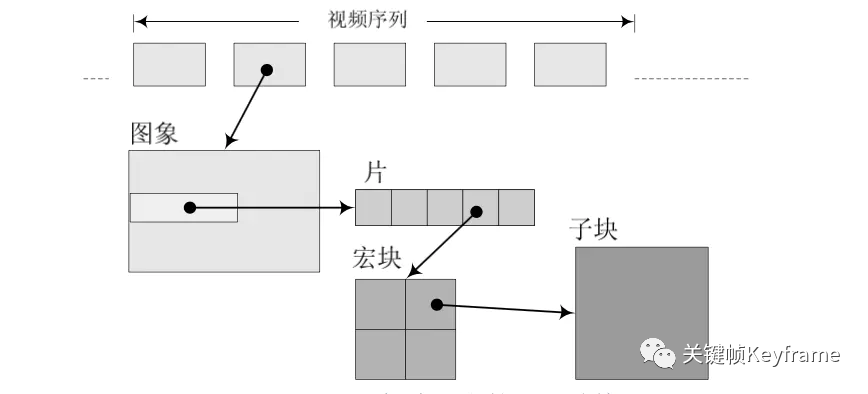

在 H.264 中，分层结构相较之前最大的不同是取消了序列层和图像层，并**将原本属于序列和图像头部的大部分句法元素游离出来形成序列和图像两级参数集**，其余的部分则放入片层。在这种机制下，由于参数集是独立的，可以被多次重发或者采用特殊技术加以保护。参数集与参数集外部的句法元素处于不同信道中，这是 H.264 的一个建议，我们可以使用更安全但成本更昂贵的通道来传输参数集。

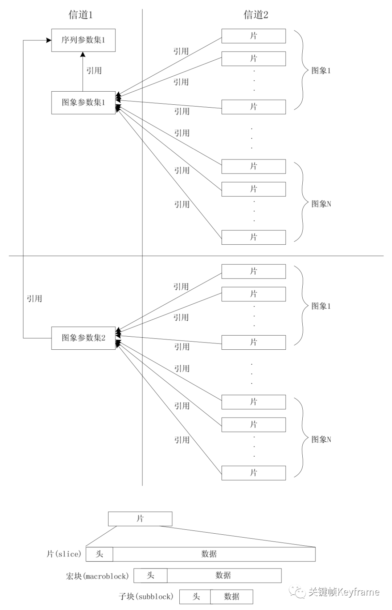

#### 1.1.2、软件和硬件编解码

编解码分为**软编软解和硬编硬解**：

  * 软编/软解: CPU 处理。

  * 硬编/硬解: 使用显卡 GPU、专用 SDP 等其它芯片硬件处理。

软编用的是 CPU 处理，优点是调节能力比较强，相对于硬编，软编可以通过参数调整可以在同一码率下编码出清晰度更高的视频，此外软编可以兼容性更好，可以适配所有设备，但缺点是性能可能比较差，不如硬编速度快、功耗低。

软解相对于硬解，则是性能可能较差，不如硬解功耗低，但是兼容性更好，适配性更好。

目前移动应用大部分业务场景采用的编码策略是：手机端尽量采用硬编编码出一路高清的视频，将高清视频发送给服务器，由服务器再进行软编转码为多路码率的视频，再通过CDN 分发给观看端。另外，安卓的一些低端机可能由于硬件问题对硬编支持不完善，这时候可以使用软编，或者硬编出错的情况可以切换为软编来兜底。当然有时候，对于一些性能优越的高端机型或者编码时长不多的业务场景也可以优先用软编，例如录制 15 秒短视频的场景，首先时间比较短并且机器性能高不怕 CPU 消耗，这样相同码率可以再提高清晰度。

对于大部分的应用场景的解码策略则主要采用硬解，用软解作为兜底。此外，对于一些硬解不支持的编码类型，可以使用软解，比如有的机型不支持 H.265 解码，则只能使用软解。

#### 1.1.3、序列

H.264 编码的方式可以这样理解：在视频中，一段时间内相邻的图像的像素、亮度与色温的差别通常很小。所以没必要去对一段时间内的每一幅图像都进行完整一帧的编码，而是可以选取这段时间的第一帧图像进行完整编码，而下一幅图像只记录与第一帧完整编码图像的像素、亮度与色温等特征的差别即可，以此类推循环下去。

什么叫序列呢？上述的这段时间内图像变化不大的图像集就可以称之为一个序列。**序列可以理解为有相同特点的一段图像数据。**但是如果某个图像与之前的图像变换很大，很难参考之前的帧来生成新的帧，那么就结束上一个序列，开始下一个序列。重复上述做法，生成新的一段序列。

#### 1.1.4、帧类型

H.264 结构中，一幅视频图像编码后的数据叫做一帧，一帧由一个片（slice）或多个片组成，一个片由一个或多个宏块（MB）组成，一个宏块由 `16x16` 的 YUV 数据组成。宏块是 H.264 编码的基本单位。

在 H.264 协议内定义了三种帧，分别是 I 帧、B 帧与 P 帧。

##### 1）I 帧

**I 帧，即帧内编码图像帧，不参考其他图像帧，只利用本帧的信息进行编码。**

I 帧的特点：

  * 它是一个全帧压缩编码帧，将全帧图像信息进行压缩编码及传输；

  * 解码时仅用 I 帧的数据就可重构完整图像；

  * I 帧描述了图像背景和运动主体的详情；

  * I 帧不需要参考其他画面而生成；

  * I 帧是 P 帧和 B 帧的参考帧，其质量直接影响到同组中以后各帧的质量；

  * 一般地，I 帧是图像组 GOP 的基础帧（第一帧），在一组中只有一个 I 帧；

  * I 帧所占数据的信息量比较大。

I 帧编码流程：

  * 进行帧内预测，决定所采用的帧内预测模式；

  * 当前像素值减去预测值，得到残差；

  * 对残差进行变换和量化；

  * 变长编码和算术编码；

  * 重构图像并滤波，得到的图像作为其它帧的参考帧。

##### 2）P 帧

**P 帧，即预测编码图像帧，利用之前的 I 帧或 P 帧，采用运动预测的方式进行帧间预测编码。**

P 帧的预测与重构：P 帧是以 I 帧为参考帧，在 I 帧中找出 P 帧『某点』的预测值和运动矢量，取预测差值和运动矢量一起传送。在接收端根据运动矢量从 I 帧中找出 P 帧『某点』的预测值并与差值相加以得到 P 帧『某点』样值，从而可得到完整的 P 帧。

P 帧特点：

  * P 帧是 I 帧后面相隔 1-2 帧的编码帧；

  * P 帧采用运动补偿的方法传送它与前面的 I 或 P 帧的差值及运动矢量（预测误差）；

  * P 帧属于前向预测的帧间编码，它只参考前面最靠近它的 I 帧或 P 帧；

  * P 帧可以是其后面 P 帧的参考帧，也可以是其前后的 B 帧的参考帧；

  * 由于 P 帧是参考帧，它可能造成解码错误的扩散；

  * 由于是差值传送，P 帧的压缩比较高。

P 帧编码的基本流程：

  * 进行运动估计，计算采用帧间编码模式的率失真函数值。P 帧只参考前面的帧；

  * 进行帧内预测，选取率失真函数值最小的帧内模式与帧间模式比较，确定采用哪种编码模式；

  * 计算实际值和预测值的差值；

  * 对残差进行变换和量化；

  * 若编码，如果是帧间编码模式，编码运动矢量。

##### 3）B 帧

**B 帧，即双向预测编码图像帧，提供最高的压缩比，它既需要之前的图像帧（I 帧或 P 帧），也需要后来的图像帧（P 帧），采用运动预测的方式进行帧间双向预测编码。**

B 帧的预测与重构：B 帧以前面的 I 或 P 帧和后面的 P 帧为参考帧，找出 B 帧『某点』的预测值和两个运动矢量，并取预测差值和运动矢量传送。接收端根据运动矢量在两个参考帧中找出预测值并与差值求和，得到 B 帧『某点』样值，从而可得到完整的 B 帧。

B 帧特点：

  * B 帧是由前面的 I 或 P 帧和后面的 P 帧来进行预测的；

  * B 帧传送的是它与前面的 I 或 P 帧和后面的 P 帧之间的预测误差及运动矢量；

  * B 帧是双向预测编码帧；

  * B 帧压缩比最高，因为它只反映两参考帧间运动主体的变化情况，预测比较准确；

  * B 帧不是参考帧，不会造成解码错误的扩散。

B 帧编码的基本流程：

  * 进行运动估计，计算采用帧间编码模式的率失真函数值。B 帧可参考后面的帧；

  * 进行帧内预测，选取率失真函数值最小的帧内模式与帧间模式比较，确定采用哪种编码模式；

  * 计算实际值和预测值的差值；

  * 对残差进行变换和量化；

  * 若编码，如果是帧间编码模式，编码运动矢量。

> 率失真函数的相关简介：
>
> 有损压缩算法，性能由**编码输出的比特率**和**失真**共同决定。
>
> **编码的目的**：就是在保证一定视频质量的条件下尽量减少编码比特率，或在一定编码比特率限制条件下尽量地减小编码失真。
>
> **编码器的工作**：根据以上率失真准则找到最佳编码参数。
>
> **信息论中率失真概念**：在允许一定程度失真的条件下，能够把信源信息压缩到什么程度，即最少需要多少比特数才能描述信源。由此得到率失真函数：`R(D) = min I(X, Y)`，它给出了限定失真条件下信息压缩允许的下界。但其在视频编码中难以应用，因为各种概率和条件概率未知，只能作为理论值。
>
> **视频编码中的率失真曲线**：为了研究视频码率与视频质量的平衡。由于系统性，不能达到理论上的 R(D) 值，只能由不同的编码参数（如 QP 和选择的模式）得到有限的 (R, D) 可操作点，形成凸包络。
>
> **视频编码中的率失真优化（RDO）**：遍历所有的参数候选模式对视频进行编码，满足码率限制的失真最小的一组参数集作为最优的视频编码参数。每一层级都找出，最终使整体系统性能最优。这里假设了无相关性的独立优化，如相关性较强则共同优化。

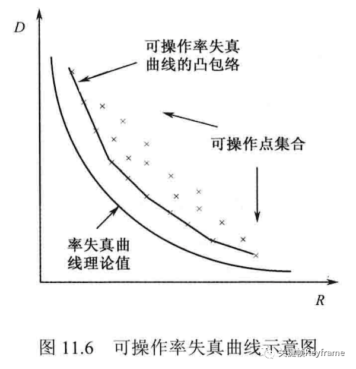

#### 1.1.5、DTS 和 PTS

DTS、PTS 的概念如下所述：

  * **DTS（Decoding Time Stamp）：即解码时间戳，这个时间戳的意义在于告诉播放器该在什么时候解码这一帧的数据。**

  * **PTS（Presentation Time Stamp）：即显示时间戳，这个时间戳用来告诉播放器该在什么时候显示这一帧的数据。**

需要注意的是：虽然 DTS、PTS 是用于指导播放端的行为，但它们是在编码的时候由编码器生成的。

当视频流中没有 B 帧时，通常 DTS 和 PTS 的顺序是一致的。但如果有 B 帧时，就回到了我们前面说的问题：解码顺序和播放顺序不一致了。

比如一个视频中，帧的显示顺序是：I B B P，现在我们需要在解码 B 帧时知道 P 帧中信息，因此这几帧在视频流中的顺序可能是：I P B B，这时候就体现出每帧都有 DTS 和 PTS 的作用了。DTS 告诉我们该按什么顺序解码这几帧图像，PTS 告诉我们该按什么顺序显示这几帧图像。顺序大概如下：

```
Stream: I P B B  
   DTS: 1 2 3 4  
   PTS: 1 4 2 3
```

#### 1.1.6、GOP

**GOP（Group Of Pictures）是图像组的概念，它指的是视频编码序列中两个 I 帧之间的距离。**通常意义上的 GOP 由 I 帧开始，到下一个 I 帧之前的帧结束。严格意义上讲，这个 I 帧是一个 IDR 帧。

H.264 使用的是封闭 GOP（Closed GOP），即在一个 GOP 中所有帧的解码不依赖该 GOP 外的其他帧，除了第一帧必须是 I 帧，其他帧可以是 P 帧或 B 帧。

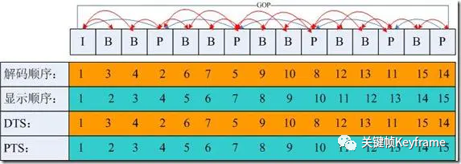

上图中是一个 GOP 为 15 帧的例子，如果视频的帧率是 15 fps，那么这个 GOP 就是 1s 时长。

关键帧的间隔调节会影响 GOP 的长度，进而影响到读取 GOP 的速度，为防止运动变化，一个 GOP 组内帧数不宜取多。如果关键帧的间隔设置过大的话（GOP 长度过大），在必须用到关键帧的场合就可能被迫使用 B/P 帧来代替，这就会降低画面质量。

#### 1.1.7、IDR 帧

**IDR 帧全称叫做 Instantaneous Decoder Refresh，是 I 帧的一种。IDR 帧的作用是立刻刷新，重新算一个新的序列开始编码，使错误不致传播。**I 帧有被跨帧参考的可能，但 IDR 帧不会。

比如：

`IDR1 P2 B3 B4 P5 B6 B7 I8 B9 B10 P11 B12 B13 P14 B15 B16`

这里的 B8 可以跨过 I8 去参考 P7。

`IDR1 P2 B3 B4 P5 B6 B7 IDR8 B9 B10 P11 B12 B13 P14 B15 B16`

这里的 B9 就不可以参考 IDR8 前面的帧。

H.264 引入 IDR 帧是为了解码的重同步，当解码器解码到 IDR 帧时，立即将参考帧队列清空，将已解码的数据全部输出或抛弃，重新查找参数集，开始一个新的序列。这样，如果前一个序列出现错误，在这里可以获得重新同步的机会，不会将错误传导下去。IDR 帧之后的帧永远不会使用 IDR 帧之前的帧来解码。

所以总结下来，IDR 帧有如下特性：

  * IDR 帧一定是 I 帧，严格来说 I 帧不一定是 IDR 帧（但一般 I 帧就是 IDR 帧）；

  * 对于 IDR 帧来说，在 IDR 帧之后的所有帧都不能引用任何 IDR 帧之前的帧的内容。与此相反，对于普通的 I 帧来说，位于其之后的 B 和 P 帧可以引用位于普通 I 帧之前的 I 帧（普通 I 帧有被跨帧参考的可能）；

  * 播放器永远可以从一个 IDR 帧播放，因为在它之后没有任何帧引用之前的帧。因此，视频开头的 I 帧一定是 IDR 帧；一个封闭类 GOP 的开头的 I 帧也一定是 IDR 帧。

#### 1.1.8、压缩方式

**H.264 采用的核心算法是『帧内压缩』和『帧间压缩』，帧内压缩是生成 I 帧的算法，帧间压缩是生成 B 帧和 P 帧的算法。**

**帧内压缩也称为空间压缩**。当压缩一帧图像时，仅考虑本帧的数据而不考虑相邻帧之间的冗余信息，这实际上与静态图像压缩类似。帧内一般采用有损压缩算法，由于帧内压缩是编码一个完整的图像，所以可以独立的解码、显示。帧内压缩一般达不到很高的压缩率，跟编码 JPEG 差不多。

帧间压缩的原理是：相邻几帧的数据有很大的相关性，或者说前后两帧信息变化很小的特点。也即连续的视频其相邻帧之间具有冗余信息，根据这一特性，压缩相邻帧之间的冗余量就可以进一步提高压缩量，减小压缩比。**帧间压缩也称为时间压缩**，它通过比较时间轴上不同帧之间的数据进行压缩。帧间压缩一般是无损的。帧差值算法是一种典型的时间压缩法，它通过比较本帧与相邻帧之间的差异，仅记录本帧与其相邻帧的差值，这样可以大大减少数据量。

编码压缩的步骤大致如下：

  * 分组，也就是将一系列变换不大的图像归为一个组，也就是一个序列，也就是 GOP；

  * 定义帧，将每组的图像帧归分为 I 帧、P 帧和 B 帧三种类型；

  * 预测帧，以 I 帧做为基础帧，以 I 帧预测 P 帧，再由 I 帧和 P 帧预测 B 帧；

  * 数据传输，最后将 I 帧数据与预测的差值信息进行存储和传输。

### 1.2、分层结构

**H.264 的主要目标是为了有高的视频压缩比和良好的网络亲和性，为了达成这两个目标，H.264 的解决方案是将系统框架分为两个层面：『视频编码层面（VCL）』和『网络抽象层面（NAL）』。**

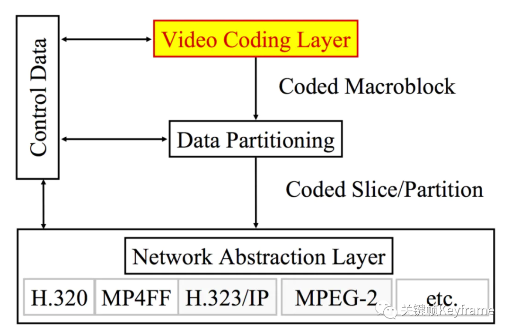

  * **视频编码层（VCL）**，是对视频编码核心算法过程、子宏块、宏块、片等概念的定义。这层主要是为了尽可能的独立于网络来高效的对视频内容进行编码。编码完成后，输出的数据是 SODB（String Of Data Bits）。

  * **网络适配层（NAL）**，是对图像序列、图像等片级别以上的概念的定义。这层负责将 VCL 产生的比特字符串适配到各种各样的网络和多元环境中。该层将 VCL 层输出的 SODB 数据打包成 RBSP（Raw Byte Sequence Payload）。SODB 是编码后的原始数据，RBSP 是在原始编码数据后面添加了结尾比特，一个比特 1 和若干个比特 0，用于字节对齐。然后再在 RBSP 头部加上 NAL Header 来组成一个一个的 NAL 单元。

从视频编码层（VCL）角度去看 H.264 的结构：

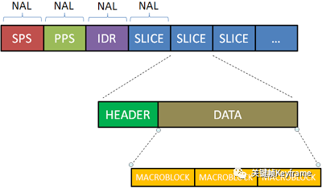

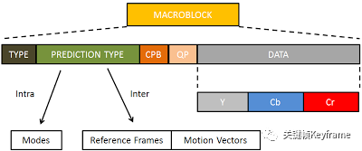

从网络适配层（NAL）角度去看 H.264 的结构：


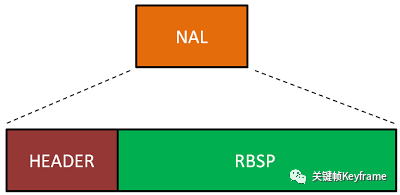

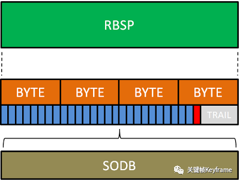

### 1.3、编码工具

下图为一个典型的视频编码器。在进行当前信号编码时，编码器首先会产生对当前信号做预测的信号，称作**预测信号**（Predicted Signal），预测的方式可以是时间上的帧间预测（Inter Prediction），亦即使用先前帧的信号做预测，或是空间上的帧内预测（Intra Prediction），亦即使用同一张帧之中相邻像素的信号做预测。得到预测信号后，编码器会将当前信号与预测信号相减得到**残差信号**（Residual S ignal），并只对残差信号进行编码，如此一来，可以去除一部分时间上或是空间上的冗余信息。接着，编码器并不会直接对残差信号进行编码，而是先将残差信号经过**变换**（通常为离散余弦变换）然后**量化**以进一步去除空间上和感知上的冗余信息。量化后得到的量化系数会再透过**熵编码**，去除统计上的冗余信息。

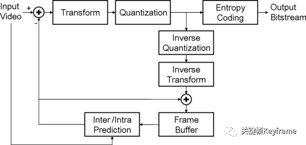

H.264 的编解码流程如下：

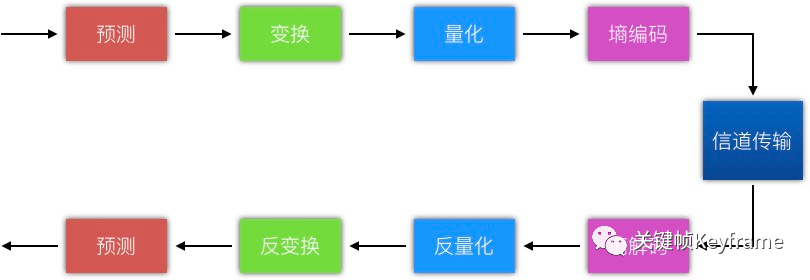

#### 1.3.1、帧内预测

一般来说，对于一帧图像，相邻两个像素的亮度和色度值之间通常是比较接近的，也就是颜色是逐渐变化的，不会一下子突变成完全不一样的颜色。而进行视频编码，目的就是利用这个相关性，来进行压缩。帧内预测就是基于这个原理。

假设现在我们要对一个像素 X 进行编码，在编码这个像素之前，我们找到它临近的像素作为参考像素 X’，根据 X’ 我们经过预测算法得到对像素 X 的预测值 Xp，然后我们再用 X 减去 Xp 得到二者的残差 D，并用这个残差 D 代替 X 进行编码，起到节省码率的作用。最后，我们还用预测值 Xp 和残差 D 相加得到 X’ 用于下一个像素的预测。这个就是我们用帧内预测进行编码压缩的大体思想。

在实际编码中，我们固然可以按像素为单位进行预测，但这样效率比较低，所以在 H.264 标准中提出按照块为单位进行计算。一个宏块是 16x16 像素，它可以分成子块，最小是 4x4 的（这个大小是对于亮度编码而言，至于色度编码，4:2:0 采样格式的色度宏块的长和宽都是亮度宏块的一半），这样能大大提高计算速度。

在帧内预测模式中，预测块是基于已编码重建的块和当前块形成的。对亮度像素而言，预测块用于 4×4 子块或者 16×16 宏块的相关操作。4×4 亮度子块有 9 种可选预测模式，独立预测每一个 4×4 亮度子块，适用于带有大量细节的图像编码；16×16 亮度块有 4 种预测模式，预测整个 16×16 亮度块，适用于平坦区域图像编码；色度块也有 4 种预测模式，类似于 16×16 亮度块预测模式。编码器通常选择使预测块和编码块之间差异最小的预测模式。

#### 1.3.2、帧间预测

帧间预测就是时域预测，旨在消除时域冗余信息，简单点说就是利用之前编码过的图像来预测要编码的图像。其中涉及到两个重要的概念：运动估计和运动补偿。

运动估计是寻找当前编码的块在已编码的图像（参考帧）中的最佳对应块，并且计算出对应块的偏移（运动矢量）。

运动补偿是根据运动矢量和帧间预测方法，求得当前帧的估计值过程。其实就是将运动矢量参数贴到参考帧上获取当前帧。另外运动补偿是一个过程。

H.264 帧间预测是利用已编码视频帧/场和基于块的运动补偿的预测模式。与以往标准帧间预测的区别在于块尺寸范围更广（从 16×16 到 4×4）、亚像素运动矢量的使用（亮度采用 1/4 像素精度 MV）及多参考帧的运用等等。

每个宏块（16×16 像素）可以 4 种方式分割：一个 16×16，两个 16×8，两个 8×16，四个 8×8。其运动补偿也相应有四种。而 8×8 模式的每个子宏块还可以四种方式分割：一个 8×8，两个 4×8 或两个 8×4 及 4 个 4×4。这些分割和子宏块大大提高了各宏块之间的关联性。这种分割下的运动补偿则称为树状结构运动补偿。

每个分割或子宏块都有一个独立的运动补偿。每个 MV 必须被编码、传输，分割的选择也需编码到压缩比特流中。对大的分割尺寸而言， MV 选择和分割类型只需少量的比特，但运动补偿残差在多细节区域能量将非常高。小尺寸分割运动补偿残差能量低，但需要较多的比特表征 MV 和分割选择。分割尺寸的选择影响了压缩性能。整体而言，大的分割尺寸适合平坦区域，而小尺寸适合多细节区域。

宏块的色度成分（Cr 和 Cb）则为相应亮度的一半（水平和垂直各一半）。色度块采用和亮度块同样的分割模式，只是尺寸减半（水平和垂直方向都减半）。例如，8×16 的亮度块相应色度块尺寸为 4×8，8×4 亮度块相应色度块尺寸为 4×2 等等。色度块的 MV 也是通过相应亮度 MV 水平和垂直分量减半而得。

#### 1.3.3、变换和量化

绝大多数图像都有一个共同的特征：平坦区域和内容缓慢变化区域占据一幅图像的大部分，而细节区域和内容突变区域则占小部分。也可以说，图像中直流和低频区占大部分，高频区占小部分。这样，空间域的图像变换到频域或所谓的变换域，会产生相关性很小的一些变换系数，并可对其进行压缩编码，即所谓的变换编码。

此外，为了减小图像编码的动态范围，一般也会进行量化。

在图像编码中，变换编码和量化从原理上讲是两个独立的过程。但在 H.264 中，将两个过程中的乘法合二为一，并进一步采用整数运算，减少编解码的运算量，提高图像压缩的实时性。

H.264 对图像或预测残差采用了 4×4 整数离散余弦变换（DCT）技术，避免了以往标准中使用的通用 8×8 离散余弦变 换逆变换经常出现的失配问题。量化过程根据图像的动态范围大小确定量化参数，既保留图像必要的细节，又减少码流。

#### 1.3.4、熵编码

熵的大小与信源的概率模型有着密切的关系，各个符号出现的概率不同，信源的熵也不同。当信源中各事件是等概率分布时，熵具有极大值。信源的熵与其可能达到的最大值之间的差值反映了该信源所含有的冗余度。信源的冗余度越小，即每个符号所独立携带的信息量越大，那么传送相同的信息量所需要的序列长度越短，符号位越少。因此，数据压缩的一个基本的途径是去除信源的符号之间的相关性，尽可能地使序列成为无记忆的，即前一符号的出现不影响以后任何一个符号出现的概率。

利用信源的统计特性进行码率压缩的编码就称为熵编码，也叫统计编码。熵编码是无损压缩编码方法，它生成的码流可以经解码无失真地恢复出原数据。熵编码是建立在随机过程的统计特性基础上的。

视频编码常用的有两种：变长编码（哈夫曼编码）、算术编码。

H.264 最后将结果进行熵编码，分为`上下文自适应的变长编码（Context-based Adaptive Variable-Length Coding，CAVLC）`与`上下文自适应的二进制算术编码（Context-based Adaptive Binary Arithmetic Coding，CABAC）`。

在 H.264 的 CAVLC（基于上下文自适应的可变长编码）中，通过根据已编码句法元素的情况动态调整编码中使用的码表，取得了极高的压缩比。CAVLC 用于亮度和色度残差数据的编码。残差经过变换量化后的数据表现出如下特性：4×4 块数据经过预测、变换、量化后，非零系数主要集中在低频部分，而高频系数大部分是零；量化后的数据经过 zig-zag 扫描，DC 系数附近的非零系数值较大，而高频位置上的非零系数值大部分是 +1 和 -1；相邻的 4×4 块的非零系数的数目是相关的。CAVLC 充分利用残差经过整数变换、量化后数据的特性进行压缩，进一步减少数据中的冗余信息，为 H.264 卓越的编码效率奠定了基础。

算术编码的思想是用 0 到 1 的区间上的一个数来表示一个字符输入流，它的本质是为整个输入流分配一个码字，而不是给输入流中的每个字符分别指定码字。算术编码是用区间递进的方法来为输入流寻找这个码字的，它从于第一个符号确定的初始区间（0 到 1）开始，逐个字符地读入输入流，在每一个新的字符出现后递归地划分当前区间，划分的根据是各个字符的概率，将当前区间按照各个字符的概率划分成若干子区间，将当前字符对应的子 2 区间取出，作为处理下一个字符时的当前区间。到处理完最后一个字符后，得到了最终区间，在最终区间中任意挑选一个数作为输出。解码器按照和编码相同的方法和步骤工作，不同的是作为逆过程，解码器每划分一个子区间就得到输入流中的一个字符。在实际过程中，输入流中字符的概率分布是动态改变的，这需要维护一个概率表去记录概率变化的信息。在作递进计算时，通过对概率表中的值估计当前字符的概率，当前字符处理后，需要重新刷新概率表。这个过程表现为对输入流字符的自适应。编码器和解码器按照同样的方法估计和刷新 概率表，从而保证编码后的码流能够顺利解码。

用哈夫曼编码，必须为所有可能的长度为 N 的序列设计和存储码书，这样做的复杂度随 N 呈指数增长。用算术编码则不需要预先为每个可能的信源序列指定码书。而是每当所确定区间的下限和上限有公共最高有效位时，就可以连续地得到比特。编码序列的长度可以和信源的长度一样长。因此，实际上，算术编码可以更接近熵率。

算术编码的另一个优点是可以简单地通过更新符号概率表来实现对信源统计特性的自适应。通过对不同上下文用不同的概率表也可以容易地实现条件编码。对于哈夫曼编码，则不得不基于更新的概率表重新设计码书，或对不同的上下文设计多个码表。

由于较高的编码效率和易于自适应，只要所涉及的计算量是能接受的，无疑算术编码比哈夫曼编码是一种更好的选择。

### 1.4、码流结构

#### 1.4.1、原始码流

H.264 原始码流（又称为裸流），是由一个接一个的 NAL 单元组成的（NAL Header 加上 RBSP 组成一个 NAL 单元），结构如下图所示：


在网络传输的环境下，编码器将每个 NAL 各自独立、完整地放入一个分组，由于分组都有头部，解码器可以很方便地检测出 NAL 的分界，依次取出 NAL 进行解码。为了节省码流，H.264 没有另外在 NAL 的头部设立表示起始的句法元素。但是如果编码数据是储存在介质（如 DVD 光盘）上，由于 NAL 是依次紧密排列，解码器将无法在数据流中分辨每个 NAL 的起始和终止，所以必须要有另外的机制来解决这个问题。

针对这个问题，H.264 草案的附录 B 中指明了一种简单又高效的方案。当数据流是存储在介质上时，在每个 NAL 前添加**起始码**：`0x000001`。这就是我们常说的 **Annex-b 码流格式**。

在某些类型的介质上，为了寻址的方便，要求数据流在长度上对齐，或必须是某个常数的倍数。考虑到这种情况，H.264 建议在起始码前添加若干字节的 0 来填充，直到该 NAL 的长度符合要求。在这样的机制下，解码器在码流中检测起始码，作为一个 NAL 的起始标识，当检测到下一个起始码时当前 NAL 结束。H.264 规定当检测到 `0x00000001` 时也可以表征上一个 NAL 的结束，下一个 NAL 开始，这是因为连着的三个字节的 0 中的任何一个字节的 0 要么属于起始码要么是起始码前面添加的 0。

添加起始码是一个解决问题的很好的方法，但上面关于起始码的介绍还不完整，因为忽略了一个重要的问题：如果在 NAL 内部出现了 `0x000001` 或是 `0x00000001` 的序列怎么办？毫无疑问这种情况是致命的，解码器将把这些本来不是起始码的字节序列当作起始码，而错误地认为这里往后是一个新的 NAL 的开始，进而造成解码数据的错位！而我们做的大量实验证明，NAL 内部经常会出现这样的字节序列。因为 `0x000001` 的情况是覆盖 `0x00000001` 的情况，所以下面值讨论如何处理 `0x000001` 即可。

于是 H.264 提出了另外一种机制，叫做**防止竞争**，在编码器编码完一个 NAL 时，应该检测是否出现下表左侧中的四个字节序列，以防止它们和起始码竞争。如果检测到这些序列存在，编码器将在最后一个字节前插入一个新的字节：`0x03`，从而使它们变成下表右侧的样子。当解码器在 NAL 内部检测到有 `0x000003` 的序列时，将把 `0x03` 抛弃，恢复原始数据。

```
0x000000 → 0x00000300  
0x000001 → 0x00000301  
0x000002 → 0x00000302  
0x000003 → 0x00000303
```

上表中的前两个序列我们前文中已经提到，第三个 `0x000002` 是作保留用，而第四个 `0x000003`是为了保证解码器能正常工作，因为我们刚才提到，解码器恢复原始数据的方法是检测到 `0x000003` 就抛弃其中的 `0x03`，这样当出现原始数据为 `0x000003` 时会破坏数据，所以必须也应该给这个序列插入 `0x03`。

解码器在逐个字节地读一个 NAL 时并不同时对它解码，而是要通过起始码机制将整个 NAL 读进、计算出长度后再开始解码。

到此，我们就知道如何在原始码流里分割 NAL 单元了。接下来，我们再来了解每个 NAL 单元的结构。

#### 1.4.2、NAL 单元

NAL 单元由 NAL Header 和 RBSP 构成。

NAL Header 的结构如下：


  * `forbidden_zero_bit`，第 0 位，表示禁止位，一般为值为 0，值为 1 表示语法错误。

  * `nal_ref_idc`，第 1-2 位，表示当前 NAL 的优先级。取值范围为 0-3，值越高，表示当前 NAL 越重要，需要优先受到保护。H.264 规定如果当前 NAL 是属于参考帧的片，或是序列参数集，或是图像参数集这些重要的数据单位时，本句法元素必须大于 0。但在大于 0 时具体该取何值，却没有进一步规定，通信双方可以灵活地制定策略。

  * `nal_unit_type`，第 3-7 位，表示当前 NAL 单元的类型。具体类型定义如下表：

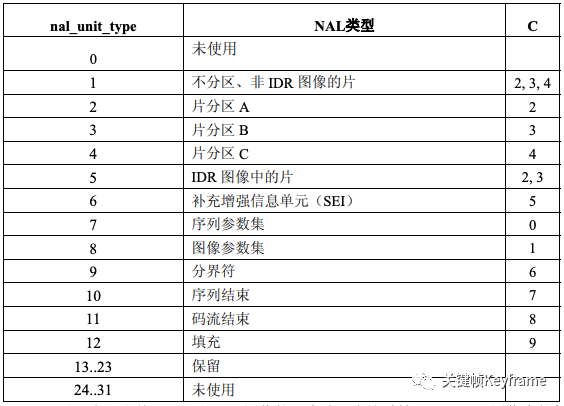

`nal_unit_type=5` 时，表示当前 NAL 是 IDR 图像的一个片，在这种情况下，IDR 图像中的每个片的 `nal_unit_type` 都应该等于 5。注意 IDR 图像不能使用片分区。

#### 1.4.3、RBSP

前面也介绍过，RBSP 指原始字节载荷，它是 NAL 单元的数据部分的封装格式，封装的数据来自 SODB（原始数据比特流）。SODB 是编码后的原始数据，SODB 经封装为 RBSP 后放入 NAL 的数据部分。

从 SODB 到 RBSP 的生成过程：

  * 如果 SODB 内容是空的，生成的 RBSP 也是空的。

  * 否则，RBSP 由如下的方式生成：

    * 1）RBSP 的第一个字节直接取自 SODB 的第 1-8 个比特，（RBSP 字节内的比特按照从左到右对应为从高到低的顺序排列，most significant），以此类推，RBSP 其余的每个字节都直接取自 SODB 的相应比特。RBSP 的最后一个字节包含 SODB 的最后几个比特和 `rbsp_trailing_bits()`。

    * 2）`rbsp_trailing_bits()` 的第一个比特是 1，接下来填充 0，直到字节对齐。

    * 3）最后添加若干个 `cabac_zero_word`，其值等于 `0x0000`。

#### 1.4.4、NAL 单元的不同类型

上面讲到了 NAL 单元是有多种类型的，这里我们就其中重要的几种类型做一下讲解：

  * SPS

  * PPS

  * SEI

  * Slice

序列参数集、图像参数集与图像、片之间的关系：

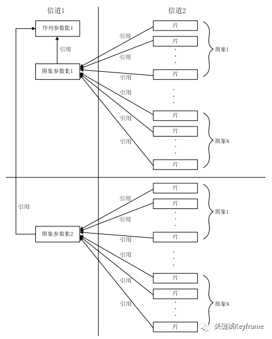

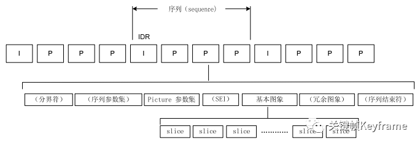

##### 1）序列参数集 SPS

**SPS 中保存了一组编码后的图像序列的依赖的全局参数。**

SPS 中的信息至关重要，如果其中的数据丢失，解码过程就可能失败。SPS 和 PPS 通常作为加码器的初始化参数。一般情况，SPS 和 PPS 所在的 NAL 单元位于整个码流的起始位置，但是在某些场景下，在码率中间也可能出现这两种结构：

  * 解码器要在码流中间开始解码。比如，直播流。

  * 编码器在编码过程中改变了码率的参数。比如，图像的分辨率。

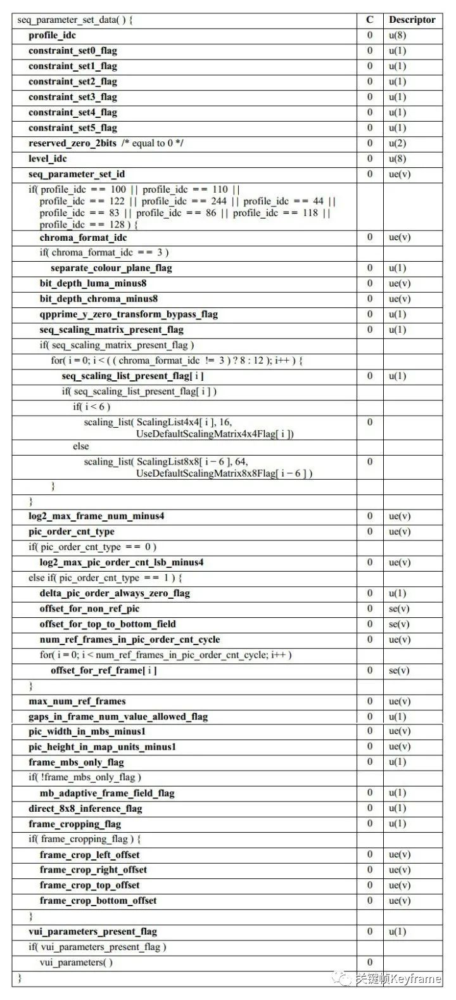

SPS 其中的关键参数包括：

  * `profile_idc`: 表示当前 H.264 码流的编码档次。其中部分档次：

    * 基础档次：BaselineProfile (`profile_idc` 值为 66)

    * 主要档次：MainProfile (`profile_idc` 值为 77)

    * 扩展档次：ExtentedProfile (`profile_idc` 值为 88)

  * `level_idc`，表示当前码流的编码等级。编码的等级定义了某种条件下的最大视频分辨率、最大视频帧率等参数。

  * `seq_parameter_set_id`，表示当前的序列参数集的 id。通过该 id 值，图像参数集 PPS 可以引用其关联的 SPS 中的参数。

  * `log2_max_frame_num_minus4`，用于计算 `MaxFrameNum` 的值。计算公式为 `MaxFrameNum = 2 ^ (log2_max_frame_num_minus4 + 4)`。变量 `MaxFrameNum` 表示 `frame_num` 的最大值，`frame_num` 标识所属图像的解码顺序，在解码过程中它也是一个非常重要的变量。值得注意的是 `frame_num` 是循环计数的，即当它到达 `MaxFrameNum` 后又从 0 重新开始新一轮的计数。解码器必须要有机制检测这种循环，不然会引起类似千年虫的问题，在图像的顺序上造成混乱。

  * `pic_order_cnt_type`，指明了 POC(Picture Order Count) 的编码方法，POC 标识图像的播放顺序。由于 H.264 使用了 B 帧预测，使得图像的解码顺序并不一定等于播放顺序，但它们之间存在一定的映射关系。POC 可以由 frame-num 通过映射关系计算得来，也可以索性由编码器显式地传送。H.264 中一共定义了三种 POC 的编码方法，这个句法元素就是用来通知解码器该用哪种方法来计算 POC。

  * `log2_max_pic_order_cnt_lsb_minus4`，用于计算 `MaxPicOrderCntLsb` 的值。计算公式为 `MaxPicOrderCntLsb = 2 ^ (log2_max_pic_order_cnt_lsb_minus4 + 4)`。`MaxPicOrderCntLsb` 表示 POC 的最大值，该变量在 `pic_order_cnt_type = 0` 时使用。

  * `num_ref_frames`，指定参考帧队列可能达到的最大长度，解码器依照这个句法元素的值开辟存储区，这个存储区用于存放已解码的参考帧，H.264 规定最多可用 16 个参考帧，本句法元素的值最大为 16。值得注意的是这个长度以帧为单位，如果在场模式下，应该相应地扩展一倍。

  * `gaps_in_frame_num_value_allowed_flag`，这个句法元素等于 1 时，表示允许句法元素 `frame_num` 可以不连续。当传输信道堵塞严重时，编码器来不及将编码后的图像全部发出，这时允许丢弃若干帧图像。在正常情况下每一帧图像都有依次连续的 `frame_num` 值，解码器检查到如果 `frame_num` 不连续，便能确定有图像被编码器丢弃。这时，解码器必须启动错误掩藏的机制来近似地恢复这些图像，因为这些图像有可能被后续图像用作参考帧。当这个句法元素等于 0 时，表不允许 `frame_num` 不连续，即编码器在任何情况下都不能丢弃图像。这时，H.264 允许解码器可以不去检查 `frame_num` 的连续性以减少计算量。这种情况下如果依然发生 `frame_num` 不连续，表示在传输中发生丢包，解码器会通过其他机制检测到丢包的发生，然后启动错误掩藏的恢复图像。

  * `pic_width_in_mbs_minus1`，本句法元素加 1 后指明图像宽度，以宏块为单位：`frame_width = 16 * (pic_width_in_mbs_minus1 + 1)`，宏块尺寸是 16x16。通过这个句法元素解码器可以计算得到亮度分量以像素为单位的图像宽度：`PicWidthInSamplesL = PicWidthInMbs * 16`，从而也可以得到色度分量以像素为单位的图像宽度：`PicWidthInSamplesC = PicWidthInMbs * 8`。以上变量 `PicWidthInSamplesL`、`PicWidthInSamplesC` 分别表示图像的亮度、色度分量以像素为单位的宽。**H.264 将图像的大小在 SPS 中定义，意味着可以在通信过程中随着 SPS 动态地改变图像的大小，甚至可以将传送的图像剪裁后输出。**

  * `pic_height_in_map_units_minus1`，本句法元素加 1 后指明图像高度：`PicHeightInMapUnits = pic_height_in_map_units_minus1 + 1`，`PicSizeInMapUnits = PicWidthInMbs * PicHeightInMapUnits`。图像的高度的计算要比宽度的计算复杂，因为一个图像可以是帧也可以是场，从这个句法元素可以在帧模式和场模式下分别计算出出亮度、色度的高。值得注意的是，这里以 `map_unit` 为单位。

  * `frame_mbs_only_flag`，本句法元素等于 0 时表示本序列中所有图像的编码模式都是帧，没有其他编码模式存在；本句法元素等于 1 时 ，表示本序列中图像的编码模式可能是帧，也可能是场或帧场自适应，某个图像具体是哪一种要由其他句法元素决定。结合 `map_unit` 的含义，这里给出上一个句法元素 `pic_height_in_map_units_minus1` 的进一步解析步骤：

    * 当 `frame_mbs_only_flag` 等于 1，`pic_height_in_map_units_minus1` 指的是一个 picture 中帧的高度；

    * 当 `frame_mbs_only_flag` 等于 0，`pic_height_in_map_units_minus1` 指的是一个 picture 中场的高度。

    * 所以可以得到如下以宏块为单位的图像高度：

    * `FrameHeightInMbs = ( 2 – frame_mbs_only_flag ) * PicHeightInMapUnits`。

    * `PictureHeightInMbs= ( 2 – frame_mbs_only_flag ) * PicHeightInMapUnits`。

##### 2）图像参数集 PPS

**PPS 中保存了每一帧编码后的图像所依赖的参数。**

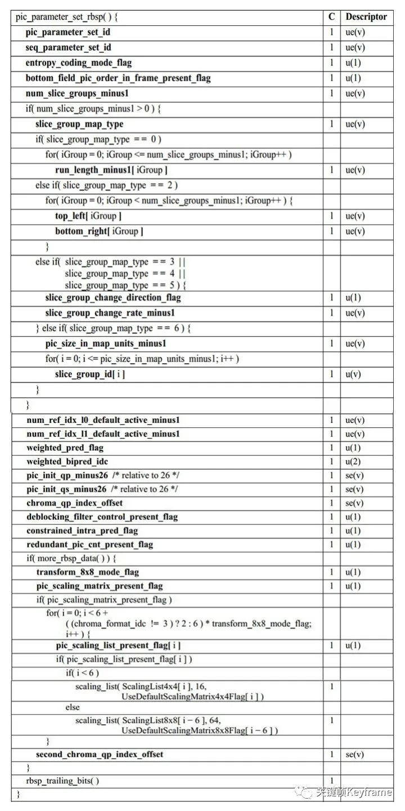

PPS 其中的关键参数包括：

  * `pic_parameter_set_id`，表示当前 PPS 的 id，相关联的各片通过这个 id 来引用对应的 PPS 参数。

  * `seq_parameter_set_id`，表示当前 PPS 引用的 SPS 的 id。

  * `entropy_coding_mode_flag`，表示熵编码的选择，本句法元素为 0 时，表示熵编码使用 `CAVLC`，本句  
法元素为 1 时表示熵编码使用 `CABAC`。

  * `pic_order_present_flag`，POC 的三种计算方法在片层还各需要用一些句法元素作为参数，本句法元素等于 1 时表示在片头会有句法元素表示这些参数；本句法元素等于 0 时，表示片头不会给出这些参数，这些参数使用默认值。

  * `num_slice_groups_minus1`，本句法元素加 1 后表示图像中片组的个数。H.264 中没有专门的句法元素用于表示是否使用片组模式，当本句法元素等于 0 （即只有一个片组），表示不使用片组模式，后面也不会跟有用于计算片组映射的句法元素。

  * `slice_group_map_type`，当 `num_slice_group_minus1` 大于 0，即使用片组模式时，本句法元素出现在码流中，用以表示片组分割类型。`map_units` 的定义：

    * 帧场自适应模式时，`map_units` 指的是宏块对；

    * 场模式时，`map_units` 指的是宏块；

    * 帧模式时，`map_units` 指的是与宏块对相类似的，上下两个连续宏块的组合体。

    * 当 `frame_mbs_only_flag` 等于 1 时，`map_units` 指的就是宏块；

    * 当 `frame_mbs_only_falg` 等于 0 时：

  * `num_ref_idx_l0_active_minus1`，加 1 后表示目前参考帧队列的长度，即有多少个参考帧（包括短期和长期）。值得注意的是，当目前解码图像是场模式下，参考帧队列的长度应该是本句法元素再乘以 2，因为场模式下各帧必须被分解以场对形式存在。（这里所说的场模式包括图像的场及帧场自适应下的处于场模式的宏块对） 本句法元素的值有可能在片头被重载。**在序列参数集中有句法元素 `num_ref_frames` 也是跟参考帧队列有关，它们的区别是 `num_ref_frames` 表示参考帧队列的最大值，解码器用它的值来分配内存空间；`num_ref_idx_l0_active_minus1` 表示在这个队列中当前实际的、已存在的参考帧数目，这从它的名字 active 中也可以看出来。**这个句法元素是 H.264 中最重要的句法元素之一，编码器要通知解码器某个运动矢量所指向的是哪个参考图像时，并不是直接传送该图像的编号，而是传送该图像在参考帧队列中的序号。这个序号并不是在码流中传送的，而是编码器和解码器同步地、用相同的方法将参考图像放入队列，从而获得一个序号。这个队列在每解一个图像，甚至是每个片后都会动态地更新。维护参考帧队列是编解码器十分重要的工作，而本句法元素是维护参考帧队列的重要依据。参考帧队列的复杂的维护机制是 H.264 重要也是很有特色的组成部分。

  * `num_ref_idx_l1_active_minus1` 与上一个句法元素的语义一致，只是本句法元素用于 list1，而上一句法元素用于 list0。

  * `constrained_intra_pred_flag`，在 P 和 B 片中，帧内编码的宏块的邻近宏块可能是采用的帧间编码。当本句法元素等于 1 时，表示帧内编码的宏块不能用帧间编码的宏块的像素作为自己的预测，即帧内编码的宏块只能用邻近帧内编码的宏块的像素作为自己的预测；而本句法元素等于 0 时，表示不存在这种限制。

##### 3）补充增强信息 SEI

**SEI 即补充增强信息（Supplemental Enhancement Information），属于码流范畴，它提供了向视频码流中加入额外信息的方法，是 H.264 标准的特性之一。**

SEI的基本特征如下：

  * 并非解码过程的必须选项；

  * 可能对解码过程（容错、纠错）有帮助；

  * 集成在视频码流中。

也就是说，视频编码器在输出视频码流的时候，可以不提供 SEI 信息。虽然在视频的传输过程、解封装、解码这些环节，都可能因为某种原因丢弃 SEI 内容，但在视频内容的生成端和传输过程中，是可以插入 SEI 信息的。这些插入的信息，和其他视频内容一同经过传输链路到达消费端。

SEI 是一种 NAL 单元类型。它的结构大致如下：

```
// H.264  
0x06，n 个 FF 字节 + 1 个非 FF 字节，16 字节 UUID，userData，0x80 或 0x0080
```

  * 开始码：H.264 中 SEI 的 NAL 单元类型是 0x06；H.264 中 SEI 的 NAL 单元类型是 0x4E、0x01。

  * 自定义：SEI 除了开始的 NAL 单元类型字段外，还存在不同的子类型。H.264 中第 2 个字节或者 H.265 中第 3 个字节 0x05 表示后续是自定义数据。

  * 负载长度：表示后续跟着的自定义数据长度，计算方法是：`n * 255 + XY`，也就是将数据长度减去 255，有多少个就写多少个 FF，剩下的如果不为 0，再写一个字节。

  * 负载内容：负载内容是 UUID + payload content。UUID 固定 16 个字节，用于区分不同的业务。payload content 表示自定义数据。

##### 4）片 Slice

**一帧图像可编码成一个或者多个片，每片包含整数个宏块，分片的目的是为了限制错误码的扩散和传输，使编码片相互间保持独立。**

片的结构:

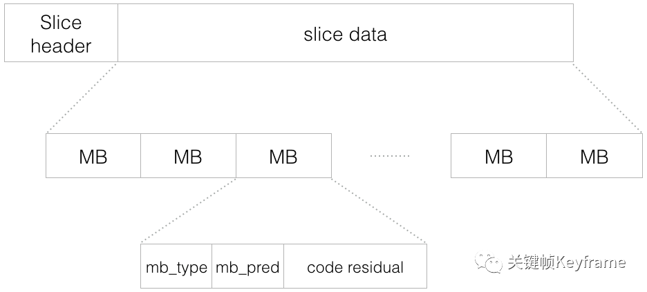

Slice 中的关键参数包括：

  * `slice_type`，表示当前片的类型。具体类型如下。其中，IDR 图像时，`slice_type` 等于 2、4、7、9。

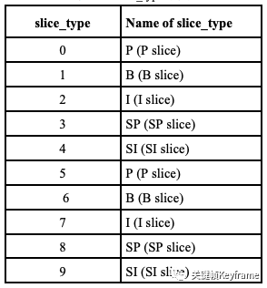

  * `pic_parameter_set_id`，表示引用的 PPS 的 id。

  * `frame_num`，表示解码顺序。每个参考帧都有一个依次连续的 `frame_num` 作为它们的标识，这指明了各图像的解码顺序。但事实上非参考帧的片头也会出现 `frame_num`。只是当该个图像是参考帧时，它所携带的这个句法元素在解码时才有意义。H.264 对 `frame_num` 的值作了如下规定：当参数集中的句法元素 `gaps_in_frame_num_value_allowed_flag` 不为 1 时，每个图像的 `frame_num` 值是它前一个参考帧的 `frame_num` 值增加 1。

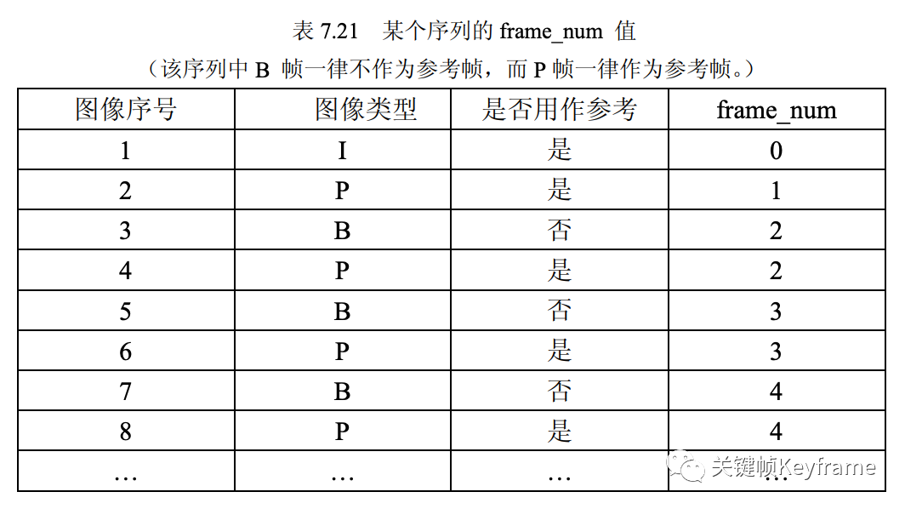

  * `field_pic_flag`，这是在片层标识图像编码模式的唯一一个句法元素。所谓的编码模式是指的帧编码、场编码、帧场自适应编码。

  * `idr_pic_id`，IDR 图像的标识。不同的 IDR 图像有不同的 `idr_pic_id` 值。值得注意的是，IDR 图像有不等价于 I 图像，只有在作为 IDR 图像的 I 帧才有这个句法元素，在场模式下，IDR 帧的两个场有相同的 `idr_pic_id` 值。`idr_pic_id` 的取值范围是 `[0，65535]`，和 `frame_num` 类似，当它的值超出这个范围时，它会以循环的方式重新开始计数。

  * `pic_order_cnt_lsb`，在 POC 的第一种算法中本句法元素来计算 POC 值，在 POC 的第一种算法中是显式地传递 POC 的值，而其他两种算法是通过 `frame_num` 来映射 POC 的值。

>（通过上文的介绍，我们了解了视频编码的理论基础，探讨了 H.264 视频编码的基本概念、编码工具、编码流程及码流结构。对于在 H.264 基础上迭代而来的 H.265 及 H.266 的编码工具及改进，我们将在后面继续探讨，敬请期待）

<hr>

#### <p>原文出处：<a href='https://mp.weixin.qq.com/s/CAgnEIaQQ-6lT1KjESRApA' target='blank'>视频编码（2）：H.265如何比H.264提升40%编码效率</a></p>

我们在前文[《视频编码（1）》](http://mp.weixin.qq.com/s?__biz=MjM5MTkxOTQyMQ==&mid=2257484471&idx=1&sn=421be18e5b591043f13996734c60780b&chksm=a5d4e6e592a36ff35c5b67267b2200801fb30bd40d31069286d676c8f6cb4e64cbc214389382&scene=21#wechat_redirect)中探讨了 H.264 视频编码的基本概念、编码工具、编码流程及码流结构等基础知识，接下来我们来继续探讨在 H.264 基础上迭代而生的 H.265有哪些改进，看看它是如何在同样的画面质量下将编码码率降下来的。本文内容包括如下章节：  

## 2、H.265 编码

### 2.1、编码工具

H.265 的标准编码框架如图所示：

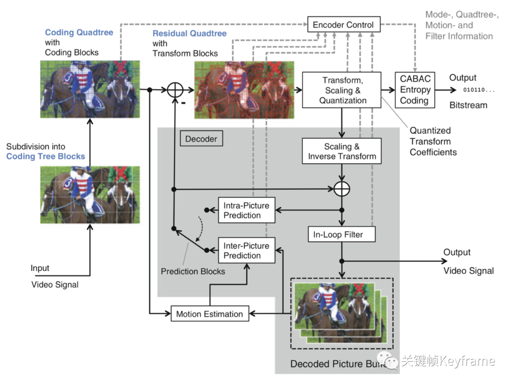

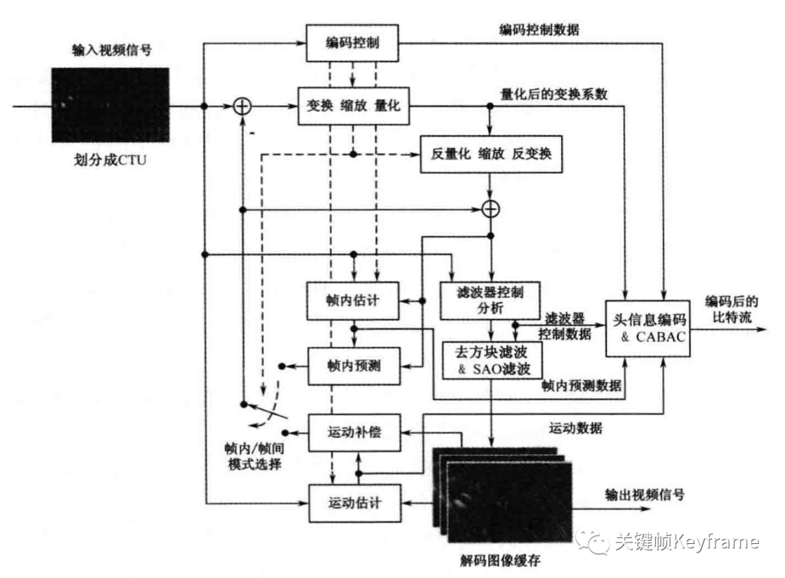

从根本上讲，H.265 视频编码标准的编码框架并没有革命性的改变，仍旧采用混合编码框架，包括帧内预测、帧间预测、变换量化、环路滤波、熵编码等模块。但是，H.265 几乎在每个模块都引入了新的编码技术。

#### 2.1.1、帧内预测

该模块主要用于去除图像的空间相关性。通过编码后的重构信息来预测当前像素块以去除空间冗余信息，提高图像的压缩效率。与以往的标准相比，**H.265支持更多的帧内预测模式**。

#### 2.1.2、帧间预测

该模块主要用户去除图像的时间相关性。帧间预测通过将已编码的图像作为当前帧的参考图像，来获取各个块的运动信息，从而去除时间冗余，提高压缩效率。**在 H.265 中，帧间预测可采用单向和双向的参考图像来进行预测，包括类似 H.264 中分层 B 帧的预测结构**。

#### 2.1.3、变换和量化

该模块通过对残差数据进行变换量化以去除频域相关性，对数据进行有损压缩。变换编码将图像从时域信号变换至频域，将能量集中至低频区域。量化模块可以减小图像编码的动态范围。变换编码和量化模块从原理上属于两个相互独立的过程，**但是在 H.265 中，两个过程相互结合，减少了计算复杂度。量化部分整体和 H.264 相似，支持加权量化矩阵（自定义量化矩阵）**。

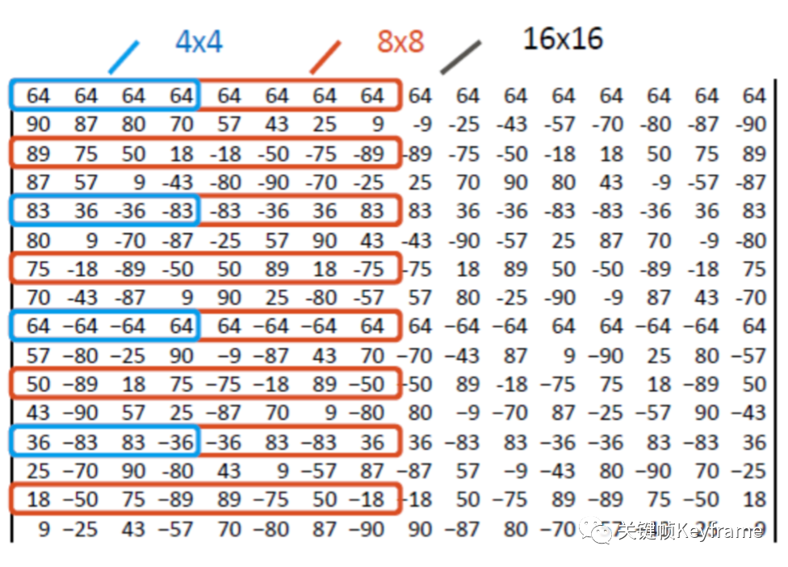

#### 2.1.4、环路滤波/去方块滤波（Deblocking）

去方块滤波（Deblocking）在基于块的视频编码中，形成的重构图像会出现方块效应，采用去方块滤波可达到削弱甚至消除方块效应的目的，提高图像的主观质量和压缩效率。**H.265 仍然是基于块的视频编码，因此延续了环内去方块滤波的思路。在 TU/PU 块边界进行滤波，根据 MV、QP 等决定不同滤波强度**。

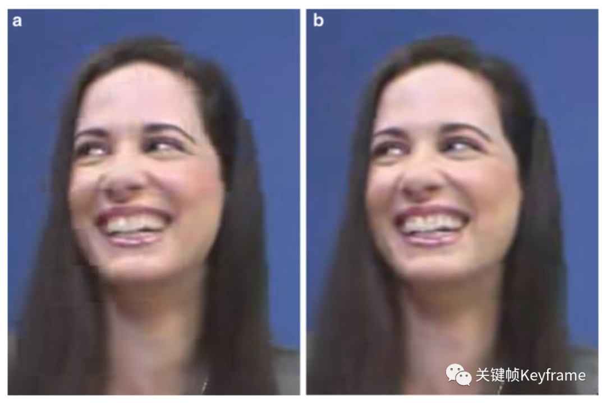

#### 2.1.5、环路滤波/样点自适应补偿滤波（SAO）

样点自适应补偿滤波（Sample Adaptive Offset，SAO）处于去方块滤波之后，通过解析去方块滤波后的像素的统计特性，为像素添加相应的偏移值，可以在一定程度上削弱振铃效应，提高图像的主观质量和压缩效率。**SAO 是 H.265 新增的一项编码方式**。


#### 2.1.6、熵编码

该模块将编码控制数据、量化变换系数、帧内预测数据以及运动数据等编码为二进制流进行存储或传输。熵编码模块的输出数据即原始视频压缩后的码流。**H.265 中采用先进的基于上下文的自适应二进制算术编码（CABAC）进行熵编码，引入了并行处理架构（Slice/Tile、WPP），在速度、压缩率和内存占用等方面均得到了大幅改善**。

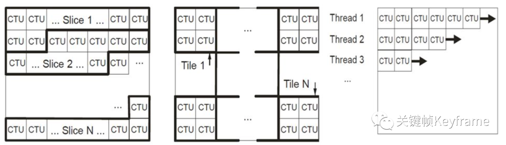

### 2.2、特色编码技术

相比以往的视频编码标准，H.265 的编码性能有了很大的提升，这源于新编码工具的使用以及自身具有特色的核心技术：

#### 2.2.1、编码单元

H.264 标准中的核心编码单元是『宏块』，包含一个 16x16 的亮度块采样，对于一般的视频信源（如 YUV 4:2:0）而言，会伴随两个 8x8的色度块采样。由于高分辨率视频业务的自身特性，基于传统宏块的编码方式具有很大的局限性。因此，H.265 采用了编码树单元（Coding Tree Unit，CTU）和编码树块（Coding Tree Block，CTB）。H.265 中的 CTU 的概念类似于传统的宏块，但它的大小是可以由编码器设定的，并且可以超越 16x16。一个 CTU 由一个亮度 CTB、两个色度 CTB 和一些关联的语法元素组成。

为了更灵活有效地表示视频内容，H.265 为图像的划分定义了一套全新的分割模式：**灵活的四叉树划分结构，包括编码单元（Coding Unit，CU）、预测单元（Prediction Unit，PU）和变换单元（Transform Unit，TU）。这种特性有助于编码器根据视频内容特性、视频应用和终端特性来自适应地选择编码模式。**

编码单元的划分：

  * 首先可以将图像均等划分为编码树单元（CTU），最大 64x64；

  * CTU 可以根据实际编码决策，按照四叉树划分为更小的编码单元（CU）；

  * 每一个叶节点的 CU 可以选择帧内编码或者帧间编码。

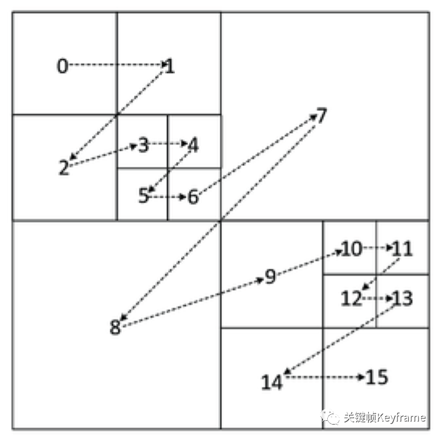

预测单元的划分：

  * 每个 CU 可以划分为 1 个、2 个、4 个预测单元（PU）；

  * 预测单元 PU 是帧内预测、帧间预测的基本单元；

  * PU 的划分包括 4 中对称结构和 4 种非对称结构。

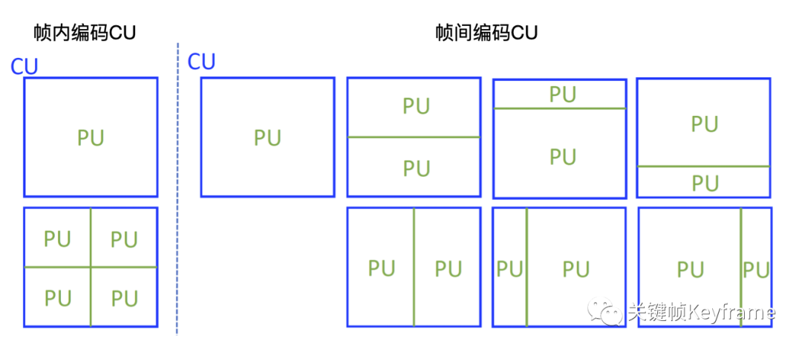

变换单元的划分：

  * 每个 CU 可以按四叉树划分为变换单元 TU（最大 32x32，最小 4x4）；

  * 变换单元 TU 可采用 4x4 ~ 32x32 大小的离散余弦变换，此外还能支持 4x4 的离散正弦变换。

**大尺寸离散余弦变换是 H.265 视频编码标准中提升编码效率的重要技术之一。在 H.264 中仅采用了 4x4/8x8 的 DCT 变换。而在 H.265 中 DCT 变换的最大尺寸为 32x32，这种大尺寸变换单元的选择可以使编码器在处理高分辨率画面中经常出现平坦区域时能够更好地提高压缩率。**

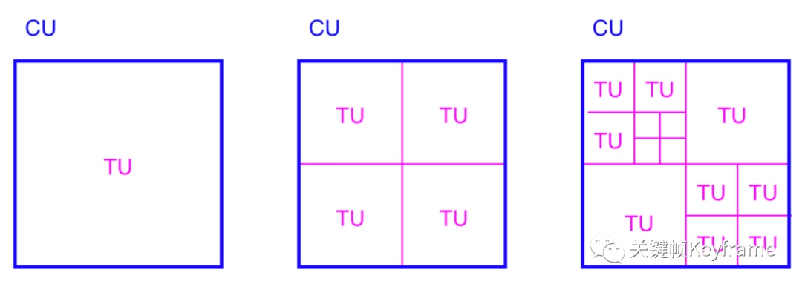

#### 2.2.2、改进的帧内预测技术

H.264 基于 4x4 大小的编码块采用 9 中预测模式，基于 16x16 大小的编码块采用 4 种预测模式。考虑高清视频纹理的多样性，只采用 H.264 中提供的几种帧内预测模式是远远不够的。为了更准确地反映纹理特性，降低预测误差，H.265 共提供了 35 种帧内预测模式，包括 33 种角度预测以及 DC 预测模式和 Planar 预测模式。**增加的预测模式可以更好地匹配视频中复杂的纹理，得到更好的预测效果，更加有效地去除空间冗余。**

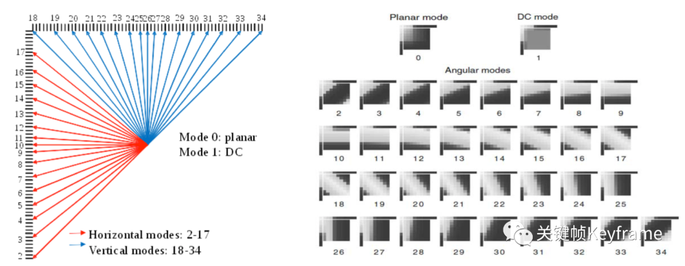

#### 2.2.3、先进的帧间预测技术

为了提升帧间预测性能，**H.265 引入了新的帧间预测技术，包括运动信息融合技术（Merge）、先进的运动矢量预测技术（Advanced Motion Vector Predictor，AMVP）以及基于 Merge 的 Skip 模式**。

  * Merge 技术利用空域相关性和时域相关性来减少相邻块之间的运动参数冗余，具体来说，就是取其相邻 PU 的运动参数作为当前 PU 的运动参数。

  * AMVP 技术的作用与 Merge 技术类似，也是利用空域相关性和时域相关性来减少运动参数的冗余。AMVP 技术得到的运动矢量一方面为运动估计提供搜索起点，另一方面作为预测运动矢量使用。AMVP 根据周围块预测运动矢量，MV = MVP(预测矢量) + MVD(矢量差值)。

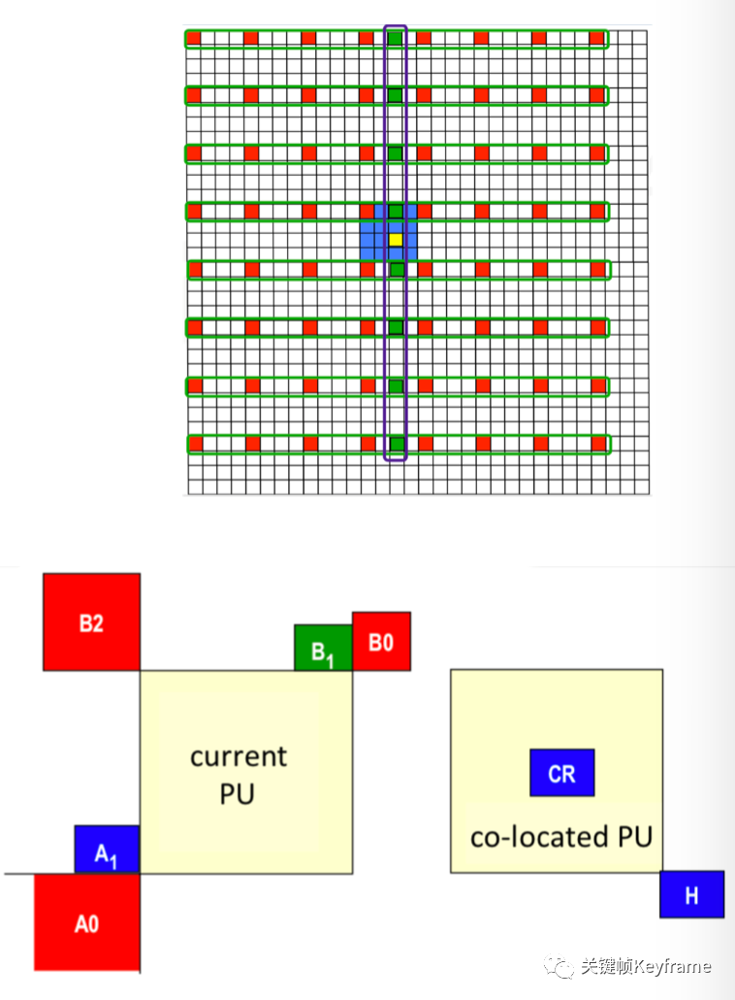

#### 2.2.4、RQT 技术

**RQT（Residual Quad-tree Transform）技术是一种基于四叉树结构的自适应变换技术，它为最优 TU 模式选择提供了很高的灵活性。**大块的 TU 模式能够将能量更好地集中，小块的 TU 模式能够保存更多的图像细节。根据当前 CU 内残差特性，自适应选择变换块大小，可以在能量集中和细节保留两者做最优的折中。**与传统的固定块大小变换相比，RQT 对编码效率贡献更大。**

#### 2.2.5、ACS 技术

**ACS（Adaptive Coefficient Scanning）包括三类：对角扫描、水平扫描和垂直扫描。**ACS 技术是基于 4x4 块单元进行的，将一个 TU 划分为多个 4x4 块单元，每个 4x4 块单元内部以及各个 4x4 块单元之间都按照相同的扫描顺序进行扫描。对于帧内预测区域的 4x4 和 8x8 尺寸的 TU，其根据所采用的帧内预测方向来选择扫描方法：当预测方向接近水平方向时就选择用垂直扫描，当预测方向接近垂直方向时就选用水平扫描，对于其他预测方向使用对角扫描。对于帧间预测区域，无论 TU 尺寸多大都使用对角扫描方式。

#### 2.2.6、SAO 技术

图像经过编码后，重构图像的失真不仅存在方块效应，还存在振铃效应。H.265 引入了一种新的滤波方法：样点自适应补偿技术（SAO）。**SAO 位于去块效应滤波器之后，用于补偿重构像素值，达到减少振铃效应失真目的。**SAO 分为边缘补偿（EO）和带状补偿（BO）两种方式。

#### 2.2.7、IBDI 技术

**IBDI（Internal Bit Depth Increase）技术是指在编码器的输入端将未压缩图像像素深度由 P 比特增加到 Q 比特（Q > P），在解码器的输出端又将解压缩图像像素深度从 Q 比特恢复到 P 比特。IBDI 技术提高了编码器的编码精度，降低了帧内/帧间预测误差。**但由于要建立参考队列，像素深度为 Q 比特的重构图像需占较大的内存空间。此外，在进行帧间运动估计和补偿时，需要较多的内存访问带宽，这样会给内存受限的系统带来不便。解决的办法是引入参考帧压缩算法，来减小重构图像的数据量。

<hr>

#### <p>原文出处：<a href='https://mp.weixin.qq.com/s/w7xIji29JKYf8cI2BxHZyw' target='blank'>视频编码（3）：H.266 编码性能比 H.265 再提升 49% 的关键</a></p>

我们在前文[《视频编码（1）》](http://mp.weixin.qq.com/s?__biz=MjM5MTkxOTQyMQ==&mid=2257484471&idx=1&sn=421be18e5b591043f13996734c60780b&chksm=a5d4e6e592a36ff35c5b67267b2200801fb30bd40d31069286d676c8f6cb4e64cbc214389382&scene=21#wechat_redirect)和[《视频编码（2）》](http://mp.weixin.qq.com/s?__biz=MjM5MTkxOTQyMQ==&mid=2257484563&idx=1&sn=f08f9994ef7d8a6ee09491e870c6e843&chksm=a5d4e74192a36e579ed6a975a44db431fdea6153537edc23d2ce690d5244190e01867d0bf4ad&scene=21#wechat_redirect)中探讨了 H.264 视频编码的基本概念、编码工具、编码流程及码流结构等基础知识，以及在 H.264 基础上迭代而生的 H.265 有哪些改进。接下来我们再来聊聊更新一代编码技术H.266 的改进。

## 3、H.266 编码

H.266，也被称为**多功能视频编码（Versatile Video Coding，简称 VVC）**是最新一代视频编码标准，2020 年 7 月定稿，ITU 第一版于当年 11 月正式发布，ISO/IEC 第一版于 2021 年 2 月正式发布。伴随 VVC 的 VSEI 标准的第一版的定稿和发布时间与 VVC 相同。

相对于之前的 H.265/HEVC 和 H.264/AVC 视频编码标准，VVC 对 8K 超高清、屏幕、高动态和 360 度全景视频等新的视频类型以及自适应带宽和分辨率的流媒体和实时通信等应用有了更好的支持。VSEI（Versatile Supplemental Enhancement Information），主要规定用于 VVC 视频码流的视频可用性信息（Video Useability Information, VUI）和一些承载辅助增强信息（SEI）的消息的格式。在 H.265 和 H.264 标准中，这些 VUI 和 SEI 格式是放在编码标准主文本中的，而在制定 H.266 是被分开放在两个不同的标准文本中。

**相对于 H.265，根据官方主观测试结果，H.266 的平均编码性能提高了 49%。**H.266 的新编码工具和对已有编码工具的技术改进主要包括以下几类：

  * **块划分**
  * **帧内预测**
  * **帧间预测**
  * **变换和量化**
  * **熵编码**
  * **环路滤波**
  * **屏幕内容编码**
  * **360 度视频编码**

### 3.1、编码工具

#### 3.1.1、块划分

**H.266 中增加了四叉树分块之外的新分块方法：MTT（Multiple-Type Tree）。**H.266 采用了四叉树加多类型树（QT+MTT）的分块法。在 QT+MTT 分块中，一个方块可以均匀分成左右或上下两个矩形块，也称为 BT 划分（Binary-Tree Split）；或者也可以从左到右或从上到下按 1:2:1 的比例分成三个矩形块，也称为 TT 划分（Ternary-Tree Split），如下图所示。同时，BT 或者 TT 划分得到的子块还允许继续使用 BT 或者 TT 划分，但是不能再使用 QT 划分。

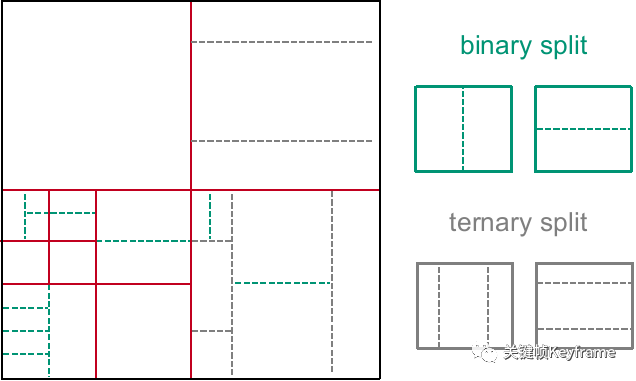

**H.266 中还允许对色度分量采用不同的分块树结构 CST（Chroma Separate Tree）。**CST 有两种实现方式：

  * 作用在帧内编码条带级别，这种编码方式也称为双树（Dual-Tree）编码，对于每个支持的最大编码树单元（Coding Tree Unit, CTU），亮度和色度采用不同的分块树结构；

  * 对于使用单编码树（Single-Tree，CTU 级别的亮度和色度采用相同分块树）的条带，当亮度块大小满足某种条件时，亮度和色度也会采用不同的分块树划分，这种编码方式也称为局部双树（Local Dual-Tree）编码，主要用于防止分块结果中有很多小色度块。

另外，H.265 支持的最大 CTU 是 64×64，而**在 H.266 中的最大 CTU 增加到 128×128，最小 CTU 可支持 32×32**。

#### 3.1.2、帧内预测

H.266 的帧内预测技术改进如下：

  * H.266 支持 **67 种帧内预测模式**（H.265 是 35）。
  * 对非方形块的角度预测方向做了调整，预测像素插值采用**两类四抽头插值滤波器**（H.265 是低精度的线性插值）。
  * **基于位置的预测组合技术（Position Dependent intra Prediction Combination, PDPC）**将滤波前后的预测信号合并在一起以进一步提高帧内预测精度。
  * **多参考行帧内预测技术**不仅可以利用最近相邻的重建像素值，还可以采用更远的重建像素值进行帧内预测。
  * **基于矩阵的帧内预测技术**中利用了矩阵向量的乘法来进行帧内预测。
  * **跨分量线性模型帧内预测技术**利用亮度图像分量的像素值来预测同一图像中色度分量的像素值。
  * **在子分块模式中，一个亮度编码单元的不同子块采用相同的编码模式信息**。

#### 3.1.3、帧间预测

H.266 的帧间预测技术改进如下：

  * H.266 继承了 H.265 的基于整个编码单元的运动矢量差值（Motion Vector Difference, MMVD）编码及运动信息继承模式，即：AMVP（Adaptive Motion Vector Prediction）和 Skip/Merge 模式，并分别做了扩展：

    * 对 AMVP 模式，H.266 引入了**块级的自适应运动矢量精度**，以及**对称编码模式（Symmetric Motion Vector Differences Signalling）**用于双向预测但只需要编码其中一个参考图像的 MVD。

    * 对于 Skip/Merge 模式，H.266 引入**基于历史信息的运动矢量预测（HMVP, History-based Motion Vector Prediction）**和**配对平均运动矢量预测（Pair-wise Average Merge Candidate）**。

  * H.266 还引入了**基于子块的时域运动推导模式（Subblock-based Temporal Motion Vector Prediction, SbTMVP）**，即当前编码单元分为大小相同的子块（8×8 亮度子块），每个子块的运动矢量单独进行推导。

  * H.266 还引进一个**仿射运动模型**来更精确地表示像缩放和旋转这样的高阶运动从而提高运动信息的编码效率。

  * **运动矢量的精度提高到了 1/16 亮度像素**（H.265 是 1/4 亮度像素）。

  * H.266 还引入多个**新的帧间预测编码工具**，如：

    * 将 AMVP 和 merge 模式结合起来的**合并模式（Merge mode with MVD, MMVD）**，通过对 merge 模式增加额外的运动矢量差值得到了进一步提高。

    * **几何分块模式的分块结果可以更加切合视频内容中的实体对象边界的运动轨迹**。

    * **帧间预测和帧内预测合并在一起的预测模式**可以同时减少时域冗余和空域冗余以取得更高的压缩性能。

  * H.266 的另一个重要改进是引入**解码端运动细化**和**双向光流**这两个工具，在不增加码率开销的情况下进一步提升运动补偿效率。

#### 3.1.4、变换和量化

H.266 在变换方面的优化：

  * H.266 的最大变换维度提高到了 64×64（H.265 是 32×32）。

  * 引入了**非正方形变换**，非正方形变换用于对非正方形的分块进行变换操作。这种变换在水平方向和垂直方向使用不同长度的变换内核。

  * 引入了**多变换（主变换）选择**，有了多变换选择，编码器可以从一组预定义的整数正弦、余弦、跳过变换并在码流中标明所用变换。

  * 引入了**低频不可分变换**，低频不可分变换对帧内预测残差的主变换结果中的低频分量进行再进行二次变换，以更好地利用编码块内容的方向性进一步提高压缩性能。

  * 引入了**子块变换**，子块变换用于当对一个帧间预测残差块的一部分进行编码而其它部分的值全部设为零的时候。

H.266 在量化方面的优化：

  * 引入了**自适应色度量化参数偏差**。采用自适应色度量化参数偏差这个工具时，对于特定的量化组，色度量化参数不直接编码，而是通过亮度量化参数和预定义并传输的查找表推导得出。

  * 引入了**依赖量化**。在依赖量化中，一个变换系数的重建值范围依赖于扫描顺序在它前面的几个变换系数的重建值，从而减少输入向量和最接近的重建向量之间的平均失真。

  * 引入了**量化残差联合编码**。量化残差联合编码指的是对两个色度分量的残差一起编码，而不是分别编码，这样当两个色度分量的残差相似时编码效率会更高。

#### 3.1.5、熵编码

与 H.265 相同，H.266 采用的熵编码也是上下文自适应的二进制算术编码（Context-Adaptive Binary Arithmetic Coding, CABAC），但是在 CABAC 引擎和变换系数编码两方面做了改进：

  * 在 CABAC 引擎方面的改进：**多重假设概率更新模型和上下文模型绑定的自适应率（即概率更新速度依赖于上下文模型）**，其中采用了和每个上下文模型耦合的两个概率估计 P0 和 P1，而 P0 和 P1 相互独立地根据各自的自适应率进行更新。用于二进制算术编码器中进行区间细分的概率估计 P 设为 P0 和 P1 的均值。

  * 在变换系数编码方面的改进：

    * 除了 4×4 的系数组之外，H.266 还**允许 1×16、16×1、2×8、8×2、2×4 和 4×2 这六种系数组**。

    * **增加了一个标志位用于依赖量化的状态过渡。**

    * **一个改进的概率模型选择机制用于和变换系数绝对值相关的语法元素的编码。**

#### 3.1.6、环路滤波

H.266 中环路滤波方面的改进：

  * 支持 H.265 中也有的**去块效应滤波器（Deblocking Filter, DBF）**。增加了更长的滤波器和一个专门为高动态视频设计的亮度自适应滤波模式。

  * 支持 H.265 中也有的**样本自适应偏差（Sample Adaptive Offset, SAO）**。与 H.265 相同。

  * 新增支持**带色度缩放的亮度映射（Luma Mapping with Chroma Scaling, LMCS）****。**编码器可以利用 LMCS 在编码前分段线性地改变输入视频信号幅度分布的动态范围从而提高编码效率，在解码端逆向复原。

  * 新增支持**自适应环路滤波器（adaptive loop filter, ALF）**。H.266 中的 ALF 包括两种模式：

    * 亮度和色度样本基于块的 ALF。在 ALF 中，亮度和色度分别采用 7×7 和 5×5 的菱形滤波器；对于每个 4×4 块，根据其方向性和梯度活动性分成 25 类和 4 个转置状态的一种，从所传递的多组滤波器中选择一个采用。

    * 色度样本夸分量自适应滤波器（Cross-Component Adaptive Loop Filter, CC-ALF）。CC-ALF 采用一个菱形线性高通滤波器利用 ALF 滤波后的亮度样本来进一步细化色度样本。

#### 3.1.7、屏幕内容编码

H.266 中屏幕内容编码方面的优化：

  * H.266 保留了 H.265 中的基于块的差分脉冲编码调制，但仅限于帧内预测的编码单元。

  * 变换跳过残差编码在 H.265 基础上作了以下改进：

    * **第一个非零值的位置不再编码，扫描方向改为相反方向；**

    * **利用上下文模型提高了正负号指示的编码效率；**

    * **绝对值的编码改进。**

  * 保留了 H.265 帧内块拷贝（Intra Block Copy, IBC）并改进。在 H.265 中，IBC 被定义为一种帧间预测模式，其参考帧是当前帧本身并且运动向量必须指向当前帧已解码且未进行环路滤波的区域。在 H.266 中，**IBC 与帧间预测解耦，并对参考缓冲的管理相对于 H.265 进行了简化**，参考样本存储在一个局部的小缓冲器中。

  * 保留了 H.265 调色板模式并改进。**调色板的编码方式在 H.266 中取决于亮度色度是否使用单个编码树。**如果使用单个编码树，三个色度分量的调色板联合在一起编码；否则亮度和色度调色板分开编码。对于采用调色板的编码单元，个别像素还可以不使用调色板中的内容，而是直接编码其量化值。

  * H.266 中的自适应颜色变换这个屏幕内容编码工具与 H.265 中相同，未作改进。

#### 3.1.8、360 度视频编码

360 度视频是在 2014、2015 年左右逐渐开始流行起来的，而 H.265 的第一版是在 2013 年年初定稿的，所以 H.266 顺利成章地成为第一个包含 360 度视频编码工具的国际视频编码标准。

由于传统视频编码技术基本上都能用于 360 度视频编码，H.266 中包含的 360 度视频压缩工具只有两个，更多的对 360 度视频的支持是在系统和传输接口的设计中。

  * H.266 中的一个 360 度视频压缩工具叫做**运动矢量环绕**。就是当运动矢量指向图像右（左）边界之外的位置时，运动补偿中实际用的参考像素是图像左（右）边界内的像素（或通过插值滤波得到的子像素）。这是因为 360 度视频中常用的一种叫做等矩形映射（Equirectangular Projection, ERP）图像的左右边界实际上是物理世界的球形表面的连续位置，类似于世界地图的左右边界实际上是地球上的连接南北极的同一条经线。所以这样的运动矢量环绕可以提高采用 ERP 的 360 度视频的编码效率。

  * 另外一个 360 度视频压缩工具叫做**环路滤波虚拟边界**。如果采用，则环路滤波的适用效果不会跨过图像中某些水平或垂直线（这些线就是这里说的所谓的虚拟边界）。这个工具适用于 360 度视频中常用的另一种映射，叫做立方体贴图映射（Cube Map Projection, CMP）。

### 3.2、系统和传输接口

视频编码标准的系统和传输接口通常也叫做高层语法（High-Level Syntax, HLS），是编解码器中压缩工具和视频应用和传输系统之间的联系纽带。HLS 涉及视频编码标准中的众多课题，包括：码流的基本结构、编码数据的基本结构、序列层和图像层的参数编码、随机访问、视频流自适应、解码图像管理（这里包括参考图像管理）、档次（Profile）和级别（Level）的定义和编码、码流缓冲模型、高层图像分割（比如条带划分和瓦片划分）、时域伸缩性、可扩展性、后向兼容性、容错、增强信息编码，等等。

H.266 继承了 H.264 和 H.265 的 HLS 设计中很多方面，包括基于网络抽象层（Network Abstraction Layer, NAL）单元的语法结构、分等级的语法和数据单元结构、VUI 和 SEI 机制、基于虚拟参考解码器（Hypothetical Reference Decoder, HRD）的视频缓冲模型。

与 H.264 和 H.265 相比，H.266 的 HLS 中的新的或有显著改进的设计主要包括以下这些方面：

  * **矩形条带（Slice）和子图像（Subpicture）**

  * **自适应图像分辨率更新**

  * **自适应参数集（Adaptation Parameter Set, APS）**

  * **图像头**

  * **逐渐解码刷新（Gradual Decoding Refresh, GDR）**

  * **参考图像列表（Reference Picture List, RPL）的直接编码**

  * **多层可伸缩编码设计大大简化**

#### 3.2.1、条带和子图像

相对于 H.264 和 H.265，H.266 在条带支持方面有一个重大的变化，那就是**用基于瓦片（Tile）或瓦片中的 CTU 行的条带机制取代了基于分块单元（H.264 中的宏块或 H.265 中的 CTU）的条带机制**。这个变化的原因是网络技术和视频编码及传输技术的发展让过去常用的视频错误隐藏技术基本上不再被需要，人们看到的视频基本上不再包含采用错误隐藏技术得到的视频帧了。

H.266 条带有两种模式：

  * **矩形条带**。矩形条带的形状总是一个矩形。每个矩形条带可以包含一个或多个完整的瓦片（如下面第一幅图所示），也可以包含一个瓦片中的一个或多个 CTU 行（如下面第二幅图中右上角的那个矩形条带）。

包含 18×12 CTUs 的图像被划分为 24 个瓦片和 9 个矩形条带：

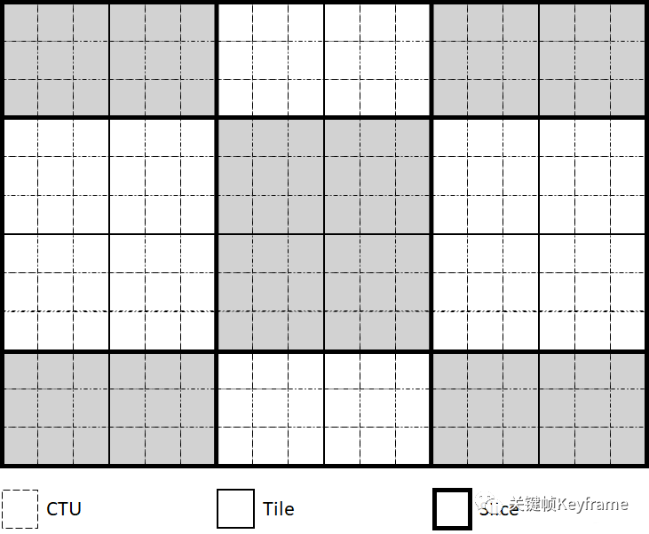

一个图像被划分为 4 个瓦片和 4 个矩形条带（注：左边两个瓦片合为一个条带，而右上角的瓦片被划分为 2 个矩形条带）：

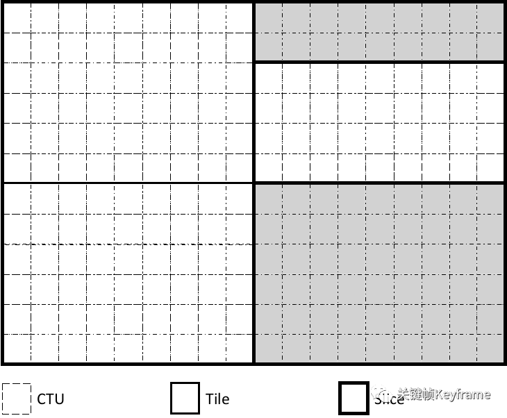

  * **光栅扫描条带**。每个光栅扫描条带也包含一个或多个完整的瓦片，但是这些瓦片的顺序必须是光栅扫描顺序，所以其形状通常不是矩形的（如下图所示）。

包含 18×12 CTUs 的图像被划分为 12 个瓦片和 3 个光栅扫描条带：

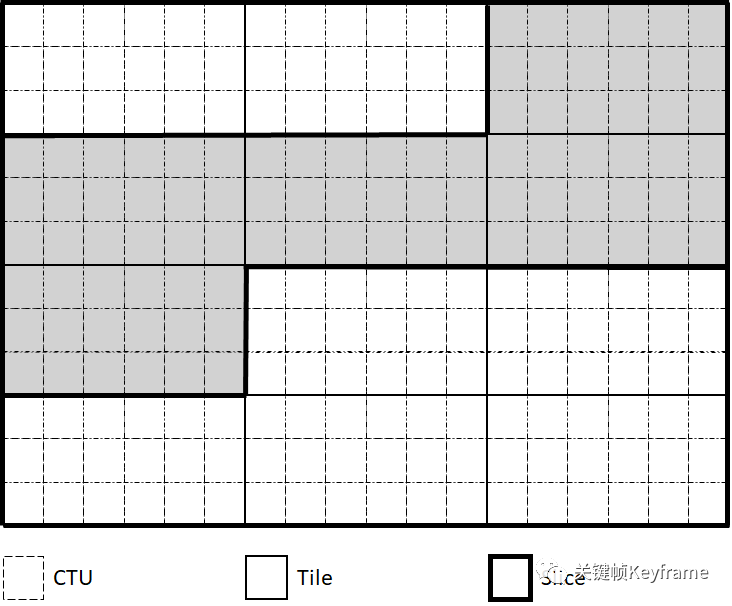

H.266 是第一个引入**子图像**这个设计的视频编码标准。概念上子图像与 H.265 中的运动受限的瓦片集（Motion-Constrained Tile Set, MCTS）相同，但是在设计上做了改进以提高编码压缩效率和应用系统友好性。每个子图像的形状也必须是矩形的，包含一个或多个矩形条带（如下图所示）。

一个图像被划分为 18 个瓦片、24 个条带和 24 个子图像（这个例子中每个子图像正好包含一个矩形条带）：

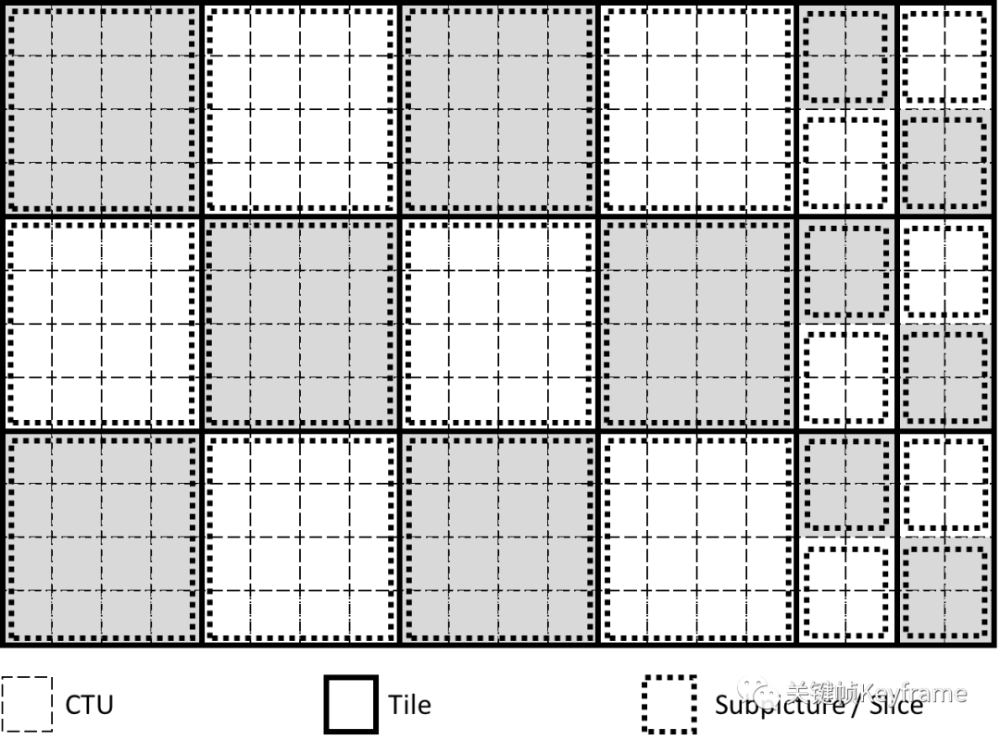

子图像可以独立编码从而可以被提取出来单独解码，所以可以用于感兴趣区域（Region Of Interest, ROI）编码，也可以用于 360 度视频的传输优化，如下图所示。360 度视频与传统视频应用的最关键区别之一是用户在任何瞬间都只会看到整个 360 度球面的一小部分，这个传输方案就是利用这个关键点进行优化，目标是让用户看到的部分具有高画质，而看不到的部分的画质可以比较低。看不到的部分也不能完全不传，因为那样的话，如果用户突然转头就只能看到黑屏，那样就离侵入式体验想去太远了。

基于子图像的 360 度视频传输方案：

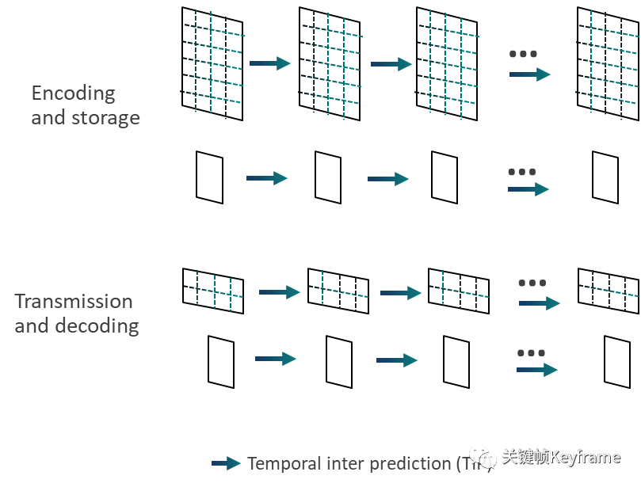

H.266 子图像设计相对于 MCTS 的改进主要有以下五点：

  * **可抽取子图像中的运动矢量可以指向子图像边界之外**，如果发生则运动补偿时采用像素填充技术，就像运动矢量指向图像边界之外时一样，从而提高编码效率。

  * **对合并模式和解码端运动矢量细化中的运动矢量选择和推导作了针对子图像的改进。**

  * **抽取子图像时不需要改动条带头。**

  * **包含不同类型条带（比如支持随机访问的和不支持随机访问的）的子图像可以被简单合并为一个图像，合并时也不需要改动条带头。**

  * 定义了子图像序列的 HRD 和类别，从而**编码器可以保证每个可抽取子码流的一致性**。

#### 3.2.2、自适应图像分辨率更新

在 H.264 和 H.265 中，改变图像分辨率有在编码视频序列（Coded Video Sequence, CVS）的起始帧并开始使用一个新的序列参数集的时候才可能。而**在 H.266 中图像分辨率可以在一个 CVS 中的任何帧改变，而且改变时还可以继续用帧间预测**。这就需要允许在不同分辨率的两个图像之间进行帧间预测，因此需要**能够进行参考图像重采样（Reference Picture Resampling, RPR）**。这里的重采样既可能是上采样，也可能是下采样，取决于参考帧的分辨更大还是当前帧的分辨率更大。

#### 3.2.3、自适应参数集（APS）

H.266 中增加了一种新的参数集：APS，用来传输符合以下三个条件的图像层或条底层信息：

  * 可以被一个图像的多个条带和/或不同图像的多个条带共享的；

  * 可能在图像之间频繁变化；

  * 可能取值的个数比较大，如果放到图像参数集（Picture Parameter Set, PPS）中去的话会导致 PPS 在一个码流中需要更新从而无法进行 PPS 的带外传输。

在 H.266 中 APS 被用来传输三种参数：

  * **ALF 参数**

  * **LMCS 参数**

  * **缩放列表（Scaling List）参数**

#### 3.2.4、图像头

图像头并不是一个新概念，在 MPEG-2 等 H.264 之前的编码标准里面就有，但是在采用基于 NAL 单元的码流结构的 H.264 和 H.265 中没有。**H.266中重新引入图像头的主要目的是为了减少图像层信息在一个图像的不同条带中的重复**，所以包含的信息基本上就是同一图像中各个条带必须或很可能共享的信息。

#### 3.2.5、逐渐解码刷新（GDR）

**GDR指的是可以从一个帧间编码的图像进行随机访问，虽然不能立即得到正确解码的图像，但是随着更多帧的解码，视频内容中正确解码的区域逐渐增大直至到某一帧所有的区域都能正确解码。**由于采用帧内编码的块可以相对均匀地分布在多个连续的图像中，编码器就可能使码率很平滑，从而降低点到点延时。

GDR 也不是新概念，在 H.264 和 H.265 中可以支持，并可以用恢复点（Recovery Point）SEI 消息表明对 GDR 的支持和给出 GDR 恢复点的位置。在 H.266 中，GDR 通过一个新的 NAL 单元类型来表明，GDR 恢复点的位置信息放在图像头里，一个码流或 CVS 的首帧就可以是采用帧间编码的 GDR 帧，甚至整个合法码流里面可以没有任何一帧是瞬时解码刷新（Instantaneous Decoding Refresh, IDR）或干净随机访问（Clean Random Access, CRA）帧，也可以整个合法码流没有一个帧内编码帧。

#### 3.2.6、参考图像列表（RPL）的直接编码

参考图像管理负责解码图像存入到解码图像缓冲区（Decoded Picture Buffer, DPB）、从 DPB 中删除、以及将参考帧按合理顺序放到 RPL 中去这些操作，是视频编码标准中的核心功能之一。在 H.265 中，参考帧管理通过一个叫做参考图像集（Reference Picture Set, RPS）的机制，包括 RPL 的建立过程。H.266 对 RPL 信息直接编码，而不是间接地通过 RPS。

#### 3.2.7、多层可伸缩编码设计

**因为有了上面提到的 RPR，H.266 中支持多层可伸缩编码就变得简单了。**因为相对于单层编码不需要任何其它『低层』编码工具了，只需要增加 HLS 的支持即可。这也正式 H.266 第一版中就会支持多层可伸缩编码的主要原因（H.264 和 H.265 都是在第一版之后才加入对多层可伸缩编码的支持的）。相对于 H.264 和 H.265 后期版本中的多层可伸缩编码，H.266 中的多层可伸缩编码设计从一开始就聚焦于对单层解码器设计的友好性。首先，对解码多层码流的能力的规定与单层码流一致，从而一个单层解码器只需要少量的改变就可以解码多层码流，比如级别中对最小 DPB 能力的规定与码流中有几层无关。另外，多层可伸缩编码的 HLS 的设计大大简化，代价是牺牲了一些灵活性，比如在每个随机访问点要求每层的图像都必须存在。

H.266 中的多层可伸缩编码设计虽然相对简单，但是仍然不仅支持了传统的空间可伸缩性、质量可伸缩性、以及多视角可伸缩性，还支持了一些可伸缩性和子图像的组合。比如，前面图所示的基于子图像的 360 度视频传输方案可以通过允许层间预测进一步改进，如下图所示：

基于子图像并允许层间预测的 360 度视频传输方案：

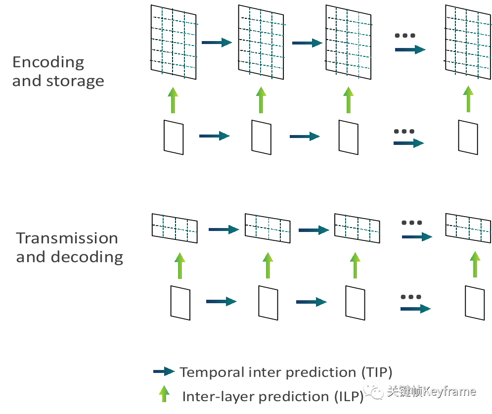

## 本文参考  

1. [H.266/VVC 视频编码标准概述](https://juejin.cn/post/6940078108787769357)
2. [新一代视频压缩编码标准 H.264/AVC](https://book.douban.com/subject/1314942/)
3. [新一代高效视频编解码 H265/HEVC 原理、标准与实现](https://book.douban.com/subject/26828613/)
4. [率失真优化](https://blog.csdn.net/weixin_42979679/article/details/104534543)
5. [ITU 第一版](https://www.itu.int/rec/T-REC-H.266/en0)
6. [ISO/IEC 第一版](https://www.iso.org/standard/73022.html)
7. [VSEI 标准的第一版](https://www.itu.int/rec/T-REC-H.274/en)

