<!--BEGIN_DATA
{
    "create_date": "2020-11-15 19:23", 
    "modify_date": "2020-11-15 19:23", 
    "is_top": "0", 
    "summary": "超赞！网页设计中最常见的30款英文字体 耐看好用！专业平面设计师常用的那些中文字体 永不过时！有哪些值得推荐的经典款英文字体？", 
    "tags": "设计", 
    "file_name": "设计中常见的中文与英文字体.md"
}
END_DATA-->

#### 
原文出处：<a href='https://www.uisdc.com/30-west-typegraph-in-web-design' target='blank'>超赞！网页设计中最常见的30款英文字体</a>

关于英文字体，对我们[网页设计](https://www.uisdc.com/tag/%e7%bd%91%e9%a1%b5%e8%ae%be%e8%ae%a1)师朋友们来说一定并不陌生，即使我们很少做英文语系的网站，但在浏览国外网站的时候，大家一定都会有或多或少的认识。其实不单单是在网页中，很多移动操作系统和浏览器中都广泛使用了今天我们即将介绍的这些字体。

想必大家也都能猜出来像 Arial、Helvetica 这种大名鼎鼎的字体肯定在里面了，那么还有什么呢？一起来详细了解一下吧！

> **相关推荐：**  
[ 《平面排版时，教你突出中文美感的几种方法第二集（基础篇）》](http://www.uisdc.com/font-aesthetic-feeling)  
[ 《那些年，我们一起追过的字体》](http://www.uisdc.com/peter-tarka-typography-illustrations)  
[ 《快速上手！制作ICON FONT》 ](http://www.uisdc.com/learning-icon-font)

首先，补充个小知识：

1.网页设计中的英文字体，一般有以下五类：

serif（衬线）  
sans-serif（无衬线）  
monospace（等宽）  
fantasy（梦幻）  
cuisive（花体）

### 网页设计中最常见的无衬线字体

在常见的两种字体风格中，衬线体的笔划感太"过"，不是特别的商业。随着瑞士设计风格的大力推广，无衬线字体变得愈发流行起来。

建议: 个人认为 Tahoma 以及 Verdana 字符编码效果最好 ，适用于多种环境

#### Arial

字体族科：Arial, "Helvetica Neue", Helvetica

**变体:**

> Arial：有时称为Arial Regular以便与Arial Narrow区别，其包括Arial、Arial Italic（斜体）、Arial Bold（粗体）、Arial Bold Italic（粗斜体）和Arial Unicode MS  
> Arial Black：此字体的特色在于其笔画相当的粗，包含Arial Black、Arial Black Italic（斜体）  
> Arial Narrow：为Arial的细瘦版本，包含Arial Narrow Regular、Arial Narrow Bold（粗体）、Arial
> Narrow Italic（斜体）和Arial Narrow Bold Italic（粗斜体）  
> Arial Rounded：包含Arial Rounded Bold（粗体），此字体可在微软韩文字体Gulim找到  
> ——以上来自百度百科

#### Avant Garde

字体族科包括: "Avant Garde", Avantgarde, "Century Gothic", CenturyGothic,"[App](https://www.uisdc.com/tag/app)leGothic";

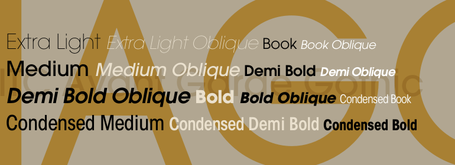

#### Calibri

字体族科包括: Calibri, Candara, Segoe, "Segoe UI", Optima, Arial,;  
Calibri，一种无衬线字体，为微软Microsoft Office 2007套装软件的默认字体，取代先前Microsoft Word的默认字体Times New Roman以及PowerPoint、Excel和Outlook的默认字体Arial。  
Calibri是搭发布于微软Windows Vista六种英文ClearType字体的其中一种，是Microsoft Word默认字体的第一个无衬线字体，先前则是使用Times New Roman为默认字体。

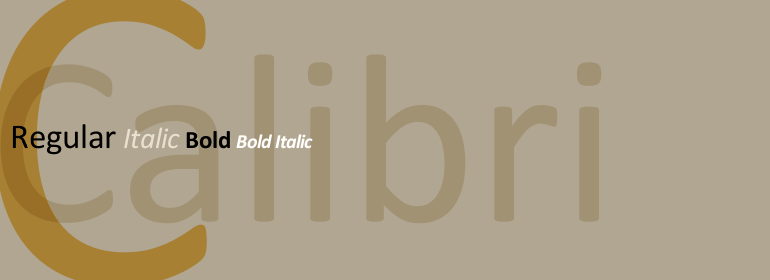

#### Candara

字体族科包括: Candara, Calibri, Segoe, "Segoe UI", Optima, Arial

Candara是一种无衬线字体，为字型设计师Gary Munch为微软所开发，附带于[Windows Vista](http://zh.wikipedia.org/wiki/Windows_Vista)中发行。——Wiki百科

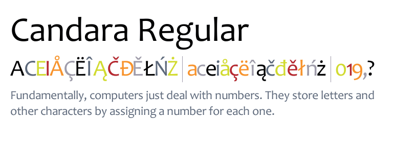

#### Franklin Gothic Medium

字体族科包括: "Franklin Gothic Medium", "Franklin Gothic", "ITC Franklin Gothic", Arial, sans-serif;

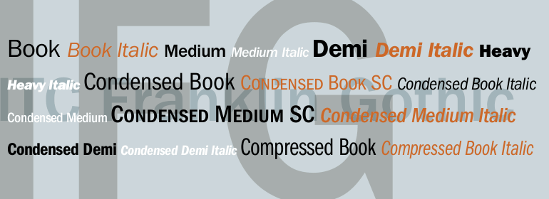

#### Futura

字体族科包括：: Futura, "Trebuchet MS", Arial;

Futura灵感来自包豪斯，继包豪斯的设计理念，设计师保罗伦纳1924年至1926年首次创建Futura。虽然伦纳是不是包豪斯的成员，但是他赞同其很多观点，他认为现代的字体应该表达出现代模式，而不是成为过去字体的延续。Futura商业授权发行于1927年，由鲍尔型铸造厂投产。

在设计 Futura的过程中，伦纳避免产生任何非必要的元素，借鉴了无衬线的基本几何比例。Futura的清脆、干净的形式反映了其效率感，鲁莽的外观即使在现如今也已经淡淡退出了。

Futura成功催生了新的几何无衬线字体，如卡贝尔和世纪哥特式，其中包括的范围。现在超过80自成立以来，许多代工厂已经公布Futura变化的数字形式年，Adobe公司作为最常用的一个。几个国际公司还利用自己的Futura定制的版本，包括大众汽车（可见其著名的广告）和宜家。——Wiki

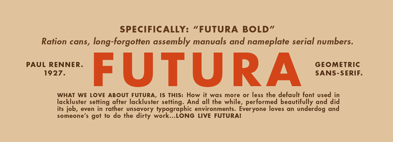

#### Helvetica

字体族科包括: "Helvetica Neue", Helvetica, Arial;

Helvetica被视作现代主义在字体设计界的典型代表。按照现代主义的观点，字体应该"像一个透明的容器一样"，使得读者在阅读的时候专注于文字所表达的内容，而不会关注文字本身所使用的字体。由于这种特点的存在，使得Helvetica适合用于表达各种各样的信息，并且在平面设计界获得了广泛的应用。

Helvetica最常见的派生字体，应该是Monotype公司于[1982年](http://zh.wikipedia.org/wiki/1982%E5%B9%B4)出品的"[Arial](http://zh.wikipedia.org/wiki/Arial)"字体。虽然在很多细节上与Helvetica有所不同，但许多非专业人士很容易将两者混淆。Arial字体随着[Microsoft Windows](http://zh.wikipedia.org/wiki/Microsoft_Windows)操作系统的附赠而迅速普及。

斯滕佩尔公司于[1983年](http://zh.wikipedia.org/wiki/1983%E5%B9%B4)发布改进版本的Neue Helvetica。原来的Helvetica字体家族只有31种，新版本的Neue Helvetica有51种，而且以Univers为参照进行编号，以Neue Helvetica 55 Roman为基准，数字第一位为粗细，第二位为风格。现在Helvetica以及Neue Helvetica由于企业收购合并的原因，成为Linotype公司的商品和商标。

Linotype公司在[1983年](http://zh.wikipedia.org/wiki/1983%E5%B9%B4)发布"Neue Helvetica"字体。增加了更多不同的粗细与宽度的选择。——Wiki

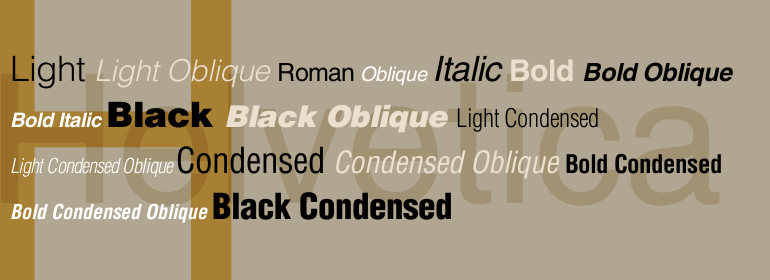

#### Impact

字体族科包括: Impact, Haettenschweiler, "Franklin Gothic Bold", Charcoal, "Helvetica Inserat", "Bitstream Vera Sans Bold", "Arial Black";

Impact是一个由设计师乔佛瑞·李在[1965年](http://zh.wikipedia.org/wiki/1965%E5%B9%B4)发表的一个无衬线字体，其特粗的笔画、紧缩的间距以及狭窄内部空间为其特点，正如其名impact（压紧）所指。此字型的[x字高](http://zh.wikipedia.org/wiki/X%E5%AD%97%E9%AB%98)相当大，几乎接近其大写字母的三分之二，因此[升部](http://zh.wikipedia.org/wiki/%E5%8D%87%E9%83%A8)相当短小，[降部](http://zh.wikipedia.org/wiki/%E9%99%8D%E9%83%A8)更是如此。因为字体较为粗犷，适合使用在标题上，而不常用在内文。

Impact是[网页核心字型](http://zh.wikipedia.org/wiki/%E7%B6%B2%E9%A0%81%E6%A0%B8%E5%BF%83%E5%AD%97%E5%9E%8B)的其中一个字体，跟着[Microsoft Windows](http://zh.wikipedia.org/wiki/Microsoft_Windows)系统一同发布。

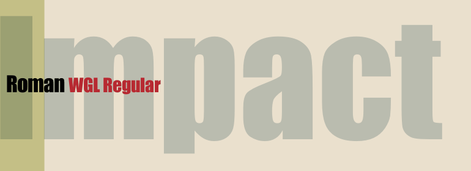

#### Optima

字体族科包括: Optima, Segoe, "Segoe UI", Candara, Calibri, Arial;

奥普蒂玛体（Optima）是一款英文[无衬线体](http://zh.wikipedia.org/wiki/%E6%97%A0%E8%A1%AC%E7%BA%BF%E4%BD%93)。最初是为[德国](http://zh.wikipedia.org/wiki/%E5%BE%B7%E5%9B%BD)著名字体设计师[赫尔曼·察普夫](http://zh.wikipedia.org/wiki/%E8%B5%AB%E5%B0%94%E6%9B%BC%C2%B7%E5%AF%9F%E6%99%AE%E5%A4%AB)为[法兰克福](http://zh.wikipedia.org/wiki/%E6%B3%95%E5%85%B0%E5%85%8B%E7%A6%8F)的D. Stempel AG foundry公司在[1952年](http://zh.wikipedia.org/wiki/1952%E5%B9%B4)至[1955年](http://zh.wikipedia.org/wiki/1955%E5%B9%B4)左右设计的。

在字体分类上，虽然这个字体没有[衬线](http://zh.wikipedia.org/wiki/%E8%A1%AC%E7%BA%BF)而被分类为无衬线体，它却与多数的无衬线字体不同，奥普蒂玛体的横竖笔画的粗细并不一致，横比竖要细一些，因此字体看起来兼具优雅、简练的风格，受到大众的喜爱。

[2003年](http://zh.wikipedia.org/wiki/2003%E5%B9%B4)，[Linotype](http://zh.wikipedia.org/wiki/Linotype)公司发布一个"Optima Nova"字体。这个Optima Nova的制作是在察普夫的协助下，由日本的[小林章](http://zh.wikipedia.org/wiki/%E5%B0%8F%E6%9E%97%E7%AB%A0)进行设计的。与[Frutiger](http://zh.wikipedia.org/wiki/Frutiger)字体的改刻版"Frutiger Next"一样，在制作的事后不是单纯倾斜，而是另外操刀制作了斜体，提高了细节的设计质量。——Wiki

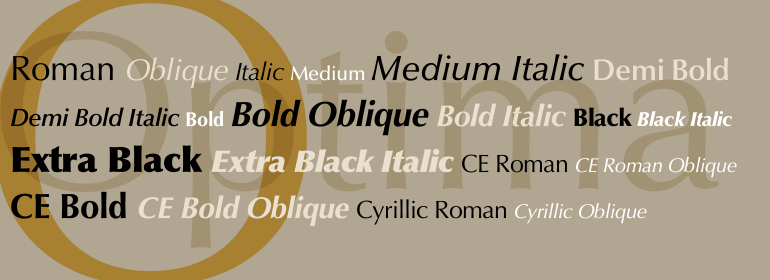

#### Tahoma

字体族科包括: Tahoma, Verdana, Segoe;

Tahoma是一个十分常见的无衬线字体，字体结构和[Verdana](http://zh.wikipedia.org/wiki/Verdana)很相似，其[字符间距](http://zh.wikipedia.org/w/index.php?)较小，而且对[Unicode](http://zh.wikipedia.org/wiki/Unicode)字集的支持范围较大。

Tahoma和[Verdana](http://zh.wikipedia.org/wiki/Verdana)师出同门，同为名设计师[马修·卡特](http://zh.wikipedia.org/wiki/%E9%A6%AC%E4%BF%AE%C2%B7%E5%8D%A1%E7%89%B9)（Matthew Carter）的作品，由微软在[1994年](http://zh.wikipedia.org/wiki/1994%E5%B9%B4)推出。许多不喜欢[Arial](http://zh.wikipedia.org/wiki/Arial)字体的人常常会改用Tahoma来代替，除了是因为Tahoma很容易取得之外，也是因为Tahoma没有一些Arial为人诟病的缺点，例如大写"`I`"与小写"`l`"难以分辨等。

Tahoma被采用为[Windows 2000](http://zh.wikipedia.org/wiki/Windows_2000)、[Windows XP](http://zh.wikipedia.org/wiki/Windows_XP)、[Windows Server 2003](http://zh.wikipedia.org/wiki/Windows_Server_2003)及[Sega](http://zh.wikipedia.org/wiki/Sega)游戏主机[Dreamcast](http://zh.wikipedia.org/wiki/Dreamcast)等系统的默认字型。——Wiki

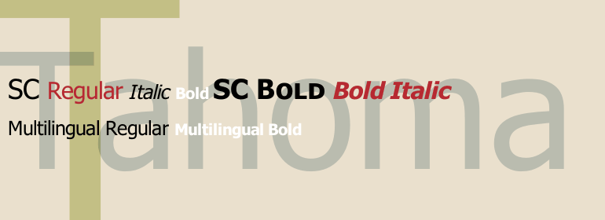

#### Verdana

字体族科包括： Verdana, Geneva;

Verdana，是一套无衬线字体，由于它在小字上仍有结构清晰端整、阅读辨识容易等高品质的表现，因而在[1996年](http://zh.wikipedia.org/wiki/1996%E5%B9%B4)推出后即迅速成为许多领域所爱用的标准字型之一。

此字体的设计源起于微软字型设计小组的[维吉尼亚·惠烈](http://zh.wikipedia.org/w/index.php?)（Virginia Howlett）希望设计一套具有高辨识性、易读性的新字型以供[屏幕](http://zh.wikipedia.org/wiki/%E8%9E%A2%E5%B9%95)显示之用，于是她邀请了世界顶级字型设计师之一的[马修·卡特](http://zh.wikipedia.org/wiki/%E9%A6%AC%E4%BF%AE%C2%B7%E5%8D%A1%E7%89%B9)（Matthew Carter）操刀，以[Frutiger](http://zh.wikipedia.org/wiki/Frutiger)字体及[爱德华·约翰斯顿](http://zh.wikipedia.org/w/index.php?)（Edward Johnston）为[伦敦地铁](http://zh.wikipedia.org/wiki/%E5%80%AB%E6%95%A6%E5%9C%B0%E9%90%B5)所设计的字体为蓝本，并由[Monotype](http://zh.wikipedia.org/wiki/Monotype)公司的字型微调（Hint）专家[汤姆·瑞克纳](http://zh.wikipedia.org/w/index.php?)（Tom Rickner）担任手工微调，字体结构与[Tahoma](http://zh.wikipedia.org/wiki/Tahoma)（同为马修·卡特所设计）很相似，微软将Verdana纳入[网页核心字体](http://zh.wikipedia.org/wiki/%E7%BD%91%E9%A1%B5%E6%A0%B8%E5%BF%83%E5%AD%97%E4%BD%93)之一。——Wiki

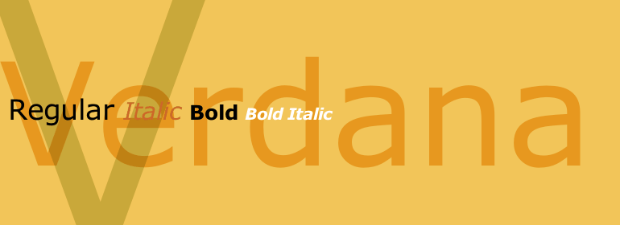

### 网页设计中最常见的衬线字体

衬线字体再纸媒中使用较多，在纸张上的显示效果更加。但是在屏幕上（尤其是小屏幕上），显示效果不是那么的好。但是依然有很多设计师喜好用衬线字体，主要多用于标题，让标题看起来更与众不同。

#### Baskerville

字体族科包括: Baskerville, "Baskerville Old Face", "Hoefler Text", Garamond, "Times New Roman";

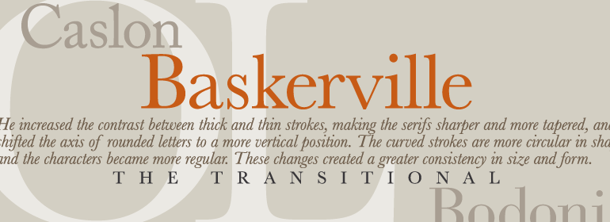

#### Big Caslon

字体族科包括: "Big Caslon", "Book Antiqua", "Palatino Linotype", Georgia;

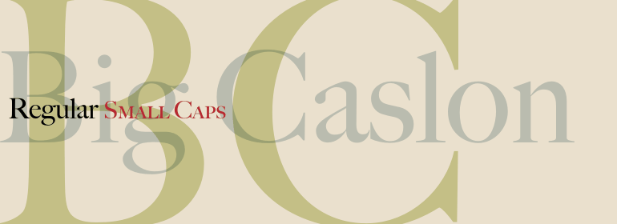

#### Bodoni MT

字体族科包括: "Bodoni MT", Didot, "Didot LT STD", "Hoefler Text", Garamond, "Times New Roman";

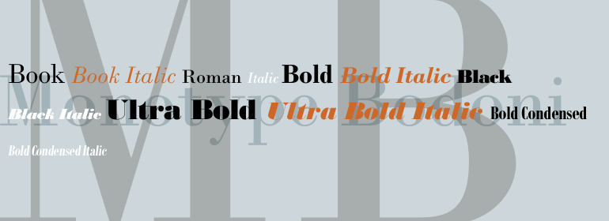

#### Cambria

字体族科包括: Cambria, Georgia, serif;

Cambria是搭载于微软[Windows Vista](http://zh.wikipedia.org/wiki/Windows_Vista)、[Microsoft Office 2007](http://zh.wikipedia.org/wiki/Microsoft_Office_2007)和[Microsoft Office 2008 for Mac](http://zh.wikipedia.org/wiki/Microsoft_Office_2008_for_Mac)等软件的一个[衬线字体](http://zh.wikipedia.org/wiki/%E8%A5%AF%E7%B7%9A%E5%AD%97%E9%AB%94)，其字符间距和比例相当的平均，对角和垂直方向的笔画和[衬线](http://zh.wikipedia.org/wiki/%E8%A5%AF%E7%B7%9A)比较粗，而水平向的衬线比较细，强调笔画的末笔。

当Cambria使用在大小超过20[点](http://zh.wikipedia.org/wiki/%E9%BB%9E_\(%E5%8D%B0%E5%88%B7\))的标题时，其字体间的间距会些微的缩小以求美观，但这样的设计并不适用于商业文件。——Wiki

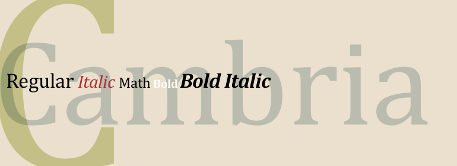

#### Didot

font-family: Didot, "Didot LT STD", "Hoefler Text", Garamond, "Times New Roman";

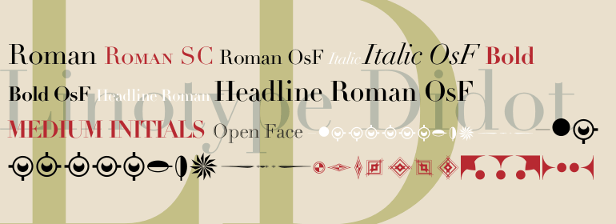

#### Georgia

字体族科包括: Georgia, Times, "Times New Roman";

Georgia是一种[衬线字体](http://zh.wikipedia.org/wiki/%E8%A5%AF%E7%B7%9A%E5%AD%97%E9%AB%94)，为著名[字型](http://zh.wikipedia.org/wiki/%E5%AD%97%E5%9E%8B)设计师[马修·卡特](http://zh.wikipedia.org/wiki/%E9%A6%AC%E4%BF%AE%C2%B7%E5%8D%A1%E7%89%B9)（Matthew Carter）于[1993年](http://zh.wikipedia.org/wiki/1993%E5%B9%B4)为微软所设计的作品，具有在小字下仍能清晰辨识的特性，可读性十分优良。其命名发想自一份[小报](http://zh.wikipedia.org/wiki/%E5%B0%8F%E5%A0%B1)报道在[美国](http://zh.wikipedia.org/wiki/%E7%BE%8E%E5%9C%8B)[佐治亚州](http://zh.wikipedia
.org/wiki/%E5%96%AC%E6%B2%BB%E4%BA%9E%E5%B7%9E)发现[外星人](http://zh.wikipedia.org/wiki/%E5%A4%96%E6%98%9F%E4%BA%BA)[头颅](http://zh.wikipedia.org/wiki/%E9%A0%AD%E9%A1%B1)的测试性[头条](http://zh.wikipedia.org/wiki/%E9%A0%AD%E6%A2%9D)。

乍看之下，Georgia与[Times New Roman](http://zh.wikipedia.org/wiki/Times_New_Roman)相当类似，但它们有多处不同。首先，在相同的字号下，Georgia的字符比Times New Roman的字符略大；其次，Georgia的字符线条较粗，[衬线](http://zh.wikipedia.org/wiki/%E8%A5%AF%E7%B7%9A)部份也比较钝而平。另外在[数字](http://zh.wikipedia.org/wiki/%E6%95%B8%E5%AD%97)部份也非常不同，Georgia采用称为"[不齐线数字](http://zh.wikipedia.org/wiki/%E4%B8%8D%E9%BD%90%E7%BA%BF%E6%95%B0%E5%AD%97)"的数字，特色在于数字会像英文[字母](http://zh.wikipedia.org/wiki/%E5%AD%97%E6%AF%8D)般有高矮大小之别。

微软将Georgia列入[网页核心字型](http://zh.wikipedia.org/wiki/%E7%B6%B2%E9%A0%81%E6%A0%B8%E5%BF%83%E5%AD%97%E5%9E%8B)，是[视窗操作系统](http://zh.wikipedia.org/wiki/%E8%A6%96%E7%AA%97%E4%BD%9C%E6%A5%AD%E7%B3%BB%E7%B5%B1)的内建字型之一。[苹果电脑](http://zh.wikipedia.org/wiki/%E8%98%8B%E6%9E%9C%E9%9B%BB%E8%85%A6)的[麦金塔](http://zh.wikipedia.org/wiki/%E9%BA%A5%E9%87%91%E5%A1%94)系统之后也跟进采用Georgia作为内建字型之一。

请注意：[数字](http://zh.wikipedia.org/wiki/%E6%95%B8%E5%AD%97)"0"与[字母](http://zh.wikipedia.org/wiki/%E5%AD%97%E6%AF%8D)"o"在Georgia字体下可能是显示成一模一样，使用时需特别注意。——Wiki

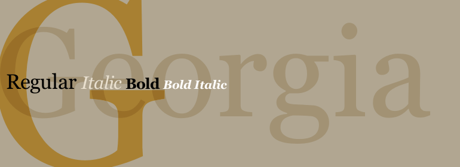

#### Lucida Bright

字体族科包括: "Lucida Bright", Georgia;

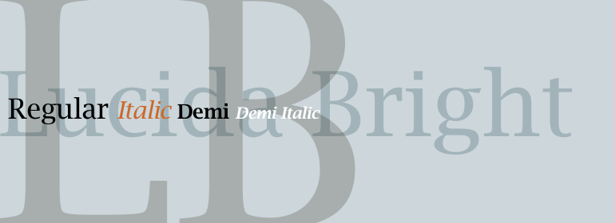

#### Palatino

字体族科包括: Palatino, "Palatino Linotype", "Palatino LT STD", "Book Antiqua", Georgia;

帕拉提诺体（Palatino）是一种常见的英文[字体](http://zh.wikipedia.org/wiki/%E5%AD%97%E4%BD%93)。它属于旧衬线体，是最常被使用的10种衬线字体之一。由[德国](http://zh.wikipedia.org/wiki/%E5%BE%B7%E5%9B%BD)设计师[赫尔曼·察普夫](http://zh.wikipedia.org/wiki/%E8%B5%AB%E5%B0%94%E6%9B%BC%C2%B7%E5%AF%9F%E6%99%AE%E5%A4%AB)设计，[1948年](http://zh.wikipedia.org/wiki/1948%E5%B9%B4)[Linotype](http://zh.wikipedia.org/wiki/Linotype) Foundry公司发布。赫尔曼·察普夫设计了一系列体现了[意大利](http://zh.wikipedia.org/wiki/%E6%84%8F%E5%A4%A7%E5%88%A9)[文艺复兴](http://zh.wikipedia.org/wiki/%E6%96%87%E8%89%BA%E5%A4%8D%E5%85%B4)的风格的字体，包括Palatine,Sistina, Michaelangelo titling和Aldus，而且据说都是从[阿尔杜斯·马努提乌斯](http://zh.wikipedia.org/wiki/%E9%98%BF%E5%B0%94%E6%9D%9C%E6%96%AF%C2%B7%E9%A9%AC%E5%8A%AA%E6%8F%90%E4%B9%8C%E6%96%AF)印刷所铅字铸造师Francesco Griffo制作的铅字中取得的灵感。"帕拉提诺"这个名字源于[16世纪](http://zh.wikipedia.org/wiki/16%E4%B8%96%E7%BA%AA)[意大利](http://zh.wikipedia.org/wiki/%E6%84%8F%E5%A4%A7%E5%88%A9)[书法](http://zh.wikipedia.org/wiki/%E4%B9%A6%E6%B3%95)家将巴提萨·帕拉提诺（Giambattista Palatino）。

帕拉提诺体是基于文艺复兴的[人文主义](http://zh.wikipedia.org/wiki/%E4%BA%BA%E6%96%87%E4%B8%BB%E4%B9%89)字体，可以看出从羽毛笔进化而来的痕迹，并富于运笔的韵律美。当时的字体多使用小字母和细笔画长竖线的搭配（长字母的字头字脚），而帕拉提诺体中进行了修改，增加字体的长度，便于阅读。字体竖线的粗细几乎不变，直线[衬线](http://zh.wikipedia.org/wiki/%E8%A1%AC%E7%BA%BF)较多，字母Q等的笔画富有明显特征，具有独特的优雅气息。——Wiki

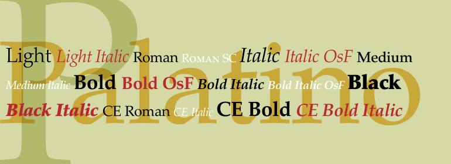

#### Perpetua

字体族科包括: Perpetua, Baskerville, "Big Caslon", "Palatino Linotype", Palatino, "URW Palladio L", "Nimbus Roman No9 L";

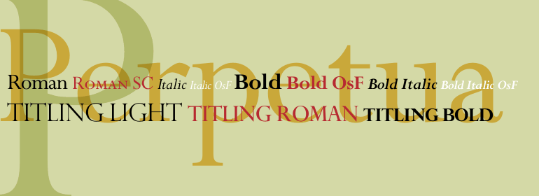

#### Rockwell

字体族科包括: Rockwell, "Courier Bold", Courier, Georgia, Times, "Times New Roman";

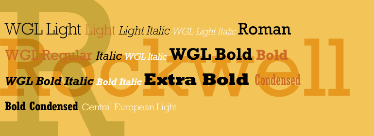

#### Times New Roman

字体族科包括: TimesNewRoman, "Times New Roman", Times, Baskerville, Georgia;

Times New Roman（泰晤士新罗马），可能是最常见且广为人知的[衬线字体](http://zh.wikipedia.org/wiki/%E8%A5%AF%E7%B7%9A%E5%AD%97%E9%AB%94)之一，在字体设计上属于过渡型[衬线体](http://zh.wikipedia.org/wiki/%E8%A1%AC%E7%BA%BF%E4%BD%93)，对后来的[字型](http://zh.wikipedia.org/wiki/%E5%AD%97%E5%9E%8B)产生了很深远的影响。另外由于其中规中矩、四平八稳的经典外观，所以经常被选择为标准[字体](http://zh.wikipedia.org/wiki/%E5%AD%97%E9%AB%94)之一。——Wiki

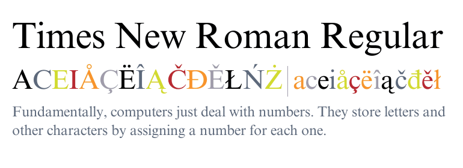

### 网页设计中最常见的等宽字体

等宽字体看起来像是打字机打出来的字体。等宽，i和w占据同样的宽度，虽然现在看起来有点怪，但是蛮有趣的。

#### Andale Mono

字体族科包括: "Andale Mono", AndaleMono;

Andalé Mono，也写作Andale Mono，是[Monotype](http://zh.wikipedia.org/wiki/Monotype)公司出品的一个[等宽字体](http://zh.wikipedia.org/wiki/%E7%AD%89%E5%AE%BD%E5%AD%97%E4%BD%93)风格的无衬线字体，其特色在于字符有高度的可辨识性，例如[数字](http://zh.wikipedia.org/wiki/%E6%95%B8%E5%AD%97)"[0](http://zh.wikipedia.org/wiki/0)"中有一点，可轻易与大写[字母](http://zh.wikipedia.org/wiki/%E5%AD%97%E6%AF%8D)"[O](http://zh.wikipedia.org/wiki/O)"区别；容易混淆的数字"[1](http://zh.wikipedia.org/wiki/1)"、小写字母"[l](http://zh.wikipedia.org/wiki/L)"和大写字母"[I](http://zh.wikipedia.org/wiki/I)"也加入[衬线](http://zh.wikipedia.org/wiki/%E8%A5%AF%E7%B7%9A)设计以利分辨。

由知名字型设计师[史提夫·马特森](http://zh.wikipedia.org/w/index.php?)（Steve Matteson）创造，作为[终端机](http://zh.wikipedia.org/wiki/%E7%B5%82%E7%AB%AF%E6%A9%9F)的显示字体与[软件](http://zh.wikipedia.org/wiki/%E8%BB%9F%E9%AB%94)开发的[源码](http://zh.wikipedia.org/wiki/%E6%BA%90%E7%A2%BC)字型之用，最早应用在苹果公司与[IBM](http://zh.wikipedia.org/wiki/IBM)合作研发的[Taligent](http://zh.wikipedia.org/w/index.php?)计划，后来微软也将此字型选为[网页核心字型](http://zh.wikipedia.org/wiki/%E7%B6%B2%E9%A0%81%E6%A0%B8%E5%BF%83%E5%AD%97%E5%9E%8B)之一。

在微软的[Windows](http://zh.wikipedia.org/wiki/Windows)系统上，Andalé Mono最初是作为[Internet Explorer](http://zh.wikipedia.org/wiki/Internet_Explorer)4.0的可选附件发行。自Internet Explorer 5开始，Andalé Mono改名为Andale Mono，字体版本升为1.25。虽然后来微软中止了网页核心字型计划，并且从[Windows ME](http://zh.wikipedia.org/wiki/Windows_ME)以后不再附带此字体，但目前在[Sourceforge](http://zh.wikipedia.org/wiki/Sourceforge)的相关计划网页上仍可[下载](http://zh.wikipedia.org/wiki/%E4%B8%8B%E8%BC%89)得到，而且苹果公司也将此字体附于旗下的[Mac OS X](http://zh.wikipedia.org/wiki/Mac_OS_X)系统中发布——Wiki

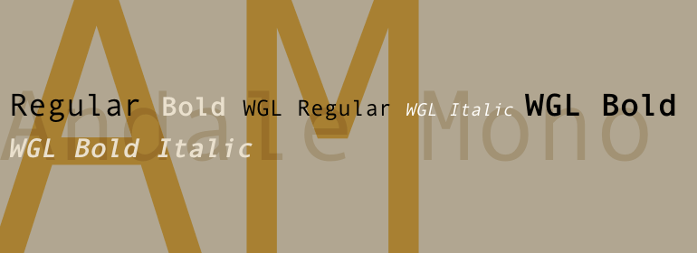

#### Consolas

字体族科包括: Consolas, monaco;

Consolas 是一套[固定字符宽度](http://zh.wikipedia.org/wiki/%E5%9B%BA%E5%AE%9A%E5%AD%97%E5%85%83%E5%AF%AC%E5%BA%A6)的字型，属无衬线字体，由 [Lucas de Groot](http://zh.wikipedia.org/w/index.php?) 设计。这套字型使用了微软的[ClearType](http://zh.wikipedia.org/wiki/ClearType)[字型平滑](http://zh.wikipedia.org/w/index.php?)技术，并随同 [Windows Vista](http://zh.wikipedia.org/wiki/Windows_Vista)、[Office 2007](http://zh.wikipedia.org/wiki/Microsoft_Office_2007) 及 [Microsoft Visual Studio](http://zh.wikipedia.org/wiki/Microsoft_Visual_Studio) 中发行，或可在微软的网站下载。在Windows Vista 的 6 套新字型中，Consolas 近似于前版 Windows 中的 2 款内建字型：[Lucida Console](http://zh.wikipedia.org/w/index.php?) 与 [Courier New](http://zh.wikipedia.org/w/index.php?)，主要是设计做为[程式码](http://zh.wikipedia.org/wiki/%E7%A8%8B%E5%BC%8F%E7%A2%BC)的显示字型之用，特别之处是它的"0″字加入了一斜撇，以方便与字母"O"分辨。

在 Consolas 之前，程式码的显示字型大多为 Courier New或其他固定字符宽度的字型，字型的柔边（反锯齿）效果则依个人喜好选择开启或关闭，然而 Consolas 是专为柔边效果而设计的字型，特别是为了搭配微软的[ClearType](http://zh.wikipedia.org/wiki/ClearType) 技术，如果不开启ClearType，Consolas 的显示效果会打大折扣。另外，ClearType 技术还需要搭配[液晶显示器](http://zh.wikipedia.org/wiki/%E6%B6%B2%E6%99%B6%E9%A1%AF%E7%A4%BA%E5%99%A8)才会有最佳表现。——Wiki

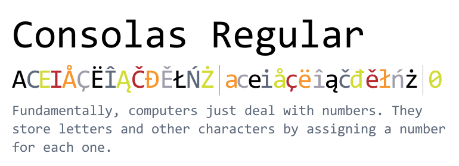

#### Courier New

字体族科包括: "Courier New", Courier, "Lucida Sans Typewriter", "Lucida Typewriter";

Courier是一个[等宽字体](http://zh.wikipedia.org/wiki/%E7%AD%89%E5%AF%AC%E5%AD%97%E9%AB%94)的[粗衬线字体](http://zh.wikipedia.org/wiki/%E7%B2%97%E8%A5%AF%E7%B7%9A%E9%AB%94)，主要是依据[打字机](http://zh.wikipedia.org/wiki/%E6%89%93%E5%AD%97%E6%A9%9F)所打印出来的字形来设计，于[1955年](http://zh.wikipedia.org/wiki/1955%E5%B9%B4)由Howard "Bud" Kettler设计完成。原来的Courier字体是[IBM](http://zh.wikipedia.org/wiki/IBM)公司在[1950年代](http://zh.wikipedia.org/wiki/1950%E5%B9%B4%E4%BB%A3)设计给打印机使用的字体，但是并未维护他们的专利，使得这个字型成为整个打字机制造业的标准。

在现今的电子时代，此字体也常被使用，因为其等宽的特性可以轻易地对齐[字段](http://zh.wikipedia.org/wiki/%E6%A0%8F)的左右边界，也成为[脚本](http://zh.wikipedia.org/wiki/%E8%85%B3%E6%9C%AC)和[程式设计](http://zh.wikipedia.org/wiki/%E7%A8%8B%E5%BC%8F%E8%A8%AD%E8%A8%88)中[源代码](http://zh.wikipedia.org/wiki/%E5%8E%9F%E5%A7%8B%E7%A2%BC)的常用字体。

12[pt](http://zh.wikipedia.org/wiki/%E9%BB%9E_\(%E5%8D%B0%E5%88%B7\))的Courier New字体曾是[美国国务院](http://zh.wikipedia.org/wiki/%E7%BE%8E%E5%9C%8B%E5%9C%8B%E5%8B%99%E9%99%A2)的公文标准字体，但于[2004年](http://zh.wikipedia.org/wiki/2004%E5%B9%B4)1月停用，改使用14pt的[Times New Roman](http://zh.wikipedia.org/wiki/Times_New_Roman)，因为其具"现代性"和"易读性"——Wiki

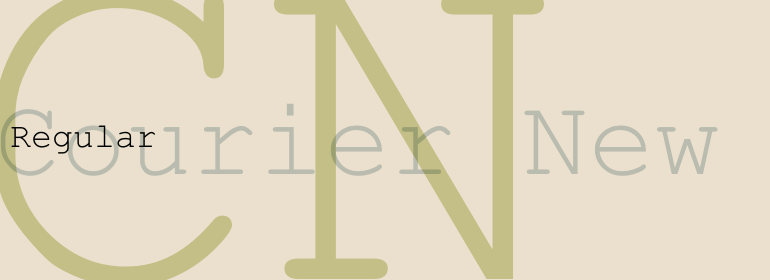

#### Lucida Console

字体族科包括: "Lucida Console", "Lucida Sans Typewriter", Monaco, "Bitstream Vera Sans Mono";

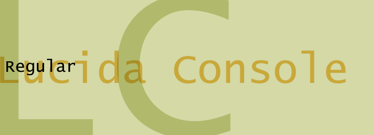

#### Lucida Sans Typewriter

字体族科包括: "Lucida Sans Typewriter", "Lucida Console", Monaco, "Bitstream Vera Sans Mono";

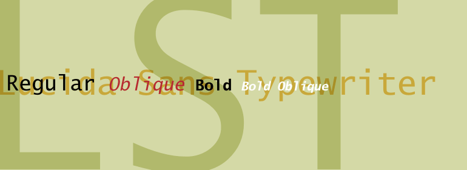

### 网页设计中最常见的梦幻体和花体

#### Brush Script MT

字体族科包括:"Brush Script MT", 花体英文;

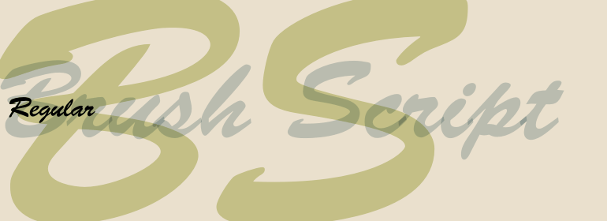

#### Copperplate

字体族科包括:Copperplate, "Copperplate Gothic Light", 梦幻字体;

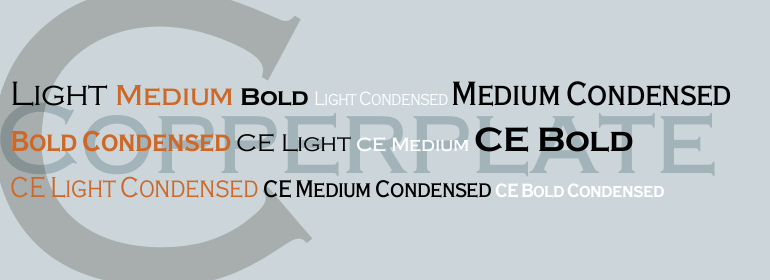

#### Papyrus

字体族科包括:Papyrus, 梦幻字体;

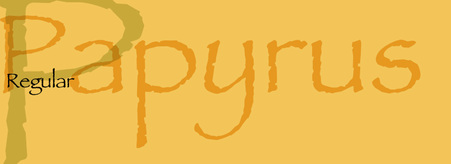

### 适合移动设备显示的网页安全字体

如果你的网页设计针对移动设备，那么上面的很多字体并不使用，因为空间有限。

下面是一些适合移动设备的网页安全字体。

Arial  
Courier  
Georgia  
Palatino  
Verdana  
Helvetica  
Courier New  
Times New Roman

希望大家伙能有所收获，在网页设计中添加英文的时候注意这几点。

**原文地址：**[designzzz](http://www.designzzz.com/ideal-fonts-for-web/)  

#### 
原文出处：<a href='https://www.uisdc.com/best-fonts-for-graphic-design' target='blank'>耐看好用！专业平面设计师常用的那些中文字体</a>

[@设计便利店](https://weibo.com/designmarter)：前段时间，有小伙伴问我平时用什么中文字体，今天就给大家推荐几款不同类型，好用耐看的中文字体，解决你们的选择困难症。

同款推荐：[《好字体都在这！专业平面设计师常用的11款英文字体》](http://www.uisdc.com/english-font-graphic-designer-use)

### 1. 精致黑体字型

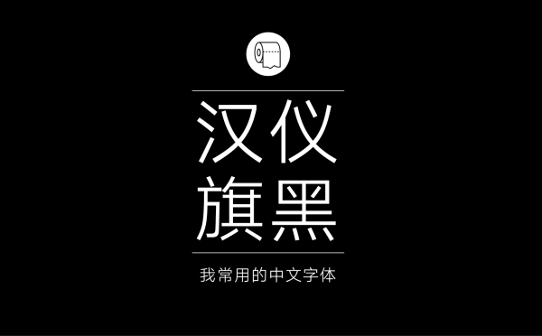

△  汉仪旗黑

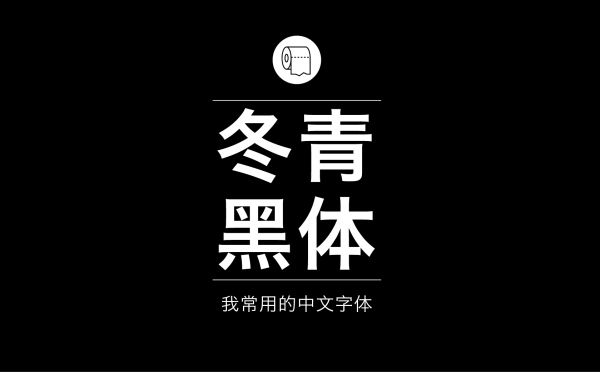

△  冬青黑体简体中文

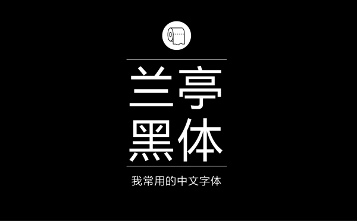

△  方正兰亭黑简体 （方正最火的黑体系列之一，现代感很强的黑体字）

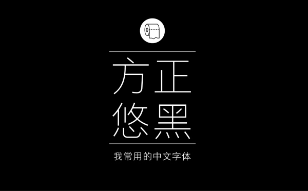

△  方正悠黑 （我个人非常喜欢的一套，笔画字型都很精致）

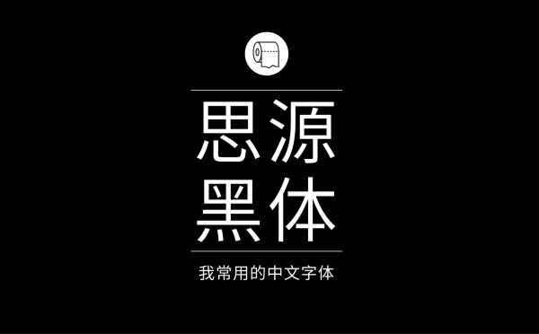

△   思源黑体 ( 我本人用的最多的字体，因为易用耐看，而且是免商用！)

### 2. 优美宋体字型

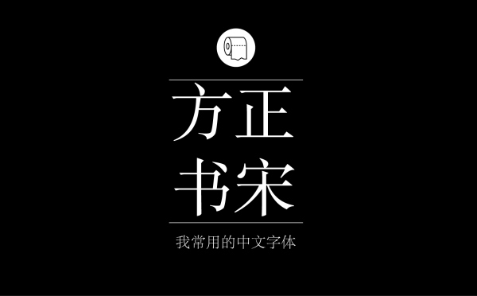

△   方正书宋简体

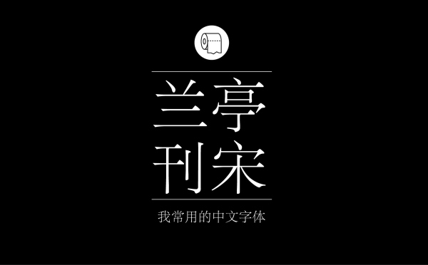

△  方正兰亭刊宋

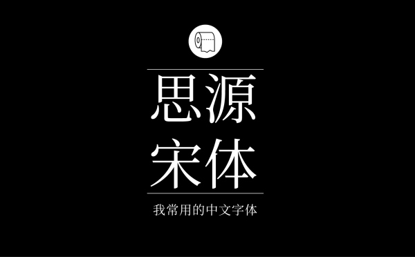

△  思源宋体（前段时间刷遍朋友圈的字体，以后宋体字不用愁）

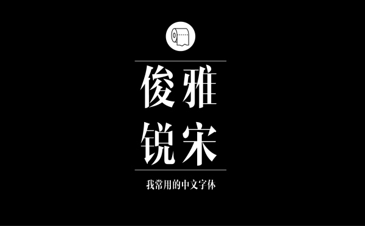

△  造字工房俊雅锐宋（造字工房这套字强化了宋体“横细竖粗”的特点，同时又去掉了笔末装饰，让这套字体整体感既有设计感，又不失传统韵味。）

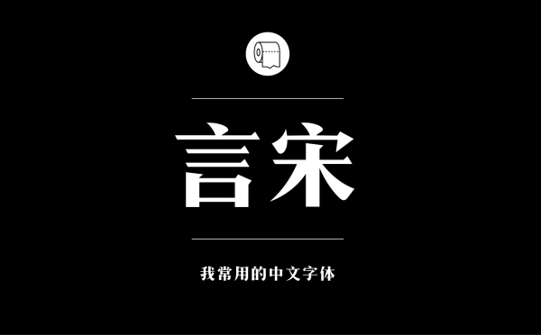

△   造字工房言宋

### 3.现代美术字型

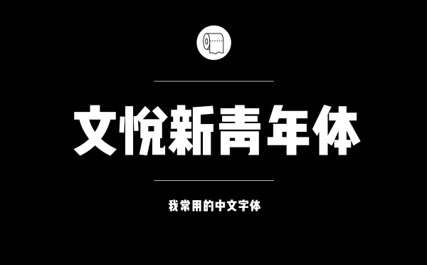

△   文悦新青年体（这套简直就是网红字体，应该是近期最火爆的一款，适用性很强，特别是用在海报，banner等设计上，像奇葩说这些综艺用的也是这套字体。）

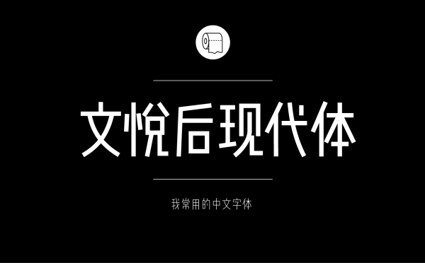

△   文悦后现代体（文悦科技这两套字体我个人都特别喜欢，设计感很强的美术字体）

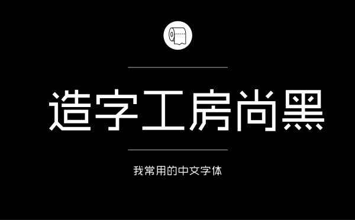

△  造字工房尚黑（造字工房早期的字体）

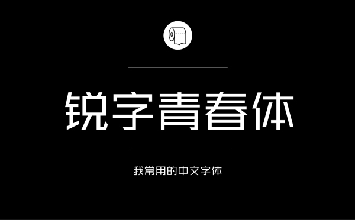

△   锐字逼格青春体（虽然字体名字有点low low的，但是有时候会用得上这类字型）

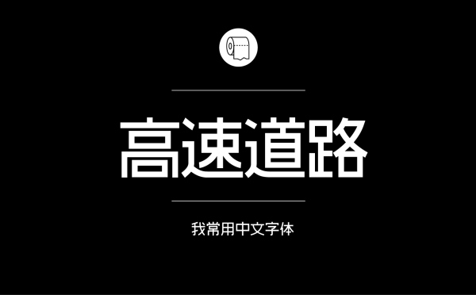

△   GD-高速道路ゴシック（这套是日本字体包，但里面有很多汉字可以借鉴，日本字体的字型处理总有一种独特的味道。）

### 4. 韵味复古字型

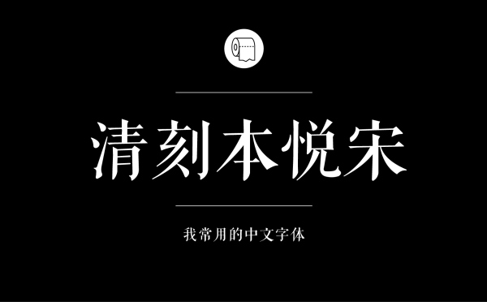

△  方正清刻本悦宋简体（曾经很喜欢这一类的刻本的字型，还有另一套爆款：康熙字典体，正因为这两套的影响才有了后面设计“燕安字”的想法。）

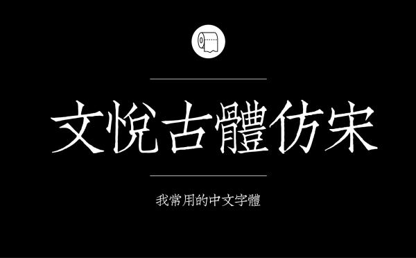

△  文悦古体仿宋 （我一直都有在研究如何将仿宋的字型现代化，文悦这套字做的是很不错的，很有味道。）

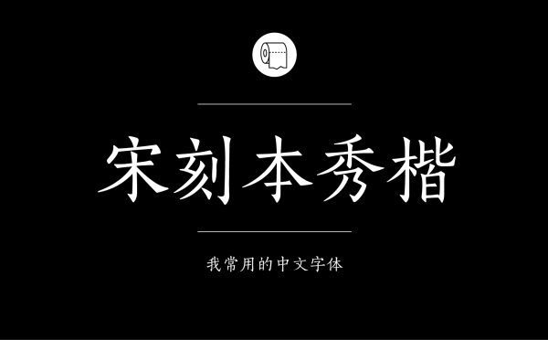

△   方正宋刻本秀楷简体

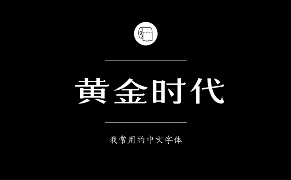

△  造字工房黄金时代 （这套字体很有明国时期的复古感。）

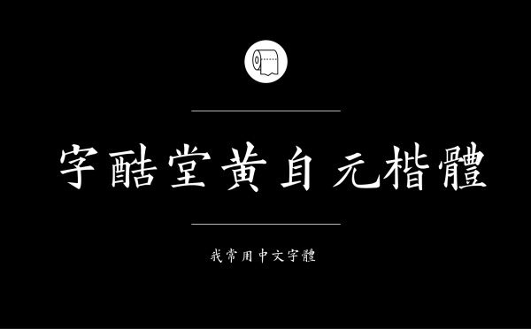

△  字酷堂黄自元楷体

### 5. 传统书法字型

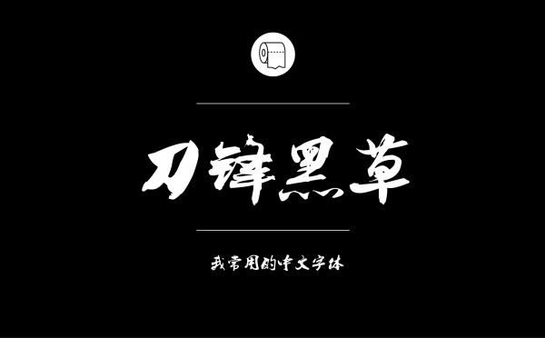

△   叶根友刀锋黑草（叶根友的系列字体中我比较喜欢这一套，挺有气势的。）

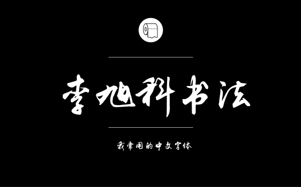

△  李旭科书法（书法在日常的版式中我比较少用到，个人更多的是在学习书法的起笔落笔等，对我做标志设计有很大帮助。）

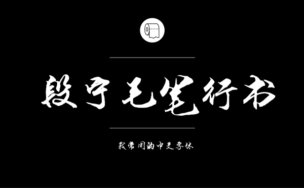

△  段宁毛笔行书

### 6. 日式毛笔字型

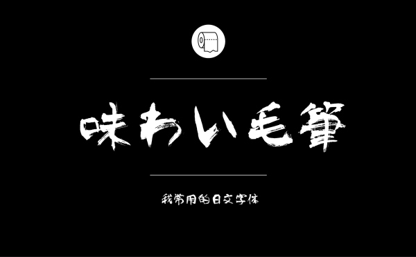

△   味わい毛筆（日本的毛笔字库比国内的多很多，很多字型都值得参考学习。）

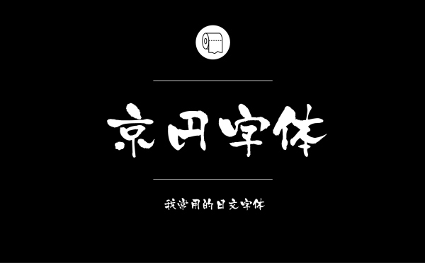

△  京円

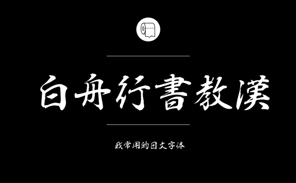

△  白舟行書教漢

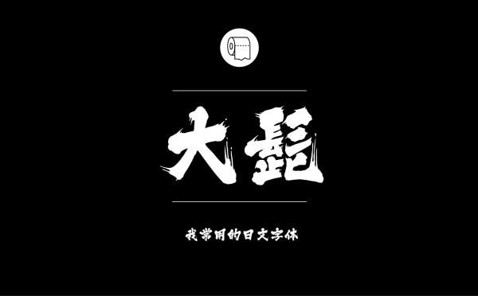

△  大髭

以上就我给大家总结的我常用的中文字体包，所有的字体仅供学习参考，如需商用，请购买版权！还是那句话，做字体是一件伟大的事情，尊重知识产权，尊重字体师，谢谢。

#### 
原文出处：<a href='https://www.uisdc.com/classic-english-fonts-recommend' target='blank'>永不过时！有哪些值得推荐的经典款英文字体？</a>

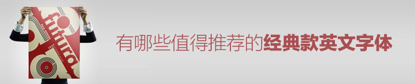

编者按：绝对值得转存！之前推荐的英文字体包，大多是新近的免费资源，质量上众口不一。今天这组不同，经过几十年甚至上百年的时间洗练，字体价值为业界公认（附有特点解说），当你不知道选哪个字体时，直接来这挑，准没错 >>>

兄弟教程：[《超实用！有哪些活泼而高端且不俗套的中文字体？》](http://www.uisdc.com/refined-elegant-chinese-fonts)

字体已规范命名，全部打包，[微盘下载](http://vdisk.weibo.com/s/sPguC5VuxYnBD)

梁木东：我把英文字体的衬线字体和无衬线字体分开来介绍，先从无衬线字体开始说。

#### **Futura**

我首先推荐Futura字体，这是我设计中使用最多的字体。这个字体继承包豪斯的设计理念，很有现代风格，看着非常舒服，适合印刷排版和设计。还有这个字体的阿拉伯数字也很好看！

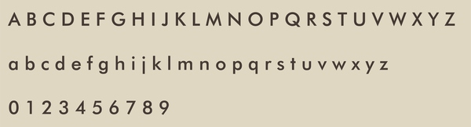

#### **DIN**

在德国的交通标识和公共空间中已经效力数十年，字体历史里的“德国制造”。代表了一种把简单的解决办法标准化的思想。这个是在标准网格上创造出来的字体，非常适合设计。

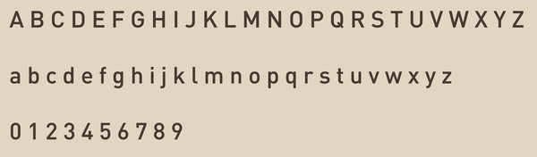

包豪斯[设计学院](https://www.uisdc.com?s=设计学院)墙面上的字体是 FF DIN字体。

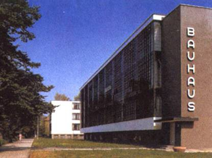

#### **Frutiger**

简单易懂又有意思，一般用于导视系统设计领域。

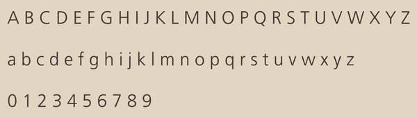

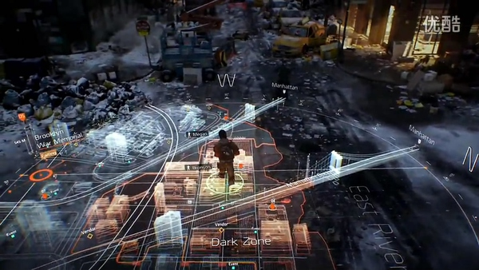

育碧游戏《全境封锁》的开发者视频里，就提到中主角展开的3D MAP，包括整个导视系统使用的字体就是Frutiger字体的变形。

#### **Verdana**

是以Frutiger字体为蓝本设计的，目的是将其改造成适合屏幕的字体，很多网页和UI设经常用到这个字体。

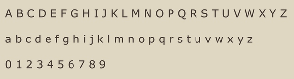

#### **Optima**

一种富有人文主义情怀的字体，Optima字体严格遵循了黄金分割原则，所以有着优美的比例。十分受大众喜爱的字体。

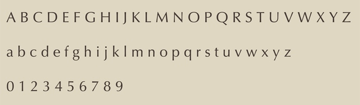

Optima字体是越战纪念碑所使用的字体。

#### **Consolas**

程序设计常用到的字体，这个字体的特别之处在于即使缩小很多也能保证识别性，这个设计迎合程序员快速阅读代码的需要。但不知道用于设计会是什么效果。

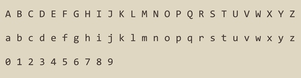

#### **Arial**

微软御用字体，设计的目的是在电脑屏幕上不同分辨率下的可读性，属于万能字体。不过比较普通，用在各种场合也不会容易出现违和感。和Helvetica字体很相似。

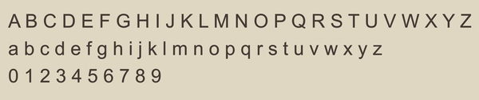

#### **Adele**

听名字就知道是谁家的御用字体了，这个字体纤细饱满，很有视觉效果，值得推荐。

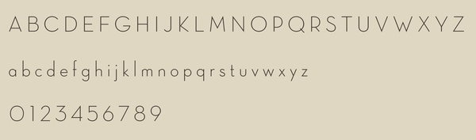

#### **Helvetica**

无衬线字体经典之作！！是世界排名第一的字体，被无数的企业使用作为标准字，也是[苹果](https://www.uisdc.com/tag/%e8%8b%b9%e6%9e%9c)电脑的御用字体。这个字体适合各个领域，是现主义设计的典范。

传奇经历看：[《大开眼界！HELVETICA字体的15种妙用》](http://www.uisdc.com/15-weird-helvetica)

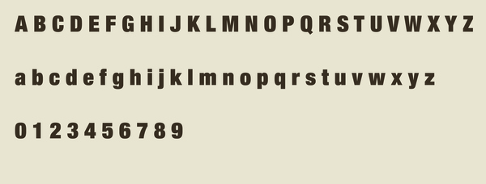

我最喜欢的品牌“无印良品”，它的LOGO就是使用了Helvetica字体。

以下就衬线字体了。

#### **Garamond**

如果说Helvetica字体是无衬线字体的典范的话，那么这个字体就是衬线字体的典范，经典的设计里常出现的字体。

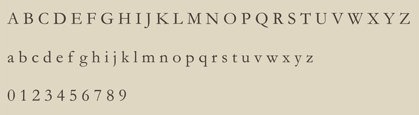

#### **Caslon**

遍寻无果，望见谅。有此字体资源的同学可在评论分享地址，感谢 ：）

在巴洛克风格字样的基础上改造，一款非常精美的字体，有着很悠久的历史。

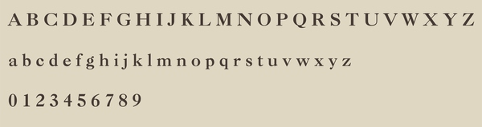

独立宣言（标题）

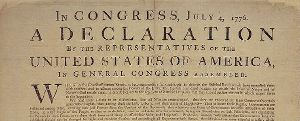

#### **Bookman old style（****上图）和New roman字体（下图）**

这两种字体类似，所以合并在一起来讲。国外报纸常用到的印刷字体，和Consolas字体一样，即使缩小后易读性依然很高，阅读起来很舒服。不过和这两种字体和Garamond字体一样，因为字重小，都不适合用来做标题。

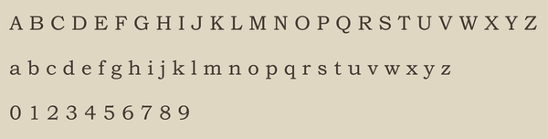
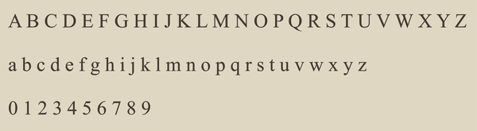

#### **Coueier**

过去打字机打出来的字体样式，用在设计上会有特别的效果。

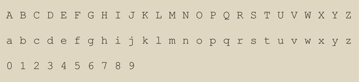

#### **Blackletter**

一种传统的英文手写体，有着强烈的形式感，属于哥特式英文字体。由于这种字体放在现在过于炫酷，所以设计时一定要慎用…

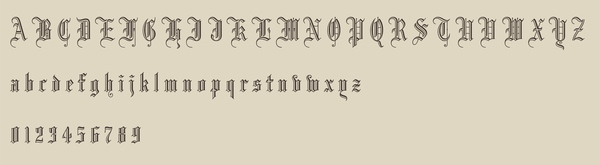

#### **Trajan**

前身是“古罗马大写字母”，属于石碑体。字体端正有气势，有历史厚重感。覆盖在各种类型的电影海报上。因为罗马时代没有小写字母，所以这个字体只有大写。

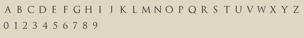

泰坦尼克号电影海报（标题）

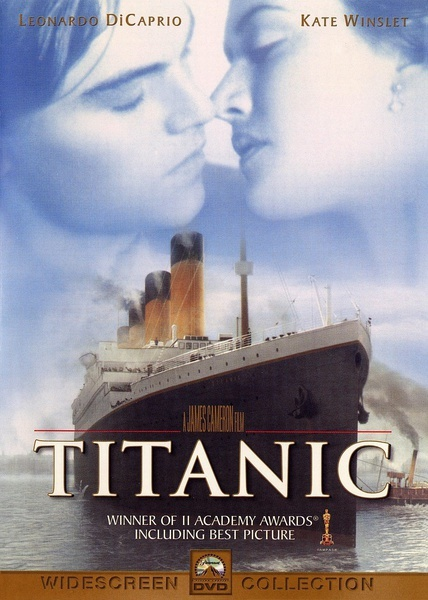

#### **Bodoni**

被誉为“现代主义风格最完美的体现”。字体粗细对比强烈，给人优雅浪漫的感觉，常用于时尚杂志或书籍设计中。

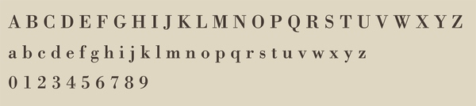

田中一光的《设计的觉醒》封面英文所使用的字体，就是Bodoni字体。

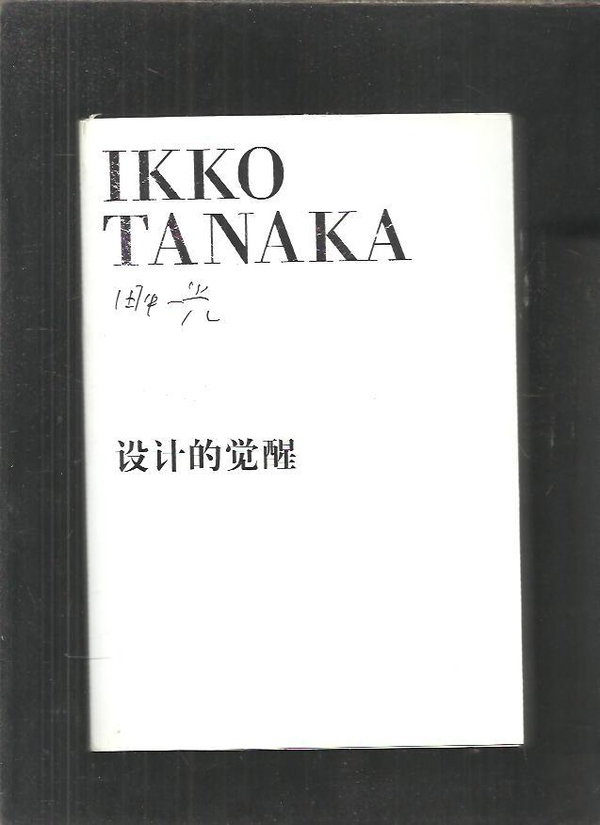
