 
<!--BEGIN_DATA
{
    "create_date": "2016-12-20 09:52", 
    "modify_date": "2016-12-20 09:52", 
    "is_top": "0", 
    "summary": "", 
    "tags": "设计模式、Java", 
    "file_name": "设计模式Java.md"
}
END_DATA-->

####<p>原文出处：<a href='http://blog.csdn.net/zjf280441589/article/details/50235937' target='blank'>单例模式</a></p>

####单例模式

标签 ： Java与设计模式

> 经典的《[设计模式:可复用面向对象软件的基础](https://book.douban.com/subject/1052241/)》一书归纳出23种设计模式, 23种设计模式又可划分为3类: **_创建型模式_**, **_结构型模式_**, **_行为型模式_**.

###创建型模式

> 社会分工越来越细, 在软件设计方面自然也是如此,对象的创建和使用分开也就成了必然趋势: 如果对象创建会消耗很多系统资源, 那么单独对对象的创建进行研究,从而**高效地创建对象**就是 **_创建型模式_** 要探讨的问题. 有6个具体的创建型模式可供研究,它们分别是: **单例模式**、**工厂模式(简单工厂/工厂方法/抽象工厂)** 、**建造者模式** 、**原型模式**.

###单例模式

> 保证一个类只有一个实例, 并提供一个访问他的全局访问点.

  * 场景:   

    * Windows任务管理器;
    * `文件系统`: 一个操作系统只能有一个文件系统;
    * 数据库连接池;
    * Spring: 一个`Component`就只有一个实例;
    * JavaWeb: 一个`Servlet`只有一个实例;

####实现

> 常见的**单例模式**实现方式有五种: 饿汉式, 懒汉式, 双重检测锁, 静态内部类, enum枚举.

  * 实现要点: 

    * 隐藏构造器
    * static Singleton实例
    * 暴露实例获取方法   

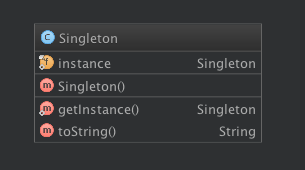

  * 追求目标

    * 线程安全
    * 调用效率高
    * 延迟加载

####1. 饿汉式
    
    
    /**
     * 饿汉式
     * 问题: 如果只是加载本类, 而没有调用getInstance方法, 会造成资源浪费
     * Created by jifang on 15/12/4.
     */
    public class HungerSingleton {
        /**
         * 类初始化时理解初始化该实例
         * 类加载时, 天然的线程安全时刻
         */
        private static final HungerSingleton instance = new HungerSingleton();
        private HungerSingleton() {
        }
        /**
         * 方法没有同步(synchronized), 调用效率高
         */
        public static HungerSingleton getInstance() {
            return instance;
        }
        @Override
        public String toString() {
            return "HungerSingleton{}";
        }
    }

####2. 懒汉式  
    
    /**
     * 懒汉式
     * 问题: 每次调用getInstance都要同步(synchronized), 效率降低
     * Created by jifang on 15/12/4.
     */
    public class LazySingleton {
        /**
         * 类加载时并没初始化, 延迟加载
         */
        private static LazySingleton instance;
        private LazySingleton() {
        }
        /**
         * 注意synchronized, 线程安全
         */
        public static synchronized LazySingleton getInstance() {
            if (instance == null) {
                instance = new LazySingleton();
            }
            return instance;
        }
        @Override
        public String toString() {
            return "LazySingleton{}";
        }
    }


####3. 双重检测锁

由于**同步**(`synchronized`)只在第一次实例化`Instance`时才需要,也就是单例类实例创建时, 因此我们使用双重检测锁(double checked locking pattern)实现:   
    
    /**
     * 双重锁定实现
     * 问题: 适用于JDK1.5之后的版本
     * Created by jifang on 15/12/4.
     */
    public class DoubleCheckSingleton {
        /**
         * 需要使用volatile
         * 保证所有的写(write)都将先行发生于读(read)
         */
        private static volatile DoubleCheckSingleton instance;
        private DoubleCheckSingleton() {
        }
        public static DoubleCheckSingleton getInstance() {
            if (instance == null) {                          //Single Checked
                synchronized (DoubleCheckSingleton.class) {
                    if (instance == null) {                  // Double Checked
                        instance = new DoubleCheckSingleton();
                    }
                }
            }
            return instance;
        }
        @Override
        public String toString() {
            return "DoubleCheckSingleton{}";
        }
    }

> 注: 有文章中指出 **_由于JVM底层内部模型原因, 双重锁定偶尔会出问题, 不建议使用_**, 但自1.5开始, 该问题已经被解决,因此可放心使用, 详见[如何在Java中使用双重检查锁实现单例](http://www.importnew.com/12196.html).

####4\. 静态内部类   
    
    /**
     * 静态内部类实现Singleton
     * Created by jifang on 15/12/4.
     */
    public class StaticInnerSingleton {
        /**
         * 外部类没有static属性, 因此加载本类时不会立即初始化对象
         */
        private static class InnerClassInstance {
            private static final StaticInnerSingleton instance = new StaticInnerSingleton();
        }
        private StaticInnerSingleton() {
        }
        /**
         * 只有真正调用getInstance方法时, 才会加载静态内部类(延迟加载), 而且加载类是天然的线程安全的(线程安全), 没有synchronized(调用效率高)
         *
         * @return
         */
        public static StaticInnerSingleton getInstance() {
            return InnerClassInstance.instance;
        }
        @Override
        public String toString() {
            return "StaticInnerSingleton{}";
        }
    }

####5\. 枚举  
    
    /**
     * 枚举实现单例
     * 基于JVM底层实现, Enum天然的单例以及线程安全
     * Created by jifang on 15/12/5.
     */
    public enum EnumSingleton {
        /**
         * 构造方法默认为private
         */
        INSTANCE;
        /**
         * 可以添加其他操作
         * other operation
         */
        private String name;
        public String getName() {
            return name;
        }
        public void setName(String name) {
            this.name = name;
        }
        @Override
        public String toString() {
            return "EnumSingleton{" +
                    "name='" + name + '\'' +
                    '}';
        }
    }

####实现对比

方式 优点 缺点

饿汉式

线程安全, 调用效率高

不能延迟加载

懒汉式

线程安全, 可以延迟加载

调用效率不高

双重检测锁

线程安全, 调用效率高, 可以延迟加载

-

静态内部类

线程安全, 调用效率高, 可以延迟加载

-

枚举

线程安全, 调用效率高

不能延迟加载

###破解与防御

####反射破解单例

可以利用Java的反射机制破解单例模式(`Enum`无法破解, 由于基于JVM底层实现),下面仅破解**双重检测锁**, 其他类同不再赘述:

    
    
    /**
     * 单例破解
     * Created by jifang on 15/12/4.
     */
    public class TestCase {
        @Test
        public void testBreakDoubleCheck() {
            try {
                Class<DoubleCheckSingleton> clazz = (Class<DoubleCheckSingleton>) Class.forName("com.feiqing.singleton.DoubleCheckSingleton");
                Constructor<DoubleCheckSingleton> constructor = clazz.getDeclaredConstructor();
                constructor.setAccessible(true);
                DoubleCheckSingleton instance1 = constructor.newInstance();
                DoubleCheckSingleton instance2 = constructor.newInstance();
                System.out.println("singleton? " + (instance1 == instance2));
                System.out.println(instance1.hashCode());
                System.out.println(instance2.hashCode());
            } catch (ClassNotFoundException e) {
                e.printStackTrace();
            } catch (NoSuchMethodException e) {
                e.printStackTrace();
            } catch (InvocationTargetException e) {
                e.printStackTrace();
            } catch (InstantiationException e) {
                e.printStackTrace();
            } catch (IllegalAccessException e) {
                e.printStackTrace();
            }
        }
    }


####序列化破解单例

 * 对懒汉式破解, 需要首先对`LazySingleton`进行改造,支持序列化:
    
```java
public class LazySingleton implements Serializable{
    private static final long serialVersionUID = 8511876423469188139L;
    /**
     * 类加载时并没初始化, 延迟加载
     */
    private static LazySingleton instance;
    private LazySingleton() {
        if (instance != null){
            throw new RuntimeException();
        }
    }
    /**
     * 注意synchronized, 线程安全
     */
    public static synchronized LazySingleton getInstance() {
        if (instance == null) {
            instance = new LazySingleton();
        }
        return instance;
    }
    @Override
    public String toString() {
        return "LazySingleton{}";
    }
}
```

  * 破解:
    
```java   
public class TestCase {
    private static final String SYSTEM_FILE = "/tmp/save.txt";
    @Test
    public void testBreakLazy() {
        LazySingleton instance1 = LazySingleton.getInstance();
        try {
            ObjectOutputStream oos = new ObjectOutputStream(new FileOutputStream(SYSTEM_FILE));
            oos.writeObject(instance1);
            ObjectInputStream ois = new ObjectInputStream(new FileInputStream(SYSTEM_FILE));
            LazySingleton instance2 = (LazySingleton) ois.readObject();
            System.out.println("singleton? " + (instance1 == instance2));
            System.out.println(instance1.hashCode());
            System.out.println(instance2.hashCode());
        } catch (IOException e) {
            e.printStackTrace();
        } catch (ClassNotFoundException e) {
            e.printStackTrace();
        }
    }
}
```

####序列化防御

  * 在`LazySingleton`添加`readResolve()`方法:
    
    
        /**
         * 反序列化时, 如果定义了readResolve方法, 则直接返回此方法制定的对象.
         *
         * @return
         */
        private Object readResolve() {
            return instance;
        }

> 详细可参考: [深入理解Java对象序列化](http://developer.51cto.com/art/201202/317181.htm).


###性能测试

    
    
    /**
     * 单例性能测试
     * Created by jifang on 15/12/4.
     */
    public class TestCase {
        private static final String SYSTEM_FILE = "/tmp/save.txt";
        private static final int THREAD_COUNT = 10;
        private static final int CIRCLE_COUNT = 100000;
        @Test
        public void testSingletonPerformance() throws IOException, InterruptedException {
            final CountDownLatch latch = new CountDownLatch(THREAD_COUNT);
            FileWriter writer = new FileWriter(new File(SYSTEM_FILE), true);
            long start = System.currentTimeMillis();
            for (int i = 0; i < THREAD_COUNT; ++i) {
                new Thread(
                        new Runnable() {
                            @Override
                            public void run() {
                                for (int i = 0; i < CIRCLE_COUNT; ++i) {
                                    Object instance = HungerSingleton.getInstance();
                                }
                                latch.countDown();
                            }
                        }
                ).start();
            }
            latch.await();
            long end = System.currentTimeMillis();
            writer.append("HungerSingleton 共耗时: " + (end - start) + " 毫秒\n");
            writer.close();
        }
    }

  * 结果

* 单例实现 耗时

1

`HungerSingleton`

30 毫秒

2

`LazySingleton`

48 毫秒

3

`DoubleCheckSingleton`

25 毫秒

4

`StaticInnerSingleton`

16 毫秒

5

`EnumSingleton`

6 毫秒

> `Enum`毫无疑问的成为了实现单例的王者, [＜Effective
Java＞](https://book.douban.com/subject/3998727/)中也推荐使用,
因此Enum成为Java中实现单例的最好方式, 但是Enum也有其自身的限制, 因此在使用时还需要做一番权衡.


###小结

> 由于单例模式只生成一个实例, 减少了系统性能开销, 因此 **_当一个对象的产生需要比较多的资源时(如读取配置/产生其他依赖对象),
则可以通过只产生一个单例对象, 然后永久驻留内存的方式来提高系统整体性能_**.


<hr>


####<p>原文出处：<a href='http://blog.csdn.net/zjf280441589/article/details/50282773' target='blank'> 工厂模式</a></p>

#####工厂模式

> 工厂模式  
用工厂方法代替了new操作, 将`选择实现类`, `创建对象`统一管理和控制.从而将调用者(Client)与实现类进行解耦.实现了`创建者与调用者分离`;

  * 使用场景   

    1. JDK中Calendar的getInstance方法;
    2. JDBC中Connection对象的获取;
    3. MyBatis中SqlSessionFactory创建SqlSession;
    4. SpringIoC容器创建并管理Bean对象;
    5. 反射Class对象的newInstance;
    6. ….

####静态工厂模式

> 静态工厂模式是工厂模式中最简单的一种，他可以用比较简单的方式隐藏创建对象的细节，一般只需要告诉工厂类所需要的类型，工厂类就会返回需要的产品类，而客户端看到的也只是产品的抽象对象(interface)，因此`无需关心到底是返回了哪个子类`

  * 我们以运算符类为例, 解释静态工厂模式.   
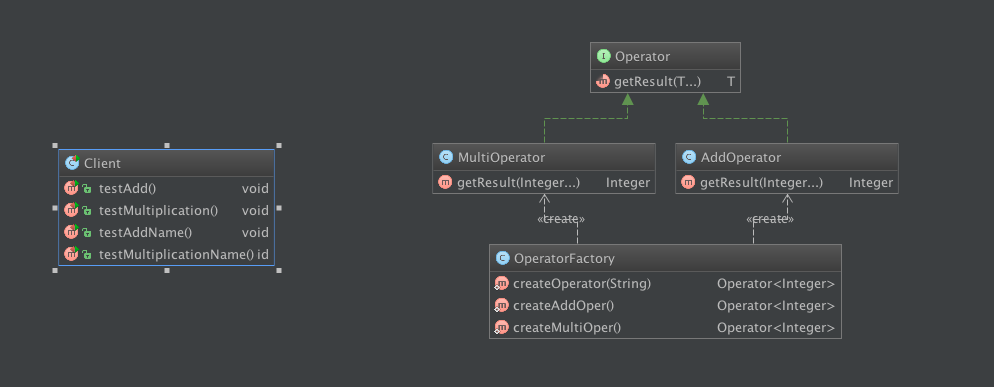

  * Operator接口
    
```java
/**
 * 运算符接口
 * Created by jifang on 15/12/7.
 */
public interface Operator<T> {
    T getResult(T... args);
}
```

  * 实现类
    
```java
public class AddOperator implements Operator<Integer> {
    @Override
    public Integer getResult(Integer... args) {
        int result = 0;
        for (int arg : args) {
            result += arg;
        }
        return result;
    }
}
    
    
public class MultiOperator implements Operator<Integer> {
    @Override
    public Integer getResult(Integer... args) {
        int result = 1;
        for (int arg : args) {
            result *= arg;
        }
        return result;
    }
}
```

  * 工厂
    
```java
/**
 * 静态工厂(注: 只返回产品的抽象[即接口])
 * 包含两种实现策略
 * 1. 根据传入的operator名进行实例化对象
 * 2. 直接调用相应的构造实例的方法
 * Created by jifang on 15/12/7.
 */
public class OperatorFactory {
    public static Operator<Integer> createOperator(String operName) {
        Operator<Integer> operator;
        switch (operName) {
            case "+":
                operator = new AddOperator();
                break;
            case "*":
                operator = new MultiOperator();
                break;
            default:
                throw new RuntimeException("Wrong Operator Name: " + operName);
        }
        return operator;
    }
    /* ** 第二种实现策略 ** */
    public static Operator<Integer> createAddOper() {
        return new AddOperator();
    }
    public static Operator<Integer> createMultiOper() {
        return new MultiOperator();
    }
}
```
  * Client
    
```java
public class Client {
    @Test
    public void testAdd() {
        Operator<Integer> operator = OperatorFactory.createOperator("+");
        System.out.println(operator.getResult(1, 2, 3, 4, 6));
    }
    @Test
    public void testMultiplication() {
        Operator<Integer> operator = OperatorFactory.createOperator("*");
        System.out.println(operator.getResult(1, 2, 3, 4, 6));
    }
    @Test
    public void testAddName(){
        Operator<Integer> operator = OperatorFactory.createAddOper();
        System.out.println(operator.getResult(1, 2, 3, 4, 6));
    }
    @Test
    public void testMultiplicationName() {
        Operator<Integer> operator = OperatorFactory.createMultiOper();
        System.out.println(operator.getResult(1, 2, 3, 4, 6));
    }
}
```

>   * 优点
>
>     1. 隐藏了对象创建的细节，将产品的实例化过程放到了工厂中实现。
>     2. 客户端基本不用关心使用的是哪个产品，只需要知道用工厂的那个方法(或传入什么参数)就行了.
>     3. 方便添加新的产品子类，每次只需要修改工厂类传递的类型值就行了。
>     4. 遵循了`依赖倒转`原则。
>   * 缺点
>
>     1. 适用于产品子类型差不多, 使用的方法名都相同的情况.
>     2. 每添加一个产品子类，都必须在工厂类中添加一个判断分支(或一个方法)，这违背了`OCP(开放-封闭原则)`。


####工厂方法模式

> 由于静态工厂方法模式不满足`OCP`, 因此就出现了`工厂方法模式`; 工厂方法模式和静态工厂模式最大的不同在于:_静态工厂_模式只有一个(对于一个项目/独立模块)只有一个工厂类, 而_工厂方法_模式则有一组实现了相同接口的工厂类.

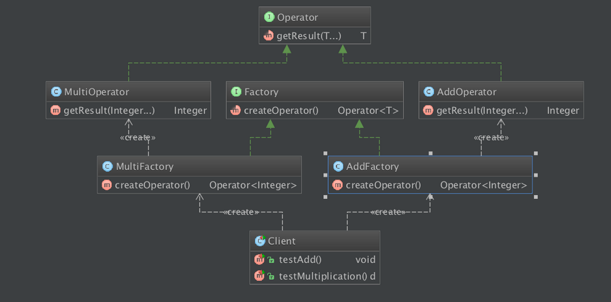

  * 工厂
    
```java 
/**
 * Created by jifang on 15/12/7.
 */
public interface Factory<T> {
    Operator<T> createOperator();
}
```
  * 工厂实现
    
```java 
/**
 * 加法运算符工厂
 * Created by jifang on 15/12/7.
 */
public class AddFactory implements Factory<Integer> {
    @Override
    public Operator<Integer> createOperator() {
        return new AddOperator();
    }
}
    
    
/**
 * 乘法运算符工厂
 * Created by jifang on 15/12/7.
 */
public class MultiFactory implements Factory<Integer> {
    @Override
    public Operator<Integer> createOperator() {
        return new MultiOperator();
    }
}
```

`Operator`, `AddOperator`与`MultiOperator`与上例相同.此时, 如果要在_静态工厂_中新增加一个`开根运算类`, 要么需要在`createOperator`方法中增加一种`case`,要么得增加一个`createSqrtOper`方法, 都是需要修改原来的代码的. 而在_工厂方法_中只需要再添加一个`SqrtFactory`即可:  

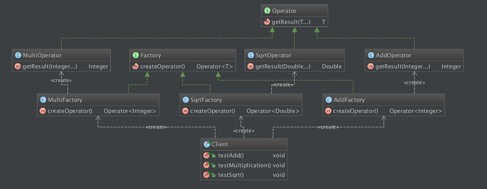

```java  
/**
 * 开根运算符
 * Created by jifang on 15/12/7.
 */
public class SqrtOperator implements Operator<Double> {
    @Override
    public Double getResult(Double... args) {
        if (args != null && args.length >= 1) {
            return Math.sqrt(args[0]);
        } else {
            throw new RuntimeException("Params Number Error " + args.length);
        }
    }
}
    
    
/**
 * 开根工厂
 * Created by jifang on 15/12/7.
 */
public class SqrtFactory implements Factory<Double> {
    @Override
    public Operator<Double> createOperator() {
        return new SqrtOperator();
    }
}
```

> 优点  
基本与静态工厂模式一致，多的一点优点就是遵循了开放-封闭原则，使得模式的灵活性更强。
>
> 缺点  
静态工厂模式差不多, 但是增加了类组织的复杂性;
>
> 小结  
虽然根据理论原则, 需要使用工厂方法模式, 但实际上, 常用的还是静态工厂模式.

* * *

####抽象工厂模式

> 抽象工厂模式: 提供一个创建一系列相关或相互依赖对象的接口, 而无需指定他们具体的类.

抽象工厂模式与工厂方法模式的区别:

  * 抽象工厂模式是工厂方法模式的升级版本，他用来创建一组相关或者相互依赖的对象。他与工厂方法模式的区别就在于，工厂方法模式针对的是`一个产品等级结构`；而抽象工厂模式则是针对的`多个产品等级结构`. 在编程中，通常一个产品结构，表现为一个接口或者抽象类，也就是说，工厂方法模式提供的所有产品都是衍生自同一个接口或抽象类，而抽象工厂模式所提供的产品则是衍生自不同的接口或抽象类(如下面的Engine, Tyre, Seat).

在抽象工厂模式中，提出了产品族的概念：所谓的产品族，是指位于不同产品等级结构中功能相关联的产品组成的家族(如Engine, Tyre, Seat)。抽象工厂模式所提供的一系列产品就组成一个产品族；而工厂方法提供的一系列产品称为一个等级结构.

示例:

  * 现在我们要生产两款车: 高档(LuxuryCar)与低档(LowCar), 他们分别配有高端引擎(LuxuryEngine), 高端座椅(LuxurySeat), 高端轮胎(LuxuryTyre)和低端引擎(LowEngine), 低端座椅(LowSeat), 低端轮胎(LowTyre), 下面我们用抽象工厂实现它:   

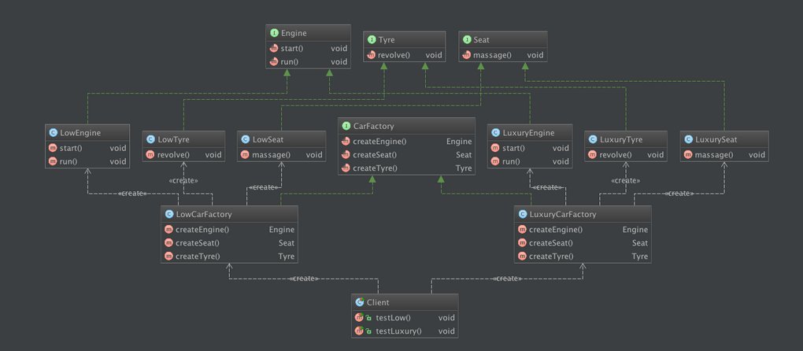  

_`LuxuryCarFactory`与`LowCarFactory`分别代表一类产品族的两款产品, 类似于数据库产品族中有MySQL, Oracle,
SqlServer_

#####1\. 产品

  * Engine
    
```java   
public interface Engine {
    void start();
    void run();
}
class LowEngine implements Engine {
    @Override
    public void start() {
        System.out.println("启动慢 ...");
    }
    @Override
    public void run() {
        System.out.println("转速慢 ...");
    }
}
class LuxuryEngine implements Engine {
    @Override
    public void start() {
        System.out.println("启动快 ...");
    }
    @Override
    public void run() {
        System.out.println("转速快 ...");
    }
}
```
  * Seat
    
 ```java   
public interface Seat {
    void massage();
}
class LowSeat implements Seat {
    @Override
    public void massage() {
        System.out.println("不能按摩 ...");
    }
}
class LuxurySeat implements Seat {
    @Override
    public void massage() {
        System.out.println("可提供按摩 ...");
    }
}
```

  * Tyre
    
```java    
public interface Tyre {
    void revolve();
}
class LowTyre implements Tyre {
    @Override
    public void revolve() {
        System.out.println("旋转 - 不耐磨 ...");
    }
}
class LuxuryTyre implements Tyre {
    @Override
    public void revolve() {
        System.out.println("旋转 - 不磨损 ...");
    }
}
```
_注意: 其中并没有车类_

#####2\. 产品族Factory

  * Factory
    
```java
/**
 * Created by jifang on 15/12/7.
 */
public interface CarFactory {
    Engine createEngine();
    Seat createSeat();
    Tyre createTyre();
}
```
  * 低端车
    
```java
public class LowCarFactory implements CarFactory {
    @Override
    public Engine createEngine() {
        return new LowEngine();
    }
    @Override
    public Seat createSeat() {
        return new LowSeat();
    }
    @Override
    public Tyre createTyre() {
        return new LowTyre();
    }
}
```
  * 高端车
    
```java
public class LuxuryCarFactory implements CarFactory {
    @Override
    public Engine createEngine() {
        return new LuxuryEngine();
    }
    @Override
    public Seat createSeat() {
        return new LuxurySeat();
    }
    @Override
    public Tyre createTyre() {
        return new LuxuryTyre();
    }
}
```
#####3\. Client

```java
/**
 * Created by jifang on 15/12/7.
 */
public class Client {
    @Test
    public void testLow(){
        CarFactory factory = new LowCarFactory();
        Engine engine = factory.createEngine();
        engine.start();
        engine.run();
        Seat seat = factory.createSeat();
        seat.massage();
        Tyre tyre = factory.createTyre();
        tyre.revolve();
    }
    @Test
    public void testLuxury(){
        CarFactory factory = new LuxuryCarFactory();
        Engine engine = factory.createEngine();
        engine.start();
        engine.run();
        Seat seat = factory.createSeat();
        seat.massage();
        Tyre tyre = factory.createTyre();
        tyre.revolve();
    }
}
```
>   * 优点  
>     1. 封装了产品的创建，使得不需要知道具体是哪种产品，只需要知道是哪个工厂就行了。
>     2. 可以支持不同类型的产品，使得模式灵活性更强。
>     3. 可以非常方便的使用一族中间的不同类型的产品。
>   * 缺点  
>     1. 结构太过臃肿，如果产品类型比较多，或者产品族类比较多，就会非常难于管理。
>     2. 每次如果添加一组产品，那么所有的工厂类都必须添加一个方法，这样违背了开放-封闭原则。所以一般适用于产品组合产品族变化不大的情况。


####使用静态工厂优化抽象工厂

由于抽象工厂模式存在结构臃肿以及改动复杂的缺点(比如我们每次需要构造Car, 都需要进行`CarFactory factory = new XxxCarFactory();`, 而一般一个项目中只会生产一种Car, 如果我们需要更改生产的车的类型, 那么客户端的每一处调用都需要修改),因此我们可以使用静态工厂对其进行改造, 我们使用`CarCreator`来统一创建一个产品族不同产品, 这样如果我们的工厂将来更改了产品路线,改为生产高端车时, 我们仅需改变`CAR_TYEP`的值就可以了:

  
    /**
     * Created by jifang on 15/12/7.
     */
    public class CarCreator {
        private static final String CAR_TYPE = "low";
        private static final String CAR_TYPE_LOW = "low";
        private static final String CAR_TYPE_LUXURY = "luxury";
        public static Engine createEngine() {
            Engine engine = null;
            switch (CAR_TYPE) {
                case CAR_TYPE_LOW:
                    engine = new LowEngine();
                    break;
                case CAR_TYPE_LUXURY:
                    engine = new LuxuryEngine();
                    break;
            }
            return engine;
        }
        public static Seat createSeat() {
            Seat seat = null;
            switch (CAR_TYPE) {
                case CAR_TYPE_LOW:
                    seat = new LowSeat();
                    break;
                case CAR_TYPE_LUXURY:
                    seat = new LuxurySeat();
                    break;
            }
            return seat;
        }
        public static Tyre createTyre() {
            Tyre tyre = null;
            switch (CAR_TYPE) {
                case CAR_TYPE_LOW:
                    tyre = new LowTyre();
                    break;
                case CAR_TYPE_LUXURY:
                    tyre = new LuxuryTyre();
                    break;
            }
            return tyre;
        }
    }

其实我们还可以通过反射, 将`CarCreator`中的`switch-case`去掉, 而且在实际开发中, 字符串的值我们还可以从配置文件中读取, 这样, 如果需要更改产品路线, 我们连程序代码都懒得改了, 只需要修改配置文件就可以了.

    
    
    /**
     * Created by jifang on 15/12/7.
     */
    public class CarCreatorReflect {
        /**
         * 在实际开发中, 下面这些常量可以从配置文件中读取
         */
        private static final String PACKAGE = "com.feiqing.abstractfactory";
        private static final String ENGINE = "LuxuryEngine";
        private static final String TYRE = "LuxuryTyre";
        private static final String SEAT = "LuxurySeat";
        public static Engine createEngine() {
            String className = PACKAGE + "." + ENGINE;
            try {
                return (Engine) Class.forName(className).newInstance();
            } catch (InstantiationException e) {
                e.printStackTrace();
            } catch (IllegalAccessException e) {
                e.printStackTrace();
            } catch (ClassNotFoundException e) {
                e.printStackTrace();
            }
            return null;
        }
        public static Seat createSeat() {
            String className = PACKAGE + "." + SEAT;
            try {
                return (Seat) Class.forName(className).newInstance();
            } catch (InstantiationException e) {
                e.printStackTrace();
            } catch (IllegalAccessException e) {
                e.printStackTrace();
            } catch (ClassNotFoundException e) {
                e.printStackTrace();
            }
            return null;
        }
        public static Tyre createTyre() {
            String className = PACKAGE + "." + TYRE;
            try {
                return (Tyre) Class.forName(className).newInstance();
            } catch (InstantiationException e) {
                e.printStackTrace();
            } catch (IllegalAccessException e) {
                e.printStackTrace();
            } catch (ClassNotFoundException e) {
                e.printStackTrace();
            }
            return null;
        }
    }

这样, 客户端调起来就清爽多了

    
    
    /**
     * Created by jifang on 15/12/7.
     */
    public class StaticClient {
        @Test
        public void testLow() {
            Engine engine = CarCreator.createEngine();
            engine.run();
            engine.start();
            Seat seat = CarCreator.createSeat();
            seat.massage();
            Tyre tyre = CarCreator.createTyre();
            tyre.revolve();
        }
        @Test
        public void testLuxury() {
            Engine engine = CarCreatorReflect.createEngine();
            engine.run();
            engine.start();
            Seat seat = CarCreatorReflect.createSeat();
            seat.massage();
            Tyre tyre = CarCreatorReflect.createTyre();
            tyre.revolve();
        }
    }

* * *

####小结

分类 说明

静态工厂模式

用来生成同一等级结构中的任意产品, 对于增加新的产品, `需要修改已有代码`

工厂方法模式

用来生成同一等级结构的固定产品, 支持增加任意产品;

抽象工厂模式

用来生成不同`产品族`的全部产品, 对于增加新的产品无能为力;


<hr>


####<p>原文出处：<a href='http://blog.csdn.net/zjf280441589/article/details/50364943' target='blank'>原型模式</a></p>

####原型模式

> 原型模式  
用原型实例指定创建对象的种类, 并通过拷贝这些原型创建新的对象.

原型模式就是通过一个对象再创建另一个可定制的对象, 而且不需要知道任何创建的细节.  因此, 原型模式要求对象实现一个可以“克隆”自身的接口，这样就可以通过复制一个实例对象本身来创建一个新的实例。这样一来，通过原型实例创建新的对象，就不再需要关心这个实例本身的类型，只要实现了克隆自身的方法，就可以通过这个方法来获取新的对象，而无须再去通过new来创建。标准的原型模式的URL类图为:  

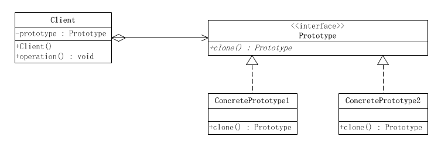  

但由于Java类库已经帮我们实现了一个`java.lang.Cloneable`接口, 因此我们的实现就简单了些,下面我们模仿**多利羊**的诞生过程:  

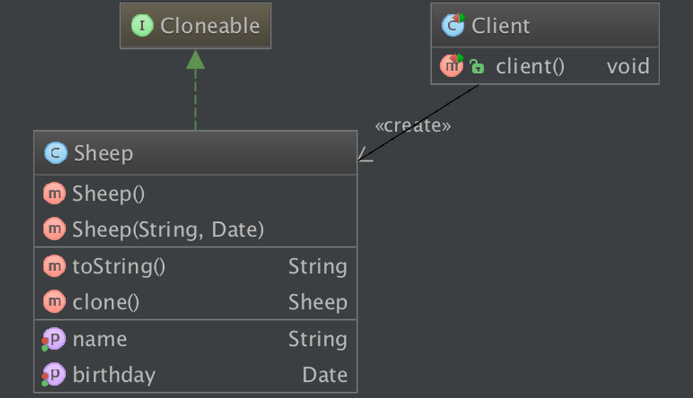

    
    
    /**
     * 该羊支持克隆
     * (浅复制)
     * Created by jifang on 15/12/9.
     */
    public class Sheep implements Cloneable {
        private String name;
        private Date birthday;
        public Sheep() {
        }
        public Sheep(String name, Date birthday) {
            this.name = name;
            this.birthday = birthday;
        }
        public String getName() {
            return name;
        }
        public void setName(String name) {
            this.name = name;
        }
        public Date getBirthday() {
            return birthday;
        }
        public void setBirthday(Date birthday) {
            this.birthday = birthday;
        }
        @Override
        public String toString() {
            return "Sheep{" +
                    "name='" + name + '\'' +
                    ", birthday=" + birthday +
                    '}';
        }
        @Override
        protected Sheep clone() throws CloneNotSupportedException {
            return (Sheep) super.clone();
        }
    }

  * Client
    
```java
public class Client {
    @Test
    public void client() throws CloneNotSupportedException {
        Date birthday = new Date();
        Sheep mother = new Sheep("多利母亲", birthday);
        System.out.println(mother);
        Sheep dolly = mother.clone();
        dolly.setName("多利");
        System.out.println(dolly);
    }
}
```
* * *

####浅复制与深复制

  * 浅复制   
在上面的Client上添加几行代码, 就可以发现问题:

```java
@Test
public void client() throws CloneNotSupportedException {
    Date birthday = new Date();
    Sheep mother = new Sheep("多利母亲", birthday);
    System.out.println(mother);
    Sheep dolly = mother.clone();
    dolly.setName("多利");
    System.out.println(dolly);
    birthday.setTime(123123123123L);
    System.out.println("dolly birthday: " + dolly.getBirthday());
}
```
运行上面的代码我们可以看到更改了mother的birthday, dolly的birthday也更改了. 这个问题是由浅复制引起的.

> 浅复制:  
创建当前对象的浅复制版本, 方法是创建一个新对象, 然后将当前对象的非静态字段复制到该新对象. 如果字段是值类型, 则对该字段执行逐位复制;
如果字段是引用类型, 则复制引用但不复制引用的对象; 因此原始对象及其副本引用同一对象;

此时运行的内存简化图如下:  

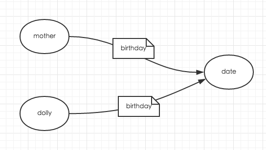  

可以看到mother和dolly的birthday指向同一个date对象.

  * 深复制版本   

> 深复制: 把引用对象的变量指向`复制过来的新对象`, 而不是原有的被引用的对象;

    
    
    @Override
    protected Sheep clone() throws CloneNotSupportedException {
        Sheep sheep = (Sheep) super.clone();
        // 添加下面代码支持深复制
        sheep.birthday = (Date) this.birthday.clone();
        return sheep;
    }

> 因此我们把Sheep的clone方法改成上面实现后, 再调用client方法就不会出现问题了, 此时的内存简图如下:  
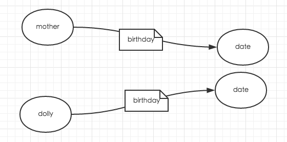

  * 利用序列化实现深复制   
Sheep需要先实现Serializable接口.

```java
@Override
protected Sheep clone() throws CloneNotSupportedException {
    ByteArrayOutputStream bos = new ByteArrayOutputStream();
    try {
        ObjectOutputStream oos = new ObjectOutputStream(bos);
        oos.writeObject(this);
        ObjectInputStream ois = new ObjectInputStream(new ByteArrayInputStream(bos.toByteArray()));
        return (Sheep) ois.readObject();
    } catch (IOException e) {
        e.printStackTrace();
    } catch (ClassNotFoundException e) {
        e.printStackTrace();
    }
    return null;
}
```

####原型模式性能测试

假设创建Sheep是比较耗时的, 在此基础上进行原型模式的额性能测试:

    
    
    /**
     * 模拟耗时的对象创建过程
     *
     * @param name
     * @param birthday
     */
    public Sheep(String name, Date birthday) {
        try {
            Thread.sleep(10);
        } catch (InterruptedException e) {
            e.printStackTrace();
        }
        this.name = name;
        this.birthday = birthday;
    }

  * 测试Client
    
```java
public class Client {
    private static final int OBJECT_COUNT = 1000;
    private long testNew() {
        long start = System.currentTimeMillis();
        for (int i = 0; i < OBJECT_COUNT; ++i) {
            Sheep sheep = new Sheep("name", new Date());
        }
        return System.currentTimeMillis() - start;
    }
    private long testPrototype() throws CloneNotSupportedException {
        long start = System.currentTimeMillis();
        Sheep sheep = new Sheep("name", new Date());
        for (int i = 0; i < OBJECT_COUNT; ++i) {
            Sheep newSheep = sheep.clone();
            newSheep.setName("new name");
        }
        return System.currentTimeMillis() - start;
    }
    @Test
    public void client() throws CloneNotSupportedException {
        System.out.println(testNew());
        System.out.println(testPrototype());
    }
}
```

运行上面程序, 可以很明显看出new与原型模式的性能差异, 如果吧Sheep构造器中的sleep注释掉, new与clone虽然有差异, 但是差距较小.

应用场景:

  * 原型模式很少单独出现, 一般都是与工厂方法模式一起出现, 通过clone方法创建一个对象, 然后由工厂返回给调用者. 像Spring中的Bean的创建模式就有singleton与prototype模式.


<hr>


####<p>原文出处：<a href='http://blog.csdn.net/zjf280441589/article/details/50364975' target='blank'>建造者模式</a></p>

> **建造者模式**: 又称**生成器模式**, 可以将一个产品的**内部表象**与产品的**生成过程**分割开来,从而可以使一个建造过程生成具有不同的内部表象的产品(将一个复杂对象的构建与它的表示分离, 使得**同样的构建过程可以创建不同的表示**).这样用户只需指定需要建造的类型就可以得到具体产品,而不需要了解具体的建造过程和细节.

  * 与抽象工厂的区别:   
在建造者模式中,角色分**指导者(Director)**与**建造者(Builder)**: _用户联系指导者, 指导者指挥建造者, 最后得到产品_.**建造者模式可以强制实行一种分步骤进行的建造过程**.


###实现
  
    
    需求: 模仿宇宙飞船的建造过程
        假设宇宙飞船有很多零部件: 引擎、轨道舱、逃逸塔、各种小零件... 因此宇宙飞船的建造/装配非常复杂(需要很好的生产/装配技术),而建造者模式可以将部件的建造与装配分开:
    

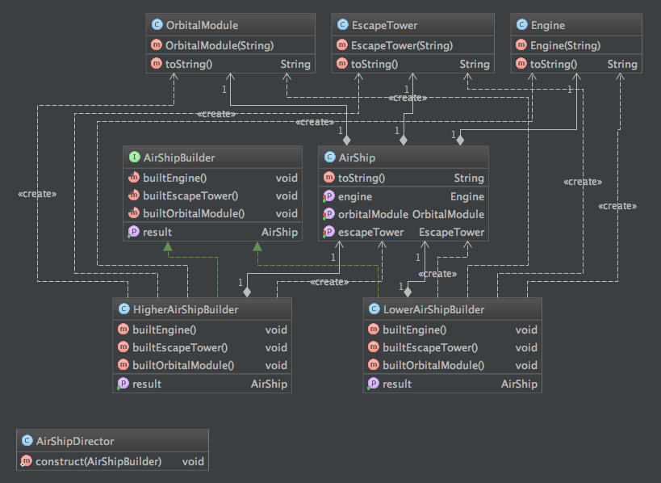


####产品与部件

> 产品`AirShip`由多个零部件(`Engine`/`EscapeTower`/`OrbitalModule`)组成:
    
    /**
     * 目标对象 - 宇宙飞船
     * (代表复杂对象, 拥有复杂的建造过程)
     * Created by jifang on 15/12/8.
     */
    public class AirShip {
        private Engine engine;
        private EscapeTower escapeTower;
        private OrbitalModule orbitalModule;
        public Engine getEngine() {
            return engine;
        }
        public void setEngine(Engine engine) {
            this.engine = engine;
        }
        public EscapeTower getEscapeTower() {
            return escapeTower;
        }
        public void setEscapeTower(EscapeTower escapeTower) {
            this.escapeTower = escapeTower;
        }
        public OrbitalModule getOrbitalModule() {
            return orbitalModule;
        }
        public void setOrbitalModule(OrbitalModule orbitalModule) {
            this.orbitalModule = orbitalModule;
        }
        @Override
        public String toString() {
            return "AirShip{" +
                    "engine=" + engine +
                    ", escapeTower=" + escapeTower +
                    ", orbitalModule=" + orbitalModule +
                    '}';
        }
    }
    class Engine {
        private String description;
        public Engine(String description) {
            this.description = description;
        }
        @Override
        public String toString() {
            return "Engine{" +
                    "description='" + description + '\'' +
                    '}';
        }
    }
    class EscapeTower {
        private String description;
        public EscapeTower(String description) {
            this.description = description;
        }
        @Override
        public String toString() {
            return "EscapeTower{" +
                    "description='" + description + '\'' +
                    '}';
        }
    }
    class OrbitalModule {
        private String description;
        public OrbitalModule(String description) {
            this.description = description;
        }
        @Override
        public String toString() {
            return "OrbitalModule{" +
                    "description='" + description + '\'' +
                    '}';
        }
    }


####建造者(Builder)

> **Builder**(`AirShipBuilder`)是为创建一个**Product**对象的各个部件指定的抽象接口,**ConcreteBuilder**(`LowerAirShipBuilder`/`HigherAirShipBuilder`)是具体的建造者,实现**Builder**接口, 构造和装配各个部件.

 
    /**
     * @author jifang
     * @since 16/8/17 下午2:13.
     */
    public interface AirShipBuilder {
        void builtEngine();
        void builtEscapeTower();
        void builtOrbitalModule();
        AirShip getResult();
    }

生产**低端**飞船, 需要`LowerAirShipBuilder`; 生产**高端**飞船, 就需要`HigherAirShipBuilder`:

  
    class LowerAirShipBuilder implements AirShipBuilder {
        private AirShip airShip = new AirShip();
        @Override
        public void builtEngine() {
            System.out.println("\t\t构造低端引擎");
            airShip.setEngine(new Engine("低端 - 引擎"));
        }
        @Override
        public void builtEscapeTower() {
            System.out.println("\t\t构造低端逃逸塔");
            airShip.setEscapeTower(new EscapeTower("低端 - 逃逸塔"));
        }
        @Override
        public void builtOrbitalModule() {
            System.out.println("\t\t构造低端轨道舱");
            airShip.setOrbitalModule(new OrbitalModule("低端 - 轨道舱"));
        }
        @Override
        public AirShip getResult() {
            return airShip;
        }
    }
    class HigherAirShipBuilder implements AirShipBuilder {
        private AirShip airShip = new AirShip();
        @Override
        public void builtEngine() {
            System.out.println("\t\t构造高端引擎");
            airShip.setEngine(new Engine("高端 - 引擎"));
        }
        @Override
        public void builtEscapeTower() {
            System.out.println("\t\t构造高端逃逸塔");
            airShip.setEscapeTower(new EscapeTower("高端 - 逃逸塔"));
        }
        @Override
        public void builtOrbitalModule() {
            System.out.println("\t\t构造高端轨道舱");
            airShip.setOrbitalModule(new OrbitalModule("高端 - 轨道舱"));
        }
        @Override
        public AirShip getResult() {
            return airShip;
        }
    }


####指挥者(Director)

> 使用**Director**(`AirShipDirector`)控制建造过程, 也用它来隔离用户与建造过程的关联:
    
    /**
     * @author jifang
     * @since 16/8/17 下午2:15.
     */
    public class AirShipDirector {
        /**
         * 确定一种稳定的构造过程
         *
         * @param builder
         */
        public static void construct(AirShipBuilder builder) {
            builder.builtEngine();
            builder.builtEscapeTower();
            builder.builtOrbitalModule();
        }
    }


####Client

> 完全不需知道具体的创建/装配过程, 只需指定**Builder**:

       
    public class Client {
        @Test
        public void client() {
            AirShipBuilder lowBuilder = new LowerAirShipBuilder();
            // 构造低端飞船
            AirShipDirector.construct(lowBuilder);
            AirShip lowShip = lowBuilder.getResult();
            System.out.println(lowShip);
            AirShipBuilder highBuilder = new HigherAirShipBuilder();
            // 相同的构造过程, 不同的Builder, 可以构造出不同的飞船
            AirShipDirector.construct(highBuilder);
            AirShip highShip = highBuilder.getResult();
            System.out.println(highShip);
        }
    }


###实例-MyBatis中的建造者模式

> MyBatis的`SqlSessionFactoryBuilder`是对`SqlSessionFactory`建造过程的简单封装,他对建造者模式做了**简化**处理(只有`Builder`而无`Director`),以减小编程复杂度:
    
    
    /**
     * @author Clinton Begin
     */
    public class SqlSessionFactoryBuilder {
      public SqlSessionFactory build(Reader reader) {
        return build(reader, null, null);
      }
      public SqlSessionFactory build(Reader reader, String environment) {
        return build(reader, environment, null);
      }
      public SqlSessionFactory build(Reader reader, Properties properties) {
        return build(reader, null, properties);
      }
      public SqlSessionFactory build(Reader reader, String environment, Properties properties) {
        try {
          XMLConfigBuilder parser = new XMLConfigBuilder(reader, environment, properties);
          return build(parser.parse());
        } catch (Exception e) {
          throw ExceptionFactory.wrapException("Error building SqlSession.", e);
        } finally {
          ErrorContext.instance().reset();
          try {
            reader.close();
          } catch (IOException e) {
            // Intentionally ignore. Prefer previous error.
          }
        }
      }
      public SqlSessionFactory build(InputStream inputStream) {
        return build(inputStream, null, null);
      }
      public SqlSessionFactory build(InputStream inputStream, String environment) {
        return build(inputStream, environment, null);
      }
      public SqlSessionFactory build(InputStream inputStream, Properties properties) {
        return build(inputStream, null, properties);
      }
      public SqlSessionFactory build(InputStream inputStream, String environment, Properties properties) {
        try {
          XMLConfigBuilder parser = new XMLConfigBuilder(inputStream, environment, properties);
          return build(parser.parse());
        } catch (Exception e) {
          throw ExceptionFactory.wrapException("Error building SqlSession.", e);
        } finally {
          ErrorContext.instance().reset();
          try {
            inputStream.close();
          } catch (IOException e) {
            // Intentionally ignore. Prefer previous error.
          }
        }
      }
      public SqlSessionFactory build(Configuration config) {
        return new DefaultSqlSessionFactory(config);
      }
    }

由于`SqlSessionFactory`创建的`SqlSession`需要支持很多操作(如`selectOne()`、`selectList()`、`update()`等), 因此`SqlSessionFactory`的构造过程是非常复杂的(可参考`SqlSessionManager`、`DefaultSql SessionFactory`实现),因此使用`SqlSessionFactoryBuilder`作为**Builder**简化其构造过程,并且为其设置配置文件(_mybatis-configuration.xml_)作为**Director**来指导**Builder**的构造过程:

       
    <bean id="sqlSessionFactory" class="org.mybatis.spring.SqlSessionFactoryBean">
        <property name="dataSource" ref="dataSource"/>
        <property name="mapperLocations" value="classpath:mybatis/mapper/*DAO.xml"/>
        <property name="typeAliases" value="com.feiqing.domain.User"/>
        <property name="configLocation" value="classpath:mybatis/mybatis-configuration.xml"/>
    </bean>

> 详细可参考博客: [mybatis源码分析(1)——SqlSessionFactory实例的产生过程](http://www.cnblogs.com/hzhuxin/p/3349836.html)


###小结

>   * 由于**构建**和**装配**的解耦, 不同的构建器, 相同的装配过程, 可以产生不同的产品,实现了更好的复用.因此常用于创建一些复杂的对象,
这些**对象内部构建间的建造顺序通常是稳定的**, 但内部的构建通常面临着复杂的变化. 如:  
>     * `StringBuilder`的`append()`;
>     * JDBC的`PreparedStatement`;
>     * JDOM的`DomBuilder`、`SAXBuilder`;
>     * MyBatis的`SqlSessionFactoryBuilder`.


<hr>


####<p>原文出处：<a href='http://blog.csdn.net/zjf280441589/article/details/50405070' target='blank'>适配器模式</a></p>

####适配器模式


####结构型模式

> 在解决了对象的创建问题之后，`对象的组成以及对象之间的依赖关系`就成了开发人员关注的焦点，因为如何设计对象的结构、继承和依赖关系会影响到后续程序的维护性、代码的健壮性、耦合性等。对象结构的设计很容易体现出设计人员水平的高低;
>
>结构型模式共有7个可供研究，它们分别是: 适配器模式, 代理模式, 桥接模式, 装饰者模式, 组合模式, 外观模式, 享元模式;


####适配器模式

> 将一个类的接口转换成客户希望的另外一个接口. `Adapter`模式使得`原本`由于接口不兼容而不能一起工作的那些类可以一起工作;  

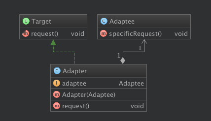

适配器模式中的角色:

  * 目标`接口(Target)`: 客户端所期待的接口
  * 需要适配的类(`Adaptee`): `原先就存在`的需要适配的类;
  * 适配器(`Adapter`): 通过包装一个需要适配的对象,把原接口转换成目标接口.

**_实现_**

  * 需要适配的类
    
```java  
/**
 * Created by jifang on 15/12/10.
 */
public class Adaptee {
    public void specificRequest() {
        System.out.println("特殊请求");
    }
}

* 目标`接口(Target)`
    
    
public interface Target {
    void request();
}
```
  * 适配器
    
```java
public class Adapter implements Target {
    private Adaptee adaptee;
    public Adapter(Adaptee adaptee) {
        this.adaptee = adaptee;
    }
    @Override
    public void request() {
        adaptee.specificRequest();
    }
}
```
  * Client
    
```java 
public class Client {
    @Test
    public void client() {
        Target target = new Adapter(new Adaptee());
        target.request();
    }
}
```

####小结

  * 适配器模式使用场景:   
两个类`(Target与Adaptee)`所做的事情相同或相似,但是具有不同的接口.使用适配器之后可以使得客户端可以统一调用一个接口(Target)就行了,这样应该就可以更简单, 更直接, 更紧凑.

  * 适配器模式的缺点   
大家可能注意到了: 我在介绍`需要适配的类`这一角色的时候写到他是`原先就存在`的类;因为在公司内部,类和方法命名都有其规范,最好前期就设计好并进行统一,因为过多的使用适配器，会让系统非常零乱，一个系统如果太多出现这种情况，无异于一场灾难;因此如果不是很有必要，可以不使用适配器，而是直接对系统进行`重构`.除非是在双方都不太容易修改的时候才使用适配器模式.


<hr>


####<p>原文出处：<a href='http://blog.csdn.net/zjf280441589/article/details/50411737' target='blank'>代理模式</a></p>

###代理模式

> 为其他对象提供一种`代理`以控制对这个对象的访问(可以详细控制访问某个对象的方法, 在调用这个方法[前/后]做[前/后]置处理,从而实现将统一流程放到代理类中处理).

  * 我们书写执行一个功能的函数时, 经常需要在其中写入与功能不是直接相关但很有必要的代码(如日志记录,事务支持等);这些**枝节性**代码虽然是必要的,但它会带来以下麻烦：

    1. **枝节性**代码游离在功能性代码之外，它不是函数的目的，这是对`OO`是一种破坏;
    2. 枝节性代码会造成功能性代码对其它类的**依赖**，加深类之间的**耦合**，会造成功能性代码移植困难,**可重用性**降低, 这是OO系统所竭力避免的;
    3. 从正常角度来说: 枝节性代码应该`监视`着功能性代码，然后采取行动，而不是功能性代码`通知`枝节性代码采取行动，这好比吟游诗人应该是主动记录骑士的功绩而不是**骑士主动**要求诗人记录自己的功绩


  * Java代理分类

    1. 静态代理: 手动定义代理类
    2. 动态代理: 动态生成代理类   

      * JDK自带的动态代理
      * JavaAssist字节码操作库实现
      * CGLib
      * ASM(底层使用指令, 可维护性差)

  * 代理中的角色

    1. 抽象接口：声明真实对象和代理对象的共同接口
    2. 代理对象：代理对象内部包含`真实对象的引用`，从而可以操作真实对象; 同时,代理对象与真实对象有相同的接口，能在任何时候代替真实对象，而且代理可以在真实对 象前后加入特定的逻辑以实现功能的`扩展`;
    3. 真实对象：代理对象所代表的对象;是我们最终要引用的对象

###静态代理

我们模拟_请明星唱歌_这个过程,但大家都知道要请明星唱歌(比如周杰伦)是一件比较麻烦的事情, 比如唱歌前要_签约_, 唱歌之后还有_收款_,而平时明星们都是比较忙的, 想签约, 收款这些事情一般都是由他的助手来代理完成的,而明星只负责唱歌就行了,像_签约_与_收款_这种事情就可以算作是明星的增强, **虽然这不是明星的主要目的, 但是这个流程是必须要有的**.  

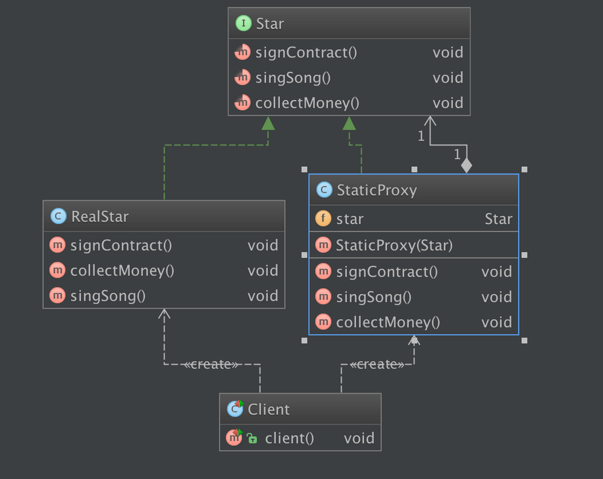

  * 目标接口
    
```java 
/**
 * 定义真实对象和代理对象的公共接口
 * Created by jifang on 15/12/20.
 */
public interface Star {
    // 签约
    void signContract();
    // 唱歌
    void singSong();
    // 收款
    void collectMoney();
}
```

  * 真实对象
    
```java
public class RealStar implements Star {
    /**
     * 由于这些事情都委托给代理来做了, 因此我们只是象征性实现就好了
     */
    @Override
    public void signContract() {
    }
    @Override
    public void collectMoney() {
    }
    /**
     * 但唱歌是要自己真唱的
     */
    @Override
    public void singSong() {
        System.out.println("周杰伦在唱歌");
    }
}
```
  * 代理对象   
自己并未实现业务逻辑接口,而是调用真实角色来实现:

```java
public class StaticProxy implements Star {
    private Star star;
    public StaticProxy(Star star) {
        this.star = star;
    }
    @Override
    public void signContract() {
        System.out.println("代理签约");
    }
    /**
     * 代理可以帮明星做任何事, 但唯独唱歌这件事必须由Star自己来完成
     */
    @Override
    public void singSong() {
        star.singSong();
    }
    @Override
    public void collectMoney() {
        System.out.println("代理收钱");
    }
}
```
  * Client
    
```java
public class Client {
    @Test
    public void client() {
        Star star = new StaticProxy(new RealStar());
        star.signContract();
        star.singSong();
        star.collectMoney();
    }
}
```

可以看出，客户实际想要调用的是`RealStar`的`singSong`方法，现在用`StaticProxy`来代理`RealStar`类，也可以达到同样的目的，同时还封装了其他方法(像`singContract``collectMoney`)，可以处理一些其他流程上的问题.  
如果要按照上述的方法使用代理模式，那么`真实角色`必须是`事先已经存在的`，并将其作为代理对象的内部属性;但是实际的Java应用中,如果有_一批_真实对象, 而毎个代理对象只对应一个真实对象的话，会导致类的急剧膨胀；此外，如果我们事先并不知道真实角色，那么该如何使用编写代理类呢？这个问题可以通过java的`动态代理机制`来解决.

###动态代理

所谓_动态代理_是这样一种`class`:它是在运行时生成的class，在生成它时你必须提供一组`interface`给它，然后该class就宣称它实现了这些 interface.

JDK对动态代理提供了以下支持:

  * `java.lang.reflect.Proxy` 动态生成代理类和对象
  * `java.lang.reflect.InvocationHandler`   

    * 可以通过invoke方法实现对真实角色的代理访问;
    * 每次通过Proxy生成代理类对象时都要指定对象的处理器对象.

首先, `Star`接口可以精简一下, 只做他该做的事情:

  * Star
    
```java 
/**
 * Star只负责唱歌就行了
 * Created by jifang on 15/12/20.
 */
public interface Star {
    // 唱歌
    void singSong();
}
```

  * RealStar
    
```java
public class RealStar implements Star {
    /**
     * 唱歌是要自己真唱的
     */
    @Override
    public void singSong() {
        System.out.println("周杰伦在唱歌");
    }
}
```

**_当执行动态代理对象里的方法时, 实际上会替换成调用InvocationHandler中的invoke方法._**

  * `InvocationHandler`: 用于实现代理
    
```java   
/**
 * 相当于原先的代理需要执行的方法
 * Created by jifang on 15/12/20.
 */
public class ProxyHandler implements InvocationHandler {
    private Star star;
    public ProxyHandler(Star star) {
        this.star = star;
    }
    /**
     * 代理对象的实现的所有接口中的方法, 内容都是调用invoke方法
     *
     * @param proxy  代理对象(Proxy.newProxyInstance返回的对象)
     * @param method 当前被调的方法
     * @param args   执行当前方法的参数
     * @return 执行方法method的返回值
     * @throws Throwable
     */
    @Override
    public Object invoke(Object proxy, Method method, Object[] args) throws Throwable {
        System.out.println("签约");
        Object result = null;
        if (method.getName().equals("singSong")) {
            result = method.invoke(star, args);
        }
        System.out.println("收款");
        return result;
    }
}
```
  * Client
    
```java 
public class Client {
    @Test
    public void client() {
        /**
         * newProxyInstance方法会动态生成一个代理类, 他实现了Star接口, 然后创建该类的对象.
         *
         * 三个参数
         * 1. ClassLoader: 生成一个类, 这个类也需要加载到方法区中, 因此需要指定ClassLoader来加载该类
         * 2. Class[] interfaces: 要实现的接口
         * 3. InvocationHandler: 调用处理器
         */
        Star proxyStar = (Star) Proxy.newProxyInstance(ClassLoader.getSystemClassLoader(), new Class[]{Star.class}, new ProxyHandler(new RealStar()));
        proxyStar.singSong();
    }
}
```

###代理工厂实现动态代理

  * 动态代理虽然可以使得我们不用在手写代理对象的代码,但是`InvocationHandler`还是_面向特定的抽象接口(如Star)_的来写的; 而代理工厂可以让我们的代码写的更加`抽象`(而不必面向确定的抽象接口写代码).
  * 代理工厂的目标是`目标对象和增强方法皆可改变`, 这个模式在现实中的表现就是:   
a. _明星对代理并不一定是从一而终的_, 明星随时都可能会换代理(助手);  
b. _明星不一定只会唱歌_, 他还有可能会跳舞.  
c. _代理可能不只是为一个明星服务_  
这样, 我们就实现一个代理工厂-**_可以随意更换代理所做的辅助性工作; 而目标对象也可以随时增加新的方法_**.  
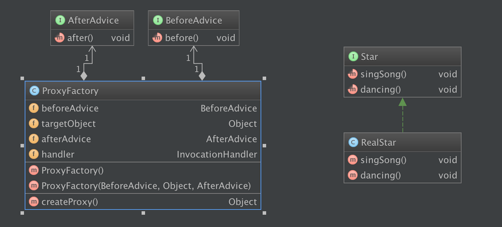  
可以看到, `ProxyFactory`与`Start`是没有任何关系的, 他们之间能够联系其他完全是靠Client来促成.


  * 代理工厂
    
```java
/**
 * Created by jifang on 15/12/21.
 */
public class ProxyFactory {
    private BeforeAdvice beforeAdvice;
    private Object targetObject;
    private AfterAdvice afterAdvice;
    public ProxyFactory() {
    }
    public ProxyFactory(BeforeAdvice beforeAdvice, Object targetObject, AfterAdvice afterAdvice) {
        this.beforeAdvice = beforeAdvice;
        this.targetObject = targetObject;
        this.afterAdvice = afterAdvice;
    }
    private InvocationHandler handler = new InvocationHandler() {
        @Override
        public Object invoke(Object proxy, Method method, Object[] args) throws Throwable {
            if (beforeAdvice != null) {
                beforeAdvice.before();
            }
            Object result = null;
            if (targetObject != null) {
                result = method.invoke(targetObject, args);
            }
            if (afterAdvice != null) {
                afterAdvice.after();
            }
            return result;
        }
    };
    public Object createProxy() {
        return Proxy.newProxyInstance(ClassLoader.getSystemClassLoader(), targetObject.getClass().getInterfaces(), handler);
    }
}
```
  * Client   
`Star`和`RealStar`同前

```java  
/**
 * Created by jifang on 15/12/20.
 */
public class Client {
    @Test
    public void client() {
        Star star = (Star) new ProxyFactory(new StarBeforeAdvice(), new RealStar(), new StarAfterAdvice()).createProxy();
        star.singSong();
    }
    /**
     * BeforeAdvice实现可定制化
     */
    private static class StarBeforeAdvice implements BeforeAdvice {
        @Override
        public void before() {
            System.out.println("签合约");
        }
    }
    /**
     * AfterAdvice实现可定制化
     */
    private static class StarAfterAdvice implements AfterAdvice {
        @Override
        public void after() {
            System.out.println("收款");
        }
    }
}
```
现在, 我们的对明星要求比较高了, 他不光要会唱歌, 还要会跳舞.

```java  
public interface Star {
    // 唱歌
    void singSong();
    // 跳舞
    void dancing();
}
    
    
public class RealStar implements Star {
    //...
    @Override
    public void dancing() {
        System.out.println("周杰伦在跳舞...");
    }
}
```
此时, 我们的`client`什么都不需要改, 只是添加一个调用就可:

```java
public class Client {
    @Test
    public void client() {
        Star star = (Star) new ProxyFactory(new StarBeforeAdvice(), new RealStar(), new StarAfterAdvice()).createProxy();
        star.singSong();
        star.dancing();
    }
    // ...
}
```

而且在实际开发中, 这些增强类还可以从配置文件中读取(像Spring).  
这种代理在`AOP(Aspect Orient Programming: 面向切面编程)`中被成为`AOP代理`,AOP代理包含了目标对象的全部方法,但AOP代理中的方法与目标对象的方法存在差异: 比如可以在执行目标方法之前/后插入一些通用的处理(增强).

###代理场景

  * 当Client需要调用某个对象时，客户端实际上也不关心_是否准确得到该对象_,Client要只是一个能提供该功能的对象而已,因此我们就可返回该对象的代理(Proxy).`代理`就是在访问对象时引入一定程度的`间接性`, 由于存在这种间接性, 我们就可以做很多工作:   

    1. 远程代理: 为一个对象在不同的地址空间提供`局部代表`, 这样可以隐藏一个对象存在于不同地址空间的事实(Dubbo实现);
    2. 安全代理: 屏蔽对真实角色的访问, 用代理来控制对真实对象的访问权限; 
    3. 延迟加载: 先加载轻量级代理对象,真正需要时再加载真实对象.


<hr>


####<p>原文出处：<a href='http://blog.csdn.net/zjf280441589/article/details/50491260' target='blank'>桥接模式</a></p>

####桥接模式

###场景

在商城系统中商品是分类摆放的,以电脑为例我们有以下商品分类, 该如何良好的处理商品分类销售的问题:

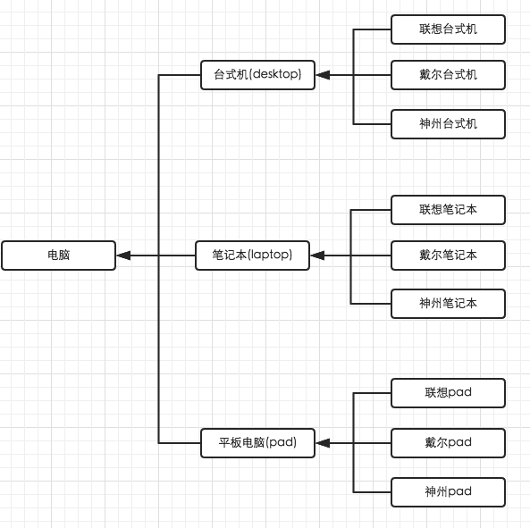

直观上我们会认为该商品分类以`继承`来实现:_电脑作为根类,台式机/笔记本/平板电脑作为其子类,联想台式机/…作为电脑的孙类._(其继承结构可以从图上直观的
看出),但是考虑以下需求:

  1. 如果我们要增加一个品牌_三星_?
  2. 如果我们要增加一个分类_智能手机_?

问题1的解决方案是在**台式机** **笔记本** **平板电脑** 下面都添加相应的子类, _三星台式机_ _三星笔记本_ ….  
问题2的解决方案是需在_电脑_下面添加子类_智能手机_并在_智能手机_下在添加三个品牌分类**联想智能手机** **戴尔只能手机** …
额,想想就够麻烦的,但是如果我们既要添加品牌又要添加分类呢? 要疯了…  
这样下去导致的后果就是类的个数急速膨胀, 管理成本极高.

我们马上就意识到仅用继承的是不行的了:

> 对象的继承关系是在`编译`时就确定好了的,所以无法在运行时改变从父类继承的实现.子类的实现与他的父类有非常紧密的依赖关系,以至于父类实现中的任何变化必然会导致子类发生变化.当你需要复用子类时,如果继承下来的实现不适合解决新的问题,则父类必须重写或被其他更适合的类替换.这种依赖关系限制了灵活性并最终限制了复用性.

这个问题仅用继承是不能解决的,因为这样其实是违反了`单一职责原则`:一个类`联想笔记本`,却有两个引起这个类变化的原因-`类型维度`和`品牌维度`.我们把两个维度混合在一起考虑,必然会造成**牵一发而动全身**的效果.

  * 既然这样我们应该从两个维度来思考设计: 
  
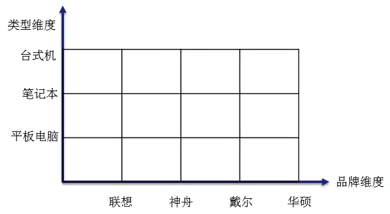  

`类型维度`有自己的一套继承结构,`品牌维度`也有自己的一套继承结构,然后中间有座`桥(Bridge)`把这两个类关联起来.这样在添加品牌时只需在类型维度做修改就好了, 不会影响到品牌维度;当在品牌维度搞活动时,类型维度也不受影响.桥一端的变化不会引起另一端的变化,这就是`桥接模式`:

###桥接模式

> 桥接模式: 将抽象部分与它的实现部分分离, 使他们都可以独立地变化.  
其实就是处理多层继承结构, 处理多维变化的场景, 将各个维度设计成独立地继承结构, 使得各个维度可以独立地扩展, 并在`抽象层`建立关联.

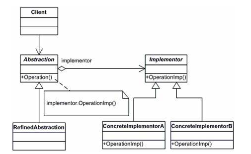

注意, 这个结构的关键是: `Abstraction`里面持有`Implementor`对象.  
这个反映到我们卖电脑的场景的类图关系如下:
  
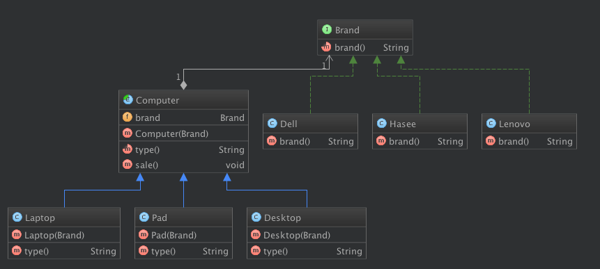  

`Computer`的`brand`属性就是那座`桥`.

  * 品牌维度
    
```java
/**
 * @author jifang
 * @since 16/1/3下午6:25.
 */
public interface Brand {
    String brand();
}
class Lenovo implements Brand {
    @Override
    public String brand() {
        return "联想";
    }
}
class Dell implements Brand {
    @Override
    public String brand() {
        return "戴尔";
    }
}
class Hasee implements Brand {
    @Override
    public String brand() {
        return "神州";
    }
}
```
  * 类型维度
    
```java
/**
 * @author jifang
 * @since 16/1/3下午6:33.
 */
public abstract class Computer {
    private Brand brand;
    public Computer(Brand brand) {
        this.brand = brand;
    }
    public abstract String type();
    public void sale() {
        System.out.println("我们卖的是<" + brand.brand() + this.type() + ">电脑");
    }
}
class Desktop extends Computer {
    public Desktop(Brand brand) {
        super(brand);
    }
    @Override
    public String type() {
        return "台式";
    }
}
class Laptop extends Computer {
    public Laptop(Brand brand) {
        super(brand);
    }
    @Override
    public String type() {
        return "笔记本";
    }
}
class Pad extends Computer {
    public Pad(Brand brand) {
        super(brand);
    }
    @Override
    public String type() {
        return "平板";
    }
}
```
  * Client
    
```java
public class Client {
    @Test
    public void test() {
        Computer computer = new Desktop(new Dell());
        computer.sale();
    }
}
```
现在我要新加一个_智能手机_类型, 那么只需在`Computer`下面添加一个`Smartphone`就行了, 品牌维度不需要做任何的改动:

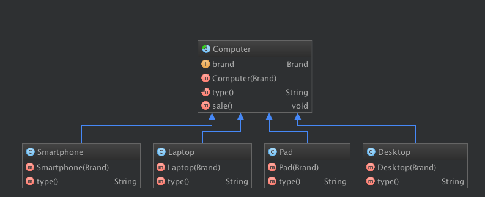

```java
class Smartphone extends Computer {
    public Smartphone(Brand brand) {
        super(brand);
    }
    @Override
    public String type() {
        return "智能手机";
    }
}
```
  * Client
    
```java
public class Client {
    @Test
    public void test() {
        Computer computer = new Smartphone(new Lenovo());
        computer.sale();
    }
}
```

###小结

  * 桥接模式可以取代多层继承的方案. 多层继承违背了`单一职责原则`, 复用性较差, 类的个数过多. 桥接模式可以极大的减少子类的个数, 从而降低管理和维护的成本.
  * 桥接模式极大的提高了系统的可扩展性, 在两个变化维度中任意扩展一个维度, 都不需要修改原有的系统, 符合`开放-封闭原则`.

####桥接模式在实际开发中应用场景:

  * JDBC驱动程序
  * AWT中的Peer架构

其实只要发现**_需要从多个角度去分类实现对象_**, 而**_只用继承会造成大量类的增加_**,**_不能满足开放-
封闭原则_**时,就应该考虑使用桥接模式.


<hr>


####<p>原文出处：<a href='http://blog.csdn.net/zjf280441589/article/details/52343557' target='blank'>装饰者模式</a></p>

####装饰者模式


> **装饰者**模式(Decorator): 又称**包装器**(Wrapper), 可以动态地为一个**对象**添加一些额外的职责. 就增加功能来说,装饰者模式是一种用于替代继承的技术, **_他无须通过增加子类继承就能扩展对象的已有功能_**, 而是**使用对象的关联关系代替继承关系** , 更加灵活,同时还可避免类型体系的快速膨胀.

  * 模式组件:

组件 描述 I/O示例

**Component**
抽象构件角色, 真实对象和装饰对象的共有接口. 这样,客户端就能以**调用真实对象的相同方式**同**装饰对象**交互.

`InputStream`/`OutputStream`

**ConcreteComponent**
具体构件角色,真实对象

`FileInputStream`/`FileOutputStream`

**Decorator**装饰抽象类, 实现了**Component**, 并持有一个**Component**引用, 接受所有客户端请求,并将请求转发给真实对象,这样,就能在真实对象调用的前后增强新功能. 但对于**Component**来说, 是无需知道**Decorator**存在的.

`FilterInputStream`/`FilterOutputStream`

**ConcreteDecorator**
具体装饰角色,完成对**Component**的具体增强.

`BufferedInputStream`/`BufferedOutputStream`

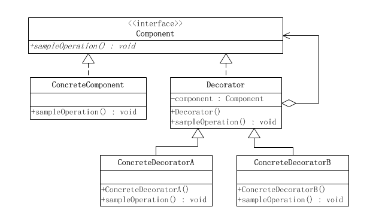

> **_是你还有你, 一切拜托你_**.(图片来源: [《JAVA与模式》之装饰模式](http://www.cnblogs.com/java-my-life/archive/2012/04/20/2455726.html))


###实现

  * Component
    
```java 
/**
 * @author jifang
 * @since 16/8/20 下午5:55.
 */
public interface Component {
    void operator();
}
class ConcreteComponent implements Component {
    @Override
    public void operator() {
        System.out.println("具体对象" + this.toString() + "的操作");
    }
}
```
  * Decorator

```java
public abstract class Decorator implements Component {
    protected Component component;
    public Decorator(Component component) {
        this.component = component;
    }
    @Override
    public abstract void operator();
}
class BeforeAdviceDecorator extends Decorator {
    public BeforeAdviceDecorator(Component component) {
        super(component);
    }
    @Override
    public void operator() {
        System.out.println(" -> 前置增强");
        this.component.operator();
    }
}
class AfterAdviceDecorator extends Decorator {
    public AfterAdviceDecorator(Component component) {
        super(component);
    }
    @Override
    public void operator() {
        this.component.operator();
        System.out.println("后置增强 -> ");
    }
}
```

  * Client
    
```java
public class Client {
    @Test
    public void client() {
        // 裸Component
        Component component = new ConcreteComponent();
        component.operator();
        // 前置增强
        component = new BeforeAdviceDecorator(component);
        component.operator();
        // + 后置增强
        component = new AfterAdviceDecorator(component);
        component.operator();
    }
}
```

> 注: 如果只有**ConcreteComponent**而没有抽象的**Component**,那么**Decorator**可直接继承**ConcreteComponent**. 同样, 如果只有一个**ConcreteDecorator**,那就没有必要建立一个独立的**Decorator**, 将**Decorator**和**ConcreteDecorator**的职责合并.

###小结

>   * 装饰者模式是**为已有功能动态添加更多功能**的一种方式: 把类内装饰逻辑从类中剥离, 以简化原有类设计:  
>     * **有效地将类的核心职责和装饰功能区分开**;
>     * **去除相关类中重复的装饰逻辑**;
>     * 可以对一个对象**装饰多次**, 构造出不同行为的组合, 得到功能更强大的对象;
>     * 具体构件类和具体装饰类可**独立变化**, 且用户可根据需要**增加新的具体构件子类**和**具体装饰子类**.

  * 与桥接模式的对比   
两个模式都是为了解决子类过多问题, 但他们的诱因不同:

    * 桥接模式对象自身有**沿着多个维度变化的趋势**, 本身不稳定;
    * 装饰者模式对象自身非常稳定, 只是为了增加新功能/增强原功能.
  * 继承、装饰者模式、动态代理对比

* 继承 装饰者 动态代理

对象

被增强对象不能变

被增强对象可变

被增强对象可变

内容

增强内容不能变

增强内容不可变

增强内容可变

  * 常见场景   
当系统更新、原有逻辑需要增强时, 我们最初的想法是 **_向旧的类中添加新代码_**, 由新代码装饰原有类的主要行为,他们会在主类中加入新的**字段**/**方法**/**逻辑**, 但同样也增加了主类的**复杂度**,而这些新加入的内容仅仅是为了满足一些**只在某种特定情况下才会执行的特殊行为**的需要. 而装饰者模式提供了一个解决该问题的非常好的方案:
**把每个要装饰的功能放在单独的类中**, 并让这个类**包装它所要装饰的对象**, 当需要执行特殊行为时,
客户代码就可以在运行时根据需要有选择地、按顺序地使用装饰过的包装对象了, 如:  

    * Java I/O流体系(详细可参考: [Java I/O](http://blog.csdn.net/zjf280441589/article/details/50526786));
    * `Servlet` API: `HttpServletRequestWrapper`/`HttpServletResponseWrapper`增强Servlet功能(详细可参考[Servlet - Listener、Filter、Decorator](http://blog.csdn.net/zjf280441589/article/details/51344746#t14))


<hr>


####<p>原文出处：<a href='http://blog.csdn.net/zjf280441589/article/details/52350085' target='blank'>中介者模式</a></p>

####中介者模式

面向对象设计鼓励将行为分布到各个对象中, 这种分布可能会导致对象间有许多连接. 在最坏的情况下, 每一个对象都需要知道其他所有对象.  
虽然将一个系统分割成许多对象可增强可复用性, 但是对象间**相互连接的激增**又会降低其可复用性.大量的连接关系使得一个对象**不可能在没有其他对象的协助下工作**(系统表现为一个**不可分割**的整体),此时再对系统行为进行**任何较大改动**就十分困难. 因为行为被分布在许多对象中, 结果是不得不定义很多子类以定制系统的行为.由此我们引入了**中介者对象Mediator**:  

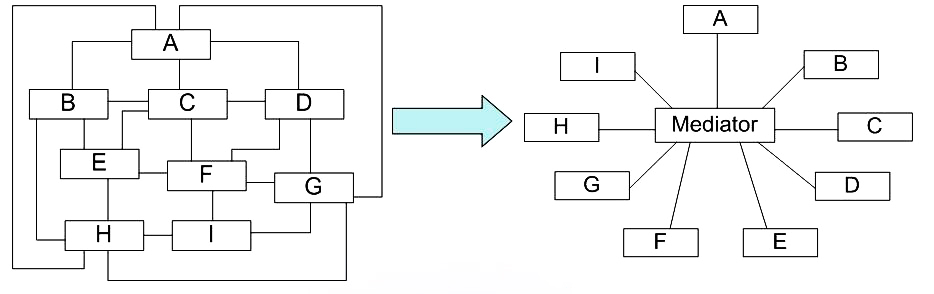  

通过中介者对象, 可以将网状结构的系统改造成**以中介者为中心的星型结构**, 每个具体对象不再与另一个对象直接发生关系,而是通过中介者对象从中**调停**.中介者对象的引入,也使得系统结构不会因新对象的引入造成大量的修改.

###中介者模式

> 中介者模式: 又称**调停者模式**, 用一个**中介者对象(Mediator)**来封装一系列对象的交互, 使各对象不需再显示地相互引用,从而使**耦合松散**, 而且可以**独立地改变他们之间的交互**:  

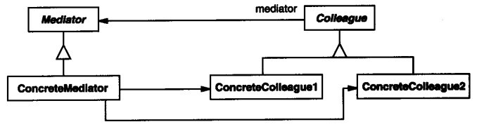  

(图片来源: [设计模式: 可复用面向对象软件的基础](https://book.douban.com/subject/1052241/))

  * Tips: 各**Colleague**只知道**Mediator**的存在, 并不需要知道其他**Colleague**是否存在(不然怎么解耦呢), 它**只需将消息发送给Mediator, 然后由Mediator转发给其他Colleague**(由**Mediator**存储所有**Colleague**关系, 也只有**Mediator**知道有多少/哪些**Colleague**). 

###模式实现
    
    联合国转发各国声明, 调停各国关系: 
    各国向联合国安理会发送和接收消息, 安理会在各国间'适当地'转发请求以实现协作行为:
    

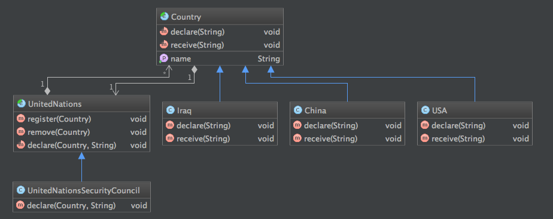

####Colleague

抽象同事类, 定义各同事的公有方法:

    
    
    /**
     * @author jifang
     * @since 16/8/28 下午4:22.
     */
    public abstract class Country {
        protected UnitedNations mediator;
        private String name;
        public Country(UnitedNations mediator, String name) {
            this.mediator = mediator;
            this.name = name;
        }
        public String getName() {
            return name;
        }
        protected abstract void declare(String msg);
        protected abstract void receive(String msg);
    }

* * *

####ConcreteColleague

具体同事类:

  * 每一个同事类都知道它的中介者对象.
  * 每一个同事对象在需与其他同事通信时, 与它的中介者通信.
    
    
    class USA extends Country {
        public USA(UnitedNations mediator, String name) {
            super(mediator, name);
        }
        @Override
        public void declare(String msg) {
            mediator.declare(this, msg);
        }
        @Override
        public void receive(String msg) {
            System.out.println("美国接收到: [" + msg + "]");
        }
    }
    class Iraq extends Country {
        public Iraq(UnitedNations mediator, String name) {
            super(mediator, name);
        }
        @Override
        public void declare(String msg) {
            mediator.declare(this, msg);
        }
        @Override
        public void receive(String msg) {
            System.out.println("伊拉克接收到: [" + msg + "]");
        }
    }
    class China extends Country {
        public China(UnitedNations mediator, String name) {
            super(mediator, name);
        }
        @Override
        public void declare(String msg) {
            mediator.declare(this, msg);
        }
        @Override
        public void receive(String msg) {
            System.out.println("中国接收到: [" + msg + "]");
        }
    }

####Mediator

抽象中介者: 定义一个接口用于与各同事对象通信:

    
    public abstract class UnitedNations {
        protected List<Country> countries = new LinkedList<>();
        public void register(Country country) {
            countries.add(country);
        }
        public void remove(Country country) {
            countries.remove(country);
        }
        protected abstract void declare(Country country, String msg);
    }

####ConcreteMediator

具体中介者:

  * 了解并维护它的各个同事;
  * 通过协调各同事对象实现**协作行为**(从同事接收消息, 向具体同事发出命令).
    
```java
class UnitedNationsSecurityCouncil extends UnitedNations {
    /**
     * 安理会在中间作出调停
     *
     * @param country
     * @param msg
     */
    @Override
    protected void declare(Country country, String msg) {
        for (Country toCountry : countries) {
            if (!toCountry.equals(country)) {
                String name = country.getName();
                toCountry.receive(name + "平和的说: " + msg);
            }
        }
    }
}
```

> 如果不存在扩展情况, 那么**Mediator**可与**ConcreteMediator**合二为一.

  * Client
    
```java
public class Client {
    @Test
    public void client() {
        UnitedNations mediator = new UnitedNationsSecurityCouncil();
        Country usa = new USA(mediator, "美国");
        Country china = new China(mediator, "中国");
        Country iraq = new Iraq(mediator, "伊拉克");
        mediator.register(usa);
        mediator.register(china);
        mediator.register(iraq);
        usa.declare("我要打伊拉克, 谁管我跟谁急!!!");
        System.out.println("----------");
        china.declare("我们强烈谴责!!!");
        System.out.println("----------");
        iraq.declare("来呀, 来互相伤害呀!!!");
    }
}
```  

###小结

> **Mediator**的出现减少了各**Colleague**之间的耦合,使得可以独立改变和复用各**Colleague**和**Mediator**,由于**把对象如何协作进行了抽象**、**将中介作为一个独立的概念并将其封装在一个对象中**,这样关注的焦点就**从对象各自本身的行为转移到它们之间的交互上来**, 从而可以站在一个更宏观的角度去看待系统.

  * 适用性 
    
中介者模式很容易在系统中应用, 也很容易在系统中误用. 当系统出现了**“多对多”**交互复杂的对象群时, 不要急于使用中介者,最好首先先反思**系统的设计是否是合理**. 由于**ConcreteMediator**控制了**_集中化_**,于是就**_把交互复杂性变成了中介者的复杂性_**, 使得中介者变得比任一个**ConcreteColleague**都复杂.

在下列情况下建议使用中介者模式:

    * 一组对象以定义良好但复杂的方式进行通信. 产生的相互依赖关系结构混乱且难以理解.
    * 一个对象引用其他很多对象并且直接与这些对象通信, 导致难以复用该对象.
    * 想定制一个分布在多个类中的行为, 而又不想生成太多的子类.
  
  * 相关模式

    * **Facade**与中介者的不同之处在于它是对一个对象子系统进行抽象, 从而提供了一个更为方便的接口, 它的协议是单向的, 即**Facade**对象对这个子系统类提出请求, 但反之则不可. 相反, **Mediator提供了各Colleague对象不支持或不能支持的协作行为, 而且协议是多向的**.
    * **Colleague**可使用**Observer模式**与**Mediator**通信.


<hr>


####<p>原文出处：<a href='http://blog.csdn.net/zjf280441589/article/details/52410509' target='blank'>组合模式</a></p>

####组合模式

> 组合模式: 将对象组合成树形结构以表示**‘部分-整体’**的层次结构, 使得用户对单个对象和组合对象的使用具有一致性.

  * 解析   

    * 组合模式描述了如何将容器和叶子节点进行递归组合, 使用户在使用时可一致的对待容器和叶子, 为处理树形结构提供了完美的解决方案.
    * 当容器对象的指定方法被调用时, 将遍历整个树形结构, 并执行调用. 整个过程递归处理.   
    
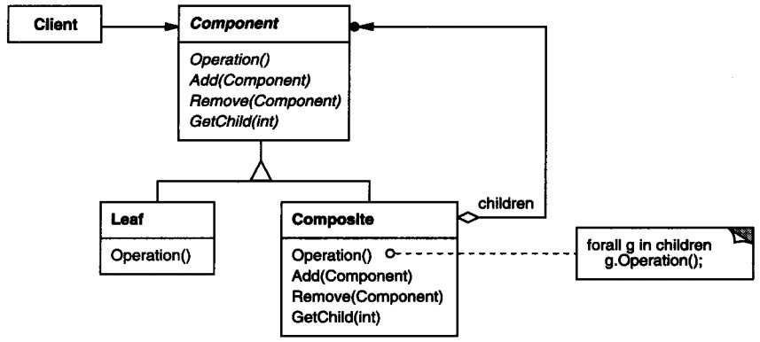  

(图片来源: [设计模式: 可复用面向对象软件的基础](https://book.douban.com/subject/1052241/))


###模式实现
 
    案例: 杀毒软件
    

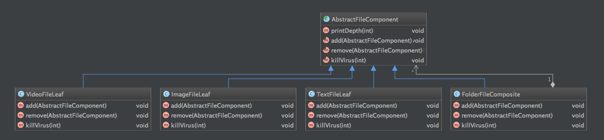  

使对文件(Image/Text/Video/…)杀毒与对文件夹(Folder)的杀毒暴露统一接口.

####Component

  * 为**组合模式**中的对象声明接口, 在适当情况下, 实现所有类共有接口的默认行为.
  * 声明一个接口用于访问和管理**Component**子组件.
    
```
/**
 * @author jifang
 * @since 16/8/24 上午10:19.
 */
public abstract class AbstractFileComponent {
    protected String name;
    protected AbstractFileComponent(String name) {
        this.name = name;
    }
    protected void printDepth(int depth) {
        for (int i = 0; i < depth; ++i) {
            System.out.print('-');
        }
    }
    protected abstract void add(AbstractFileComponent component);
    protected abstract void remove(AbstractFileComponent component);
    protected abstract void killVirus(int depth);
}
```

####Leaf

  * 叶子对象: 定义没有有分支节点的行为:
    
```java 
class ImageFileLeaf extends AbstractFileComponent {
    public ImageFileLeaf(String name) {
        super(name);
    }
    @Override
    public void add(AbstractFileComponent component) {
        throw new NotImplementedException(this.getClass() + " not implemented this method");
    }
    @Override
    public void remove(AbstractFileComponent component) {
        throw new NotImplementedException(this.getClass() + " not implemented this method");
    }
    @Override
    public void killVirus(int depth) {
        printDepth(depth);
        System.out.println("图片文件 [" + name + "]杀毒");
    }
}
class TextFileLeaf extends AbstractFileComponent {
    public TextFileLeaf(String name) {
        super(name);
    }
    @Override
    public void add(AbstractFileComponent component) {
        throw new NotImplementedException(this.getClass() + " not implemented this method");
    }
    @Override
    public void remove(AbstractFileComponent component) {
        throw new NotImplementedException(this.getClass() + " not implemented this method");
    }
    @Override
    public void killVirus(int depth) {
        printDepth(depth);
        System.out.println("文本文件 [" + name + "]杀毒");
    }
}
class VideoFileLeaf extends AbstractFileComponent {
    public VideoFileLeaf(String name) {
        super(name);
    }
    @Override
    public void add(AbstractFileComponent component) {
        throw new NotImplementedException(this.getClass() + " not implemented this method");
    }
    @Override
    public void remove(AbstractFileComponent component) {
        throw new NotImplementedException(this.getClass() + " not implemented this method");
    }
    @Override
    public void killVirus(int depth) {
        printDepth(depth);
        System.out.println("视频文件 [" + name + "]杀毒");
    }
}
```

####Composite

  * 容器对象: 定义有分支节点的行为, 用来存储子部件, 实现与子部件有关的操作:
    
```java
public class FolderFileComposite extends AbstractFileComponent {
    private List<AbstractFileComponent> components = new LinkedList<>();
    public FolderFileComposite(String name) {
        super(name);
    }
    @Override
    public void add(AbstractFileComponent component) {
        components.add(component);
    }
    @Override
    public void remove(AbstractFileComponent component) {
        components.remove(component);
    }
    @Override
    public void killVirus(int depth) {
        printDepth(depth);
        System.out.println("目录 [" + name + "]杀毒");
        for (AbstractFileComponent component : components) {
            component.killVirus(depth + 2);
        }
    }
}
```

  * Client
    
```java
public class Client {
    @Test
    public void client() {
        ImageFileLeaf image = new ImageFileLeaf("九寨沟.jpg");
        VideoFileLeaf video = new VideoFileLeaf("龙门飞甲.rmvb");
        TextFileLeaf text = new TextFileLeaf("解忧杂货店.txt");
        FolderFileComposite home = new FolderFileComposite("/home");
        home.add(image);
        home.add(video);
        home.add(text);
        FolderFileComposite root = new FolderFileComposite("/");
        root.add(home);
        root.add(new TextFileLeaf("/authorized_keys"));
        root.add(new FolderFileComposite("/etc"));
        root.killVirus(0);
    }
}
```

> 上面的实现方式是**透明方式**: 直接在**Component**中声明`add()`/`remove()`.
这样做的好处是叶节点和枝节点对于外界没有任何区别, 他们具有完全一致的行为接口. 但问题是对叶节点实现`add()`/`remove()`没有任何意义.
所以还有另一种实现方式**安全方式**, 也就是在**Component**中不去声明`add()`/`remove()`,而是在**Composite**声明所有用来管理子类对象的方法, 不过由于不够透明, 所以叶节点与枝节点将不具有相同接口, 客户端调用需要作出相应判断,带来了不便, 关于该问题的详细信息可参考:

[组合模式（Composite）的安全模式与透明模式](http://haolloyin.blog.51cto.com/1177454/347308/).

###小结

  * 组合模式定义了**基本对象**和**组合对象**的类层次结构, 基本对象可以被组合成更复杂的组合对象, 而这个组合对象又可以被组合, 这样不断地递归下去, 这样在客户代码中任何用到基本对象的地方都可以使用组合对象.
  * 用户不用关心到底是处理一个**叶节点**还是处理一个**枝节点**, 也用不着为定义组合而写一些选择判断语句.

> 总的来说: 组合模式让用户可以一致地使用**组合结构**和**单个对象**.

  * 场景   
当需求中是体现**部分**与**整体**层次的结构时, 以及希望用户可以忽略组合对象与单个对象的不同, 统一地使用**组合**中的所有对象时,就应该考虑使用组合模式了:  

    * 操作系统资源管理器
    * GUI容器视图
    * XML文件解析
    * OA系统中组织机构处理
    * Junit单元测试框架   

      * TestCase(叶子)、TestUnite(容器)、Test接口(抽象)


<hr>


####<p>原文出处：<a href='http://blog.csdn.net/zjf280441589/article/details/52420929' target='blank'>外观模式</a></p>

####外观模式

> 外观模式: 又称**门面模式**: **外观Facade**为子系统的一组接口提供一个**一致界面**,使得这组子系统易于使用(通过引入一个新的**外观角色**降低原系统复杂度,同时降低客户类与子系统的耦合度).  

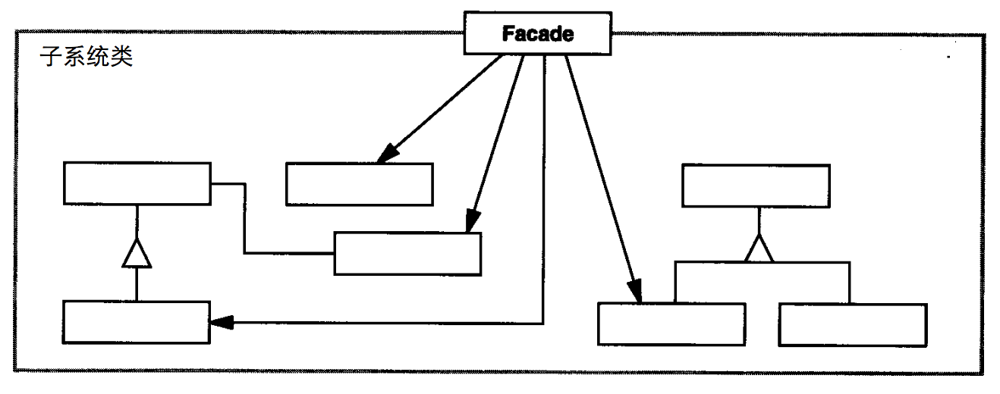  

图片来源: [设计模式: 可复用面向对象软件的基础](https://book.douban.com/subject/1052241/).

###实现
  
    
    案例需求: 租房
    

有过自己找房租房经历的同学能够体会得到找房是件很痛苦的事, 不光要挨个小区跑而且还要跟(二)房东讨价还价. 于是后来学聪明了, 不再自己挨门挨户的磨嘴皮子,而是直接找像_链家_、_我爱我家_这样的房屋中介, 他们手上握有一定的房源, 我们只需付给他们一笔佣金, 他们便可以代我们跟房东讲价, 而且他们大都很专业,省时间又省钱. 此时**房屋中介**就是一个**外观Facade**, 而房屋的出租户就是**子系统SubSystem**:  

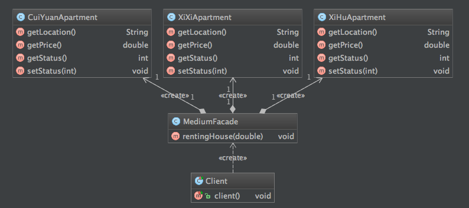

  * Facade   

> 外观类: **知道哪些子系统负责处理请求**, 将客户的请求代理给适当的子系统对象:

    public class MediumFacade {
        private CuiYuanApartment cuiyuan;
        private XiXiApartment xixi;
        private XiHuApartment xihu;
        public MediumFacade() {
            cuiyuan = new CuiYuanApartment("翠苑小区", 900, 1);
            xixi = new XiXiApartment("西溪花园", 1200, 1);
            xihu = new XiHuApartment("西湖小区", 2600, 1);
        }
        public void rentingHouse(double price) {
            // 价钱合适而且有房可组
            if (price >= cuiyuan.getPrice() && cuiyuan.getStatus() != 0) {
                System.out.println("预订" + cuiyuan.getLocation());
                cuiyuan.setStatus(0);
            } else if (price >= xixi.getPrice() && xixi.getStatus() != 0) {
                System.out.println("预订" + xixi.getLocation());
                xixi.setStatus(0);
            } else if (price >= xihu.getPrice() && xihu.getStatus() != 0) {
                System.out.println("预订" + xihu.getLocation());
                xihu.setStatus(0);
            } else {
                System.out.println("出价太低/没有房源 ...");
            }
        }
    }

  * SubSystem   

> 子系统集合: 实现子系统功能,
处理**Facade对象**指派的任务(注意子系统内没有任何**Facade**信息,即没有任何**Facade对象**引用):
   
    /**
     * @author jifang
     * @since 16/8/23 上午10:12.
     */
    public class XiHuApartment {
        private String location;
        private double price;
        private int status;
        public XiHuApartment(String location, double price, int status) {
            this.location = location;
            this.price = price;
            this.status = status;
        }
        public String getLocation() {
            return location;
        }
        public double getPrice() {
            return price;
        }
        public int getStatus() {
            return status;
        }
        public void setStatus(int status) {
            this.status = status;
        }
    }
    class XiXiApartment {
        private String location;
        private double price;
        private int status;
        public XiXiApartment(String location, double price, int status) {
            this.location = location;
            this.price = price;
            this.status = status;
        }
        public String getLocation() {
            return location;
        }
        public double getPrice() {
            return price;
        }
        public int getStatus() {
            return status;
        }
        public void setStatus(int status) {
            this.status = status;
        }
    }
    class CuiYuanApartment {
        private String location;
        private double price;
        private int status;
        public CuiYuanApartment(String location, double price, int status) {
            this.location = location;
            this.price = price;
            this.status = status;
        }
        public String getLocation() {
            return location;
        }
        public double getPrice() {
            return price;
        }
        public int getStatus() {
            return status;
        }
        public void setStatus(int status) {
            this.status = status;
        }
    }

  * Client   

这样, Client只需跟一个房屋中介联系并给出我们的报价, 他们便会帮我们联系所有符合的房东:
  
    
    public class Client {
        @Test
        public void client() {
            MediumFacade facade = new MediumFacade();
            facade.rentingHouse(800);
        }
    }


###小结

> 有过面向对象开发经验的同学 即使没有听说过**外观模式**, 也完全有可能使用过他, 因为他完美的体现了**依赖倒转原则**和**迪米特法则**的思想,是非常常用的模式之一.

  * 使用 
    
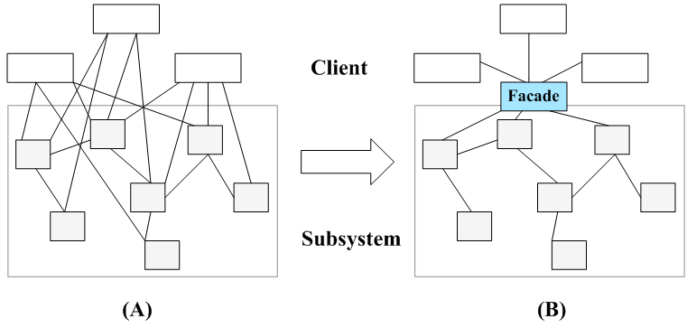  

    * 首先 在设计初期, 应该有意识的进行层次分离, 比如经典的三层架构, 层与层之间建立**Facade**, 这样可以为复杂的子系统提供一个简单的接口, 使耦合度大大降低.
    * 其次 在开发阶段, 子系统往往因为不断的重构而变得越来越复杂, 增加**Facade**可以提供一个简单的接口, 减少模块间依赖.
    * 第三 在维护一个遗留系统时, 可能这个系统已经非常难以维护和扩展了, 但因为它包含非常重要的功能, **新的需求必须依赖它**, 此时可以为新系统开发一个**Facade**, 为设计粗糙或高复杂度的遗留代码提供一个的比较**清晰简单**的接口, 让新系统与**Facade**交互, 而**Facade**与遗留代码交互所有繁杂的工作.


<hr>


####<p>原文出处：<a href='http://blog.csdn.net/zjf280441589/article/details/52484327' target='blank'>观察者模式</a></p>

####观察者模式

> 观察者模式: 又称**‘发布-订阅’模式**,
定义一种对象间的**一对多**依赖关系(多个**观察者Observer**监听某一**主题Subject**).当主题状态发生改变时,所有依赖它的对象都**得到通知**并被**自动更新**.  

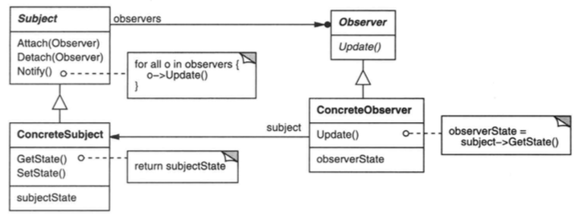  

核心: **触发联动**(图片来源: [设计模式:
可复用面向对象软件的基础](https://book.douban.com/subject/1052241/))

###模式实现

    
    以电商系统下单: 
    用户购买某件商品下一个订单, 需要: 通知库存系统减少库存、通知商家系统发货、通知支付系统收钱、甚至还会通知关系中心使当前用户关注该商家.
    

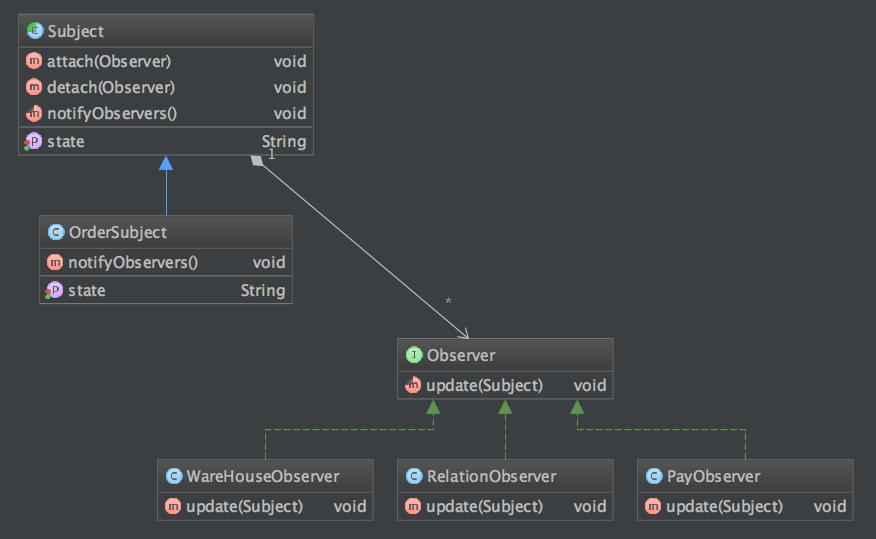


####Subject

目标/**主题**/抽象通知者:

  * **Subject**知道它所有的观察者, 可以有任意多个观察者监听同一个目标(将观察者保存在一个聚集中);
  * 提供**注册**/**删除**观察者的接口.
    
```java
/**
 * @author jifang
 * @since 16/8/30 上午9:49.
 */
public abstract class Subject {
    protected List<Observer> observers = new LinkedList<>();
    public void attach(Observer observer) {
        observers.add(observer);
    }
    public void detach(Observer observer) {
        observers.remove(observer);
    }
    protected abstract void notifyObservers();
    public abstract String getState();
    public abstract void setState(String state);
}
```

####ConcreteSubject

具体目标/具体主题:

  * 将有关**状态**存入**ConcreteSubject**;
  * 当它的状态发生改变时, **向各个观察者发出通知.**
    
```java
class OrderSubject extends Subject {
    private String state;
    /**
     * 采用拉模型, 将Subject自身发送给Observer
     */
    @Override
    protected void notifyObservers() {
        for (Observer observer : observers) {
            observer.update(this);
        }
    }
    @Override
    public String getState() {
        return state;
    }
    @Override
    public void setState(String state) {
        this.state = state;
        this.notifyObservers();
    }
}
```

####Observer

**抽象观察者**: 为那些**_在目标状态发生改变时需获得通知的对象_**定义一个更新接口.

    public interface Observer {
        void update(Subject subject);
    }

####ConcreteObserver

**具体观察者**:

  * 存储有关**状态**, 这些状态**应与目标的状态保持一致**;
  * 实现**Observer**的更新接口以使自身状态与目标的状态保持一致;
  * _维护一个指向**ConcreteSubject**对象的引用.
    
```java
class WareHouseObserver implements Observer {
    private String orderState;
    @Override
    public void update(Subject subject) {
        orderState = subject.getState();
        System.out.println("库存系统接收到消息 [" + orderState + "], 减少库存");
    }
}
class PayObserver implements Observer {
    private String orderState;
    @Override
    public void update(Subject subject) {
        orderState = subject.getState();
        System.out.println("支付系统接收到消息 [" + orderState + "], 正在收钱");
    }
}
class RelationObserver implements Observer {
    private String orderState;
    @Override
    public void update(Subject subject) {
        orderState = subject.getState();
        if (orderState.equals("已付款")) {
            System.out.println("关系系统接收到消息 [" + orderState + "], 当前用户已关注该店铺");
        } else if (orderState.equals("取消订单")) {
            System.out.println("关系系统接收到消息 [" + orderState + "], 当前用户取消关注该店铺");
        }
    }
}
```
  * Client
    
```java
public class Client {
    @Test
    public void client() {
        Subject subject = new OrderSubject();
        Observer payObserver = new PayObserver();
        Observer relationObserver = new RelationObserver();
        Observer wareHouseObserver = new WareHouseObserver();
        // 注册到Subject
        subject.attach(payObserver);
        subject.attach(relationObserver);
        subject.attach(wareHouseObserver);
        subject.setState("已付款");
        System.out.println("-------------");
        // 付钱、发货完成
        subject.detach(payObserver);
        subject.detach(wareHouseObserver);
        subject.setState("取消订单");
    }
}
```

###通知方式

  * 以上我们采用的是**拉模型**实现**Subject**对**Observer**通知(传递**Subject**自身), 在**观察者模式**中还有一种**推模型**实现:

    * 拉模型   
**Subject**把自身(`this`)通过`update()`方法传递给观察者, 观察者只要知道有通知到来即可, 至于**什么时候**获取**什么内容**都可自主决定.
    * 推模型   
**Subject**主动向观察者推送**有关状态的详细信息**, 推送的信息通常是目标对象的全部或部分数据. 观察者只能被动接收.
  * 对比   
推模型中假定**Subject**知道观察者需要数据的详细信息, 而拉模型中**Subject**不需要知道观察者具体需要什么数据(因此把自身传过去,
由观察者取值).因此:

    * 推模型会**使观察者对象难以复用**; 
    * 拉模型下, 由于`update()`方法参数是**Subject**本身, 基本上可以适应各种情况的需要.

###JDK支持

Java语言自身提供了对观察者模式的支持: `java.util`包下提供了`Observable`类与`Observer`接口.

下面我们就用Java的支持实现观察者模式的**推模型**:

  * ConcreateSubject
    
```java
public class OrderSubject extends Observable {
    private String state;
    public String getState() {
        return state;
    }
    public void setState(String state) {
        this.state = state;
        this.setChanged();
        this.notifyObservers(state);
    }
    @Override
    public String toString() {
        String result = "OrderSubject{";
        try {
            Field obs = Observable.class.getDeclaredField("obs");
            obs.setAccessible(true);
            Vector vector = (Vector) obs.get(this);
            result += vector;
        } catch (NoSuchFieldException | IllegalAccessException ignored) {
        }
        return result +
                "state='" + state + '\'' +
                '}';
    }
}
```

  * ConcreteObserver
    
```java
public class WareHouseObserver implements Observer {
    private String orderState;
    @Override
    public void update(Observable o, Object arg) {
        System.out.println("拉模式: " + o);
        orderState = (String) arg;
        System.out.println("推模式: 库存系统接收到消息 [" + orderState + "], 减少库存");
    }
}
```

###Guava支持

> Guava提供`EventBus`以取代**发布者**和**订阅者**之间的显式注册, 取而代之的是使用注解`@Subscribe`,使组件间有更好的解耦.

####Event

**封装消息类**   
**EventBus**的`Event`继承: **EventBus**自动把事件分发给事件超类的监听者/观察者,并允许监听者声明监听**接口类型**和**泛型的通配符类型**(如 `? super Xxx`).
    
    
    interface Event {
        String getState();
    }

>   * 注:  
>     * **DeadEvent** : 如果**EventBus**发送的消息都不是订阅者关心的称之为**DeadEvent**.
>     * 每个用`@Subscribe`注解标注的方法只能有一个参数.

####Subject

使用Guava之后, 如果要订阅消息, 就不用再实现指定的接口, 只需在指定的方法上加上`@Subscribe`注解即可, 但为了代码的易读性,我们还是推荐保留公共的接口:
  
    
    public interface Observer {
        void update(Event event);
    }


####Producer

  * 管理**Listener**/**Observer**: **EventBus**内部已经实现了的观察者/监听者管理;
  * 分发事件: 将**事件**传递给`EventBus.post(Object)`方法即可, 异步分发可以直接用`EventBus`子类`AsyncEventBus`.
    
```java  
    public class Producer {
        private static final Logger LOGGER = Logger.getLogger(Client.class.getName());
        @Test
        public void client() {
            EventBus bus = new EventBus("observer-pattern");
            bus.register(new Observer() {
                @Subscribe
                @Override
                public void update(Event event) {
                    System.out.println("库存系统接收到消息 [" + event.getState() + "], 减少库存");
                }
            });
            bus.register(new Observer() {
                @Subscribe
                @Override
                public void update(Event event) {
                    System.out.println("支付系统接收到消息 [" + event.getState() + "], 正在收钱");
                }
            });
            // 不用实现接口, 直接给出一个Object对象也可
            bus.register(new Object() {
                @Subscribe
                public void onEvent(Event event) {
                    System.out.println("关系系统接收到消息 [" + event.getState() + "], 当前用户关注店铺");
                }
                @Subscribe
                public void onEventFun(Event event) {
                    System.out.println("我就是来打酱油的o(╯□╰)o");
                }
            });
            // 注册DeadEvent
            bus.register(new Object() {
                @Subscribe
                public void onDead(DeadEvent dead) {
                    LOGGER.log(Level.WARNING, "没有消费者接收" + dead);
                }
            });
            // 发布消息
            bus.post(new Event() {
                @Override
                public String getState() {
                    return "付钱成功";
                }
            });
            bus.post("dead event O(∩_∩)O~");
        }
    }
```

> 注: 线程间通信框架**Disruptor**也是观察者模式的一种具体实现, 详细可参考博客: [Java并发基础:Disruptor小结](http://blog.csdn.net/zjf280441589/article/details/50575991#t28)、[并发框架Disruptor译文](http://coolshell.cn/articles/9169.html).

###小结

> 将系统分割成一系列相互协作的类有一定的副作用: **需要维护相关对象间的一致性**, 我们不希望为了一致性而将各类紧密耦合,这样会给维护、扩展和重用都带来不便.  
而观察者模式允许独立的改变目标和观察者. 你可以单独复用**Subject**而不用管**Observer** 反之亦然.它也使你可以在不改动**Subject**和其他**Observer**的前提下增加观察者.

  * 场景:   
当一个抽象模型有两个方面, 其中一方依赖于另一方(一方改变需要通知另一方, 且它不知道具体有多少对象等待待改变),这时观察者就可将这两者封装在独立的对象中使他们各自独立的改变和复用  

    * 关注微信公众号 & 邮件订阅;
    * 网络游戏中**服务器将客户状态转发**;
    * Servlet API: 监听器`Listener`;
    * Android广播机制;
    * AWT事件处理模型(基于观察者模式的委派事件模型).


<hr>


####<p>原文出处：<a href='http://blog.csdn.net/zjf280441589/article/details/52592421' target='blank'>享元模式</a></p>

####享元模式

> 内存属于稀缺资源, 不能随便浪费. 如果有很多相同/相似的对象, 我们可以通过**享元**节省内存.


###内部状态 vs. 外部状态

> **享元模式(Flyweight)**: 运用**共享技术**有效地重用大量细粒度的对象.

  * 享元对象能做到共享的关键是区分了**内部状态**和**外部状态**:   

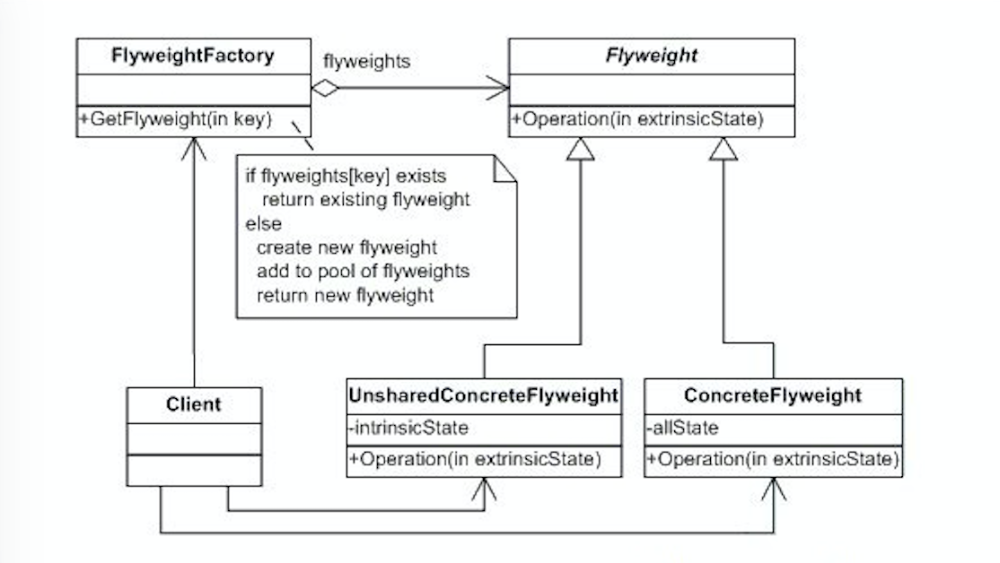  

    * 在享元对象内部并且**不会随环境改变而改变的共享部分**, 可称之为享元对象的内部状态.
    * 而**随环境改变而改变的、不可以共享的状态**是外部状态. 

在设计开发中,有时需要生产大量细粒度对象来表征数据, 如果这些对象除个别参数外基本相同, 此时如果能**把那些参数移到类实例外面,在方法调用时将其传入**, 就可以通过共享大幅度减少类实例数目.

###模式实现

    案例: 围棋设计
    

有下棋经验的同学都知道一盘棋的棋子大小、材质、颜色(黑/白)往往都是确定的, 而围棋落子的位置却不一定(看水平高低了O(∩_∩)O！),因此我们可以将棋子位置从棋子对象中剥离, 然后让棋子对象共享大小、材质、颜色属性, 并在调用时将位置传入, 就可大大减少棋子对象的数量:  

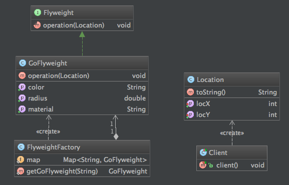

####Flyweight

所有具体享元类的超类或接口, 通过该接口, **Flyweight**可以接受并作用于外部状态:
 
    
    /**
     * @author jifang
     * @since 16/8/26 上午10:27.
     */
    public interface Flyweight {
        void operation(Location location);
    }


####ConcreteFlyweight

实现**Flyweight**接口, 并为内部状态增加存储空间:

    
    
    class GoFlyweight implements Flyweight {
        private String color;
        private double radius;
        private String material;
        public GoFlyweight(String color, double radius, String material) {
            this.color = color;
            this.radius = radius;
            this.material = material;
        }
        public String getColor() {
            return color;
        }
        public double getRadius() {
            return radius;
        }
        public String getMaterial() {
            return material;
        }
        @Override
        public void operation(Location location) {
            System.out.println("[" + color + "]棋 [" + material + "]材质 半径[" + radius + "]CM 落在" + location);
        }
    }


####UnsharedConcreteFlyweight

指不需要共享的**Flyweight**子类, 因为**Flyweight**接口共享成为可能, 但它并不强制共享.**UnsharedConcreteFlyweight**用于解决那些不需要共享对象的问题:

    
    
    class Location {
        private int locX;
        private int locY;
        public Location() {
        }
        public Location(int locX, int locY) {
            this.locX = locX;
            this.locY = locY;
        }
        public int getLocX() {
            return locX;
        }
        public void setLocX(int locX) {
            this.locX = locX;
        }
        public int getLocY() {
            return locY;
        }
        public void setLocY(int locY) {
            this.locY = locY;
        }
        @Override
        public String toString() {
            return "{" +
                    "locX=" + locX +
                    ", locY=" + locY +
                    '}';
        }
    }

  * FlyweightFactory   
享元工厂,用来创建并管理**Flyweight**对象,作用是确保合理地共享**Flyweight**, 当用户请求一个**Flyweight**时,**FlyweightFactory**提供一个共享实例:

```java  
public class FlyweightFactory {
    private static Map<String, GoFlyweight> map = new ConcurrentHashMap<>();
    public static GoFlyweight getGoFlyweight(String color) {
        GoFlyweight flyweight = map.get(color);
        if (flyweight == null) {
            flyweight = new GoFlyweight(color, 1.1, "陶瓷");
            map.put(color, flyweight);
        }
        return flyweight;
    }
}
```

###小结

> 享元模式可以**极大减少内存中对象的数量**: 相同/相似对象只保留一份, 节约资源, 提高性能. 且将外部状态剥离, 使外部状态相对独立,不影响内部状态. 但相比原先的设计, 增加了实现复杂度, 且读取外部状态使得运行时间变长(时间换空间).

  * 场景   
如果一个应用使用了大量对象从而造成很大的存储开销时;  
如果对象的有大量外部状态, 且**剥离**外部状态就可用相对较少的共享对象取代很多实例时;  

    * **‘池’化资源**, 如: 线程池、数据库连接池.
    * `String`类设计.


<hr>


####<p>原文出处：<a href='http://blog.csdn.net/zjf280441589/article/details/52774153' target='blank'>命令模式</a></p>

####命令模式

> 在对象的结构和创建问题都解决了之后,就剩下对象的行为问题了: **如果对象的行为设计的好,那么对象的行为就会更清晰,它们之间的协作效率就会提高**.  
行为型模式共有11个可供研究,它们分别是:**_命令模式_**、**_解释器模式_**、**_访问者模式_**、**_模板方法模式_**、**_观察者模式_**、**_状态模式_**、**_策略模式_**、**_责任链模式_**、**_中介者模式_**、**_备忘录模式_**、**_迭代器模式_**.

###命令模式

> 命令模式: 又称**动作Action模式**, 将请求封装为对象, 从而使我们可用不同的请求对客户进行参数化;命令可用于将**行为请求者**与**行为实现者**解耦, 以适应变化(如: 对请求排队、记录日志、支持可撤销操作等).  

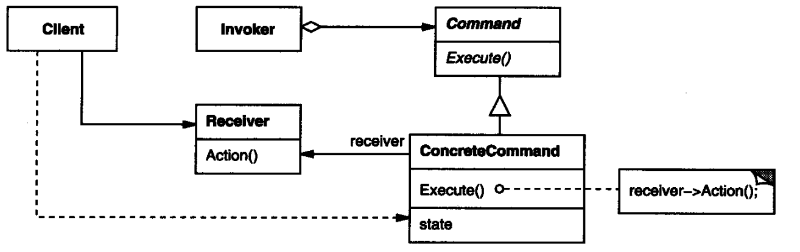  

(图片来源: [设计模式: 可复用面向对象软件的基础](https://book.douban.com/subject/1052241/))

###模式实现

    
    
    案例:以饭店点菜为例-点餐
    客户不需要直接向大厨下达点菜命令, 而是通过给服务员书写菜单, 然后服务员再具体指挥大厨照单做菜, 菜单是一种'Command':
    

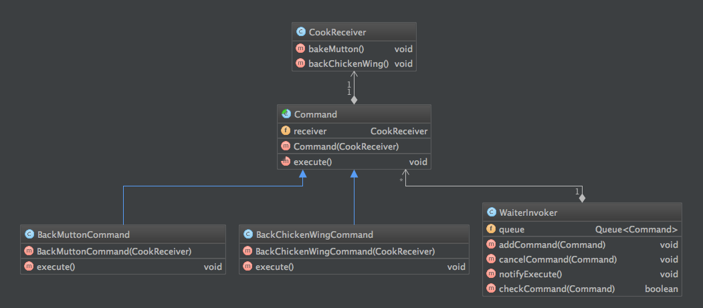  

(案例来源: [大话设计模式](https://book.douban.com/subject/2334288/))


####Receiver

> 命令接收者: 提供很多方法调用, 负责执行与请求相关业务逻辑;

厨师: 只负责做各种各样的菜.   
    
    /**
     * @author jifang
     * @since 16/8/19 上午10:01.
     */
    public class CookReceiver {
        public void bakeMutton() {
            System.out.println("厨师: 烤羊肉串");
        }
        public void backChickenWing() {
            System.out.println("厨师: 烤鸡翅");
        }
    }

####Command

> 抽象命令接口: 类中对需要执行的操作进行声明, 且包含一个**Receiver**,
并公布一个`execute()`方法用来调用**Receiver**执行命令:  
    
    /**
     * @author jifang
     * @since 16/8/19 上午10:08.
     */
    public abstract class Command {
        protected CookReceiver receiver;
        public Command(CookReceiver receiver) {
            this.receiver = receiver;
        }
        public abstract void execute();
    }


####ConcreteCommand

> 具体命令类: 实现**Command**内的抽象方法(调用**Receiver**提供的方法).
  
    /**
     * 烤肉命令
     */
    class BackMuttonCommand extends Command {
        public BackMuttonCommand(CookReceiver receiver) {
            super(receiver);
        }
        @Override
        public void execute() {
            this.receiver.bakeMutton();
        }
    }
    /**
     * 烤鸡翅命令
     */
    class BackChickenWingCommand extends Command {
        public BackChickenWingCommand(CookReceiver receiver) {
            super(receiver);
        }
        @Override
        public void execute() {
            this.receiver.backChickenWing();
        }
    }


####Invoker

> 请求的发起者: 内部包含**Command**聚集, 他通过命令对象来唤起**Receiver**执行请求. 一个调用者并不需要在设计时确定其接受者,
因此它只与抽象命令**Command**存在关联.通过调用**Command**的`execute()`**间接**调用**Receiver**的相关操作:

    
    public class WaiterInvoker {
        private Queue<Command> queue = new LinkedList<>();
        public void addCommand(Command command) {
            if (checkCommand(command)) {
                queue.add(command);
            }
        }
        public void cancelCommand(Command command) {
            // 如果命令已经执行过, 则不予撤销
            if (!queue.isEmpty()) {
                queue.remove(command);
            }
        }
        /**
         * 通知执行所有命令
         */
        public void notifyExecute() {
            while (!queue.isEmpty()) {
                Command command = queue.poll();
                command.execute();
            }
        }
        private boolean checkCommand(Command command) {
            // TODO 检查命令是否有效: 如当前原材料是否充足等
            return true;
        }
    }

  * Client
    
```java
/**
 * Created by jifang on 15/12/3.
 */
public class Client {
    @Test
    public void client() {
        // 开业准备
        WaiterInvoker waiter = new WaiterInvoker();
        CookReceiver cook = new CookReceiver();
        Command backMuttonOrder = new BackMuttonCommand(cook);
        Command backChickenWingOrder = new BackChickenWingCommand(cook);
        // 接收订单
        waiter.addCommand(backMuttonOrder);
        waiter.addCommand(backChickenWingOrder);
        // 在厨师制作完成之前还可以撤销订单
        waiter.cancelCommand(backMuttonOrder);
        // 通知执行
        waiter.notifyExecute();
    }
}
```

###小结:

> 命令模式把**请求**一个操作的对象与知道怎么**执行**一个操作的对象分隔开.

  * 优点   

    1. 较容易设计一个**命令队列**;
    2. 较容易将命令**记录日志**;
    3. 允许接受请求的一方决定是否要**否决**请求;
    4. 较容易地实现对请求的**撤销**与**重做**;
    5. 由于添加新的具体命令对其他类没有任何影响, 因此**增加新的具体命令很容易**;
  * 场景:   

    1. Struts2 Action的调用过程;
    2. 数据库事务机制;
    3. 命令的撤销与恢复.


<hr>


####<p>原文出处：<a href='http://blog.csdn.net/zjf280441589/article/details/52831029' target='blank'>模板方法模式</a></p>

####模板方法模式

> 模板方法模式: 定义一个操作中的**算法的骨架**, 而将一些步骤延迟到子类中.
模板方法使得**_子类可以在不改变一个算法的结构的前提下重定义该算法的某些特定步骤_**.  

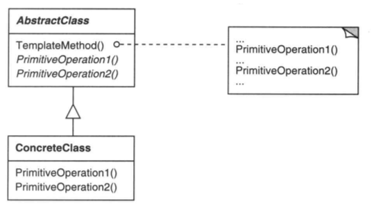  

(图片来源: [设计模式:可复用面向对象软件的基础](https://book.douban.com/subject/1052241/))

  * Tips   
处理某个流程的骨架代码已经具备, 但其中某节点的具体实现暂不确定, 此时可采用模板方法, 将**该节点的代码实现转移给子类完成**. 即: **处理步骤在父类中定义好, 具体实现延迟到子类中定义**.

###模式实现

到**ATM取款机**办理业务, 都会经过_插卡_、_输密码_、_处理业务_、_取卡_ 等几个过程, 而且这几个过程一定是顺序执行的, 且除了 _处理业务_(如取款、改密、查账) 可能会有所不同之外, 其他的过程完全相同. 因此我们就可以参考**模板方法模式**把_插卡_、_输密码_、_取卡_ 3个过程放到父类中实现, 并定义一个流程骨架, 然后将 _处理业务的具体逻辑_ 放到子类中:  

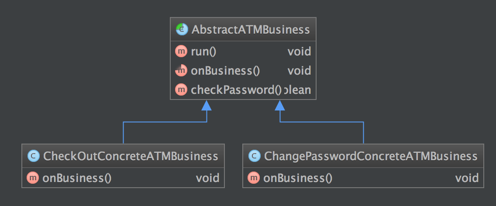

  * AbstractClass 抽象模板:   

    * 定义抽象的**原语操作**,具体的子类将重定义它们以实现一个算法的各步骤.
    * 实现一个模板方法,定义一个算法的骨架. 该模板方法不仅调用原语操作,也调用定义在**AbstractClass**或其他对象中的操作.
    
```java 
/**
 * @author jifang
 * @since 16/8/21 上午10:35.
 */
public abstract class AbstractATMBusiness {
    public void run() {
        System.out.println("-> 插卡");
        System.out.println("-> 输入并校验密码");
        if (checkPassword()) {
            onBusiness();
        }
        System.out.println("-> 取卡");
    }
    // 具体业务处理延迟到子类实现
    protected abstract void onBusiness();
    private boolean checkPassword() {
        // TODO Encode Password, Select DB & Comparison
        return true;
    }
}
```

`AbstractATMBusiness`是一个模板方法, 它定义了ATM操作的一个主要步骤并确定他们的先后顺序,但允许子类改变这些具体步骤以满足各自的需求.

  * ConcreteClass   
**实现原语操作以完成算法中与特定子类相关的步骤**; 每个**AbstractClass**都可有任意多个**ConcreteClass**, 而每个**ConcreteClass**都可以给出这些抽象方法的不同实现, 从而使得顶级逻辑的功能各不相同:
    
```java   
class CheckOutConcreteATMBusiness extends AbstractATMBusiness {
    @Override
    protected void onBusiness() {
        System.out.println(" ... 取款");
    }
}
class ChangePasswordConcreteATMBusiness extends AbstractATMBusiness {
    @Override
    protected void onBusiness() {
        System.out.println(" ... 修改密码");
    }
}
```

  * Client
    
```java
 /**
 * Created by jifang on 15/12/3.
 */
public class Client {
    @Test
    public void client() {
        AbstractATMBusiness changePassword = new ChangePasswordConcreteATMBusiness();
        changePassword.run();
        AbstractATMBusiness checkOut = new CheckOutConcreteATMBusiness();
        checkOut.run();
    }
}
```

###实例

####Servlet

`HttpServlet`定义了`service()`方法**固定下来HTTP请求的整体处理流程**,使得开发**Servlet**只需继承`HttpServlet`并实现`doGet()`/`doPost()`等方法完成业务逻辑处理, 并不需要关心具体的**HTTP**响应流程:

    
    /**
     * HttpServlet中的service方法
     */
    protected void service(HttpServletRequest req, HttpServletResponse resp)
    throws ServletException, IOException{
        String method = req.getMethod();
        if (method.equals(METHOD_GET)) {
            long lastModified = getLastModified(req);
            if (lastModified == -1) {
            // servlet doesn't support if-modified-since, no reason
            // to go through further expensive logic
            doGet(req, resp);
            } else {
            long ifModifiedSince = req.getDateHeader(HEADER_IFMODSINCE);
            if (ifModifiedSince < (lastModified / 1000 * 1000)) {
                // If the servlet mod time is later, call doGet()
                        // Round down to the nearest second for a proper compare
                        // A ifModifiedSince of -1 will always be less
                maybeSetLastModified(resp, lastModified);
                doGet(req, resp);
            } else {
                resp.setStatus(HttpServletResponse.SC_NOT_MODIFIED);
            }
            }
        } else if (method.equals(METHOD_HEAD)) {
            long lastModified = getLastModified(req);
            maybeSetLastModified(resp, lastModified);
            doHead(req, resp);
        } else if (method.equals(METHOD_POST)) {
            doPost(req, resp);
        } else if (method.equals(METHOD_PUT)) {
            doPut(req, resp);   
        } else if (method.equals(METHOD_DELETE)) {
            doDelete(req, resp);
        } else if (method.equals(METHOD_OPTIONS)) {
            doOptions(req,resp);
        } else if (method.equals(METHOD_TRACE)) {
            doTrace(req,resp);
        } else {
            //
            // Note that this means NO servlet supports whatever
            // method was requested, anywhere on this server.
            //
            String errMsg = lStrings.getString("http.method_not_implemented");
            Object[] errArgs = new Object[1];
            errArgs[0] = method;
            errMsg = MessageFormat.format(errMsg, errArgs);
            resp.sendError(HttpServletResponse.SC_NOT_IMPLEMENTED, errMsg);
        }
    }

> 详见: [Servlet - 基础](http://blog.csdn.net/zjf280441589/article/details/51247469).


####统一定时调度

将这个示例放在此处可能有些不大合适, 但它也体现了一些模板方法的**思想**:


#####1. 实现

  * ScheduleTaskMonitor
    
```java   
/**
 * @author jifang
 * @since 16/8/23 下午3:35.
 */
public class ScheduleTaskMonitor implements InitializingBean, DisposableBean {
    private static final Logger LOGGER = LoggerFactory.getLogger(ScheduleTaskMonitor.class);
    private static final int _10S = 10_000;
    private List<ScheduleTask> tasks = new CopyOnWriteArrayList<>();
    private static final Timer timer = new Timer("ScheduleTaskMonitor");
    private void start() {
        timer.schedule(new TimerTask() {
            @Override
            public void run() {
                for (ScheduleTask task : tasks) {
                    task.scheduleTask();
                }
            }
        }, 0, _10S);
    }
    public void register(ScheduleTask task) {
        tasks.add(task);
    }
    @Override
    public void afterPropertiesSet() throws Exception {
        this.start();
        LOGGER.info("Start Monitor {}", this.getClass());
    }
    @Override
    public void destroy() throws Exception {
        timer.cancel();
        LOGGER.info("Stop Monitor {}", this.getClass());
    }
}
```

  * ScheduleTask

```java
public interface ScheduleTask {
    void scheduleTask();
}
```

#####2. 使用

只需在Spring的配置文件中引入该Bean:

    <bean id="monitor" class="com.template.ScheduleTaskMonitor"/>

**需要统一定时的类实现`ScheduleTask`接口**, 并将自己注册到`monitor`中:
    
    
    /**
     * @author jifang
     * @since 16/3/16 上午9:59.
     */
    @Controller
    public class LoginController implements ScheduleTask, InitializingBean {
        private static final Logger LOGGER = LoggerFactory.getLogger(LoginController.class);
        @Autowired
        private ScheduleTaskMonitor monitor;
        @Override
        public void scheduleTask() {
            LOGGER.error("O(∩_∩)O 日志记录~");
        }
        @Override
        public void afterPropertiesSet() throws Exception {
            monitor.register(this);
        }
    }

即可完成`scheduleTask()`方法的定时调度.


###小结

> 模板方法模式提供了一个很好的代码复用平台, 他通过**把不变行为搬移到父类**, **去除子类中重复代码**来体现它的优势:
有时我们会遇到由一系列步骤构成的过程需要执行, 该过程从高层次上看是相同的, 但有某些细节的实现可能不同, 此时就可以考虑使用用模板方法了.

  * 适用

    * 一次性实现算法的不变部分, 并将可变的行为留给子类来实现;
    * 各子类中公共的行为应该被提取出来并集中到一个公共父类中避免代码重复, 如: **Servlet** 的 `service()`方法.
    * 控制子类扩展, 模板方法只在特定点调用**hook**操作, 这样就只允许在这些点进行扩展, 如: Junit测试框架.
  * 相关模式

    * Factory Method常被模板方法调用.
    * Strategy: 模板方法使用继承来改变算法的一部分, Strategy使用委托来改变整个算法.


<hr>


####<p>原文出处：<a href='http://blog.csdn.net/zjf280441589/article/details/53339028' target='blank'>状态模式</a></p>

####状态模式

> 状态模式: 允许一个对象在其**内部状态改变时**改变其**行为**, **其对象看起来像是改变了其类**.  
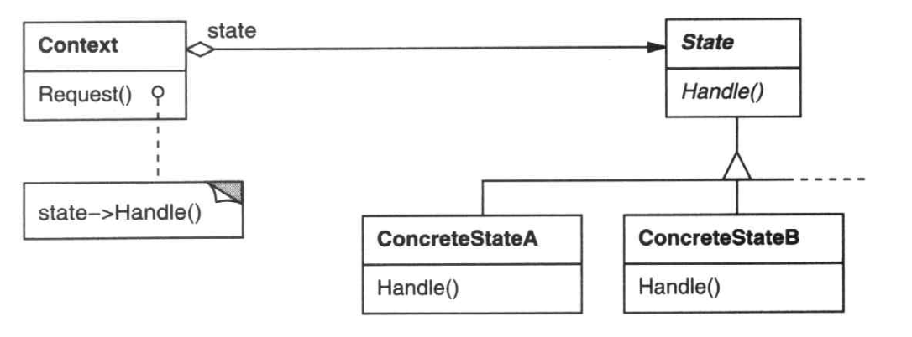  
(图片来源: [设计模式:可复用面向对象软件的基础](https://book.douban.com/subject/1052241/))  
其目的是: 解决系统中复杂对象的**状态流转**以及**不同状态下的行为封装**问题.

###模式实现

> 案例: 问题跟踪(Bug状态流转):  
有过[Kelude](http://kelude.aliyun.com/)、[Jira](https://www.atlassian.com/software/jira)使用经验的同学都知道一个Bug由测试同学提出, 一直到被开发同学解决会经过一系列状态的流转:  
**新建(New)** -> **打开(Open)** -> **解决(Fixed)** -> **关闭(Closed)** …   

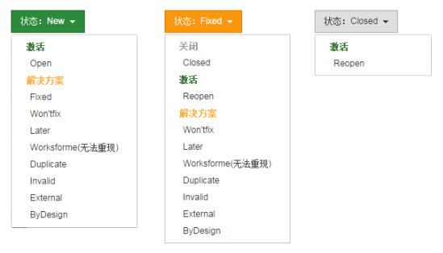  

且每种状态都会对应复杂业务的处理逻辑(如通知相应开发/测试人员、邮件/短信提醒、报表记录等等), 下面我们就以这个场景来讨论状态模式的实现:

  * 状态模式-Bug流转:   

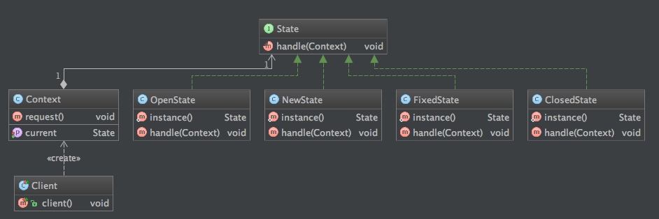

####State

**抽象状态**: 定义一个接口封装与 **Context的一个特定状态** 相关的行为:
    
    
    /**
     * @author jifang
     * @since 16/8/28 下午6:06.
     */
    public interface State {
        void handle(Context context);
    }

####ConcreteState

**具体状态**: 每一个子类实现一个与 **Context的某一个特定状态相关的具体行为** :
    
    
    class NewState implements State {
        static final NewState instance = new NewState();
        // 单例 or 享元
        public static State instance() {
            return instance;
        }
        @Override
        public void handle(Context context) {
            if (context.getCurrent() == this) {
                // 本状态下的核心业务处理
                System.out.println("测试: 发现了Bug, 开发同学赶紧处理");
                // 状态流转
                context.setCurrent(OpenState.instance());
            }
        }
    }
    class OpenState implements State {
        static final OpenState instance = new OpenState();
        public static State instance() {
            return instance;
        }
        @Override
        public void handle(Context context) {
            if (context.getCurrent() == this) {
                System.out.println("开发: Bug已经看到, 正在处理");
                context.setCurrent(FixedState.instance());
            }
        }
    }
    class FixedState implements State {
        static final FixedState instance = new FixedState();
        public static State instance() {
            return instance;
        }
        @Override
        public void handle(Context context) {
            if (context.getCurrent() == this) {
                System.out.println("开发: Bug已经修复, 测试同学看一下");
                context.setCurrent(ClosedState.instance());
            }
        }
    }
    class ClosedState implements State {
        static final ClosedState instance = new ClosedState();
        public static State instance() {
            return instance;
        }
        @Override
        public void handle(Context context) {
            if (context.getCurrent() == this) {
                System.out.println("测试: Bug验证通过, 已关闭");
                context.setCurrent(null);
            }
        }
    }

####Context

  * 定义客户感兴趣的接口
  * 维护一个**ConcreteState**子类实例 -当前状态.

```java    
public class Context {
    private State current;
    public Context(State current) {
        this.current = current;
    }
    public State getCurrent() {
        return current;
    }
    public void setCurrent(State current) {
        this.current = current;
    }
    public void request() {
        if (current != null) {
            current.handle(this);
        }
    }
}
```

  * Client
    
```java
public class Client {
    @Test
    public void client() {
        Context context = new Context(NewState.instance());
        context.request();
        context.request();
        context.request();
        context.request();
        context.request();
    }
}
```

###状态推动

> 前面介绍的状态流转需要由**Client**推动(**Client**调用**Context**的`request()`), 还有其他几种推动方式.如`State`自动流转: 每个`State`处理结束,自动进入下一状态的处理环节(在**State**内部调用**Context**的`request()`):

 
    class NewState implements State {
        @Override
        public void handle(Context context) {
            if (context.getCurrent() == this) {
                System.out.println("测试: 发现了Bug, 开发同学赶紧处理");
                context.setCurrent(new OpenState());
            }
            context.request();
        }
    }

> 另外还有一种**基于表驱动的状态机实现**, 实现细节参考
[设计模式:可复用面向对象软件的基础](https://book.douban.com/subject/1052241/) P204.


###小结

>   * 将**与特定状态相关的行为**局部化, 并将不同状态的行为分隔开:  
>     * 将特定的状态相关的行为都放入一个**对象**中: 由于所有与状态相关的代码都存在于某**ConcreteState**中,所以通过定义新的子类可以很容易地**增加新的状态和转换**.
>     * 可以将状态转移逻辑分布到**State**之间, 将每一个状态转换和动作封装到一个类中, 就把着眼点从执行状态提高到整个对象的状态,
这将使**代码结构化**并使**意图更加清晰**,消除庞大的条件分支语句.
>   * 状态转换显式化:  
当一个对象仅以内部数据值来定义当前状态时, 其状态仅表现为一些变量的赋值, 这不够明确.为不同的状态引入独立的对象使得转换变得更加明确(类**原子化**).

  * 场景:   

    * 当一个对象的行为取决于它的状态, 并且它必须在运行时刻根据状态改变它的行为;
    * 一个操作中含有庞大的条件分支语句, 且这些分支依赖于该对象的状态, 这个状态通常用一个/多个枚举常量表示:   

      * OA系统请求状态流转
      * 银行系统资金状态流转
      * 线程对象状态切换
      * TCP连接状态流转   
State模式将每一个条件分支放入一个独立的类中. 这使得可以根据对象自身的情况将对象的状态作为一个对象, 这一对象可以不依赖于其他对象而独立变化.


<hr>


####<p>原文出处：<a href='http://blog.csdn.net/zjf280441589/article/details/53543049' target='blank'>策略模式</a></p>

####策略模式

> 策略模式: 定义一系列的算法, 将其一个个**封装**起来, 并使它们可相互替换, 使得算法可独立于使用它的客户而变化.  

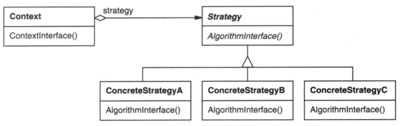  

(图片来源: [设计模式: 可复用面向对象软件的基础](https://book.douban.com/subject/1052241/))  

策略模式对应于解决某一问题的一个**算法族**, 允许用户从该算法族中任选一个算法解决该问题, 同时可以方便的更换算法或者增加新的算法.
并由客户端决定调用哪个算法(核心: **分离算法, 选择实现**).

###模式实现

    
    案例: 商场打折 -策略可以简单分为: 原价购买、满减、返利三种策略:
    

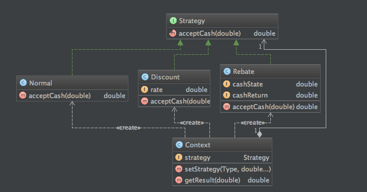


####Strategy

抽象策略: 定义算法族中所有算法的公共接口, **Context**使用这个接口来调用**ConcreteStrategy**定义的算法:

    
    /**
     * @author jifang
     * @since 16/8/29 下午7:43.
     */
    public interface Strategy {
        double acceptCash(double money);
    }


####ConcreteStrategy

具体策略: 以**Strategy**接口实现某具体算法或行为:

    
    // 正常收费
    class Normal implements Strategy {
        @Override
        public double acceptCash(double money) {
            return money;
        }
    }
    // 打折收费
    class Discount implements Strategy {
        private double rate;
        public Discount(double rate) {
            if (rate > 1.0) {
                throw new RuntimeException("折扣力度怎么能大于1.0?");
            }
            this.rate = rate;
        }
        @Override
        public double acceptCash(double money) {
            return money * rate;
        }
    }
    // 返利收费
    class Rebate implements Strategy {
        private double cashState;
        private double cashReturn;
        public Rebate(double cashState, double cashReturn) {
            this.cashState = cashState;
            this.cashReturn = cashReturn;
        }
        @Override
        public double acceptCash(double money) {
            if (money > cashState) {
                money -= Math.floor(money / cashState) * cashReturn;
            }
            return money;
        }
    }


####Context

  * **上下文**:   

    * 维护一个**Strategy**对象的引用;
    * 定义一个接口让**Strategy**访问它的数据;
    
 ```java   
public class Context {
    private Strategy strategy;
    public void setStrategy(Type type, double... args) {
        if (type == Type.NORMAL) {
            strategy = new Normal();
        } else if (type == Type.DISCOUNT) {
            strategy = new Discount(args[0]);
        } else if (type == Type.REBATE) {
            strategy = new Rebate(args[0], args[1]);
        }
    }
    public double getResult(double money) {
        return strategy.acceptCash(money);
    }
    public enum Type {
        NORMAL(0, "正常"),
        DISCOUNT(1, "打折"),
        REBATE(2, "返利");
        private int value;
        private String desc;
        Type(int value, String desc) {
            this.value = value;
            this.desc = desc;
        }
    }
}
```

> 注: 将客户端需要选择具体**Strategy**的任务交给**Context**完成:  
在**基础策略模式**中,**选择所用具体Strategy实现**的职责由Client承担, 并将其传递给**Context**,这种方案对Client的负担较重, 因此将**Context**与**简单工厂**融合, 选择算法实现的工作改由**Context**负责.

  * Client   
  * 
仅与**Context**交互: 通常有一系列的**ConcreteStrategy**可供选择.

```java
public class Client {
    @Test
    public void client() {
        double money = 1000;
        Context context = new Context();
        context.setStrategy(Context.Type.NORMAL);
        System.out.println("原价: [" + context.getResult(money) + "]");
        context.setStrategy(Context.Type.REBATE, 100, 20);
        System.out.println("满100返20: [" + context.getResult(money) + "]");
        context.setStrategy(Context.Type.DISCOUNT, 0.8);
        System.out.println("6折优惠: [" + context.getResult(money) + "]");
    }
}
```

###小结

  * 作用

    * 析取算法: **Strategy**接口为**Context**定义了一个可重用的算法/行为, 继承/实现其有助于析取出算法族的公共功能, 且可**减少算法与Client间的耦合**.
    * 消除条件语句: 避免将不同行为堆砌在一个类中, 将行为封装在独立的**Strategy**实现中, 可在**Client**中消除条件语句.
    * 简化单元测试: 每个算法都有自己的类, 可以单独测试.
  * 场景

    * 当使用一个算法的不同**变体**, 且这些变体可以实现为一个**算法族**时;
    * 算法的客户不需要知晓其内部数据, 策略模式可以避免暴露复杂的、与算法相关的数据结构;
    * 一个类定义了多种行为, 且这些行为以多个条件语句形式出现, 可将相关行为各自的**Strategy**(如: Servlet-api `service()`方法).
  * 相关模式   
Flyweight: **Strategy**对象经常是很好的轻量级对象.


<hr>


####<p>原文出处：<a href='http://blog.csdn.net/zjf280441589/article/details/53844305' target='blank'>责任链模式</a></p>

####责任链模式

>责任链模式: 将能够处理某一类请求的对象串成**一条链**, 请求沿链传递, 链上的对象逐个判断是否有能力处理该请求.
**_使多个对象都有机会处理请求_**, 从而避免请求发送者和接收者之间的耦合关系.  

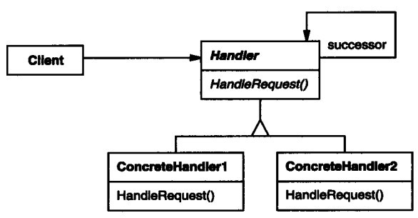  

(图片来源: [设计模式: 可复用面向对象软件的基础](https://book.douban.com/subject/1052241/))  
优势: 发出请求的客户端并不知道链上的哪个对象最终处理该请求, 这使得系统可以在不影响客户端的前提下**动态地重新组织和分配责任**.


###模式实现
  
    
    案例: 雇员要求 (请假 & 涨薪), 要经过总监Director -> 经理Manager -> 总经理GeneralManager的层层审批.
    

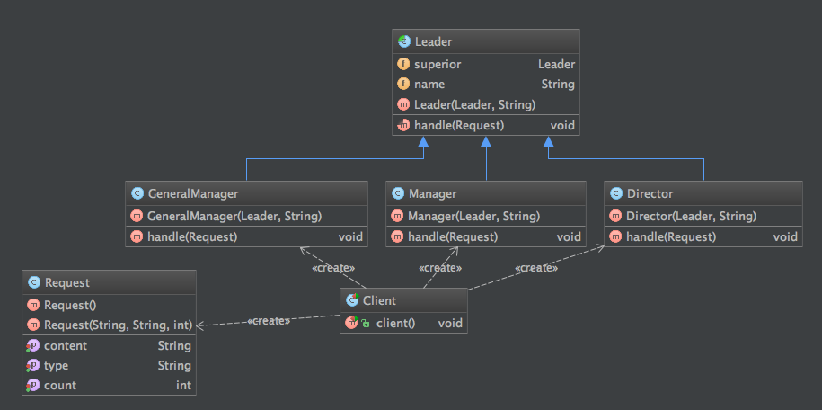


####Handler:

定义一个处理请求的接口, 内持继任者(可选):
  
    
    public abstract class Leader {
        protected Leader superior;
        protected String name;
        protected Leader(Leader superior, String name) {
            this.superior = superior;
            this.name = name;
        }
        public abstract void handle(Request request);
    }


####ConcreteHandler

  * 处理它所负责的请求, 可访问它的后继者;
  * 如果可处理该请求, 处理之, 否则将请求转发:
    
```java
// 总监
class Director extends Leader {
    public Director(Leader superior, String name) {
        super(superior, name);
    }
    @Override
    public void handle(Request request) {
        if (request.getType().equals("请假") && request.getCount() <= 10) {
            System.out.println("[ " + request.getContent() + "] 请假 [" + request.getCount() + "]天, 总监 [" + name + "] 审批通过");
        } else {
            if (superior != null) {
                superior.handle(request);
            }
        }
    }
}
// 经理
class Manager extends Leader {
    public Manager(Leader superior, String name) {
        super(superior, name);
    }
    @Override
    public void handle(Request request) {
        if (request.getType().equals("请假") && request.getCount() <= 20) {
            System.out.println("[ " + request.getContent() + "] 请假 [" + request.getCount() + "]天, 经理 [" + name + "] 审批通过");
        } else if (request.getType().equals("涨薪") && request.getCount() <= 1000) {
            System.out.println("[ " + request.getContent() + "]  涨薪 [" + request.getCount() + "]RMB, 经理 [" + name + "] 审批通过");
        } else {
            if (superior != null) {
                superior.handle(request);
            }
        }
    }
}
// 总经理
class GeneralManager extends Leader {
    public GeneralManager(Leader superior, String name) {
        super(superior, name);
    }
    @Override
    public void handle(Request request) {
        if (request.getType().equals("请假")) {
            if (request.getCount() <= 30) {
                System.out.println("[ " + request.getContent() + "] 请假 [" + request.getCount() + "]天, 总经理 [" + name + "] 审批通过");
            } else {
                System.out.println("[ " + request.getContent() + "] 你干脆辞职算了");
            }
        } else if (request.getType().equals("涨薪")) {
            if (request.getCount() <= 10_000) {
                System.out.println("[ " + request.getContent() + "]  涨薪 [" + request.getCount() + "]RMB, 总经理 [" + name + "] 审批通过");
            } else {
                System.out.println("你咋不上天呢");
            }
        }
    }
}

```

####Client

向链上的具体处理者对象提交请求:
    
    
    public class Client {
        @Test
        public void client() {
            Leader generalManger = new GeneralManager(null, "刘备");
            Leader manager = new Manager(generalManger, "诸葛亮");
            Leader director = new Director(manager, "赵云");
            director.handle(new Request("请假", "翡青", 32));
            director.handle(new Request("涨薪", "zjf", 1500));
        }
    }
    
    
    public class Request {
        private String type;
        private String content;
        private int count;
        public Request() {
        }
        public Request(String type, String content, int count) {
            this.type = type;
            this.content = content;
            this.count = count;
        }
        public String getType() {
            return type;
        }
        public void setType(String type) {
            this.type = type;
        }
        public String getContent() {
            return content;
        }
        public void setContent(String content) {
            this.content = content;
        }
        public int getCount() {
            return count;
        }
        public void setCount(int count) {
            this.count = count;
        }
    }

> 注: **非链表实现责任链** \- 还可通过**集合**、**数组**等形式存储责任链, 很多项目中,每个具体的**Handler**并不是开发团队定义的, 而是项目上线后又外部单位追加的, 此时使用链表方式定义**chain of responsibility**就很困难, 此时可选择使用集合存储.


###小结

  * 优缺点

    * 降低耦合度: 客户提交一个请求, 请求沿链传递直至一个**ConcreteHandler**最终处理, **接收者和发送者都没有对方的明确信息**, 便于接受者与发送者的解耦.
    * 增强给对象指派职责的灵活性: 链中对象自己并**不清楚链结构**,他们仅保持一个**后继者指针**, 因此责任链可**简化对象的相互连接**, 且可以随时增加或修改处理请求的对象, 增强了**给对象指派职责的灵活性**.
    * 缺陷: 不保证被接受: 既然一个请求没有明确的接收者, 那么就不能保证它能一定被正确处理, 即一个请求有可能到了链的末端也得不到处理, 或因为没有正确配置链顺序而得不到**“正确”**处理.
  * 场景

    * 有多个对象可以处理一类请求, 且哪个对象处理由运行时刻自动确定;
    * 在不明确指定接收者的情况下, 向多个对象中提交同一个请求;
    * 处理一个请求的对象集合被动态指定;   

      * Java异常机制: 一个`try`对应多个`catch`;
      * Servlet: `Filter`链式处理;
      * Spring MVC : 拦截器链(详见: [Spring MVC 实践](http://blog.csdn.net/zjf280441589/article/details/51831979#t2));
  * 相关模式   
[Composite(组合)模式](http://blog.csdn.net/zjf280441589/article/details/52410509):
这种情况下, 一个构件的父构件可作为它的后继者.

