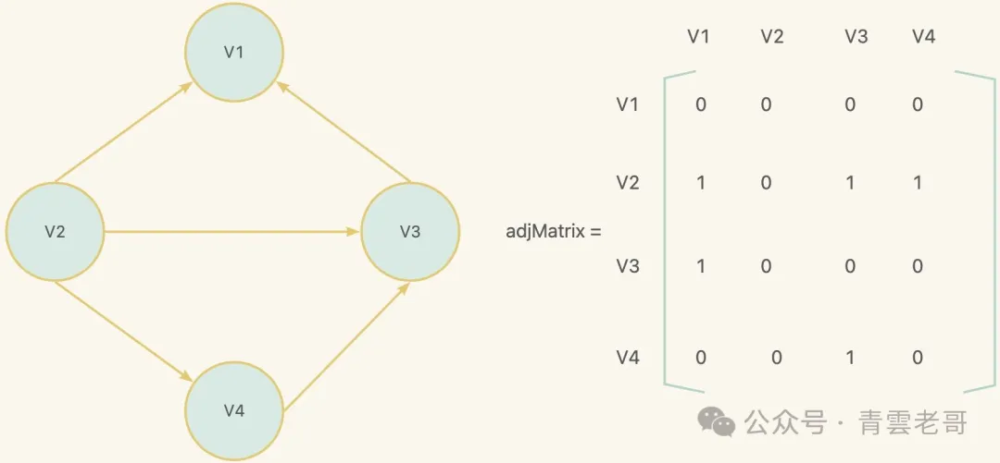
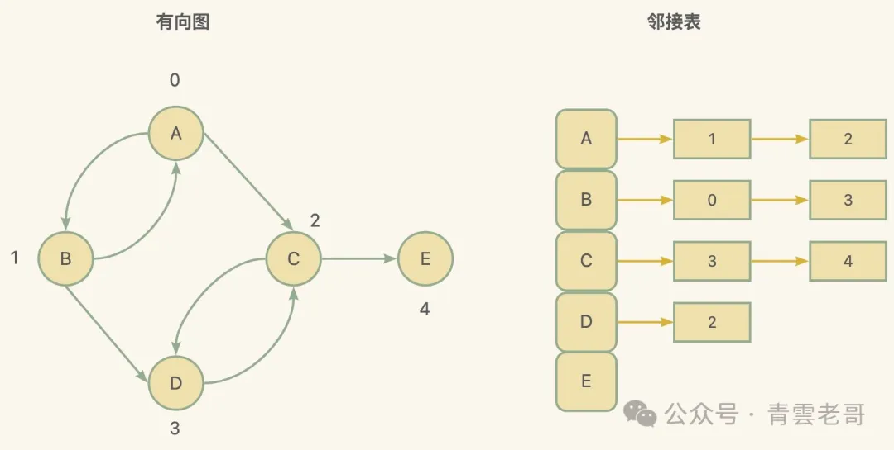
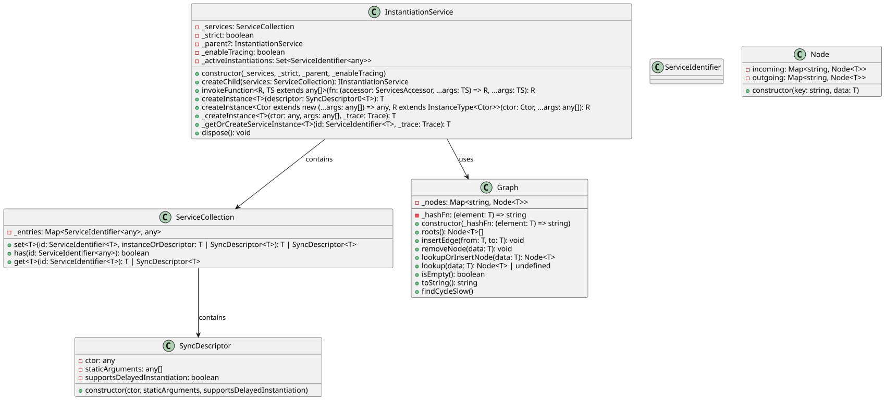
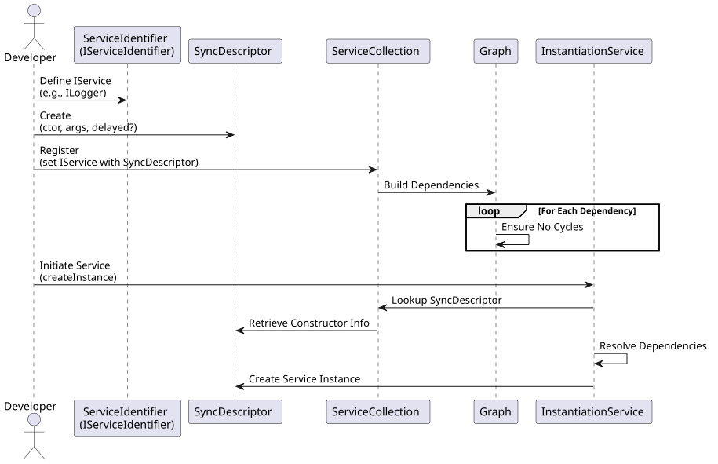

 
<!--BEGIN_DATA
{
    "create_date": "2024-07-29 19:02", 
    "modify_date": "2024-07-29 19:02", 
    "is_top": "0", 
    "summary": "详解VSCode依赖注入的原理和实现", 
    "tags": "Web", 
    "file_name": "详解VSCode依赖注入的原理和实现.md"
}
END_DATA-->

#### <p>原文出处：<a href='https://mp.weixin.qq.com/s/rrnlFZP69KjBzz-c59feQA' target='blank'>详解VSCode依赖注入的原理和实现</a></p>

VSCode是一个由Microsoft开发、跨平台的、开源代码编辑器，具有高性能、扩展性强等特点。VSCode 采用了 TypeScript 进行编写，利用了 Node.js 和 Electron。在设计架构中，VSCode 使用了依赖注入（DI），一种控制反转的形式，来管理不同功能模块之间的依赖关系。依赖注入是现代软件工程中常见的设计模式之一，它可以提高代码的可维护性、可测试性和可扩展性，下面我将结合源码来详细解读VSCode依赖注入的原理和实现。

## 概述

VSCode的依赖注入系统源码位于其GitHub仓库中的 `src` 目录下的 instantiation 文件夹`https://github.com/microsoft/vscode/tree/main/src/vs/platform/instantiation/common`。以下是详细的目录结构：

```
📦src  
┣ 📂vs  
┃ ┣ 📂platform  
┃ ┃ ┣ 📂instantiation  
┃ ┃ ┃ ┣ 📂common  
┃ ┃ ┃ ┃ ┣ 📜descriptors.ts                 // 依赖描述符  
┃ ┃ ┃ ┃ ┣ 📜extensions.ts                  // 插件系统和装饰器  
┃ ┃ ┃ ┃ ┣ 📜graph.ts                       // 依赖关系图  
┃ ┃ ┃ ┃ ┣ 📜instantiation.ts               // 依赖注入类型和装饰器  
┃ ┃ ┃ ┃ ┣ 📜instantiationService.ts        // 实例化服务  
┃ ┃ ┃ ┃ ┗ 📜serviceCollection.ts           // 服务收集  
┃ ┃ ┃ ┗ 📂test  
┃ ┃ ┃ ┃ ┗ 📂common  
┃ ┃ ┃ ┃ ┃ ┣ 📜graph.test.ts                 // 依赖关系图单元测试  
┃ ┃ ┃ ┃ ┃ ┣ 📜instantiationService.test.ts  // 实例化服务单元测试  
┃ ┃ ┃ ┃ ┃ ┗ 📜instantiationServiceMock.ts   // 实例化服务模拟  
```

## 源码导读

### descriptors.ts

在`descriptors.ts`中定义了`SyncDescriptor`类，并提供了`interface SyncDescriptor0`作为一个简单版本的描述符。

#### SyncDescriptor 类

```typescript
export class SyncDescriptor<T> {  
  readonly ctor: any;  
  readonly staticArguments: any[];  
  readonly supportsDelayedInstantiation: boolean;  

  constructor(ctor: new (...args: any[]) => T, staticArguments: any[] = [], supportsDelayedInstantiation: boolean = false) {  
    this.ctor = ctor;  
    this.staticArguments = staticArguments;  
    this.supportsDelayedInstantiation = supportsDelayedInstantiation;  
  }  
}  
```

**「构造函数」**`SyncDescriptor`的构造函数接受三个参数：

  1. `ctor`: 这是一个构造函数，用来创建服务的实例。该构造函数通常代表了一个类。
  2. `staticArguments`: 这个参数是一个数组，包含传递给服务构造函数的静态参数。这些参数在构造服务实例时将总是被使用。
  3. `supportsDelayedInstantiation`: 一个布尔值，表示这个服务是否支持延迟实例化。如果为true，服务将在首次需要时才实例化，这有助于提高性能和应用程序的启动速度。

**「属性」**

  1. `ctor`: 存储传入的构造函数。
  2. `staticArguments`: 存储用于创建服务的静态参数。
  3. `supportsDelayedInstantiation`: 存储一个值，标志服务是否支持延迟实例化。

#### SyncDescriptor0 接口

```typescript
export interface SyncDescriptor0<T> {  
  readonly ctor: new () => T;  
}  
```

另外，文件中定义了一个`SyncDescriptor0`接口，其有一个只含`ctor`属性的`SyncDescriptor`的简化版，用于描述不接受任何参数的构造函数。这个接口用作类型化的工具，以确保服务描述符排除了任何静态或动态参数。

### extensions.ts

`extensions.ts`文件定义了VSCode中依赖注入系统的关键部分：注册和获取单例服务。

#### _registry

```typescript
const _registry: [ServiceIdentifier<any>, SyncDescriptor<any>][] = [];  
```

`_registry`被用作一个服务注册表。每个条目是一个元组（`[ServiceIdentifier<any>, SyncDescriptor<any>]`），包含服务标识符和描述如何创建该服务的 SyncDescriptor。这个数组是DI系统的核心，因为它存储了所有已注册服务的信息。

#### InstantiationType 枚举

```typescript
export const enum InstantiationType {  
  Eager = 0,  
  Delayed = 1  
}  
```

`InstantiationType`枚举定义了两种服务实例化的类型：

  1. `Eager`: 如果选择“Eager”模式注册服务，那么一旦有组件依赖该服务，就立即实例化它。这种方式消耗更高，因为可能会进行一些并非立即需要的前期工作。
  2. `Delayed`: “Delayed”模式是建议的服务注册方式，服务在第一次被使用时才会被实例化。这种模式有助于提高应用程序的启动性能。

#### registerSingleton 函数

```typescript
export function registerSingleton<T, Services extends BrandedService[]>(id: ServiceIdentifier<T>, ctor: new (...services: Services) => T, supportsDelayedInstantiation: InstantiationType): void;  

export function registerSingleton<T, Services extends BrandedService[]>(id: ServiceIdentifier<T>, descriptor: SyncDescriptor<any>): void;  

export function registerSingleton<T, Services extends BrandedService[]>(id: ServiceIdentifier<T>, ctorOrDescriptor: { new(...services: Services): T } | SyncDescriptor<any>, supportsDelayedInstantiation?: boolean | InstantiationType): void {  
  if (!(ctorOrDescriptor instanceof SyncDescriptor)) {  
    ctorOrDescriptor = new SyncDescriptor<T>(ctorOrDescriptor as new (...args: any[]) => T, [], Boolean(supportsDelayedInstantiation));  
  }  
  _registry.push([id, ctorOrDescriptor]);  
}  
```

`registerSingleton`函数是注册单例服务的公共API。它重载了三次，以处理不同的参数输入情况：

  1. 第一个重载接受服务的类型标识符、构造函数和一个表明是否支持延迟实例化的InstantiationType。
  2. 第二个重载直接接受一个类型标识符和SyncDescriptor对象。
  3. 第三个重载是最通用的，它可以接受构造函数或者描述符，还有一个可选的延迟实例化参数。

这个函数首先检查传入的`ctorOrDescriptor`参数是否已经是`SyncDescriptor`的一个实例。如果不是，它将使用`ctorOrDescriptor`和`supportsDelayedInstantiation`参数创建一个新的`SyncDescriptor`实例。之后，将服务标识符和`SyncDescriptor`作为一对添加到注册表`_registry`。

#### getSingletonServiceDescriptors函数

```typescript
export function getSingletonServiceDescriptors(): [ServiceIdentifier<any>, SyncDescriptor<any>][] {  
  return _registry;  
}  
```

`getSingletonServiceDescriptors`函数返回完整的服务注册表，它是一个获取所有已注册单例服务描述符的简单访问器函数。

### graph.ts

`graph.ts`文件中定义了一个有向图数据结果，这个有向图用于VSCode的依赖注入系统中，用于表示和处理依赖项之间的关系。

#### Node 类

```typescript
export class Node<T> {  
  readonly incoming = new Map<string, Node<T>>();  
  readonly outgoing = new Map<string, Node<T>>();  

  constructor(  
    readonly key: string,  
    readonly data: T  
  ) { }  
}  
```

这是一个泛型类，用于表示图中的节点。每个节点代表了一个类型为T的数据项，并且有两个`Map`属性用于跟踪节点之间的边：

  * `incoming`: 包含所有指向该节点的入边。键是连接的节点的键，值是相应的节点对象。
  * `outgoing`: 包含所有从该节点出发的出边。同样，键是连接的节点的键，值是相应的节点对象。

`constructor`接受一个key作为该节点的唯一标识符和一些数据data。

#### Graph类

```typescript
export class Graph<T> {  
  private readonly _nodes = new Map<string, Node<T>>();  
  constructor(private readonly _hashFn: (element: T) => string) {  
  // empty  
  }  
}  
```

`Graph`类表示了一个节点的集合以及这些节点之间的边。它使用泛型T以支持不同类型的数据。`_nodes`: 一个私有的`Map`对象，其键是节点的字符串表示，值是`Node<T>`对象。它是构成图的基础。`_hashFn`: 这是在构造函数中传入的私有成员，是一个函数，它可以根据数据项`T`生成一个唯一标识符。`Graph` 类提供了几种方法来操作这个有向图：

  * `roots()`：返回所有入度为 0 的节点（即根节点）。

```typescript
roots(): Node<T>[] {  
  const ret: Node<T>[] = [];  
  for (const node of this._nodes.values()) {  
    if (node.outgoing.size === 0) {  
      ret.push(node);  
    }  
  }  
  return ret;  
}  
```

  * `insertEdge(from, to)`：在图中插入一条从 `from` 到 `to` 的有向边。

```typescript
insertEdge(from: T, to: T): void {  
  const fromNode = this.lookupOrInsertNode(from);  
  const toNode = this.lookupOrInsertNode(to);  
  fromNode.outgoing.set(toNode.key, toNode);  
  toNode.incoming.set(fromNode.key, fromNode);  
}  
```

  * `removeNode(data)`：从图中删除指定数据的节点。

```typescript
removeNode(data: T): void {  
  const key = this._hashFn(data);  
  this._nodes.delete(key);  
  for (const node of this._nodes.values()) {  
    node.outgoing.delete(key);  
    node.incoming.delete(key);  
  }  
}  
```

  * `lookupOrInsertNode(data)`：查找或插入一个节点。如果该节点已存在，则返回已存在的节点；否则，创建一个新节点并返回。

```typescript    
lookupOrInsertNode(data: T): Node<T> {  
  const key = this._hashFn(data);  
  let node = this._nodes.get(key);  
  if (!node) {  
    node = new Node(key, data);  
    this._nodes.set(key, node);  
  }  
  return node;  
}  
```

  * `lookup(data)`：查找指定数据的节点。

```typescript
lookup(data: T): Node<T> | undefined {  
  return this._nodes.get(this._hashFn(data));  
}  
```

  * `isEmpty()`：检查图是否为空。

```typescript
isEmpty(): boolean {  
  return this._nodes.size === 0;  
}  
```

  * `toString()`：返回表示图中所有节点和边的字符串。

```typescript
toString(): string {  
  const data: string[] = [];  
  for (const [key, value] of this._nodes) {  
    data.push(`${key}\n\t(-> incoming)[${[...value.incoming.keys()].join(', ')}]\n\t(outgoing ->)[${[...value.outgoing.keys()].join(',')}]\n`);  
  }  
  return data.join('\n');  
}  
```

  * `findCycleSlow()`：该方法使用深度优先搜索（DFS）来查找图形中的环。它从每个节点开始，并使用一个 Set 来记录已经访问过的节点。如果在访问过程中发现环，它会返回一个表示环路的字符串。`_findCycle` 方法是 `findCycleSlow` 方法的辅助方法，用于递归地查找环。它接受一个节点和一个已经访问过的节点集合，并尝试从该节点开始访问所有出边。如果在访问过程中发现环，它会返回一个表示环路的字符串。

```typescript
findCycleSlow() {  
  for (const [id, node] of this._nodes) {  
    const seen = new Set<string>([id]);  
    const res = this._findCycle(node, seen);  
    if (res) {  
      return res;  
    }  
  }  

  return undefined;  
}  

private _findCycle(node: Node<T>, seen: Set<string>): string | undefined {  
  for (const [id, outgoing] of node.outgoing) {  
    if (seen.has(id)) {  
      return [...seen, id].join(' -> ');  
    }  
    seen.add(id);  
    const value = this._findCycle(outgoing, seen);  
    if (value) {  
      return value;  
    }  
    seen.delete(id);  
  } 

  return undefined;  
}  
```

这个图结构被用来管理和追踪服务之间的依赖关系，这对于确保服务以正确的顺序被实例化是非常关键的。例如，如果 Service A 依赖于 Service
B，那么 Service B 必须在 Service A 之前被实例化。通过使用图结构，依赖注入系统可以容易地识别这些关系，并确保按照正确的顺序执行服务的构建过程。

#### 有向图

有向图 (Directed Graph) 数据结构是一种用来表示多个对象之间存在的方向性关系的数据结构。它由一组称为顶点 (Vertex) 的元素以及一组称为边 (Edge) 的有序对组成，每条边表示顶点之间的方向关系。在有向图中，边具有箭头，指示关系的方向。下面是一些关于有向图的关键概念：

  * 顶点 (Vertex)：图中的每一个对象或实体。
  * 边 (Edge)：用来表示顶点之间的关系，每条边有一个起始顶点和一个结束顶点。
  * 邻接表 (Adjacency List)：一种表示图的数据结构，其中每个顶点都对应一个边的列表，这些边以该顶点为起点。
  * 邻接矩阵 (Adjacency Matrix)：一种表示图的数据结构使用二维数组，其中的元素表示相应的顶点之间是否存在边。
  * 入度 (In-Degree)：指向某顶点的边的数量。
  * 出度 (Out-Degree)：从某顶点出发指向其他顶点的边的数量。
  * 路径 (Path)：是一个顶点序列，其中每对相邻的顶点之间都有边相连，且每条边都是有方向的。
  * 环 (Cycle)：是一条起始顶点和终止顶点相同的路径。
  * 强连通 (Strongly Connected)：在有向图中，如果每一对顶点都至少存在一条路径互相到达，那么这个图是强连通的。

##### 邻接矩阵

使用二维数组 adjMatrix[][] 而每个元素 adjMatrix[i][j] 表示顶点 i 到顶点 j 是否存在一条边。如果存在，则通常设为 1（或者边的权重），不存在则为 0。



##### 邻接表

使用数组或哈希表，其中每个顶点都映射到一个边的列表，每条边表示由该顶点出发的有向边。



##### DI中的应用

在 Visual Studio Code 的依赖注入系统中，有向图通常用于表示组件或服务之间的依赖关系。每一个组件或服务可以被视作图中的一个节点（顶点），而依赖关系则是有向的边，指向它所依赖的其他组件。在 VS Code 的 DI 系统中，当扩展被激活时，依赖注入容器会根据注册的服务和依赖关系来初始化服务实例。这些依赖关系形成了一个有向图。DI 容器必须能够理解这个图来正确地初始化服务。具体到有向图的应用，有以下几个方面：

  * 依赖解析：DI 容器根据服务之间的依赖关系（有向边）来决定创建和初始化服务的顺序。
  * 循环依赖检测：在有向图中，如果存在从一个节点出发经过一系列的边又回到该节点的路径，则形成了一个环。DI 容器可以通过分析这个图来检测出潜在的循环依赖问题，因为循环依赖可能导致初始化过程出现无法解决的死锁。
  * 优化加载策略：通过分析服务之间的依赖关系图，可以优化服务的加载和初始化策略，比如延迟加载（Lazy Loading）未被立即需要的服务，或按需创建服务实例。

有向无环图（DAG）是对于DI系统来说尤其重要的一种有向图，因为它保证了服务之间不存在循环依赖，使得服务的初始化和创建可以有一个确定的顺序，从而避免了死锁和其他相关的问题。在 VS Code 的 DI 系统中，这种有向图的应用确保扩展的依赖关系可以被正确地管理和解析。

### instantiation.ts

`instantiation.ts`定义了一套用于创建实例、服务访问和声明服务依赖的接口和工具。

#### _util 命名空间

```typescript
export namespace _util {  
  export const serviceIds = new Map<string, ServiceIdentifier<any>>();  
  export const DI_TARGET = '$di$target';  
  export const DI_DEPENDENCIES = '$di$dependencies';  

  export function getServiceDependencies(ctor: any): { id: ServiceIdentifier<any>; index: number }[] {  
    return ctor[DI_DEPENDENCIES] || [];  
  }  
}  
```

文件中定义了一个名为 `_util` 的命名空间，它包含了一些用于依赖注入的工具函数和常量。

  * `serviceIds`：Map 对象，用于存储服务的标识符。
  * `DI_TARGET`：常量，表示依赖注入的目标。
  * `DI_DEPENDENCIES`：常量，表示依赖注入的依赖项。
  * `getServiceDependencies`：获取构造函数的依赖项信息，这些信息是以`{ id: ServiceIdentifier<any>; index: number }[]` 的形式存储的，每个对象包括服务标识符和服务被注入的参数位置索引。

#### BrandedService

```typescript
export type BrandedService = { _serviceBrand: undefined };  
```

`BrandedService`是一个 TypeScript 类型技巧，它充当一个空接口来“标记”服务类型。`BrandedService` 的属性 `_serviceBrand` 被设定为 `undefined` 类型。在 TypeScript 中，这种模式称为 "branding" 或 "nominal typing"。它的主要作用是提供一种方法使得 TypeScript 编译器识别并强制执行服务的类型安全，但在 JavaScript 运行时不会有任何实际的属性或方法被添加。

#### 创建者和服务访问器接口 (IConstructorSignature 和 ServicesAccessor)

```typescript
export interface IConstructorSignature<T, Args extends any[] = []> {  
  new <Services extends BrandedService[]>(...args: [...Args, ...Services]): T;  
}  

export interface ServicesAccessor {  
  get<T>(id: ServiceIdentifier<T>): T;  
}  
```

  * `IConstructorSignature` 是一个泛型接口，用于声明可以通过 DI 获得的服务的构造函数签名。
  * `ServicesAccessor` 是一个接口，提供了一个 get 方法，允许访问已注册的服务。

#### 服务标识符 (ServiceIdentifier)

```typescript
export interface ServiceIdentifier<T> {  
  (...args: any[]): void;  
  type: T;  
}  

export function createDecorator<T>(serviceId: string): ServiceIdentifier<T> {  
  if (_util.serviceIds.has(serviceId)) {  
    return _util.serviceIds.get(serviceId)!;  
  } 

  const id = <any>function (target: Function, key: string, index: number): any {  
    if (arguments.length !== 3) {  
      throw new Error('@IServiceName-decorator can only be used to decorate a parameter');  
    }  
    storeServiceDependency(id, target, index);  
  };  

  id.toString = () => serviceId;  
  _util.serviceIds.set(serviceId, id);  

  return id;  
}  
```

`ServiceIdentifier`是用于标识和引用服务的接口。`createDecorator` 是一个装饰器函数，用于创建服务标识符，它接受一个服务 ID 作为参数，并返回一个服务标识符。

#### 实例化服务接口 (IInstantiationService)

```typescript
export interface IInstantiationService {  
  readonly _serviceBrand: undefined; 

  createInstance<T>(descriptor: descriptors.SyncDescriptor0<T>): T;  

  createInstance<Ctor extends new (...args: any[]) => any, R extends InstanceType<Ctor>>(ctor: Ctor, ...args: GetLeadingNonServiceArgs<ConstructorParameters<Ctor>>): R;  
  
  invokeFunction<R, TS extends any[] = []>(fn: (accessor: ServicesAccessor, ...args: TS) => R, ...args: TS): R;  
  createChild(services: ServiceCollection, store?: DisposableStore): IInstantiationService;  
  
  dispose(): void;  
}  
```

`IInstantiationService` 接口是文件的核心，它用于管理和创建服务实例。

  * `_serviceBrand`：一个只读属性，用于标识服务。
  * `createInstance`: 同步地创建一个由描述符指定的实例，或者是通过构造函数和任意非服务参数。
  * `invokeFunction`: 调用一个函数并提供一个服务访问器。
  * `createChild`: 从现有服务创建一个子服务，并可以添加或覆盖服务。
  * `dispose`: 释放实例化服务及其创建的所有服务。

#### 辅助函数 (storeServiceDependency 和 refineServiceDecorator)

```typescript
function storeServiceDependency(id: Function, target: Function, index: number): void {  
  if ((target as any)[_util.DI_TARGET] === target) {  
    (target as any)[_util.DI_DEPENDENCIES].push({ id, index });  
  } else {  
    (target as any)[_util.DI_DEPENDENCIES] = [{ id, index }];  
    (target as any)[_util.DI_TARGET] = target;  
  }  
}  

export function refineServiceDecorator<T1, T extends T1>(serviceIdentifier: ServiceIdentifier<T1>): ServiceIdentifier<T> {  
  return <ServiceIdentifier<T>>serviceIdentifier;  
}  
```

  * `storeServiceDependency` 是一个内部函数，用于在目标上存储服务依赖信息。
  * `refineServiceDecorator` 允许将已存在的服务标识符精化成一个更具体的类型。

### instantiationService.ts

`instantiationService.ts` 文件包含了 VSCode 依赖注入框架中的核心部分——`InstantiationService`类，负责管理服务实例的创建和生命周期。这个类的目的是将服务的实例化逻辑中心化，并确保服务可以通过依赖注入以正确的顺序被构建。

#### `InstantiationService` 类

```typescript
export class InstantiationService implements IInstantiationService {  
  declare readonly _serviceBrand: undefined;  
  readonly _globalGraph?: Graph<string>;  
  
  private _globalGraphImplicitDependency?: string;  
  private _isDisposed = false;  
  private readonly _servicesToMaybeDispose = new Set<any>();  
  private readonly _children = new Set<InstantiationService>();      
}  
```

**「属性」**

  * `_serviceBrand`：一个只读属性，用于标识该类是 VS Code 的服务实例化器。
  * `_globalGraph`：一个可选的图，用于跟踪服务之间的依赖关系。
  * `_globalGraphImplicitDependency`：一个可选的字符串，用于标识全局依赖关系。
  * `_isDisposed`：一个布尔值，表示该服务是否已被释放。
  * `_servicesToMaybeDispose`：一个集合，用于存储可能需要释放的服务。
  * `_children`：一个集合，用于存储子服务实例。

**「方法」**

  * `dispose`：这个方法清理 `InstantiationService` 实例，并释放它创建的所有服务和子 `InstantiationService`。这包括调用所有服务实例的 `dispose` 方法（如果它们是可释放的），以及清理内部跟踪的实例列表和子 `InstantiationService` 集合。
  * `_throwIfDisposed`：一个私有方法，用于检查服务实例化器是否已被释放，如果已被释放则抛出异常。
  * `createChild`：用于创建一个新的 `InstantiationService` 子实例，继承父级实例的所有服务，并具有添加或覆盖的新服务。新的子实例和父实例紧密关联，当父实例被释放时，它的所有子实例也会被释放。
  * `invokeFunction`：调用函数的方法，用于执行一个函数，并传递一个服务访问器和可变参数。
  * `createInstance`：根据提供的构造函数或描述符同步创建一个服务实例。这个方法处理构造函数的所有依赖项，并且能够正确创建和返回请求的服务实例。如果提供了 `SyncDescriptor` 对象，它会取出构造函数和预设的参数，调用 `_createInstance` 方法来构造对象。
  * `_createInstance`：此私有方法用于创建一个服务实例。它首先解析 `ctor` （构造函数）的依赖项，然后与传入的 `args` 参数合并，以便正确实例化服务。
  * `_setCreatedServiceInstance`：此私有方法将已经创建的服务实例设置到 `ServiceCollection` 中，或者将它传递给父实例化服务。
  * `_getServiceInstanceOrDescriptor`：这个私有方法返回服务实例或服务的描述符（如果服务尚未实例化）。它首先在本地服务集合中查找，如果没有找到，则向上查询父级。
  * `_getOrCreateServiceInstance`：此私有方法获取服务实例，如果服务未实例化，则创建实例。它包含创建服务的逻辑，并负责处理服务实例的缓存。
  * `_safeCreateAndCacheServiceInstance`：在尝试实例化服务时，这个方法负责检查和处理递归依赖的情况，以避免无限递归实例化。
  * `_createAndCacheServiceInstance`：这个复杂的方法实现创建服务的主要逻辑，包括检查循环依赖和按顺序实例化服务。它构建了一个服务依赖的图，并通过这个图来正确实例化服务。
  * `_createServiceInstanceWithOwner`：它尝试先从本地实例化服务，如果服务定义在父实例化服务中，则请求父级来创建实例。
  * `_createServiceInstance`：创建服务实例的方法，用于创建一个新的服务实例，并传递一个服务标识符、构造函数、参数、是否支持延迟实例化以及跟踪对象。
  * `_throwIfStrict`：如果服务配置为严格模式，遇到错误时，这个方法负责抛出异常；否则，它可能只是打印一个警告消息。

#### 核心方法详解

##### `_createAndCacheServiceInstance`

```typescript
private _createAndCacheServiceInstance<T>(id: ServiceIdentifier<T>, desc: SyncDescriptor<T>, _trace: Trace): T {  
  type Triple = { id: ServiceIdentifier<any>; desc: SyncDescriptor<any>; _trace: Trace };  

  const graph = new Graph<Triple>(data => data.id.toString());  
  let cycleCount = 0;  
  const stack = [{ id, desc, _trace }];  

  while (stack.length) {  
    const item = stack.pop()!;  
    graph.lookupOrInsertNode(item);  

    if (cycleCount++ > 1000) {  
      throw new CyclicDependencyError(graph);  
    }  

    for (const dependency of _util.getServiceDependencies(item.desc.ctor)) {  
      const instanceOrDesc = this._getServiceInstanceOrDescriptor(dependency.id);  
      if (!instanceOrDesc) {  
        this._throwIfStrict(`[createInstance] ${id} depends on ${dependency.id} which is NOT registered.`, true);  
      } 

      this._globalGraph?.insertEdge(String(item.id), String(dependency.id));  

      if (instanceOrDesc instanceof SyncDescriptor) {  
        const d = { id: dependency.id, desc: instanceOrDesc, _trace: item._trace.branch(dependency.id, true) };  
        graph.insertEdge(item, d);  
        stack.push(d);  
      }  
    }  
  }  

  while (true) {  
    const roots = graph.roots();  
    if (roots.length === 0) {  
      if (!graph.isEmpty()) {  
        throw new CyclicDependencyError(graph);  
      }  
      break;  
    } 
    
    for (const { data } of roots) {  
      const instanceOrDesc = this._getServiceInstanceOrDescriptor(data.id);  
      if (instanceOrDesc instanceof SyncDescriptor) {  
        const instance = this._createServiceInstanceWithOwner(data.id, data.desc.ctor, data.desc.staticArguments, data.desc.supportsDelayedInstantiation, data._trace);  
        this._setCreatedServiceInstance(data.id, instance);  
      }  
      graph.removeNode(data);  
    }  
  }  

  return <T>this._getServiceInstanceOrDescriptor(id);  
}  
```

该方法的功能可大致分为以下几个步骤：

  1. 检测循环依赖：在服务创建之前，这个方法首先会检查是否已经在尝试实例化同一个服务（使用 `_activeInstantiations` 集合），这可以防止无限递归——即服务 A 依赖服务 B，服务 B 又依赖服务 A，造成的循环。如果检测到正在实例化的服务ID已经存在于 `_activeInstantiations` 集合中，该方法会抛出错误。
  2. 创建依赖图：使用 `Graph` 类，该方法将构建一个服务及其依赖之间的有向图。通过这个图，它能够理解哪些服务需要首先被创建，并且保证服务的依赖在服务自身之前被实例化。
  3. 解决和实例化依赖：它使用一个堆栈（在这里用一个数组实现）来跟踪需要实例化的服务和依赖。通过处理依赖，`_createAndCacheServiceInstance` 方法递归地解析并实例化所需的服务，并将它们推入堆栈。对于每个服务，方法将检查它的每个依赖，如果依赖是一个 `SyncDescriptor`（意味着该依赖服务还未被创建），则将依赖添加到图中，并推入堆栈。如果堆栈中没有更多需要处理的服务，图中还有剩余节点，那么存在一个循环依赖，将抛出 `CyclicDependencyError` 错误。
  4. 按顺序创建服务实例：从图中获得无前置依赖的服务（根节点）列表。对于每个根节点，它将使用 `_createServiceInstanceWithOwner` 方法创建服务实例，并把服务的结果缓存到 `ServiceCollection`。
  5. 处理循环依赖异常：如果图中没有更多的根节点，但仍有节点存在（这意味着还有未被创建的服务，并且存在循环依赖），将抛出 `CyclicDependencyError` 错误。
  6. 返回实际的服务实例：一旦所有服务都被成功实例化，并且初始服务也被创建，`_createAndCacheServiceInstance` 方法将返回请求服务的实例。

##### `_createServiceInstance`

```typescript
private _createServiceInstance < T > (id: ServiceIdentifier < T > , ctor: any, args: any[] = [],  
    supportsDelayedInstantiation: boolean, _trace: Trace, disposeBucket: Set < any > ): T {  
    if (!supportsDelayedInstantiation) {  
        // eager instantiation  
        const result = this._createInstance < T > (ctor, args, _trace);  
        disposeBucket.add(result);  

        return result;  
    } else {  
        const child = new InstantiationService(undefined, this._strict, this, this._enableTracing);  
        child._globalGraphImplicitDependency = String(id);  

        type EaryListenerData = {  
            listener: Parameters < Event < any >> ;  
            disposable ? : IDisposable;  
        };  

        const earlyListeners = new Map < string,  
            LinkedList < EaryListenerData >> ();  

        const idle = new GlobalIdleValue < any > (() => {  
            const result = child._createInstance < T > (ctor, args, _trace);  
            for (const [key, values] of earlyListeners) {  
                const candidate = < Event < any >> ( < any > result)[key];  
                if (typeof candidate === 'function') {  
                    for (const value of values) {  
                        value.disposable = candidate.apply(result, value.listener);  
                    }  
                }  
            }  
            earlyListeners.clear();  
            disposeBucket.add(result);  
            return result;  
        }); 

        return <T > new Proxy(Object.create(null), {  
            get(target: any, key: PropertyKey): any {  
                if (!idle.isInitialized) {  
                    // looks like an event  
                    if (typeof key === 'string' && (key.startsWith('onDid') || key.startsWith('onWill'))) {  
                        let list = earlyListeners.get(key);  
                        if (!list) {  
                            list = new LinkedList();  
                            earlyListeners.set(key, list);  
                        }  

                        const event: Event < any > = (callback, thisArg, disposables) => {  
                            if (idle.isInitialized) {  
                                return idle.value[key](callback, thisArg, disposables);  
                            } else {  
                                const entry: EaryListenerData = {  
                                    listener: [callback, thisArg, disposables],  
                                    disposable: undefined  
                                };  
                                const rm = list.push(entry);  
                                const result = toDisposable(() => {  
                                    rm();  
                                    entry.disposable ? .dispose();  
                                });  
                                return result;  
                            }  
                        };  

                        return event;  
                    }  
                }  

                // value already exists  
                if (key in target) {  
                    return target[key];  
                }  

                // create value  
                const obj = idle.value;  
                let prop = obj[key];  
                if (typeof prop !== 'function') {  
                    return prop;  
                }  

                prop = prop.bind(obj);  
                target[key] = prop;  
                return prop;  
            },  

            set(_target: T, p: PropertyKey, value: any): boolean {  
                idle.value[p] = value;  
                return true;  
            },  

            getPrototypeOf(_target: T) {  
                return ctor.prototype;  
            }  
        });  
    }  
}  
```

`_createServiceInstance` 方法是 `InstantiationService`
类的私有方法，用于创建特定的服务实例。这个方法基本上处理创建一个服务实例，包括延迟实例化（按需创建）和非延迟实例化（立即创建）

**「参数说明」**

  * `id`: 服务的唯一标识符（通常是一个接口或者是一个类的名字）。
  * `ctor`: 构造函数，用来创建服务实例。
  * `args`: 构造函数的参数。
  * `supportsDelayedInstantiation`: 指示该服务是否支持延迟实例化。
  * `_trace`: Trace 实例，用来跟踪服务实例化过程。
  * `disposeBucket`: 用来收集所有需要清理的服务实例的集合。

**「方法逻辑」**

  1. 非延迟实例化 (`!supportsDelayedInstantiation`)：如果服务不支持延迟实例化：
    * 使用 `_createInstance` 方法立即创建服务实例。
    * 新创建的实例会被添加到 `disposeBucket` 中，以便于以后进行清理。
    * 返回新创建的服务实例。
  2. 延迟实例化 (`supportsDelayedInstantiation`)：如果服务支持延迟实例化：
    * 在代理的 `get` 拦截函数中，如果服务实例尚未创建，并且所获取的属性看起来像是一个事件（例如，以 `onDid` 或 `onWill` 开头的字符串），会创建并返回一个假的事件代理，并将事件监听器存储在 earlyListeners 中。
    * 如果服务实例已经创建，那么会从缓存的目标对象中获取所需的属性或方法。
    * 在代理的 `set` 拦截函数中，可以设置服务实例的属性。
    * 代理的 `getPrototypeOf` 方法将返回构造函数的原型，以便正确设置代理对象的原型链。
    * 创建一个新的 `InstantiationService` 子实例 `child`，并设置 `_globalGraphImplicitDependency` 为服务的唯一标识符 `id` 的字符串形式。
    * 定义一个本地类型 EarlyListenerData，用于存储与事件相关联的回调和可清理对象。
    * 创建 `earlyListeners` 映射，用于存储在服务实例化之前注册的事件监听器。
    * 利用 `GlobalIdleValue` 创建一个 `idle` 对象，该对象在需要时才会使用 `_createInstance` 方法创建服务实例。
    * 当 `idle` 对象需要初始化时，会调用其内部的函数来创建实例，并为所有早期注册的事件监听器绑定到实际的服务实例上，然后清空 `earlyListeners`。
    * 返回一个 `Proxy` 对象，通过代理的方式懒加载服务实例的属性和方法：

**「返回值」**

  * 非延迟实例化: 服务的实例本身。
  * 延迟实例化: `Proxy` 对象，它代理对未来服务实例的访问。

#### Trace类

`Trace` 为内部辅助类，这个类用于追踪和诊断服务实例化过程中的性能和依赖关系问题。

```typescript
export class Trace {  
  static all = new Set<string>();  

  private static readonly _None = new class extends Trace {  
    constructor() { super(TraceType.None, null); }  
    override stop() { }  
    override branch() { return this; }  
  }; 

  static traceInvocation(_enableTracing: boolean, ctor: any): Trace {  
    return !_enableTracing ? Trace._None : new Trace(TraceType.Invocation, ctor.name || new Error().stack!.split('\n').slice(3, 4).join('\n'));  
  }  

  static traceCreation(_enableTracing: boolean, ctor: any): Trace {  
    return !_enableTracing ? Trace._None : new Trace(TraceType.Creation, ctor.name);  
  }  

  private static _totals: number = 0;  
  private readonly _start: number = Date.now();  
  private readonly _dep: [ServiceIdentifier<any>, boolean, Trace?][] = [];  

  private constructor(  
    readonly type: TraceType,  
    readonly name: string | null  
  ) { }  
  
  branch(id: ServiceIdentifier<any>, first: boolean): Trace {  
    const child = new Trace(TraceType.Branch, id.toString());  
    this._dep.push([id, first, child]);  
    return child;  
  }  

  stop() {  
    const dur = Date.now() - this._start;  
    Trace._totals += dur;  
    let causedCreation = false;  

    function printChild(n: number, trace: Trace) {  
      const res: string[] = [];  
      const prefix = new Array(n + 1).join('\t');  
      for (const [id, first, child] of trace._dep) {  
        if (first && child) {  
          causedCreation = true;  
          res.push(`${prefix}CREATES -> ${id}`);  
          const nested = printChild(n + 1, child);  
          
          if (nested) {  
            res.push(nested);  
          }  
        } else {  
          res.push(`${prefix}uses -> ${id}`);  
        }  
      }  
      return res.join('\n');  
    }  
    
    const lines = [  
      `${this.type === TraceType.Creation ? 'CREATE' : 'CALL'} ${this.name}`,  
      `${printChild(1, this)}`,  
      `DONE, took ${dur.toFixed(2)}ms (grand total ${Trace._totals.toFixed(2)}ms)`  
    ];  
    
    if (dur > 2 || causedCreation) {  
      Trace.all.add(lines.join('\n'));  
    }  
  }  
}  
```

`TraceType`

  * None: 表示不进行跟踪。
  * Creation: 表示服务正在被创建。
  * Invocation: 表示服务正在被调用。
  * Branch: 表示跟踪信息是一个分支点，表明在创建或调用的过程中存在分支。

`branch`

  * 此方法用于创建一个新的 Trace 分支。当一个服务依赖于其他服务时，可以使用这个方法创建一个新的 Trace 实例，表明已经进入了一个新的依赖分支。

`stop`

  * 标志着跟踪周期的结束，并记录下所用的时间。如果用时超过一定限制或者是导致了创建操作的调用，它将会把跟踪的详细信息添加到全局的 all 集合中。

`printChild`

  * 这是一个递归函数，用于打印跟踪分支的详细信息，包括每个服务的创建和使用情况。它会递归地遍历所有跟踪的子分支，并生成一整套跟踪信息树。

### serviceCollection.ts

```typescript
export class ServiceCollection {  
  private _entries = new Map<ServiceIdentifier<any>, any>(); 

  constructor(...entries: [ServiceIdentifier<any>, any][]) {  
    for (const [id, service] of entries) {  
      this.set(id, service);  
    }  
  } 

  set<T>(id: ServiceIdentifier<T>, instanceOrDescriptor: T | SyncDescriptor<T>): T | SyncDescriptor<T> {  
    const result = this._entries.get(id);  
    this._entries.set(id, instanceOrDescriptor);  
    return result;  
  }  

  has(id: ServiceIdentifier<any>): boolean {  
    return this._entries.has(id);  
  }  

  get<T>(id: ServiceIdentifier<T>): T | SyncDescriptor<T> {  
    return this._entries.get(id);  
  }  
}  
```

`serviceCollection.ts` 文件定义了 ServiceCollection 类，是VSCode依赖注入框架中用来注册和检索服务实例的容器，提供了注册（`set`），检查（`has`），和检索（`get`）服务的方法。

  * 私有属性 `_entries`是一个 Map 对象，用于存储服务标识符（键）和对应的服务实例或服务描述器（值）。
  * 方法 `set` 接受一个服务标识符和一个服务实例或者描述器，然后将其存储在 `_entries` 映射中。如果之前这个标识符已经有关联的值，方法会返回旧的值。
  * 方法 `has` 检查一个服务标识符是否已经在 `_entries` 映射中有对应的值，用来确定某个服务是否已经注册。
  * 方法 `get` 接受一个服务标识符，然后返回 `_entries` 映射中对应的服务实例或描述器。

## 核心组件

### SyncDescriptor 和 ServiceCollection

首先，`SyncDescriptor` 是一个用来描述服务的类，包含服务的构造函数和静态参数。服务本身可以通过依赖注入（DI）系统延迟实例化或被立即创建。`ServiceCollection` 存储和管理服务实例和`SyncDescriptor`。它本质上是一个服务注册表，可以添加（`set`）、检查（`has`）和获取（`get`）服务。

### 注册和获取服务

如 `extensions.ts` 中的 `registerSingleton` 函数所示，服务是如何注册的。注册服务意味着提供一个服务标识符和一个`SyncDescriptor`，后者封装了服务的构造函数和任何静态依赖项。可以选择服务的实例化方式是立即创建（`Eager`）还是延迟创建（`Delayed`）。

### Graph 和 依赖管理

`Graph` 类用数据结构存储依赖关系，并确保没有循环依赖。同时，它提供插入边（`insertEdge`）、删除节点（`removeNode`）和获取所有无依赖服务（`roots`）的方法。如发现循环依赖，系统会抛出异常。

### ServiceIdentifier 和 createDecorator

`ServiceIdentifier` 是一个标识和引用服务的标记。`createDecorator` 函数是用来创建这些标识符的工厂方法。它通常与 `TypeScript` 的装饰器配合使用以标注类构造函数的参数，指出它们应作为服务注入。

### InstantiationService

`InstantiationService` 是实例化服务的核心。它负责根据服务的 `SyncDescriptor` 自动解析和注入所需的依赖关系。它支持同步地实例化服务（`createInstance`），以及调用函数时自动向其注入所需服务（`invokeFunction`）。此外，`InstantiationService` 还具有层次结构，可以创建子服务实例化服务，同时共享其父实例的服务，再添加或重写自定义服务。

### 类图

  * `ServiceCollection` 包含多个 `SyncDescriptor`。
  * `InstantiationService` 实现了 `IInstantiationService` 接口。
  * `IInstantiationService` 使用 `IServiceAccessor` 来获取服务实例。
  * 一个 `IInstantiationService` 管理一个 `ServiceCollection`。



## DI 工作流程

VS Code 的依赖注入机制大致的工作流程如下：

  1. 定义服务接口 (`IServiceIdentifier`)：用于定义服务。
  2. 创建服务描述符 (`SyncDescriptor`)：包含服务构造函数信息和初始参数。
  3. 建立服务注册表 (`ServiceCollection`)：存储所有服务的 SyncDescriptor 对象。
  4. 构建依赖关系图 (`Graph`)：管理服务之间的依赖关系，确保没有循环依赖。
  5. 实例化服务 (`InstantiationService`)：负责根据 `SyncDescriptor` 实例化服务，同时注入所需的依赖。
  6. Developer 定义服务接口 (`IServiceIdentifier`)。
  7. Developer 创建服务描述符 (`SyncDescriptor`)。
  8. Developer 将服务描述符注册到服务注册表 (`ServiceCollection`)。
  9. `ServiceCollection` 通过 `Graph` 构建依赖关系，并确保没有循环依赖。
  10. 当需要创建服务实例时，Developer 请求 InstantiationService 进行服务实例化。
  11. `InstantiationService` 从 `ServiceCollection` 检索所需的 `SyncDescriptor`。
  12. `InstantiationService` 根据 `SyncDescriptor` 信息完成服务实例的创建，如果需要，还将解析和注入所需的依赖。

## 实际应用示例

加入要基于VSCode依赖注入机制开发一个新的`service`，主要功能为处理用户设置，可以参考如下步骤：

### 定义服务接口

首先，定义要开发的服务的接口。这个接口描述了你的服务将提供的功能。

```typescript
// IUserSettingsService.ts  
export interface IUserSettingsService {  
    getSetting(key: string): Promise<string | undefined>;  
    setSetting(key: string, value: string): Promise<void>;  
}  
```

### 实现服务

根据上面定义的接口来实现服务。创建一个类实现该接口，并添加必要的逻辑。

```typescript
// UserSettingsService.ts  
import { IUserSettingsService } from './IUserSettingsService';  

export class UserSettingsService implements IUserSettingsService {  
    private settings: Record<string, string> = {};  
   
    async getSetting(key: string): Promise<string | undefined> {  
        return this.settings[key];  
    }  
   
    async setSetting(key: string, value: string): Promise<void> {  
        this.settings[key] = value;  
    }  
}  
```

### 注册服务

在扩展激活时，将服务注册到 DI 容器中。这通常在扩展的 activate 函数里完成。

```typescript
// extension.ts  
import { IUserSettingsService } from './IUserSettingsService';  
import { UserSettingsService } from './UserSettingsService';  
import { InstantiationType, registerSingleton } from 'vs/platform/instantiation/common/extensions';  

export function activate(context: vscode.ExtensionContext) {  
    // Register your service implementation with the DI system  
    registerSingleton(IUserSettingsService, UserSettingsService, InstantiationType.Delayed);  
}  
```

任何其他组件或者服务现在可以通过 DI 框架请求 `IUserSettingsService` 的实例并得到 `UserSettingsService`
的实现。

### 使用服务

在需要的地方，通过 DI 框架用构造函数注入或是通过某些服务工厂类来请求服务实例。

```typescript
import { IUserSettingsService } from './IUserSettingsService';  

class SomeOtherComponent {  
    constructor(@IUserSettingsService private userSettingsService: IUserSettingsService) {  
        // Now you can use the userSettingsService within this component  
    }  

    async doSomethingWithSettings() {  
        // Use the settings service to get or set a value  
        const someSetting = await this.userSettingsService.getSetting('someKey');  
    }  
}  
```

在这个例子中，当SomeOtherComponent被实例化时，DI 框架会查找并注入一个 IUserSettingsService 的实例，你可以通过这个实例访问用户设置。

## 与InversifyJS对比

Visual Studio Code的依赖注入和InversifyJS都是依赖注入容器，用于在应用程序中管理类依赖关系和服务的生命周期。VS Code DI特意为VS Code扩展环境设计，易于使用且与VS Code生态紧密集成，但在VS Code环境之外则不适用。InversifyJS则更加通用和灵活，适合需要在不同环境中处理复杂依赖关系的应用程序。

**「VS Code DI」**

  * 使用场景：主要用于VS Code扩展开发。
  * 服务注册：通过`registerSingleton`等方法在全局服务注册表中注册服务。
  * 服务解析：通常使用VS Code提供的API来解析服务（如通过`IInstantiationService`），并保证了与VS Code生态的兼容性。
  * 生命周期管理：由VS Code扩展主机控制，与扩展的激活、停用等生命周期事件相关联。
  * API设计：更简约，专为VS Code设计，与扩展API有良好的一致性。
  * 扩展性：受限于VS Code扩展API，主要用于扩展VS Code的功能。

**「InversifyJS」**

InversifyJS是一个独立的第三方依赖注入库，使用TypeScript编写，可以在任何使用TypeScript或JavaScript的Node.js项目中使用。

  * 使用场景：适用于任何希望使用TypeScript或者JavaScript进行DI的应用程序，如Node.js后台服务、前端应用程序等。
  * 服务注册：通过绑定（`bind`）方法与相应的标识符到具体的类、常量、动态值等，并配置其作用域（如单例或多例）。
  * 服务解析：使用容器（`Container`）获取依赖，支持属性注入、构造函数注入等多种方法。
  * 生命周期管理：由开发者控制和定义，更为灵活，适用于不同类型的应用程序和复杂用例。
  * API设计：更为丰富和灵活，提供了许多配置选项，符合标准依赖注入模式。
  * 扩展性：非常灵活，可用于开发具有复杂依赖关系的应用程序。

## 总结

VSCode 的依赖注入系统是一个为其编辑器环境精心设计的框架。它不是通用的 DI 库，但从中我们可以学到许多有关服务注册、服务依赖关系管理、服务生命周期和实例化的知识。通过使用 TypeScript 的类型系统和装饰器，VSCode 成功地创建了一个强类型且高度可维护的 DI 系统。它在核心编辑器功能和扩展之间提供了解耦和灵活互动，使得单个组件可以聚焦于本质逻辑，而不必担心如何获取其依赖项。

当开发大型前端应用或任何需要精细管理各个组件依赖项的应用时，我们可以从 VSCode 的实现中得到启发，设计出能够满足我们特定需求的 DI 系统。
