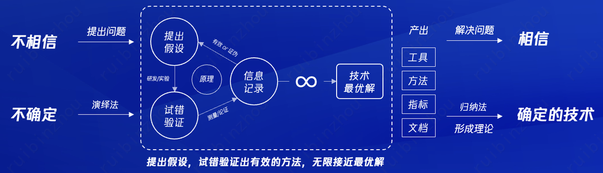
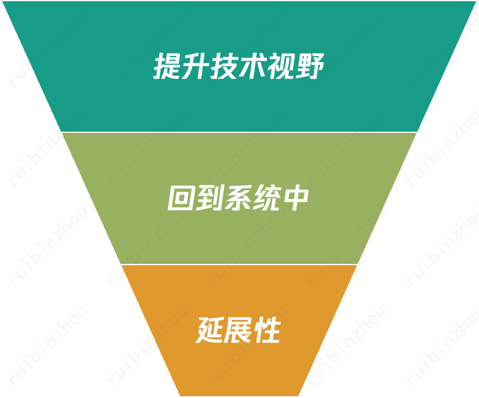
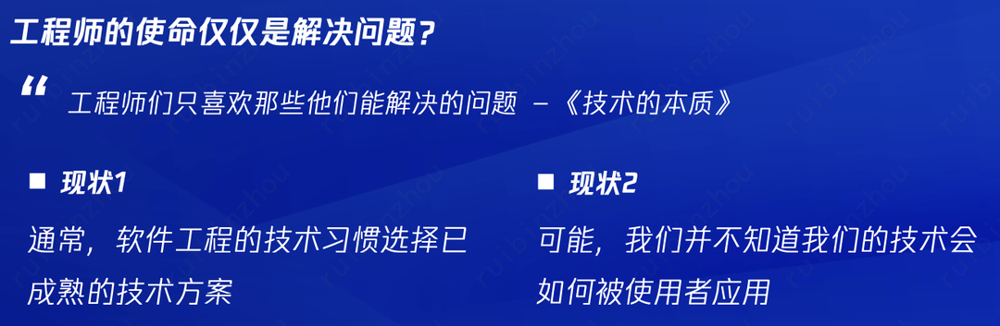
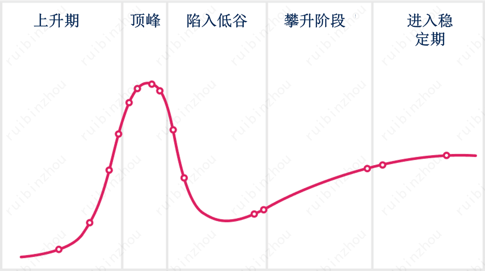
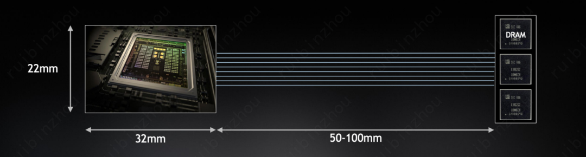
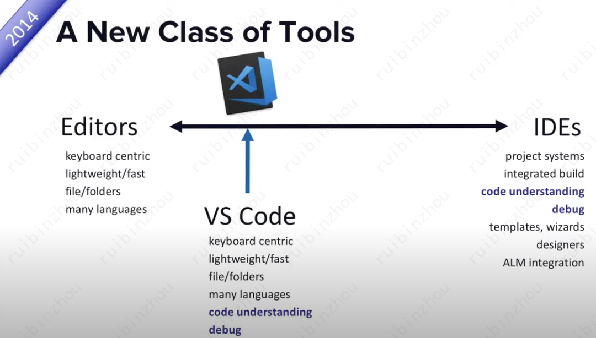
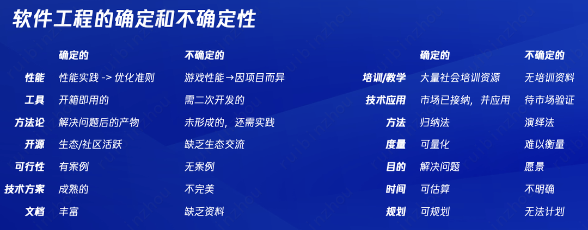
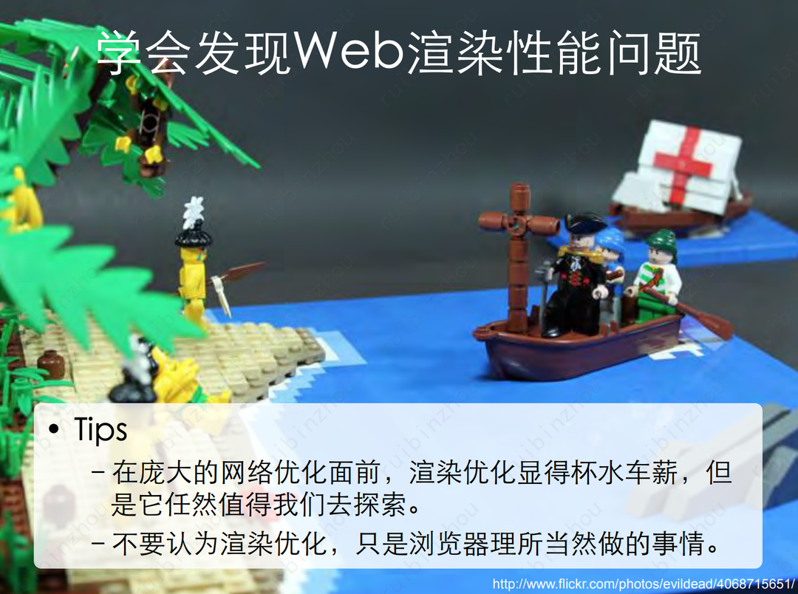

 
<!--BEGIN_DATA
{
    "create_date": "2024-10-18 20:04", 
    "modify_date": "2024-10-18 20:04", 
    "is_top": "0", 
    "summary": "谈如何找到出成绩的方向-技术理解的层次", 
    "tags": "其它", 
    "file_name": "谈如何找到出成绩的方向-技术理解的层次.md"
}
END_DATA-->

#### <p>原文出处：<a href='https://km.woa.com/articles/show/595124' target='blank'>谈如何找到出成绩的方向-技术理解的层次</a></p>

## 序
  
近日，有位朋友（后面称呼 Z 同学）带着心中的困惑，约我进行了一次交流。他提出的疑问是，到达新业务上，以至于短期找不到出成绩的方向？

面对这个疑问，他思索了各种可能性，并列举了一些具体的问题。

_怎么找到团队（部门或公司）里面的难点，在技术上做出成绩？在核心点上投入精力，你是怎么做的？_

  1. _怎么发现第一个问题，最终带领同事解决，并 owner 一块事情？_

  2. _你认为，前端有哪些方向可以在深度上做深？_

  3. _开源是不是一个好的选择？怎么通过开源做出成绩？_

  4. _当有很多个选择时，是不是应该放弃一些东西？_

  5. _技术晋升，怎么去寻找晋升点？要多久前做好规划？_


_您曾经提过：“从一进公司，我就去琢磨公司不同职级的岗位标准，给自己定了更高一阶的目标，看看距离目标还有哪些短板。” 您是如何找距离的，是怎么去寻找机会达成的？_

首先，我非常感谢 Z 同学，为了这次的交流，他做了充分的准备，甚至查阅了我在16年前的观点。他的提问，让我意识到这并非个案，从过去的琐碎思考中，我打算进行一次系统梳理。初衷也很简单，一次访谈能帮助一个人，写文章则能帮助到更多的人，便有了这次执笔。

诚然，我并无意一一回答上述问题，因我们正在经历一个瞬息万变的时代。过去的方法，并不代表一定适用于现在。问题不是为了答案才设计的。

Z 同学的问题具有典型性。我自己亦花时间不断思考，作为技术人，我们为何编程？我们希望，如何通过技术去改变世界？为何，在技术这条路上，会遇到如此多的困难？何为技术？我之所思，希望能从更底层的技术价值去探讨，技术人应该坚持的是什么？

探讨的问题，无关个人成长话题，寻找问题出现的原因，分享个人的思考框架。既然仅代表我个人观点，以下内容自然也与任何个人或团队无关。内容也不仅限于描述前端技术现状，包括我观察到的现象种种。

在技术领域工作近 20 余年，从独立开发者到技术专家，管过上百人的团队。有过高光时刻，也有过无数失败尝试。在复盘过往的过程中，只缘身在此山中，总无法看见全貌。于是我开始选择，站在局外观察与思考。

如果您抱着寻求答案的想法进行阅读，请容许我啰嗦一句，以下内容并不会直接告诉大家标准答案。本文无法开出灵丹妙药的方子，为了保护您宝贵的时间，可以关闭页面。

其次，我从不认为我观点足够全面，文中也包含一点点我的个人情绪。我认为，如果不带任何个人情绪的创作，会是空洞的。所以，也请读者能够结合自身情况来理解，去其糟粕，取其精华。我从价值层面，技术层面，行动层面给到一个全面的理解。所以，这三部分内容，读者也可以根据自己感兴趣部分去跳读。  

## 1. 如何短期找到出成绩的方向?  

成绩与方向，哪一个更重要？

回想当时线上与 Z 同学的交流，他问我 “如何短期找到出成绩方向”。我意识到，这可能不是他内心真正的困惑。于是我反问，**“成绩与方向，对你来说，到底哪一个更重要？”** 这个反问让他陷入了思考，一度不知如何作答。

过了一会儿，他告诉我，因工作已有较长时间了，他希望能做出一些令自己认可的事情。拆解一下关键字 “短期，成绩，方向”，组合的意思就是，即要在短时间内获得他人认可，又想要做出一些符合自己价值观的事情。实际上，人与人的价值观是存在差异的，节奏也不一样。包括这篇文章所写，也并不指望大家都能认同，世界存异，方见精彩。从时间维度看，“方向” （或者说是大目标）是一个较长期的概念，需要3 年、5 年甚至更长的时间。好比，最精明的企业家都难以预测准确的市场时机。就个人而言，心之所向是你自己认为有价值的事情，你想做的事情。可被量化的目标成绩，则是一个短期行为。你想做的事情，如果能与团队目标能达成一致，那是共赢。因为晋升最快的方法是，实现团队目标，去帮助别人实现梦想。当有一天，你发现内心认可的价值观，长时间未能匹配团队目标，那么请做好的准备，别去做为取得成绩而令自己遗憾的事。在今年的毕业生提问中， “如何将个人职业发展目标与组织业务目标结合？” 我的回答是，可遇不可求。如果你遇到了，那么恭喜你，建议你跳过这个章节，直接去看技术理解层次部分。有机会把兴趣变成工作，是一件很幸运的事情，且珍惜。现状是，多数人并不清楚自己想要什么，总期望有人来告诉你。这个观点，并不是我凭空想象。我结合多年毕业生面试状况，以及查阅社会调研数据得来的。感兴趣的朋友可以阅读一下《金榜题名之后：大学生出路分化之迷》，里面也有相同的结论。解决组织僵化问题，最有效的办法就是引入新鲜血液。至于血型是否相符，很难有科学的办法判断，唯有新陈代谢。接下来，我会进一步展开谈谈，方向与目标的分歧如何产生；抓住方向为何会如此困难。  

### 1.1 方向与目标的不同 - 个人与组织价值观分歧是如何产生的

**目标既是指南针，同时也是枷锁**

成绩，在我们习惯心智模式中，需要大量外界认可与物质来证明的。对目标结果量化后的一次排序。经过长时间的传统教育惯性，我们习惯依赖排名和成绩来证明自己存在。好好学习，取得卓越的成绩。但每一个人的成就，并不能通过短期成绩来证明。没人会在意你过去做到了什么，大家只想知道你未来能做成什么。

方向，是我们从未到达过的地方，你特别想成为… 或者**想做** … 的事情，你自己的价值观认同的事情。我们或许可以在短期找到方向，并不意味马上能取得相应的成绩。这个过程中，成绩只是这个探索过程中的一个锚点，不代表全部。就像做产品一样，数据只是产品生命周期中的一次记录罢了，你可以做任何事情去影响数据的高低。举个简单的例子，作为上市公司，评价公司好坏的，并不是当前取得了什么成绩，而是能给未来创造什么价值，且令人相信。对于方向的困惑上，个人与组织并无不同。


```
很久以前，我在做独立开发者时，

我内心只想着做一个博客系统，开源给更多人使用。

在这个过程中，通过自学各种开发语言，每天给程序添砖加瓦，

只为让这个孩子长成自己心中的样子。

我不知疲惫，每天熬夜写代码，直到实在困得撑不下去。

没有考虑过任何目标，从未考虑过我要比谁做得更好。

  

在过程中，意外收获了很多朋友的帮忙；

未曾想过，还能改变了不少朋友的择业方向；

我能做的，就是保持更新，坚持给大家迭代一个好用的系统，

打磨产品体验，死磕细节。  

  

如果按照现在的标准来看，这件事情并不算有什么成绩。

因为我并没有做出同期 discuz 那样成功商业化的商品。

我并不会感到遗憾，凭我一己之力，做成了一小开发者生态。

  

虽然没能成功把产品卖给腾讯，腾讯却给我了加入的机会。
```

#### **外在和内在评价系统**

每个人心中都具备外在和内在评价系统。外在评价，通常叫建议与期待；内在评价，一种感觉，来自你内心的声音，没有衡量尺度。可以试着反问自己，与自己对话，通过正念是一种觉知内在评价的方法。

  1. **外在评价**，由他人评判目标是否达成，通过量化的手段，排序  

  2. **自我评估**，如果完成某个短期行为，是否可以缩短我们到达方向的距离

焦虑来自，过于在意外在评价，过于担心未来还没发生的事情。

我在公司的行家平台上，遇到过不少小伙伴选择在离开公司前几个星期来找我交流，只因发现工作结果不达个人预期。很长时间内，我对于“不达个人预期”很困惑。作为管理者时，我们明明花了很多心思给建议，给资源，给予充分授权，帮助员工成长，结果却不尽如人意。后来慢慢发现，出现这样的情况，是因个人开始察觉，外在评价系统与自我评估系统出现了价值观分歧。

在团队管理上，作为管理者时，为何我们需要有绩效面谈。我认为，主要的目的是，为了寻找团队目标与个人方向的结合点。恕我直言，要做好这事情真的不容易。随着团队规模增长，我们很难知道每个人心中的方向。更何况当事人自己也未必知道。对每一位管理者来说，都是一项挑战巨大的工作。于是，我们选择管理简化，求助社会主流价值观帮助，即 “努力工作就会有好回报”。当然，这句话放在当今社会，实则是一句鸡汤，余华老师也提过类似的观点。能进入大厂的同学，我想没有是不努力的。所以，我认为我从不是一个好的管理者，从未尽到团队管理最应尽之责任。  

#### **组织管理的前提条件**

目标管理法，是我们工作中的常见的管理方法，包括大家熟知的 KPI/OKR 等方法。在彼得·德鲁克大师《管理的实践》一书中，“目标管理与自我控制” 是作为一个完整标题出现。目标管理固然重要，但需要前提条件，自我控制是一个重要但笼统的前提条件，这个词很容易被断章取义。然则，忽略前提条件，直接使用目标管理工具是最容易做的事情，可以成为管理者没干系的理由。人类作为从类人猿类进化而来，我们似乎也该是一个会做计划的猴子。我们宁可花费大量时间去做组织目标规划，而很少探讨个人与组织的价值共识。

哪些前提条件是有效的，我们平时很少讨论。更多时候，我们常听见 “我只要的是结果” 等单向输入。很少探究，如何让 OKR 更具有意义的底层逻辑。现代管理哲学中，目标管理不再要求员工必须唯命是从。对管理者价值的逆向评价逻辑是，**如果去掉权力和资源的外衣，还有多少人愿意跟着你。**

中国互联网引进西方的管理方法时间不长，我们不仅需要客观理解西方人文因素，根据东方人文因素不断修正管理方式。否则，我们极有可能在一个底层系统上运行了一套不兼容的诊断工具。不幸的是，就现状而言，选择管理员工的恐惧，是容易在短时间达成目的的管理手段。虽然在我看来，这并不高明。结果是，从众多现象中，我们终发现一个事实，即使组织目标执行再到位，也不意味着就是个人想要达到的方向，而分歧产生。我们的组织在管理认知和方法上，还有很大的改进空间。令人高兴的是，公司开始鼓励有想法的个体，我认为是好的开始。**未来组织最重要的挑战是，如何充分发挥员工的创造力。**公司也意识到，有创造力的人才，被过去各种套路框住。好的管理文化前提条件，开始进行探讨和验证。例如，状态好，或是前提条件之一。只是状态好，也分愿意上场的和不愿意上场的。这值得作为管理者的我们深入思考。有创造力的员工，还具备另一种特质，特立而独行。

### 1.2 为什么抓住方向那么困难 - 从机会主义到长期主义的变化

三个石匠的故事。德鲁克在他的著作《管理的实践》中讲过这个故事。  
  
```
第一个石匠说：“我在养家糊口”，

第二个石匠说：“我在做全国最好的石匠活”，

第三个_石匠_说：“我在建造一座大教堂”。
```

从个人成就感角度，作为技术人，我们心中希望能通过技术建造出一座大教堂。现状是，大多数人做技术是为了生计，他们认为自己做不到而放弃去建造一座教堂。在技术方向探索路上存在摇摆，我们并不孤单，很多时候，我们也是大多数中的一分子。埋怨环境是没用的，假如要建造心中的教堂，我们需要更多时间和保持好奇心地学习，远不止完成代码那么简单。当然，我也并不是去比较技术谋生有什么不妥，技术谋生的需求同样值得我们尊重。我们在不同人生阶段，有不同的需求，按照马斯洛需求模型，生计是需要优先被满足。在一个变化太快的环境中，抓住机会的时间窗口的确越来越少。在过去，我们习惯的思维模式是看准机会，抓准机会，方法就是砸资源。百团大战中，砸资源活下来就是胜者。这个逻辑和我们父辈靠努力工作，本质逻辑没变化，就是想办法活下来。疫情后，中国技术发展和社会需求发生了转变，应用技术遥遥领先，用户需求个性化日趋明显。在互联网启蒙阶段，是巨量 App 的天下，到了存量互联网阶段，中心化需求开始变弱。资源投入的结果永远是趋向中心化的。在未来，AI 会不会有一天杀死所有 App 还不知道呢。毕竟，App 主要的作用就是提供信息和服务。随着信息接触的门槛持续降低，我们能看到大量新技术的机会和方向从我们身边逃走。到了存量时代，继续用机会主义看问题，如果屡屡抓不住机会。我们开始会怀疑，自己能力不足，自己视野不够。更多的自责和自我攻击，会使得我们成为受害者，质疑外界环境的不公（组织，人事，机会）。“为什么这个机会不是我的？明明我也有同样的能力。” 有时候，我在想，如果回到过去，当我们看不到那么多信息，是不是反而更加容易专注呢？短期找出成绩的方向，是纠结在既要又要的矛盾中。这样的困惑，不仅存在于个人，同样存在于组织。我们极易看到别人正在做什么事情，做成了什么事情。于是，我们会下意识快速判断，我们具备做出来的能力，重复的工作产生。仅是在产品与技术上的复刻通常都是没有灵魂的，往往会演变成资源上的浪费，内容、设计、服务成了新的探索方向。

对于机会的判断，我个人有一个简单的判断逻辑，如果很容易从别人经历中看到的机会，极大可能不是你该做的。大量浮出水面的新技术，你可曾想过，这些技术演进了多长时间，他们遇到过哪些困难与挑战？你能看到的，只是冰山一角。随着市场红利摸到天花板，产品与技术也需从机会主义，演变成长期价值主义。

**💡 既然抓住方向的机会越来越有限，那么唯一能做的就是去创造机会。**


  * “微信是一个生活方式”，这样的方向，在过去我们无法找到任何有效的方法指导，至今已成为大家无法离开的生活方式。 

  * 小游戏团队，我们在做 Unity 游戏适配技术时，被_背刺_过，被嘲讽过，从未被看好。我们在一起，只是相信可以一起做一些不一样的事情而已，一干就是 5 年。

  * 微信刷掌支付，从 0 到 1，在技术上取得突破，发明创造专利无数，你可曾知道这是一个经历 5 年多的项目。


假如，你必须给出一个时间期限，你如何判断抓住方向，需要做哪些事情？目标，可以在时间范围内不断精确计算；方向，是个人/团队想开创的未来，需要在行进过程中不断试错和修正，唯有相信与坚持。



这一章作为下一章的前提条件，我认为有一些真相还是有必要个人与组织能达成共识，蒙在鼓里不是什么好事。我花了很长的篇幅来讲目标与方向的不同。一来，回应公司对长期价值的个人理解；二来，我认为每个人都应该理清个人价值观和组织目标之间的关系。只有这样才有可能帮助诸位达成共赢，明确优先级。就个人价值观和组织目标能否达成一致，我想还是应该多些坦诚布公的探讨，多听而非多讲，解决员工的问题，自控，别讲什么狗屁职场道理。回到 Z 同学的问题上，如果已经开始感知到内心的需求，想寻找某种方向或者想创造点什么。接下来的内容里，我将进一步去引导，如何去思考技术方向上的问题。我分成技术理解的层次模型，以及如何开始这两个话题。

## 2. 技术理解的层次 - 把复杂问题简单化

**拥有技术视野足够么？我们该如何思考，如何开始行动？**

在探索技术方向的建议上，以鄙人的能力并不能给诸位明确的答案。我选择继续分享我的个人见解，试着引导读者进行思考。不断询问自己，我们准备好去做出选择了么？

**技术专家并不能准确预期什么技术方向未来会流行，就像金融专家也无法准确预测哪只股票涨幅一样。一切由市场接纳度所决定。**

当然，我是欢迎读者提出反对案例的，来挑战我的孤弱寡闻，到底哪位专家对于新技术的应用做出了准确的预判。从我们的传统智慧中，谋事在人，成事在天。无论，你是技术新手，高级工程师，亦或是技术专家，能做的也只是专注当下的工作，给未来多一些准备，能提升中签概率。少一点预测，避免误人子弟。例如，我本人从不看《什么接下来一年内 xxx 技术会成为主流》类似的文章。我自己对技术的理解，经历过三次认知变化，我很乐意分享对我对技术的思考方式。你所关心的技术领域如何发展，还望读者根据自己的实际项目情况以及理解，保持独立思考。

我的个人总结，三次技术理解的认知变化顺序是，1. 提升技术视野 2. 回到系统中思考 3. 技术的延展性。三层变化，我的理解是倒三角形结构。



我们听得最多的提问是，职业发展中到底是应该先提升技术广度，还是深度呢？在我看来，并无先后顺序，准确来说最好是并行演进。延展性问题，是一个关乎技术应用场景问题。为何我认为延展性在三角形结构的底层，因为我们通过技术解决复杂的问题，交付出去的方案应该是简单的。别在用户面前，讲太多你遇到的困难和努力。  

### **2.1 第一层：提升技术视野 - 输入与修正**

这个词早已是陈词滥调，且无论怎么使用，听起来总没错。我们看到有人说某某技术视野很好，某某成绩不理想是因为技术视野不好。似乎一切成功与不成功都能与技术视野相关。不过，接下来，我打算分享一些，我对技术视野不一样的理解。作为技术人，我们理应提升技术视野，需要看到更多新的技术，看到不同的技术间的组合。从信息角度，技术视野只是信息输入的过程。一个人技术视野不够，很可能和你太忙，或者选择性忽略信息有关。保持信息输入，形成对信息分析和加工的习惯，会随着工作年限，会成为你的一个宝藏。新同学通常不如前辈们技术视野好，只是大家在时间积累和分配上存在不同，大家接触到的信息的量规模有差异。新人忙着完成需求，大量时间在做输出，输入的时间自然会变少。所以我常和毕业生说，你进来工作的投两年是主要还是提升研发效率为主，这样可以为你争取到更多输入的时间。当然，你也可以采用不同的方法，例如比别人更多的时间，形成习惯，保证每天都有信息输入和理解。简而言之，技术视野这件事情是和你投入时间成正比的。拥有技术视野，到底有什么好处？我认为是用来做想法修正的。信息不等于知识，信息仅用来辅助决策。打个比方，某个技术方案，到底有多大的可行性，实现成本如何，以及对周遭的系统影响会是什么。当你拥有的技术视野，都会给你一个快速判断的能力，逐渐形成《思考，快与慢》书中提到的快思考系统现象。专家相对新同学而言，在快速判断能力上强一些。我们也知道快思考系统容易出现主观判断偏差，我们很容易进入对现实世界的假想和误判。最近公司内部对程序员进行了一次IMBT调研，相信大家也都看到了。程序员 I 人较多，IN 是**内向**而**富有想象力**的一群人。你想做的事情是否真实存在需求，亦或者是一厢情愿？我会发现很多技术同学自己无法分辨清楚。我会认为提升技术视野，应该不限于技术，也需要输入大量反对的声音，回到真实世界中看看，这样才能更好地起到修正作用。既然技术视野是输入手段，逐渐培养信息输入的习惯吧。多去收集对应的信息，资料，逛社区，参加技术峰会，听听技术牛人唠叨。时间长了，你就会对你感兴趣的技术领域产生很多想法。而这些想法，对具体工作是能带来帮助的。对于信息输入，现在我们能获取信息的方式已经很多了。接下来，你要做的是选择你感兴趣的技术课题，聚焦。其次，抱着怀疑的态度去对待你接收到的各种信息。包括，你现在阅读到的这篇文章，不见得我输出的文字都能成为某种知识。把信息转换成知识是需要进一步学习的，否则全是碎片化信息，只是数据。你需要，大量阅读和技术实践，对信息进行知识化处理，形成模型。（就写作与分享而言，也是一种实践手段）!

[](./image/20241018-2004-3.png)

当我们拥有技术视野输入的习惯后，可以帮助我们找到想做的技术方向了么？我的答案是，还不能。《技术的本质》一书中提到，技术的发展需要得到被广泛应用的机会。我认为技术视野范围内我们之所见的，只能用来修正我们的想法和辅助决策。至于，技术能否被应用，光靠技术视野是远远不够的。因为你能看到的，别人同样也能看到。在我刚入职腾讯时，我的导师经常告诫我，不能只是光写代码快，你要学会发现问题。发现问题的能力是一场修炼，随着信息的不断输入，对信息的不断进行知识模型化。我开始渐渐理解，**工程师不应该仅仅是解决问题，同时也需要具备看到问题的能力。**



假如有一天，你很兴奋地发现了某项新技术，总归要多一些自己思考。多一些逆向思考逻辑，这项技术那么长时间并没有被应用，原因是什么？成本？稳定性？兼容性？还是…？你需要考虑清楚，这项技术能用来做点什么不一样的事情，如何通过技术组合或者改良，创造出更好的解决方案。如果你始终没琢磨明白，那可能是你还没开始回到系统中看问题。  

### **2.2 第二层：回到系统中 - 探究本质**

这是我技术理解认知中的第二层，也是我喜欢进一步思考的一层。尽管本人对于底层技术和硬件技术才疏学浅，但难才有趣。况且，目前有好技术视野的人实在太多，你只需与不同技术领域的人交流，你总能收获满满，哪怕只是一杯咖啡的时间。

我会看到不少技术人，总归是有上进心的，看到别人能做的，认为自己也应亲自动手再做一个。其实，我还是建议把这个行为当作学习过程就好。我本人也有一个做事情的惯习，就是不喜欢扎堆热门，不喜欢重复。所谓热门技术，有两种可能性，1. 技术已成熟 2. 技术未成熟。



（Gartner新兴技术成熟度曲线）

当技术进入成熟期和稳定期，意味着进场的玩家变多。坏处是，你只需要重复前人总结的经验和理论，能技术创造的机会变少。显然，重复的工作，糊口饭是没问题的，也很确定，取决个人选择。确定和重复，会给行业带来什么，想必大家也能看到，技术会越来越卷。好处是，因为工具和技术方案成熟，我们可以快速满足生产需要，在这个阶段我们会看到更加成熟的产品诞生，为社会创造价值。

技术机会往往属于未成熟的早期阶段的技术，但是需要警惕的是热门不成熟技术，很多时候是火过了头，媒体和资本会渲染出现大量无用信息，他们的假想能力可一点儿也不差，特别能编故事，故事编多了，自己都信了。于是，我们会高估新技术短期的成绩，而低估新技术长期的价值。一旦你欢欣鼓舞地扎进去，很大概率会只剩下一地鸡毛。也许，这个世界上，是需要先撒上一地鸡毛后，才有机会留给后人出来收拾残局。这样的现象，你我见惯不怪了。然而成功概率最高的是，从一开始坚守到最后的玩家，而不是中途入场的玩家。
  
_但凡体验过 VR的朋友都会有一种感觉，这玩意并不能长时间使用。佩戴问题，眩晕问题，舒适度等等，还有很多技术问题并没有得到解决，而不少团队却开始盖大楼和构建生态了。_  

_直到 apple 推出 Vision Pro 后，行业玩家们发现地基深度跟不上，于是行业开始重新洗牌。_

这时候，我们更加需要逆向而行。当别人都往上层应用场景上畅想未来时，我们可以逆行往系统里去看看，能力，成本，创新性到底有没有筑起应用层的假设。

**💡 当你要盖一座高楼，可以反过来思考，把楼盖深需要怎么做？**

做了多年的前端技术，我发现技术的最优解，往往是最接近系统层面的解决方案是最有效的。前端技术发展初期，大家并不认为前端开发要涉及网络层面的优化工作，那是运维的工作，我们提需求就好。出于对技术的好奇心，我们开始寻找各种工具和监控方法，来监控用户最后一公里的性能。渐渐地沉淀了各种性能优化经验和理论，当你做得足够细致后，运维同学也会认为前端是一个非常靠谱的合作伙伴。_（做个小广告，如果想知道我对前端技术理解，可以看这一篇[前端技术是什么？](http://mp.weixin.qq.com/s?__biz=Mzg5NDcyODkyNw==&mid=2247483743&idx=1&sn=40888e301f9cc6d1454722bbea600c5c&chksm=c01a6eeff76de7f99a07d914f78abcd7e047112394c3a97ef88157fe4c965efad47db78c7652&scene=21#wechat_redirect)我们可以把技术分成应用层与系统层，前端，客户端，后端，都是属于前端应用层技术，我们通过网络这条通路，把所有技术都串在了一起。如果物理层是系统，那么微机中的芯片、存储、内存也属于应用层介质，需要物理电路将大家连接，这就是著名的冯·诺伊曼结构。所有应用计算背后，一定存在着某种系统层的支撑，存在着应用与系统间的协商与约定，直到物理层。回到系统中，绝非易事，对我们大部分做应用层的技术人来说都会存在跨技术栈的挑战。换个角度，计算机应用和系统的分层，本质也是对应着人类的分工，这意味着你需要了解其他人的工作。芯片是人造的，标准是人定的，编译器二进制也是有规范的，浏览器规范是大家通过 W3C 这个平台一起探讨的，系统中的每一层皆存在人为的参与的足迹。如果，我们仅知道我们当前工作的所使用工具和框架，那么我们和在工厂里熟练掌握螺丝型号的工人无异。只要是物理层外的技术问题，原则上都是可以被改善的。我们理应去深入系统，去怀疑各种系统中的不合理设计。例如：QUIC 协议诞生，是 Google 的工程师看到了 HTTP 在 RTT 上的优化不足，重新提出优化方案，实现 0-RTT。阻碍技术发展的，实则是人与人之间利益问题。在一定程度上，技术人通过代码开源找到了一种对技术可持续发展的解决方案。我们可以站在前辈肩膀上持续创新，去创造。作为技术委员，我们应该鼓励Oteam去创造，而不是重复，重复仅限于必要的积累过程。对于褒奖，我持保留意见，因为一个项目获得嘉奖，也可能意味着结束。  

#### **GPU 和 CPU 为何在架构上会有所不同？ **

目前，随着手机，AI，图形技术的发展，摩尔定律的逐渐失效，大家开始对冯·诺伊曼计算结构提出了挑战。GPU 的诞生就是其中一个很有趣的案例。对于芯片设计难度而言，我们面对的系统问题本质是物理问题。物理世界，并不是人造的，不存在正确与否，我们所知道的科学研究，只是在不断寻找一种解释，推翻前一种解释。当今物理世界，依然存在大量人类无法通过现有知识来解释的谜团。例如：量子力学，因为太随机，无任何规律，至今无法被人类所理解。但人类还是选择尝试通过量子力学来构建计算机。优秀的系统工程师懂得如何运用技术在物理边缘中试错。喜欢玩游戏的小伙伴，如果第一次买显卡，可能会看GPU的浮点运算性能到底有多快。然而，我们是否真正了解，对于大多数用户而言，影响图像性能的并不一定是浮点运算能力，而是内存带宽上。（老黄商业刀法精准不是没道理的，太懂技术了）

_**💡 **在物理规则中_

  * _光的传播速度是 300,000,000 M/S _

  * _计算的时钟频率是 3,000,000,000 Hz _

  * _硅材料的导电速度 60,000,000 M/S_

_计算机成像，需要经过磁盘到图形处理器的过程。_

_如果，我们计算的数据，通过光介质传输到内存中，自然是最理想的。_

_**光传输在 1 个计算时钟内，行程 100mm **_  

_但是现实是，我们都是通过硅材料来进行导电材质。_

_电流在 1 个计算时钟内，行程 20mm_



_芯片到内存的物理路径 82mm - 132mm 不等，电流速度比光慢 5 倍。_

研究这个课题，事因有技术同学告诉我，他的经验中，显卡的带宽也是发热的主要原因之一，有意思。

由于线路距离和电流速度，无法实现在 1 个计算时钟内存取内存数据，于是产生了数据传输的 **latency bound**。**讲人话，即使你带宽路再宽，计算能力再强，车速到了极限后，依然无法通过更多的车辆。**CPU的做法是对电流的速度和时钟频率进行调频，来弥补速度上差距。当然 CPU的架构设计，还可以通过计算优化，减少数据延迟问题。例如，由编译器对循环代码进行 loop unrolling拆解，来减少电流速度影响。但是一个线程对应一个计算任务的做法，还是无法满足目前图像计算的需求，更不用说 AI 大模型计算的需要了。

于是，GPU 的架构设计中，在接受物理系统的法则条件后，选择了新的方案。不再去花力气去解决延迟的问题，接受存在物理层带来的 latency bound。而采用更多的计算线程，完成图像计算任务。于是图像芯片独有的 Streaming Multiprocessors (SMs)设计带来了，图形性能的提升。**讲人话，既然车速提不上去了，多发一些班车吧，但要做好协同。**

即使是最底层的硬件层，迄今为止，还未到达技术的最优解，优秀的工程师们，还在不断根据人们的需求，不断调整当今计算机的架构，出现了 APU，NPU等更加特定领域的计算单元。Sony和微软，都开放了显卡直通存储的技术，就是为了减少不必要的数据路径开销。  

#### **永远保持好奇心 **

回到我们的文章主题，我只是打算用这个例子来告诉大家。当我们不断挖掘到系统层面的问题后，我们解决问题的思路会逐渐被打开，实验的方法也会变得越来越多。这样做，还有另外一个好处是，你所需的启动团队会变得更小。很多时候，技术真相就仅掌握在少数专业人手里，更多的是追随者。互联网组织规模，并不是组织大就是健壮的，在技术面前，越大的组织反而越脆弱。斗兽棋中，鼠可吃象。这样的案例，多得数不过来。最近某厂的事故，无需复述。组织越大，大家在应用层上的追逐自然就会越多，关注技术底层的人反而越少。我们在进行小游戏重度游戏性能研究上，时间花费最多的事情，不是在完成一项软件工程开发工作，而是在不断深挖，计算层和图形层的运作原理。我们很好奇，可以做什么改善性能。当今的硬件层，系统层对于小游戏，就如同 GPU 设计师遇到物理层约束一样。但是，我们可以通过对系统的研究，提出最佳实践，为开发者提供工具。对于人为设计的系统层，我认为我们还有机会去做一些技术工作尝试，例如，去设计全新的图形协议，让开发者和引擎可以接触到硬件层。只是这个工作或许还需要 2-3 年的时间周期，才有可能看到一点点变化。对回到系统层的理解，我想多一些补充。系统这个词范围很广，可以是端计算的系统，也可以是软件工程系统，亦可以组织运作的大系统。我们需要学会根据不同的场景，切分不同的系统范围。例如，微信支付的精益研发体系，这样的庞大软件工程项目，也是一种系统。我由衷佩服微信支付敢于挑战复杂系统自动化的勇气。在微信小游戏团队，我们切入点是看端计算系统，从运行层到图形层，我们做好底层，通过技术的延展性，上层应用自然会生长出更多更好的玩家。从提升技术视野，再回到系统中。对技术人而言，才算是一次完整探索技术真相的过程。下一个问题，我想探讨的事情是关于技术延展性。  

### **2.3 第三层：技术延展性 - 应用与链接生态**

一切的技术都是人的延伸

马歇尔·麦克卢汉在《理解媒介》

技术需要被应用，这个观点相信大家很容易理解。然而，仅仅是探讨技术应用，我总觉得缺了一点什么，不够完整。

技术的延展性，是我最近开始思考的，也许是受到《理解媒介》这本书的观点影响。任何媒介或技术的“讯息”，就是由它引入人类事务的尺度变化、速度变化和模式变化。媒介技术，芯片技术，互联网技术的发展加快了信息的传递速度，连接了人与人，使得人类的分工变得多样化，信息媒介平台也变得多样化。

如今，我们无法通过单一App或者工具，完成所有的事情。设计、消费、生产都需要大量不同的工具来完成。意味着，在软件工程上，我们不可能设计出一个 all in one 的工具或者 app。当然，你可以说微信是一个 all in one 的工具。其实微信本身，以我对客户端设计理念的理解，也并不是 all in one 设计。微信只提供能力，开放，让更多开发者可以用好微信生态。而且微信也只覆盖了生活场景和信息通讯场景，并不包括生产场景。媒介上的内容与创意，并不能仅仅靠单一企业的员工就能生产出满足大部分人的需求，那就需要借助外界开发者。很简单，让用户产生消费的，并不是平台或者硬件本身，而是平台或者硬件媒介上的内容 -商品即内容。我们会为了一个内容，去购买一台 PS5，只因内容在平台上独占。从平台角度，希望内容能生于平台。人为什么会对内容产生需求，从游戏角度解释，我们对游戏中的角色产生共情、共鸣。角色共情是一个很重要的发现，也是一个成功 IP 的关键，是商业奇迹，产品和技术都是为了塑造角色服务的。人就是有那么奇怪的情感链接需要。深究其因，角色底层塑造的媒介，其实是文字。如果想做好一款打动人的游戏，我发现关键不在产品和技术的高维的实现，而是如何先通过文字描绘出来你心中所想，故事化可以让游戏作品产生持久的生命力。AIGC 可以帮助游戏设计师进行自然语言的可视化工作。内容生产则需要生产工具，生产工具本身同样无法光靠一家企业的资源做到all in one。编程工具，游戏引擎工具更是如此。VSCode，大家都非常喜欢用。VSCode和很多商业IDE不一样，它非常清楚自己的设计边界，哪些是应该自己做的，哪些是应该交给生态去做的。作为一款轻量级 IDE，从产品角度，它希望能保证自己能和 editor 一样轻量，于是只专注了三件事情 编辑器 + 代码理解 + 调试功能。其他事情交给生态去做。



https://www.youtube.com/watch?v=Vs3AGfeuNKU

没人会拒绝启动快，效率高的工具软件。比起启动时间需要一壶茶时间的商用高度集成 IDE，功能虽然强大，但是大部分功能，只是为少数开发者设计，却需要大多数开发者忍受启动和效率问题。同样 VSCode 非常聪明地选择了前端语言和NPM 管理工具，借助富有创造力的前端开发者生态。开发者的集思广益，使它成为了当今流行的编辑器工具。微软非常清楚 VSCode 对他们商业上的意义。因为VSCode工具的诞生，帮助微软更好地连接了开发者，同时收购了 GitHub，起到了更好的延展性作用。开发者需要 VSCode 和 GitHub，自然就产生了更大的平台与开发者之间粘性，产生巨大的商业潜力。VSCode优秀的延展性设计，也为开发者提供了更多跨平台的创作机会。同样也回应了《理解媒介》书中的观点，媒介以自己的用户为内容。我与 Unity 官方交流时，我曾问过他们一个问题，“你们认为Unity 最具价值的地方是什么？” 他们告诉我是编辑器，以及背后的插件生态。完全打破我对性能的一贯执念。奇怪的是，在中国互联网从未真正重视过编辑器，也许是我们过于在应用层视角看问题了。

从这些案例中，我们可以知道什么？首先，我们需要非常清楚你做出的软件或者硬件产品到底是为了服务什么样的用户群体。其次，我们能给他们提供什么再创造的机会。我们不妨自己退一步，让更多开发者能进一步参与，让技术发挥延展性的积极作用。

少即是多，方能接近本质  

## 3. 如何开始行动 - 万事开头难

**做难而正确的事情 **

这是一个众人皆知的道理，但是我们为何不敢行动？很多时候，并不是我们能力不行。现代脑医学研究表明，人类作为有机体，人脑可以随着年龄增长。智力面前，人人平等（脑细胞，不会有巨大差异）。个人能力，只是外在条件差异，每个人掌握的时间与资源不同。成年人做事情，我们会先算计得失，得失让我们不去采取行动。《埃隆·马斯克传》中写到，他的做事原则是，以使命为先导，过后再想办法填补财务方面空缺。虽然这样的做法，我持保留意见，我们也不是马斯克，敢在赌桌上 all in 并且还赢牌，还是极少数。作为国人，我们有牵挂是人之常情。但从书中，我们可以看到一个行动力狂人，是如何通过愿景和行动力影响全世界的。如果觉得自己总行动不起来的，可以看看这本书。  

### **3.1 为何迟迟不采取行动**

难而正确的事情，正确与否，非常不易被看到。和荒野徒步一样，难走的路，通常人烟稀少。因为很多聪明人，选择了康庄大道。一旦你能在荒野中发现路人，那么基本上都是顶级专业的。经常评价我要看清楚的人，我必须承认，我是常人，看不清楚什么是长期的正确。做技术也一样，某个技术的难度一旦超出我们目前的技术范围，需要的时间成本，人力成本，这些可以称为“难”。请你思考，这种困难中，有多少是你真正认为的困难，有多少是因心中的恐惧？心中恐惧是指，害怕花了时间，却达不到目的，因而失去更多。所以，聪明人都会喜欢去先算计得失，迟迟不做出行动，合乎常理。我在别人眼里是个斜杠前端，表面原因是我不会 Vue，也不会用 React 来完成具体的需求。只是我喜欢选择一些我从未踏足的领域，去挑战一些不可能的事情罢了。只要做出选择，一定意味着取舍，只求无愧于心。我最喜欢的两句广告语是，苹果公司的 “Think Different” 和耐克的 “Just do it”。这两句话，阅读起来非常简单，行动起来会遇到很多你想不到的挑战。首先，“Think Different” ，过去的经验往往会让我们很难做出行动决策，我们的惯性思维，舒适圈都会告诉你前方有雷，只因存在很多不确定性。快思考系统负责避开危险。在今年，一次公开的技术分享上，我提到过一个关于软件工程确定性与不确定性的对比框架。如果你想要挑战的技术也是属于不确定的，那就会落入困难模式，前方一片荒野，甚至没有任何清晰的道路。



不确定性，这个概念应该不陌生了。对于不确定和不对称性，推荐阅读塔勒布的不确定系列，其中《反脆弱》我认为尤其精彩。“Just do it” 行动起来，有三个基本条件，勇气、承担与坚持。正确对待个人得失。长期有价值的事情，大概率都是属于困难模式，我们别无选择，也不要心存侥幸短期出成绩。回应开篇，询问自己，你准备好去做出选择了么？当你准备好开始行动，会有人给你建议。而不是先听别人的建议，再决策要不要行动。如果有兴趣继续探讨方向决策的话题，可以扩展查阅柏拉图的麦穗故事，自行品味。  

### **3.2 开始行动的方法**

伟大不能被计划，对目标的质疑

— 《为什么伟大不能被计划》肯尼斯·斯坦利、乔尔·雷曼

跟着好奇心一步一步走，才能走出正确路径。刚开始行动，并不意味着你需要马上要付出代码实现。以前，我在管理团队的时候，我会经常告诉大家，不要接到需求就马上写代码，先从写文档开始，多问为什么这样做，思考有没有不一样的方案。开始行动，不限于，研究分析，信息完善，技术实验等等，这一系列行动会帮助不断完善你的想法。程序员不是生产装配车间工人，你有质疑和思考的权利。  

#### **微行动**

我们常听说微服务，微前端。而开始行动，不妨采用「微行动」的方法，把你想做的事情拆解到每天，只做一点，颗粒度小且你每天都可以完成。一来不会失败，二来会增加信心。请记住，当我们有一个很想做的方向时，挡住我们的其实是庞大的目标计划。庞大计划这件事情，也是公司组织变大之后留下的顽疾。我们喜欢把故事演绎得很大，优秀的产品和技术，都是经过长时间持续探索积累而成。「微行动」要求我们能够对每天的信息做出重要程度，识别，学会拒绝，不断调整行动。「微行动」的想法，是我了解到《微习惯》这本书后，稍做了调整。有兴趣的读者也自行了解一下。正如，大家看到的这篇文章，是我采用「微行动」的方法，每天花一点点时间去做，也不要求自己马上完成。只要每天完成一点，积少成多而成。刚进入公司，我给自己安排了一项工作，对 Qzone 的代码进行一次重构，时间历经 1 年整。在完成日常需求后，每天晚上花时间写一点点而成。最终实现了性能优化，以及代码扩展性的设计。现在总结起来，我也是采用「微行动」的办法。

**💡 千里之行，始于足下**

#### **警惕完美主义**

据我观察，工程师们普遍存在完美主义情结，且很害怕别人评价自己做出来的东西是垃圾。甚至，如果没有达到内心的完美评估，并不愿意和大家分享成果。这样做可能会让我们错过许多技术展示和交流的机会。我在行家平台上，发现过不少这样的案例。

其实，我们只需要明白一件事情。技术和想法，都是需要时间不断演进和修正的。如果我们因为心中的完美，不敢去面对和接受挑战。那么我们可能就会陷入更深的假设当中，不好意思与人交流。  

_前段时间，我的好友大猫通过微信，给我发来我曾经的讲稿《16毫秒的优化》。_  

_这是 2013年，我在O'Reilly Velocity China上的一次技术分享主题。回想这次主题的分享过程，那时我并没有完整的技术实践储备。 前端渲染要做到16ms，源自自己的一个设想。我设想，能不能将GPU应用于网页的渲染性能？_



_为了这个假设，我去进行了各种技术调研，__而最终的分享材料，只是我的调研和推理的产物。_

如果当时，我心中有一个完美技术的期待，我应该不会去做这场分享。而我当时选择了与大家交流，提供一种技术思路。令我没想到的是，因为那一次的分享，令不少朋友选择加入前端开发领域。

**完美的技术，只能是我们无限接近的方向。**试着追问一下，如果你把技术做完美了，那么接下来，你的下一个追求是什么？

### **3.3 关于领导力**

如果你想做的事情，需要一个团队来完成。对于项目技术 owner 或者 TechLeader 提出了更高的要求，学会鼓励与包容。参与你想法的每一位同学，会默认先考虑能否满足个人晋升要求。这和我之前所提到的，目标和方向现实中一定存在矛盾。正确的事情往往不见得能马上给予回报与认可，大家都看不清楚。你能做的事情，就是给大家提供创造环境。必要的时候，需要扛住一切质疑，确保团队在最困难的时候能继续前行。我反思过我所有失败的尝试，其根本原因是自己最后选择了放弃。别浪费时间在说服大多数人理解这件事情上。一旦你内心有想做的事情，那么你永远是思考最深远的那个人，你的团队会选择相信你，也是因为你的洞见。比尔·盖兹在 93 年一档综艺节目上，向主持人解释什么是互联网。他说，互联网可以随时让你听到你想要听到的广播。主持人问，那么收音机干什么去？...而我们常常浪费时间在解释这件事情上，这是没必要的。一旦事情做出来，会发生改变，自然就会有更多人选择相信。在事情没成之前，请保持你的影响力在小团队范围内就好。与其纠结人人理解，还不如花时间去寻找志同道合的伙伴。人的一生中，真正能够彼此合作的人太可遇不可求了。

未来，不是穷人的天下，

也不是富人的天下，

而是一群志同道合，

敢为人先，正直，正念，正能量人的天下。

## 4. 写在最后

也许，会有读者认为我所写的东西，不接地气。还不如告诉我们应该具体如何做，到底什么技术方向是靠谱的。因此，我没少受到老板们的挑战。主要原因是，我通过那么多年的观察与思考，我发现，所谓的技术标准和理论，能促进发展，终有一天也会约束发展，甚至会停止或被取代。抱着经验主义，理论框架去做事情，会使我们错过很多更加精彩的风景。有很多事情，值得我们去试一试。远大的“目标”越清晰，时间的浪费、信心的挫败就越严重，离成功与幸福也就越远。只因我们太依赖理性思维，太依赖计划行事。时间长了，我们就变成计划中的机器。何以为人？所谓接地气的建议，或许能满足大家晋升的短期需求，但是对整个公司的技术长线发展其实是不利的。做了多年技术评审工作，见过太多因答辩内容缺乏新鲜感和厚实感的材料，我们大多数技术优秀的同学，在答辩中屡屡碰壁，而不知所措。作为评委，我不知见过多少次，在技术发展进程，我们常在圈内不断循环和重复。很长时间内，我找不到任何解决的办法。对于技术循环的问题，我花了多年时间来思考，我可以做点什么，让更多技术创新可以在身边诞生。我写过代码，带过项目，定过规则，当过中级讲师，成为管理者，成为技术专家。但是身在其中，始终无法琢磨透。作为技术专家，我理应出一份力，但仅凭个人的力量是极其有限的（承认，是我个人能力不足）。“道不易，法简易，术常易”，所以我开始思考什么是最接近本质的。既然写代码的机会少了，打打嘴炮，动动笔杆，是我目前可以行动起来的有价值的事情。不试试看怎么知道呢？通过挖掘深层次的道与法。如能唤醒大家对技术追求和好奇心，以文章作为媒介，引发更多人思考，难道不比我写代码，成为大头兵更加价值？记得，我最后一次修订前端通道思路是，如何弱化 “术” 的标准，而去总结和归纳一些程序员基本要求，只因恰逢公司组织变革，错过了分享的机会。我会坚持，好的技术输出，不是通过多做项目，多干掉几个敌人，占资源位来达成的。项目本身的质量，开发者的评价，带来极致的产品体验才是最重要的。把时间当作朋友。  

**最后总结全文观点**

  1. 正确认识目标与方向，一个短期利益，一个长期价值

  2. 技术视野，远远不够，那只是信息输入与想法修正的过程

  3. 回到系统中思考，哪里只有专业，更少的信息喧嚣

  4. 技术应该如何被应用，持续思考技术的延展性

  5. 找到你不敢行动的原因，尝试通过「微行动」开始，专注当下

  6. 在管理方法和领导力的选择上，请先选择领导力

写这篇文章，存粹是「微行动」的尝试，将零碎的思考信息完成系统化的梳理。自我放弃了短消息娱乐后，空了更多时间进行阅读，写短文章不足以完成知识模型的构建。我的书友告诉我，阅读多了，总是该写点什么。全文内容与任何组织及目标无关，如有冒犯，请谅解。文章写了，是需要发表的。借茨威格所言，“我不要求别人同意我的想法。只要能把我的信念清清楚楚地表达出来，我就心满意足了”。如果能给到读者一些不同的思考角度，我认为我所花费的时间就已产生价值。  关于 Z 同学更加详细的问题解答，我不打算摘录到文章。也许过一段时间思考后，我们彼此也会出现不同的理解。再次感谢 Z 同学。🤝

如果大家有什么想交流的话题，或者你的想法，也欢迎与我私信，留言。

我很期待能吸收更多不同的想法，欢迎探讨。

以上是这篇文章的全部内容，令你失望的是本文没有任何带货内容，愿者自取。

（全文结束）作者的公众号，说不定会给你一点小惊喜
