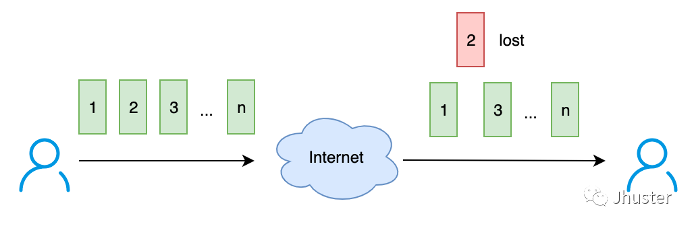
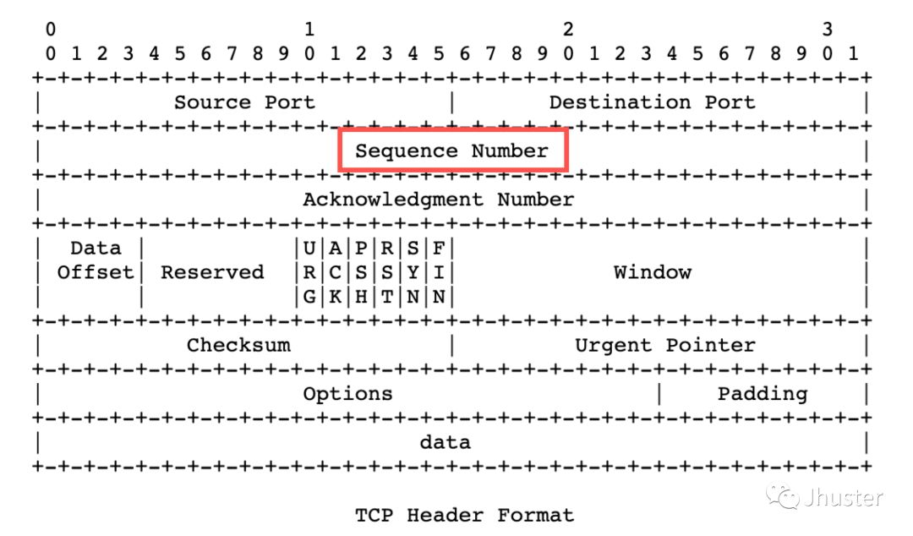
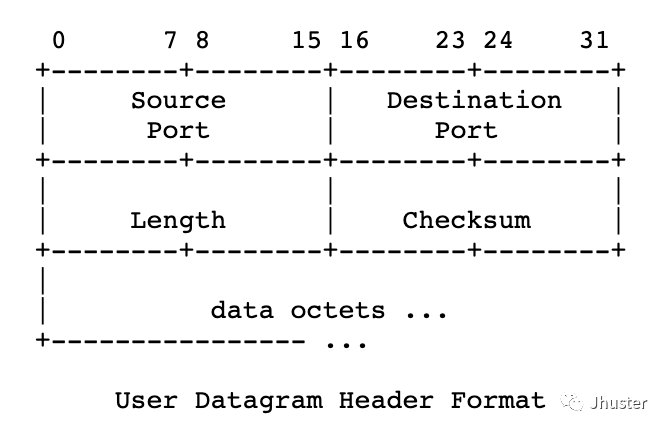
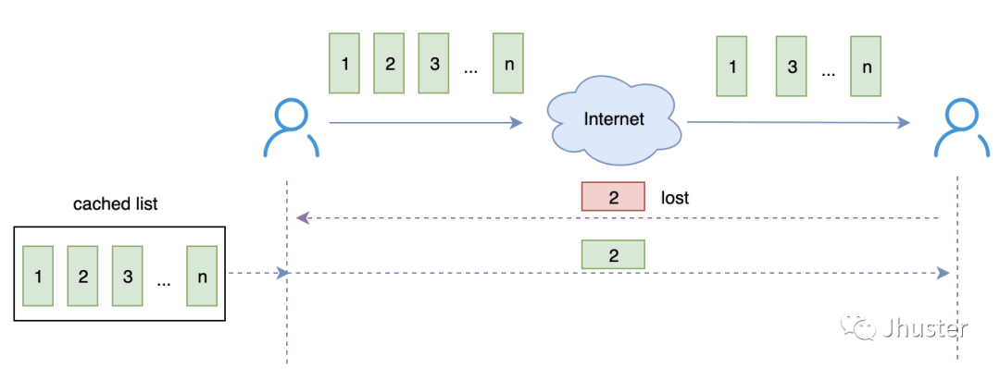
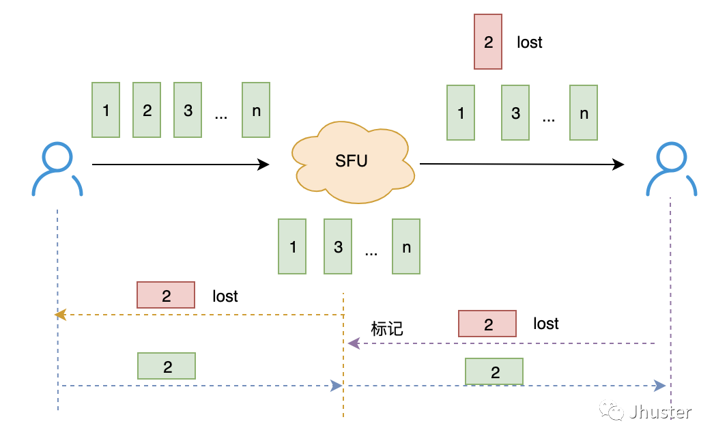
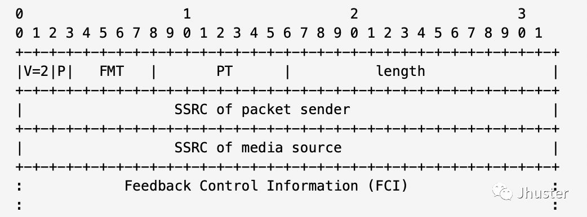
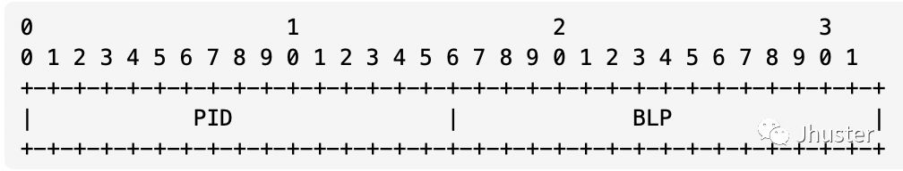
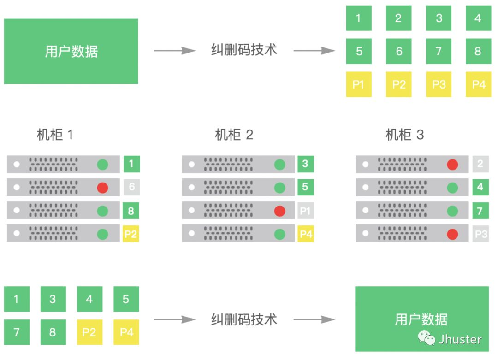
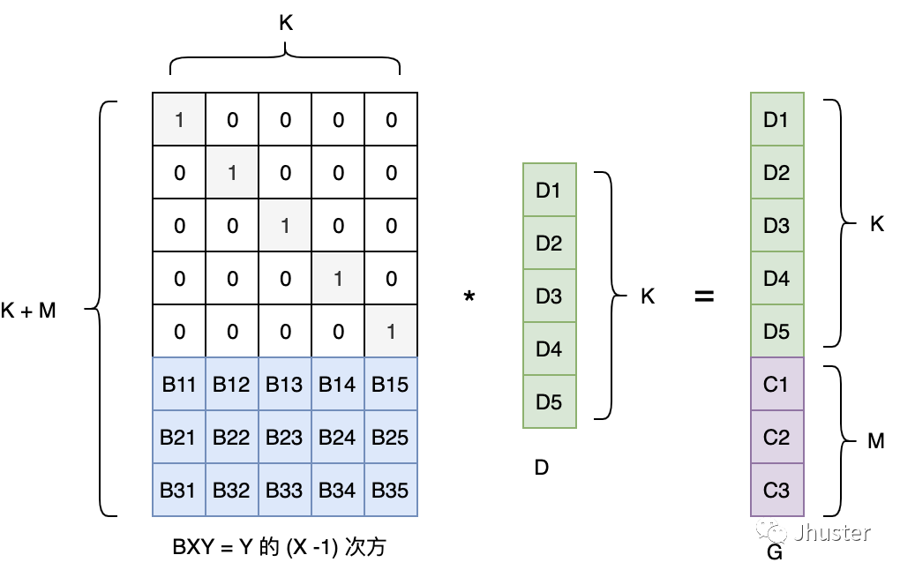
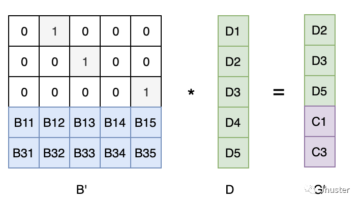

 
<!--BEGIN_DATA
{
    "create_date": "2020-12-28 11:22", 
    "modify_date": "2020-12-28 11:22", 
    "is_top": "0", 
    "summary": "谈谈网络通信中的 ACK、NACK 和 REX<br/>谈谈网络通信中的FEC基础", 
    "tags": "WebRTC", 
    "file_name": "谈谈网络通信中的ACK、NACK、REX和FEC.md"
}
END_DATA-->

#### <p>原文出处：<a href='https://mp.weixin.qq.com/s?__biz=MzAxNTc1MjM0Mw==&mid=2652213487&idx=1&sn=83617c09dd84ad5e669ec5977c2ed0cd&chksm=801e7d17b769f401ac05a25715f6cfe4a68013a589dcca62b6c950424aaa6d9937b809adbdb4&scene=21#wechat_redirect' target='blank'>谈谈网络通信中的 ACK、NACK 和 REX</a></p>

### 目录

* 名词解释
* 问题1： 接收方如何判断数据包是否丢失？
* 问题2：发送方如何确认数据包已经丢失？
* 问题3：重传超时的计算规则？
* 问题4：发送方的数据包要缓存多久？
* 问题5：接收端多久发送一次 nack 请求？
* 问题6：哪些丢失的数据包会放入 nack 请求队列中？
* 问题7：如何防止某个数据包频繁的 nack 请求？
* 问题8：重传包的优先级？FEC 包是否需要重传？
* 问题9：RTCP 协议的 NACK 报文是如何定义的？

### 名词解释

ACK：Acknowledgement，它是一种正向反馈，接收方收到数据后回复消息告知发送方。

NACK：Negative Acknowledgement，则是一种负向反馈，接收方只有在没有收到数据的时候才通知发送方。

REX：Retransmission，重传，当发送方得知数据丢失后，重新发送一份数据。


#### 问题 1：接收方如何判断数据包是否丢失 ？



解决方案：编号，每一个 packet 都打上一个序列号（Seq number），接收端发现序列号跳变/缺失，则可以判断数据包丢失了。

这就是为什么 TCP 协议的包头（packet header）里面要定义一个序列号字段的原因（如图红色标记）：



扩展一下，我们再看看 UDP 协议的包头（packet header）的定义：



可以看到，UDP header 没有用任何字段来标识序列号（Seq number），由此可见，UDP 是一个完全不关心是否丢包的传输协议。  

#### 问题 2：发送方如何确认数据包已经丢失 ？

有几种常见的方案，这里先简单介绍下，不详细展开细节。  

##### 1. 停等协议

发送方每次只发送一个包，同时启动一个定时器。如果定时器超时依然没有收到这个包的 ACK，则认为丢包，重传这个包。如果收到ACK，则重置定时器并发送下一个包。

问题：丢包的判断和传输效率非常低。

##### 2. 连续 ARQ 协议 & 滑窗协议

发送方维持着一个一定大小的发送窗口，位于发送窗口内的所有包可以连续发送出去，中途不需要依次等待对方的 ACK 确认。

接收方通常采用 **积累确认模式**，即不必对每一个包逐个发送 ACK，而是在连续收到几个包后，对顺序到达的最后一个包序号发送ACK，表示：这个包及之前的所有包都已正确收到了。

**积累确认模式** 的缺点：乱序比较严重的网络下，效率非常低，部分已经送到但没有按照顺序送达的包也必须重传。

改进方案：选择性重传（注：KCP/SRT 协议有实现）：对于顺序的包，发送积累确认；跳跃的包，发送 ACK；发送端只重传真正丢失的数据包。

##### 3. 快速重传

使用 ACK 机制的传输协议，通常在发送端等到某个数据包的 ACK 超时后，才会重传数据包，不够及时。

快速重传：如果接收端接收到了序号跳跃的数据包，则立即给发送方发送最后一个连续的数据包的 ACK（重复确认） 。如果发送端收到连续 3 个重复确认，则认为该ACK 的下一个数据包丢失了，并立即重传该丢失的数据包。

##### 4. NACK

接收方定时把所有未收到的包序号通过反馈报文通知到发送方进行重传。

带来的改进：减少的反馈包的频率和带宽占用，同时也能比较及时地通知发送方进行丢包重传。

#### 问题 3：重传超时的计算规则 ？

RTO：重传超时时间（Retransmission Timeout），它是发送端用来判断数据包丢失和执行重传的最重要的一个参数。

很明显，它应该是一个随网络传输的 RTT（往返时间）而变化的值，理想情况下，RTO 的值不小于 RTT 即可（从数据包发送到对方的 ACK 到达的最短时间），实际情况下，RTT 变化是非常频繁的，每一次传输的 RTT 可能都不一样，如果粗暴地设置 RTO = RTT 则一定会导致重传过度频繁。

因此 TCP 协议采用的 RTO 计算方法是：

1. 基于多次 RTT 测量，给出一个平滑后的 RTT 预估值：SRTT（Smoothed Round Trip Time）
2. RTO = SRTT + 某种系数（防止抖动的阈值）
3. 进一步，系统级别设置 RTO 的下限为 100ms 或 200ms，防止异常值
4. 更进一步，对于重传包的 RTO，加上一个退避算法，比如，每重传一次，则 RTO = 2 RTO 这样的方式来减少对一个包进行频繁的重传

注：关于重传包 RTO 的退避策略，KCP 经过实验证明 ，RTO 的退避系数使用 1.5 倍的效果比 2 倍的效果更好。

#### 问题 4：发送方的数据包要缓存多久 ？



发送端为了能实现重传，必须在本地将发送的数据包缓存起来，在需要重传的时候，即可从缓存队列里面取到该数据包进行重传。  

对于 ACK 模型的传输协议（如：TCP），在收到对方的 ACK 之后删除缓存即可，那如果是 NACK 模型的传输协议，如何更新和清理这个缓存队列呢 ？

##### 1. 方案一：基于 RTT 和 NACK 时间间隔

假设当前的 RTT（网络往返时间）是  rtt ms，NACK 的反馈时间间隔是 x ms，那么，一个数据包在发送缓存队列中最少的存活时间应该是：

> cache time = 2 * rtt + x

假设在这个时间后内收到的 NACK 反馈包没有指出该数据包丢失，则可以删除了。当然，类似 RTO 所涉及到的问题原因，rtt是频繁变化的，因此单纯依靠这个理论值来删除缓存并不安全，建议增加一定的冗余。  

##### 2. 方案二：基于业务场景

对于实时音视频通信场景，对延时有一定的要求，因此，超过 1s 的数据，就没有必要再重传了。或者，假设视频的 GOP 是 2s，那么，最多在缓存队列保持 2s 的数据包即可。

#### 问题 5：接收端多久发送一次 nack 请求 ？

假设接收端发现数据包发生序列号跳跃后立即发送 NACK 请求，由于 UDP 数据包可能会乱序到达，因此这种方案会导致过多的无效重传请求。

更加合理的方案是：每间隔指定的时间（比如：WebRTC 使用的是 10ms）发送一次 NACK 请求，一次性带上这段时间所有的丢包序号。

#### 问题 6：哪些丢失的数据包会放入 nack 请求队列中 ？

接收端的重传请求的队列也应该有一定的机制，不是所有的丢包都必须要求重传，比如：

1. 当前音频播放到了 timestamp 为 x 的时间点了，其实在 timestamp < x 的所有丢失的音频包都不应该再请求重传了，视频也是如此。
2. 作为 SFU 中转服务器，它没有播放时间的概念，因此方法 1 并不适用，但是可以参考发送端缓存的逻辑，假设 GOP 是 2s，则对比最新的 packet 时间戳，丢失的数据包时间在 2s 之前的数据，则没有必要再申请重传了。

补充一点，作为 SFU 中转服务器，可能会遇到下述情况，即：收到客户端的 NACK 请求的数据包不再自己的 cached packet list 里面：



SFU 作为客户端上行的接收端，发现丢包也跟普通的接收端一样，定时主动地向源头发送 NACK 请求；反过来，SFU 作为客户端下行的发送端，收到 NACK 请求后，如果发现不在 cached list，则标记一下，一旦收到源头的重传，则第一时间转发到下行。  

#### 问题 7：如何防止某个数据包频繁的 nack 请求 ？

参考 WebRTC 的实现，有如下防止策略：

1. 当一个丢失的包被 NACK 请求重传了至少 N 次（如：10次）后依然没有成功收到，则应该放弃了（很可能发送端也已经没有这个数据包的缓存了）
2. 考虑到重传请求在发送端的响应时间及网络 RTT，接收端应该确保在一定时间周期内不要频繁地发送对同一个数据包的 NACK 重传请求。（如：WebRTC 选择的时间周期是 5 + RTT * 1.5），即：在这个时间周期内不再重复发送同一个数据包的 NACK 请求。
3. 当 nack reqeust list 里面的数据包太多了（比如：超过 1000），则应该考虑清理一下（网络太弱了），对于视频的话，直接发送 IDR request，重新申请新的 GOP 数据。

#### 问题 8：重传包的优先级？FEC包是否需要重传 ？

考虑到丢包 -> 重传已经耽误了数据包的达到时间了，因此，重传包的优先级应该大于普通的数据包，当然，也应该有根据重传次数优先级逐步递减的策略。

FEC 包不需要，意义不大，FEC 的目的是为了减少重传而增加的冗余包，丢掉没有致命的影响，我们只需要重传价值更大的数据包即可。

#### 问题 9：RTCP 协议的 NACK 报文是如何定义的 ？

NACK 报文的定义在 [rfc4585] 文档中定义。

RTCP 的反馈报文包头定义如下，FMT 和 PT 决定了该报文的类型，FCI 则是该类型报文的具体负载：



协议规定的 NACK 反馈报文的 PT= 205，FMT=1，FCI 的格式如下（可以附带多个 FCI，通过 header 的 length 字段来标示其长度）：



这里的设计比较巧妙，它可以一次性携带多个连续的数据包的丢包情况：

  * PID（Packet identifier），即为丢失的 RTP 数据包的序列号
  * BLP（Bitmao of Lost Packets），通过掩码的方式指出了接下来 16 个数据包的丢失情况

<hr>

#### <p>原文出处：<a href='https://mp.weixin.qq.com/s/o3u3PncdxRWaWAI3WFQ9LA' target='blank'>谈谈网络通信中的FEC基础</a></p>

### 目录

* 名词解释
* FEC 的基础理论：异或
  * 异或的规则
  * 异或的特性
* XOR 的应用案例
  * 奇偶校验（Parity Check）
  * 磁盘阵列-RAID5
  * 基于 XOR 的 FEC 
  * 对象存储-EC 纠删码
* Reed-Solomon Codes
* 参考文章  
* 小结

### 名词解释

FEC：Forward Error Correction，前向纠错

FEC 是一种通过在网络传输中增加数据包的冗余信息，使得接收端能够在网络发生丢包后利用这些冗余信息直接恢复出丢失的数据包的一种方法。

### FEC 的基础理论：异或

#### 异或的规则

两个值不相等则为 1，相等则为 0；

```cpp
0 ^ 0 = 0
1 ^ 1 = 0
0 ^ 1 = 1
1 ^ 0 = 1
```

注：按位异或 ^，则是把两个数转换为二进制，按位进行异或运算。

#### 或的特性

```cpp
恒等律：X ^ 0 = X
归零律：X ^ X = 0
交换律：A ^ B = B ^ A
结合律：A ^ (B ^ C) = (A ^ B) ^ C
```

注：可以通过数学方法推导证明，我们这里只需要记住这些规则即可，后面有大量的应用。

### XOR 的应用案例

有了这些 XOR 的基础理论，我们看看它是怎么应用到实际中的 “校验” 和 “纠错” 的。

#### 奇偶校验（Parity Check）

判断一个二进制数中 1 的数量是奇数还是偶数（应用了异或的 恒等律 和  归零律）：

```cpp
// 例如：求 10100001 中 1 的数量是奇数还是偶数
// 结果为 1 就是奇数个 1，结果为 0 就是偶数个 1
1 ^ 0 ^ 1 ^ 0 ^ 0 ^ 0 ^ 0 ^ 1 = 1   
```

这条性质可用于奇偶校验（Parity Check），每个字节的数据都计算一个校验位，数据和校验位一起发送出去，这样接收方可以根据校验位粗略地判断接收到的数据是否有误。

#### 磁盘阵列-RAID5

使用 3 块磁盘（A、B、C）组成RAID5 阵列来存储用户的数据，把每份数据切分为 A、B 两部分，然后把 A xor B 的结果作为 C ，分别写入A、B、C 三块磁盘。最终，任意一块磁盘出错，都是可以通过另外两块磁盘的数据进行恢复的。

实现原理：应用了异或的 恒等律 和  结合律

```cpp
c = a ^ b
a = a ^ (b ^ b) = (a ^ b) ^ b = c ^ b
b = (a ^ a) ^ b = a ^ c
```

#### 基于 XOR 的 FEC

假设网络通信有 N 个 packet 需要发送，那么，可以类似上述 RAID5 的策略，每 2 个 packet 生成一个 FEC packet，这样，连续的 3 个 packet 的任意一个 packet 丢失，都能通过另外 2 个恢复出来的。

但考虑到每 2 个 packet 就产生 1 个 fec packet，冗余度可能有点高（比较浪费带宽），我们能否每 3 个或者每 N 个 packet 再产生一个 fec packet 呢？当然可以，我们以每 3 个 packet（A、B、C） 产生 1 个 fec packet（D）为例来推导一下：

```cpp
d = a ^ b ^ c
a = a ^ (b ^ b) ^ (c ^ c) = (b ^ c) ^ (a ^ b ^ c) = b ^ c ^ d
b = (a ^ a) ^ b ^ (c ^ c) = (a ^ c) ^ (a ^ b ^ c) = a ^ c ^ d
c = (a ^ a) ^ (b ^ b) ^ c = (a ^ b) ^ (a ^ b ^ c) = a ^ b ^ d
```

由上述公式推导即可知道，这 4 个 packet，任意丢失 1 个 packet，均可以由其他 3 个 packet 恢复出来。

#### 对象存储-EC纠删码

一些互联网云计算公司提供的对象存储服务，都会宣称自己具有极高的数据可靠性，使用了如三副本技术、EC 纠删码技术等等，后者大致方案如图所示：



图中采用的是 8+4 的纠删码策略（即：原始数据切割为 8 份，计算出 4 份冗余信息），将这 12 份分别存储在 不同机柜的 12 台不同节点上，即使同一时刻出现多台节点（至多 4 台）损坏或不可访问，只要有不少于 8 个节点可用，数据即可恢复。

不知道大家看出来点什么没有？相比于上面基于 N 个 packet 产生 1 个 FEC packet 的方案，这种 K + M 的纠删码策略具有更好的扛丢失能力，总结下来就是：

通过 K 个有效数据，产生 M 个 FEC 冗余包，这 K + M 个数据，任意丢失 M 个数据，都能把 K 个有效数据恢复出来。

其实这种方案，最早也是应用于网络传输领域的，只不过被借用到存储领域来提高磁盘的利用率。要实现这种 K + M 的 FEC 策略，使用简单的 XOR 异或来推导比较难，需要借助矩阵相关的计算，实现方案有很多种，下面简单介绍下最著名和常用的 Reed-solomon codes。

### Reed-Solomon Codes

里德-所罗门码（Reed-solomon codes，简称 RS codes），利用该原理实现的 FEC 策略，通常也叫做 RS-FEC。网上关于它的介绍特别多，本文就不详细展开了，仅简单以示意图的形式给出大致的原理：

#### RS codes 编码过程



大致原理如下：假设有效数据有 K 个，期望生成 M 个 FEC 数据

1. 把 K 个有效数据组成一个单位向量 D
2. 生成一个变换矩阵 B：由一个 K 阶的单位矩阵 和一个 K * M 的范德蒙特 矩阵（Vandemode）组成
3. 两个矩阵相乘得到的矩阵 G，即包含了 M 个冗余的 FEC 数据

#### RS codes 解码过程

假设数据 D1，D4，C2 丢失了，则取对应行的范德蒙矩阵的逆 * 没有丢失的数据矩阵，则可以恢复出原始的数据矩阵。



大致原理如下：假设数据 D1，D4，C2 丢失了

1. 对矩阵 B 和 D，分别取没有丢失的行构成 B‘ 和 G’
2. 根据如下公式，即可计算恢复出有效数据向量 D

```cpp
B' x D = G'  ->>>  D = B' 的逆 x G'
```

### 参考文章

* [感受异或的神奇](https://link.zhihu.com/?target=http%3A//lijinma.com/blog/2014/05/29/amazing-xor/)
* [纠删码 Erasure Code](https://zhuanlan.zhihu.com/p/69374970)