 
<!--BEGIN_DATA
{
    "create_date": "2021-11-15 23:00", 
    "modify_date": "2021-11-15 23:00", 
    "is_top": "0", 
    "summary": "超基础的机器学习入门-原理篇", 
    "tags": "机器学习", 
    "file_name": "超基础的机器学习入门-原理篇.md"
}
END_DATA-->

#### <p>原文出处：<a href='https://my.oschina.net/o2team/blog/5348642' target='blank'>超基础的机器学习入门-原理篇</a></p>

## 前言

随着前端智能化的火热，AI机器学习进入前端开发者们的视野。AI能够解决编程领域不能直接通过规则和运算解决的问题，通过自动推理产出最佳策略，成为了前端工程师们解决问题的又一大利器。

可能很多同学都跃跃欲试过，打开 `TensorFlow` 或者 `Pytorch` 官网，然后按照文档想要写一个机器学习的 `Hello World`，然后就会遇到一些不知道是什么的函数，跑完例子却一头雾水，这是因为 `TensorFlow` 和 `Pytorch` 是使用机器学习的工具，而没有说明什么是机器学习。所以这篇文章以实践为最终目的出发，介绍一些机器学习入门的基本原理，加上一丢丢图像处理的卷积，希望可以帮助你理解。

## 基础概念

首先，什么是机器学习？机器学习约等于找这样一个函数，比如在语音识别中，输入一段语音，输出文字内容

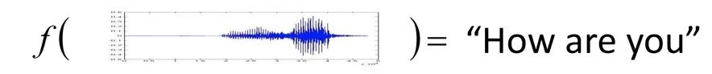

在图像识别中，输入一张图像，输出图中的对象，

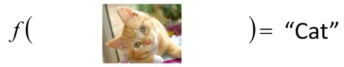

在围棋中，输入棋盘数据，输出下一步怎么走，

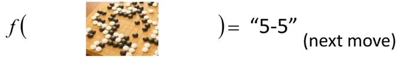

在对话系统中，输入一句 hi ，输出一句回应，

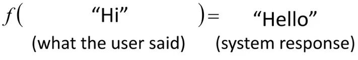

而这个函数，是由你写的程序加上大量的数据，然后由机器自己学习到的。

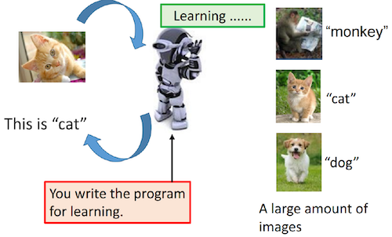

怎么找这样一个函数呢，让我们从线性模型入手。线性模型形式简单，易于建模，但是蕴含着机器学习中一些重要的基本思想，许多功能更为强大的非线性模型都可在线性模型的基础上通过引入层级结构或高维映射而得到。

## 线性模型

我们以一个猫和狗的分类来看，我们在教一个小朋友区分猫和狗的时候，并不会给到一个维奇百科的定义，而是不断的让小朋友看到猫和狗，让他判断，然后告诉他正确答案，纠结错误认知。机器学习也是同理，不断告知计算机怎样是正确的，纠正计算机的认知，不同的是，小朋友的认知是人脑自动处理完成的，而计算机并不能自动的构建猫和狗的记忆，计算机只认识数字。

所以我们需要提取出代表猫和狗的特征，然后用数字来表示。为了简化例子，我们这里只用到两个特征，鼻子的大小以及耳朵的形状，一般来说猫猫的鼻子更小，耳朵更尖，而狗狗鼻子比较大，耳朵比较圆。

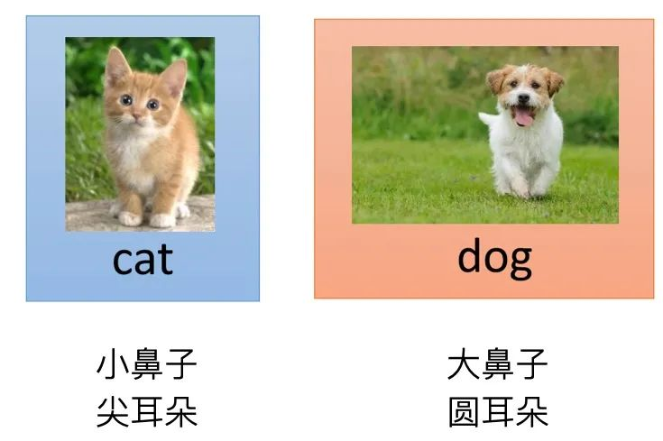

我们对多张图片，统计图片中耳朵以及鼻子特征，在一个二维坐标中表现出来，可以看到猫猫和狗狗会分布在坐标系的不同区域。

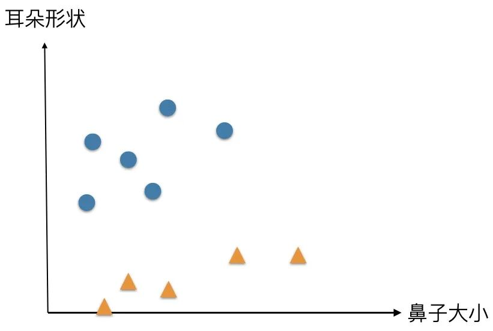

肉眼可见，我们可以用一条直线来区分，但是，计算机并看不到哪里可以画条线。如何将信息传递给计算机呢，让我们定义两个变量，`x1` 表示鼻子大小，`x2`表示耳朵形状，再定义这样一个直线方程 `W1 · X1 + W2 · X2 - b = 0`，也就相当于，令`y=W1 · X1 + W2 · X2 - b` ，当 `y` 大于`0`，判断是猫，当 `y` 小于 `0` ，判断是狗。

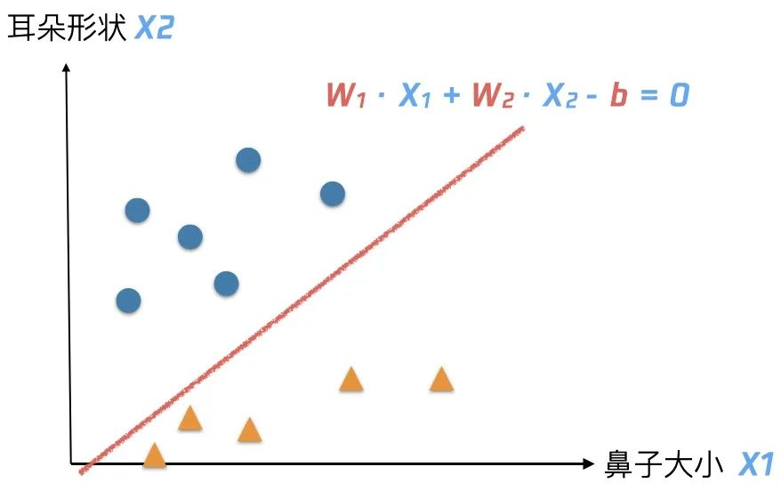

现在，从计算机的角度来看，它拥有了一堆数据，

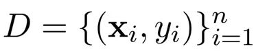

以及一个线性模型，

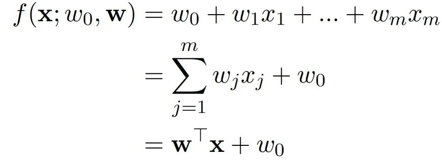

还差一个目标/任务，我们的期望是，当给一个没有见过的 `x` ，通过 `f(x)` ，可以得到一个预测值 `y` ，这个 `y`要能够尽可能的贴近真实的值，这样，就有了一台有用的萌宠分类机了！这样的目标如何用数字来表示呢，这就要引入一个概念损失函数(`Loss function`)了，损失函数计算的是预测值与真实值之间的差距。

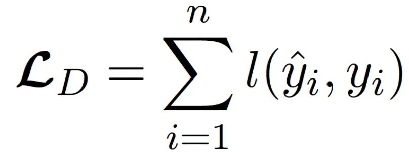

常用的损失函数有绝对值损失函数(`Absolute value loss`),也就是两个数值差的绝对值，就很直观，距离目标差多少，加起来，就酱

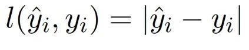

还有平方损失函数(最小二乘法, `Least squares loss`)

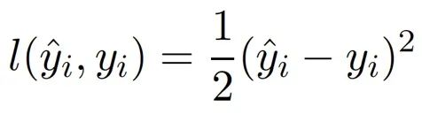

平方损失函数的目标是让每个点到回归直线的距离最小，这个距离算的是欧几里得距离。现在，我们给计算机的目标就变成了求一个最小值，

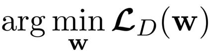

为了求这个值，让我们回忆一下久违的微积分，（同样，为了简化到二维坐标系，假设只有一个需要求的 `w` ），导数为 `0` 的地方即是函数的极大值或者极小值。

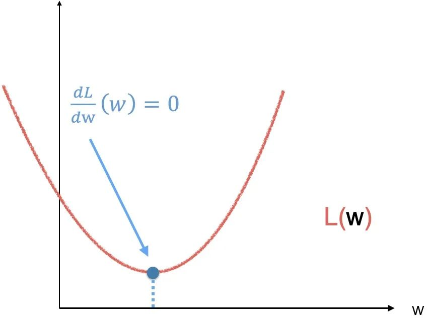

对于图中这样一个简单的一元二次方程，我们可以直接对参数 `w` 求导，求得极小值。但是，如果是下图中这样一个函数呢，就..不好求了，而且对于不同的函数求导有不同的公式，那就..比较麻烦了，毕竟我们的目标是让机器自己学习，是吧。

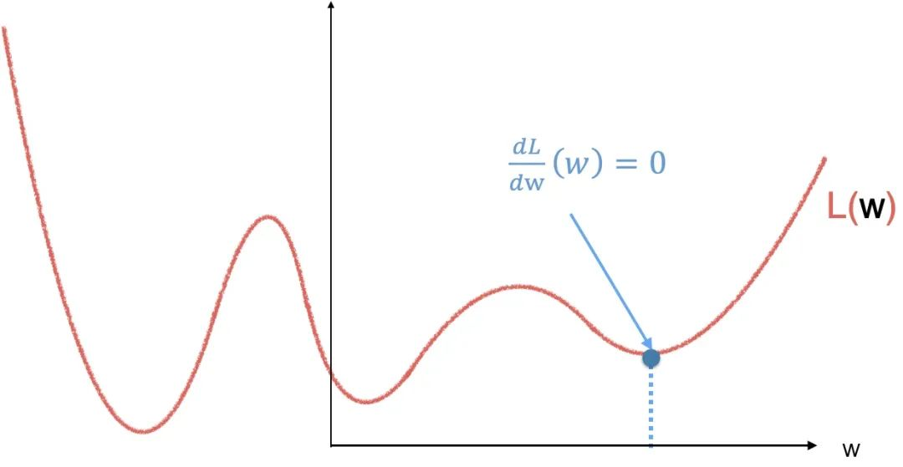

所以，我们需要一个更通用的计算方法，那就是梯度下降(`Gradient descent`，
梯度下降的基本流程如下，首先，我们随机取一个点作为初始值，计算这个点的斜率，也就是导数。

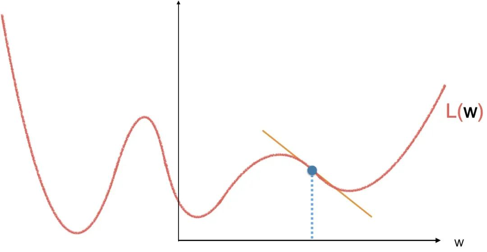

当斜率为负的时候，往右走一小步，

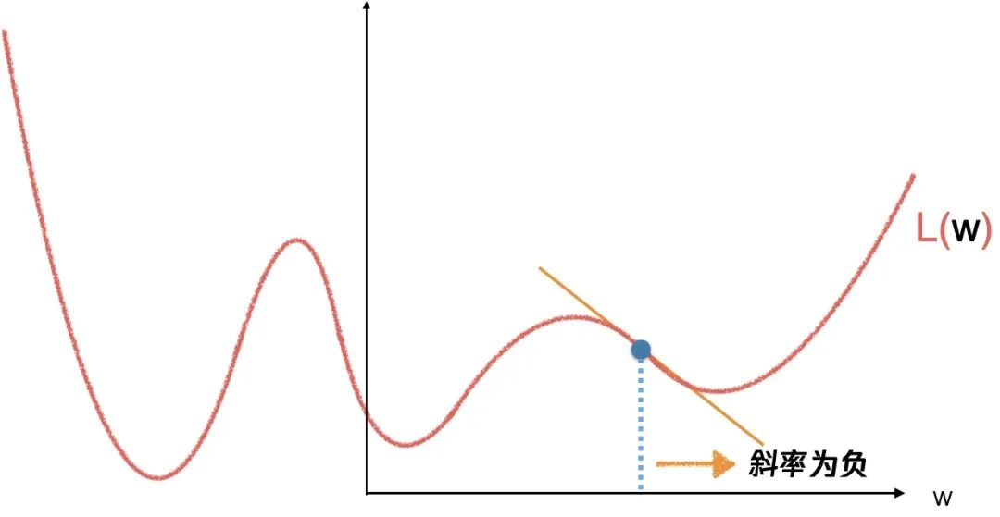

当斜率为正的时候，往左走一小步，

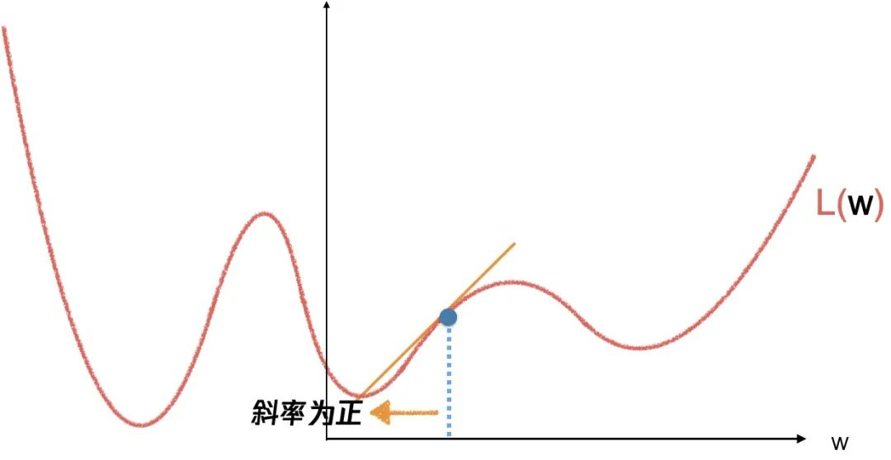

在每个点上重复，计算新的斜率，再适当的走一小步，就会逼近函数的某个局部最小值，就像一个小球从山上滚下来，不过初始位置不同，会到达不同的局部最小值，无法保证是全局最小，但是，其实，大部分情况我们根据问题抽象的函数基本都是凸函数，能够得到一个极小值，在极小值不唯一的情况下，也可以加入随机数，来给到一个跳出当前极小值区域的机会。我们需要明确的是，机器学习的理论支撑是概率论与统计学，我们通过机器学习寻找的问题答案，往往不是最优解，而是一个极优解。

想象一个更复杂的有两个输入一个输出的二元函数，我们的 `loss function`可以呈现为三维空间中的一个曲面，问题就变成了，曲面上某个点要往空间中哪个方向走，才能让结果下降得最快。

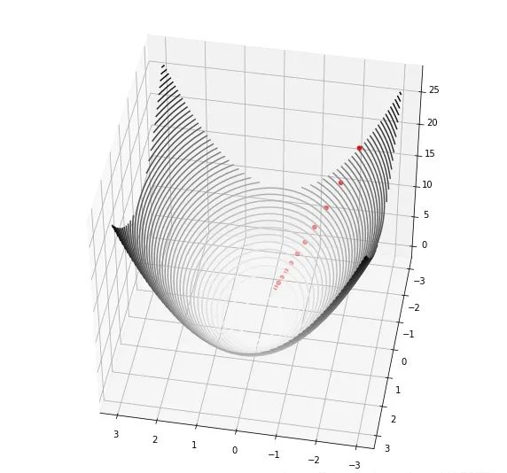

步骤依旧是，计算梯度，更新，计算，更新....用公示来表示就是如下，

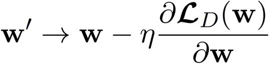

这时候，我们就遇到了第一个超参数 `η` ，即学习率(`Learning rate`)，机器学习中的参数分为两类，模型参数与超参数，模型参数是 `w`这种，让机器自己去学习的，超参数则是在模型训练之前由开发人员指定的。

通过上面的公式，可以看到

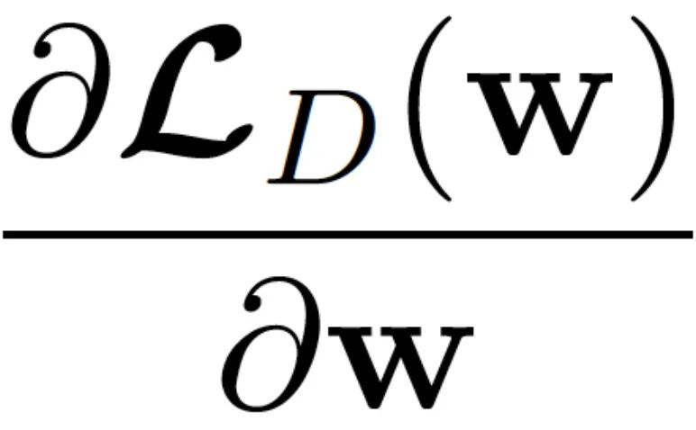

是 `Loss function` 函数对于参数 `w` 的导数，决定了我们走的方向，那么学习率则决定了在这个方向每一小部走的距离。

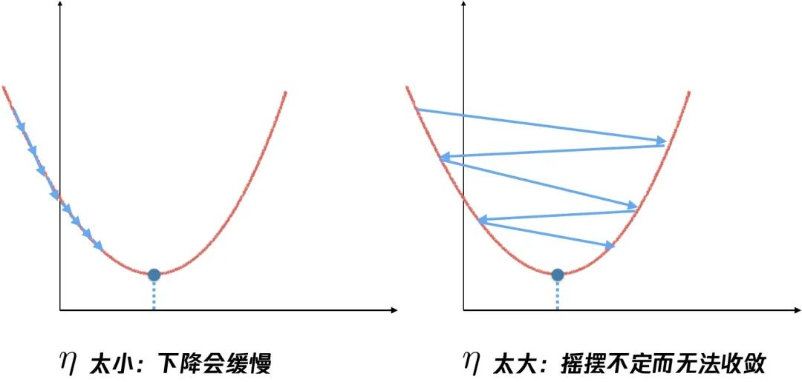

当 `η` 太小，到达极小值的过程会非常的缓慢，而如果 `η` 太大，则会因为步伐太大，直接越过最低点。那么，`η` 的值要怎么取呢，

比较常规的做法是，以从 `0.1` 这样的值开始，然后再指数下降，取`0.01`，`0.001`，当我们用一个很大的学习率，会发现损失函数的值几乎没有下降，那可能就是在摇摆，当我们取到一个较小的值，能够让损失函数下降，那么继续往下取，不断缩小范围，这个过程也可以通过计算机自动来做，如果有计算资源的话。

了解了梯度下降、学习率后，我们已经可以使用线性模型解决比较简单的问题了，

基本步骤：

  * 提取特征 
  * 设定模型 
  * 计算梯度，更新 

是不是想试一下了！

这里有一个简单的房价预测的栗子，可以本地跑跑看，试试调整不同的学习率,看 `loss function`的变化。https://github.com/xs7/MachineLearning-demo/blob/master/RegressionExperiment.ipynb

其中关键代码如下：

```python
## 损失函数  
def lossFunction(x,y,w,b):  
    cost=np.sum(np.square(x*w+b-y))/(2*x.shape[0])  
    return cost  
  
## 求导  
def derivation(x,y,w,b):  
    #wd=((x*w+b-y)*x)/x.shape[0]  
    wd=x.T.dot(x.dot(w)+b-y)/x.shape[0]  
    bd=np.sum(x*w+b-y)/x.shape[0]  
    return wd,bd  
  
## 线性回归模型  
def linearRegression(x_train,x_test,y_train,y_test,delta,num_iters):       
    w=np.zeros(x.shape[1])                                    ## 初始化 w 参数  
    b=0                                                       ## 初始化 b 参数  
    trainCost=np.zeros(num_iters)                             ## 初始化训练集上的loss    
    validateCost=np.zeros(num_iters)                          ## 初始化验证集上的loss    
    for i in range(num_iters):                                ## 开始迭代啦  
       trainCost[i]=lossFunction(x_train,y_train,w,b)         ## 计算训练集上loss   
       validateCost[i]=lossFunction(x_test,y_test,w,b)        ## 计算测试集上loss  
       Gw,Gb=derivation(x_train,y_train,w,b);                 ## 计算训练集上导数  
       Dw=-Gw                                                 ## 斜率>0 往负方向走，所以需要加负号  
       Db=-Gb                                                 ## 同上  
       w=w+delta*Dw                                           ## 更新参数w  
       b=b+delta*Db                                           ## 更新参数b  
return trainCost,validateCost,w,b  
```

## 多层感知机

我们刚刚说到的线性模型，实际上是一个单层的网络，它包括了机器学习的基本要素，模型、训练数据、损失函数和优化算法。但是受限于线性运算，并不能解决更加复杂的问题。

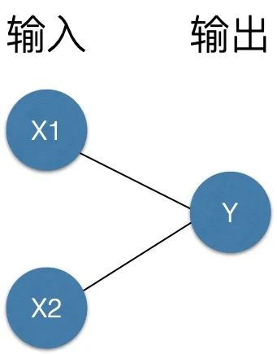

我们需要更为通用的模型来适应不同的数据。比如多加一层？加一层的效果约等于对坐标轴进行变换，可以做更复杂一丢丢的问题了。

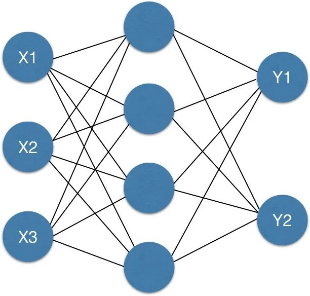

但是依旧是线性模型，没有办法解决非线性问题，比如下图中，没有办法用一条直线分开，但是用 `y= x2` 这样一个二元一次方程就可以轻轻松松，这就是非线性的好处了。

加一个非线性的结构，也就引入了神经网络中另一个基本概念，激活函数(`Activation Function`)，常见的激活函数如下

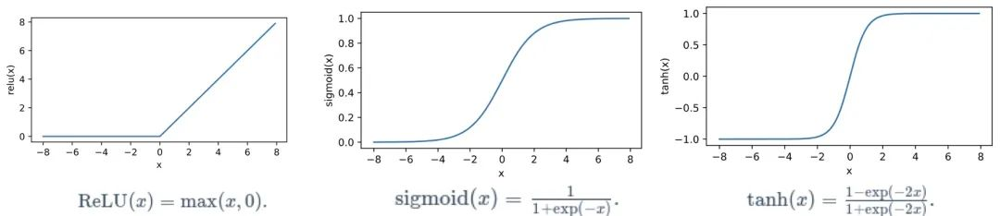

`Relu` 函数只保留正数元素，清零负数元素，`sigmoid` 函数可以把元素的值变换到 `0～1` 之间，`tanh` 函数可以把元素的值变换到 `-1～1` 之间。其中用到最广泛的是看上去最简单的 `Relu` ，`Relu`函数就好比人脑神经元，达到神经元的刺激阈值就输出，达不到阈值就置零。

激活函数的选择要考虑到输入输出以及数据的变化，比如通常会用 `sigmoid` 作为输出层的激活函数，比如做分类任务的时候，将结果映射到 `0～1`，对于每个预设的类别给到一个 `0～1` 的预测概率值。

可以理解为，我们提供了非线性的函数，然后神经网络通过自己学习，使用我们提供的非线性元素，可以逼近任意一个非线性函数，于是可以应用到众多的非线性模型中。

加入激活函数后，我们就拥有了多层感知机(`multi layer perceptron`)，多层感知机就是含有至少一个隐藏层的由全连接层组成的神经网络，且每个隐藏层的输出通过激活函数进行变换。

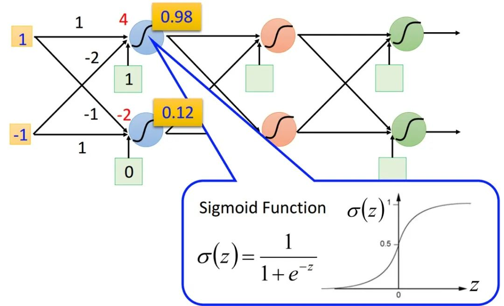

类似上图这样，就构成了一个简单的多层感知网络，即深度神经网络。网络层级变复杂之后，依旧是使用梯度下降来进行迭代优化，但是梯度的计算却变复杂了，网络中的每条线上都有一个 `w` 权重参数，需要用 `loss function` 对每个 `w` 求梯度，大概估一下，假设输入层有`10`个节点，有两个隐藏层，每个隐藏层隐藏层那从输入层到隐藏层 `1` 再到隐藏层 `2`  就有 `30000*3` 个参数，而且参数之间是存在函数关系的，最终输出的 `loss` 对第一层隐藏层的 `w` 求导需要逐层求过来，计算量`++++++n`， 直接求导是万万不可能的，所以我们需要反向传播算法(`Backpropagation`，`bp`算法)。

## 反向传播算法

反向传播算法是用来在多层网络中快捷的计算梯度的，其推导相对而言要复杂一些，使用框架的时候..直接调用api即可，也没有什么开发者能调整的地方,大家应该..不想写代码计算偏导数吧..那就作为进阶内容，先挖个坑..下次来填..

## 中途小结

到现在我们应该对神经网络的计算已经有了一个基本的印象，回顾一下， 就是给到一个多层网络结构模型，然后输入数据，不断求梯度来更新模型的参数，不断减少模型预测的误差。其中使用梯度来更新参数的步伐由超参数学习率决定，用伪代码表示就是：
 
```
for i in 迭代次数：       
    loss = 预测值和真实值的差距       
    d = loss 对 w求导     
    w = w - d * 学习率  
```    

到这里，我们已经知道了一个深度神经网络基本结构以及计算流程，可以看懂一些简单的使用神经网络的代码了，继续回去看 `Pytorch` 官方教程，结果`demo` 里面都是图像的栗子，所以..那就再看看什么是卷积神经网络叭。

## 卷积神经网络

我们前面提到的网络模型中，相邻两层之间任意两个节点之间都有连接，称之为全连接网络(`Fully Connected Layer`)。当我们用一个深度网络模型处理图片，可以把图片中每个像素的 `rgb` 值均作为输入，一张 `100*100` 的图片，网络的输入层就有`100*100*3` 个节点，哪怕只给一个隐藏层，输入层到隐藏层就已经有 `30000*100` 个参数了，再添加几层或者换稍微大一点的图片，参数数量就更爆炸了。图像需要处理的数据量太大，使用全连接网络计算的成本太高，而且效率很低。直到卷积神经网络(`Convolutional Neural Network`, `CNN`)出现，才解决了图像处理的难题。

直接来看卷积神经网络是什么样子的吧，如下

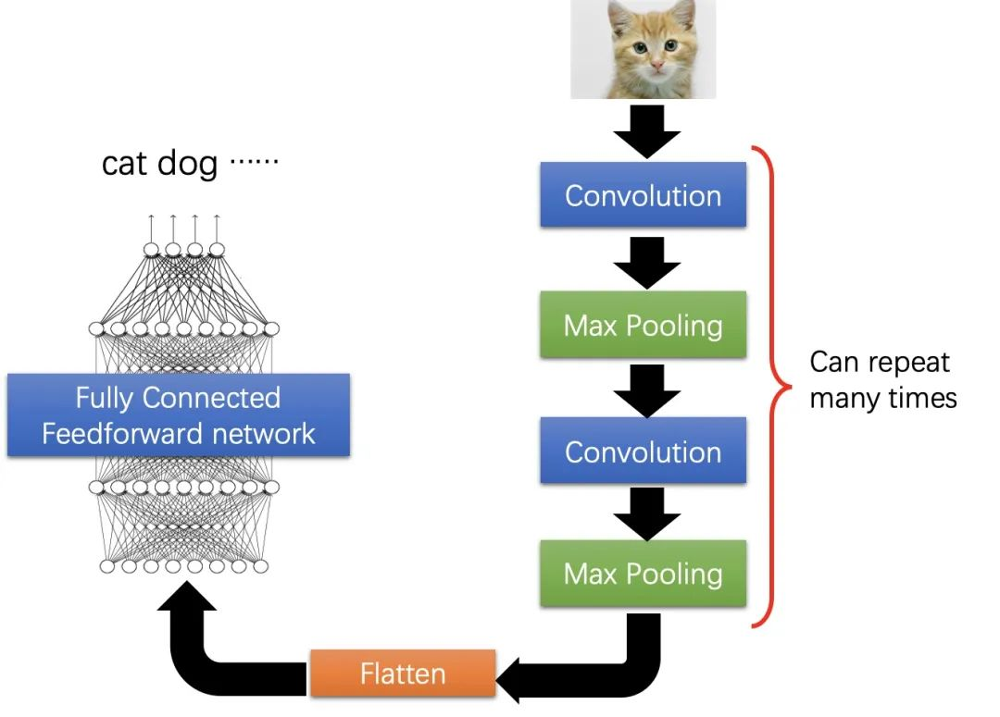

一个典型的卷积神经网络包括了三部分

  * 卷积层 
  * 池化层 
  * 全连接层 

其中，卷积层用来提取图片的特征，池化层用来减少参数，全连接层用来输出我们想要的结果。

先来看卷积。

输入一张图片，再给到一个卷积核（`kernel`，又称为`filter`滤波器）

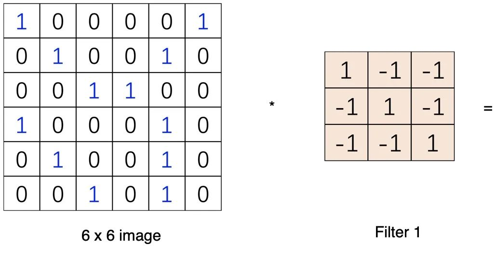

将滤波器在图像上滑动，对应位置相乘求和，

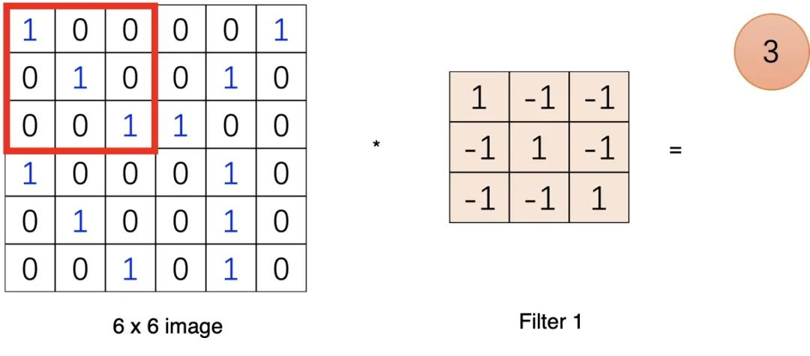 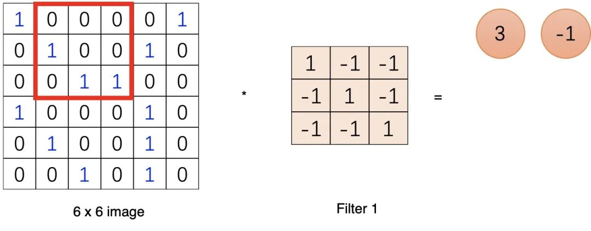

滑完可以得到一个新的二维数组，这就是卷积运算了，是的..就是这样简单的加法。

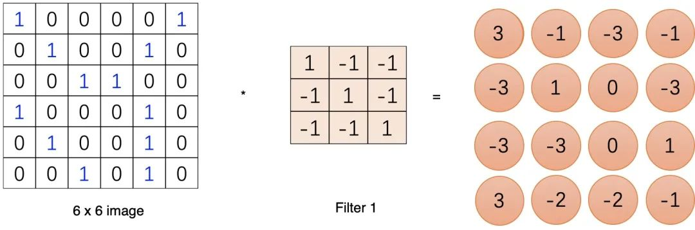

如果再加一个卷积核，运算完毕就得到了两个通道的数组。

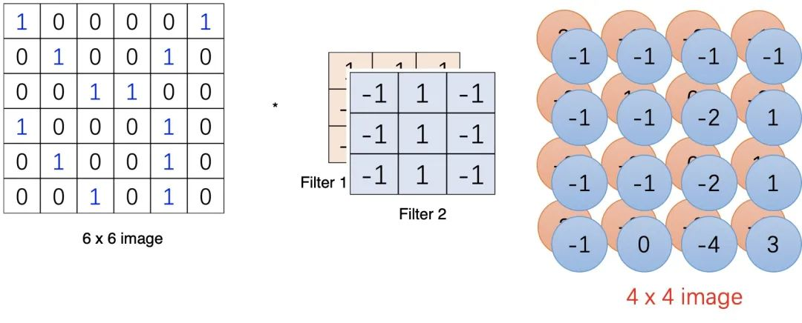

二维卷积层输出的二维数组可以看作是输入在空间维度（宽和高）上某一级的表征，也叫特征图（`feature map`）。

一个节点的输入来源区域称为其感受野（`receptive field`），比如特征图中第一个节点 `3` 的输入野就是输入图片左上角 `3*3` 的区域。


如果我们对结果再来一次卷积，最后得到的特征图中的第一个节点 `17` ，其感受野就变成了其输入节点的感受野的并集，即图片左上角 `4*4`的区域。我们可以通过更深的卷积神经网络使特征图中单个元素的感受野变得更加广阔，从而捕捉输入上更大尺寸的特征。

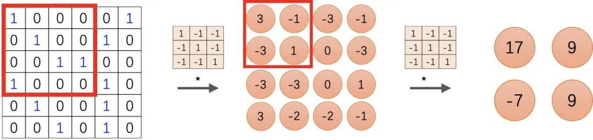

这其实是模拟人类视觉原理，当我们接收到视觉信号，大脑皮层的某些细胞会做初步处理，发现边缘以及方向，然后再进行抽象，判定眼前物体的形状是圆的还是方的，然后进一步抽象是什么物体。通过多层的神经网络，较低层的神经元识别初级的图像特征，若干底层特征组成更上一层特征，最终得到最高抽象的特征来得到分类结果。


了解了多层卷积是从局部抽象到全局抽象这样一个识别过程后，再回过头来看一下卷积核本身。

从函数的角度来理解，卷积过程是在图像每个位置进行线性变换映射成新值的过程, 在进行逐层映射，整体构成一个复杂函数。从模版匹配的角度来说，卷积核定义了某种模式，卷积运算是在计算每个位置与该模式的相似程度，或者说每个位置具有该模式的分量有多少，当前位置与该模式越像，响应越强。

比如用边缘检测算子来做卷积，`sobel` 算子包含两组 `3*3` 的矩阵，分别为横向及纵向，将之与图像作平面卷积，如果以A代表原始图像，`G(x)` 及 `G(y)` 分别代表经横向及纵向边缘检测的图像：

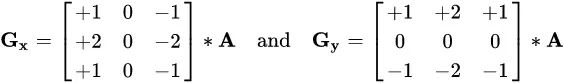

`sobel` 偏 `x` 方向的边缘检测计算结果如下所示：


再看一些直观表现不同卷积核算子效果的栗子，

是不是感觉卷积大法好。当然，我们可以直接找一些有趣的卷积核来用，比如用卷积来检测图像边缘，也可以通过数据来学习卷积核，让神经网络来学习到不同的算子。

刚刚在卷积计算的时候，每次滑动了一个小格，也就是 `stride` 步伐为 `1`，其实也可以把步伐加大，每次滑动 `2`个小格，也可以跳着取值，来扩大感受野，也可以为了保持输出数组的长宽与输入一致，在原图边缘加一圈 `padding` ，作为最最基础的入门，这里就不展开了。

回到我们的网络结构，可以看到两层神经元间只有部分连接了，更少的连接，代表更少的参数。

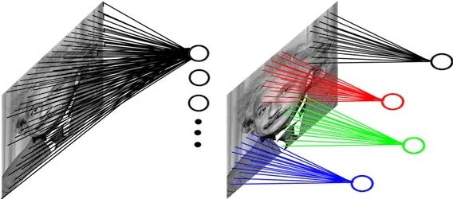

但是这样还不够，图片像素太多，哪怕我们只对局部取特征，依旧需要许多许多的参数，所以还需要池化(`pooling`)。

池化层的作用其实就是下采样，缩小图片，池化的计算也非常的简单，对输出数据的一个固定大小窗口的元素进行计算，然后输出，最大池化(`Max Pooling`)就是取池化窗口内元素的最大值，平均池化则是取输入窗口的元素的平均值。

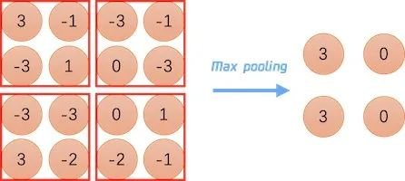

除了下采样，减小图片大小，池化还可以缓解卷积层对位置的过度敏感性，避免模型过拟合，举一个极端的例子，一张图片只有四个像素，如果某个位置像素为 `255`，我们就判定是某个类型的物品，如果我们输入的用来学习的训练集图片中，每张图片都是左上角第一个像素为 `255`，如果没有池化，模型训练的结果就是，当左上角第一个像素为 `255`，那么输出判断为该物品，当我们用这个模型去预测一张右上角像素为255的图片，模型会认为不是该物体，判断错误。而如果有池化，不管 `255`出现在哪一个位置，池化后都会取到 `255`，判断为是该物品。

经过多个卷积层和池化层降维，数据就来到了全连接层，进行高层级抽象特征的分类啦。

## 最后

到这里，应该已经介绍完看懂 `Pytorch` / `Tensorflow`官网入门教程所需要的绝大部分原理知识了，可以愉快的跑官网的图片分类示例然后写自己的网络了。具体框架使用那就下篇《超基础的机器学习入门-实践篇》见。

## 最后的最后

Deco 智能代码项目是凹凸实验室在「前端智能化」方向上的探索，我们尝试从设计稿生成代码（DesignToCode）这个切入点入手，对现有的设计到研发这一环节进行能力补全，进而提升产研效率。其中使用到不少AI能力来实现设计稿的解析与识别，感兴趣的童鞋欢迎关注我们的账号「凹凸实验室」（知乎[1]、掘金[2]）。

## 参考资料

* 知乎: https://www.zhihu.com/people/o2team
* 掘金: https://juejin.cn/user/1134351699149854
* http://speech.ee.ntu.edu.tw/~tlkagk/courses_ML19.html
* https://www.jiqizhixin.com/articles/2017-11-17-2
* https://www.cnblogs.com/shine-lee/p/9932226.html
* https://www.jianshu.com/p/2334bee37de5
* [索伯算子](https://zh.wikipedia.org/wiki/%E7%B4%A2%E8%B2%9D%E7%88%BE%E7%AE%97%E5%AD%90)
* [一文看懂卷积神经网络-CNN（基本原理+独特价值+实际应用）](https://medium.com/@pkqiang49/%E4%B8%80%E6%96%87%E7%9C%8B%E6%87%82%E5%8D%B7%E7A7%AF%E7%A5%9E%E7%BB%8F%E7%BD%91%E7%BB%9C-cnn-%E5%9F%BA%E6%9C%AC%E5%8E%9F%E7%90%86-%E7%8B%AC%E7%89%B9%E4%BB%B7%E5%80%BC-%E5%AE%9E%E9%99%85%E5%BA%94%E7%94%A8-6047fb2add35)
* http://cs231n.stanford.edu/
