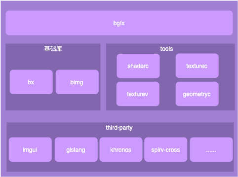
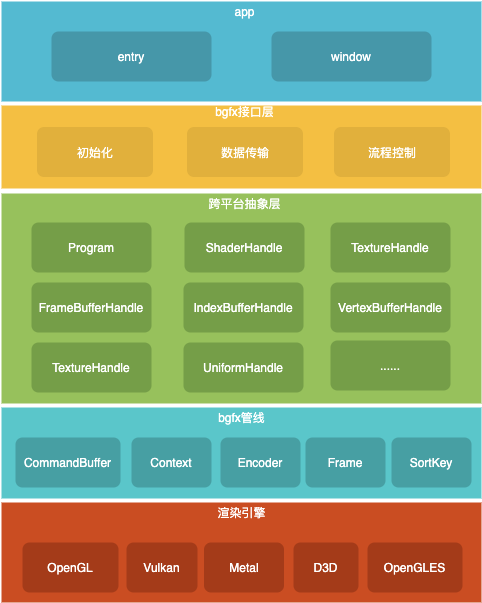
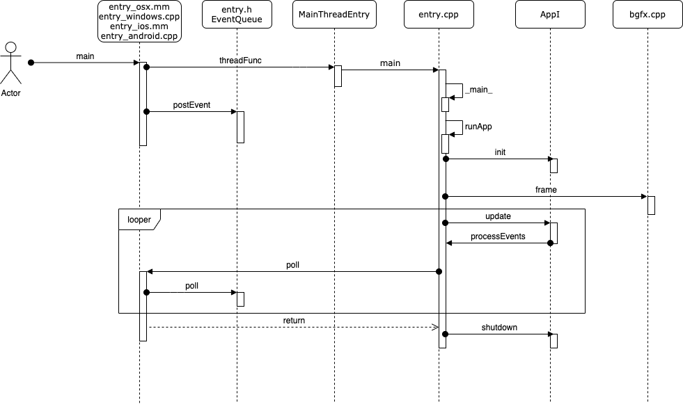
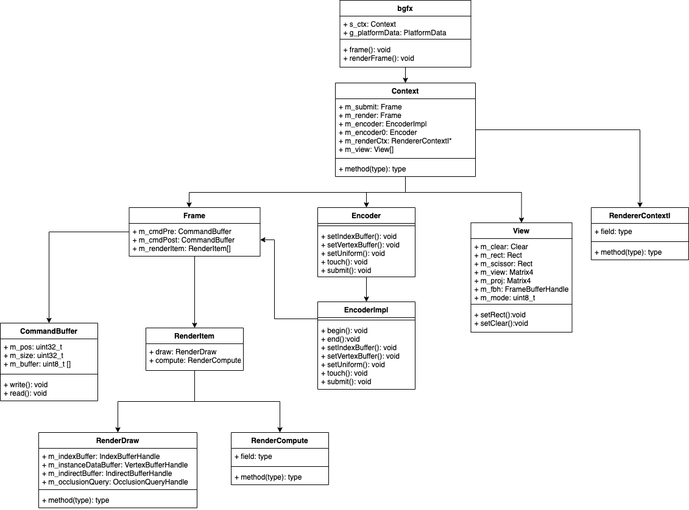
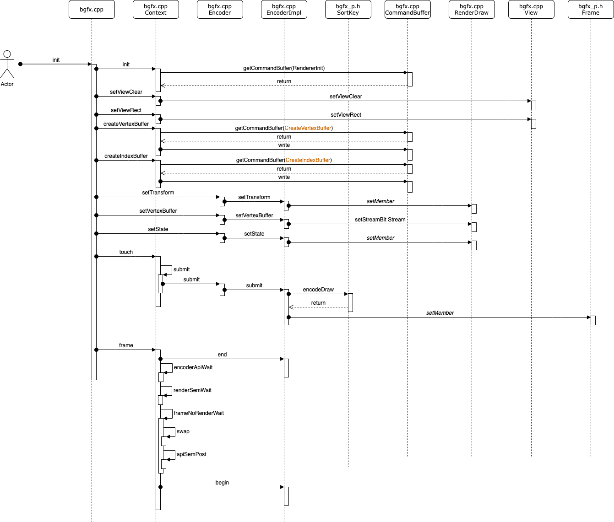
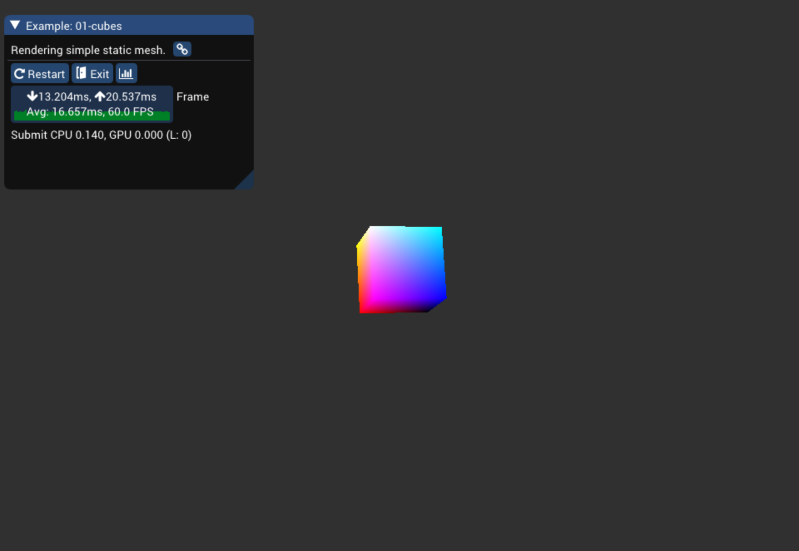
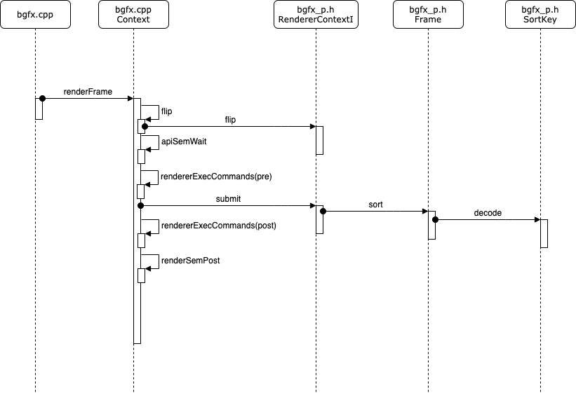
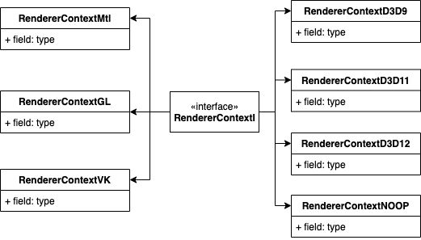

 
<!--BEGIN_DATA
{
    "create_date": "2020-08-08 19:42", 
    "modify_date": "2020-08-08 19:42", 
    "is_top": "0", 
    "summary": "跨平台图形渲染引擎bgfx分析", 
    "tags": "OpenGL", 
    "file_name": "跨平台图形渲染引擎bgfx分析.md"
}
END_DATA-->

####<p>原文出处：<a href='https://blog.csdn.net/dsafa22/article/details/105888060' target='blank'>跨平台图形渲染引擎bgfx分析</a></p>

>bgfx中的每个参数的设置或许都是值得分析和推敲，源码中有很多图形学术语，如果有一定的图形学基础，阅读起来会变的更易懂。bgfx作者对各个后端渲染引擎的掌握程度达到令人发指的程度，才有了这个跨平台渲染引擎。

####文章目录

  * 前言1
  * 前言2
  * 一、整体框架
  * 二、入口
    * 2.1 控制流程
    * 2.2 程序入口
      * 2.2.1 Android
      * 2.2.2 IOS
    * 2.3 窗口创建
      * 2.3.1 Android
      * 2.3.2 IOS
    * 2.4 entry.cpp
  * 三、绘制流程分析
    * 3.1 初始化渲染平台信息
    * 3.2 初始化Context
    * 3.3 设置清屏色
    * 3.4 定义数据结构
    * 3.5 初始化顶点坐标，颜色
    * 3.6 CommandBuffer
    * 3.7 Handle
    * 3.8 创建顶点Buffer和索引Buffer
    * 3.9 加载program和shader
    * 3.10 view变换
    * 3.11 清空指令
    * 3.12 设置model变换矩阵
    * 3.13 设置顶点数据和索引数据
    * 3.14 设置渲染状态
    * 3.15 提交指令
    * 3.16 通知渲染线程开始渲染
    * 3.17 销毁资源
    * 3.18 效果
  * 四、渲染流程分析
      * 4.1 渲染入口
      * 4.2 renderframe流程
      * 4.3 flip
      * 4.4 rendererExecCommands
        * 4.4.1 RendererInit
        * 4.4.2 CreateVertexLayout
        * 4.4.3 CreateVertexBuffer
        * 4.4.4 CreateIndexBuffer
        * 4.4.5 CreateProgram
        * 4.4.6 CreateShader
        * 4.4.7 CreateUniform
      * 4.5 submit
      * 4.6 renderSemPost
  * 五、Shader
    * 5.1 编写
    * 5.2 编译
  * 六、调试和分析
  * 七、注意事项
  * 八、结语

###前言1

什么是`bgfx`？引用`Readme`中的一段话：

>Cross-platform, graphics API agnostic, “Bring Your Own Engine/Framework” style rendering library.

Supported rendering backends:

  * Direct3D 9
  * Direct3D 11
  * Direct3D 12
  * Metal
  * OpenGL 2.1
  * OpenGL 3.1+
  * OpenGL ES 2
  * OpenGL ES 3.1
  * Vulkan
  * WebGL 1.0
  * WebGL 2.0

Supported platforms:

  * Android (14+, ARM, x86, MIPS)
  * asm.js/Emscripten (1.25.0)
  * FreeBSD
  * iOS (iPhone, iPad, AppleTV)
  * Linux
  * MIPS Creator CI20
  * OSX (10.12+)
  * RaspberryPi
  * SteamLink
  * Windows (XP, Vista, 7, 8, 10)
  * UWP (Universal Windows, Xbox One)

Supported compilers:

  * Clang 3.3 and above
  * GCC 5 and above
  * VS2017 and above

Languages:

  * [C/C++ API documentation](https://bkaradzic.github.io/bgfx/bgfx.html)
  * [C##language API bindings #1](https://github.com/bkaradzic/bgfx/tree/master/bindings/cs)
  * [C#/VB/F##language API bindings #2](https://github.com/MikePopoloski/SharpBgfx)
  * [D language API bindings](https://github.com/GoaLitiuM/bindbc-bgfx)
  * [Go language API bindings](https://github.com/james4k/go-bgfx)
  * [Haskell language API bindings](https://github.com/haskell-game/bgfx)
  * [Lightweight Java Game Library 3 bindings](https://github.com/LWJGL/lwjgl3)
  * [Lua language API bindings](https://github.com/cloudwu/lua-bgfx)
  * [Nim language API bindings](https://github.com/Halsys/nim-bgfx)
  * [Python language API bindings #1](https://github.com/fbertola/bgfx-python#-----bgfx-python--)
  * [Python language API bindings #2](https://github.com/jnadro/pybgfx#pybgfx)
  * [Rust language API bindings](https://github.com/rhoot/bgfx-rs)
  * [Swift language API bindings](https://github.com/stuartcarnie/SwiftBGFX)

###前言2

在分析之前，先看下`opengl`的是画一个三角形的例子

    
    
    int main()
    {
        ...
        // Define the viewport dimensions
        int width, height;
        glfwGetFramebufferSize(window, &width, &height);  
        glViewport(0, 0, width, height);

        // Build and compile our shader program
        // Vertex shader
        GLuint vertexShader = glCreateShader(GL_VERTEX_SHADER);
        glShaderSource(vertexShader, 1, &vertexShaderSource, NULL);
        glCompileShader(vertexShader);
        // Check for compile time errors
        GLint success;
        GLchar infoLog[512];
        glGetShaderiv(vertexShader, GL_COMPILE_STATUS, &success);
        if (!success)
        {
            glGetShaderInfoLog(vertexShader, 512, NULL, infoLog);
            std::cout << "ERROR::SHADER::VERTEX::COMPILATION_FAILED\n" << infoLog << std::endl;
        }

        // Fragment shader
        GLuint fragmentShader = glCreateShader(GL_FRAGMENT_SHADER);
        glShaderSource(fragmentShader, 1, &fragmentShaderSource, NULL);
        glCompileShader(fragmentShader);
        // Check for compile time errors
        glGetShaderiv(fragmentShader, GL_COMPILE_STATUS, &success);
        if (!success)
        {
            glGetShaderInfoLog(fragmentShader, 512, NULL, infoLog);
            std::cout << "ERROR::SHADER::FRAGMENT::COMPILATION_FAILED\n" << infoLog << std::endl;
        }

        // Link shaders
        GLuint shaderProgram = glCreateProgram();
        glAttachShader(shaderProgram, vertexShader);
        glAttachShader(shaderProgram, fragmentShader);
        glLinkProgram(shaderProgram);
        // Check for linking errors
        glGetProgramiv(shaderProgram, GL_LINK_STATUS, &success);
        if (!success) {
            glGetProgramInfoLog(shaderProgram, 512, NULL, infoLog);
            std::cout << "ERROR::SHADER::PROGRAM::LINKING_FAILED\n" << infoLog << std::endl;
        }
        glDeleteShader(vertexShader);
        glDeleteShader(fragmentShader);

        // Set up vertex data (and buffer(s)) and attribute pointers
        GLfloat vertices[] = {
            -0.5f, -0.5f, 0.0f, // Left  
             0.5f, -0.5f, 0.0f, // Right 
             0.0f,  0.5f, 0.0f  // Top   
        };
        GLuint indices[] = {  // Note that we start from 0!
            0, 1, 3
        };

        GLuint VBO, VAO, EBO;
        glGenVertexArrays(1, &VAO);
        glGenBuffers(1, &VBO);
        glGenBuffers(1, &EBO);
        // Bind the Vertex Array Object first, then bind and set vertex buffer(s) and attribute pointer(s).
        glBindVertexArray(VAO);
        glBindBuffer(GL_ARRAY_BUFFER, VBO);
        glBufferData(GL_ARRAY_BUFFER, sizeof(vertices), vertices, GL_STATIC_DRAW);
        glBindBuffer(GL_ELEMENT_ARRAY_BUFFER, EBO);
        glBufferData(GL_ELEMENT_ARRAY_BUFFER, sizeof(indices), indices, GL_STATIC_DRAW);
        glVertexAttribPointer(0, 3, GL_FLOAT, GL_FALSE, 3 * sizeof(GLfloat), (GLvoid*)0);
        glEnableVertexAttribArray(0);
        glBindBuffer(GL_ARRAY_BUFFER, 0); // Note that this is allowed, the call to glVertexAttribPointer registered VBO as the currently bound vertex buffer object so afterwards we can safely unbind
        glBindVertexArray(0); // Unbind VAO (it's always a good thing to unbind any buffer/array to prevent strange bugs), remember: do NOT unbind the EBO, keep it bound to this VAO

        // Uncommenting this call will result in wireframe polygons.
        //glPolygonMode(GL_FRONT_AND_BACK, GL_LINE);
        // Game loop
        while (!glfwWindowShouldClose(window))
        {
            // Check if any events have been activiated (key pressed, mouse moved etc.) and call corresponding response functions
            glfwPollEvents();
            // Render
            // Clear the colorbuffer
            glClearColor(0.2f, 0.3f, 0.3f, 1.0f);
            glClear(GL_COLOR_BUFFER_BIT);
            // Draw our first triangle
            glUseProgram(shaderProgram);
            glBindVertexArray(VAO);
            //glDrawArrays(GL_TRIANGLES, 0, 6);
            glDrawElements(GL_TRIANGLES, 6, GL_UNSIGNED_INT, 0);
            glBindVertexArray(0);
            // Swap the screen buffers
            glfwSwapBuffers(window);
        }

        // Properly de-allocate all resources once they've outlived their purpose
        glDeleteVertexArrays(1, &VAO);
        glDeleteBuffers(1, &VBO);
        glDeleteBuffers(1, &EBO);
        // Terminate GLFW, clearing any resources allocated by GLFW.
        glfwTerminate();
        return 0;
    }
    

具体步骤如下：

  * 1、加载shader
  * 2、加载program
  * 3、创建VAO、VBO、EBO
  * 4、绑定VAO、VBO、EBO，加载数据  
loop start

  * 5、清屏
  * 6、使用program
  * 7、绑定VAO
  * 8、开始绘制
  * 9、解绑VAO
  * 10、上屏  
loop end

  * 11、清理数据

思考下如果自己实现一个跨平台渲染引擎会是怎么样的？

想做跨平台，需要对`VAO`、`VBO`、`EBO`、`shader`、`program`抽象为平台无关对象，当然还包括`Texture`、`Framebuffer`、`Window`等。抽象的对象最终转为后端渲染引擎渲染指令，这是一项复杂有细致的工作，需要对各个平台渲染引擎十分的熟悉。

###一、整体框架

`bgfx`库分为三个`git`：

[bgfx](https://github.com/bkaradzic/bgfx)  
[bx](https://github.com/bkaradzic/bx)  
[bimg](https://github.com/bkaradzic/bimg)

其整体框架如下所示：



  * `bgfx`：渲染库，框架的核心
  * `bx`：提供内存分配、线程管理、基础工具等
  * `bimg`：提供图片和纹理处理
  * `tools`：提供shader编译，纹理编译，网格数据转换等能力
  * `third-party`：提供一些第三方库支持，如`imgui`展示，`glsl`优化、`spirv`编译、`d3d`编译等

本文主要关注`bgfx`层，继续看`bgfx`层的框架：



从下至上

  1. 入口层：提供各个平台的入口脚手架，各个平台相关窗口的创建；
  2. 接口层：提供bgfx初始化、数据传输、流程控制；
  3. 跨平台抽象层：对后端引擎使用的数据进行抽象；
  4. bfgx管线：将渲染指令写入bgfx管线，排序，解析渲染指令；
  5. 后端渲染引擎：包含渲染引擎`opengl`、`opengles`、`vulkan`、`metal`、`direct3d`的抽象和实现。

###二、入口

###2.1 控制流程

入口和窗口创建好之后，继续看整个流程控制是怎么样的：



  * 1、各个平台`main`函数中会启动一个新的线程执行`threadFunc`方法
  * 2、在`entry.cpp`中运行`app`
  * 3、调用`init`初始化`app`
  * 4、调用`frame()`，提交bgfx完成初始化操作
  * 5、循环获取事件，并提交给`AppI`处理
  * 6、调用`shutdown`销毁资源

####2.2 程序入口

#####2.2.1 Android

需要编译native_activity，通过继承`NativeActivity`引入无java层代码的app，入口函数为`android_main`，代码如下：

    
    
    extern "C" void android_main(android_app* _app)
    {
    	using namespace entry;
    	s_ctx.run(_app);
    }
    

#####2.2.2 IOS

直接通过`UIApplication`初始化，代码如下

    
    
    - (BOOL)application:(UIApplication *)application didFinishLaunchingWithOptions:(NSDictionary *)launchOptions
    {
    	BX_UNUSED(application, launchOptions);
    	CGRect rect = [ [UIScreen mainScreen] bounds];
    	m_window = [ [UIWindow alloc] initWithFrame: rect];
    	m_view = [ [View alloc] initWithFrame: rect];
    	[m_window addSubview: m_view];
    	UIViewController *viewController = [[ViewController alloc] init];
    	viewController.view = m_view;
    	[m_window setRootViewController:viewController];
    	[m_window makeKeyAndVisible];
    	[m_window makeKeyAndVisible];
    	float scaleFactor = [[UIScreen mainScreen] scale];
    	[m_view setContentScaleFactor: scaleFactor ];
    	s_ctx = new Context((uint32_t)(scaleFactor*rect.size.width), (uint32_t)(scaleFactor*rect.size.height));
    	return YES;
    }
    

####2.3 窗口创建

图形显示首先需要创建一个窗口`native window`，平台相关

#####2.3.1 Android

`android_app`结构体会自带`window`变量，设置给bgfx即可，代码如下

    
    
    m_window = m_app->window;
    androidSetWindow(m_window);
    
    inline void androidSetWindow(::ANativeWindow* _window)
    {
      bgfx::PlatformData pd;
      pd.ndt          = NULL;
      pd.nwh          = _window;
      pd.context      = NULL;
      pd.backBuffer   = NULL;
      pd.backBufferDS = NULL;
      bgfx::setPlatformData(pd);
    }
    

#####2.3.2 IOS

`window`是由`view`的`layer`初始化，代码如下

    
    
    - (BOOL)application:(UIApplication *)application didFinishLaunchingWithOptions:(NSDictionary *)launchOptions
    {
    	BX_UNUSED(application, launchOptions);
    	CGRect rect = [ [UIScreen mainScreen] bounds];
    	m_window = [ [UIWindow alloc] initWithFrame: rect];
    	m_view = [ [View alloc] initWithFrame: rect];
    	[m_window addSubview: m_view];
    	UIViewController *viewController = [[ViewController alloc] init];
    	viewController.view = m_view;
    	[m_window setRootViewController:viewController];
    	[m_window makeKeyAndVisible];
    	[m_window makeKeyAndVisible];
    	float scaleFactor = [[UIScreen mainScreen] scale];
    	[m_view setContentScaleFactor: scaleFactor ];
    	s_ctx = new Context((uint32_t)(scaleFactor*rect.size.width), (uint32_t)(scaleFactor*rect.size.height));
    	return YES;
    }

    - (id)initWithFrame:(CGRect)rect
    {
    	self = [super initWithFrame:rect];
    	if (nil == self)
    	{
    		return nil;
    	}
    	bgfx::PlatformData pd;
    	pd.ndt          = NULL;
    	pd.nwh          = self.layer;
    	pd.context      = m_device;
    	pd.backBuffer   = NULL;
    	pd.backBufferDS = NULL;
    	bgfx::setPlatformData(pd);
    	return self;
    }
    

####2.4 entry.cpp

初始化完成后进入`entry.cpp`的main函数，代码如下：
  
    
    int main(int _argc, const char* const* _argv)
    {
        ......
    restart:
        AppI* selected = NULL;
        for (AppI* app = getFirstApp(); NULL != app; app = app->getNext() )
        {
            if (NULL == selected
            &&  !bx::strFindI(app->getName(), find).isEmpty() )
            {
                selected = app;
            }
        }

        int32_t result = bx::kExitSuccess;
        s_restartArgs[0] = '\0';
        if (0 == s_numApps)
        {
            result = ::_main_(_argc, (char**)_argv);
        }
        else
        {
            result = runApp(getCurrentApp(selected), _argc, _argv);
        }

        if (0 != bx::strLen(s_restartArgs) )
        {
            find = s_restartArgs;
            goto restart;
        }

        setCurrentDir("");
        inputRemoveBindings("bindings");
        inputShutdown();
        cmdShutdown();
        BX_DELETE(g_allocator, s_fileReader);
        s_fileReader = NULL;
        BX_DELETE(g_allocator, s_fileWriter);
        s_fileWriter = NULL;
        return result;
    }
    

实现一个基于`bgfx`的`app`需要继承`AppI`接口，其流程交给`entry.cpp`处理，主要负责几个部分：

  * `app`初始化
  * `app`事件通知
  * `app`销毁

###三、绘制流程分析

程序启动后，开始绘制，先看下关键类图：



每个模块的功能如下：

  * bgfx.cpp：提供外部调用接口
  * Context：真正的控制类，包括`Encoder`、`Frame`、`View`、`RendererContextI`
  * Frame：包含绘制一帧画面需要的数据
  * RenderItem：包含绘制指令和计算指令两个部分
  * RenderDraw：存放绘制需要的顶点、索引等数据
  * RenderCompute：用于计算指令，需要支持`compute shader`才会使用到
  * Encoder：`RenderDraw`、`Frame`等数据设置接口
  * EncoderImpl：继承`Encoder`，`Encoder`实现类
  * View：窗口大小、背景等设置
  * CommandBuffer：渲染指令封装和渲染时的解封装
  * RendererContextI：后端渲染引擎接口类

通过`bgfx`绘制一个立方体，其流程图如下：



具体可以分为以下步骤：

  * 1、初始化渲染平台信息
  * 2、初始化Context
  * 3、设置清屏色
  * 4、定义数据结构
  * 5、初始化顶点坐标和颜色
  * 6、创建顶点数据和索引数据Buffer
  * 7、加载program和shader设置model变换矩阵
  * 8、view变换
  * 9、清空指令
  * 10、设置model变换矩阵
  * 11、设置顶点数据和索引数据
  * 12、通知渲染线程开始渲染
  * 13、设置渲染状态
  * 14、提交指令
  * 15、通知渲染线程开始渲染

对比`opengl`中绘制三角形的流程，大部分是一致的，下面开始对每个步骤具体分析。

####3.1 初始化渲染平台信息

调用`bgfx::init`初始化：

    
    
    bgfx::Init init;
    init.type     = args.m_type;
    init.vendorId = args.m_pciId;
    init.resolution.width  = m_width;
    init.resolution.height = m_height;
    init.resolution.reset  = m_reset;
    bgfx::init(init);
    

`Init`是一个结构体，代码如下：

    
    
    struct Init
    {
        Init();
        RendererType::Enum type;
        uint16_t vendorId;
        uint16_t deviceId;
        bool debug;
        bool profile;
        PlatformData platformData;
        Resolution resolution;

        struct Limits
        {
            uint16_t maxEncoders;
            uint32_t transientVbSize;
            uint32_t transientIbSize;
        };

        Limits limits;
        CallbackI* callback;
        bx::AllocatorI* allocator;
    };
    

  * `type`：选择哪个渲染引擎目前支持以下平台，在内部会做过滤，如`mac`不会用到`Direct3D`，`windows`不会用到`metal`，如果提交了非法`type`，会根据当前环境进行设置默认值
    
    
    struct RendererType
    {
        /// Renderer types:
        enum Enum
        {
            Noop,         //!< No rendering.
            Direct3D9,    //!< Direct3D 9.0
            Direct3D11,   //!< Direct3D 11.0
            Direct3D12,   //!< Direct3D 12.0
            Gnm,          //!< GNM
            Metal,        //!< Metal
            Nvn,          //!< NVN
            OpenGLES,     //!< OpenGL ES 2.0+
            OpenGL,       //!< OpenGL 2.1+
            Vulkan,       //!< Vulkan
            Count
        };
    };
    

  * `vendorId`和`deviceId`，用于选择设备，一般默认为0
  * `debug`：开启调试
  * `profile`：开启分析
  * `PlatformData`：主要用于设置用于显示的窗口`nwh`或者传入渲染引擎的`contex`环境
    
    
    struct PlatformData
    {
        PlatformData();
        void* ndt;          //!< Native display type.
        void* nwh;          //!< Native window handle.
        void* context;      //!< GL context, or D3D device.
        void* backBuffer;   //!< GL backbuffer, or D3D render target view.
        void* backBufferDS; //!< Backbuffer depth/stencil.
    };
    

####3.2 初始化Context

调用`Context`的`init`方法初始化：
    
    
    s_ctx = BX_ALIGNED_NEW(g_allocator, Context, 64);
    if (s_ctx->init(_init) )
    {
       BX_TRACE("Init complete.");
       return true;
    }
    

  * 首选会创建初始化渲染引擎指令
    
    
    CommandBuffer& cmdbuf = getCommandBuffer(CommandBuffer::RendererInit);
    cmdbuf.write(_init);
    frameNoRenderWait();
    

  * 等待render创建完之后，查询平台相关的特性，如是否支持`ComputeShader`等，存入`g_caps`中
    
    
    for (uint32_t ii = 0; ii < BX_COUNTOF(s_emulatedFormats); ++ii)
    {
        const uint32_t fmt = s_emulatedFormats[ii];
        g_caps.formats[fmt] |= 0 == (g_caps.formats[fmt] & BGFX_CAPS_FORMAT_TEXTURE_2D  ) ? BGFX_CAPS_FORMAT_TEXTURE_2D_EMULATED   : 0;
        g_caps.formats[fmt] |= 0 == (g_caps.formats[fmt] & BGFX_CAPS_FORMAT_TEXTURE_3D  ) ? BGFX_CAPS_FORMAT_TEXTURE_3D_EMULATED   : 0;
        g_caps.formats[fmt] |= 0 == (g_caps.formats[fmt] & BGFX_CAPS_FORMAT_TEXTURE_CUBE) ? BGFX_CAPS_FORMAT_TEXTURE_CUBE_EMULATED : 0;
    }

    for (uint32_t ii = 0; ii < TextureFormat::UnknownDepth; ++ii)
    {
        bool convertable = bimg::imageConvert(bimg::TextureFormat::BGRA8, bimg::TextureFormat::Enum(ii) );
        g_caps.formats[ii] |= 0 == (g_caps.formats[ii] & BGFX_CAPS_FORMAT_TEXTURE_2D  ) && convertable ? BGFX_CAPS_FORMAT_TEXTURE_2D_EMULATED   : 0;
        g_caps.formats[ii] |= 0 == (g_caps.formats[ii] & BGFX_CAPS_FORMAT_TEXTURE_3D  ) && convertable ? BGFX_CAPS_FORMAT_TEXTURE_3D_EMULATED   : 0;
        g_caps.formats[ii] |= 0 == (g_caps.formats[ii] & BGFX_CAPS_FORMAT_TEXTURE_CUBE) && convertable ? BGFX_CAPS_FORMAT_TEXTURE_CUBE_EMULATED : 0;
    }

    g_caps.rendererType = m_renderCtx->getRendererType();
    initAttribTypeSizeTable(g_caps.rendererType);
    g_caps.supported |= 0
        | (BX_ENABLED(BGFX_CONFIG_MULTITHREADED) && !m_singleThreaded ? BGFX_CAPS_RENDERER_MULTITHREADED : 0)
        | (isGraphicsDebuggerPresent() ? BGFX_CAPS_GRAPHICS_DEBUGGER : 0)
        ;
    ......
    }
    

####3.3 设置清屏色

这里是设置`viewId=0`的清屏色

    
    
    bgfx::setViewClear(0
        , BGFX_CLEAR_COLOR|BGFX_CLEAR_DEPTH
        , 0x303030ff
        , 1.0f
        , 0
        );
    

`bgfx`中默认最大支持256个`view`，每个`view`清屏色，可以理解为每个`view`为一次完整的渲染指令，如画一个正方体。

    
    
    BGFX_API_FUNC(void setViewClear(ViewId _id, uint16_t _flags, uint32_t _rgba, float _depth, uint8_t _stencil) )
    {
       ......
       m_view[_id].setClear(_flags, _rgba, _depth, _stencil);
    }
    

`view`可设置如下几项属性

    
    
    Clear   m_clear;
    Rect    m_rect;
    Rect    m_scissor;
    Matrix4 m_view;
    Matrix4 m_proj;
    FrameBufferHandle m_fbh;
    uint8_t m_mode;
    

  * `m_clear`：清屏色
  * `m_rect`：`view`的尺寸
  * `m_view`：视图矩阵
  * `m_proj`：透视矩阵
  * `m_fbh`：绑定的`framebuffer`
  * `m_mode`：排序模式

####3.4 定义数据结构

`layout`的作用是定义了数据结构，用于解析传入的数据，顶点数据为3个`float`类型，颜色数据为4个1字节数据组成：

    
    
    PosColorVertex::init();
    struct PosColorVertex
    {
        float m_x;
        float m_y;
        float m_z;
        uint32_t m_abgr;
        static void init()
        {
            ms_layout
                .begin()
                .add(bgfx::Attrib::Position, 3, bgfx::AttribType::Float)
                .add(bgfx::Attrib::Color0,   4, bgfx::AttribType::Uint8, true)
                .end();
        };
        static bgfx::VertexLayout ms_layout;
    };
    

当然还可以定义纹理坐标等。

####3.5 初始化顶点坐标，颜色

定义顶点和颜色数据，可以数据和上面的数据结构是对应的

    
    
    static PosColorVertex s_cubeVertices[] =
    {
        {-1.0f,  1.0f,  1.0f, 0xff000000 },
        { 1.0f,  1.0f,  1.0f, 0xff0000ff },
        {-1.0f, -1.0f,  1.0f, 0xff00ff00 },
        { 1.0f, -1.0f,  1.0f, 0xff00ffff },
        {-1.0f,  1.0f, -1.0f, 0xffff0000 },
        { 1.0f,  1.0f, -1.0f, 0xffff00ff },
        {-1.0f, -1.0f, -1.0f, 0xffffff00 },
        { 1.0f, -1.0f, -1.0f, 0xffffffff },
    };
    

定义索引数据

    
    
    static const uint16_t s_cubeTriList[] =
    {
       0, 1, 2, // 0
       1, 3, 2,
       4, 6, 5, // 2
       5, 6, 7,
       0, 2, 4, // 4
       4, 2, 6,
       1, 5, 3, // 6
       5, 7, 3,
       0, 4, 1, // 8
       4, 5, 1,
       2, 3, 6, // 10
       6, 3, 7,
    };
    

####3.6 CommandBuffer

`CommandBuffer`用于保存渲染指令和数据，bgfx在渲染前把所有操作存入`CommandBuffer`中，在后端渲染引擎中取出指令并执行，分为渲染前指令和渲染后指令。

渲染前指令：包含创建`shader`、顶点数据、`Texture`等  
渲染后指令：资源销毁、读取渲染数据等

    
    
    enum Enum
    {
        RendererInit,
        RendererShutdownBegin,
        CreateVertexLayout,
        CreateIndexBuffer,
        CreateVertexBuffer,
        CreateDynamicIndexBuffer,
        UpdateDynamicIndexBuffer,
        CreateDynamicVertexBuffer,
        UpdateDynamicVertexBuffer,
        CreateShader,
        CreateProgram,
        CreateTexture,
        UpdateTexture,
        ResizeTexture,
        CreateFrameBuffer,
        CreateUniform,
        UpdateViewName,
        InvalidateOcclusionQuery,
        SetName,
        End,
        RendererShutdownEnd,
        DestroyVertexLayout,
        DestroyIndexBuffer,
        DestroyVertexBuffer,
        DestroyDynamicIndexBuffer,
        DestroyDynamicVertexBuffer,
        DestroyShader,
        DestroyProgram,
        DestroyTexture,
        DestroyFrameBuffer,
        DestroyUniform,
        ReadTexture,
        RequestScreenShot,
    };
    

####3.7 Handle

`Handle`为通用`struct`格式，只保存了一个16位的id，代码如下：

    
    
    #define BGFX_HANDLE(_name)                                                           \
       struct _name { uint16_t idx; };                                                  \
       inline bool isValid(_name _handle) { return bgfx::kInvalidHandle != _handle.idx; }
    

包括如下`Handle`：顶点、帧缓冲、着色器、纹理等

    
    
    BGFX_HANDLE(DynamicIndexBufferHandle)
    BGFX_HANDLE(DynamicVertexBufferHandle)
    BGFX_HANDLE(FrameBufferHandle)
    BGFX_HANDLE(IndexBufferHandle)
    BGFX_HANDLE(IndirectBufferHandle)
    BGFX_HANDLE(OcclusionQueryHandle)
    BGFX_HANDLE(ProgramHandle)
    BGFX_HANDLE(ShaderHandle)
    BGFX_HANDLE(TextureHandle)
    BGFX_HANDLE(UniformHandle)
    BGFX_HANDLE(VertexBufferHandle)
    BGFX_HANDLE(VertexLayoutHandle)
    

####3.8 创建顶点Buffer和索引Buffer

    
    
    m_vbh = bgfx::createVertexBuffer(
        // Static data can be passed with bgfx::makeRef
            bgfx::makeRef(s_cubeVertices, sizeof(s_cubeVertices) )
        , PosColorVertex::ms_layout
        );

    // Create static index buffer for triangle list rendering.
    m_ibh = bgfx::createIndexBuffer(
        // Static data can be passed with bgfx::makeRef
        bgfx::makeRef(s_cubeTriList, sizeof(s_cubeTriList) )
        );
    

`createIndexBuffer`和`createVertexBuffer`创建类似，先获取`CommandBuffer`，再写入数据，后续渲染再取出使用，相关代码如下：

    
    
    BGFX_API_FUNC(IndexBufferHandle createIndexBuffer(const Memory* _mem, uint16_t _flags) )
    {
        ......
        CommandBuffer& cmdbuf = getCommandBuffer(CommandBuffer::CreateIndexBuffer);
        cmdbuf.write(handle);
        cmdbuf.write(_mem);
        cmdbuf.write(_flags);
        ......
        return handle;
    }
    
    
    
    BGFX_API_FUNC(VertexBufferHandle createVertexBuffer(const Memory* _mem, const VertexLayout& _layout, uint16_t _flags) )
    {
        ......
        CommandBuffer& cmdbuf = getCommandBuffer(CommandBuffer::CreateVertexBuffer);
        cmdbuf.write(handle);
        cmdbuf.write(_mem);
        cmdbuf.write(layoutHandle);
        cmdbuf.write(_flags);
        ......
        return handle;
    }
    

以上只是在`bgfx`内部的传递方式，这个数据怎么上传到`GPU`渲染引擎，后续分析会讲到。

####3.9 加载program和shader
  
    
    m_program = loadProgram("vs_cubes", "fs_cubes");
    

其内部包含两个部分，一是加载shader，二是加载program，`vs_cubes`为顶点着色器，`fs_cubes`为片元着色器

加载shader代码如下，根据所用渲染引擎使用对应的shader，其代码如下：

    
    
    static bgfx::ShaderHandle loadShader(bx::FileReaderI* _reader, const char* _name)
    {
       char filePath[512];
       const char* shaderPath = "???";

       switch (bgfx::getRendererType() )
       {
       case bgfx::RendererType::Noop:
       case bgfx::RendererType::Direct3D9:  shaderPath = "shaders/dx9/";   break;
       case bgfx::RendererType::Direct3D11:
       case bgfx::RendererType::Direct3D12: shaderPath = "shaders/dx11/";  break;
       case bgfx::RendererType::Gnm:        shaderPath = "shaders/pssl/";  break;
       case bgfx::RendererType::Metal:      shaderPath = "shaders/metal/"; break;
       case bgfx::RendererType::Nvn:        shaderPath = "shaders/nvn/";   break;
       case bgfx::RendererType::OpenGL:     shaderPath = "shaders/glsl/";  break;
       case bgfx::RendererType::OpenGLES:   shaderPath = "shaders/essl/";  break;
       case bgfx::RendererType::Vulkan:     shaderPath = "shaders/spirv/"; break;
       case bgfx::RendererType::Count:
          BX_CHECK(false, "You should not be here!");
          break;
       }

       bx::strCopy(filePath, BX_COUNTOF(filePath), shaderPath);
       bx::strCat(filePath, BX_COUNTOF(filePath), _name);
       bx::strCat(filePath, BX_COUNTOF(filePath), ".bin");
       bgfx::ShaderHandle handle = bgfx::createShader(loadMem(_reader, filePath) );
       bgfx::setName(handle, _name);
       return handle;
    }
    

加载完毕，生成`CreateShader`的`CommandBuffer`写入数据，以备后续使用。

    
    
    CommandBuffer& cmdbuf = getCommandBuffer(CommandBuffer::CreateShader);
    cmdbuf.write(handle);
    cmdbuf.write(_mem);
    

加载`program`的代码如下：

    
    
    bgfx::ProgramHandle loadProgram(bx::FileReaderI* _reader, const char* _vsName, const char* _fsName)
    {
        bgfx::ShaderHandle vsh = loadShader(_reader, _vsName);
        bgfx::ShaderHandle fsh = BGFX_INVALID_HANDLE;
        if (NULL != _fsName)
        {
            fsh = loadShader(_reader, _fsName);
        }
        return bgfx::createProgram(vsh, fsh, true /* destroy shaders when program is destroyed */);
    }
    

加载完毕，生成`CreateProgram`的`CommandBuffer`写入数据顶点着色器和片元着色器的handle，以备后续使用。

    
    
    CommandBuffer& cmdbuf = getCommandBuffer(CommandBuffer::CreateProgram);
    cmdbuf.write(handle);
    cmdbuf.write(_vsh);
    cmdbuf.write(_fsh);
    

####3.10 view变换

设置`view`变换矩阵、`projection`变换矩阵，如果记不清这里的概念，可以参考[坐标系统](https://learnopengl-cn.readthedocs.io/zh/latest/01%20Getting%20started/08%20Coordinate%20Systems/)

    
    
    const bx::Vec3 at  = { 0.0f, 0.0f,   0.0f };
    const bx::Vec3 eye = { 0.0f, 0.0f, -25.0f };
    // Set view and projection matrix for view 0.
    {
        float view[16];
        bx::mtxLookAt(view, eye, at);
        float proj[16];
        bx::mtxProj(proj, 35.0f, float(m_width)/float(m_height), 0.1f, 100.0f, bgfx::getCaps()->homogeneousDepth);
        bgfx::setViewTransform(0, view, proj);
        // Set view 0 default viewport.
        bgfx::setViewRect(0, 0, 0, uint16_t(m_width), uint16_t(m_height) );
    }
    

####3.11 清空指令

`id=0`的`view`是默认使用的`view`，清空`viewid=0`的指令，保证提交前没有未执行的指令。

    
    
    // This dummy draw call is here to make sure that view 0 is cleared
    // if no other draw calls are submitted to view 0.
    bgfx::touch(0);
    

####3.12 设置model变换矩阵

通过`bx`库提供的方法设置`model`变换矩阵

    
    
    float mtx[16];
    bx::mtxRotateXY(mtx, time, time);
    mtx[12] = 0.0f;
    mtx[13] = 0.0f;
    mtx[14] = 0.0f;
    // Set model matrix for rendering.
    bgfx::setTransform(mtx);
    

`setTransform`代码如下：

    
    
    void setTransform(const void* _view, const void* _proj)
    {
        if (NULL != _view)
        {
            bx::memCopy(m_view.un.val, _view, sizeof(Matrix4) );
        }
        else
        {
            m_view.setIdentity();
        }
        if (NULL != _proj)
        {
            bx::memCopy(m_proj.un.val, _proj, sizeof(Matrix4) );
        }
        else
        {
            m_proj.setIdentity();
        }
    }
    

####3.13 设置顶点数据和索引数据

    
    
    bgfx::setVertexBuffer(0, m_vbh);
    bgfx::setIndexBuffer(m_ibh);
    

其最终调用`bgfx_p.h`中的`setVertexBuffer`和`setIndexBuffer`，`setVertexBuffer`将数据写入`Stream`中，代码如下：

    
    
    void setVertexBuffer(
            uint8_t _stream
        , VertexBufferHandle _handle
        , uint32_t _startVertex
        , uint32_t _numVertices
        , VertexLayoutHandle _layoutHandle
        )
    {
        BX_CHECK(UINT8_MAX != m_draw.m_streamMask, "");
        BX_CHECK(_stream < BGFX_CONFIG_MAX_VERTEX_STREAMS, "Invalid stream %d (max %d).", _stream, BGFX_CONFIG_MAX_VERTEX_STREAMS);
        if (m_draw.setStreamBit(_stream, _handle) )
        {
            Stream& stream = m_draw.m_stream[_stream];
            stream.m_startVertex   = _startVertex;
            stream.m_handle        = _handle;
            stream.m_layoutHandle  = _layoutHandle;
            m_numVertices[_stream] = _numVertices;
        }
    }
    

`setIndexBuffer`是将数据写入`m_draw`中，代码如下：

    
    
    void setIndexBuffer(IndexBufferHandle _handle, uint32_t _firstIndex, uint32_t _numIndices)
    {
        BX_CHECK(UINT8_MAX != m_draw.m_streamMask, "");
        m_draw.m_startIndex  = _firstIndex;
        m_draw.m_numIndices  = _numIndices;
        m_draw.m_indexBuffer = _handle;
    }
    

####3.14 设置渲染状态

    
    
    uint64_t state = 0
        | BGFX_STATE_WRITE_R
        | BGFX_STATE_WRITE_G
        | BGFX_STATE_WRITE_B
        | BGFX_STATE_WRITE_A
        | BGFX_STATE_WRITE_Z
        | BGFX_STATE_DEPTH_TEST_LESS
        | BGFX_STATE_CULL_CW
        | BGFX_STATE_MSAA
        ;
    // Set render states.
    bgfx::setState(state);
    

渲染状态决定最后的上屏效果，如去掉`BGFX_STATE_WRITE_R`则最后上屏将不包含红色通道。

`state`的定义在`defines.h`中，其中也包含混合方式，如果实现类似水印叠加，需要设置混合模式。

    
    
    #define BGFX_STATE_BLEND_ZERO               UINT64_C(0x0000000000001000) //!< 0, 0, 0, 0
    #define BGFX_STATE_BLEND_ONE                UINT64_C(0x0000000000002000) //!< 1, 1, 1, 1
    #define BGFX_STATE_BLEND_SRC_COLOR          UINT64_C(0x0000000000003000) //!< Rs, Gs, Bs, As
    #define BGFX_STATE_BLEND_INV_SRC_COLOR      UINT64_C(0x0000000000004000) //!< 1-Rs, 1-Gs, 1-Bs, 1-As
    #define BGFX_STATE_BLEND_SRC_ALPHA          UINT64_C(0x0000000000005000) //!< As, As, As, As
    #define BGFX_STATE_BLEND_INV_SRC_ALPHA      UINT64_C(0x0000000000006000) //!< 1-As, 1-As, 1-As, 1-As
    #define BGFX_STATE_BLEND_DST_ALPHA          UINT64_C(0x0000000000007000) //!< Ad, Ad, Ad, Ad
    #define BGFX_STATE_BLEND_INV_DST_ALPHA      UINT64_C(0x0000000000008000) //!< 1-Ad, 1-Ad, 1-Ad ,1-Ad
    #define BGFX_STATE_BLEND_DST_COLOR          UINT64_C(0x0000000000009000) //!< Rd, Gd, Bd, Ad
    #define BGFX_STATE_BLEND_INV_DST_COLOR      UINT64_C(0x000000000000a000) //!< 1-Rd, 1-Gd, 1-Bd, 1-Ad
    #define BGFX_STATE_BLEND_SRC_ALPHA_SAT      UINT64_C(0x000000000000b000) //!< f, f, f, 1; f = min(As, 1-Ad)
    #define BGFX_STATE_BLEND_FACTOR             UINT64_C(0x000000000000c000) //!< Blend factor
    #define BGFX_STATE_BLEND_INV_FACTOR         UINT64_C(0x000000000000d000) //!< 1-Blend factor
    #define BGFX_STATE_BLEND_SHIFT              12                           //!< Blend state bit shift
    #define BGFX_STATE_BLEND_MASK               UINT64_C(0x000000000ffff000) //!< Blend state bit mask
    

####3.15 提交指令

设置完顶点数据、索引、变换等数据后就调用`submit`接口，提交一次`drawcall`

    
    
    void Encoder::touch(ViewId _id)
    {
        ProgramHandle handle = BGFX_INVALID_HANDLE;
        submit(_id, handle);
    }

    void Encoder::submit(ViewId _id, ProgramHandle _program, uint32_t _depth, bool _preserveState)
    {
        OcclusionQueryHandle handle = BGFX_INVALID_HANDLE;
        submit(_id, _program, handle, _depth, _preserveState);
    }
    

`submit`最终调用`EncoderImpl`的`submit`，代码如下：

    
    
    void EncoderImpl::submit(ViewId _id, ProgramHandle _program, OcclusionQueryHandle _occlusionQuery, uint32_t _depth, bool _preserveState)
    {
        if (BX_ENABLED(BGFX_CONFIG_DEBUG_UNIFORM)
        && !_preserveState)
        {
            m_uniformSet.clear();
        }

        if (BX_ENABLED(BGFX_CONFIG_DEBUG_OCCLUSION)
        &&  isValid(_occlusionQuery) )
        {
            BX_CHECK(m_occlusionQuerySet.end() == m_occlusionQuerySet.find(_occlusionQuery.idx)
                , "OcclusionQuery %d was already used for this frame."
                , _occlusionQuery.idx
                );
            m_occlusionQuerySet.insert(_occlusionQuery.idx);
        }

        if (m_discard)
        {
            discard();
            return;
        }

        if (0 == m_draw.m_numVertices
        &&  0 == m_draw.m_numIndices)
        {
            discard();
            ++m_numDropped;
            return;
        }

        const uint32_t renderItemIdx = bx::atomicFetchAndAddsat<uint32_t>(&m_frame->m_numRenderItems, 1, BGFX_CONFIG_MAX_DRAW_CALLS);
        
        if (BGFX_CONFIG_MAX_DRAW_CALLS-1 <= renderItemIdx)
        {
            discard();
            ++m_numDropped;
            return;
        }

        ++m_numSubmitted;
        UniformBuffer* uniformBuffer = m_frame->m_uniformBuffer[m_uniformIdx];
        m_uniformEnd = uniformBuffer->getPos();
        m_key.m_program = isValid(_program)
            ? _program
            : ProgramHandle{0}
            ;
        m_key.m_view = _id;
        SortKey::Enum type = SortKey::SortProgram;

        switch (s_ctx->m_view[_id].m_mode)
        {
        case ViewMode::Sequential:      m_key.m_seq   = s_ctx->getSeqIncr(_id); type = SortKey::SortSequence; break;
        case ViewMode::DepthAscending:  m_key.m_depth =            _depth;      type = SortKey::SortDepth;    break;
        case ViewMode::DepthDescending: m_key.m_depth = UINT32_MAX-_depth;      type = SortKey::SortDepth;    break;
        default: break;
        }

        uint64_t key = m_key.encodeDraw(type);
        m_frame->m_sortKeys[renderItemIdx]   = key;
        m_frame->m_sortValues[renderItemIdx] = RenderItemCount(renderItemIdx);
        m_draw.m_uniformIdx   = m_uniformIdx;
        m_draw.m_uniformBegin = m_uniformBegin;
        m_draw.m_uniformEnd   = m_uniformEnd;

        if (UINT8_MAX != m_draw.m_streamMask)
        {
            uint32_t numVertices = UINT32_MAX;
            for (uint32_t idx = 0, streamMask = m_draw.m_streamMask
                ; 0 != streamMask
                ; streamMask >>= 1, idx += 1
                )
            {
                const uint32_t ntz = bx::uint32_cnttz(streamMask);
                streamMask >>= ntz;
                idx         += ntz;
                numVertices = bx::min(numVertices, m_numVertices[idx]);
            }
            m_draw.m_numVertices = numVertices;
        }
        else
        {
            m_draw.m_numVertices = m_numVertices[0];
        }

        if (isValid(_occlusionQuery) )
        {
            m_draw.m_stateFlags |= BGFX_STATE_INTERNAL_OCCLUSION_QUERY;
            m_draw.m_occlusionQuery = _occlusionQuery;
        }

        m_frame->m_renderItem[renderItemIdx].draw = m_draw;
        m_frame->m_renderItemBind[renderItemIdx]  = m_bind;
        
        if (!_preserveState)
        {
            m_draw.clear();
            m_bind.clear();
            m_uniformBegin = m_uniformEnd;
        }
    }
    

`submit`需要指定提交渲染的`viewid`和`program`：

  * 获取本次提交的`id`，每次自增1，存放在`renderItemIdx`；
  * 将本次`submit`编码为`sortkey`，用于渲染排序，`m_key`用于保存本次提交信息。

`SortKey`结构体如下

    
    
    struct SortKey
    {
        enum Enum
        {
            SortProgram,
            SortDepth,
            SortSequence,
        };
        uint32_t      m_depth;
        uint32_t      m_seq;
        ProgramHandle m_program;
        ViewId        m_view;
        uint8_t       m_trans;
    };
    

`m_view`：本次`submit`对应的`viewid`  
`m_program`：本次`submit`对应的`program`

调用`encodeDraw`方法进行编码，代码如下：

    
    
    uint64_t encodeDraw(Enum _type)
    {
        switch (_type)
        {
        case SortProgram:
            {
                const uint64_t depth   = (uint64_t(m_depth      ) << kSortKeyDraw0DepthShift  ) & kSortKeyDraw0DepthMask;
                const uint64_t program = (uint64_t(m_program.idx) << kSortKeyDraw0ProgramShift) & kSortKeyDraw0ProgramMask;
                const uint64_t trans   = (uint64_t(m_trans      ) << kSortKeyDraw0TransShift  ) & kSortKeyDraw0TransMask;
                const uint64_t view    = (uint64_t(m_view       ) << kSortKeyViewBitShift     ) & kSortKeyViewMask;
                const uint64_t key     = view|kSortKeyDrawBit|kSortKeyDrawTypeProgram|trans|program|depth;
                return key;
            }
            break;
        case SortDepth:
            {
                const uint64_t depth   = (uint64_t(m_depth      ) << kSortKeyDraw1DepthShift  ) & kSortKeyDraw1DepthMask;
                const uint64_t program = (uint64_t(m_program.idx) << kSortKeyDraw1ProgramShift) & kSortKeyDraw1ProgramMask;
                const uint64_t trans   = (uint64_t(m_trans      ) << kSortKeyDraw1TransShift) & kSortKeyDraw1TransMask;
                const uint64_t view    = (uint64_t(m_view       ) << kSortKeyViewBitShift     ) & kSortKeyViewMask;
                const uint64_t key     = view|kSortKeyDrawBit|kSortKeyDrawTypeDepth|depth|trans|program;
                return key;
            }
            break;
        case SortSequence:
            {
                const uint64_t seq     = (uint64_t(m_seq        ) << kSortKeyDraw2SeqShift    ) & kSortKeyDraw2SeqMask;
                const uint64_t program = (uint64_t(m_program.idx) << kSortKeyDraw2ProgramShift) & kSortKeyDraw2ProgramMask;
                const uint64_t trans   = (uint64_t(m_trans      ) << kSortKeyDraw2TransShift  ) & kSortKeyDraw2TransMask;
                const uint64_t view    = (uint64_t(m_view       ) << kSortKeyViewBitShift     ) & kSortKeyViewMask;
                const uint64_t key     = view|kSortKeyDrawBit|kSortKeyDrawTypeSequence|seq|trans|program;
                BX_CHECK(seq == (uint64_t(m_seq) << kSortKeyDraw2SeqShift)
                    , "SortKey error, sequence is truncated (m_seq: %d)."
                    , m_seq
                    );
                return key;
            }
            break;
        }
        BX_CHECK(false, "You should not be here.");
        return 0;
    }
    

编码的作用是为了排序，有三种排序方式：

    
    
    struct SortKey
    {
        enum Enum
        {
            SortProgram,
            SortDepth,
            SortSequence,
        };
    };
    

作者画了一个图，方便理解

    
    
        // |               3               2               1               0|
        // |fedcba9876543210fedcba9876543210fedcba9876543210fedcba9876543210| Common
        // |vvvvvvvvd                                                       |
        // |       ^^                                                       |
        // |       ||                                                       |
        // |  view-+|                                                       |
        // |        +-draw                                                  |
        // |----------------------------------------------------------------| Draw Key 0 - Sort by program
        // |        |kkttpppppppppdddddddddddddddddddddddddddddddd          |
        // |        |   ^        ^                               ^          |
        // |        |   |        |                               |          |
        // |        |   +-trans  +-program                 depth-+          |
        // |        |                                                       |
        // |----------------------------------------------------------------| Draw Key 1 - Sort by depth
        // |        |kkddddddddddddddddddddddddddddddddttppppppppp          |
        // |        |                                ^^ ^        ^          |
        // |        |                                || +-trans  |          |
        // |        |                          depth-+   program-+          |
        // |        |                                                       |
        // |----------------------------------------------------------------| Draw Key 2 - Sequential
        // |        |kkssssssssssssssssssssttppppppppp                      |
        // |        |                     ^ ^        ^                      |
        // |        |                     | |        |                      |
        // |        |                 seq-+ +-trans  +-program              |
        // |        |                                                       |
        // |----------------------------------------------------------------| Compute Key
        // |        |ssssssssssssssssssssppppppppp                          |
        // |        |                   ^        ^                          |
        // |        |                   |        |                          |
        // |        |               seq-+        +-program                  |
        // |        |                                                       |
        // |--------+-------------------------------------------------------|
        //
    

  * SortProgram：以`programid`越小，越早执行
  * SortDepth：`depth`越小，越早执行
  * SortSequence：按照提交的顺序执行
  * View：`id`越小越早执行（如果没有设置`view`顺序的话），可以通过`bgfx::setViewOrder`改变执行顺序

最后将要渲染数据保存到`Frame`中：

    
    
    m_frame->m_sortKeys[renderItemIdx]   = key;
    m_frame->m_sortValues[renderItemIdx] = RenderItemCount(renderItemIdx);
    ……………
    m_frame->m_renderItem[renderItemIdx].draw = m_draw;
    m_frame->m_renderItemBind[renderItemIdx]  = m_bind;
    

####3.16 通知渲染线程开始渲染

一切准备就绪后，调用`frame()`进行渲染

     
    bgfx::frame();
    

继续看frame中代码：

    
    
    uint32_t Context::frame(bool _capture)
    {
        m_encoder[0].end(true);
    #if BGFX_CONFIG_MULTITHREADED
        bx::MutexScope resourceApiScope(m_resourceApiLock);
        encoderApiWait();
        bx::MutexScope encoderApiScope(m_encoderApiLock);
    #else
        encoderApiWait();
    #endif // BGFX_CONFIG_MULTITHREADED
        m_submit->m_capture = _capture;
        BGFX_PROFILER_SCOPE("bgfx/API thread frame", 0xff2040ff);
        // wait for render thread to finish
        renderSemWait();
        frameNoRenderWait();
        m_encoder[0].begin(m_submit, 0);
        return m_frames;
    }
    

`renderSemWait`：等待渲染执行完毕，代码如下

    
    
    void renderSemWait()
    {
        if (!m_singleThreaded)
        {
            BGFX_PROFILER_SCOPE("bgfx/Render thread wait", 0xff2040ff);
            int64_t start = bx::getHPCounter();
            bool ok = m_renderSem.wait();
            BX_CHECK(ok, "Semaphore wait failed."); BX_UNUSED(ok);
            m_submit->m_waitRender = bx::getHPCounter() - start;
            m_submit->m_perfStats.waitRender = m_submit->m_waitRender;
        }
    }
    

`frameNoRenderWait`会做三个操作：

  1. 将`m_submit`交换给`m_render`，
  2. 置空`m_submit`，开始下帧
  3. 通知渲染线程执行

其代码如下：

    
    
    void Context::frameNoRenderWait()
    {
        swap();
        // release render thread
        apiSemPost();
    }
    

`swap`主要作用是交换`m_submit`和`m_render`，其代码如下：

    
    
    void Context::swap()
    {
        freeDynamicBuffers();
        m_submit->m_resolution = m_init.resolution;
        m_init.resolution.reset &= ~BGFX_RESET_INTERNAL_FORCE;
        m_submit->m_debug = m_debug;
        m_submit->m_perfStats.numViews = 0;
        bx::memCopy(m_submit->m_viewRemap, m_viewRemap, sizeof(m_viewRemap) );
        bx::memCopy(m_submit->m_view, m_view, sizeof(m_view) );

        if (m_colorPaletteDirty > 0)
        {
            --m_colorPaletteDirty;
            bx::memCopy(m_submit->m_colorPalette, m_clearColor, sizeof(m_clearColor) );
        }

        freeAllHandles(m_submit);
        m_submit->resetFreeHandles();
        m_submit->finish();
        bx::swap(m_render, m_submit);
        bx::memCopy(m_render->m_occlusion, m_submit->m_occlusion, sizeof(m_submit->m_occlusion) );

        if (!BX_ENABLED(BGFX_CONFIG_MULTITHREADED)
        ||  m_singleThreaded)
        {
            renderFrame();
        }

        m_frames++;
        m_submit->start();
        bx::memSet(m_seq, 0, sizeof(m_seq) );
        m_submit->m_textVideoMem->resize(
                m_render->m_textVideoMem->m_small
            , m_init.resolution.width
            , m_init.resolution.height
            );
        int64_t now = bx::getHPCounter();
        m_submit->m_perfStats.cpuTimeFrame = now - m_frameTimeLast;
        m_frameTimeLast = now;
    }
    

开启下一帧：

    
    
    m_encoder[0].begin(m_submit, 0);
    

`begin`的作用是重置变量：

    
    
    void begin(Frame* _frame, uint8_t _idx)
    {
        m_frame = _frame;
        m_cpuTimeBegin = bx::getHPCounter();
        m_uniformIdx   = _idx;
        m_uniformBegin = 0;
        m_uniformEnd   = 0;
        UniformBuffer* uniformBuffer = m_frame->m_uniformBuffer[m_uniformIdx];
        uniformBuffer->reset();
        m_numSubmitted = 0;
        m_numDropped   = 0;
    }
    

####3.17 销毁资源

程序结束时，需要释放使用的`VertexBufferHandle`、`IndexBufferHandle`、`ProgramHandle`等资源，同时销毁`bgfx`相关资源

    
    
    // Cleanup.
    bgfx::destroy(m_ibh);
    bgfx::destroy(m_vbh);
    bgfx::destroy(m_program);
    // Shutdown bgfx.
    bgfx::shutdown();
    

####3.18 效果

你将得到一个在各个平台可运行的立方体



###四、渲染流程分析

####4.1 渲染入口

渲染入口和程序入口类似，只不过是不同线程，当然也可以是同一个线程，渲染入口函数为`bgfx::renderframe()`

####4.2 renderframe流程

`renderframe`流程如下：



先看下`renderFrame`中代码：

    
    
    RenderFrame::Enum Context::renderFrame(int32_t _msecs)
    {
    	BGFX_PROFILER_SCOPE("bgfx::renderFrame", 0xff2040ff);
    #if BX_PLATFORM_OSX || BX_PLATFORM_IOS
    	NSAutoreleasePoolScope pool;
    #endif // BX_PLATFORM_OSX
    	if (!m_flipAfterRender)
    	{
    		BGFX_PROFILER_SCOPE("bgfx/flip", 0xff2040ff);
    		flip();
    	}
    	if (apiSemWait(_msecs) )
    	{
    		{
    			BGFX_PROFILER_SCOPE("bgfx/Exec commands pre", 0xff2040ff);
    			rendererExecCommands(m_render->m_cmdPre);
    		}
    		if (m_rendererInitialized)
    		{
    			BGFX_PROFILER_SCOPE("bgfx/Render submit", 0xff2040ff);
    			m_renderCtx->submit(m_render, m_clearQuad, m_textVideoMemBlitter);
    			m_flipped = false;
    		}
    		{
    			BGFX_PROFILER_SCOPE("bgfx/Exec commands post", 0xff2040ff);
    			rendererExecCommands(m_render->m_cmdPost);
    		}
    		renderSemPost();
    		if (m_flipAfterRender)
    		{
    			BGFX_PROFILER_SCOPE("bgfx/flip", 0xff2040ff);
    			flip();
    		}
    	}
    	else
    	{
    		return RenderFrame::Timeout;
    	}
    	return m_exit
    		? RenderFrame::Exiting
    		: RenderFrame::Render
    		;
    }
    

其流程如下：

  * 1、调用flip，执行渲染引擎swap操作，`m_flipAfterRender`的作用是确认是在提交到后端渲染引擎之前执行还是之后执行；
  * 2、调用`rendererExecCommands(m_render->m_cmdPre);`执行渲染前的数据初始化；
  * 3、调用`m_renderCtx->submit`提交渲染指令；
  * 4、调用`rendererExecCommands(m_render->m_cmdPre);`执行渲染后的数据；
  * 5、释放渲染锁，开始下一帧。

####4.3 flip

`flip`会调用`m_renderCtx`的`flip`方法的，`flip`代码如下：

    
    
    void Context::flip()
    {
    	if (m_rendererInitialized
    	&& !m_flipped)
    	{
    		m_renderCtx->flip();
    		m_flipped = true;
    		if (m_renderCtx->isDeviceRemoved() )
    		{
    			// Something horribly went wrong, fallback to noop renderer.
    			rendererDestroy(m_renderCtx);
    			Init init;
    			init.type = RendererType::Noop;
    			m_renderCtx = rendererCreate(init);
    			g_caps.rendererType = RendererType::Noop;
    		}
    	}
    }
    

`m_renderCtx`为平台相关渲染引擎的`context`，拿熟悉的`opengl`举例，代码在`renderer_gl.cpp`中，`RendererContextGL`的类图如图所示：  


`RendererContextGL`的`flip`代码如下：

    
    
    void flip() override
    {
    	if (m_flip)
    	{
    		for (uint32_t ii = 1, num = m_numWindows; ii < num; ++ii)
    		{
    			FrameBufferGL& frameBuffer = m_frameBuffers[m_windows[ii].idx];
    			if (frameBuffer.m_needPresent)
    			{
    				m_glctx.swap(frameBuffer.m_swapChain);
    				frameBuffer.m_needPresent = false;
    			}
    		}
    		if (m_needPresent)
    		{
    			// Ensure the back buffer is bound as the source of the flip
    			GL_CHECK(glBindFramebuffer(GL_FRAMEBUFFER, m_backBufferFbo));
    			m_glctx.swap();
    			m_needPresent = false;
    		}
    	}
    }
    

其最终会调用到`m_glctx`的swap方法，如果`window`有自己的`swapchain`，调用`swapchain`的`swapBuffers`方法，否则使用默认的`eglSwapBuffers`，`swap`代码如下：

    
    
    void GlContext::swap(SwapChainGL* _swapChain)
    {
    	makeCurrent(_swapChain);
    	if (NULL == _swapChain)
    	{
    		if (NULL != m_display)
    		{
    			eglSwapBuffers(m_display, m_surface);
    		}
    	}
    	else
    	{
    		_swapChain->swapBuffers();
    	}
    }
    

执行完之后，即完成上屏。

####4.4 rendererExecCommands

在提交渲染引擎之前，需要取出`m_cmdPre`中的`CommandBuffer`指令执行；

在提交渲染引擎之后，需要取出`m_cmdPost`中的`CommandBuffer`指令执行；

参考`3.6 CommandBuffer`

    
    
    rendererExecCommands(m_render->m_cmdPre);
    rendererExecCommands(m_render->m_cmdPost);
    

#####4.4.1 RendererInit

第一个`command`是`RendererInit`，调用`RendererContextI`的`rendererCreate`方法，初始化渲染引擎，代码如下：

    
    
    RendererContextI* rendererCreate(const Init& _init)
    {
        int32_t scores[RendererType::Count];
        uint32_t numScores = 0;
        
        for (uint32_t ii = 0; ii < RendererType::Count; ++ii)
        {
            RendererType::Enum renderer = RendererType::Enum(ii);
            if (s_rendererCreator[ii].supported)
            {
                int32_t score = 0;
                if (_init.type == renderer)
                {
                    score += 1000;
                }

                score += RendererType::Noop != renderer ? 1 : 0;

                if (BX_ENABLED(BX_PLATFORM_WINDOWS) )
                {
                    if (windowsVersionIs(Condition::GreaterEqual, 0x0602) )
                    {
                        score += RendererType::Direct3D11 == renderer ? 20 : 0;
                        score += RendererType::Direct3D12 == renderer ? 10 : 0;
                    }
                    else if (windowsVersionIs(Condition::GreaterEqual, 0x0601) )
                    {
                        score += RendererType::Direct3D11 == renderer ?   20 : 0;
                        score += RendererType::Direct3D9  == renderer ?   10 : 0;
                        score += RendererType::Direct3D12 == renderer ? -100 : 0;
                    }
                    else
                    {
                        score += RendererType::Direct3D12 == renderer ? -100 : 0;
                    }
                }
                else if (BX_ENABLED(BX_PLATFORM_LINUX) )
                {
                    score += RendererType::OpenGL   == renderer ? 20 : 0;
                    score += RendererType::OpenGLES == renderer ? 10 : 0;
                }
                else if (BX_ENABLED(BX_PLATFORM_OSX) )
                {
                    score += RendererType::Metal    == renderer ? 20 : 0;
                    score += RendererType::OpenGL   == renderer ? 10 : 0;
                }
                else if (BX_ENABLED(BX_PLATFORM_IOS) )
                {
                    score += RendererType::Metal    == renderer ? 20 : 0;
                    score += RendererType::OpenGLES == renderer ? 10 : 0;
                }
                else if (BX_ENABLED(0
                        ||  BX_PLATFORM_ANDROID
                        ||  BX_PLATFORM_EMSCRIPTEN
                        ||  BX_PLATFORM_RPI
                        ) )
                {
                    score += RendererType::OpenGLES == renderer ? 20 : 0;
                }
                else if (BX_ENABLED(BX_PLATFORM_PS4) )
                {
                    score += RendererType::Gnm      == renderer ? 20 : 0;
                }
                else if (BX_ENABLED(0
                        ||  BX_PLATFORM_XBOXONE
                        ||  BX_PLATFORM_WINRT
                        ) )
                {
                    score += RendererType::Direct3D12 == renderer ? 20 : 0;
                    score += RendererType::Direct3D11 == renderer ? 10 : 0;
                }

                scores[numScores++] = (score<<8) | uint8_t(renderer);
            }
        }

        bx::quickSort(scores, numScores, sizeof(int32_t), compareDescending);
        RendererContextI* renderCtx = NULL;

        for (uint32_t ii = 0; ii < numScores; ++ii)
        {
            RendererType::Enum renderer = RendererType::Enum(scores[ii] & 0xff);
            renderCtx = s_rendererCreator[renderer].createFn(_init);
            if (NULL != renderCtx)
            {
                break;
            }
            s_rendererCreator[renderer].supported = false;
        }

        return renderCtx;
    }
    

`bgfx`会根据设置的渲染引擎和平台进行打分，最后确认选用的渲染引擎进行初始化。

初始化时，`RendererContextGL`的`rendererCreate`方法会被调用，代码如下：

    
    
    RendererContextI* rendererCreate(const Init& _init)
    {
    	s_renderGL = BX_NEW(g_allocator, RendererContextGL);
    	if (!s_renderGL->init(_init) )
    	{
    		BX_DELETE(g_allocator, s_renderGL);
    		s_renderGL = NULL;
    	}
    	return s_renderGL;
    }
    

`rendererCreate`调用`init`方法，代码如下：

    
    
    struct RendererContextGL : public RendererContextI
    {
        RendererContextGL()
            : m_numWindows(1)
            , m_rtMsaa(false)
            , m_fbDiscard(BGFX_CLEAR_NONE)
            , m_capture(NULL)
            , m_captureSize(0)
            , m_maxAnisotropy(0.0f)
            , m_maxAnisotropyDefault(0.0f)
            , m_maxMsaa(0)
            , m_vao(0)
            , m_blitSupported(false)
            , m_readBackSupported(BX_ENABLED(BGFX_CONFIG_RENDERER_OPENGL) )
            , m_vaoSupport(false)
            , m_samplerObjectSupport(false)
            , m_shadowSamplersSupport(false)
            , m_srgbWriteControlSupport(BX_ENABLED(BGFX_CONFIG_RENDERER_OPENGL) )
            , m_borderColorSupport(BX_ENABLED(BGFX_CONFIG_RENDERER_OPENGL) )
            , m_programBinarySupport(false)
            , m_textureSwizzleSupport(false)
            , m_depthTextureSupport(false)
            , m_timerQuerySupport(false)
            , m_occlusionQuerySupport(false)
            , m_atocSupport(false)
            , m_conservativeRasterSupport(false)
            , m_flip(false)
            , m_hash( (BX_PLATFORM_WINDOWS<<1) | BX_ARCH_64BIT)
            , m_backBufferFbo(0)
            , m_msaaBackBufferFbo(0)
            , m_clearQuadColor(BGFX_INVALID_HANDLE)
            , m_clearQuadDepth(BGFX_INVALID_HANDLE)
        {
            bx::memSet(m_msaaBackBufferRbos, 0, sizeof(m_msaaBackBufferRbos) );
        }
        ~RendererContextGL()
        {
        }
        bool init(const Init& _init)
        {
        ......
            setRenderContextSize(_init.resolution.width, _init.resolution.height);
        ......
        }
        ......
    }
    

`setRenderContextSize`会调用`m_glctx.create(_width, _height);`方法创建窗口

主要包含以下步骤：

  * 1.如果`NULL == g_platformData.context`则结束，不创建`context`；
  * 2.获取之前设置的`native window`：`g_platformData.nwh`；
  * 3.创建`EGLDisplay`；
    
    
    m_display = eglGetDisplay(ndt);
    

  * 4.初始化`EGL`环境；
  * 5.调用`eglCreateWindowSurface`创建`EGL`窗口`Surface`；
    
    
    m_surface = eglCreateWindowSurface(m_display, m_config, nwh, NULL);
    

具体代码如下：

    
    
    void GlContext::create(uint32_t _width, uint32_t _height)
    {
    #	if BX_PLATFORM_RPI
    	bcm_host_init();
    #	endif // BX_PLATFORM_RPI
    	m_eglLibrary = eglOpen();
    	if (NULL == g_platformData.context)
    	{
    #	if BX_PLATFORM_RPI
    		g_platformData.ndt = EGL_DEFAULT_DISPLAY;
    #	endif // BX_PLATFORM_RPI
    		BX_UNUSED(_width, _height);
    		EGLNativeDisplayType ndt = (EGLNativeDisplayType)g_platformData.ndt;
    		EGLNativeWindowType  nwh = (EGLNativeWindowType )g_platformData.nwh;
    #	if BX_PLATFORM_WINDOWS
    		if (NULL == g_platformData.ndt)
    		{
    			ndt = GetDC( (HWND)g_platformData.nwh);
    		}
    #	endif // BX_PLATFORM_WINDOWS
    		m_display = eglGetDisplay(ndt);
    		BGFX_FATAL(m_display != EGL_NO_DISPLAY, Fatal::UnableToInitialize, "Failed to create display %p", m_display);
    		EGLint major = 0;
    		EGLint minor = 0;

    		EGLBoolean success = eglInitialize(m_display, &major, &minor);
    		BGFX_FATAL(success && major >= 1 && minor >= 3, Fatal::UnableToInitialize, "Failed to initialize %d.%d", major, minor);
    		BX_TRACE("EGL info:");
    		const char* clientApis = eglQueryString(m_display, EGL_CLIENT_APIS);
    		BX_TRACE("   APIs: %s", clientApis); BX_UNUSED(clientApis);
    		const char* vendor = eglQueryString(m_display, EGL_VENDOR);
    		BX_TRACE(" Vendor: %s", vendor); BX_UNUSED(vendor);
    		const char* version = eglQueryString(m_display, EGL_VERSION);
    		BX_TRACE("Version: %s", version); BX_UNUSED(version);
    		const char* extensions = eglQueryString(m_display, EGL_EXTENSIONS);
    		BX_TRACE("Supported EGL extensions:");
    		dumpExtensions(extensions);
    		// https://www.khronos.org/registry/EGL/extensions/ANDROID/EGL_ANDROID_recordable.txt
    		const bool hasEglAndroidRecordable = !bx::findIdentifierMatch(extensions, "EGL_ANDROID_recordable").isEmpty();
    		
            EGLint attrs[] =
    		{
    			EGL_RENDERABLE_TYPE, EGL_OPENGL_ES2_BIT,
    #	if BX_PLATFORM_ANDROID
    			EGL_DEPTH_SIZE, 16,
    #	else
    			EGL_DEPTH_SIZE, 24,
    #	endif // BX_PLATFORM_
    			EGL_STENCIL_SIZE, 8,
    			// Android Recordable surface
    			hasEglAndroidRecordable ? 0x3142 : EGL_NONE,
    			hasEglAndroidRecordable ? 1      : EGL_NONE,
    			EGL_NONE
    		};

    		EGLint numConfig = 0;
    		success = eglChooseConfig(m_display, attrs, &m_config, 1, &numConfig);
    		BGFX_FATAL(success, Fatal::UnableToInitialize, "eglChooseConfig");
    #	if BX_PLATFORM_ANDROID
    		EGLint format;
    		eglGetConfigAttrib(m_display, m_config, EGL_NATIVE_VISUAL_ID, &format);
    		ANativeWindow_setBuffersGeometry( (ANativeWindow*)g_platformData.nwh, _width, _height, format);
    #	elif BX_PLATFORM_RPI
    		DISPMANX_DISPLAY_HANDLE_T dispmanDisplay = vc_dispmanx_display_open(0);
    		DISPMANX_UPDATE_HANDLE_T  dispmanUpdate  = vc_dispmanx_update_start(0);
    		VC_RECT_T dstRect = { 0, 0, int32_t(_width),        int32_t(_height)       };
    		VC_RECT_T srcRect = { 0, 0, int32_t(_width)  << 16, int32_t(_height) << 16 };
    		
            DISPMANX_ELEMENT_HANDLE_T dispmanElement = vc_dispmanx_element_add(dispmanUpdate
    			, dispmanDisplay
    			, 0
    			, &dstRect
    			, 0
    			, &srcRect
    			, DISPMANX_PROTECTION_NONE
    			, NULL
    			, NULL
    			, DISPMANX_NO_ROTATE
    			);

    		s_dispmanWindow.element = dispmanElement;
    		s_dispmanWindow.width   = _width;
    		s_dispmanWindow.height  = _height;
    		nwh = &s_dispmanWindow;
    		vc_dispmanx_update_submit_sync(dispmanUpdate);
    #	endif // BX_PLATFORM_ANDROID
    		m_surface = eglCreateWindowSurface(m_display, m_config, nwh, NULL);
    		BGFX_FATAL(m_surface != EGL_NO_SURFACE, Fatal::UnableToInitialize, "Failed to create surface.");
    		......
    }
    

其他渲染引擎接口一致。

#####4.4.2 CreateVertexLayout

    
    
    void createVertexLayout(VertexLayoutHandle _handle, const VertexLayout& _layout) override
    {
    	VertexLayout& layout = m_vertexLayouts[_handle.idx];
    	bx::memCopy(&layout, &_layout, sizeof(VertexLayout) );
    	dump(layout);
    }
    

#####4.4.3 CreateVertexBuffer

    
    
    void createVertexBuffer(VertexBufferHandle _handle, const Memory* _mem, VertexLayoutHandle _layoutHandle, uint16_t _flags) override
    {
    	m_vertexBuffers[_handle.idx].create(_mem->size, _mem->data, _layoutHandle, _flags);
    }
    

`VertexBufferGL`的`create`方法如下：

    
    
    void create(uint32_t _size, void* _data, VertexLayoutHandle _layoutHandle, uint16_t _flags)
    {
        m_size = _size;
        m_layoutHandle = _layoutHandle;
        const bool drawIndirect = 0 != (_flags & BGFX_BUFFER_DRAW_INDIRECT);
        m_target = drawIndirect ? GL_DRAW_INDIRECT_BUFFER : GL_ARRAY_BUFFER;
        GL_CHECK(glGenBuffers(1, &m_id) );
        BX_CHECK(0 != m_id, "Failed to generate buffer id.");
        GL_CHECK(glBindBuffer(m_target, m_id) );
        GL_CHECK(glBufferData(m_target
            , _size
            , _data
            , (NULL==_data) ? GL_DYNAMIC_DRAW : GL_STATIC_DRAW
            ) );
        GL_CHECK(glBindBuffer(m_target, 0) );
    }
    

其流程如下：

  * `glGenBuffers`生成VBO
  * `glBindBuffer`激活VBO
  * `glBufferData`数据写入VBO
  * `glBindBuffer`取消激活VBO

#####4.4.4 CreateIndexBuffer

    
    
    void createIndexBuffer(IndexBufferHandle _handle, const Memory* _mem, uint16_t _flags) override
    {
    	m_indexBuffers[_handle.idx].create(_mem->size, _mem->data, _flags);
    }
    

`IndexBufferGL`的create方法如下：

    
    
    void create(uint32_t _size, void* _data, uint16_t _flags)
    {
        m_size  = _size;
        m_flags = _flags;
        GL_CHECK(glGenBuffers(1, &m_id) );
        BX_CHECK(0 != m_id, "Failed to generate buffer id.");
        GL_CHECK(glBindBuffer(GL_ELEMENT_ARRAY_BUFFER, m_id) );
        GL_CHECK(glBufferData(GL_ELEMENT_ARRAY_BUFFER
            , _size
            , _data
            , (NULL==_data) ? GL_DYNAMIC_DRAW : GL_STATIC_DRAW
            ) );
        GL_CHECK(glBindBuffer(GL_ELEMENT_ARRAY_BUFFER, 0) );
    }
    

看到熟悉的opengl代码，这里逻辑很简单：创建`EBO`，写入数据

其流程如下：

  * `glGenBuffers`生成EBO
  * `glBindBuffer`激活EBO
  * `glBufferData`数据写入EBO
  * `glBindBuffer`取消激活EBO

#####4.4.5 CreateProgram

    
    
    void createProgram(ProgramHandle _handle, ShaderHandle _vsh, ShaderHandle _fsh) override
    {
    	ShaderGL dummyFragmentShader;
    	m_program[_handle.idx].create(m_shaders[_vsh.idx], isValid(_fsh) ? m_shaders[_fsh.idx] : dummyFragmentShader);
    }
    

`ProgramGL`的`create`方法如下：

    
    
    void ProgramGL::create(const ShaderGL& _vsh, const ShaderGL& _fsh)
    {
        m_id = glCreateProgram();
        BX_TRACE("Program create: GL%d: GL%d, GL%d", m_id, _vsh.m_id, _fsh.m_id);
        const uint64_t id = (uint64_t(_vsh.m_hash)<<32) | _fsh.m_hash;
        const bool cached = s_renderGL->programFetchFromCache(m_id, id);
        if (!cached)
        {
            GLint linked = 0;
            if (0 != _vsh.m_id)
            {
                GL_CHECK(glAttachShader(m_id, _vsh.m_id) );
                if (0 != _fsh.m_id)
                {
                    GL_CHECK(glAttachShader(m_id, _fsh.m_id) );
                }
                GL_CHECK(glLinkProgram(m_id) );
                GL_CHECK(glGetProgramiv(m_id, GL_LINK_STATUS, &linked) );
                if (0 == linked)
                {
                    char log[1024];
                    GL_CHECK(glGetProgramInfoLog(m_id, sizeof(log), NULL, log) );
                    BX_TRACE("%d: %s", linked, log);
                }
            }
            if (0 == linked)
            {
                BX_WARN(0 != _vsh.m_id, "Invalid vertex/compute shader.");
                GL_CHECK(glDeleteProgram(m_id) );
                m_usedCount = 0;
                m_id = 0;
                return;
            }
            s_renderGL->programCache(m_id, id);
        }

        init();
        if (!cached
        &&  s_renderGL->m_workaround.m_detachShader)
        {
            // Must be after init, otherwise init might fail to lookup shader
            // info (NVIDIA Tegra 3 OpenGL ES 2.0 14.01003).
            GL_CHECK(glDetachShader(m_id, _vsh.m_id) );
            if (0 != _fsh.m_id)
            {
                GL_CHECK(glDetachShader(m_id, _fsh.m_id) );
            }
        }
    }
    

其流程如下：

  * `glCreateProgram`创建`program`
  * `glAttachShader`附加`shader`到`program`
  * `glLinkProgram`链接`program`
  * `glDetachShader`移除附加的`shader`

#####4.4.6 CreateShader

    
    
    void createShader(ShaderHandle _handle, const Memory* _mem) override
    {
    	m_shaders[_handle.idx].create(_mem);
    }
    

最终是调用`glCreateShader`创建`shader`

    
    
    void ShaderGL::create(const Memory* _mem)
    {
    ......
    m_id = glCreateShader(m_type);
    ......
    }
    

#####4.4.7 CreateUniform

将数据保存在`m_uniforms`和`m_uniformReg`中：

    
    
    void createUniform(UniformHandle _handle, UniformType::Enum _type, uint16_t _num, const char* _name) override
    {
    	if (NULL != m_uniforms[_handle.idx])
    	{
    		BX_FREE(g_allocator, m_uniforms[_handle.idx]);
    	}

    	uint32_t size = g_uniformTypeSize[_type]*_num;
    	void* data = BX_ALLOC(g_allocator, size);
    	bx::memSet(data, 0, size);
    	m_uniforms[_handle.idx] = data;
    	m_uniformReg.add(_handle, _name);
    }
    

####4.5 submit

命令执行完之后，开始执行`m_renderCtx->submit`中的代码：

  * 1、开始渲染前，如果支持遮挡查询，则进行深度测试
    
    
    if (m_occlusionQuerySupport)
    {
       m_occlusionQuery.resolve(_render);
    }
    

  * 2、对`Frame`中的`SortKey`进行排序
    
    
    _render->sort();
    

`sort`的代码如下：

    
    
    void Frame::sort()
    {
        BGFX_PROFILER_SCOPE("bgfx/Sort", 0xff2040ff);
        ViewId viewRemap[BGFX_CONFIG_MAX_VIEWS];
        for (uint32_t ii = 0; ii < BGFX_CONFIG_MAX_VIEWS; ++ii)
        {
            viewRemap[m_viewRemap[ii] ] = ViewId(ii);
        }
        for (uint32_t ii = 0, num = m_numRenderItems; ii < num; ++ii)
        {
            m_sortKeys[ii] = SortKey::remapView(m_sortKeys[ii], viewRemap);
        }
        bx::radixSort(m_sortKeys, s_ctx->m_tempKeys, m_sortValues, s_ctx->m_tempValues, m_numRenderItems);
        for (uint32_t ii = 0, num = m_numBlitItems; ii < num; ++ii)
        {
            m_blitKeys[ii] = BlitKey::remapView(m_blitKeys[ii], viewRemap);
        }
        bx::radixSort(m_blitKeys, (uint32_t*)&s_ctx->m_tempKeys, m_numBlitItems);
    }
    

根据`vieworder`调整`sortkey`顺序，根据`sortkey`的值大小，使用基数排序，从小到大排序

  * 3、取`m_sortKeys`中的数据进行渲染
    
    
    viewState.m_rect = _render->m_view[0].m_rect;
    int32_t numItems = _render->m_numRenderItems;
    for (int32_t item = 0; item < numItems;)
    {
    	const uint64_t encodedKey = _render->m_sortKeys[item];
    	const bool isCompute = key.decode(encodedKey, _render->m_viewRemap);
    	statsKeyType[isCompute]++;
    	const bool viewChanged = 0
    		|| key.m_view != view
    		|| item == numItems
    		;
    	const uint32_t itemIdx       = _render->m_sortValues[item];
    	const RenderItem& renderItem = _render->m_renderItem[itemIdx];
    	const RenderBind& renderBind = _render->m_renderItemBind[itemIdx];
    ......
    }
    

遍历取出`sortkey`，执行`decode`读取key中的数据，属于`encode`的逆向操作，然后读取`RenderItem`中的`RenderDraw`进行渲染

    
    
    if (key.m_program.idx != currentProgram.idx)
    {
       currentProgram = key.m_program;
       GLuint id = isValid(currentProgram) ? m_program[currentProgram.idx].m_id : 0;
       // Skip rendering if program index is valid, but program is invalid.
       currentProgram = 0 == id ? ProgramHandle{kInvalidHandle} : currentProgram;
       GL_CHECK(glUseProgram(id) );
       programChanged =
          constantsChanged =
          bindAttribs = true;
    }
    

经过一些列的`VBO`、`EBO`、`Texture`、`Framebuffer`等的设置，最终调用`glDraw***`函数执行渲染。

####4.6 renderSemPost

渲染渲染完成后调用`renderSemPost()`，通知`frame()`执行，开始渲染下一帧。

    
    
    void renderSemPost()
    {
    	if (!m_singleThreaded)
    	{
    		m_renderSem.post();
    	}
    }
    

###五、Shader

####5.1 编写

支持三中shader，用文件开头首字母做区分：

  * Vertex shader:`vs*.sc`
  * fragment shader:`fs*.sc`
  * compute shader:`cs*.sc`

需要注意的是，这里会多一个`varying.def.sc`文件，用于表示顶点着色器的输入和输出，示例代码如下：

    
    
    vec2 v_texcoord0 : TEXCOORD0 = vec2(0.0, 0.0);
    vec3 a_position  : POSITION;
    vec2 a_texcoord0 : TEXCOORD0;
    

在顶点着色器中需要标识输入和输出：

    
    
    $input a_position, a_texcoord0
    $output v_texcoord0
    #include "../common/common.sh"
    void main()
    {
    	gl_Position = vec4(a_position, 1.0);
    	v_texcoord0 = a_texcoord0;
    }
    

在片元着色器中需要标识输入：

    
    
    $input v_texcoord0
    #include "../common/common.sh"
    SAMPLER2D(s_texColor, 0);
    void main()
    {
    	gl_FragColor = texture2D(s_texColor, v_texcoord0);
    }
    

####5.2 编译

`bgfx`提供了`shaderc`编译工具用于编译`shader`，支持编译`opengl`、`opengles`、`metal`、`vulkan`、`DX9`、`DX11`、`DX12`平台的顶点和片元`shader`

以下是两个平台编译示例

  * osx
    
    
    ./shaderc -f ***.sc -i third_party/bgfx_group/bgfx/src -o ***.bin --platform osx --type vertex
    ./shaderc -f ***.sc -i third_party/bgfx_group/bgfx/src -o ***.bin --platform osx --type fragment
    

  * windows
    

    shaderc.exe -f ***.sc -i third_party/bgfx_group/bgfx/src -o ***..bin --type v -p vs_5_0 --platform windows
    shaderc.exe -f ***..sc -i third_party/bgfx_group/bgfx/src -o ***..bin --type f -p ps_5_0 --platform windows
    

###六、调试和分析

`bgfx`列举了一些调试和分析工具：

<table>
<thead>
<tr>
<th>Name</th>
<th>OS</th>
<th>DX9</th>
<th>DX11</th>
<th>DX12</th>
<th>Metal</th>
<th>GL</th>
<th>GLES</th>
<th>Vulkan</th>
<th>Source</th>
</tr>
</thead>
<tbody>
<tr>
<td>APITrace</td>
<td>Linux/OSX/Win</td>
<td>✓</td>
<td>✓</td>
<td></td>
<td></td>
<td>✓</td>
<td>✓</td>
<td></td>
<td>✓</td>
</tr>
<tr>
<td>CodeXL</td>
<td>Linux/Win</td>
<td></td>
<td></td>
<td></td>
<td></td>
<td>✓</td>
<td></td>
<td></td>
<td></td>
</tr>
<tr>
<td>Dissector</td>
<td>Win</td>
<td>✓</td>
<td></td>
<td></td>
<td></td>
<td></td>
<td></td>
<td></td>
<td>✓</td>
</tr>
<tr>
<td>IntelGPA</td>
<td>Linux/OSX/Win</td>
<td>✓</td>
<td>✓</td>
<td></td>
<td></td>
<td></td>
<td>✓</td>
<td></td>
<td></td>
</tr>
<tr>
<td>Nsight</td>
<td>Win</td>
<td>✓</td>
<td>✓</td>
<td></td>
<td></td>
<td>✓</td>
<td></td>
<td></td>
<td></td>
</tr>
<tr>
<td>PerfHUD</td>
<td>Win</td>
<td>✓</td>
<td>✓</td>
<td></td>
<td></td>
<td></td>
<td></td>
<td></td>
<td></td>
</tr>
<tr>
<td>PerfStudio</td>
<td>Win</td>
<td></td>
<td>✓</td>
<td>✓</td>
<td></td>
<td>✓</td>
<td>✓</td>
<td></td>
<td></td>
</tr>
<tr>
<td>PIX</td>
<td>Win</td>
<td></td>
<td></td>
<td>✓</td>
<td></td>
<td></td>
<td></td>
<td></td>
<td></td>
</tr>
<tr>
<td>RGP</td>
<td>Win</td>
<td></td>
<td></td>
<td>✓</td>
<td></td>
<td></td>
<td></td>
<td>✓</td>
<td></td>
</tr>
<tr>
<td>RenderDoc</td>
<td>Win/Linux</td>
<td></td>
<td>✓</td>
<td></td>
<td></td>
<td>✓</td>
<td></td>
<td>✓</td>
<td>✓</td>
</tr>
<tr>
<td>vogl</td>
<td>Linux</td>
<td></td>
<td></td>
<td></td>
<td></td>
<td>✓</td>
<td></td>
<td></td>
<td>✓</td>
</tr>
</tbody>
</table>

对于手机端：`Android`推荐用`gapid`进行调试，`iOS`用系统工具即可。

###七、注意事项

* 1、`Uniform`  

只有以下格式，无常用的`float`格式

    
```    
struct UniformType
{
    /// Uniform types:
    enum Enum
    {
        Sampler, //!< Sampler.
        End,     //!< Reserved, do not use.
        Vec4,    //!< 4 floats vector.
        Mat3,    //!< 3x3 matrix.
        Mat4,    //!< 4x4 matrix.
        Count
    };
};
``` 

* 2、`Texture`方向  

平台相关，需要注意`opengl`和其他渲染引擎的不同。

* 3、垂直同步  

`bgfx`示例中默认开启垂直同步`BGFX_RESET_VSYNC`，测试性能需要关闭。另外，各个平台对swap会有不同限制，如`iOS`限制不能少于16.66ms。

###八、结语

`bgfx`可以作为游戏引擎，也可以作为底层跨平台渲染库使用。本文分析的`bgfx`涉及到源码部分不到`20%`，在实践中各个渲染引擎的差异也导致了各种问题，都需要分析、修改源码解决，希望可以多多交流。
