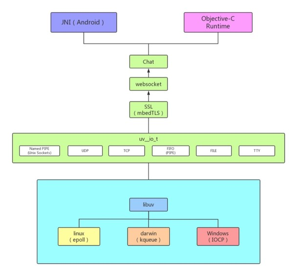
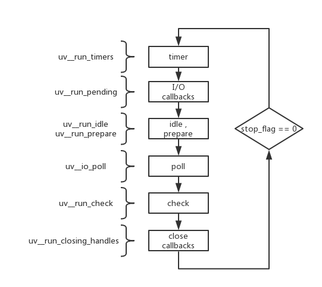
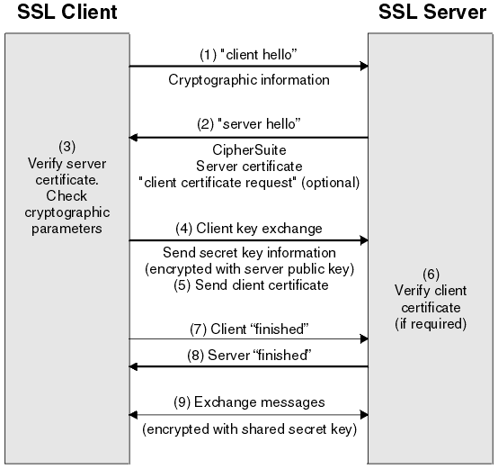
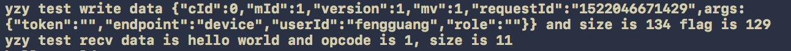

 
<!--BEGIN_DATA
{
    "create_date": "2018-05-02 09:19", 
    "modify_date": "2018-05-02 09:19", 
    "is_top": "0", 
    "summary": "跨平台长连接组件设计及可插拔改造", 
    "tags": "架构", 
    "file_name": "跨平台长连接组件设计及可插拔改造.md"
}
END_DATA-->

####<p>原文出处：<a href='http://zeeyang.com/2018/04/03/cross-platform-architecture%20design-and-pluggable/' target='blank'>跨平台长连接组件设计及可插拔改造.</a></p>


我们在提出开发跨平台组件之前， iOS 和 Android客户端分别使用一套长连接组件，需要双倍的人力开发和维护；在产品需求调整上，为了在实现细节上保持一致性也具有一定的难度；Web端与客户端长连接的形式不同，前者使用 WebSocket，后者使用 Socket ，无形中也增加了后端的维护成本。为了解决这些问题，我们基于WebSocket 协议开发了一套跨平台的长连接组件。

###架构介绍

组件自上而下分为五层：

* **Native层**：负责业务请求封装和数据解析，与原生进行交互
* **Chat层**：负责提供底层通信使用的 c 接口，包含连接、读写和关闭
* **WebSocket层**：实现 WebSocket 协议及维护心跳
* **TLS层**：基于 mbedTLS 实现 TLS 协议及数据加解密
* **TCP层**：基于 libuv 实现 TCP 连接和数据的读写

整体架构如下图所示：



####TCP层

TCP 层我们是基于libuv进行开发， libuv 是一个异步 I/O 库，并且支持了多个平台（ Linux ，Windows 和 Darwin ），一开始主要应用于开发 Node.js ，后来逐渐在其他项目也开始使用。文件、 网络和管道 等操作是 I/O 操作 ，libuv 为此抽象出了相关的接口，底层使用各平台上最优的 I/O 模型实现。

它的核心是提供了一个 event loop ，每个 event loop 包含了六个阶段：

* timers 阶段：这个阶段执行 timer（ setTimeout 、 setInterval ）的回调
* I/O callbacks 阶段：执行一些系统调用错误，比如网络通信的错误回调
idle , prepare 阶段：仅 node 内部使用 
* poll 阶段：获取新的 I/O 事件, 适当的条件下 node 将阻塞在这里
* check 阶段：执行 setImmediate() 的回调
* close callbacks 阶段：执行 socket 的 close 事件回调



####TLS层

mbedTLS（前身PolarSSL）是实现了一套易用的加解密算法和 SSL / TLS 库。TLS 以及前身 SSL 是传输层安全协议，给网络通信提供安全和数据完整性的保障，所以它能很好的解决数据明文和劫持篡改的问题。并且其分为记录层和传输层，记录层用来确定传输层数据的封装格式，传输层则用于数据传输，而在传输之前，通信双方需要经过握手，其包含了双方身份验证，协商加密算法，交换加密密钥。



####WebSocket 层

WebSocket 层包含了对协议的实现和心跳的维护。

其最新的协议是 13 RFC 6455。协议的实现分为握手，数据发送/读取，关闭连接。

#####握手

握手要从请求头去理解。

WebSocket 首先发起一个 HTTP 请求，在请求头加上 Upgrade 字段，该字段用于改变 HTTP 协议版本或者是换用其他协议，这里我们把 Upgrade 的值设为 websocket ，将它升级为 WebSocket 协议。

同时要注意 Sec-WebSocket-Key 字段，它由客户端生成并发给服务端，用于证明服务端接收到的是一个可受信的连接握手，可以帮助服务端排除自身接收到的由非 WebSocket 客户端发起的连接，该值是一串随机经过 base64 编码的字符串。

```
GET /chat HTTP/1.1
Host: server.example.com
Upgrade: websocket
Connection: Upgrade
Sec-WebSocket-Key: dGhlIHNhbXBsZSBub25jZQ==
Origin: http://example.com
Sec-WebSocket-Protocol: chat, superchat
Sec-WebSocket-Version: 13
```

收到请求后，服务端也会做一次响应：

```
HTTP/1.1 101 Switching Protocols
Upgrade: websocket
Connection: Upgrade
Sec-WebSocket-Accept: s3pPLMBiTxaQ9kYGzzhZRbK+xOo=
```

里面重要的是 Sec-WebSocket-Accept ，服务端通过从客户端请求头中读取 Sec-WebSocket-Key 与一串全局唯一的标识字符串（俗称魔串）“258EAFA5-E914-47DA- 95CA-C5AB0DC85B11”做拼接，生成长度为160位的 SHA-1 字符串，然后进行 base64 编码，作为 Sec-WebSocket-Accept 的值回传给客户端，客户端再去解析这个值，与自己加密编码后的字符串进行比较。

处理握手 HTTP 响应解析的时候，可以用 http-paser ，解析方式也比较简单，就是对头信息的逐字读取再处理，具体处理你可以看一下它的状态机实现。解析完成后你需要对其内容进行解析，看返回是否正确，同时去管理你的握手状态。

####数据发送/读取

数据的处理需要用帧协议图来说明：

```
0                   1                   2                   3
0 1 2 3 4 5 6 7 8 9 0 1 2 3 4 5 6 7 8 9 0 1 2 3 4 5 6 7 8 9 0 1
+-+-+-+-+-------+-+-------------+-------------------------------+
|F|R|R|R| opcode|M| Payload len |    Extended payload length    |
|I|S|S|S|  (4)  |A|     (7)     |             (16/64)           |
|N|V|V|V|       |S|             |   (if payload len==126/127)   |
| |1|2|3|       |K|             |                               |
+-+-+-+-+-------+-+-------------+ - - - - - - - - - - - - - - - +
|     Extended payload length continued, if payload len == 127  |
+ - - - - - - - - - - - - - - - +-------------------------------+
|                               |Masking-key, if MASK set to 1  |
+-------------------------------+-------------------------------+
| Masking-key (continued)       |          Payload Data         |
+-------------------------------- - - - - - - - - - - - - - - - +
:                     Payload Data continued ...                :
+ - - - - - - - - - - - - - - - - - - - - - - - - - - - - - - - +
|                     Payload Data continued ...                |
+---------------------------------------------------------------+
```

首先我们来看看数字的含义，数字表示位，0-7表示有8位，等于1个字节。

```
0 1 2 3 4 5 6 7 8 9 0 1 2 3 4 5 6 7 8 9 0 1 2 3 4 5 6 7 8 9 0 1
```

所以如果要组装一个帧数据可以这样子：

```
char *rev = (rev *)malloc(4);
rev[0] = (char)(0x81 & 0xff);
rev[1] = 126 & 0x7f;
rev[2] = 1;
rev[3] = 0;
```

ok，了解了帧数据的样子，我们反过来去理解值对应的帧字段。

首先0x81是什么，这个是十六进制数据，转换成二进制就是1000 0001， 是一个字节的长度，也就是这一段里面每一位的值：

```
0 1 2 3 4 5 6 7 8 
+-+-+-+-+-------+
|F|R|R|R| opcode|
|I|S|S|S|  (4)  |
|N|V|V|V|       |
| |1|2|3|       |
+-+-+-+-+-------+
```

* FIN 表示该帧是不是消息的最后一帧，1表示结束，0表示还有下一帧。

* RSV1, RSV2, RSV3 必须为0，除非扩展协商定义了一个非0的值，如果没有定义非0值，且收到了非0的 RSV ，那么 WebSocket 的连接会失效，建议是断开连接。

* opcode 用来描述 Payload data 的定义，如果收到了一个未知的 opcode ，同样会使 WebSocket 连接失效，协议定义了以下值：
	
	* %x0 表示连续的帧
	* %x1 表示 text 帧
	* %x2 表示二进制帧
	* %x3-7 预留给非控制帧
	* %x8 表示关闭连接帧
	* %x9 表示 ping
	* %xA 表示 pong
	* %xB-F 预留给控制帧

连续帧是和 FIN 值相关联的，它表明可能由于消息分片的原因，将原本一个帧的数据分为多个帧，这时候前一帧的 opcode 就是0，FIN 也是0，最后一帧的 opcode 就不再是0，FIN 就是1了。

再可以看到 opcode 预留了非控制帧和控制帧，这两个又是什么？

控制帧表示 WebSocket 的状态信息，像是定义的分片，关闭连接，ping和pong。

非控制帧就是数据帧，像是 text 帧，二进制帧。

0xff 作用就是取出需要的二进制值。

下面再来看126，126则表示的是 Payload len ，也就是 Payload 的长度：

```
                8 9 0 1 2 3 4 5 6 7 8 9 0 1 2 3 4 5 6 7 8 9 0 1
                +-+-------------+-------------------------------+
                |M| Payload len |    Extended payload length    |
                |A|     (7)     |             (16/64)           |
                |S|             |   (if payload len==126/127)   |
                |K|             |                               |
+-+-+-+-+-------+-+-------------+ - - - - - - - - - - - - - - - +
|     Extended payload length continued, if payload len == 127  |
+ - - - - - - - - - - - - - - - +-------------------------------+
|                               |Masking-key, if MASK set to 1  |
+-------------------------------+-------------------------------+
| Masking-key (continued)       |           Payload Data        |
+-------------------------------- - - - - - - - - - - - - - - - +
:                     Payload Data continued ...                :
+ - - - - - - - - - - - - - - - - - - - - - - - - - - - - - - - +
|                     Payload Data continued ...                |
+---------------------------------------------------------------+
```

* MASK 表示Playload data 是否要加掩码，如果设成1，则需要赋值 Masking-key 。所有从客户端发到服务端的帧都要加掩码

* Playload le 表示 Payload 的长度，这里分为三种情况

	* 长度小于126，则只需要7位
	* 长度是126，则需要额外2个字节的大小，也就是 Extended payload length
	* 长度是127，则需要额外8个字节的大小，也就是 Extended payload 
	length + Extended payload length continued ，Extended payload length 是2个字节，Extended payload length continued 是6个字节

* Extended Playload len 则表示 Extension data 与 Application data 的和
* Masking-key 是在 MASK 设置成1之后，随机生成的4字节长度的数据，然后和 Payload Data做异或运算

* Payload Data 就是我们发送的数据

而数据的发送和读取就是对帧的封装和解析。

####关闭连接

关闭连接分为两种：服务端发起关闭和客户端主动关闭。

服务端跟客户端的处理基本一致，以服务端为例：

服务端发起关闭的时候，会客户端发送一个关闭帧，客户端在接收到帧的时候通过解析出帧的opcode来判断是否是关闭帧，然后同样向服务端再发送一个关闭帧作为回应。

###Chat 层

Chat 层比较简单，只是提供一些通用的连接、读写数据和断开接口和回调，同时维护一个 loop 用于重连。

###Native 层

这一层负责和原生进行交互，由于组件是用 c 代码编写的，所以为了调用原生方法，Android 采用 JNI 的方式，iOS 采用 runtime 的方式来实现。

JNI ：

```
JNIEXPORT void JNICALL
Java_com_youzan_mobile_im_network_Channel_nativeDisconnect(JNIEnv *env, jobject jobj) {
    jclass clazz = env->GetObjectClass(jobj);
    jfieldID fieldID = env->GetFieldID(clazz, CONTEXT_VARIABLE, "J");
    context *c = (context *) env->GetLongField(jobj, fieldID);
    im_close(c);
}
```
runtime:

```
void sendData(int cId, int mId, int version, int mv, const char *req_id, const char *data {
    context *ctx = (context *)objc_msgSend(g_obj, sel_registerName("ctx"));
    send_request(ctx, cId, mId, version, mv, req_id, data);
}
```

###插拔式架构改造

在实现了一套跨端长连接组件之后，最近我们又完成了其插件化的改造，为什么要做这样的改造呢？由于业务环境复杂和运维的相关限制，有的业务方可以配置 TLS 组成 WSS；有的业务方不能配置，只能以明文 WebSocket 的方式传输；有的业务方甚至连 WebSocket 的承载也不要，转而使用自定义的协议。随着对接的业务方增多，我们没办法进行为他们一一定制。我们当初设计的结构是 Worker (负责和业务层通信) -> WebSocket -> TLS -> TCP ，这四层结构是耦合在一起的，这时候如果需要剔除 TLS 或者扩展一个新的功能，就会改动相当多的代码。基于以上几点，我们发现，原先的定向设计完全不符合要求，为了接下来可能会有新增协议解析的预期，同时又不改变使用 libuv 进行跨平台的初衷，所以我们就实施了插件化的改造，最重要的目的是为了解耦，同时也为了提高组件的灵活性，实现可插拔（冷插拔）。

###解耦

首先我们要对四层结构的职责进行明确

* Worker ：提供业务接口和回调
* WebSocket ：负责 WebSocket 握手，封装/解析帧数据和维护心跳
* TLS ：负责 TLS 握手和数据的加解密
* TCP：TCP 连接和数据的读写

以及整理出结构间的执行调用：


其中 connect 包含了连接和握手两个过程。在完成链路层连接后，我们认为协议层握手完成，才算是真正的连接成功。

同样的，数据读写、连接关闭、连接销毁和重置都会严格按照结构的顺序依次调用。

###可插拔改造

解耦完成之后我们发现对于接口的调用都是显式的，比如 Worker send data 中调用 WebSocket send data ， WebSocket send data 中又调用 TLS send data ，这样的显式调用是因为我们知道这些接口是可用的，但在插件化中某个插件可能没有被使用，这样接口的调用会在某一层中断而导致整个组件的不可用。

###结构体改造

所以我们首先考虑到的是抽象出一个结构体，将插件的接口及回调统一，然后利用函数指针实现插件方法的调用，以下是对函数指针声明：

```
/* handle */
typedef int (*node_init)(dul_node_t *node, map_t params);
typedef void (*node_conn)(dul_node_t *node);  
typedef void (*node_write_data)(dul_node_t *node,
                                const char *payload,
                                unsigned long long payload_size,
                                void *params);
typedef int (*node_read_data)(dul_node_t *node, 
                              void *params, 
                              char *payload, 
                              uint64_t size);                    
typedef void (*node_close)(dul_node_t *node);                           
typedef void (*node_destroy)(dul_node_t *node);
typedef void (*node_reset)(dul_node_t *node);
 
/* callback */
typedef void (*node_conn_cb)(dul_node_t *node, int status);
typedef void (*node_write_cb)(dul_node_t *node, int status);                         
typedef int (*node_recv_cb)(dul_node_t *node, void *params, uv_buf_t *buf, ssize_t size);
typedef void (*node_close_cb)(dul_node_t *node);
```

但如果仅仅声明这些函数指针，在使用时还必须知道插件的结构体类型才能调用到函数的实现，这样插件之间仍然是耦合的。所以我们必须将插件提前关联起来，通过结构体指针来寻找上一个或者下一个插件，OK，这样就很容易联想到双向链表正好能够满足我们的需求。所以加上 pre 、 next 以及一些必要参数后，最终我们整理的结构体为：

```
typedef struct dul_node_s {
 	// 前、后插件
    dul_node_t *pre;
    dul_node_t *next;

    // 必要参数
    char *host;
    int port;
    map_t params;

    node_init init;
    node_conn conn;
    node_write_data write_data;
    node_read_data read_data;
    node_close close;
    node_destroy destroy;
    node_reset reset;

    node_conn_cb conn_cb;
    node_write_cb write_cb;
    node_recv_cb recv_cb;
    node_close_cb close_cb;
} dul_node_t;
```


接着我们再对原有的结构体进行调整，将结构体前面的成员调整为 dul_node_s 结构体的成员，后面再加上自己的成员。这样在插件初始化的时候统一以 dul_node_s 结构体初始化，而在用到具体某一个插件时我们进行结构体类型强转即可，这里有点像继承里父类和子类的概念。

###插件注册

在插件使用前我们按需配置好用到的插件，但如果把插件接口直接暴露给业务方来配置，就需要让业务方接触到 C 代码，这点比较难以控制。基于这个原因，我们讨论了一下，想到前端里面 webpack 对于插件配置的相关操作，于是我们查阅了 webpack 的相关文档，最终我们仿照这个方式实现了我们的插件配置："ws?path=/!tls!uv" 。不同插件以 ! 分割，通过循环将插件依次创建：

```
void separate_loaders(tokenizer_t *tokenizer, char *loaders, context *c) {
    char *outer_ptr = NULL;
    
    char *p = strtok_r(loaders, "!", &outer_ptr);
    dul_node_t *pre_loader = (dul_node_t *)c;
    while (p) {
        pre_loader = processor_loader(tokenizer, p, pre_loader);
        p = strtok_r(NULL, "!", &outer_ptr);
    }
}
```

单个插件所需要额外的 params 以 query string 形式拼接，在插件创建中用 ? 分割出来 ，以 kv 形式放入到一个 hashmap 中。再根据插件的名称调用对应的初始化方法，并根据传入的 pre_loader 绑定双向链表的前后关系：

```
voidd (*oper_func[])(oper_func[ dul_node_t **) = {
    ws_alloc,
    tls_alloc,
    uv_alloc,
};

char const *loaders[] = {
    "ws", "tls", "uv"
};

dul_node_t *processor_loader(tokenizer_t *tokenizer, const char *loader, dul_node_t *pre_loader) {
    char *p = loader;
    char *inner_ptr = NULL;

    /* params 提取组装 */
    p = strtok_r(p, "?", &inner_ptr);
    dul_node_t *node = NULL;
    map_t params = hashmap_new();
    params_parser(inner_ptr, params);

    /* 这里采用转移表，进行插件初始化 */
    while (strcmp(loaders[sqe], p) != 0) {
        sqe++;
    }
    oper_func[sqe](&node);
    
    if (node == NULL) {
        return NULL;
    }
    node->init(node, params);
    hashmap_free(params);

    // 双向链表前后关系绑定
    pre_loader->next = node;
    node->pre = pre_loader;
    return node;
}

/* params string 解析 */
void params_parser(char *query, map_t params) {
    char *outer_ptr = NULL;
    char *p = strtok_r(query, "&", &outer_ptr);
    while (p) {
        char *inner_ptr = NULL;
        char *key =  strtok_r(p, "=", &inner_ptr);
        hashmap_put(params, key, inner_ptr);
        p = strtok_r(NULL, "&", &outer_ptr);
    }
}
```

Tips：随着插件的增加，对应初始化的代码也会越来越多，而且都是重复代码，为了减少这部分工作，我们可以采取宏来定义函数。后续如果增加一个插件，只需要在底下加一行 LOADER_ALLOC(zim_xx, xx) 即可。

```
#define LOADER_ALLOC(type, name)                    \
    void name##_alloc(dul_node_t **ctx) {           \
        type##_t **loader = (type##_t **)ctx;       \
        (*loader) = malloc(sizeof(type##_t));       \
        (*loader)->init = &name##_init;             \
        (*loader)->next = NULL;                     \
        (*loader)->pre = NULL;                      \
    }                       

LOADER_ALLOC(websocket, ws);
LOADER_ALLOC(zim_tls, tls);
LOADER_ALLOC(zim_uv, uv);
```

###接口调用

再回到一开始我们思考接口调用的问题，由于有了函数指针变量，我们就需要在插件的初始化中把函数的地址存储在这些变量中：

```
int ws_init(dul_node_t *ctx, map_t params) {
    websocket_t *ws = (websocket_t *)ctx;
    bzero(ws, sizeof(websocket_t));
    
    // 省略中间初始化过程
  
    ws->init = &ws_init;
    ws->conn = &ws_connect;
    ws->close = &ws_close;
    ws->destroy = &ws_destroy;
    ws->reset = &ws_reset;
    ws->write_data = &ws_send;
    ws->read_data = &ws_read;
    ws->conn_cb = &ws_conn_cb;
    ws->write_cb = &ws_send_cb;
    ws->recv_cb = &ws_recv_cb;
    ws->close_cb = &ws_close_cb;
    return OK;
}
```

对比接口前后调用的方式，前者需要知道下一个 connect 函数，并进行显式调用，如果在 TLS 和 TCP 中新增一层，就需要改动 connect 函数的调用。但后者完全没有这个顾虑，不论是新增还是删除插件，它都可以通过指针找到对应的结构体，调用其 connect 函数，插件内部无需任何改动，岂不妙哉。

```
/* 改造前 */
int tls_ws_connect(tls_ws_t *handle,
                   tls_ws_conn_cb conn_cb,
                   tls_ws_close_cb close_cb) {
	...

    return uv_tls_connect(tls,
                          handle->host,
                          handle->port,
                          on__tls_connect);
}

/* 改造后 */
static void tls_connect(dul_node_t *ctx) {
    zim_tls_t *tls = (zim_tls_t *)ctx;
    
    ...

    if (tls->next && tls->next->conn) {
        tls->next->host = tls->host;
        tls->next->port = tls->port;
        tls->next->conn(tls->next);
    }
}
```

###新增插件

基于改造后组件，新增插件只需要改动三处，以日志插件为例：

* 增加日志文件

在头文件中定义 zim_log_s 结构体（这里没有额外的成员）：

```
typedef struct zim_log_s zim_log_t;

struct zim_log_s {
    dul_node_t *pre;
    dul_node_t *next;

    char *host;
    int port;
    map_t params;

    node_init init;
    node_conn conn;
    node_write_data write_data;
    node_read_data read_data;
    node_close close;
    node_destroy destroy;
    node_reset reset;

    node_conn_cb conn_cb;
    node_write_cb write_cb;
    node_recv_cb recv_cb;
    node_close_cb close_cb;
};
```

在实现文件中实现接口及回调，注意：即使接口或回调内没有额外的操作，仍然需要实现，例如此处的 log_conn_cb 和 log_connect ，否则上一个插件或下一个插件在日志层调用时会中断：

```
/* callback */
void log_conn_cb(dul_node_t *ctx, int status) {
    zim_log_t *log = (zim_log_t *)ctx;
    if (log->pre && log->pre->conn_cb) {
        log->pre->conn_cb(log->pre, status);
    }
}

/* 省略中间直接回调 */

int log_recv_cb(dul_node_t *ctx, void *params, uv_buf_t *buf, ssize_t size) {
    /* 收集接收到的数据 */
    recv_data_from_server(buf->base, params, size);
    
    /* 继续向上一层插件回调接收到的数据 */
    zim_log_t *log = (zim_log_t *)ctx;
    if (log->pre && log->pre->recv_cb) {
        log->pre->recv_cb(log->pre, opcode, buf, size);
    }
    return OK;
}

/* log hanlder */
int log_init(dul_node_t *ctx, map_t params) {
    zim_log_t *log = (zim_log_t *)ctx;
    bzero(log, sizeof(zim_log_t));

    log->init = &log_init;
    log->conn = &log_connect;
    log->write_data = &log_write;
    log->read_data = &log_read;
    log->close = &log_close;
    log->destroy = &log_destroy;
    log->reset = &log_reset;
    log->conn_cb = &log_conn_cb;
    log->write_cb = &log_write_cb;
    log->recv_cb = &log_recv_cb;
    log->close_cb = &log_close_cb;

    return OK;
}

static void log_connect(dul_node_t *ctx) {
    zim_log_t *log = (zim_log_t *)ctx;
    if (log->next && log->next->conn) {
        log->next->host = log->host;
        log->next->port = log->port;
        log->next->conn(log->next);
    }
}

/* 省略中间直接调用 */

static void log_write(dul_node_t *ctx, 
                      const char *payload, 
                      unsigned long long payload_size,
                      void *params) {
    /* 收集发送数据 */
    send_data_to_server(payload, payload_size, params);

    /* 继续往下一层插件写入数据 */
    zim_log_t *log = (zim_log_t *)ctx;
    if (log->next && log->next->write_data) {
        log->next->write_data(log->next, payload, payload_size, flags);
    }                           
}
```

* 增加日志初始化函数及修改转移表

```
LOADER_ALLOC(zim_log, log);
    
void (*oper_func[])(dul_node_t **) = {
    ws_alloc,
    tls_alloc,
    uv_alloc,
    log_alloc,
};

char const *loaders[] = {
    "ws", "tls", "uv", "log"
};
```

* 修改插件注册

```
/* 增加日志前 */
char loaders[] = "ws?path=/!tls!uv";
context_init(c, "127.0.0.1", 443, "", "", "", "", NULL, loaders);

/* 增加日志后 */
char loaders[] = "log!ws?path=/!log!tls!uv";
context_init(c, "127.0.0.1", 443, "", "", "", "", NULL, loaders);
```

我们重新运行程序，就能发现日志功能已经成功的配置上去，能够将接受和发送的数据上报：



###总结

回顾一下跨平台长连接组件的设计，我们使用 libuv 和 mbedtls 分别实现 TCP 和 TLS ，参照 WebSocket 协议实现了其握手及数据读写，同时抽象出通信接口及回调，为了和原生层交互，iOS 和 Android 分别采用 runtime 消息发送和 JNI 进行原生方法调用。

但这样的定向设计完全不符合后期可能会有新增协议解析的预期，所以我们进行了插件化改造，其三个核心点是结构体改造、双向链表和函数指针。

我们通过将插件行为抽象出一个结构体，利用双向链表将前后插件绑定在一起，使用函数指针调用具体插件的函数或回调。

这样做的优点是使得插件之间不存在耦合关系，只需保持逻辑顺序上的关系，同时通过修改插件的注册提高了灵活性，使得组件具有可插拔性（冷插拔）。

但在新增组件中我们需要实现所有的接口和回调，如果数量多的话，这还真是一件比较繁琐的事情。


