 
<!--BEGIN_DATA
{
    "create_date": "2021-11-11 21:30", 
    "modify_date": "2021-11-11 21:30", 
    "is_top": "0", 
    "summary": "通俗讲解深度学习和神经网络 通俗易懂谈强化学习", 
    "tags": "机器学习", 
    "file_name": "通俗讲解深度学习、神经网络、强化学习.md"
}
END_DATA-->

#### 
原文出处：<a href='https://mp.weixin.qq.com/s/nipVK7biVf4IoidPMiU-iw' target='blank'>通俗讲解深度学习和神经网络</a>

**前言：**本篇文章主要面向产品、业务、运营人员等任何非技术人员通俗易懂地讲解什么是深度学习和神经网络，二者的联系和区别是什么。无需技术背景也可以有一个比较全面清晰的认识。同时也为为大家讲解TensorFlow、Caffe、Pytorch等深度学习框架和目前工业界深度学习应用比较广的领域。  

## 1 人工智能、机器学习、深度学习

### 1.1 人工智能是什么

在介绍深度学习之前，先和大家介绍一下AI和Machine Learning，才能理清AI、Machine Learning、Deep Learning三者之间的关系。

1956年8月，在美国汉诺斯小镇的达特茅斯学院中，几位科学家在会议上正式提出“人工智能”这一概念，这一年也被称为人工智能元年。在此之前，人类已经制造出各类各样的机器如汽车、飞机等，但这些机器都需要经过人来操作使用，无法自己具备操作的能力。科学家探讨能不能制造出一个可以像人类大脑的一样思考的机器，拥有人类的智慧，这就是人工智能。

同时科学家们也对AI未来的发展畅想了三个阶段：

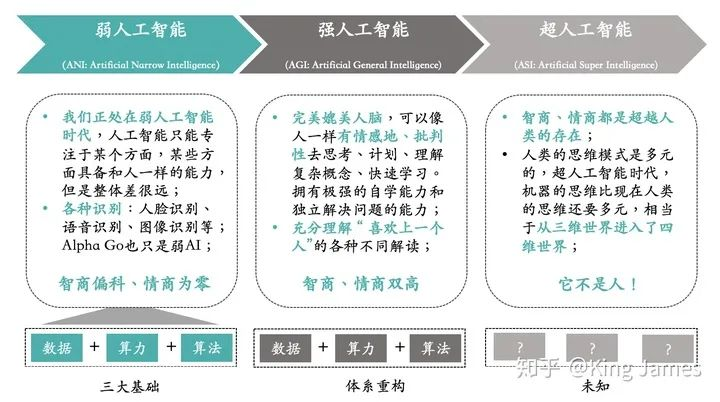

大家在电影上看到的各种AI都是强人工智能，但目前我们仍处在弱人工智能阶段，什么时候进入强人工智能阶段未知。强人工智能阶段，机器可以完美媲美人脑，像人类一样有情感地、批判性地去思考。同时可以快速学习，拥有极强的自学能力。

那么如何实现人工智能，实现人工智能的方法是什么？

### 1.2 机器学习是什么

实现人工智能的方法我们统称为“机器学习”。同样是1956年的美国达特茅斯会议上，IBM的工程师Arthur Samuel正式提出“Machine Learning”这个概念，1956年真的是特殊的一年。

机器学习既是一种实现AI的方法，又是一门研究如何实现AI的学科，你可以理解为和数学、物理一样的学科。机器学习，简单来说就是从历史数据中学习规律，然后将规律应用到未来中。国内大家一致推荐的，南京大学周志华教授的机器学习教材西瓜书里面如此介绍机器学习。

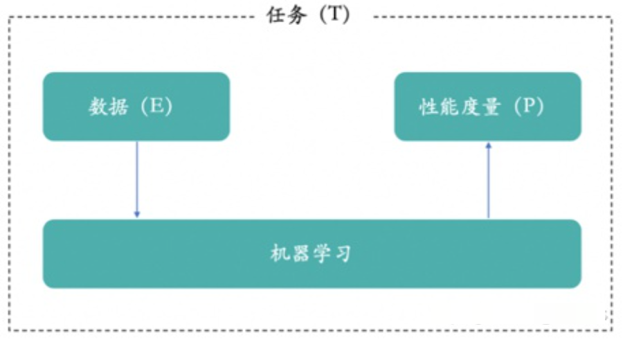

机器学习是机器从历史数据中学习规律，来提升系统的某个性能度量。其实人类的行为也是通过学习和模仿得来的，所以我们就希望计算机和人类的学习行为一样，从历史数据和行为中学习和模仿，从而实现AI。  

**简单点讲**，大家从小到大都学习过数学，刷过大量的题库。老师和我们强调什么？要学会去总结，从之前做过的题目中，总结经验和方法。总结的经验和方法，可以理解为就是机器学习产出的模型，然后我们再做数学题利用之前总结的经验和方法就可以考更高的分。有些人总结完可以考很高的分，说明他总结的经验和方法是对的，他产出的的模型是一个好模型。

既然有了机器学习这一方法论，科学家们基于这一方法论，慢慢开始提出各类各样的算法和去解决各种“智能”问题。就像在物理学领域，物理学家们提出各种各样的定理和公式，不断地推动着物理学的进步。牛顿的三大定律奠定了经典力学的基础。而传统机器学习的决策树、贝叶斯、聚类算法等奠定了传统机器学习的基础。

### 1.3 深度学习是什么

但是随着研究的不断深入，传统机器学习算法在很多“智能”问题上效果不佳，无法实现真正的“智能”。就像牛顿三大定律，无法解释一些天文现象。在1905年，爱因斯坦提出“相对论”，解释了之前牛顿三大定律无法解释的天文现象。同样2006年，加拿大多伦多大学教授Geoffrey Hinton对传统的神经网络算法进行优化，在此基础上提出了Deep Neural Network的概念，他们在《Science》上发表了一篇Paper，引起Deep Learning在学术界研究的热潮。（paper原文：http://www.cs.toronto.edu/~hinton/science.pdf）

2012年Geoffrey Hinton老爷子的课题组，在参加业界知名的ImageNet图像识别大赛中，构建的CNN网络AlexNet一举夺得冠军，且碾压第二名（SVM方法）。也正是因为该比赛，Deep Learning引起了工业界的关注，迅速将Deep Learning引进到工业界的应用上。深度学习技术解决了很多传统机器学习算法效果不佳的“智能”问题，尤其是图片识别、语音识别和语义理解等。某种程度上，深度学习就是机器学习领域的相对论。

将人工智能和机器学习带到一个新高度的技术就是：Deep Learning。深度学习是一种机器学习的技术。

同时大家应该听到过一大堆的“学习”名词：机器学习、深度学习、强化学习等等。在这里面机器学习是“爸爸”，是父节点；其他都是它“儿子”，是子节点。AI、Machine Learning和Deep Learning的关系可以通过下图进行描述。

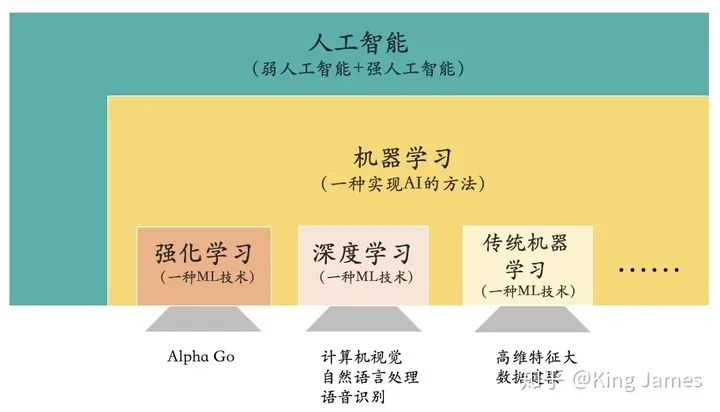

让机器实现人工智能是人类的一个美好愿景，而机器学习是实现AI的一种方法论，深度学习是该方法论下一种新的技术，在图像识别、语义理解和语音识别等领域具有优秀的效果。（对强化学习感兴趣的读者可以参考：https://zhuanlan.zhihu.com/p/150451604）

那么深度学习到底是一门什么技术？“深度”到底代表什么？

## 2 深度学习与神经网络

### 2.1 生物神经网络

介绍深度学习就必须要介绍神经网络，因为深度学习是基于神经网络算法的，其实最开始只有神经网络算法，上文也提到2006年Geoffrey Hinton老爷子提出Deep Learning，核心还是人工神经网络算法，换了一个新的叫法，最基本的算法没有变。学过生物的都知道神经网络是什么？下图是生物神经网络及神经元的基本组成部分。

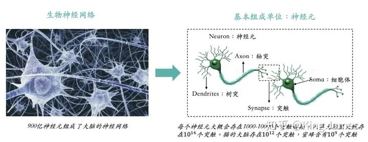

人类的大脑可以实现如此复杂的计算和记忆，就完全靠900亿神经元组成的神经网络。那么生物神经网络是如何运作的？可以参照下图：

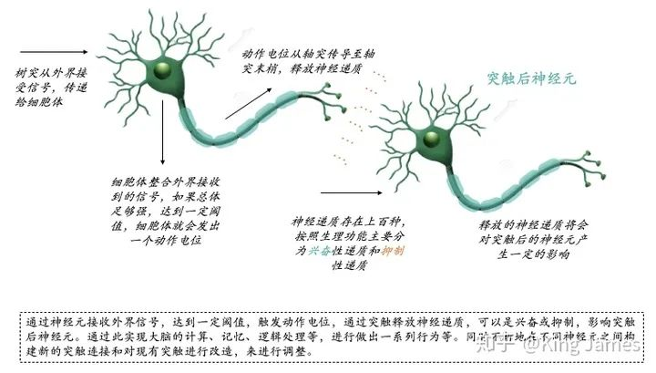

通过神经元接收外界信号，达到一定阈值，触发动作电位，通过突触释放神经递质，可以是兴奋或抑制，影响突触后神经元。通过此实现大脑的计算、记忆、逻辑处理等，进行做出一系列行为等。同时不断地在不同神经元之间构建新的突触连接和对现有突触进行改造，来进行调整。有时候不得不感叹大自然的鬼斧神工，900亿神经元组成的神经网络可以让大脑实现如此复杂的计算和逻辑处理。

### 2.2 人工神经网络

科学家们从生物神经网络的运作机制得到启发，构建了人工神经网络。其实人类很多的发明都是从自然界模仿得来的，比如飞机和潜艇等。下图是最经典的MP神经元模型，是1943年由科学家McCulloch和Pitts提出的，他们将神经元的整个工作过程抽象为下述的模型。

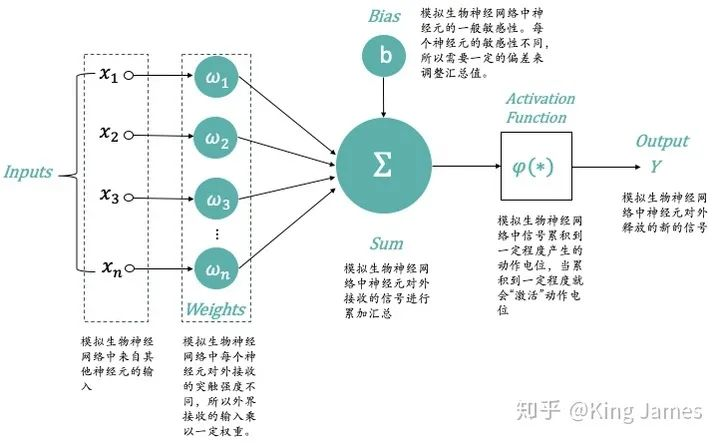

  * `x_1，x_2，x_3，x_n`：模拟生物神经网络中来自其他神经元的输入；
  * `ω_1，ω_2，ω_3，ω_n`：模拟生物神经网络中每个神经元对外接收的突触强度不同，所以外界接收的输入乘以一定权重；
  * `Σ-Sum`：模拟生物神经网络中神经元对外接收的信号进行累加汇总；
  * `Bias`：模拟生物神经网络中神经元的一般敏感性。每个神经元的敏感性不同，所以需要一定的偏差来调整汇总值；
  * `Activation Function`：模拟生物神经网络中信号累积到一定程度产生的动作电位，当累积到一定程度就会“激活”动作电位。实际使用时我们一般使用Sigmoid函数；
  * `Output`：模拟生物神经网络中神经元对外释放的新的信号；

现在我们知道了最简单的神经元模型，我们该如何使用该模型从历史数据中进行学习，推导出相关模型？我们使用上述MP模型学习一个最简单的二分类模型。

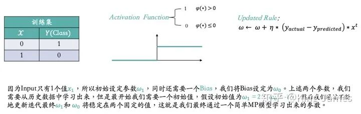

如上图，为了训练简单，我们训练集里面只有两条数据。同时激活函数，我们也是最简单的激活函数，当φ(∗) > 0时输出为1，当φ(∗) ≤ 0时输出为0。然后对于参数的更新规则Updated Rule，我们使用的Sequential Delta learning rule和Back Propag ation算法，该规则和算法不详细介绍了，可以理解为就像物理、数学领域一些科学家发现的普适性定理和公式，已经得到证明，用就完事了。因为Input只有1个值`x_1`，所以初始设定参数`ω_1`，同时还需要一个Bias，我们将Bias设定为`ω_0`。上述两个参数，我们需要从历史数据中学习出来，但是最开始我们需要一个初始值，假设初始值为`ω_1 = 2`， `ω_0 = 1.5` ；然后我们通过不断地更新迭代最终`ω_1`和 `ω_0`将稳定在两个固定的值，这就是我们最终通过一个简单MP模型学习出来的参数。下图是整个更新迭代学习的过程：

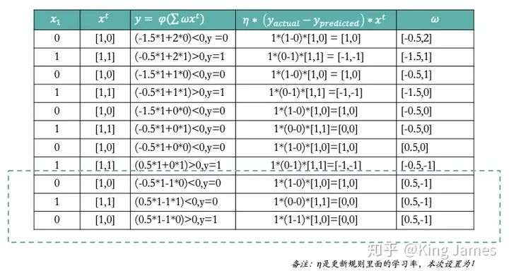

大家可以看到上图最后一次循环ω已经不再发生变化，说明[0.5,-1]就是最终我们学习出来的固定参数。那么上述整个过程就是一个通过神经网络MP模型学习的全过程。下图是最终学习出来的Classifier分类器，我们带入一个新的数据，就可以进行Class预测了。

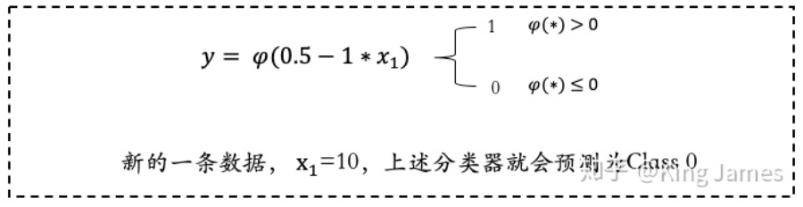

### 2.3 何为”深度“  

上文我们已经介绍了人工神经网络经典的MP模型，那么在深度学习里面我们使用的是什么样的神经网络，这个”深度“到底指的是什么？其实就是如下图所示的，输入层和输出层之间加更多的”Hidden Layer“隐藏层，加的越多越”深“。

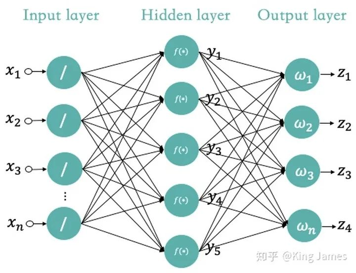

最早的MP神经网络实际应用的时候因为训练速度慢、容易过拟合、经常出现梯度消失以及在网络层次比较少的情况下效果并不比其他算法更优等原因，实际应用的很少。中间很长一段时间神经网络算法的研究一直处于停滞状态。人们也尝试模拟人脑结构，中间加入更多的层”Hidden Layer“隐藏层，和人脑一样，输入到输出中间要经历很多层的突触才会产生最终的Output。加入更多层的网络可以实现更加复杂的运算和逻辑处理，效果也会更好。

但是传统的训练方式也就是我Part 2.2里面介绍的：随机设定参数的初始值，计算当前网络的输出，再根据当前输出和实际Label的差异去更新之前设定的参数，直到收敛。这种训练方式也叫做Back Propagation方式。Back Propagation方式在层数较多的神经网络训练上不适用，经常会收敛到局部最优上，而不是整体最优。同时Back Propagation对训练数据必须要有Label，但实际应用时很多数据都是不存在标签的，比如人脸。

当人们加入更多的”Hidden Layer“时，如果对所有层同时训练，计算量太大，根本无法训练；如果每次训练一层，偏差就会逐层传递，最终训练出来的结果会严重欠拟合（因为深度网络的神经元和参数太多了）。

所以一直到2006年，Geoffrey Hinton老爷子提出了一种新的解决方案：**无监督预训练对权值进行初始化+有监督训练微调。**

归纳一下Deep Learning与传统的神经网络算法最大的三点不同就是：

  * **训练数据**：传统的神经网络算法必须使用有Label的数据，但是Deep Learning下不需要；
  * **训练方式不同**：传统使用的是Back Propagation算法，但是Deep Learning使用自下上升非监督学习，再结合自顶向下的监督学习的方式。对于监督学习和非监督学习概念不清楚的读者可以阅读我上文引用的强化学习文章，里面有详细介绍。
  * **层数不同**：传统的神经网络算法只有2-3层，再多层训练效果可能就不会再有比较大的提升，甚至会衰减。同时训练时间更长，甚至无法完成训练。但是Deep Learning可以有非常多层的“Hidden Layer”，并且效果很好。

(想了解更多细节的可以阅读：https://blog.csdn.net/zouxy09/article/details/8775518)

不管怎么样Deep Learning也还是在传统神经网络算法基础上演变而来的，它还是一种基于神经网络的算法。今天已经是2021年了，深度学习在很多领域得到了广泛的应用，而且和很多其他学习也结合起来一起使用，比如深度强化学习，有种物理化学专业的赶脚。

MIT讲解了Deep Learning最新的一些研究和应用，详情可以关注这个B站视频：https://www.bilibili.com/video/BV1vg4y1B7Nz?from=search&seid=6689440565680809808。知乎上也有作者解读过这个视频@套牌神仙。

## 3. 深度学习框架

大家了解深度学习和神经网络以后，相信大家也经常听到如下的英文单词：Tensorflow、Caffe、Pytorch等，这些都是做什么的了。Tensorflow是Google旗下的开源软件库，里面含有深度学习的各类标准算法API和数据集等，Pytorch是Facebook旗下的开源机器学习库，也包含了大量的深度学习标准算法API和数据集等。Caffe是贾扬清大神在UC Berkeley读博士时开发的深度学习框架，2018年时并入到了Pytorch中。

因为深度学习发展至今，很多算法都已经是通用的，而且得到过验证的。那么有些公司就希望将一些标准算法一次性开发好，封装起来，后面再使用时直接调用引入即可，不需要再写一遍。就像大家小时候学习英文一样，英文字典有牛津版本的，也有朗文版本的。对于收录的英文单词，英文单词如何使用，如何造句等，已经有了标准的用法。我们只需要查阅这些字典即可，而Tensorflow、Caffe、Pytorch做的其实也就是计算机届的牛津、朗文英文大词典。国内百度目前也有自己的深度学习框架Paddle-Paddle。

目前一般是学术界用Pytorch较多，Pytorch更适合新手入门，上手快。工业界用Tensorflow较多，更适合工业界的落地和部署等。

## 4. 深度学习在工业界主要应用领域

目前深度学习应用最广泛的就是传统机器学习算法解决不了的领域或者是效果不佳的领域：视觉、自然语言和语音识别领域。当样本数量少的时候，传统机器学习算法还可以通过一些结构化特征组合在一起然后区分出来。比如区分汽车和摩托车，可以通过轮子数量。但对于人脸，千万张人脸相似的太多，已经完全无法通过鼻子、头发、眼睛这些简单的特征组合进行区分。需要探索更多更复杂的特征，组合在一起才能将千万张人脸区分开来。

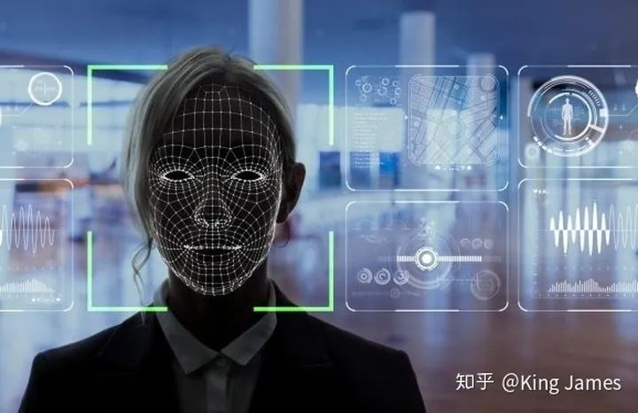

所以这时候就需要Deep Learning构建多层神经网络，探索组合更多的特征，才能识别区分千万级别甚至亿万级别的人脸。这在传统神经网络算法和机器学习算法是完全实现不了的。当然实现上述功能，也是因为现阶段有了更多的数据可以进行训练，同时有了更好的算力可以快速完成训练。传统的CPU进行训练，可能训练几个月都训练不出来结果。GPU的出现和改进加速了上述训练过程。

目前应用最广的一些领域：

  * **CV：**计算机视觉领域。随处可见的人脸识别、物体识别和文字识别OCR。广泛应用于安防领域，同时零售行业也在通过CV技术实现线下门店的数字化。目前国内头部公司就是CV四小龙：商汤、旷视、云从、依图；
  * **NLP：**自然语言处理领域。目前整体的NLP技术还是不够成熟，无法实现人们设想的机器人可以完全智能对话，机器人目前只能做一些简单的信息提取和检索整合的事情。NLP目前也是最难做的，同样一句话可能会有不同种意思。人有时都很难理解，更何况机器。目前国内头部公司主要是百度和达观；

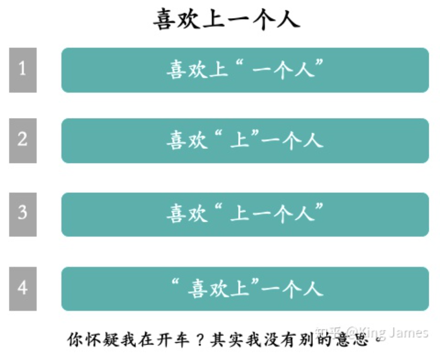

  * **ASR**：语音识别领域。目前国内独一档就是科大讯飞，尤其是能够做到很多地方方言的精准识别。语音识别目前主要主要用在语音客服上，有时候大家接到的推销电话其实背后都是电话机器人打的。电话机器人能够完全和用户进行对话，一定程度上也需要NLP的技术，因为它需要理解用户的意思。
  * **Autopilot**：自动驾驶其实也是CV的衍生领域，目前世界上做自动驾驶最好的其实还是汽车公司比如特斯拉。因为没有车，自动驾驶想获得训练数据都很困难。没有车，自动驾驶技术想实验都跑不通。目前国内百度差不多算第一档。
  * **推荐**：传统的推荐都是用GBDT+LR模型来做的，目前深度学习在推荐领域也得到了广泛的应用，下面是深度学习在美团点评里搜索推荐的应用可以阅读一下。

以上就是站在一个PM角度来和大家通俗易懂的介绍深度学习和神经网络，欢迎大家沟通交流指正。

#### 
原文出处：<a href='https://zhuanlan.zhihu.com/p/150451604' target='blank'>通俗易懂谈强化学习</a>

> 前言：强化学习这个概念是2017年乌镇围棋峰会上Alpha Go战胜了当时世界排名第一的柯洁而被普通大众知道，后面随着强化学习在各大游戏比如王者荣耀中被应用，而被越来越多的人熟知。王者荣耀AI团队，甚至在顶级期刊AAAI上发表过强化学习在王者荣耀中应用的论文。那么强化学习到底是什么，如何应用的了？下面和大家分享我对于强化学习的整个过程，以及强化学习目前在工业界是如何应用的一些看法，欢迎沟通交流，没有任何计算机基础的也可以看的懂。

## 1. 简介强化学习
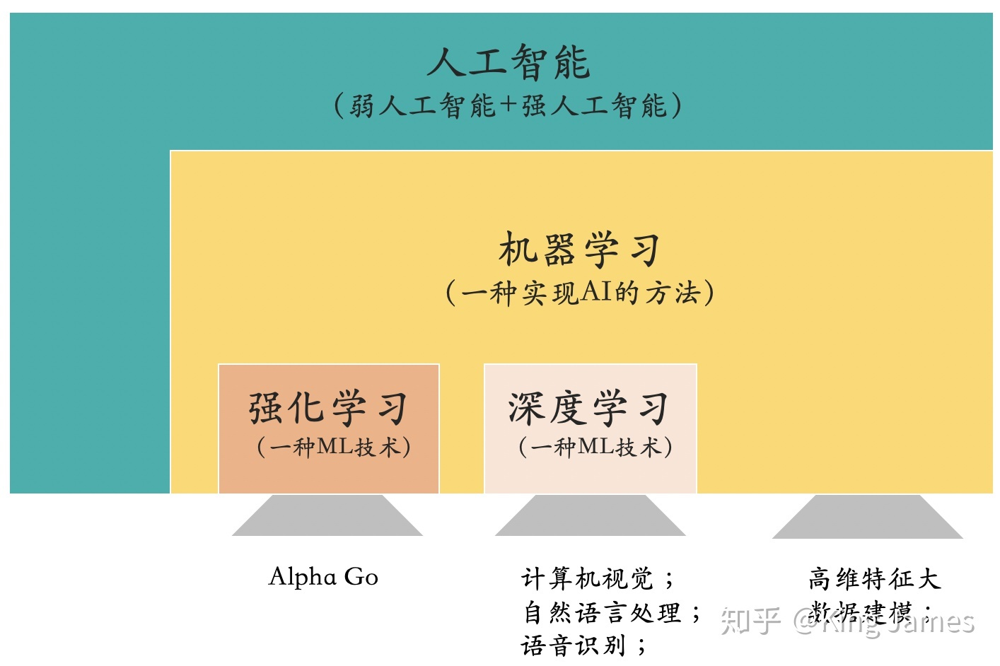

强化学习是机器学习的一个分支，关于机器学习我不再重复介绍，感兴趣的读者可以看我之前写的机器学习文章（[https://zhuanlan.zhihu.com/p/110166255](https://zhuanlan.zhihu.com/p/110166255)）。

### 1.1 什么是强化学习

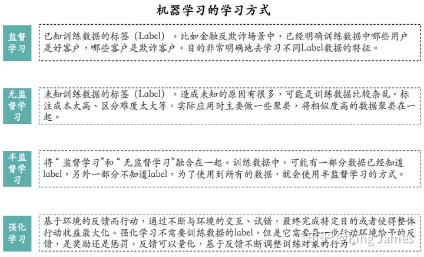

**强化学习是一种机器学习的学习方式**_（四种主要的机器学习方式解释见上图）。_

上图没有提到深度学习，是因为从学习方式层面上来说，深度学习属于上述四种方式的子集。而强化学习是独立存在的，所以上图单独列出强化学习，而没有列出深度学习。

强化学习和其他三种学习方式主要不同点在于：强化学习训练时，需要环境给予反馈，以及对应具体的反馈值。它不是一个分类的任务，不是金融反欺诈场景中如何分辨欺诈客户和正常客户。强化学习主要是指导训练对象每一步如何决策，采用什么样的行动可以完成特定的目的或者使收益最大化。

  * 比如**AlphaGo下围棋**，AlphaGo就是强化学习的训练对象,AlphaGo走的每一步不存在对错之分，但是存在“好坏”之分。当前这个棋面下，下的“好”，这是一步好棋。下的“坏”，这是一步臭棋。强化学习的训练基础在于AlphaGo的每一步行动环境都能给予明确的反馈，是“好”是“坏”？“好”“坏”具体是多少，可以量化。强化学习在AlphaGo这个场景中最终训练目的就是让棋子占领棋面上更多的区域，赢得最后的胜利。

打一个不是很恰当的比喻，有点像马戏团训猴一样。

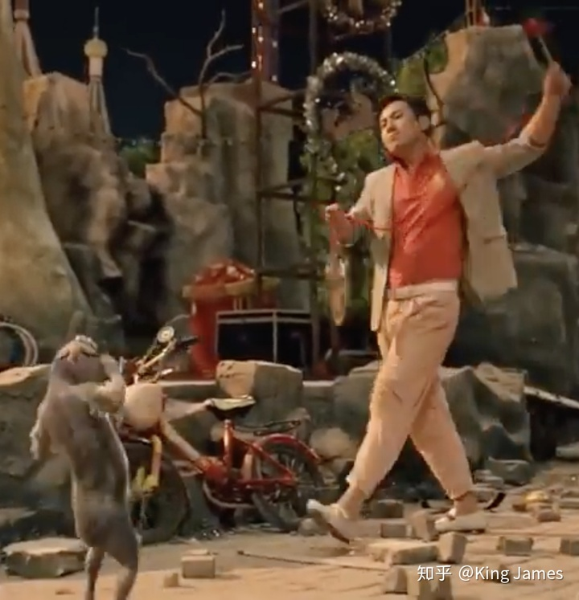

驯兽师敲锣，训练猴站立敬礼，猴是我们的训练对象。如果猴完成了站立敬礼的动作，就会获得一定的食物奖励，如果没有完成或者完成的不对，就没有食物奖励甚至是鞭子抽打。时间久了，每当驯兽师敲锣，猴子自然而然地就知道要站立敬礼，因为这个动作是当前环境下获得收益最大的动作，其他动作就不会有食物，甚至还要被鞭子抽打。（[https://bbs.hupu.com/36347293.html](https://bbs.hupu.com/36347293.html) 这里有一篇耍猴的报道，有强化学习的味道）

强化学习的灵感来源于心理学里的**行为主义理论**：

  * 一切学习都是通过条件作用，在刺激和反应之间建立直接联结的过程。
  * 强化在刺激一反应之间的建立过程中起着重要的作用。在刺激一反应联结中，个体学到的是习惯，而习惯是反复练习与强化的结果。
  * 习惯一旦形成，只要原来的或类似的刺激情境出现，习得的习惯性反应就会自动出现。

那基于上述理论，强化学习就是训练对象如何在环境给予的奖励或惩罚的刺激下，逐步形成对刺激的预期，产生能获得最大利益的习惯性行为。

### 1.2 强化学习的主要特点

  * **试错学习：**强化学习需要训练对象不停地和环境进行交互，通过试错的方式去总结出每一步的最佳行为决策，整个过程没有任何的指导，只有冰冷的反馈。所有的学习基于环境反馈，训练对象去调整自己的行为决策。
  * **延迟反馈：**强化学习训练过程中，训练对象的“试错”行为获得环境的反馈，有时候可能需要等到整个训练结束以后才会得到一个反馈，比如Game Over或者是Win。当然这种情况，我们在训练时候一般都是进行拆解的，尽量将反馈分解到每一步。
  * **时间是强化学习的一个重要因素**：强化学习的一系列环境状态的变化和环境反馈等都是和时间强挂钩，整个强化学习的训练过程是一个随着时间变化，而状态&反馈也在不停变化的，所以时间是强化学习的一个重要因素。
  * **当前的行为影响后续接收到的数据**：为什么单独把该特点提出来，也是为了和监督学习&半监督学习进行区分。在监督学习&半监督学习中，每条训练数据都是独立的，相互之间没有任何关联。但是强化学习中并不是这样，当前状态以及采取的行动，将会影响下一步接收到的状态。数据与数据之间存在一定的关联性。

## 2. 详解强化学习

下面我们对强化学习进行详细的介绍：

### 2.1 基本组成部分

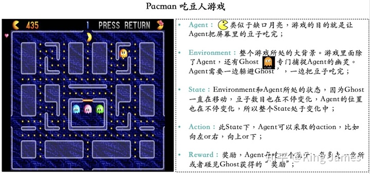

本文使用一个小游戏叫做Pacman（吃豆人）的游戏介绍强化学习（Reinforcement Learning）的基本组成部分。游戏目标很简单，就是Agent要把屏幕里面所有的豆子全部吃完，同时又不能被幽灵碰到，被幽灵碰到则游戏结束，幽灵也是在不停移动的。Agent每走一步、每吃一个豆子或者被幽灵碰到，屏幕左上方这分数都会发生变化，图例中当前分数是435分。这款小游戏，也是加州大学伯克利分校在上强化学习这门课程时使用的cousrwork（[http://ai.berkeley.edu/project_overview.html](https://ai.berkeley.edu/project_overview.html)）。后续文章也会使用这个小游戏进行强化学习实战讲解。

  * **Agent（智能体）：**强化学习训练的主体就是Agent，有时候翻译为“代理”，这里统称为“智能体”。Pacman中就是这个张开大嘴的黄色扇形移动体。
  * **Environment（环境）：**整个游戏的大背景就是环境；Pacman中Agent、Ghost、豆子以及里面各个隔离板块组成了整个环境。
  * **State（状态）：**当前 Environment和Agent所处的状态，因为Ghost一直在移动，豆子数目也在不停变化，Agent的位置也在不停变化，所以整个State处于变化中；这里特别强调一点，State包含了Agent和Environment的状态。
  * **Action（行动）：**基于当前的State，Agent可以采取哪些action，比如向左or右，向上or下；Action是和State强挂钩的，比如上图中很多位置都是有隔板的，很明显Agent在此State下是不能往左或者往右的，只能上下；
  * **Reward（奖励）：**Agent在当前State下，采取了某个特定的action后，会获得环境的一定反馈就是Reward。这里面用Reward进行统称，虽然Reward翻译成中文是“奖励”的意思，但其实强化学习中Reward只是代表环境给予的“反馈”，可能是奖励也可能是惩罚。比如Pacman游戏中，Agent碰见了Ghost那环境给予的就是惩罚。

以上是强化学习的五个基本组成部分。

### 2.2 强化学习训练过程

下面我们需要介绍一下强化学习的训练过程。整个训练过程都基于一个前提，我们认为整个过程都是符合马尔可夫决策过程的。

  * **马尔可夫决策过程（Markov Decision Process）**

Markov是一个俄国的数学家，为了纪念他在马尔可夫链所做的研究，所以以他命名了“Markov Decision Process”，以下用MDP代替。

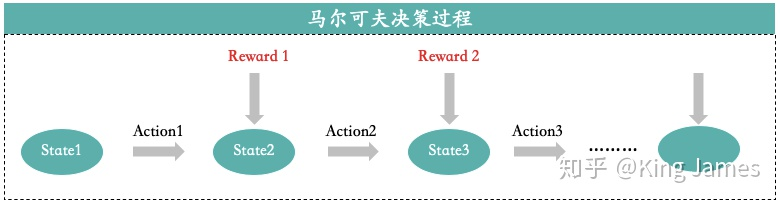

MDP核心思想就是下一步的State只和当前的状态State以及当前状态将要采取的Action有关，只回溯一步。比如上图State3只和State2以及Action2有关，和State1以及Action1无关。我们已知当前的State和将要采取的Action，就可以推出下一步的State是什么，而不需要继续回溯上上步的State以及Action是什么，再结合当前的（State，Action）才能得出下一步State。实际应用中基本场景都是马尔可夫决策过程，比如AlphaGo下围棋，当前棋面是什么，当前棋子准备落在哪里，我们就可以清晰地知道下一步的棋面是什么了。

为什么我们要先定义好整个训练过程符合MDP了，因为只有符合MDP，我们才方便根据当前的State，以及要采取的Action，推理出下一步的State。方便在训练过程中清晰地推理出每一步的State变更，如果在训练过程中我们连每一步的State变化都推理不出，那么也无从训练。

接下来我们使用强化学习来指导Agent如何行动了。

### 2.3 强化学习算法归类

我们选择什么样的算法来指导Agent行动了？本身强化学习算法有很多种，关于强化学习算法如何分类，有很多种分类方式，这里我选择三种比较常见的分类方式。

#### 2.3.1 Value Based

  * **说明：**基于每个State下可以采取的所有Action，这些Action对应的Value, 来选择当前State如何行动。强调一点这里面的Value并不是从当前State进入下一个Stae，环境给的Reward，Reward是Value组成的一部分。但我们实际训练时既要关注当前的收益，也要关注长远的收益，所以这里面的Value是通过一个计算公式得出来的，而不仅仅是状态变更环境立即反馈的Reward。因为Value的计算较为复杂，通常使用贝尔曼方程，在此不再细述。
  * **如何选择Action**：简单来说，选择当前State下对应Value最大的Action。选择能够带来最大Value加成的Action。比如下图StateA状态下，可以采取的Action有3个，但是Action2带来的Value最大，所以最终Agent进入StateA状态时，就会选择Action2。_（强调一点这里面的Value值，在强化学习训练开始时都是不知道的，我们一般都是设置为0。然后让Agent不断去尝试各类Action，不断与环境交互，不断获得Reward，然后根据我们计算Value的公式，不停地去更新Value，最终在训练N多轮以后，Value值会趋于一个稳定的数字，才能得出具体的State下，采取特定Action，对应的Value是多少）_

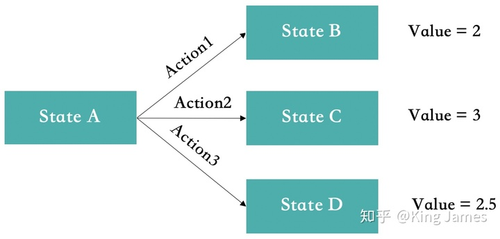

  * **代表性算法**：Q-Learning、SARSA（**S**tate-**A**ction-**R**eward-**S**tate-**A**ction**）；
  * **适用场景**：Action空间是离散的，比如Pacman里面的动作空间基本是“上下左右”，但有些Agent的动作空间是一个连续的过程，比如机械臂的控制，整个运动是连续的。如果强行要将连续的Action拆解为离散的也是可以的，但是得到的维度太大，往往是指数级的，不适宜训练。同时在Value-Based场景中，最终学习完每个State对应的最佳Action基本固定。但有些场景即使最终学习完每个State对应的最佳Action也是随机的，比如剪刀石头布游戏，最佳策略就是各1/3的概率出剪刀/石头/布。

#### 2.3.2 Policy Based

Policy Based策略就是对Value Based的一个补充，

  * **说明：**基于每个State可以采取的Action策略，针对Action策略进行建模，学习出具体State下可以采取的Action对应的概率，然后根据概率来选择Action。如何利用Reward去计算每个Action对应的概率里面涉及到大量的求导计算，对具体过程感兴趣的可以参考这篇文章：[https://zhuanlan.zhihu.com/p/54825295](https://zhuanlan.zhihu.com/p/54825295)
  * **如何选择Action：**基于得出的策略函数，输入State得到Action。
  * **代表性算法：**Policy Gradients
  * **适用场景：**Action空间是连续的&每个State对应的最佳Action并不一定是固定的，基本上Policy Based适用场景是对Value Based适用场景的补充。对于Action空间是连续的，我们通常会先假设动作空间符合高斯分布，然后再进行下一步的计算。

#### 2.3.3 Actor-Critic

AC分类就是将Value-Based和Policy-Based结合在一起，里面的算法结合了2.3.1和2.3.2。

上述就是三大类常见的强化学习算法，而在Pacman这个游戏中，我们就可以适用Value-Based算法来训练。因为每个State下最终对应的最优Action是比较固定的，同时Reward函数也容易设定。

#### 2.3.4 其他分类

上述三种分类是常见的分类方法，有时候我们还会通过其他角度进行分类，以下分类方法和上述的分类存在一定的重叠：

  * **根据是否学习出环境Model分类：Model-based**指的是，agent已经学习出整个环境是如何运行的，当agent已知任何状态下执行任何动作获得的回报和到达的下一个状态都可以通过模型得出时，此时总的问题就变成了一个动态规划的问题，直接利用贪心算法即可了。这种采取对环境进行建模的强化学习方法就是Model-based方法。而**Model-free**指的是，有时候并不需要对环境进行建模也能找到最优的策略。虽然我们无法知道确切的环境回报，但我们可以对它进行估计。Q-learning中的Q(s,a)就是对在状态s下，执行动作a后获得的未来收益总和进行的估计，经过很多轮训练后，Q(s,a)的估计值会越来越准，这时候同样利用贪心算法来决定agent在某个具体状态下采取什么行动。

如何判断该强化学习算法是Model-based or Model-free, 我们是否在agent在状态s下执行它的动作a之前，就已经可以准确对下一步的状态和回报做出预测，如果可以，那么就是Model-based，如果不能，即为Model-free。

### 2.4 EE（Explore & Exploit）

2.3里面介绍了各种强化学习算法：Value-Based、Policy-Based、Actor-Critic。但实际我们在进行强化学习训练过程中，会遇到一个“EE”问题。这里的Double E不是“Electronic Engineering”，而是“Explore & Exploit”，“探索&利用”。比如在Value-Based中，如下图StateA的状态下，最开始Action1&2&3对应的Value都是0，因为训练前我们根本不知道，初始值均为0。如果第一次随机选择了Action1，这时候StateA转化为了StateB，得到了Value=2，系统记录在StateA下选择Action1对应的Value=2。如果下一次Agent又一次回到了StateA，此时如果我们选择可以返回最大Value的action，那么一定还是选择Action1。因为此时StateA下Action2&3对应的Value仍然为0。Agent根本没有尝试过Action2&3会带来怎样的Value。

所以在强化学习训练的时候，一开始会让Agent更偏向于探索Explore，并不是哪一个Action带来的Value最大就执行该Action，选择Action时具有一定的随机性，目的是为了覆盖更多的Action，尝试每一种可能性。等训练很多轮以后各种State下的各种Action基本尝试完以后，我们这时候会大幅降低探索的比例，尽量让Agent更偏向于利用Exploit，哪一个Action返回的Value最大，就选择哪一个Action。

Explore&Exploit是一个在机器学习领域经常遇到的问题，并不仅仅只是强化学习中会遇到，在推荐系统中也会遇到，比如用户对某个商品 or 内容感兴趣，系统是否应该一直为用户推送，是不是也要适当搭配随机一些其他商品 or 内容。

### 2.5 强化学习实际开展中的难点

我们实际在应用强化学习去训练时，经常会遇到各类问题。虽然强化学习很强大，但是有时候很多问题很棘手无从下手。

  * **Reward的设置：**如何去设置Reward函数，如何将环境的反馈量化是一个非常棘手的问题。比如在AlphaGo里面，如何去衡量每一步棋下的“好”与“坏”，并且最终量化，这是一个非常棘手的问题。有些场景下的Reward函数是很难设置的。
  * **采样训练耗时过长，实际工业届应用难：**强化学习需要对每一个State下的每一个Action都要尽量探索到，然后进行学习。实际应用时，部分场景这是一个十分庞大的数字，对于训练时长，算力开销是十分庞大的。很多时候使用其他的算法也会获得同样的效果，而训练时长，算力开销节约很多。强化学习的上限很高，但如果训练不到位，很多时候下限特别低。
  * **容易陷入局部最优：**部分场景中Agent采取的行动可能是当前局部最优，而不是全局最优。网上经常有人截图爆出打游戏碰到了王者荣耀AI，明明此时推塔或者推水晶是最合理的行为，但是AI却去打小兵，因为AI采取的是一个局部最优的行为。再合理的Reward函数设置都可能陷入局部最优中。

## 3. 强化学习的实际应用

虽然强化学习目前还有各种各样的棘手问题，但目前工业界也开始尝试应用强化学习到实际场景中了，除了AlphaGo还有哪些应用了：

### 3.1 自动驾驶

目前国内百度在自动驾驶领域中就使用了一定的强化学习算法，但是因为强化学习需要和环境交互试错，现实世界中这个成本太高，所以真实训练时都需要加入安全员进行干预，及时纠正Agent采取的错误行为。

### 3.2 游戏

游戏可以说是目前强化学习应用最广阔的，目前市场上的一些MOBA游戏基本都有了强化学习版的AI在里面，最出名的就是王者荣耀AI。游戏环境下可以随便交互，随便试错，没有任何真实成本。同时Reward也相对比较容易设置，存在明显的奖励机制。

### 3.3 推荐系统

目前一些互联网大厂也在推荐系统中尝试加入强化学习来进行推荐，比如百度&美团。使用强化学习去提高推荐结果的多样性，和传统的协同过滤&CTR预估模型等进行互补。

总之强化学习是目前机器学习领域的一个十分热门的研究方向，应用前景非常广阔。下一篇会介绍如何使用Q-Learning算法来训练Pacman吃豆子的Python实战讲解，欢迎大家继续关注。

