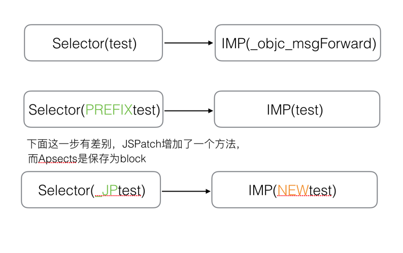
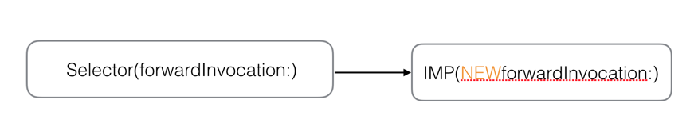
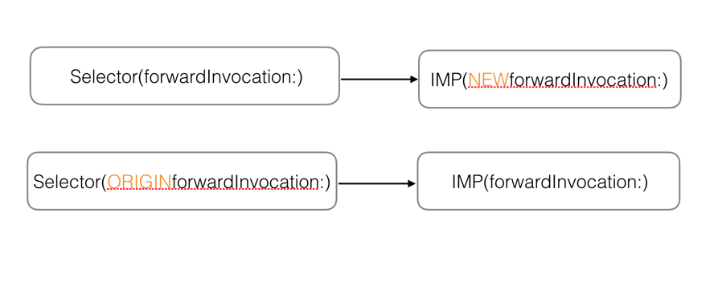
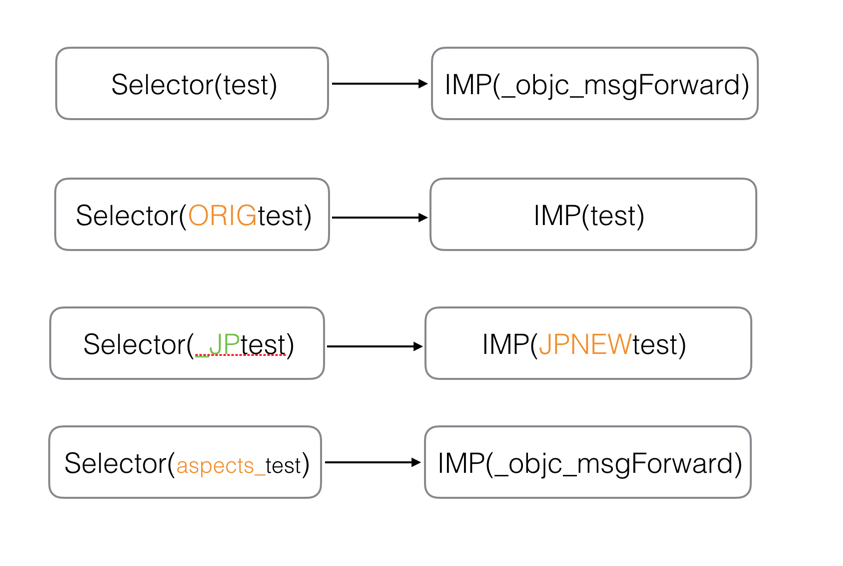
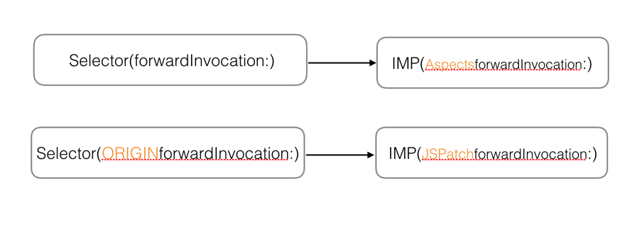
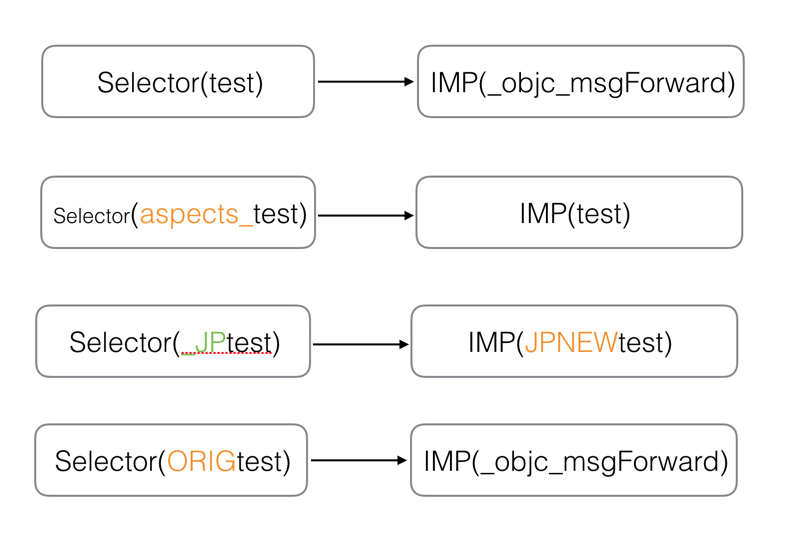
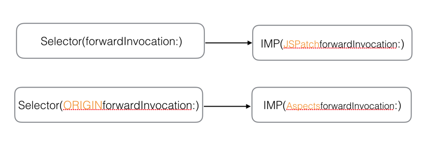

 
<!--BEGIN_DATA
{
    "create_date": "2016-08-16 15:38", 
    "modify_date": "2016-08-16 15:38", 
    "is_top": "0", 
    "summary": "面向切面编程之 Aspects 源码解析及应用", 
    "tags": "iOS", 
    "file_name": "面向切面编程之 Aspects 源码解析及应用.md"
}
END_DATA-->

####
原文出处：<a href='http://wereadteam.github.io/2016/06/30/Aspects/' target='blank'>面向切面编程之 Aspects 源码解析及应用</a>

##1. 背景

最近在做项目的打点统计的时候，发现业务逻辑和打点逻辑经常耦合在一起，这样一方面影响了正常的业务逻辑，同时也很容易搞乱打点逻辑，而且要查看打点情况的时候也很分散，因此想着如何将两者解耦，并将打点逻辑集中起来。其实在 web 编程时候，这种场景很早就有了很成熟的方案，也就是所谓的 aop编程(面向切面编程)，其原理也就是在不更改正常的业务处理流程的前提下，通过生成一个动态代理类，从而实现对目标对象嵌入附加的操作。

在 iOS 中，要想实现相似的效果也很简单，利用 OC 的动态性，通过 swizzling method 改变目标函数的 selector所指向的实现，然后在新的实现中实现附加的操作，完成之后再回到原来的处理逻辑。想明白这些之后，我就打算动手实现，当然并没有重复造轮子，我在 github发现了一个基于 swizzling method 的开源框架 [Aspects](https://github.com/steipete/Aspects)。这个库的代码量比较小，总共就一个类文件，使用起来也比较方便，比如你想统计某个 controller 的 viewwillappear的调用次数，你只需要引入 Aspect.h 头文件，然后在合适的地方初始化如下代码即可。

    
    
    - (void)addKvLogAspect {
        [self wr_Aspect_hookSelector:@selector(viewWillAppear:) withOptions:AspectPositionAfter usingBlock:^{
            KVLog_ReviewTimeline(ReviewTimeline_Open_Tab);
        }error:NULL];
    }  
    

这篇文章主要是介绍 Aspects 源码以及其思路，以及我在实际应用中遇到的一些问题。对 swizzling method不了解的同学可以先去网上了解一下，下面的内容是基于大家对 swizzling method 有一定的了解的基础上的。

##2. 基本原理

我们知道 OC 是动态语言，我们执行一个函数的时候，其实是在发一条消息：`[receiver message]`，这个过程就是根据 message 生成selector，然后根据 selector 寻找指向函数具体实现的指针
IMP，然后找到真正的函数执行逻辑。这种处理流程给我们提供了动态性的可能，试想一下，如果在运行时，动态的改变了 selector 和 IMP的对应关系，那么就能使得原来的`[receiver message]`进入到新的函数实现了。

那么具体怎么实现这样的动态替换了?

直观的一种方案是提供一个统一入口，如 commonImp ,将所有需要 hook 的函数都指向这个函数，然后在这里，提取相关信息进行转发，[JSPatch 实现原理详解](https://github.com/bang590/JSPatch/wiki/JSPatch-%E5%AE%9E%E7%8E%B0%E5%8E%9F%E7%90%86%E8%AF%A6%E8%A7%A3#1%E5%9F%BA%E7%A1%80%E5%8E%9F%E7%90%86)对此方案的可行性有进行分析，对于64位机器可能会有点问题。另外一个方法就是利用 oc 自己的消息转发机制进行转发，Aspects的大体思路，基本上是顺着这个来的。为了更好的解释这个过程，我们先来看一下消息具体是怎么找到对应的 imp 的，见下图（此图并非原创）。

从上面我们可以发现，在发消息的时候，如果 selector 有对应的 IMP ,则直接执行，如果没有，oc 给我们提供了几个可供补救的机会，依次有`resolveInstanceMethod`、`forwardingTargetForSelector`、`forwardInvocation`。Aspects 之所以选择在
`forwardInvocation` 这里处理是因为，这几个阶段特性都不太一样：`resolvedInstanceMethod`
适合给类/对象动态添加一个相应的实现，`forwardingTargetForSelector`适合将消息转发给其他对象处理,相对而言，`forwardInvocation` 是里面最灵活，最能符合需求的。因此 Aspects 的方案就是，对于待hook 的 selector，将其指向 `objc_msgForward` / `_objc_msgForward_stret` ,同时生成一个新的`aliasSelector` 指向原来的 IMP，并且 hook 住 `forwardInvocation`函数，使他指向自己的实现。按照上面的思路，当被 hook 的 selector 被执行的时候，首先根据 selector 找到了`objc_msgForward` / `_objc_msgForward_stret` ,而这个会触发消息转发，从而进入`forwardInvocation`。同时由于 `forwardInvocation` 的指向也被修改了，因此会转入新的
`forwardInvocation` 函数，在里面执行需要嵌入的附加代码，完成之后，再转回原来的 IMP。

##3. 源码分析

###3.1 数据结构

介绍完大致思路之后，下面将从代码层来来具体分析。从头文件中可以看到使用aspects有两种使用方式：1）类方法 2）实例方法

    
    
    + (id<AspectToken>)aspect_hookSelector:(SEL)selector
                               withOptions:(AspectOptions)options
                                usingBlock:(id)block
                                     error:(NSError **)error;
    
    /// Adds a block of code before/instead/after the current `selector` for a specific instance.
    - (id<AspectToken>)aspect_hookSelector:(SEL)selector
                               withOptions:(AspectOptions)options
                                usingBlock:(id)block
                                     error:(NSError **)error;  
    

两者的主要原理基本差不多，这里不做一一介绍，只是以实例方法为例进行说明。在介绍之前，先介绍里面几个重要的数据结构：

####AspectOptions

    
    
    typedef NS_OPTIONS(NSUInteger, AspectOptions) {
        AspectPositionAfter   = 0,            /// Called after the original implementation (default)
        AspectPositionInstead = 1,            /// Will replace the original implementation.
        AspectPositionBefore  = 2,            /// Called before the original implementation.
        AspectOptionAutomaticRemoval = 1 << 3 /// Will remove the hook after the first execution.
    };  
    

这里表示了 block
执行的时机，也就是额外操作的执行时机，在我的应用场景中就是打点逻辑的执行时机，它可以在原始函数执行之前，也可以是执行之后，甚至可以完全替换掉原来的逻辑。

####AspectsContainer

一个对象或者类的所有的 Aspects 整体情况  

    
    
    // Tracks all aspects for an object/class.
    @interface AspectsContainer : NSObject
    - (void)addAspect:(AspectIdentifier *)aspect withOptions:(AspectOptions)injectPosition;
    - (BOOL)removeAspect:(id)aspect;
    - (BOOL)hasAspects;
    @property (atomic, copy) NSArray *beforeAspects;
    @property (atomic, copy) NSArray *insteadAspects;
    @property (atomic, copy) NSArray *afterAspects;
    @end  
    

####AspectIdentifier

一个 Aspect 的具体内容

    
    
    @interface AspectIdentifier : NSObject
    + (instancetype)identifierWithSelector:(SEL)selector object:(id)object options:(AspectOptions)options block:(id)block error:(NSError **)error;
    - (BOOL)invokeWithInfo:(id<AspectInfo>)info;
    @property (nonatomic, assign) SEL selector;
    @property (nonatomic, strong) id block;
    @property (nonatomic, strong) NSMethodSignature *blockSignature;
    @property (nonatomic, weak) id object;
    @property (nonatomic, assign) AspectOptions options;
    @end  
    

这里主要包含了单个的 aspect 的具体信息，包括执行时机，要执行 block 所需要用到的具体信息：包括方法签名、参数等等

####AspectInfo

一个 Aspect 执行环境，主要是 NSInvocation 信息。

    
    
    @interface AspectInfo : NSObject <AspctInfo>
    - (id)initWithInstance:(__unsafe_unretained id)instance invocation:(NSInvocation *)invocation;
    @property (nonatomic, unsafe_unretained, readonly) id instance;
    @property (nonatomic, strong, readonly) NSArray *arguments;
    @property (nonatomic, strong, readonly) NSInvocation *originalInvocation;
    @end  
    

###3.2 代码流程

有了上面的了解，我们就能更好的分析整个 apsects 的执行流程。添加一个 aspect 的关键流程如下图所示：

  
从代码来看，要想使用 aspects ，首先要添加一个 aspect ，可以通过上面介绍的类/实例方法。关键代码实现如下:  

    
    
    static id aspect_add(id self, SEL selector, AspectOptions options, id block, NSError **error) {
        ...
        __block AspectIdentifier *identifier = nil;
        aspect_performLocked(^{
            if (aspect_isSelectorAllowedAndTrack(self, selector, options, error)) {//1判断能否hook
                ...//2 记录数据结构
                aspect_prepareClassAndHookSelector(self, selector, error);//3 swizzling
            }
        });
        return identifier;
    }  
    

这个过程基本和上面的流程图一致，这里重点介绍几个关键部分。

####3.2.1 判断能否被 hook

对于对象实例而言，这里主要是根据黑名单，比如 retain forwardInvocation 等这些方法在外部是不能被 hook,(对于类对象还要确保同一个类继承关系层级中，只能被 hook 一次，因此这里需要判断子类，父类有没有被hook，之所以做这样的实现，主要是为了避免出现死循环的出现，这里有相关的讨论)。如果能够 hook，则继续下面的步骤。

####3.2.2 swizzling method

这是真正的核心逻辑，swizzling method 主要有两部分，一个是对对象的 forwardInvocation 进行
swizzling,另一个是对传入的 selector 进行 swizzling.

    
    
    static void aspect_prepareClassAndHookSelector(NSObject *self, SEL selector, NSError **error) {
        Class klass = aspect_hookClass(self, error); //1  swizzling forwardInvocation
        Method targetMethod = class_getInstanceMethod(klass, selector);
        IMP targetMethodIMP = method_getImplementation(targetMethod);
        if (!aspect_isMsgForwardIMP(targetMethodIMP)) {//2  swizzling method
           ...//
        }
    }  
    

####3.2.2.1 swizzling forwardInvocation:

aspect_hookClass 函数主要 swizzling 类/对象的 forwardInvocation 函数，aspects 的真正的处理逻辑都是在forwradInvocation 函数里面进行的。对于对象实例而言，源代码中并没有直接 swizzling 对象的 forwardInvocation方法，而是动态生成一个当前对象的子类，并将当前对象与子类关联,然后替换子类的 forwardInvocation 方法(这里具体方法就是调用了object_setClass(self, subclass) ,将当前对象 isa 指针指向了 subclass ,同时修改了 subclass 以及其
subclass metaclass 的 class 方法,使他返回当前对象的 class。,这个地方特别绕，它的原理有点类似 kvo的实现，它想要实现的效果就是，将当前对象变成一个 subclass 的实例，同时对于外部使用者而言，又能把它继续当成原对象在使用，而且所有的swizzling 操作都发生在子类，这样做的好处是你不需要去更改对象本身的类，也就是，当你在 remove aspects 的时候，如果发现当前对象的aspect 都被移除了，那么，你可以将 isa 指针重新指回对象本身的类，从而消除了该对象的 swizzling,同时也不会影响到其他该类的不同对象)。对于每一个对象而言，这样的动态对象只会生成一次，这里aspect_swizzlingForwardInvocation 将使得 forwardInvocation 方法指向 aspects 自己的实现逻辑,具体代码如下：  

    
    
    static Class aspect_hookClass(NSObject *self, NSError **error) {
         ...
         //生成动态子类，并swizzling forwardInvocation方法
         subclass = objc_allocateClassPair(baseClass, subclassName, 0); 
         aspect_swizzleForwardInvocation(subclass);//swizzling forwardinvation方法
    
         objc_registerClassPair(subclass);
          ...
         object_setClass(self, subclass);//将当前self设置为子类，这里其实只是更改了self的isa指针而已
         return subclass;
    }
    ...
    static void aspect_swizzleForwardInvocation(Class klass) {
         ...
        IMP originalImplementation = class_replaceMethod(klass, @selector(forwardInvocation:),     (IMP)__ASPECTS_ARE_BEING_CALLED__, "v@:@");
        if (originalImplementation) {
             class_addMethod(klass, NSSelectorFromString(AspectsForwardInvocationSelectorName),        originalImplementation, "v@:@")
          }
    ...
    }  
    

由于子类本身并没有实现 forwardInvocation ，隐藏返回的 originalImplementation 将为空值，所以也不会生成NSSelectorFromString(AspectsForwardInvocationSelectorName) 。

####3.2.2.2 swizzling selector

当 forwradInvocation 被 hook 之后，接下来，将对传入的 selector 进行 hook ，这里的做法是，将 selector指向了转发 IMP ，同时生成一个 aliasSelector ，指向了原来的 IMP ,同时为了放在重复 hook ,做了一个判断，如果发现selector 已经指向了转发 IMP ,那就就不需要进行交换了，代码如下

    
    
    static void aspect_prepareClassAndHookSelector(NSObject *self, SEL selector, NSError **error) {
         ...
         Method targetMethod = class_getInstanceMethod(klass, selector);
         IMP targetMethodIMP = method_getImplementation(targetMethod);
         if (!aspect_isMsgForwardIMP(targetMethodIMP)) {
         ...
         SEL aliasSelector = aspect_aliasForSelector(selector);//generator aliasSelector
         if (![klass instancesRespondToSelector:aliasSelector]) {
              __unused BOOL addedAlias = class_addMethod(klass, aliasSelector, method_getImplementation(targetMethod), typeEncoding); 
         }
         class_replaceMethod(klass, selector, aspect_getMsgForwardIMP(self, selector), typeEncoding);// point to   _objc_msgForward
       ...
         }
    }  
    

####3.2.3 handle ForwardInvocation

基于上面的代码分析知道，转发最终的逻辑代码最终转入 `__ASPECTS_ARE_BEING_CALLED__`
函数的处理中。这里，需要处理的部分包括额外处理代码（如打点代码）以及最终重新转会原来的 selector 所指向的函数，其实现代码如下：

    
    
    static void __ASPECTS_ARE_BEING_CALLED__(__unsafe_unretained NSObject *self, SEL selector, NSInvocation *invocation) {
    ...
         // Before hooks.  原来逻辑之前执行
        aspect_invoke(classContainer.beforeAspects, info);
        aspect_invoke(objectContainer.beforeAspects, info);
        // Instead hooks.
        BOOL respondsToAlias = YES;
        if (objectContainer.insteadAspects.count || classContainer.insteadAspects.count) {//是否需要替换掉原来的路基
             aspect_invoke(classContainer.insteadAspects, info);
             aspect_invoke(objectContainer.insteadAspects, info);
        } else {
            Class klass = object_getClass(invocation.target);
            do {
                  if ((respondsToAlias = [klass instancesRespondToSelector:aliasSelector])) {
                        [invocation invoke];//根据aliasSelector找到原来的逻辑并执行
                        break;
                    }
                }while (!respondsToAlias && (klass = class_getSuperclass(klass)));
         }
    
        // After hooks.  原来逻辑之后执行
         aspect_invoke(classContainer.afterAspects, info);
         aspect_invoke(objectContainer.afterAspects, info);
    
        // If no hooks are installed, call original implementation (usually to throw an exception)
         if (!respondsToAlias) {//找不到aliasSelector的IMP实现，没有找到原来的逻辑，进行消息转发
              invocation.selector = originalSelector;
              SEL originalForwardInvocationSEL = NSSelectorFromString(AspectsForwardInvocationSelectorName);
              if ([self respondsToSelector:originalForwardInvocationSEL]) {
                   ((void( *)(id, SEL, NSInvocation *))objc_msgSend)(self, originalForwardInvocationSEL, invocation);
              } else {
                  [self doesNotRecognizeSelector:invocation.selector];
             }
         }                     
    ...
    }  
    

依次处理 before/instead/after hook 以及真正函数实现。如果没有找到原始的函数实现，还需要进行转发操作。

##4. 遇到的问题

以上就是 Apsects 的实现了，接下来会介绍在实际应用过程中遇到的一些问题以及我的解决方案。

###4.1 JSPatch 兼容问题

####原因

我们的项目中引入了 JSPatch 作为我们的 hot fix方案。 JSPatch 也会 hook 住对象的 forwradInvocation方法，并且 swizzling 相应的 method ，使其指向转发 IMP ,由于 aspects
也是基于这两者实现的，那么会不会导致问题呢(其实类似的问题也会发生在对象提前被 kvo 了，会不会有影响)？

回过头去看3.2.1 我们先是 hook了 类的 `forwardInvocation` 使其指向了
`__ASPECTS_ARE_BEING_CALLED__`，然后在 swizzling method 那里，aspect 有做一个判断，如果传入的selector 指向了转发 IMP ,那么我们什么也不做。因此可想而知，如果传入的 selector 先被 JSPatch hook,那么，这里我们将不会再处理,也就不会生成 aliasSelector 。

这会导致什么问题了？设想一下，当 selector 被触发的时候，由于 selector 指向了转发 IMP ，因此会进入消息转发过程，同时由于`forwardInvocation` 被 aspects 所 hook ,最终会进入到 aspects 的处理逻辑`__ASPECTS_ARE_BEING_CALLED__` 中来。让我们回过头去看看3.2.2中的分析，由于找不到 aliasSelector 的 IMP实现，因此会在此进行消息转发。而在 3.2.2.1 的分析中我们知道，子类并没有实现`NSSelectorFromString(AspectsForwardInvocationSelectorName)` ，所以这里的流程就会进入`doesNotRecognizeSelector`，从而抛出异常。

####解决方案

出现上诉问题的原因在于，当 aliasSelector 没有被找到的时候，我们没能将消息正常的转发，也就是没有实现一个`NSSelectorFromString(AspectsForwardInvocationSelectorName)` ，
使得消息有机会重新转发回去的方法。因此解决方案也就呼之欲出了，我的做法是在对子类的 `forwardInvocation`方法进行交换而不仅仅是替换，实现逻辑如下，强制生成一个
`NSSelectorFromString(AspectsForwardInvocationSelectorName)` 指向原对象的
`forwardInvocation` 的实现。

    
    
    static Class aspect_hookClass(NSObject *self, NSError **error) {
        ...
       subclass = objc_allocateClassPair(baseClass, subclassName, 0);
       ...
       IMP originalImplementation = class_replaceMethod(subclass, @selector(forwardInvocation:), (IMP)__ASPECTS_ARE_BEING_CALLED__, "v@:@");
       if (originalImplementation) {
            class_addMethod(subclass, NSSelectorFromString(AspectsForwardInvocationSelectorName),   originalImplementation, "v@:@");
        } else {
            Method baseTargetMethod = class_getInstanceMethod(baseClass, @selector(forwardInvocation:));
            IMP baseTargetMethodIMP = method_getImplementation(baseTargetMethod);
           if (baseTargetMethodIMP) {
                   class_addMethod(subclass, NSSelectorFromString(AspectsForwardInvocationSelectorName), baseTargetMethodIMP, "v@:@");
             }
      }
    ...
    }  
    

注意如果 `originalImplementation` 为空，那么生成的`NSSelectorFromString(AspectsForwardInvocationSelectorName)` 将指向 baseClass
也就是真正的这个对象的 forwradInvocation ,这个其实也就是 JSPatch hook 的方法。同时为了保证 block的执行顺序（也就是前面介绍的 before hooks / instead hooks / after hooks ），这里需要将这段代码提前到 afterhooks 执行之前进行。这样就解决了 forwardInvocation 在外面已经被 hook 之后的冲突问题。

###4.2 remove操作

####4.2.1 单个aspect remove

单个 aspect 的 remove 貌似有个问题，先来看看源码。  

    
    
    if (aspect_isMsgForwardIMP(targetMethodIMP)) {
          SEL aliasSelector = aspect_aliasForSelector(selector);
          Method originalMethod = class_getInstanceMethod(klass, aliasSelector);
          IMP originalIMP = method_getImplementation(originalMethod);
          if (originalIMP) {            
                class_replaceMethod(klass, selector, originalIMP, typeEncoding);
          } 
    }  
    

当你对某个 aspect 执行 remove 操作的时候，它会直接 replace 这个 selector 的
IMP，这个操作是对整个类的所有实例都生效的，这会导致什么问题呢？

以类 A 为例，你先进入了 A 的一个实例 A1 ，hook 住了方法 selector1 ，然后，并没有销毁这个实例的时候，通过其他路径又进入类 A的另一个实例 A2 ,当然也 hook 了 selector1 ，然后这个时候，如果你 A2 中执行了这个 aspect 的 remove操作，按照上面的逻辑，类 A 的 selector1 将会恢复正常，可像而知，当你退回 A1 的时候， A1 的 aspect将会失效。这里其实我的解决思路很简单，因为在执行 remove 操作的时候，其实和这个对象相关的数据结构都已经被清除了，即使不去恢复 selector1
的执行，在进入 `__ASPECTS_ARE_BEING_CALLED__` 由于这个没有响应的 aspects,其实会直接跳到原来的处理逻辑，并不会有其他附加影响。

####4.2.2 整个对象aspect remove

还有一个问题就是，aspects 的 remove 操作只能支持单个的 remove 操作,不支持一次性删除一个对象的所有 aspects。这里，也做了一个扩展，对原来的 aspects 进行扩展，实现了一次性 remove 一个对象所有 aspects 的方法。

 
<!--BEGIN_DATA
<table>
    <tr>
    <td id='create_date'>2016-09-12 11:39</td>
    <td id='modify_date'>2016-09-12 11:39</td>
    <td id='is_top'>0</td>
    <td id='summary'></td>
    <td id='tags'></td>
  </tr>
</table>
END_DATA-->

####
原文出处：<a href='http://www.jianshu.com/p/dc1deaa1b28e' target='blank'>全面谈谈Aspects和JSPatch兼容问题</a>

###1. 背景

[Aspects](https://github.com/steipete/Aspects) 和
[JSPatch](https://github.com/bang590/JSPatch) 是 iOS 开发中非常常见的两个库。Aspects
提供了方便简单的方法进行面向切片编程(AOP)，JSPatch可以让你用 JavaScript 书写原生 iOS APP 和进行热修复。关于实现原理可以参考 [面向切面编程之 Aspects 源码解析及应用](http://wereadteam.github.io/2016/06/30/Aspects/) 和 [JSPatch wiki](https://github.com/bang590/JSPatch/wiki/JSPatch-%E5%AE%9E%E7%8E%B0%E5%8E%9F%E7%90%86%E8%AF%A6%E8%A7%A3)。简单地概括就是将原方法实现替换为`_objc_msgForward`（或`_objc_msgForward_stret`），当执行这个方法是直接进入消息转发过程，最后到达替换后的`-forwardInvocation:`，在`-forwardInvocation:`内执行新的方法，这是两者的共同原理。最近项目开发中需要用 JSPatch 替换方法修复一个 bug，然而这个方法已经使用 `Aspects` 进行 `hook` 过了，那么两者同时使用会不会有问题呢？关于这个问题，网上介绍比较详细的是 [面向切面编程之
Aspects 源码解析及应用](http://wereadteam.github.io/2016/06/30/Aspects/) 和 [有关Swizzling的一个问题](http://www.jianshu.com/p/d5c3c2f236b8)，深入研究后发现这两篇文章讲得都不够全面。本文基于`Aspects` 1.4.1 和 `JSPatch` 1.1 介绍几种测试结果和原因。

###2. 测试

#####2.0. 源码

[这是本文使用的测试代码](https://github.com/zhao0/JPAndAspects)，你可以clone下来，泡杯咖啡，找个安静的地方跟着本文一步一步实践。

#####2.1. 代码说明

`ViewController.m`中首先定义一个简单类`MyClass`，只有`-test`和`-test2`方法，方法内打印log

    
    
    @interface MyClass : NSObject
    - (void)test;
    - (void)test2;
    @end
    @implementation MyClass
    - (void)test {
        NSLog(@"MyClass origin log");
    }
    - (void)test2 {
        NSLog(@"MyClass test2 origin log");
    }
    @end

接着是三个hook方法，分别是对`-test`进行`hook`的`-jp_hook`、`-aspects_hook`和对`-test2`进行`hook`的`-aspects_hook_test2`

    
    
    - (void)jp_hook {
        [JPEngine startEngine];
        NSString *sourcePath = [[NSBundle mainBundle] pathForResource:@"demo" ofType:@"js"];
        NSString *script = [NSString stringWithContentsOfFile:sourcePath encoding:NSUTF8StringEncoding error:nil];
        [JPEngine evaluateScript:script];
    }
    - (void)aspects_hook {
        [MyClass aspect_hookSelector:@selector(test) withOptions:AspectPositionAfter usingBlock:^(id aspects) {
            NSLog(@"aspects log");
        } error:nil];
    }
    - (void)aspects_hook_test2 {
        [MyClass aspect_hookSelector:@selector(test2) withOptions:AspectPositionInstead usingBlock:^(id aspects) {
            NSLog(@"aspects test2 log");
        } error:nil];
    }

`demo.js`代码也非常简单，对`MyClass`的`-test`进行替换

    
    
    require('MyClass')
    defineClass('MyClass', {
        test: function() {
    //        self.ORIGtest();
            console.log("jspatch log")
        }
    });

#####2.2. 具体测试

######2.2.1. JSPatch 先 hook 、Aspects 采用 AspectPositionInstead (替换) hook

那么代码就是下面这样，注意把`-aspects_hook`方法设置为`AspectPositionInstead`

    
    
    // ViewController.m
    - (void)viewDidLoad {
        [super viewDidLoad];
        [self jp_hook];
        [self aspects_hook];
        MyClass *a = [[MyClass alloc] init];
        [a test];
    }

执行结果：

    
    
    JPAndAspects[2092:1554779] aspects log

结果是 `Aspects` 正确替换了方法

######2.2.2. Aspects 先采用随便一种Position hook，JSPatch再hook

那么代码就是下面这样

    
    
    - (void)viewDidLoad {
        [super viewDidLoad];
        [self aspects_hook];
        [self jp_hook];
        MyClass *a = [[MyClass alloc] init];
        [a test];
    }

执行结果：

    
    
    JPAndAspects[2774:1565702] JSPatch.log: jspatch log

结果是 `JSPatch` 正确替换了方法

######Why？

前面说到，`hook` 会替换该方法和 `-forwardInvocation:`，我们先看看方法被 `hook` 前后的变化  

  

原方法对应关系

  
方法替换后原方法指向了`_objc_msgForward`，同时添加一个方法`PREFIXtest`(`JSPatch`是`ORIGtest`，`Aspects` 是`aspects_test`)指向了原来的实现。`JSPatch`新增了一个方法指向`IMP(NEWtest)`，`Aspects`则保存block为关联属性  

  

`-test`变化

  
`-forwardInvocation:` 的变化也相似，原来的`-forwardInvocation:` 没实现是这样的  

  

`-forwardInvocation:`变化

  
如果原来的`-forwardInvocation:`有实现，就新加一个`-ORIGforwardInvocation:`指向原`IMP(forwardInvocation:)`  

  

`-forwardInvocation:`变化

  
由于`-test`方法指向了`_objc_msgForward`，这时调用`-test`方法就会进入消息转发，消息转发的第三步进入`-forwardInvocation:`执行新的`IMP(NEWforwardInvocation)`，拿到`invocation`，`invocation.selector`拼上前缀，然后拼上其他信息直接invoke，最终执行`IMP(NEWtest)`(`Aspects`是执行替换的`block`)。

* * *

以上是只有一次hook的情况，我们看看两者都hook的变化  

  

JSPatch先hook，`-test`变化

  

JSPatch先hook，`-forwardInvocation:`变化

  
这时调用`-test`同样发生消息转发，进入`-forwardInvocation:`执行`Aspects`的`IMP(AspectsforwardInvocation)`，上文提到`Aspects`把替换的`block`保存为关联属性了，到了`-forwardInvocation:`直接拿出来执行，和原来的实现没有任何关系，所以有了2.2.1 正确的结果。

* * *

  

Aspects先hook，`-test`变化

  

Aspects先hook，`-forwardInvocation:`变化

  
这时调用`-test`同样发生消息转发，进入`-forwardInvocation:`执行`JSPatch`的`IMP(JSPatchforwardInvocation)`，执行`_JPtest`，和原来的实现  
没有任何关系，所以有了2.2.2 正确的结果。  看到这里，如果细心的话会发现`ORIGtest`指向了`_objc_msgForward`，如果我们在`JSPatch`代码里调用`self.ORIGtest()`会怎么样呢？

######2.2.3. Aspects 先采用随便一种Position
hook，JSPatch再hook，JSPatch代码里调用self.ORIGtest()

代码是下面这样的

    
    
    // demo.js
    require('MyClass')
    defineClass('MyClass', {
        test: function() {
            self.ORIGtest();
            console.log("jspatch log")
        }
    });
    // ViewController.m
    - (void)viewDidLoad {
        [super viewDidLoad];
        [self aspects_hook];
        [self jp_hook];
        MyClass *a = [[MyClass alloc] init];
        [a test];
    }

执行结果：

    
    
    JPAndAspects[8668:1705052] -[MyClass ORIGtest]: unrecognized selector sent to instance 0x7ff592421a30

######Why?

`-test`和`-forwardInvocation:`的变化同上一步`Aspects`先`hook`。  
由于`-ORIGtest`指向了`_objc_msgForward`，调用方法时进入`-forwardInvocation:`执行`IMP(JSPatchforwardInvocation)`，`JSPatchforwardInvocation`中有这样一段代码

    
    
    static void JPForwardInvocation(__unsafe_unretained id assignSlf, SEL selector, NSInvocation *invocation)
    {
    ...
      JSValue *jsFunc = getJSFunctionInObjectHierachy(slf, JPSelectorName);
      if (!jsFunc) {
          JPExecuteORIGForwardInvocation(slf, selector, invocation);
          return;
      }
    ...
    }

这个`-ORIGtest`在对象中找不到具体的实现，因此转发给了`-ORIGINforwardInvocation:`。**注意：这里直接把`-ORIGtest`转发出去了**，很显然`IMP(AspectsforwardInvocation)`也是处理不了这个消息的。因此，出现了`unrecognizedselector`异常。  
**这里是两者兼容出现的最大问题，如果`JSPatch`在转发前判断一下这个方法是自己添加的`-ORIGxxx`，把前缀`ORIG`去掉再转发，这个问题就解决了。**

######2.2.4. JSPatch先hook， Aspects
再采用AspectPositionInstead(替换)hook，JSPatch代码里调用self.ORIGtest()

和2.2.1 相同，不管`JSPatch` `hook`之后是什么样的，都只执行`Aspects`的`block`

######2.2.5. JSPatch先hook， Aspects 再采用AspectPositionBefore(替换)hook

代码如下，**注意把`AspectPositionInstead`替换为`AspectPositionBefore`**

    
    
    // demo.js
    require('MyClass')
    defineClass('MyClass', {
        test: function() {
            console.log("jspatch log")
        }
    });
    // ViewController.m
    - (void)viewDidLoad {
        [super viewDidLoad];
        [self jp_hook];
        [self aspects_hook];
        MyClass *a = [[MyClass alloc] init];
        [a test];
    }

执行结果：

    
    
    JPAndAspects[10943:1756624] aspects log
    JPAndAspects[10943:1756624] JSPatch.log: jspatch log

执行结果如期是正确的。  
`IMP(AspectsforwardInvocation)`的部分代码如下

    
    
        SEL originalSelector = invocation.selector;
        SEL aliasSelector = aspect_aliasForSelector(invocation.selector);
        invocation.selector = aliasSelector;
        AspectsContainer *objectContainer = objc_getAssociatedObject(self, aliasSelector);
        AspectsContainer *classContainer = aspect_getContainerForClass(object_getClass(self), aliasSelector);
        AspectInfo *info = [[AspectInfo alloc] initWithInstance:self invocation:invocation];
        // Before hooks.
        aspect_invoke(classContainer.beforeAspects, info);
        aspect_invoke(objectContainer.beforeAspects, info);
        // Instead hooks.
        BOOL respondsToAlias = YES;
        if (objectContainer.insteadAspects.count || classContainer.insteadAspects.count) {
            aspect_invoke(classContainer.insteadAspects, info);
            aspect_invoke(objectContainer.insteadAspects, info);
        }else {
            Class klass = object_getClass(invocation.target);
            do {
                if ((respondsToAlias = [klass instancesRespondToSelector:aliasSelector])) {
                    [invocation invoke];
                    break;
                }
            }while (!respondsToAlias && (klass = class_getSuperclass(klass)));
        }
        // After hooks.
        aspect_invoke(classContainer.afterAspects, info);
        aspect_invoke(objectContainer.afterAspects, info);
        // If no hooks are installed, call original implementation (usually to throw an exception)
        if (!respondsToAlias) {
            invocation.selector = originalSelector;
            SEL originalForwardInvocationSEL = NSSelectorFromString(AspectsForwardInvocationSelectorName);
            if ([self respondsToSelector:originalForwardInvocationSEL]) {
                ((void( *)(id, SEL, NSInvocation *))objc_msgSend)(self, originalForwardInvocationSEL, invocation);
            }else {
                [self doesNotRecognizeSelector:invocation.selector];
            }
        }

首先执行`Before hooks`；接着查找是否有`Instead hooks`，如果有就执行，如果没有就在类继承链中查找父类能否响应`-aspects_test`，如果可以就invoke这个invocation，否则把`respondsToAlias`置为`NO`；接着执行`Afterhooks`；接着`if (!respondsToAlias)`把这个`-test`转发给`ORIGINforwardInvocation`即`IMP(JSPatchforwardInvocation)`处理了这个消息。**注意这里是把`-test`转发**

######2.2.6. JSPatch先hook， Aspects 再采用AspectPositionAfter hook

代码同2.2.5，**注意把`AspectPositionBefore`替换为`AspectPositionAfter`**

    
    
    JPAndAspects[11706:1776713] aspects log
    JPAndAspects[11706:1776713] JSPatch.log: jspatch log

结果都输出了，但是顺序不对。  
从`IMP(AspectsforwardInvocation)`代码中不难看出，`After hooks`先执行了，再将这个消息转发。这也可以说是`Aspects`的不足。

#####2.2.7. Aspects随便一种Position hook方法-test2，JSPatch再hook
-test，JSPatch代码里调用self.ORIGtest()， Aspects 以随便一种Position hook方法-test

同2.2.5和2.2.6很像，不过前面多了对`-test2`的hook，代码如下：

    
    
    // demo.js
    require('MyClass')
    defineClass('MyClass', {
        test: function() {
            self.ORIGtest();
            console.log("jspatch log")
        }
    });
    // ViewController.m
    - (void)viewDidLoad {
        [super viewDidLoad];
        [self aspects_hook_test2];
        [self jp_hook];
        [self aspects_hook];
        MyClass *a = [[MyClass alloc] init];
        [a test];
    }

代码执行结果：

    
    
    JPAndAspects[12597:1797663] MyClass origin log
    JPAndAspects[12597:1797663] JSPatch.log: jspatch log

结果是Aspects对`-test`的hook没有生效。

######Why?

不废话，直接看`Aspects`代码：

    
    
    static Class aspect_hookClass(NSObject *self, NSError **error) {
        NSCParameterAssert(self);
        Class statedClass = self.class;
        Class baseClass = object_getClass(self);
        NSString *className = NSStringFromClass(baseClass);
        // Already subclassed
        if ([className hasSuffix:AspectsSubclassSuffix]) {
            return baseClass;
            // We swizzle a class object, not a single object.
        }else if (class_isMetaClass(baseClass)) {
            return aspect_swizzleClassInPlace((Class)self);
            // Probably a KVO'ed class. Swizzle in place. Also swizzle meta classes in place.
        }else if (statedClass != baseClass) {
            return aspect_swizzleClassInPlace(baseClass);
        }
        // Default case. Create dynamic subclass.
        const char *subclassName = [className stringByAppendingString:AspectsSubclassSuffix].UTF8String;
        Class subclass = objc_getClass(subclassName);
        if (subclass == nil) {
            subclass = objc_allocateClassPair(baseClass, subclassName, 0);
            if (subclass == nil) {
                NSString *errrorDesc = [NSString stringWithFormat:@"objc_allocateClassPair failed to allocate class %s.", subclassName];
                AspectError(AspectErrorFailedToAllocateClassPair, errrorDesc);
                return nil;
            }
            aspect_swizzleForwardInvocation(subclass);
            aspect_hookedGetClass(subclass, statedClass);
            aspect_hookedGetClass(object_getClass(subclass), statedClass);
            objc_registerClassPair(subclass);
        }
        object_setClass(self, subclass);
        return subclass;
    }

这段代码的作用是区分`self`的类型，进行不同的`swizzleForwardInvocation`。`self`本身可能是一个`Class`；或者self通过`-class`方法返回的self真正的`Class`不同，最典型的`KVO`，会创建一个子类加上`NSKVONotify_`前缀，然后重写class方法，看不懂的可以参考`Objective-C 对象模型`。这两种情况都对self真正的Class进行`aspect_swizzleClassInPlace`；如果self是一个普通对象，则模仿KVO的实现方式，创建一个子类，`swizzle`子类的`-forwardInvocation:`，通过`object_setClass`强行设置`Class`。

* * *

再看`aspect_swizzleClassInPlace`

    
    
    static Class aspect_swizzleClassInPlace(Class klass) {
        ...
            if (![swizzledClasses containsObject:className]) {
                aspect_swizzleForwardInvocation(klass);
                [swizzledClasses addObject:className];
            }
        ...
    }

问题就出在这个`aspect_swizzleClassInPlace`，它会判断如果这个类的`-forwardInvocation:` `swizzle`过，就什么都不做，但是通过数组这种方式是会出问题，第二次`hook`的时候就不会`-forwardInvocation:`替换成`IMP(AspectsforwardInvocation)`，所以第二次`hook`不生效。相比，`JSPatch`的实现就比较合理，判断两个IMP是否相等。

    
    
    if (class_getMethodImplementation(cls, @selector(forwardInvocation:)) != (IMP)JPForwardInvocation) {
    }

######2.2.8. Aspects 先采用随便一种Position
hook父类，JSPatch再hook子类，JSPatch代码里调用self.super().xxx()

代码是下面这样的

    
    
    // demo.js
    require('MySubClass')
    defineClass('MySubClass', {
        test: function() {
            self.super().test();
            console.log("jspatch log")
        }
    });
    // ViewController.m
    // 增加一个子类
    @interface MySubClass : MyClass
    @end
    @implementation MySubClass
    - (void)test {
        NSLog(@"MySubClass origin log");
    }
    @end
    - (void)viewDidLoad {
        [super viewDidLoad];
        [self aspects_hook];
        [self jp_hook];
        MySubClass *a = [[MySubClass alloc] init];
        [a test];
    }

执行结果：

    
    
    JPAndAspects[89642:1600226] -[MySubClass SUPER_test]: unrecognized selector sent to instance 0x7fa4cadabc70

######Why?

父类`MyClass`的`-test`和`-forwardInvocation:`的变化同2.2.1中原`-forwardInvocation`没有实现的情况。  `JSPatch`中`super`的实现是新增加一个方法`-SUPER_test`，IMP指向了父类的IMP，由于`-test`指向了`_objc_msgForward`，调用方法时进入`-forwardInvocation:`执行`IMP(JSPatchforwardInvocation)`，执行`self.super().test()`时，实际执行了`-SUPER_test`，这个`-SUPER_test`在对象中找不到具体的实现，发生了`-ORIGtest`一样的异常。  

**这里是两者兼容出现的第二个比较严重的问题。**

#####2.3 总结

写到这里，除了`Aspects`对对象的`hook`(这种情况很少见，你可以自己测试)，可能已经解答了两者兼容的大部分问题。通过以上分析，得出不兼容的四种情况：

  * `Aspects`先`hook`某一方法，`JSPatch`再`hook`同一方法且`JSPatch`调用了`self.ORIGxxx()`，结果是异常崩溃。
  * `Aspects`先`hook`父类某一方法，`JSPatch`再`hook`子类同一方法且`JSPatch`调用了`self.super().xxx()`，结果是异常崩溃。
  * `JSPatch`先`hook`某一方法，`Aspects`以`After`的方式`hook`同一方法，结果是执行顺序不对
  * `Aspects`先`hook`任何方法，`JSPatch`再`hook`另一方法，`Aspects`再`hook`和`JSPatch`相同的方法，结果是最后一次`hook`不生效

