 
<!--BEGIN_DATA
{
    "create_date": "2020-08-13 22:25", 
    "modify_date": "2020-08-13 22:25", 
    "is_top": "0", 
    "summary": "面试系列之C++的对象布局", 
    "tags": "C/C++", 
    "file_name": "面试系列之C++的对象布局.md"
}
END_DATA-->

####
原文出处：<a href='https://mp.weixin.qq.com/s?__biz=MzI3NjA1OTEzMg==&mid=2247484213&idx=1&sn=dc75ae10a8ef2cf6188fe982076e7ea8&chksm=eb7a05a6dc0d8cb0394a43cb0cebe4f454eaf53bb353087d8d3ac7b08c2948edb3fc62172237&scene=21#wechat_redirect' target='blank'>面试系列之C++的对象布局</a>

我们都知道C++多态是通过虚函数表来实现的，那具体是什么样的大家清楚吗？开篇依旧提出来几个问题：  

  * 普通类对象是什么布局？
  * 带虚函数的类对象是什么布局？
  * 单继承下不含有覆盖函数的类对象是什么布局？
  * 单继承下含有覆盖函数的类对象是什么布局？
  * 多继承下不含有覆盖函数的类对象是什么布局？
  * 多继承下含有覆盖函数的类对象的是什么布局？
  * 多继承中不同的继承顺序产生的类对象布局相同吗？
  * 虚继承的类对象是什么布局？
  * 菱形继承下类对象是什么布局？
  * 为什么要引入虚继承？
  * 为什么虚函数表中有两个析构函数？
  * 为什么构造函数不能是虚函数？
  * 为什么基类析构函数需要是虚函数？

要回答上述问题我们首先需要了解什么是多态。

#####什么是多态？

多态可以分为编译时多态和运行时多态。

  * 编译时多态：基于模板和函数重载方式，在编译时就已经确定对象的行为，也称为静态绑定。
  * 运行时多态：面向对象的一大特色，通过继承方式使得程序在运行时才会确定相应调用的方法，也称为动态绑定，它的实现主要是依赖于传说中的虚函数表。

#####如何查看对象的布局？

在gcc中可以使用如下命令查看对象布局：

    
    
    g++ -fdump-class-hierarchy model.cc后查看生成的文件
    

在clang中可以使用如下命令：  

    
    
    clang -Xclang -fdump-record-layouts -stdlib=libc++ -c model.cc
    // 查看对象布局
    clang -Xclang -fdump-vtable-layouts -stdlib=libc++ -c model.cc
    // 查看虚函数表布局
    

上面两种方式其实足够了，也可以使用gdb来查看内存布局，这里可以看文末相关参考资料。本文都是使用clang来查看的对象布局。

接下来让我们一起来探秘下各种继承条件下类对象的布局情况吧~

**普通类对象的布局**

如下代码：  

    
    
    struct Base {
       Base() = default;
       ~Base() = default;
       void Func() {}
       int a;
       int b;
    };
    int main() {
       Base a;
       return 0;
    }
    // 使用clang -Xclang -fdump-record-layouts -stdlib=libc++ -c model.cc查看
    

输出如下：  

    
    
    *** Dumping AST Record Layout
            0 | struct Base
            0 |   int a
            4 |   int b
              | [sizeof=8, dsize=8, align=4,
              |  nvsize=8, nvalign=4]
    *** Dumping IRgen Record Layout
    

画出图如下：

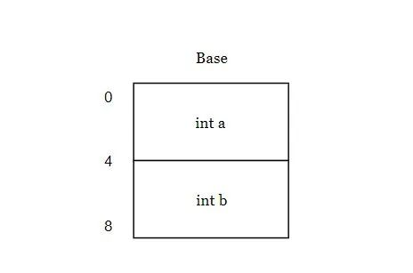

从结果中可以看见，这个普通结构体Base的大小为8字节，a占4个字节，b占4个字节。  

**带虚函数的类对象布局**
    
    
    struct Base {
       Base() = default;
       virtual ~Base() = default;
       void FuncA() {}
       virtual void FuncB() {
           printf("FuncB\n");
      }
       int a;
       int b;
    };
    int main() {
       Base a;
       return 0;
    }
    // 这里可以查看对象的布局和相应虚函数表的布局
    clang -Xclang -fdump-record-layouts -stdlib=libc++ -c model.cc
    clang -Xclang -fdump-vtable-layouts -stdlib=libc++ -c model.cc
    

对象布局如下：  

    
    
    *** Dumping AST Record Layout
            0 | struct Base
            0 |   (Base vtable pointer)
            8 |   int a
           12 |   int b
              | [sizeof=16, dsize=16, align=8,
              |  nvsize=16, nvalign=8]
    *** Dumping IRgen Record Layout
    

这个含有虚函数的结构体大小为16，在对象的头部，前8个字节是虚函数表的指针，指向虚函数的相应函数指针地址，a占4个字节，b占4个字节，总大小为16。  

虚函数表布局：

    
    
    Vtable for 'Base' (5 entries).
      0 | offset_to_top (0)
      1 | Base RTTI
          -- (Base, 0) vtable address --
      2 | Base::~Base() [complete]
      3 | Base::~Base() [deleting]
      4 | void Base::FuncB()
    

画出对象布局图如下：

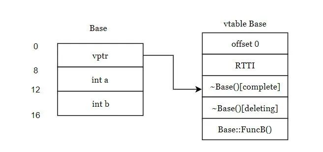

我们来探秘下传说中的虚函数表：

**offset_to_top(0)**：表示当前这个虚函数表地址距离对象顶部地址的偏移量，因为对象的头部就是虚函数表的指针，所以偏移量为0。

**RTTI指针**：指向存储运行时类型信息(type_info)的地址，用于运行时类型识别，用于`typeid`和`dynamic_cast`。

RTTI下面就是虚函数表指针真正指向的地址啦，存储了类里面所有的虚函数，至于这里为什么会有两个析构函数，大家可以先关注对象的布局，最下面会介绍。

#####单继承下不含有覆盖函数的类对象的布局

    
    
    struct Base {
       Base() = default;
       virtual ~Base() = default;
       void FuncA() {}
       virtual void FuncB() {
           printf("Base FuncB\n");
      }
       int a;
       int b;
    };

    struct Derive : public Base{
    };

    int main() {
       Base a;
       Derive d;
       return 0;
    }
    

子类对象布局：  

    
    
    *** Dumping AST Record Layout
            0 | struct Derive
            0 |   struct Base (primary base)
            0 |     (Base vtable pointer)
            8 |     int a
           12 |     int b
              | [sizeof=16, dsize=16, align=8,
              |  nvsize=16, nvalign=8]
    *** Dumping IRgen Record Layout
    

和上面相同，这个含有虚函数的结构体大小为16，在对象的头部，前8个字节是虚函数表的指针，指向虚函数的相应函数指针地址，a占4个字节，b占4个字节，总大小为16。  

子类虚函数表布局：

    
    
    Vtable for 'Derive' (5 entries).
      0 | offset_to_top (0)
      1 | Derive RTTI
          -- (Base, 0) vtable address --
          -- (Derive, 0) vtable address --
      2 | Derive::~Derive() [complete]
      3 | Derive::~Derive() [deleting]
      4 | void Base::FuncB()
    

画图如下：  

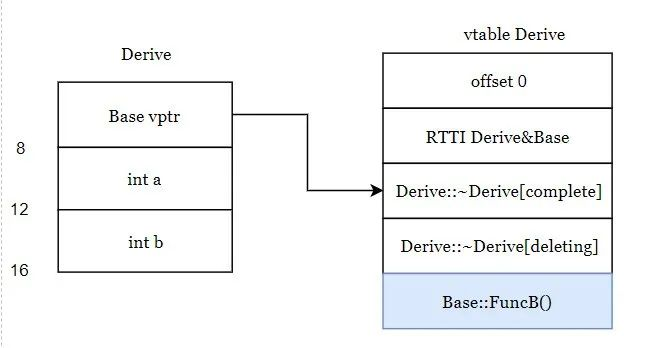

这个和上面也是相同的，注意下虚函数表这里的FuncB函数，还是Base类中的FuncB，因为在子类中没有重写这个函数，那么如果子类重写这个函数后对象布局是什么样的，请继续往下看哈。

#####单继承下含有覆盖函数的类对象的布局

    
    
    struct Base {
       Base() = default;
       virtual ~Base() = default;
       void FuncA() {}
       virtual void FuncB() {
           printf("Base FuncB\n");
      }
       int a;
       int b;
    };

    struct Derive : public Base{
       void FuncB() override {
           printf("Derive FuncB \n");
      }
    };

    int main() {
       Base a;
       Derive d;
       return 0;
    }
    

子类对象布局：

    
    
    *** Dumping AST Record Layout
            0 | struct Derive
            0 |   struct Base (primary base)
            0 |     (Base vtable pointer)
            8 |     int a
           12 |     int b
              | [sizeof=16, dsize=16, align=8,
              |  nvsize=16, nvalign=8]
    *** Dumping IRgen Record Layout
    

依旧和上面相同，这个含有虚函数的结构体大小为16，在对象的头部，前8个字节是虚函数表的指针，指向虚函数的相应函数指针地址，a占4个字节，b占4个字节，总大小为16。  

子类虚函数表布局：

    
    
    Vtable for 'Derive' (5 entries).
      0 | offset_to_top (0)
      1 | Derive RTTI
          -- (Base, 0) vtable address --
          -- (Derive, 0) vtable address --
      2 | Derive::~Derive() [complete]
      3 | Derive::~Derive() [deleting]
      4 | void Derive::FuncB()
    

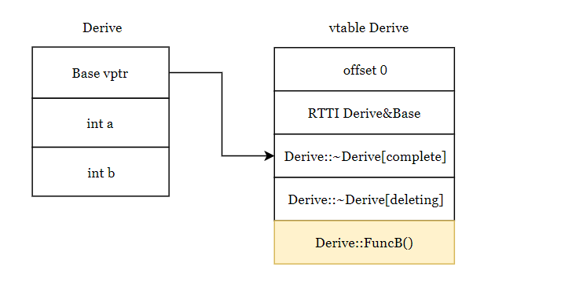

注意这里虚函数表中的FuncB函数已经是Derive中的FuncB啦，因为在子类中重写了父类的这个函数。  
  
再注意这里的RTTI中有了两项，表示Base和Derive的虚表地址是相同的，Base类里的虚函数和Derive类里的虚函数都在这个链条下，这里可以继续关注下面多继承的情况，看看有何不同。

#####多继承下不含有覆盖函数的类对象的布局

    
    
    struct BaseA {
       BaseA() = default;
       virtual ~BaseA() = default;
       void FuncA() {}
       virtual void FuncB() {
           printf("BaseA FuncB\n");
      }
       int a;
       int b;
    };

    struct BaseB {
       BaseB() = default;
       virtual ~BaseB() = default;
       void FuncA() {}
       virtual void FuncC() {
           printf("BaseB FuncC\n");
      }
       int a;
       int b;
    };

    struct Derive : public BaseA, public BaseB{

    };

    int main() {
       BaseA a;
       Derive d;
       return 0;
    }
    

类对象布局：  

    
    
    *** Dumping AST Record Layout
            0 | struct Derive
            0 |   struct BaseA (primary base)
            0 |     (BaseA vtable pointer)
            8 |     int a
           12 |     int b
           16 |   struct BaseB (base)
           16 |     (BaseB vtable pointer)
           24 |     int a
          28 |     int b
             | [sizeof=32, dsize=32, align=8,
             |  nvsize=32, nvalign=8]
    

Derive大小为32，注意这里有了两个虚表指针，因为Derive是多继承，一般情况下继承了几个带有虚函数的类，对象布局中就有几个虚表指针，并且子类也会继承基类的数据，**一般来说，不考虑内存对齐的话，子类（继承父类）的大小=子类（不继承父类）的大小+所有父类的大小**。  

虚函数表布局：

    
    
    Vtable for 'Derive' (10 entries).
      0 | offset_to_top (0)
      1 | Derive RTTI
          -- (BaseA, 0) vtable address --
          -- (Derive, 0) vtable address --
      2 | Derive::~Derive() [complete]
      3 | Derive::~Derive() [deleting]
      4 | void BaseA::FuncB()
      5 | offset_to_top (-16)
      6 | Derive RTTI
          -- (BaseB, 16) vtable address --
      7 | Derive::~Derive() [complete]
          [this adjustment: -16 non-virtual]
      8 | Derive::~Derive() [deleting]
          [this adjustment: -16 non-virtual]
      9 | void BaseB::FuncC()
    

可画出对象布局图如下：

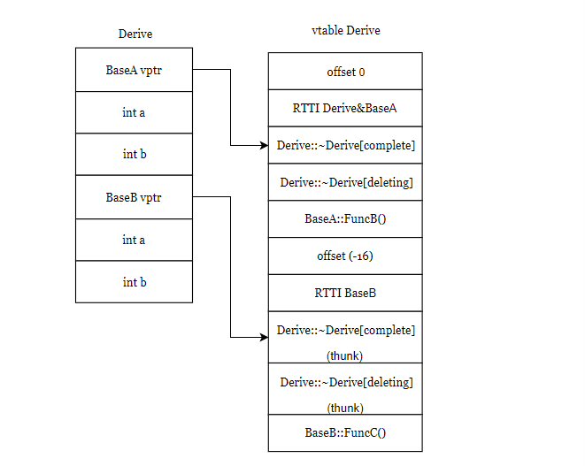

**offset_to_top(0)**：表示当前这个虚函数表（BaseA，Derive）地址距离对象顶部地址的偏移量，因为对象的头部就是虚函数表的指针，所以偏移量为0。  

再注意这里的**RTTI**中有了两项，表示BaseA和Derive的虚表地址是相同的，BaseA类里的虚函数和Derive类里的虚函数都在这个链条下，截至到`offset_to_top(-16)`之前都是BaseA和Derive的虚函数表。

**offset_to_top(-16)**：表示当前这个虚函数表（BaseB）地址距离对象顶部地址的偏移量，因为对象的头部就是虚函数表的指针，所以偏移量为-16，这里用于this指针偏移，下一小节会介绍。

注意下后面的这个RTTI：只有一项，表示BaseB的虚函数表，后面也有两个虚析构函数，为什么有四个Derive类的析构函数呢，又是怎么调用呢，请继续往下看~

#####多继承下含有覆盖函数的类对象的布局

    
    
    struct BaseA {
       BaseA() = default;
       virtual ~BaseA() = default;
       void FuncA() {}
       virtual void FuncB() {
           printf("BaseA FuncB\n");
      }
       int a;
       int b;
    };

    struct BaseB {
       BaseB() = default;
       virtual ~BaseB() = default;
       void FuncA() {}
       virtual void FuncC() {
           printf("BaseB FuncC\n");
      }
       int a;
       int b;
    };

    struct Derive : public BaseA, public BaseB{
       void FuncB() override {
           printf("Derive FuncB \n");
      }
       void FuncC() override {
           printf("Derive FuncC \n");
      }
    };

    int main() {
       BaseA a;
       Derive d;
       return 0;
    }
    

对象布局：  

    
    
    *** Dumping AST Record Layout
            0 | struct Derive
            0 |   struct BaseA (primary base)
            0 |     (BaseA vtable pointer)
            8 |     int a
           12 |     int b
           16 |   struct BaseB (base)
           16 |     (BaseB vtable pointer)
           24 |     int a
           28 |     int b
              | [sizeof=32, dsize=32, align=8,
              |  nvsize=32, nvalign=8]
    *** Dumping IRgen Record Layout
    

类大小仍然是32，和上面一样。  

虚函数表布局：

    
    
    Vtable for 'Derive' (11 entries).
      0 | offset_to_top (0)
      1 | Derive RTTI
          -- (BaseA, 0) vtable address --
          -- (Derive, 0) vtable address --
      2 | Derive::~Derive() [complete]
      3 | Derive::~Derive() [deleting]
      4 | void Derive::FuncB()
      5 | void Derive::FuncC()
      6 | offset_to_top (-16)
      7 | Derive RTTI
          -- (BaseB, 16) vtable address --
      8 | Derive::~Derive() [complete]
          [this adjustment: -16 non-virtual]
      9 | Derive::~Derive() [deleting]
          [this adjustment: -16 non-virtual]
     10 | void Derive::FuncC()
          [this adjustment: -16 non-virtual]
    

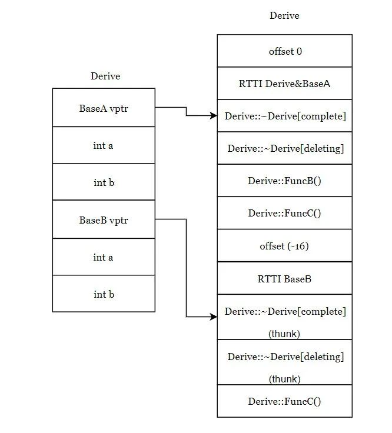

**offset_to_top(0)**：表示当前这个虚函数表（BaseA，Derive）地址距离对象顶部地址的偏移量，因为对象的头部就是虚函数表的指针，所以偏移量为0。  

再注意这里的**RTTI**中有了两项，表示BaseA和Derive的虚表地址是相同的，BaseA类里的虚函数和Derive类里的虚函数都在这个链条下，截至到**offset_to_top(-16)**之前都是BaseA和Derive的虚函数表。

**offset_to_top(-16)**：表示当前这个虚函数表（BaseB）地址距离对象顶部地址的偏移量，因为对象的头部就是虚函数表的指针，所以偏移量为-16。当基类BaseB的引用或指针base实际接受的是Derive类型的对象，执行base->FuncC()时候，由于FuncC()已经被重写，而此时的this指针指向的是BaseB类型的对象，需要对this指针进行调整，就是**offset_to_top(-16)**，所以this指针向上调整了16字节，之后调用FuncC()，就调用到了被重写后Derive虚函数表中的FuncC()函数。这些带adjustment标记的函数都是需要进行指针调整的。至于上面所说的这里虚函数是怎么调用的，估计您也明白了吧~

#####多重继承不同的继承顺序导致的类对象的布局相同吗？

    
    
    struct BaseA {
       BaseA() = default;
       virtual ~BaseA() = default;
       void FuncA() {}
       virtual void FuncB() {
           printf("BaseA FuncB\n");
      }
       int a;
       int b;
    };

    struct BaseB {
       BaseB() = default;
       virtual ~BaseB() = default;
       void FuncA() {}
       virtual void FuncC() {
           printf("BaseB FuncC\n");
      }
       int a;
       int b;
    };

    struct Derive : public BaseB, public BaseA{
       void FuncB() override {
           printf("Derive FuncB \n");
      }
       void FuncC() override {
           printf("Derive FuncC \n");
      }
    };

    int main() {
       BaseA a;
       Derive d;
       return 0;
    }
    

对象布局：

    
    
    *** Dumping AST Record Layout
            0 | struct Derive
            0 |   struct BaseB (primary base)
            0 |     (BaseB vtable pointer)
            8 |     int a
           12 |     int b
           16 |   struct BaseA (base)
           16 |     (BaseA vtable pointer)
           24 |     int a
           28 |     int b
              | [sizeof=32, dsize=32, align=8,
              |  nvsize=32, nvalign=8]
    *** Dumping IRgen Record Layout
    

这里可见，对象布局和上面的不相同啦，BaseB的虚函数表指针和数据在上面，BaseA的虚函数表指针和数据在下面，以A，B的顺序继承，对象的布局就是A在上B在下，以B，A的顺序继承，对象的布局就是B在上A在下。

虚函数表布局：

    
    
    Vtable for 'Derive' (11 entries).
      0 | offset_to_top (0)
      1 | Derive RTTI
          -- (BaseB, 0) vtable address --
          -- (Derive, 0) vtable address --
      2 | Derive::~Derive() [complete]
      3 | Derive::~Derive() [deleting]
      4 | void Derive::FuncC()
      5 | void Derive::FuncB()
      6 | offset_to_top (-16)
      7 | Derive RTTI
          -- (BaseA, 16) vtable address --
      8 | Derive::~Derive() [complete]
          [this adjustment: -16 non-virtual]
      9 | Derive::~Derive() [deleting]
          [this adjustment: -16 non-virtual]
     10 | void Derive::FuncB()
          [this adjustment: -16 non-virtual]
    

对象布局图如下：

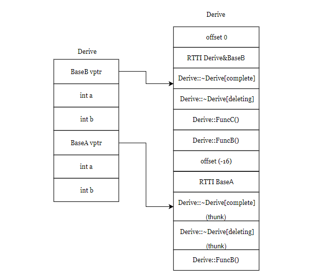

虚函数表的布局也有所不同，BaseB和Derive共用一个虚表地址，在整个虚表布局的上方，而布局的下半部分是BaseA的虚表，可见继承顺序不同，子类的虚表布局也有所不同。

#####虚继承的布局

    
    
    struct Base {
       Base() = default;
       virtual ~Base() = default;
       void FuncA() {}
       virtual void FuncB() {
           printf("BaseA FuncB\n");
      }
       int a;
       int b;
    };

    struct Derive : virtual public Base{
       void FuncB() override {
           printf("Derive FuncB \n");
      }
    };

    int main() {
       Base a;
       Derive d;
       return 0;
    }
    

对象布局：

    
    
    *** Dumping AST Record Layout
            0 | struct Derive
            0 |   (Derive vtable pointer)
            8 |   struct Base (virtual base)
            8 |     (Base vtable pointer)
           16 |     int a
           20 |     int b
              | [sizeof=24, dsize=24, align=8,
              |  nvsize=8, nvalign=8]
    *** Dumping IRgen Record Layout
    

虚继承下，这里的对象布局和普通单继承有所不同，普通单继承下子类和基类共用一个虚表地址，而在虚继承下，子类和虚基类分别有一个虚表地址的指针，两个指针大小总和为16，再加上a和b的大小8，为24。

虚函数表：

    
    
    Vtable for 'Derive' (13 entries).
      0 | vbase_offset (8)
      1 | offset_to_top (0)
      2 | Derive RTTI
          -- (Derive, 0) vtable address --
      3 | void Derive::FuncB()
      4 | Derive::~Derive() [complete]
      5 | Derive::~Derive() [deleting]
      6 | vcall_offset (-8)
      7 | vcall_offset (-8)
      8 | offset_to_top (-8)
      9 | Derive RTTI
          -- (Base, 8) vtable address --
     10 | Derive::~Derive() [complete]
          [this adjustment: 0 non-virtual, -24 vcall offset offset]
     11 | Derive::~Derive() [deleting]
          [this adjustment: 0 non-virtual, -24 vcall offset offset]
     12 | void Derive::FuncB()
          [this adjustment: 0 non-virtual, -32 vcall offset offset]
    

对象布局图如下：

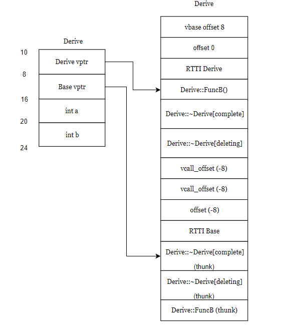

**vbase_offset(8)**：对象在对象布局中与指向虚基类虚函数表的指针地址的偏移量

**vcall_offset(-8)**：当**虚基类**Base的引用或指针base实际接受的是Derive类型的对象，执行base->FuncB()时候，由于FuncB()已经被重写，而此时的this指针指向的是Base类型的对象，需要对this指针进行调整，就是vcall_offset(-8)，所以this指针向上调整了8字节，之后调用FuncB()，就调用到了被重写后的FuncB()函数。

#####虚继承带未覆盖函数的对象布局

    
    
    struct Base {
       Base() = default;
       virtual ~Base() = default;
       void FuncA() {}
       virtual void FuncB() {
           printf("Base FuncB\n");
      }

       virtual void FuncC() {
           printf("Base FuncC\n");
      }
       int a;
       int b;
    };

    struct Derive : virtual public Base{
       void FuncB() override {
           printf("Derive FuncB \n");
      }
    };

    int main() {
       Base a;
       Derive d;
       return 0;
    }
    

对象布局：  

    
    
    *** Dumping AST Record Layout
            0 | struct Derive
            0 |   (Derive vtable pointer)
            8 |   struct Base (virtual base)
            8 |     (Base vtable pointer)
           16 |     int a
           20 |     int b
              | [sizeof=24, dsize=24, align=8,
              |  nvsize=8, nvalign=8]
    *** Dumping IRgen Record Layout
    

和上面虚继承情况下相同，普通单继承下子类和基类共用一个虚表地址，而在虚继承下，子类和虚基类分别有一个虚表地址的指针，两个指针大小总和为16，再加上a和b的大小8，为24。  

虚函数表布局：

    
    
    Vtable for 'Derive' (15 entries).
      0 | vbase_offset (8)
      1 | offset_to_top (0)
      2 | Derive RTTI
          -- (Derive, 0) vtable address --
      3 | void Derive::FuncB()
      4 | Derive::~Derive() [complete]
      5 | Derive::~Derive() [deleting]
      6 | vcall_offset (0)
      7 | vcall_offset (-8)
      8 | vcall_offset (-8)
      9 | offset_to_top (-8)
     10 | Derive RTTI
          -- (Base, 8) vtable address --
     11 | Derive::~Derive() [complete]
          [this adjustment: 0 non-virtual, -24 vcall offset offset]
     12 | Derive::~Derive() [deleting]
          [this adjustment: 0 non-virtual, -24 vcall offset offset]
     13 | void Derive::FuncB()
          [this adjustment: 0 non-virtual, -32 vcall offset offset]
     14 | void Base::FuncC()
    

对象布局图如下：  

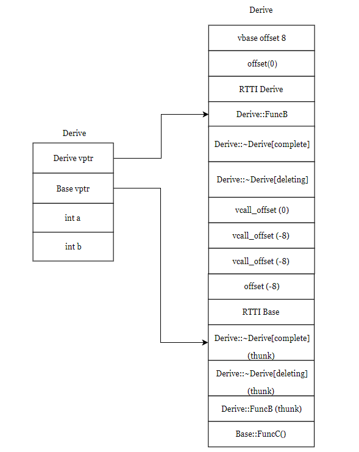

**vbase_offset(8)**：对象在对象布局中与指向虚基类虚函数表的指针地址的偏移量  

**vcall_offset(-8)**：当**虚基类**Base的引用或指针base实际接受的是Derive类型的对象，执行base->FuncB()时候，由于FuncB()已经被重写，而此时的this指针指向的是Base类型的对象，需要对this指针进行调整，就是vcall_offset(-8)，所以this指针向上调整了8字节，之后调用FuncB()，就调用到了被重写后的FuncB()函数。

**vcall_offset(0)**：当Base的引用或指针base实际接受的是Derive类型的对象，执行base->FuncC()时候，由于FuncC()没有被重写，所以不需要对this指针进行调整，就是vcall_offset(0)，之后调用FuncC()。

#####菱形继承下类对象的布局

    
    
    struct Base {
       Base() = default;
       virtual ~Base() = default;
       void FuncA() {}
       virtual void FuncB() {
           printf("BaseA FuncB\n");
      }
       int a;
       int b;
    };

    struct BaseA : virtual public Base {
       BaseA() = default;
       virtual ~BaseA() = default;
       void FuncA() {}
       virtual void FuncB() {
           printf("BaseA FuncB\n");
      }
       int a;
       int b;
    };

    struct BaseB : virtual public Base {
       BaseB() = default;
       virtual ~BaseB() = default;
       void FuncA() {}
       virtual void FuncC() {
           printf("BaseB FuncC\n");
      }
       int a;
       int b;
    };

    struct Derive : public BaseB, public BaseA{
       void FuncB() override {
           printf("Derive FuncB \n");
      }
       void FuncC() override {
           printf("Derive FuncC \n");
      }
    };

    int main() {
       BaseA a;
       Derive d;
       return 0;
    }
    

类对象布局：  

    
    
    *** Dumping AST Record Layout
            0 | struct Derive
            0 |   struct BaseB (primary base)
            0 |     (BaseB vtable pointer)
            8 |     int a
           12 |     int b
           16 |   struct BaseA (base)
           16 |     (BaseA vtable pointer)
           24 |     int a
           28 |     int b
           32 |   struct Base (virtual base)
           32 |     (Base vtable pointer)
           40 |     int a
           44 |     int b
              | [sizeof=48, dsize=48, align=8,
              |  nvsize=32, nvalign=8]
    *** Dumping IRgen Record Layout
    

大小为48，这里不用做过多介绍啦，相信您已经知道了吧。

虚函数表：

    
    
    Vtable for 'Derive' (20 entries).
      0 | vbase_offset (32)
      1 | offset_to_top (0)
      2 | Derive RTTI
          -- (BaseB, 0) vtable address --
          -- (Derive, 0) vtable address --
      3 | Derive::~Derive() [complete]
      4 | Derive::~Derive() [deleting]
      5 | void Derive::FuncC()
      6 | void Derive::FuncB()
      7 | vbase_offset (16)
      8 | offset_to_top (-16)
      9 | Derive RTTI
          -- (BaseA, 16) vtable address --
     10 | Derive::~Derive() [complete]
          [this adjustment: -16 non-virtual]
     11 | Derive::~Derive() [deleting]
          [this adjustment: -16 non-virtual]
     12 | void Derive::FuncB()
          [this adjustment: -16 non-virtual]
     13 | vcall_offset (-32)
     14 | vcall_offset (-32)
     15 | offset_to_top (-32)
     16 | Derive RTTI
          -- (Base, 32) vtable address --
     17 | Derive::~Derive() [complete]
          [this adjustment: 0 non-virtual, -24 vcall offset offset]
     18 | Derive::~Derive() [deleting]
          [this adjustment: 0 non-virtual, -24 vcall offset offset]
     19 | void Derive::FuncB()
          [this adjustment: 0 non-virtual, -32 vcall offset offset]
    

对象布局图如下：  

**vbase_offset (32)**  

**vbase_offset (16)**：对象在对象布局中与指向虚基类虚函数表的指针地址的偏移量

**offset_to_top (0)**

**offset_to_top (-16)**

**offset_to_top (-32)**：指向虚函数表的地址与对象顶部地址的偏移量。

**vcall_offset(-32)**：当**虚基类**Base的引用或指针base实际接受的是Derive类型的对象，执行base->FuncB()时候，由于FuncB()已经被重写，而此时的this指针指向的是Base类型的对象，需要对this指针进行调整，就是`vcall_offset(-32)`，所以this指针向上调整了32字节，之后调用FuncB()，就调用到了被重写后的FuncB()函数。

#####为什么要虚继承？

如图：

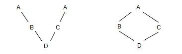

非虚继承时，显然D会继承两次A，内部就会存储两份A的数据浪费空间，而且还有二义性，D调用A的方法时，由于有两个A，究竟时调用哪个A的方法呢，编译器也不知道，就会报错，所以有了虚继承，解决了空间浪费以及二义性问题。在虚拟继承下，只有一个共享的基类子对象被继承，而无论该基类在派生层次中出现多少次。共享的基类子对象被称为虚基类。在虚继承下，基类子对象的复制及由此而引起的二义性都被消除了。  

#####为什么虚函数表中有两个析构函数？

前面的代码输出中我们可以看到虚函数表中有两个析构函数，一个标志为deleting，一个标志为complete，因为对象有两种构造方式，栈构造和堆构造，所以对应的实现上，对象也有两种析构方式，其中堆上对象的析构和栈上对象的析构不同之处在于，栈内存的析构不需要执行 delete 函数，会自动被回收。

#####为什么构造函数不能是虚函数？

构造函数就是为了在编译阶段确定对象的类型以及为对象分配空间，如果类中有虚函数，那就会在构造函数中初始化虚函数表，虚函数的执行却需要依赖虚函数表。如果构造函数是虚函数，那它就需要依赖虚函数表才可执行，而只有在构造函数中才会初始化虚函数表，鸡生蛋蛋生鸡的问题，很矛盾，所以构造函数不能是虚函数。

#####为什么基类析构函数要是虚函数？

一般基类的析构函数都要设置成虚函数，因为如果不设置成虚函数，在析构的过程中只会调用到基类的析构函数而不会调用到子类的析构函数，可能会产生内存泄漏。

#####小总结

**offset_to_top**：对象在对象布局中与对象顶部地址的偏移量。

**RTTI指针**：指向存储运行时类型信息(type_info)的地址，用于运行时类型识别，用于`typeid`和`dynamic_cast`。

**vbase_offset**：对象在对象布局中与指向虚基类虚函数表的指针地址的偏移量。

**vcall_offset**：父类引用或指针指向子类对象，调用被子类重写的方法时，用于对虚函数执行指针地址调整，方便成功调用被重写的方法。

**thunk**: 表示上面虚函数表中带有adjustment字段的函数调用需要先进行this指针调整，才可以调用到被子类重写的函数。

最后通过两张图总结一下对象在Linux中的布局：

    
    
    A *a = new Derive(); // A为Derive的基类
    

如图：

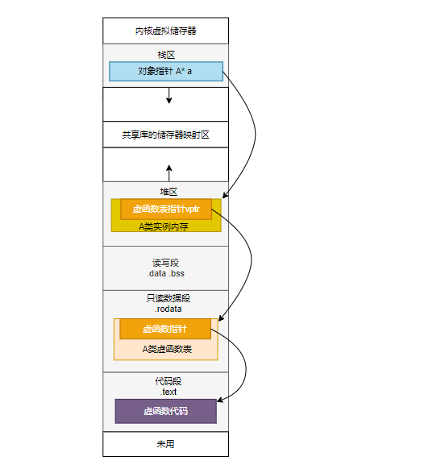

a作为对象指针存储在栈中，指向在堆中的类A的实例内存，其中实例内存布局中有虚函数表指针，指针指向的虚函数表存放在数据段中，虚函数表中的各个函数指针指向的函数
在代码段中。  

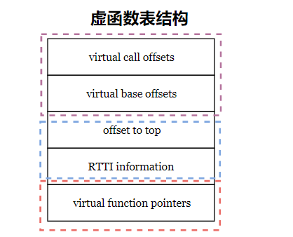

虚表结构大体如上图，正常的虚表结构中都含有后三项，当有虚继承情况下会有前两个表项。  

#####参考资料：

> https://www.cnblogs.com/qg-whz/p/4909359.html
> https://blog.csdn.net/fuzhongmin05/article/details/59112081
> https://zhuanlan.zhihu.com/p/67177829
> https://mp.weixin.qq.com/s/sqpwQpPYBFkPWCmccruvNw
> https://jacktang816.github.io/post/virtualfunction/
> https://blog.mengy.org/cpp-virtual-table-2/
> https://blog.mengy.org/cpp-virtual-table-1/
> https://blog.mengy.org/extend-gdb-with-python/
> https://www.zhihu.com/question/389546003/answer/1194780618
> https://www.zhihu.com/question/29251261/answer/1297439131
> https://zhuanlan.zhihu.com/p/41309205
> https://wizardforcel.gitbooks.io/100-gdb-tips/examine-memory.html
> https://www.cnblogs.com/xhb19960928/p/11720314.html
> https://www.lagou.com/lgeduarticle/113008.html
  
