 
<!--BEGIN_DATA
{
    "create_date": "2024-10-14 18:04", 
    "modify_date": "2024-10-14 18:04", 
    "is_top": "0", 
    "summary": "音视频技术原理及应用", 
    "tags": "音视频", 
    "file_name": "音视频技术原理及应用.md"
}
END_DATA-->

#### <p>原文出处：<a href='https://mp.weixin.qq.com/s/krCqizgTVG9_T7yGe5bi6Q' target='blank'>音视频技术原理及应用</a></p>

## 基础知识

### 音频基础

#### 声音转数字信号

> 音频基础知识及 PCM 技术详解

声音的本质是一种能量波。**音调**，由声音的频率决定。**音量**，由振幅和人离声源的距离决定。**音色**，由波形决定。从声音到数字信号，宏观上包括三个步骤：

  1. 声波通过空气传播到麦克风的振膜。
  2. 振膜随空气抖动的振幅大小产生相应的电学信号，即模拟信号（Analogue Signal）。
  3. 通过模数转换器 ADC 将模拟信号转换成数字信号（Digital Signal）。

数字音频的 A/D 转换涵盖三个过程：采样、量化以及编码。PCM（Pulse Code Modulation）脉冲编码调制属于数字通信的编码方式之一，它将一个时间连续且取值连续的模拟信号转化为时间离散、取值离散的数字信号，而后在信道中进行传输。

麦克风收集到的音源在本质上属于模拟信号。**采样**过程是将时间连续的模拟信号转变为时间离散、幅度连续的抽样信号，从而在时间轴上实现对信号的数字化操作。**量化**则是把时间离散且幅度连续的抽样信号进一步转换为时间离散、幅度离散的数字信号，在幅度轴上完成对信号的数字化处理。**编码**是把量化后的信号进行编码，形成由多位二进制码组成的码组来表示抽样值，以此完成从模拟信号到数字信号的转换，即按照特定格式记录采样和量化后的数字信息。编码后的二进制码组通过数字信道进行传输，在接收端，经过译码和滤波等操作，最终还原为模拟信号。

模数转换本质上就是把连续的模拟信号转换为成比例的、时间离散且幅度离散的数字信号。人耳所能感知到的声音频率范围处于 20Hz 至 20KHz 之间。根据香农采样定律，为了能够不失真地恢复模拟信号，采样频率应大于等于模拟信号频谱中最高频率的两倍。正因如此，音频文件的采样率通常在 40KHz 至 50KHz 左右。

#### 音频压缩

> 编码之 AAC 解析

理论上任何数字音频都无法做到完全还原模拟信号。而 PCM 编码作为模拟信号转换为数字信号时的**原始编码**，代表着数字音频的最佳保真水平，因此被约定为“无损编码”。音频压缩是对 PCM 编码进行的二次编码，其目的在于减小原始 PCM 编码的存储体积。音频二次编码分为两类，即**有损编码**和**无损编码**，也称为**有损压缩**和**无损压缩**。其中，无损意味着与 PCM 编码相对比，音质完全相同。而有损则是相较于 PCM 编码，会损失一部分音频质量。

**无损压缩**是指将数据进行压缩，通过解码能够还原成与原始数据完全一模一样的数据。例如 ALAC、APE、FLAC 等都属于无损音频格式。

**有损压缩**是通过消除冗余信息，只保留人耳能感知的声音频率在 20Hz-20000Hz 以内的数据。例如 MP3、AAC、OGG、WMA 等都属于有损音频格式。

人耳能感知的声音信号频率范围为 20Hz～20KHz，在此范围之外的频率信号均可视为冗余信息。人耳听觉还具有生理和心理声学现象，当强音信号与弱音信号同时存在时，弱音信号会被强音信号所屏蔽，此时弱音信号就可以视为冗余信息。这便是人耳听觉的掩蔽效应，主要表现在**频谱掩蔽效应**和**时域掩蔽效应**。在各大音乐平台的**无损音质**和**高品音质**对应的就是无损压缩和有损压缩，无损音质具有更高的保真度和还原度，适合专业音乐制作、高端音频设备等领域；无损压缩具有更高的码率和传输效率，适合大多数非专业的普通听众。通常情况下，高品音质的存储空间一般只有无损音质的三分之一。

### 视频基础

#### 编码原理

>   * 理解视频编解码技术
>
>   * 音视频h264编码介绍

我们可以将视频定义为在单位时间内连续的 n 帧，这可以视作一个新的维度，n 即为帧率，若单位时间为秒，则等同于 FPS（每秒帧数 Frames Per Second）。

播放一段视频时，每秒所需的数据量便是它的比特率（也就是常说的码率）。比特率决定视频的清晰度和流畅度，比特率越高，视频的质量就越好，但同时也需要更多的存储空间和带宽来传输。在选择视频的比特率时，需要根据实际情况进行权衡，以达到最佳的观看效果。

**比特率 = 宽 * 高 * 颜色深度 * 帧每秒**

一个相当典型的 30 分钟视频会议需要大约 447.9 GB 的存储空间，而一部 2 小时的电影需要几乎 1.79 TB（即 1790 GB）的空间。

单帧全彩色高清 1920×1080 视频（每像素 4 字节）为 8294400 字节，在帧率 30 的情况下，每秒高清视频将占用 237 MB。

<svg xmlns="http://www.w3.org/2000/svg" role="img" focusable="false" viewBox="0 -883.9 15913.4 1133.9" aria-hidden="true" style="-webkit-overflow-scrolling: touch; vertical-align: -0.566ex; width: 36.003ex; height: 2.565ex; max-width: 300% !important;">
   <g stroke="currentColor" fill="currentColor" stroke-width="0" transform="scale(1,-1)">
    <g data-mml-node="math">
     <g data-mml-node="mn">
      <path data-c="31" d="M213 578L200 573Q186 568 160 563T102 556H83V602H102Q149 604 189 617T245 641T273 663Q275 666 285 666Q294 666 302 660V361L303 61Q310 54 315 52T339 48T401 46H427V0H416Q395 3 257 3Q121 3 100 0H88V46H114Q136 46 152 46T177 47T193 50T201 52T207 57T213 61V578Z">
      </path>
      <path data-c="39" d="M352 287Q304 211 232 211Q154 211 104 270T44 396Q42 412 42 436V444Q42 537 111 606Q171 666 243 666Q245 666 249 666T257 665H261Q273 665 286 663T323 651T370 619T413 560Q456 472 456 334Q456 194 396 97Q361 41 312 10T208 -22Q147 -22 108 7T68 93T121 149Q143 149 158 135T173 96Q173 78 164 65T148 49T135 44L131 43Q131 41 138 37T164 27T206 22H212Q272 22 313 86Q352 142 352 280V287ZM244 248Q292 248 321 297T351 430Q351 508 343 542Q341 552 337 562T323 588T293 615T246 625Q208 625 181 598Q160 576 154 546T147 441Q147 358 152 329T172 282Q197 248 244 248Z" transform="translate(500,0)">
      </path>
      <path data-c="32" d="M109 429Q82 429 66 447T50 491Q50 562 103 614T235 666Q326 666 387 610T449 465Q449 422 429 383T381 315T301 241Q265 210 201 149L142 93L218 92Q375 92 385 97Q392 99 409 186V189H449V186Q448 183 436 95T421 3V0H50V19V31Q50 38 56 46T86 81Q115 113 136 137Q145 147 170 174T204 211T233 244T261 278T284 308T305 340T320 369T333 401T340 431T343 464Q343 527 309 573T212 619Q179 619 154 602T119 569T109 550Q109 549 114 549Q132 549 151 535T170 489Q170 464 154 447T109 429Z" transform="translate(1000,0)">
      </path>
      <path data-c="30" d="M96 585Q152 666 249 666Q297 666 345 640T423 548Q460 465 460 320Q460 165 417 83Q397 41 362 16T301 -15T250 -22Q224 -22 198 -16T137 16T82 83Q39 165 39 320Q39 494 96 585ZM321 597Q291 629 250 629Q208 629 178 597Q153 571 145 525T137 333Q137 175 145 125T181 46Q209 16 250 16Q290 16 318 46Q347 76 354 130T362 333Q362 478 354 524T321 597Z" transform="translate(1500,0)">
      </path>
     </g>
     <g data-mml-node="mo" transform="translate(2222.2,0)">
      <path data-c="2217" d="M229 286Q216 420 216 436Q216 454 240 464Q241 464 245 464T251 465Q263 464 273 456T283 436Q283 419 277 356T270 286L328 328Q384 369 389 372T399 375Q412 375 423 365T435 338Q435 325 425 315Q420 312 357 282T289 250L355 219L425 184Q434 175 434 161Q434 146 425 136T401 125Q393 125 383 131T328 171L270 213Q283 79 283 63Q283 53 276 44T250 35Q231 35 224 44T216 63Q216 80 222 143T229 213L171 171Q115 130 110 127Q106 124 100 124Q87 124 76 134T64 161Q64 166 64 169T67 175T72 181T81 188T94 195T113 204T138 215T170 230T210 250L74 315Q65 324 65 338Q65 353 74 363T98 374Q106 374 116 368T171 328L229 286Z">
      </path>
     </g>
     <g data-mml-node="mn" transform="translate(2944.4,0)">
      <path data-c="31" d="M213 578L200 573Q186 568 160 563T102 556H83V602H102Q149 604 189 617T245 641T273 663Q275 666 285 666Q294 666 302 660V361L303 61Q310 54 315 52T339 48T401 46H427V0H416Q395 3 257 3Q121 3 100 0H88V46H114Q136 46 152 46T177 47T193 50T201 52T207 57T213 61V578Z">
      </path>
      <path data-c="30" d="M96 585Q152 666 249 666Q297 666 345 640T423 548Q460 465 460 320Q460 165 417 83Q397 41 362 16T301 -15T250 -22Q224 -22 198 -16T137 16T82 83Q39 165 39 320Q39 494 96 585ZM321 597Q291 629 250 629Q208 629 178 597Q153 571 145 525T137 333Q137 175 145 125T181 46Q209 16 250 16Q290 16 318 46Q347 76 354 130T362 333Q362 478 354 524T321 597Z" transform="translate(500,0)">
      </path>
      <path data-c="38" d="M70 417T70 494T124 618T248 666Q319 666 374 624T429 515Q429 485 418 459T392 417T361 389T335 371T324 363L338 354Q352 344 366 334T382 323Q457 264 457 174Q457 95 399 37T249 -22Q159 -22 101 29T43 155Q43 263 172 335L154 348Q133 361 127 368Q70 417 70 494ZM286 386L292 390Q298 394 301 396T311 403T323 413T334 425T345 438T355 454T364 471T369 491T371 513Q371 556 342 586T275 624Q268 625 242 625Q201 625 165 599T128 534Q128 511 141 492T167 463T217 431Q224 426 228 424L286 386ZM250 21Q308 21 350 55T392 137Q392 154 387 169T375 194T353 216T330 234T301 253T274 270Q260 279 244 289T218 306L210 311Q204 311 181 294T133 239T107 157Q107 98 150 60T250 21Z" transform="translate(1000,0)">
      </path>
      <path data-c="30" d="M96 585Q152 666 249 666Q297 666 345 640T423 548Q460 465 460 320Q460 165 417 83Q397 41 362 16T301 -15T250 -22Q224 -22 198 -16T137 16T82 83Q39 165 39 320Q39 494 96 585ZM321 597Q291 629 250 629Q208 629 178 597Q153 571 145 525T137 333Q137 175 145 125T181 46Q209 16 250 16Q290 16 318 46Q347 76 354 130T362 333Q362 478 354 524T321 597Z" transform="translate(1500,0)">
      </path>
     </g>
     <g data-mml-node="mo" transform="translate(5166.7,0)">
      <path data-c="2217" d="M229 286Q216 420 216 436Q216 454 240 464Q241 464 245 464T251 465Q263 464 273 456T283 436Q283 419 277 356T270 286L328 328Q384 369 389 372T399 375Q412 375 423 365T435 338Q435 325 425 315Q420 312 357 282T289 250L355 219L425 184Q434 175 434 161Q434 146 425 136T401 125Q393 125 383 131T328 171L270 213Q283 79 283 63Q283 53 276 44T250 35Q231 35 224 44T216 63Q216 80 222 143T229 213L171 171Q115 130 110 127Q106 124 100 124Q87 124 76 134T64 161Q64 166 64 169T67 175T72 181T81 188T94 195T113 204T138 215T170 230T210 250L74 315Q65 324 65 338Q65 353 74 363T98 374Q106 374 116 368T171 328L229 286Z">
      </path>
     </g>
     <g data-mml-node="mn" transform="translate(5888.9,0)">
      <path data-c="34" d="M462 0Q444 3 333 3Q217 3 199 0H190V46H221Q241 46 248 46T265 48T279 53T286 61Q287 63 287 115V165H28V211L179 442Q332 674 334 675Q336 677 355 677H373L379 671V211H471V165H379V114Q379 73 379 66T385 54Q393 47 442 46H471V0H462ZM293 211V545L74 212L183 211H293Z">
      </path>
     </g>
     <g data-mml-node="mo" transform="translate(6611.1,0)">
      <path data-c="2217" d="M229 286Q216 420 216 436Q216 454 240 464Q241 464 245 464T251 465Q263 464 273 456T283 436Q283 419 277 356T270 286L328 328Q384 369 389 372T399 375Q412 375 423 365T435 338Q435 325 425 315Q420 312 357 282T289 250L355 219L425 184Q434 175 434 161Q434 146 425 136T401 125Q393 125 383 131T328 171L270 213Q283 79 283 63Q283 53 276 44T250 35Q231 35 224 44T216 63Q216 80 222 143T229 213L171 171Q115 130 110 127Q106 124 100 124Q87 124 76 134T64 161Q64 166 64 169T67 175T72 181T81 188T94 195T113 204T138 215T170 230T210 250L74 315Q65 324 65 338Q65 353 74 363T98 374Q106 374 116 368T171 328L229 286Z">
      </path>
     </g>
     <g data-mml-node="mn" transform="translate(7333.3,0)">
      <path data-c="33" d="M127 463Q100 463 85 480T69 524Q69 579 117 622T233 665Q268 665 277 664Q351 652 390 611T430 522Q430 470 396 421T302 350L299 348Q299 347 308 345T337 336T375 315Q457 262 457 175Q457 96 395 37T238 -22Q158 -22 100 21T42 130Q42 158 60 175T105 193Q133 193 151 175T169 130Q169 119 166 110T159 94T148 82T136 74T126 70T118 67L114 66Q165 21 238 21Q293 21 321 74Q338 107 338 175V195Q338 290 274 322Q259 328 213 329L171 330L168 332Q166 335 166 348Q166 366 174 366Q202 366 232 371Q266 376 294 413T322 525V533Q322 590 287 612Q265 626 240 626Q208 626 181 615T143 592T132 580H135Q138 579 143 578T153 573T165 566T175 555T183 540T186 520Q186 498 172 481T127 463Z">
      </path>
      <path data-c="30" d="M96 585Q152 666 249 666Q297 666 345 640T423 548Q460 465 460 320Q460 165 417 83Q397 41 362 16T301 -15T250 -22Q224 -22 198 -16T137 16T82 83Q39 165 39 320Q39 494 96 585ZM321 597Q291 629 250 629Q208 629 178 597Q153 571 145 525T137 333Q137 175 145 125T181 46Q209 16 250 16Q290 16 318 46Q347 76 354 130T362 333Q362 478 354 524T321 597Z" transform="translate(500,0)">
      </path>
     </g>
     <g data-mml-node="TeXAtom" data-mjx-texclass="ORD" transform="translate(8333.3,0)">
      <g data-mml-node="mo">
       <path data-c="2F" d="M423 750Q432 750 438 744T444 730Q444 725 271 248T92 -240Q85 -250 75 -250Q68 -250 62 -245T56 -231Q56 -221 230 257T407 740Q411 750 423 750Z">
       </path>
      </g>
     </g>
     <g data-mml-node="msup" transform="translate(8833.3,0)">
      <g data-mml-node="mn">
       <path data-c="31" d="M213 578L200 573Q186 568 160 563T102 556H83V602H102Q149 604 189 617T245 641T273 663Q275 666 285 666Q294 666 302 660V361L303 61Q310 54 315 52T339 48T401 46H427V0H416Q395 3 257 3Q121 3 100 0H88V46H114Q136 46 152 46T177 47T193 50T201 52T207 57T213 61V578Z">
       </path>
       <path data-c="30" d="M96 585Q152 666 249 666Q297 666 345 640T423 548Q460 465 460 320Q460 165 417 83Q397 41 362 16T301 -15T250 -22Q224 -22 198 -16T137 16T82 83Q39 165 39 320Q39 494 96 585ZM321 597Q291 629 250 629Q208 629 178 597Q153 571 145 525T137 333Q137 175 145 125T181 46Q209 16 250 16Q290 16 318 46Q347 76 354 130T362 333Q362 478 354 524T321 597Z" transform="translate(500,0)">
       </path>
       <path data-c="32" d="M109 429Q82 429 66 447T50 491Q50 562 103 614T235 666Q326 666 387 610T449 465Q449 422 429 383T381 315T301 241Q265 210 201 149L142 93L218 92Q375 92 385 97Q392 99 409 186V189H449V186Q448 183 436 95T421 3V0H50V19V31Q50 38 56 46T86 81Q115 113 136 137Q145 147 170 174T204 211T233 244T261 278T284 308T305 340T320 369T333 401T340 431T343 464Q343 527 309 573T212 619Q179 619 154 602T119 569T109 550Q109 549 114 549Q132 549 151 535T170 489Q170 464 154 447T109 429Z" transform="translate(1000,0)">
       </path>
       <path data-c="34" d="M462 0Q444 3 333 3Q217 3 199 0H190V46H221Q241 46 248 46T265 48T279 53T286 61Q287 63 287 115V165H28V211L179 442Q332 674 334 675Q336 677 355 677H373L379 671V211H471V165H379V114Q379 73 379 66T385 54Q393 47 442 46H471V0H462ZM293 211V545L74 212L183 211H293Z" transform="translate(1500,0)">
       </path>
      </g>
      <g data-mml-node="mn" transform="translate(2033,413) scale(0.707)">
       <path data-c="32" d="M109 429Q82 429 66 447T50 491Q50 562 103 614T235 666Q326 666 387 610T449 465Q449 422 429 383T381 315T301 241Q265 210 201 149L142 93L218 92Q375 92 385 97Q392 99 409 186V189H449V186Q448 183 436 95T421 3V0H50V19V31Q50 38 56 46T86 81Q115 113 136 137Q145 147 170 174T204 211T233 244T261 278T284 308T305 340T320 369T333 401T340 431T343 464Q343 527 309 573T212 619Q179 619 154 602T119 569T109 550Q109 549 114 549Q132 549 151 535T170 489Q170 464 154 447T109 429Z">
       </path>
      </g>
     </g>
     <g data-mml-node="mo" transform="translate(11547.7,0)">
      <path data-c="2248" d="M55 319Q55 360 72 393T114 444T163 472T205 482Q207 482 213 482T223 483Q262 483 296 468T393 413L443 381Q502 346 553 346Q609 346 649 375T694 454Q694 465 698 474T708 483Q722 483 722 452Q722 386 675 338T555 289Q514 289 468 310T388 357T308 404T224 426Q164 426 125 393T83 318Q81 289 69 289Q55 289 55 319ZM55 85Q55 126 72 159T114 210T163 238T205 248Q207 248 213 248T223 249Q262 249 296 234T393 179L443 147Q502 112 553 112Q609 112 649 141T694 220Q694 249 708 249T722 217Q722 153 675 104T555 55Q514 55 468 76T388 123T308 170T224 192Q164 192 125 159T83 84Q80 55 69 55Q55 55 55 85Z">
      </path>
     </g>
     <g data-mml-node="mn" transform="translate(12603.4,0)">
      <path data-c="32" d="M109 429Q82 429 66 447T50 491Q50 562 103 614T235 666Q326 666 387 610T449 465Q449 422 429 383T381 315T301 241Q265 210 201 149L142 93L218 92Q375 92 385 97Q392 99 409 186V189H449V186Q448 183 436 95T421 3V0H50V19V31Q50 38 56 46T86 81Q115 113 136 137Q145 147 170 174T204 211T233 244T261 278T284 308T305 340T320 369T333 401T340 431T343 464Q343 527 309 573T212 619Q179 619 154 602T119 569T109 550Q109 549 114 549Q132 549 151 535T170 489Q170 464 154 447T109 429Z">
      </path>
      <path data-c="33" d="M127 463Q100 463 85 480T69 524Q69 579 117 622T233 665Q268 665 277 664Q351 652 390 611T430 522Q430 470 396 421T302 350L299 348Q299 347 308 345T337 336T375 315Q457 262 457 175Q457 96 395 37T238 -22Q158 -22 100 21T42 130Q42 158 60 175T105 193Q133 193 151 175T169 130Q169 119 166 110T159 94T148 82T136 74T126 70T118 67L114 66Q165 21 238 21Q293 21 321 74Q338 107 338 175V195Q338 290 274 322Q259 328 213 329L171 330L168 332Q166 335 166 348Q166 366 174 366Q202 366 232 371Q266 376 294 413T322 525V533Q322 590 287 612Q265 626 240 626Q208 626 181 615T143 592T132 580H135Q138 579 143 578T153 573T165 566T175 555T183 540T186 520Q186 498 172 481T127 463Z" transform="translate(500,0)">
      </path>
      <path data-c="37" d="M55 458Q56 460 72 567L88 674Q88 676 108 676H128V672Q128 662 143 655T195 646T364 644H485V605L417 512Q408 500 387 472T360 435T339 403T319 367T305 330T292 284T284 230T278 162T275 80Q275 66 275 52T274 28V19Q270 2 255 -10T221 -22Q210 -22 200 -19T179 0T168 40Q168 198 265 368Q285 400 349 489L395 552H302Q128 552 119 546Q113 543 108 522T98 479L95 458V455H55V458Z" transform="translate(1000,0)">
      </path>
     </g>
     <g data-mml-node="mi" transform="translate(14103.4,0)">
      <path data-c="1D440" d="M289 629Q289 635 232 637Q208 637 201 638T194 648Q194 649 196 659Q197 662 198 666T199 671T201 676T203 679T207 681T212 683T220 683T232 684Q238 684 262 684T307 683Q386 683 398 683T414 678Q415 674 451 396L487 117L510 154Q534 190 574 254T662 394Q837 673 839 675Q840 676 842 678T846 681L852 683H948Q965 683 988 683T1017 684Q1051 684 1051 673Q1051 668 1048 656T1045 643Q1041 637 1008 637Q968 636 957 634T939 623Q936 618 867 340T797 59Q797 55 798 54T805 50T822 48T855 46H886Q892 37 892 35Q892 19 885 5Q880 0 869 0Q864 0 828 1T736 2Q675 2 644 2T609 1Q592 1 592 11Q592 13 594 25Q598 41 602 43T625 46Q652 46 685 49Q699 52 704 61Q706 65 742 207T813 490T848 631L654 322Q458 10 453 5Q451 4 449 3Q444 0 433 0Q418 0 415 7Q413 11 374 317L335 624L267 354Q200 88 200 79Q206 46 272 46H282Q288 41 289 37T286 19Q282 3 278 1Q274 0 267 0Q265 0 255 0T221 1T157 2Q127 2 95 1T58 0Q43 0 39 2T35 11Q35 13 38 25T43 40Q45 46 65 46Q135 46 154 86Q158 92 223 354T289 629Z">
      </path>
     </g>
     <g data-mml-node="mi" transform="translate(15154.4,0)">
      <path data-c="1D435" d="M231 637Q204 637 199 638T194 649Q194 676 205 682Q206 683 335 683Q594 683 608 681Q671 671 713 636T756 544Q756 480 698 429T565 360L555 357Q619 348 660 311T702 219Q702 146 630 78T453 1Q446 0 242 0Q42 0 39 2Q35 5 35 10Q35 17 37 24Q42 43 47 45Q51 46 62 46H68Q95 46 128 49Q142 52 147 61Q150 65 219 339T288 628Q288 635 231 637ZM649 544Q649 574 634 600T585 634Q578 636 493 637Q473 637 451 637T416 636H403Q388 635 384 626Q382 622 352 506Q352 503 351 500L320 374H401Q482 374 494 376Q554 386 601 434T649 544ZM595 229Q595 273 572 302T512 336Q506 337 429 337Q311 337 310 336Q310 334 293 263T258 122L240 52Q240 48 252 48T333 46Q422 46 429 47Q491 54 543 105T595 229Z">
      </path>
     </g>
    </g>
   </g>
  </svg>

在这种前提下，1 分钟的资源就需要 13.9 GB 的存储空间，30 分钟视频会议需要大约 417 GB 的存储空间，而一部 2 小时的电影需要几乎 1.63 TB的存储空间。显然这么大的数据是无法接受的，因此不得不对视频资源进行压缩，即编码。

视频编码的核心思想在于去除冗余信息，而这些冗余信息主要包含以下几个方面：

  * 空间冗余：图像相邻像素之间有较强的相关性。例如，在一幅风景图像中，同一片天空区域的相邻像素颜色和亮度可能非常接近，这就形成了空间冗余。
  * 时间冗余：视频序列的相邻图像之间内容相似。例如，在一个人物讲话的视频中，连续的几帧画面中人物的姿势和背景可能变化不大，这就产生了时间冗余。
  * 编码冗余：不同的像素值出现的概率并不相同。如果采用固定长度的编码方式，对于出现概率高的像素值和出现概率低的像素值分配相同的编码长度，就会造成编码冗余。
  * 视觉冗余：人的视觉系统对某些细节并不敏感。例如，在一幅图像中，细微的颜色变化或者一些高频的纹理可能不会被人眼轻易察觉，这些部分的信息可以在一定程度上进行压缩而不影响整体的视觉效果。
  * 知识冗余：一些规律性的结构可以由先验知识和背景知识得到。例如，在一幅建筑物的图像中，我们可以根据建筑的结构特点和常见的设计规律来预测某些部分的像素值，从而减少需要存储的信息量。

#### 视频压缩

> H.264&H.265视频编码原理介绍与对比

H.264/AVC 采用的核心算法是**帧内压缩**和**帧间压缩**，帧内压缩是生成 I 帧的算法，帧间压缩是生成 B 帧和 P 帧的算法。

帧内压缩，亦称为空间压缩。在对一帧图像进行压缩时，仅仅考虑本帧的数据，而不涉及相邻帧之间的冗余信息，这在实际操作中与静态图像压缩较为相似。帧内通常采用有损压缩算法，因为帧内压缩是对一个完整的图像进行编码，所以能够独立地进行解码和显示。不过，帧内压缩一般难以达到很高的压缩率，其效果与编码 JPEG 大致相当。帧间压缩的原理在于：相邻的几帧数据具有很大的相关性，或者说前后两帧的信息变化非常小。也就是说，连续的视频中其相邻帧之间存在冗余信息。根据这一特性，对相邻帧之间的冗余量进行压缩，就能够进一步提高压缩量，减小压缩比。

帧间压缩，亦称为时间压缩。其主要通过对时间轴上不同帧之间的数据进行比较从而实现压缩。帧间压缩一般是无损的，其中帧差值算法是一种典型的时间压缩方法。该算法通过对比本帧与相邻帧之间的差异，仅记录本帧与其相邻帧的差值信息。这样一来，就能够大大减少数据量，因为在很多情况下，相邻帧之间的变化往往是局部的、微小的，只需要记录这些变化部分，在播放时结合相邻帧的信息即可还原出当前帧的画面，从而实现高效的视频压缩。

编码压缩的步骤大致如下：

  1. 分组，也就是将一系列变换不大的图像归为一个组，也就是一个序列，也就是 GOP；
  2. 定义帧，将每组的图像帧归分为 I 帧、P 帧和 B 帧三种类型；
  3. 预测帧，以 I 帧做为基础帧，以 I 帧预测 P 帧，再由 I 帧和 P 帧预测 B 帧；
  4. 数据传输，最后将 I 帧数据与预测的差值信息进行存储和传输。

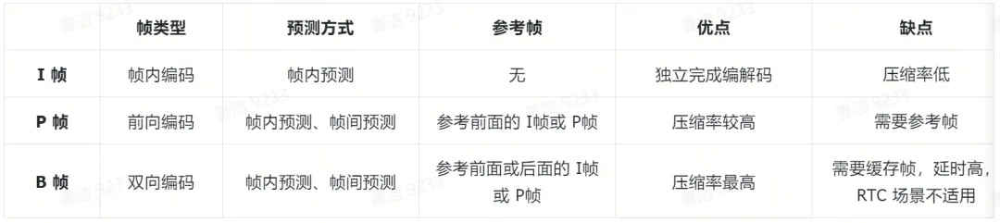

#### 码流结构

>   * H.264码流结构
>
>   * 音视频基础：H265/HEVC&码流结构
>
>   * H.265 如何比 H.264 提升 40% 编码效率

从码流功能角度分为 NAL 层和 VCL 层。**NAL 网络抽象层**负责以网络所要求的恰当的方式对数据进行打包和传送。**VCL视频编码层**包括核心压缩引擎和块，宏块和片的语法级别定义，设计目标是尽可能地独立于网络进行高效的编码。

从码流功能角度可分为 **NAL（网络抽象层）** 和 **VCL（视频编码层）** 。

NAL 负责以网络所要求的恰当方式对数据进行打包和传送。它能够根据不同的网络环境和传输需求，对视频编码数据进行有效的封装和处理，确保数据能够在各种网络条件下稳定传输。

VCL 则包括核心压缩引擎以及块、宏块和片的语法级别定义。其设计目标是尽可能地独立于网络进行高效的编码。VCL专注于视频内容的压缩编码，通过各种先进的编码技术去除视频中的冗余信息，以实现高压缩比和良好的图像质量。

码流是由一个个 NALU（NAL Unit）组成的，每个 NAL 单元包括 NALU头 + RBSP。


一帧图片经过 H.264 编码器之后，会被编码为一个或多个切片（Slice）。而 NALU（Network Abstraction Layer Unit，网络抽象层单元）则是这些切片的载体。切片的存在主要是为了限制误码的扩散和传输。切片头中包含着诸多重要信息，如切片类型、切片中的宏块类型、切片帧的数量、切片所属的图像以及对应的帧的设置和参数等。切片体所包含的数据则是宏块。宏块作为视频信息的主要承载者，除了含有宏块类型、预测类型、编码块模式和量化参数之外，还包含着每一个像素的亮度分量（Y）以及色度信息（蓝色色度分量 Cb、红色色度分量 Cr）。视频解码的主要工作就在于提供高效的方式，从码流中获取宏块中的像素阵列，从而实现视频的播放和显示。

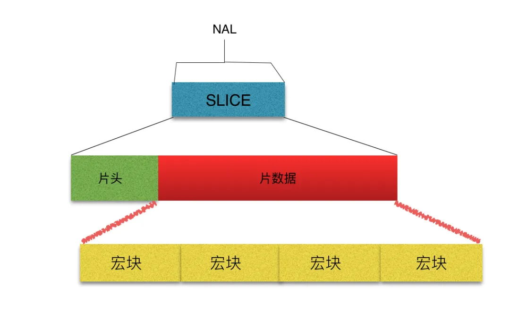

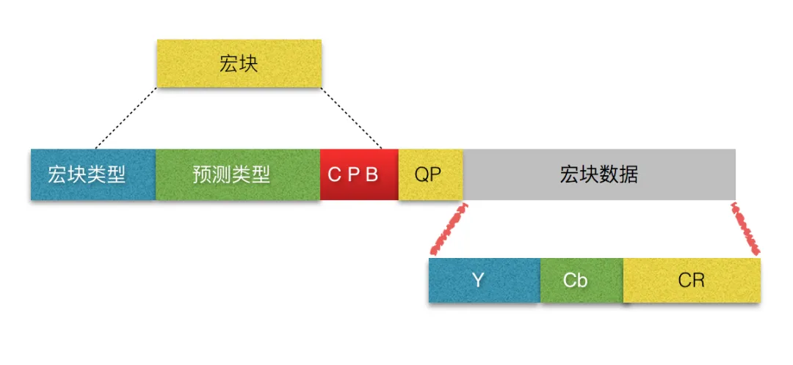

H.265 引入了编码树单元（Coding Tree Unit，CTU）和编码树块（Coding Tree Block，CTB）。在 H.265 中，CTU 的概念与 H.264 的宏块有一定的相似性，但也存在明显区别。H.264 的宏块采用固定的 16×16 的离散余弦变换（DCT），而 H.265 的 CTU 则同时运用了离散余弦变化（DCT）和离散正弦变化（DST），并且像素大小为 4×4 到 64×64 的动态可变块，这种设计使得 H.265 在处理不同类型的图像内容时更加灵活高效。其中，每个 CTU 也是由一个亮度 CTB（Y）、两个色度 CTB（Cb 和 Cr）以及一些关联的语法元素组成。这些语法元素为解码器提供了必要的信息，以便正确地解析和重建视频图像。通过这种方式，H.265能够在保证图像质量的前提下，进一步提高压缩效率，减少视频文件的大小，适应不同的网络环境和存储需求。

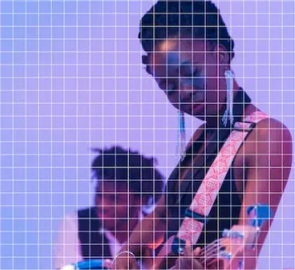

**H.264/AVC Macroblocks**  

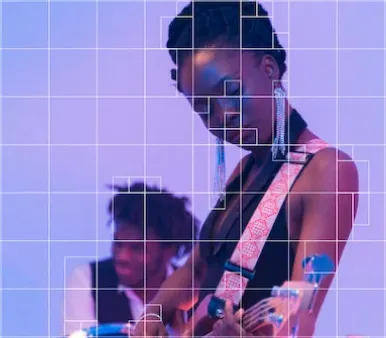

**H.265/HEVC Macroblocks**  

  * **YCbCr** - YUV 的衍生版本，用于数字视频处理领域，将色彩空间分为亮度分量（Y）和色度分量（Cb、Cr），Y 代表亮度、Cb 代表蓝色色度分量、Cr 代表红色色度分量。
  * **MB** - 宏块（Macro Block），在不同的编码标准有不同的叫法， H.264/AVC 的 MB 是视频编码的基本单元，常见的大小有 16x16、64x64 等。编码时每一帧画面都会被按照固定大小分割成大量 MB。
  * **CBP** - 编码块模式（Coded Block Pattern），描述视频帧的分块方式，例如实际选择 8×8 还是 16×16 的宏块进行编码处理。其选择和应用取决于视频内容的特性、编码效率的要求以及传输或存储的限制。
  * **QP** - 量化参数（Quantization Parameter）。视频压缩一般为有损压缩，编码时需要为每一帧以及每一个 MB 选择 QP，用以控制画面质量与码率。QP 越大，则损失的信息越多，画面质量越差，但压缩率也越高。

## 优化算法

### 音频优化

#### 音频去噪

根据噪声与信号的相关性，可将噪声分为**加性噪声**和**乘性噪声**。加噪信号是指噪声与信号呈加和关系，此时信号和噪声是不相关的。例如，在音频录制过程中，环境中的白噪声与音频信号叠加在一起，就属于加性噪声。乘性噪声是指噪声和信号为乘积关系，此时噪声和信号是相关联的。例如，在无线通信过程中，由于信道衰落等因素，信号在传输过程中会受到与信号强度相关的噪声影响，就属于乘性噪声。

**时域去噪算法**，基于时间域的滤波过程，发生在时间轴上，常见的包括移动平均法、中位值法、标准差法等。移动平均滤波器主要通过计算信号的移动平均值来达到消除噪声的目的。其算法的主要思想是对信号进行滑动窗口处理，将窗口内的数据进行平均化操作，从而得到平滑后的信号。这种方式能够有效地去除周期性噪声和高频噪声，因为这些噪声在短时间内的波动较大，通过平均化处理可以降低其影响。同时，移动平均法还能保留信号的整体趋势，不会使信号在去噪过程中失去其主要特征。

**频域去噪算法**，基于频谱分析的滤波过程，发生在频率轴上，常见的包括傅里叶变化、离散余弦变换等。对于音频信号而言，离散傅里叶变换（DFT）是信号分析的最基本方法，它能把信号从时间域变换到频率域，进而研究信号的频谱结构和变化规律。通常会对音频资源进行一次快速傅里叶变换（FFT），然后再用滤波器过滤噪声，常用的包括低通滤波器、高通滤波器、带通滤波器和带阻滤波器等。低/高通滤波器分别削弱高/低频信号而保留低/高频信号；带通/阻滤波器是将某个频率范围的信号通过/削弱而削弱/通过其他频率范围内的信号。

**小波去噪算法**，对含噪声信号进行小波变换，将信号从时域转换到小波域；对变换得到的小波系数进行某种处理，根据设定的阈值，将小于阈值的小波系数视为噪声并进行相应的处理，而保留大于阈值的小波系数，认为它们主要代表信号的特征；对处理后的小波系数进行小波逆变换，得到去噪后的信号。小波去噪问题的本质是一个函数逼近问题，即如何在由小波母函数伸缩和平移版本所展成的函数空间中，根据提出的衡量准则，寻找对原信号的最佳逼近（**阈值**）。通过这种方式，能够尽可能地区分原信号和噪声信号，从而实现有效的去噪。

**维纳滤波算法**是一种以最小平方为最优准则的线性滤波算法，利用输入信号与量测信号的统计特性，通过求解维纳-霍夫方程获得在最小均方误差准则下的最优解。由于维纳滤波器要求得到半无限时间区间内的全部观察数据的条件很难满足，同时它也不能用于噪声为非平稳的随机过程的情况，所以在实际问题中应用不多。**卡尔曼滤波算法**是维纳滤波算法的发展，它解决没有期望响应作为参考信号和通信环境为非平稳时的状态估计问题，因此卡尔曼滤波器在各种最优滤波和最优控制问题中得到极其广泛的应用。

**自适应去噪算法**，根据噪声的特征来自动调整滤波器的系数，主要算法有 SDA、LMS、RLS 等。自适应滤波是近年以来发展起来的一种最佳滤波方法，原理是利用前一时刻获得的滤波结果，自动调节现时刻的滤波器参数，以适应信号和噪声的未知特性，它是在维纳滤波、卡尔曼滤波等线性滤波基础上发展起来的一种最佳滤波方法。其滤波器分为线性自适应滤波器和非线性自适应滤波器。绝大多数自适应滤波器皆为线性滤波器，而非线性自适应滤波器包括 Voetlrra 滤波器和基于神经网络的自适应滤波器。

  * **噪声** - 不期望接收到的信号。
  * **滤波** - 降噪的常用的手段。
  * **SDA** - Steepest Descent Algorithm，最速下降法。
  * **LMS** - Least Mean Square，最小均方法。
  * **RLS** - Recursive Least Square，递推最小二乘法。

#### 回声消除

> AEC 背景介绍

产生回声的原因是声音信号经过一系列反射之后再次被录进麦克风。通信系统的回声主要分为两类：电路回声和声学回声。

造成电路回声的根本原因是转换混合器的二线 - 四线阻抗无法完全匹配。这种不匹配使得混合器接收线路的语音信号流失到发送线路，进而产生回声信号。由于电路回声信号
具有线性且稳定的特点，所以相对比较容易将其消除。

在麦克风与扬声器互相作用影响的双工通信系统中极易产生声学回声。声学回声信号根据传输途径的差别可以分别**直接回声信号（线性回声）**和**间接回声信号（非线性回声）** 。近端扬声器将语音信号播放出来后，被近端麦克风直接采集后得到的回声为直接回声。直接回声不受环境的影响，主要与扬声器到麦克风的距离及位置有很大的关系，因此直接回声是一种线性信号。而近端扬声器将语音信号播放出来后，语音信号经过复杂多变的墙面反射后由近端麦克风采集，这种回声为间接回声。间接回声的大小与房间环境、物品摆放以及墙面吸引系数等等因素有关，所以间接回声是一种非线性信号。

针对回声消除（AEC，Acoustic Echo Cancellation）问题，目前最流行的算法是基于自适应滤波的回声消除算法。该算法通过使用自适应滤波算法来调整滤波器的权值向量，其目的是计算出近似的回声路径，以无限逼近真实回声路径。这样一来，就能够得到估计的回声信号。然后，在语音和回声的混合信号中除去此估计
的回声信号，从而实现回声的消除。

#### 音量均衡

>   * What is Loudness?
>
>   * Convert loudness between phon and sone units
>
>   * 如何理解“音量”和“响度”的概念？
>
>   * 主流网络平台音量归一化方案调研

由于不同视频的录制音量不同，在极端情况下(尖叫声、爆炸声)会严重影响用户观看体验。**音量低**，则会听不清，需要调大音量；**音量高**，则太吵了，需要降低音量；**音量均衡**，通过调整音频信号的音量，使得不同频率的声音在听觉上的强度大致相等，从而获得更加均衡和自然的音质。

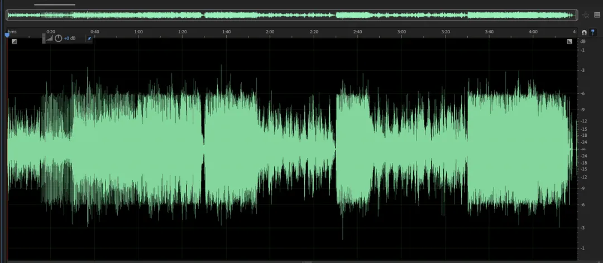

**音量均衡** **前的波形图**

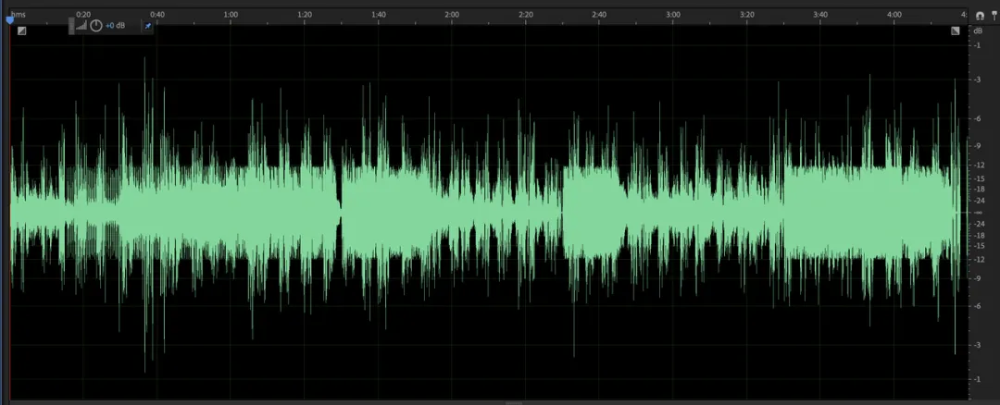

**音量均衡** **后的波形图**

衡量声音的大小往往会用到“音量 Volume”和“响度 Loudness”，分贝（dB/dBSPL）不能像赫兹、克、米那样给出一个客观的量，而只能给出两个相
同物理量的比值，所以是一种相对的概念。人耳对不同频率的“响度”感受存在差异，如下图的“等响曲线”图。其中 phon 是响度级的单位，规定在 1000Hz时，1dBSPL=1phon。在 40phon 以上的区域，当声压提高十倍时，人类的听觉感知只会提高两倍。为了让响度和听觉感知尽量呈线性关系，需要引入另一个响度单位 sone，40phon 等同于 1sone。

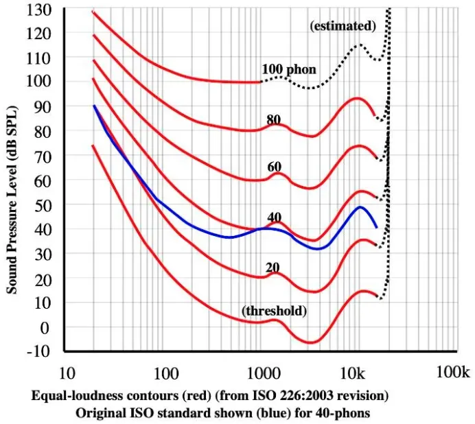

**等响曲线图**

过去，工程师们常常结合使用峰值表、VU 表以及他们的耳朵来确定音轨的真实感知响度，然而，这种方式存在一定的局限性。2000 年，Katz 提出了一种K-Metering的计量标准，该标准将过去的最佳概念与当前的心理声学相结合。虽然不同类型的音乐需要不同的动态余量，但这种方式能够将音乐的平均水平标准化。在此基础上，将K-Metering 进一步完善后，现代标准计量方法 LKFS 被国际电信联盟（ITU）制定并发布，从而实现了视频格式音频电平的标准化。如今，大多数广播、电影和视频游戏公司都采用 LKFS 作为测量响度的标准。LKFS的采用使得音频制作和播放更加规范和统一，有助于提高音频质量和用户体验。同时，它也为不同平台和设备之间的音频兼容性提供了保障。

<table><thead><tr style="border-width: 1px 0px 0px;border-right-style: initial;border-bottom-style: initial;border-left-style: initial;border-right-color: initial;border-bottom-color: initial;border-left-color: initial;border-top-style: solid;border-top-color: rgb(204, 204, 204);background-color: white;"><th style="border-top-width: 1px;border-color: rgb(204, 204, 204);text-align: left;background-color: rgb(240, 240, 240);"><strong>Audio Output</strong></th><th style="border-top-width: 1px;border-color: rgb(204, 204, 204);text-align: left;background-color: rgb(240, 240, 240);"><strong>LKFS Normalization</strong></th></tr></thead><tbody style="border-width: 0px;border-style: initial;border-color: initial;"><tr style="border-width: 1px 0px 0px;border-right-style: initial;border-bottom-style: initial;border-left-style: initial;border-right-color: initial;border-bottom-color: initial;border-left-color: initial;border-top-style: solid;border-top-color: rgb(204, 204, 204);background-color: white;"><td style="border-color: rgb(204, 204, 204);">Spotify</td><td style="border-color: rgb(204, 204, 204);">-14 LKFS</td></tr><tr style="border-width: 1px 0px 0px;border-right-style: initial;border-bottom-style: initial;border-left-style: initial;border-right-color: initial;border-bottom-color: initial;border-left-color: initial;border-top-style: solid;border-top-color: rgb(204, 204, 204);background-color: rgb(248, 248, 248);"><td style="border-color: rgb(204, 204, 204);">Apple Music</td><td style="border-color: rgb(204, 204, 204);">-16 LKFS</td></tr><tr style="border-width: 1px 0px 0px;border-right-style: initial;border-bottom-style: initial;border-left-style: initial;border-right-color: initial;border-bottom-color: initial;border-left-color: initial;border-top-style: solid;border-top-color: rgb(204, 204, 204);background-color: white;"><td style="border-color: rgb(204, 204, 204);">Amazon music</td><td style="border-color: rgb(204, 204, 204);">-9 ~ -13 LKFS</td></tr><tr style="border-width: 1px 0px 0px;border-right-style: initial;border-bottom-style: initial;border-left-style: initial;border-right-color: initial;border-bottom-color: initial;border-left-color: initial;border-top-style: solid;border-top-color: rgb(204, 204, 204);background-color: rgb(248, 248, 248);"><td style="border-color: rgb(204, 204, 204);">Youtube</td><td style="border-color: rgb(204, 204, 204);">-13 ~ -15 LKFS</td></tr><tr style="border-width: 1px 0px 0px;border-right-style: initial;border-bottom-style: initial;border-left-style: initial;border-right-color: initial;border-bottom-color: initial;border-left-color: initial;border-top-style: solid;border-top-color: rgb(204, 204, 204);background-color: white;"><td style="border-color: rgb(204, 204, 204);">Deezer</td><td style="border-color: rgb(204, 204, 204);">-14 ~ -16 LKFS</td></tr><tr style="border-width: 1px 0px 0px;border-right-style: initial;border-bottom-style: initial;border-left-style: initial;border-right-color: initial;border-bottom-color: initial;border-left-color: initial;border-top-style: solid;border-top-color: rgb(204, 204, 204);background-color: rgb(248, 248, 248);"><td style="border-color: rgb(204, 204, 204);">CD</td><td style="border-color: rgb(204, 204, 204);">-9 LKFS</td></tr><tr style="border-width: 1px 0px 0px;border-right-style: initial;border-bottom-style: initial;border-left-style: initial;border-right-color: initial;border-bottom-color: initial;border-left-color: initial;border-top-style: solid;border-top-color: rgb(204, 204, 204);background-color: white;"><td style="border-color: rgb(204, 204, 204);">Soundcloud</td><td style="border-color: rgb(204, 204, 204);">-8 ~ -13 LKFS</td></tr><tr style="border-width: 1px 0px 0px;border-right-style: initial;border-bottom-style: initial;border-left-style: initial;border-right-color: initial;border-bottom-color: initial;border-left-color: initial;border-top-style: solid;border-top-color: rgb(204, 204, 204);background-color: rgb(248, 248, 248);"><td style="border-color: rgb(204, 204, 204);">XGPlayer</td><td style="border-color: rgb(204, 204, 204);">-16 LKFS</td></tr></tbody></table>

  * **LKFS/LUFS** - Loudness K-weighted Full Scale，国际电信联盟制定的响度测量单位，即相对于满量程的 K 加权响度。LUFS 是欧洲广播联盟在 LKFS 基础上制定的（没谈拢），目前而言两者可以等价。

#### 空间音频

>   * 空间音频小百科
>
>   * 空间音频科普篇
>
>   * 声网 MetaKTV 技术揭秘之“声临其境”：3D 空间音效+空气衰减+人声模糊

空间音频（Spatial Audio）与环绕声（Surround Sound）不同，它能够模拟固定空间位置的音响设备。当用户转动头部或者移动设备时，都能感受到身临其境的环绕声体验，而不仅仅是传统的环绕声效果。其实现原理在于，人对声音方位感的判断主要有四个依据：**时间差**、**声级差**、**人体滤波效应**、**头部晃动**。

双耳位于头颅两侧，当发声源不在双耳连线段的中垂面上时，声音到达双耳的传输距离就会不同。由于距离的差异，声音到达双耳的时间便会产生差异，这个差异被称为**时间差 ITD**（Interaural Time Difference）。ITD是人类判断声音方位的重要依据之一。大脑可以根据这种时间差来确定声音来自哪个方向。例如，当声音从左侧传来时，声音到达左耳的时间会比到达右耳的时间早一些。

时间差的存在以及声功率随传播距离衰减的特性，双耳和音源的距离差异以及头部的遮挡，会使得到达左耳与右耳声音的声压级不同，进而形成**声级差ILD**（Interaural Level Difference）。ILD 同样是人类判断声音方位的重要依据之一。当声音从不同方向传来时，由于距离和遮挡等因素，左右耳接收到的声音强度会有所不同。大脑通过对这种声级差的感知和分析，可以进一步确定声音的来源方向。例如，当声音从右侧传来时，右耳接收到的声音强度通常会比左耳大一些。

**人体滤波效应**是指头部、肩颈、躯干会对不同方向的声音产生不同的作用，形成反射、遮挡或衍射。尤其是外耳，通过耳廓上不同的褶皱结构，对不同方向的声音产生不同的滤波效果，大脑通过这些滤波效果产生对声源方位的判断。当声音从不同方向传入耳朵时，耳廓会对声音进行特定的改变。不同方向的声音经过耳廓的反射、衍射等作用后，其频率特性会发生变化。大脑通过识别这些滤波效果，能够产生对声源方位的判断。例如，声音从前方传来时，耳廓对声音的改变相对较小；而当声音从后方传来时，耳廓会对声音进行较大程度的改变。

时间差、声级差、人体滤波效应这三个要素合称为头部相关传输函数（Head-Related Transfer Functions, HRTFs）。而头部的晃动会改变时间差、声级差或人体滤波效应。Y轴 - 左右定位 = 时间差 + 声级差 + 头部晃动；X轴 - 前后定位 = 人体滤波效应 + 头部晃动；Z轴 - 上下定位 = 人体滤波效应 + 头部晃动。头部的晃动与时间差、声级差、人体滤波效应相互配合，共同帮助人类在三维空间中准确地定位声音的来源。

杜比全景声（Dolby Atmos）作为杜比实验室研发的 3D 环绕声技术，是目前空间音频最为成功的应用之一。杜比全景声突破了传统意义上 5.1 声道、7.1 声道的概念，不再局限于固定的声道布局。它能够紧密结合影片内容，呈现出极具动态的声音效果。在观影过程中，声音可以随着画面中的情节发展而变化，从轻柔的低语到震撼的巨响，都能精准地传达，让观众仿佛置身于影片的世界之中。更真实地营造出由远及近的音效是杜比全景声的一大特色。通过对声音的精细处理，观众可以清晰地感受到声音从远处逐渐靠近，或者从近处渐渐远去，极大地增强了沉浸感。配合顶棚加设音箱，杜比全景声实现了声场包围。声音不再仅仅从前方和两侧传来，而是从各个方向包括上方包围观众，展现出更多的声音细节。无论是雨滴落下的细微声响，还是飞机从头顶飞过的轰鸣声，都能被清晰地捕捉到，从而极大地提升了观众的观影感受。

### 视频优化

#### 码控算法

>   * 常用码率控制算法分析
>
>   * 视频码率控制原理
>
>   * H.264 码率控制原理
>
>   * H.264 的码率控制算法

码率控制在编码器中占据着至关重要的地位，其主要作用是通过特定的算法来有效控制编码器输出码流的大小。码率控制主要包括两部分：码率分配、量化参数（QP）调整。

H.264/AVC 的码率控制算法采用多种技术，包括自适应基本单元层（Adaptive Basic Unit Layer）、流量往返模型（Fluid Traffic Model）、线性 MAD 模型、二次率失真模型（RD）等。H.264/AVC 采用分层码率控制策略，包括 GOP 层、帧层和基本单元层。

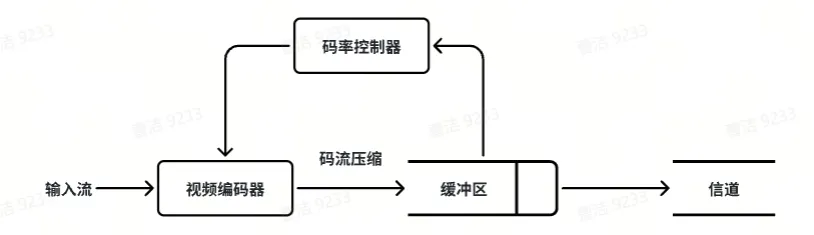

码率控制器负责收集码率、延时和缓冲区状态信息并调节编码参数，使得性能指标维持在给定水平上。缓冲区起平滑码率波动的作用。在编码端，数据输入缓冲区的码率是变化的，而输出码率则取决于码率控制的模式。

帧层码率控制根据网络带宽、缓存占用量、缓存大小及剩余比特来分配每一帧的目标比特；基本单元层码率控制目标比特由该帧的剩余目标比特平均得到。

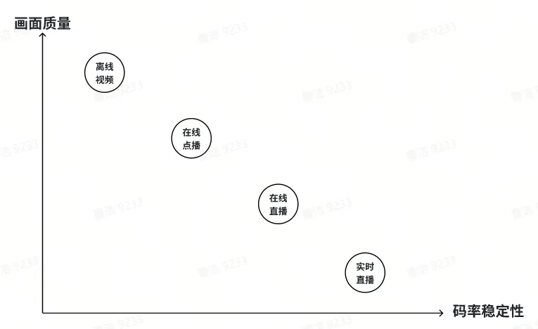

常见的码率控制算法包括固定码率（Constant Bit Rate）、可变码率（Variable Bit Rate）、平均码率（Average Bit Rate）等。

不同类型的视频资源对于画面质量和码率稳定性的权重不同。

**离线视频**，往往不需要稳定的码率，而对画面质量有较高要求，通常采用可变码率。画面纹理比较复杂或运动剧烈的场景，码率给高一些，以保证画面质量；而画面简单的场景，码率就给低一些，节省硬盘空间。

**在线视频**则对码率稳定性有较高要求，对画面质量要求相对低一些，通常采用恒定码率。由于用户带宽有限，客户端缓存的数据量也有限，一些瞬时码率过高的片段可能会引起卡顿。CDN 是按流量计费的，视频网站如果使用可变码率编码视频会使带宽成本变得不可控。

**带宽预测**是实现码率自适应的基础，原理是根据网络实时状况或客户端延时自动调整流媒体码率。带宽预测通过控制音视频发送的数据量，避免在网络带宽不足时发送超出网络带宽的数据，导致长延时和高丢包等问题。包括基于延时的带宽预测算法、基于丢包的带宽预测算法以及最大带宽探测算法等。而码率自适应包括两种主流算法：基于速率的码率自适应算法 Rate-based ABR Algorithms：衡量网络连接速度、根据速度改变视频加载质量；基于缓冲的码率自适应算法 Buffer-based ABR Algorithms：提前加载视频未播放的部分。

#### Jitter Buffer

>   * Jitter Buffer
>
>   * WebRTC-QOS之JitterBuffer详解

Jitter Buffer 是一个共享数据区域，又称为抖动缓冲区，主要作用是处理数据包丢失、乱序、延迟到达等情况，进而平滑地向解码模块输出数据包/帧，抵抗各种弱网情况对播放造成的影响，降低卡顿并提高用户的观看体验（花屏、卡顿等）。

网络抖动是指网络传输数据时，在数据包到达接收方之前，网络传输所引起的延迟波动或数据包丢失现象，产生原因包括：

  1. 传输路径，上一时刻的路由发生故障，数据包路径变更导致端到端的传输时长发生改变；
  2. 网络拥塞，分组交换网络中传送分组的数目太多时，由于存储转发节点的资源有限而造成网络传输性能下降的情况，常伴随数据丢失、时延增加、吞吐量下降，严重时甚至会导致“拥塞崩溃”。
  3. 拥塞控制，慢启动、拥塞避免、快重传、快恢复等手段带来的额外抖动。

JitterBuffer 本质上是用时间换稳定性，以增大端到端的延迟为代价来换取视频通话的流畅性。主要工作流程包括**接收数据包**、**排序数据包**、**缓冲数据包**，WebRTC上述过程称为组帧处理逻辑，分为包的排序（PacketBuffer）、帧的排序（RtpFrameReferenceFinder）以及 GOP的排序（FrameBuffer）。当网络抖动时，增加 Buffer 的容量，多缓存一些数据作为缓冲池；当网络稳定时，减小 Buffer 的容量，降低资源传输端到端的延迟。

#### 可伸缩编码

> H.264可伸缩编码 SVC

可伸缩视频编码（Scalable Video Coding，SVC）对视频信号编码分层，当带宽不足时只对基本层的码流进行传输和解码，但这时解码的视频质量不高。当带宽充足时，传输和解码增强层的码流来提高视频的解码质量。

所谓分层就是在时间、空间、质量（信噪比）上进行划分，输出多层码流（包括基本层和增强层）。

时间可伸缩性是指将视频流分解成表示不同帧率的信息；空间可伸缩性是指将视频流分解成表示不同分辨率的信息；质量可伸缩性是指将像素值分解成不同级别。根据可伸缩编码的压缩编码架构的不同，可以分为基于 DCT 变换的视频编码和基于小波变换的可伸缩视频编码。

基本层的数据可以使解码器完全正常的解码出基本视频内容，但是基本层的数据获得的视频图像帧率较低，分辨率较低，或者质量较低。在信道受限或信道环境复杂时，可以保证解码端能够接收到可以观看的流畅视频图像。当信道环境良好或信道资源丰富时，可以传递增强层数据，以提高帧率，或分辨率，或视频质量。而增强层是可以多层编码的，这就意味着，在视频码流总码率的范围内，接收到的码率越大，视频质量越好。

## 行业标准

视频流从加载到准备播放是需要经过**解协议**、**解封装**、**解编码**等这样的过程，协议指的就是**流媒体协议**；封装是的是**媒体封装格式**；编码又分为**视频编码**和**音频编码**。

### 编码协议

>   * 网页音频编码指南
>
>   * 网页视频编码指南
>
>   * 国内外视频编解码标准体系
>
>   * 音视频基础-视频编码

常见的 mp4、flv、mov、avi 等称为**封装** **协议**，而 H264、H265、VP8、VP9 等则被称为**编码协议**。封装格式内部包含视频轨（视频编码文件）、音频轨（音频编码文件）、字幕轨以及视频宽高等编解码信息。

不同组织主导制定的视频编码协议，常见的包括 3 大类：

  * **ISO-MPEG / ITU-T 系列**，由国际标准组织机构（ISO）下属的运动图象专家组（MPEG）和国际电传视讯联盟远程通信标准化组织（ITU-T）开发的系列编码标准。
  * **AOM 系列**，前身是由 Google 内部使用的 VPx 系列的编码标准。后续 Microsoft、Netflix 等多家科技巨头加入组建成立开放媒体联盟（Alliance for Open Media，AOM）。
  * **AVS** **系列**，数字音视频编解码技术标准（Audio Video coding Standard）是国内具备自主知识产权的信源编码标准体系。

#### ISO-MPEG / ITU-T 系列

> Publicly Available Standards

MPEG 是运动图像专家组制定的一种运动图像压缩算法国际标准，采用有损压缩方法减少运动图像中的冗余信息，即根据大部分相邻画面的相似性特点，把后续图像和前面图像共有的冗余部分去除，从而达到压缩的目的。为了达到更好的压缩率，MPEG 引入了除 I帧、P帧之外的第三种帧—— B帧。

**MPEG-1**，颁布于 1993 年，针对 1.5Mbps 以下数据传输率的数字存储媒体运动图像及其伴音编码而设计的国际标准。为 CD 光盘介质定制的视频和音频压缩格式，是 VCD 的制作格式。使用 MPEG-1 压缩算法，可以把一部 120 分钟长的电影压缩到 1.2GB 左右大小。最为知名的是音频第三代压缩协议，被称为 MPEG-1 Layer 3，简称 MP3。

**MPEG-2**，颁布于 1995 年，设计目标是高级工业标准的图像质量以及更高的传输率。这种格式主要应用在DVD/SVCD 的制作格式，同时在一些 HDTV（高清晰电视广播）和一些高要求视频编辑、处理上面也有广泛应用。使用 MPEG-2 压缩算法，可以把一部 120分钟长的电影压缩到 4~8GB 的大小。

**MPEG-4**，颁布于 1999 年，是为了播放流式媒体的高质量视频而专门设计的，它可利用很窄的带度，通过帧重建技术压缩和传输数据，以求使用最少的数据获得最佳的图像质量。这种文件格式包含以前 MPEG 压缩标准所不具备的比特率的可伸缩性、动画精灵、交互性、版权保护等功能。MPEG-4 由一系列子标准组成，著名的 MP4 是该标准的第十四卷（ISO/IEC 14496-14）。

ITU-T 在 1990 年最先研究出 H.261，这是第一个实用化国际标准，后来在 1995 年和 1996 年先后发布H.262、H.263，指导后来的H视频编解码器，这是ITU-T的H26x系列。

MPEG 和 ITU-T 两个组织在 2000 年组成联合视频工作组 JVT，在原 H.264 的基础上共同研发，颁布更为成熟的 H.264/AVC 协议。ITU-T 更愿意称之为 H.264，而 MPEG 组织则称之为 MPEG-AVC。H.264/AVC 的压缩方法大致包括：**分组**，把几帧图像分为一组（GOP），防止运动变化；**定义帧**，每组内各帧图像定义为三种类型，即 I帧、B帧 和 P帧；**预测帧**，以 I帧做为基础帧，预测 P帧，再由 I帧和 P帧预测 B帧；**数据传输**，最后将 I帧数据与预测的差值信息进行传输。

<table><thead><tr style="border-width: 1px 0px 0px;border-right-style: initial;border-bottom-style: initial;border-left-style: initial;border-right-color: initial;border-bottom-color: initial;border-left-color: initial;border-top-style: solid;border-top-color: rgb(204, 204, 204);background-color: white;"><th style="border-top-width: 1px;border-color: rgb(204, 204, 204);text-align: left;background-color: rgb(240, 240, 240);"><strong>Resolution</strong></th><th style="border-top-width: 1px;border-color: rgb(204, 204, 204);text-align: left;background-color: rgb(240, 240, 240);"><strong>H.264/</strong> <strong>AVC</strong></th><th style="border-top-width: 1px;border-color: rgb(204, 204, 204);text-align: left;background-color: rgb(240, 240, 240);"><strong>H.265</strong> <strong>/HEVC</strong></th></tr></thead><tbody style="border-width: 0px;border-style: initial;border-color: initial;"><tr style="border-width: 1px 0px 0px;border-right-style: initial;border-bottom-style: initial;border-left-style: initial;border-right-color: initial;border-bottom-color: initial;border-left-color: initial;border-top-style: solid;border-top-color: rgb(204, 204, 204);background-color: white;"><td style="border-color: rgb(204, 204, 204);">480P</td><td style="border-color: rgb(204, 204, 204);">1.5 mbps</td><td style="border-color: rgb(204, 204, 204);">0.75 mbps</td></tr><tr style="border-width: 1px 0px 0px;border-right-style: initial;border-bottom-style: initial;border-left-style: initial;border-right-color: initial;border-bottom-color: initial;border-left-color: initial;border-top-style: solid;border-top-color: rgb(204, 204, 204);background-color: rgb(248, 248, 248);"><td style="border-color: rgb(204, 204, 204);">720P</td><td style="border-color: rgb(204, 204, 204);">3 mbps</td><td style="border-color: rgb(204, 204, 204);">1.5 mbps</td></tr><tr style="border-width: 1px 0px 0px;border-right-style: initial;border-bottom-style: initial;border-left-style: initial;border-right-color: initial;border-bottom-color: initial;border-left-color: initial;border-top-style: solid;border-top-color: rgb(204, 204, 204);background-color: white;"><td style="border-color: rgb(204, 204, 204);">1080P</td><td style="border-color: rgb(204, 204, 204);">6 mbps</td><td style="border-color: rgb(204, 204, 204);">3 mbps</td></tr><tr style="border-width: 1px 0px 0px;border-right-style: initial;border-bottom-style: initial;border-left-style: initial;border-right-color: initial;border-bottom-color: initial;border-left-color: initial;border-top-style: solid;border-top-color: rgb(204, 204, 204);background-color: rgb(248, 248, 248);"><td style="border-color: rgb(204, 204, 204);">4K</td><td style="border-color: rgb(204, 204, 204);">32 mbps</td><td style="border-color: rgb(204, 204, 204);">15 mbps</td></tr></tbody></table>

2013 年 H.265/HEVC 被批准为国际标准，与 H.264/AVC 相比，它采用分层四叉树的优化宏块分割算法。前者是16×16固定像素的宏块，后者是 4×4 到 64×64 动态像素的宏块。因此能更好的支持包括 8K UHD（7680 × 4320）的高分辨率资源的存储与传输。

2018 年 MPEG 和 VCEG 成立的联合视频探索小组（JVET）开始将 H.266/VVC 标准化。新标准要求在相同的体验质量的前提下，同H.265/HEVC 相比，压缩率优化 30% 到 50%，并支持无损压缩；最大宏块从 64х64 增加到 128х128，支持 4K 到 16K分辨率以及 VR 360°；支持具有 4:4:4、4:2:2 和 4:2:0 量化的 YCbCr 色彩空间；每个组件颜色深度为 8 位到 16位；BT.2100 和 16+ 步高动态范围 (HDR)；辅助通道，如深度通道、阿尔法通道等；从 0 到 120 Hz 的可变帧率；具有时间（帧速率变化）和空间（分辨率变化）可伸缩性的可伸缩编码；SNR、立体/多视图编码、全景格式和静止图像编码。

#### AOM 系列

>   * Get Started with AV1, AVIF & IAMF
>
>   * 主流显卡VP9、AV1硬件解码支持列表

由于 H.26X 相关标准都是收费的，崇尚开源的 Google 联合 Amazon、Cisco、Intel、Microsoft、Mozilla 以及 Netflix 等互联网巨头成立开放媒体联盟（Alliance for Open Media），旨在通过制定全新、开放、免版权费的视频编码标准和视频格式。

VP8 是一个开放的图像压缩格式，最早由 On2 Technologiesis 开发，后被 Google 收购并发布 VP8 编码的实做库：libvpx，早期以 BSD 授权条款的方式发布，随后也附加专利使用权，但最终还是被确认为开放源代码授权。VP9 则是 Google提供的开源免费视频编码格式，对标 H.265/HEVC，除 IE9 以下版本的浏览器外，现代浏览器都支持 VP9 视频编码。

AV1 是由 AOM（Alliance for Open Media，开放媒体联盟）于 2018 年制定的一个开源、免版权费的视频编码格式，是 Google VP10、Mozilla Daala 以及 Cisco Thor 三款开源编码项目共同研发的成果，目标是解决 H.265 昂贵的专利费用和复杂的专利授权问题并成为新一代领先的免版权费的编码标准（保持实际解码复杂性和硬件可行性的同时，在最先进的编解码器上实现显著的压缩增益）。此外，AV1 是 VP9 标准的继任者，也是 H.265 强有力的竞争者。AV1 第一次引入仿射变换运动模型，打破传统的二维运动矢量模型的限制，不仅可以描述平移运动，同时能够表述如旋转、缩放等更加复杂的运动，有效的提升视频编码效率。AV1 比 H265/HEVC 压缩率提升约 27%。目前，硬件设备的兼容性问题是阻碍其大范围推广的主要因素之一。

#### AVS 系列

>   * 数字音视频编解码技术标准工作组
>
>   * [一文读懂AVS的发展历程、关键技术及应用展望](https://mp.weixin.qq.com/s?__biz=MzUyMzY3NDA5Nw==&mid=2247490857&idx=1&sn=cd1ca23eb6731a371a2ae92705a46104&chksm=fa3855b7cd4fdca13953b7bb8741937040a7b6ad58850477496dcec4a432112a2835c2b89e84&scene=21#wechat_redirect)

AVS 是基于我国创新技术和部分公开技术的自主标准，主要应用于超高清电视节目的传输。AVS1 编码（2006年）效率比原视频编码国家标准（等同于MPEG-2）高 2-3 倍，与 H.264/AVC 相当，达到第二代信源标准的最高水平；AVS1 通过简洁的一站式许可政策，解决 H.264/AVC 专利许可问题死结，是开放式制订的国家、国际标准，易于推广；AVS2 编码（2016年）效率比第一代标准提高一倍以上，压缩效率超越国际标准H.265/HEVC。AVS3 编码（2021年）采用更具复杂视频内容适应性的扩展四叉树划分，主要面向 8K 超高清，2022 年 1 月 1 日北京电视台冬奥纪实频道就是采用 AVS3 视频标准播出的。

AVS 是一套包含系统、视频、音频、数字版权管理在内的完整标准体系。我国牵头制定的、技术先进的第二代信源编码标准；领导国际潮流的专利池管理方案，完备的标准工作组法律文件；制定过程开放、国际化。

AVS 产品形态包括：1）芯片：高清晰度/标准清晰度 AVS 解码芯片和编码芯片，国内需求量在未来十多年的时间内年均将达到 4000 多万片；2）软件：AVS 节目制作与管理系统，Linux 和 Window 平台上基于 AVS 标准的流媒体播出、点播、回放软件；3）整机：AVS机顶盒、AVS 硬盘播出服务器、AVS 编码器、AVS 高清晰度激光视盘机、AVS 高清晰度数字电视机顶盒和接收机、AVS 手机、AVS 便携式数码产品等。

  * **MPEG** - Moving Picture Expert Group，隶属于国际标准化组织 ISO/IEC，是专门负责视频编解码标准化方面的工作组。
  * **ITU-T** - ITU Telecommunication Standardization Sector，隶属于国际电信联盟 ITU，是专门制定电信标准的分支机构。
  * **JVT** - Joint Video Team，成员主要来自 ISO/IEC 的 MPEG 专家组以及来自 ITU-T 的 VCEG 专家组。
  * **VCD** - Video Compact Disc，分辨率约 352 × 240，并使用固定的比特率（1.15Mbps），因此在播放快速动作的视频时，由于数据量不足，令压缩时宏区块无法全面调整，使视频画面出现模糊的方块。
  * **DVD** - Digital Versatile Disc，分辨率约 720 × 480，比特率达到 1~10Mbps，音效质量达到了24bit/96kHz的标准，并支持外挂的字幕和声道，以及多角度欣赏等数码控制功能。
  * **AVC** - Advanced Video Coding，高级视频编码，亦称为 H.264。
  * **AAC** - Advanced Audio Coding，高级音频编码，是比 MP3 更先进的音频压缩技术。
  * **HEVC** - High Efficiency Video Coding，高效率视频编码，亦称为 H.265。
  * **AV1** - Alliance for Open Media Video 1，AOMedia 推出的编解码格式，目标是取缔前代 VP9。

### 点播协议

> MP4 格式详解

MP4 是最常见的数字多媒体容器格式，几乎可以用来描述所有的媒体结构，常用到 H.264/H.265 视频编解码器和 AAC 音频编解码器。MP4 文件是由一个个 Box 组成的，可以将其理解为一个数据块，由 Header+Data 组成，Data 存储媒体元数据和实际的音视频码流数据。Box 可以直接存储数据块，也可包含其它 Box，把包含其它 Box 的Box 称为 Container Box。每个 MP4 文件有多个 Track，每个 Track 由多个 Chunk 组成，每个 Chunk 包含一组连续的 Sample。Track 对于媒体数据而言就是一个视频序列或者音频序列，除 Video Track 和 Audio Track 外，还有非媒体数据，比如 Hint Track，这种类型的 Track 包含媒体数据的指示信息或者字幕信息。Sample 即采样，对应视频的一帧数据，音频的一段固定时长数据。Sample 是媒体流的基本单元，Chunk 是数据存储的基本单位。不管是 Track，还是 Chunk 和 Sample，都是以 Box 的形式存在。

RMVB（RealMedia Variable Bitrate）是一种可变比特率的多媒体数字容器格式，从 RM 格式的扩展版。影片的静止画面和运动画面对压缩采样率的要求是不同的，如果始终保持固定的比特率，会对影片质量造成浪费。在 RMVB格式使用兴盛时期几乎每一位电脑使用者电脑中的视频文件，超过80%都会是RMVB格式。但如今已经逐渐被 MP4 所取代。

MOV 是 Apple 公司的 QuickTime 指定多媒体容器格式，属于流式视频封装格式，能被众多的多媒体编辑及视频处理软件所支持。MOV 格式支持多轨道音频，可以容纳多个音频流，如不同语言的音轨或不同的音频效果；还支持字幕、章节标记、元数据等功能，丰富视频的交互性和信息展示。MOV 能够提供高质量的视频压缩，同时保持较小的文件大小，方便传输和存储，被广泛用于电影、电视剧等影视制作领域。

AVI（Audio Video Interleaved）音频视频交错格式，由 Microsoft 推出的一种多媒体文件格式，是 MOV 格式的竞品。AVI 曾经是一种非常流行的格式，几乎所有的播放器都支持这种格式。但 AVI 缺乏对有损编解码器的原生支持导致不兼容性，微软已经放弃了 AVI 容器，转而使用更新的、功能更丰富的 WMV 容器。WAV 则是 Microsoft 推出的一款标准数字音频文件，优点不失真，缺点体积大。

MKV（Matroska Multimedia Container），是一种能够在单个文件里容纳无限数量的视频、音频、图片或字幕轨道的多媒体封装格式，能容纳多种不同类型编码的视频、音频及字幕流，其开发目的是为了取代 AVI 格式。MKV 支持任何视频编解码器和任何音频编解码器。此外，MKV 是一种开放文件格式，不需要软件或硬件播放器支付许可费用即可支持它。

OGV 文件格式是以 Ogg 容器格式保存的视频文件，它包含可能使用一种或多种不同编解码器的视频流，例如Theora，Dirac 或 Daala。可以使用各种媒体播放器来播放 OGV 文件。OGV 文件通常用于使用HTML5 `<video>`标签播放网页视频内容。但是，即使文件包含视频内容，它们也通常在HTML源代码中使用 ".ogg" 扩展名进行引用。

QLV 是腾讯视频文件格式，需要用腾讯视频打开。LV 是腾讯视频的一种加密缓存文件格式，只有腾讯视频播放器才能播放。要想使用其它播放器来播放 QLV 格式视频，必须先将该视频转换为其它格式。

WebM 是一种开放、免费的多媒体容器格式，用于存储视频、音频和字幕等数据。WebM 格式由 Google 公司开发，使用 VP8 视频编解码器和 Vorbis 音频编解码器，可以在大多数现代网络浏览器上进行播放，旨在为网络上的 HTML5 视频提供一个高效的开放标准。

### 直播协议

>   * WebRTC 入门教程
>
>   * 实时传输 Web 音频与视频

直播大致可以分为**会议直播**和**娱乐直播**两类场景。会议直播是需要实时互动的，主要考虑传输的实时性，一般采用 UDP 作为底层传输协议；娱乐直播则对实时性要求不高，更加关注画面的质量、音视频卡顿等体验问题，一般采用 TCP 作为底层传输协议。

会议直播亦称为**实时互动直播**，以 WebRTC 协议为主；娱乐直播亦称为**传统直播**，以 RTMP 和 HLS 协议为主。


WebSocket 是一种全双工通讯的网络技术，使得浏览器具备实时双向通信的能力，建立在 TCP 长连接基础上，可以复用 HTTP 的握手协议，通过减少每次连接的握手次数和数据包的开销，提高通信的整体效率和性能。因此，WebSocket 协议在即时通信、游戏、在线聊天等场景中得到了广泛应用，它为 Web 应用提供了更加高效、可靠的双向通信方式。

WebRTC 是 RTC 在 Web 的一种实现形式，适用于各种实时通信场景，包括：**点对点通讯**，支持浏览器之间进行音视频通话，例如语音通话、视频通话等；**电话会议**，支持多人音视频会议，例如腾讯会议、钉钉会议等；**屏幕共享**，支持实时共享屏幕；**直播**，用于构建实时直播，用户可以通过浏览器观看直播内容。IM 即时通信，常用于文字聊天、语音消息发送、文件传输等方式通信，考虑的是可靠性（TCP）；而 RTC 实时通信，常用于音视频通话、电话会议，考虑的是低延时（UDP）。

M3U8/TS 是 HLS 协议的封装格式，分别表示播放列表文件和资源分片文件。.m3u8 的索引文件 是一个播放列表文件，且文件编码必须是 UTF-8 格式。TS 流最早应用于数字电视领域，包含十几个配置信息项，TS 流中的视频格式是 MPEG-2 TS。Apple 公司推出的 HLS 协议对 MPEG-2 TS 流做了精减，只保留了两个最基本的配置表 PAT 和 PMT，再加上音视频数据流就形成了现在的 HLS 协议，即由 PAT + PMT + TS 数据流组成。其中，TS 数据中的视频数据采用 H.264/H.265 编码，而音频数据采用 AAC/MP3 编码。

```
#EXTM3U
#EXT-X-VERSION:3             // 版本信息
#EXT-X-TARGETDURATION:11     // 每个分片的最大时长
#EXT-X-MEDIA-SEQUENCE:0      // 分片起始编号，不设置默认为 0
#EXTINF:10.5,                // 第一个分片实际时长
index0.ts                    // 第一个分片文件资源路径
#EXTINF:9.6,                 // 第二个分片实际时长
index1.ts                    // 第二个分片文件资源路径
```

FLV 是 RTMP 的媒体封装协议，由 FLV Header 和 RTMP 数据构成。FLV 文件是一种流式文件格式，意味着任何音视频数据都能随时添加到文件末尾，而不会破坏整体结构。像 MP4、MOV等媒体封装格式都是结构化的，即音频数据和视频数据是单独存放。与其他主流直播协议相比，FLV 均具有不可替代的优势。与 HLS 技术相比，RTMP协议在传输时延上要比 HLS 小得多；相对于 RTP 协议，RTMP 底层是基于 TCP 协议的，所以它不用考虑数据丢包、乱序、网络抖动等问题；与WebRTC 技术相比，对于实时性要求并没有那么高的传统直播来说，RTMP 协议具有更好的音视频服务质量。FLV也因此特别适用于涉及**录制**的相关应用场景。

### 流媒体协议

>   * RTMP Streaming: The Real-Time Messaging Protocol Explained
>
>   * RTSP: The Real-Time Streaming Protocol Explained

HLS（HTTP Live Streaming）是 Apple 公司提出的基于 HTTP 的流媒体网络传输协议，QuickTime X 和 iPhone 软件系统的一部分，由三部分组成：HTTP、M3U8、TS，其中 HTTP 是传输协议，M3U8 是索引文件，TS是音视频的媒体信息。工作原理是把整个流根据索引文件（.m3u8）分成一个个小的基于 HTTP 的切片文件（.ts），每次只下载一些切片。当媒体流正在播放时，客户端可以选择从许多不同的备用源中以不同的速率下载同样的资源，允许流媒体会话适应不同的数据速率。在开始一个流媒体会话时，客户端会下载一个包含元数据的扩展 M3U 播放视频文件列表，用于寻找可用的媒体流 TS 切片。HLS 只请求基本的 HTTP 报文，与实时传输协议 RTP 不同，HLS 可以穿过任何允许 HTTP 数据通过的防火墙或者代理服务器。

RTMP（Real Time Messaging Protocol）是基于 TCP 的流媒体网络传输协议，设计初衷是服务于流媒体服务器和 Adobe Flash Player 之间的音视频数据传输。因为是建立在 TCP 长连接协议的基础上，所以客户端向服务端推流这些操作的延时性很低约 5s。至于 HLS 起播理论上至少需要 1 个 TS 切片，而切片大小通常会在 10s 左右，因此延时也至少在 10s 以上，实际延时会在 20~30s，这是由于 HLS 使用的是 HTTP 短连接，频繁的处理握/挥手造成延迟比较久的现状。但 Apple 公司认为 RTMP 协议在安全方面有重要缺陷，所以 iOS 不支持该协议，在 Apple 公司的不断施压下， Adobe 已经停止对 RTMP 协议的更新。

RTSP（Real Time Streaming Protocol）是基于 RTP 的流媒体网络传输协议，在基于 HTTP 的自适应比特率流媒体协议出现前，同 RTMP 一起主导互联网流媒体领域，是实时监控和事件检测解决方案的最佳选择。现在主要应用于网络摄像机（IP Camera）以及其他依赖视频源的 IoT 设备，常见的是监控和闭路电视。

MPEG-DASH（Dynamic Adaptive Streaming over HTTP）是一种自适应比特率流技术，基于 HTTP 的动态自适应流使高质量流媒体在互联网传输。与 HLS 类似，MPEG-DASH 也将内容分解成一系列小型的基于 HTTP 的文件片段，每个片段包含很短长度的可播放内容，而总长度可能长达数小时。

  * **M3U** - MP3 URL，是一种播放多媒体列表的文件格式，最初是为播放 MP3 等音频文件，但现在越来越多的被用来播放视频文件列表。M3U8 是 Unicode 版本的 M3U，用 UTF-8 编码。
  * **RTP** - Real-time Transport Protocol，实时传输协议通常使用 UDP 传输，部分场景也能使用 TCP。

## 场景应用

### 人审业务

>   * 音量均衡可行性论证
>
>   * Web 端音量均衡实现和应用

上面介绍 RTMP 和 HLS 协议的优劣势。尽管 RTMP 协议已不再更新，但目前没有更好的协议能取代它的价值，因此其仍在业界受到广泛应用，主要用于解决“第一公里”问题。就两者特点而言，应用场景通常做出如下分工：

  * 推流使用 RTMP 协议，延迟低，推流稳定；
  * 流媒体系统内部分发使用 RTMP 协议，网络状况好的情况下 TCP 长链接能更高效的传输；
  * PC 基本都安装有 Flash，因此使用 RTMP 协议，而移动端的网页播放器以及 iOS 设备使用 HLS 协议；
  * 点播场景无延时要求，推荐使用 HLS 协议，直播场景有延时要求，推荐使用 RTMP 协议。

目前字节跳动采用的统一方案是直播回放流（点播）采用 HLS 协议，直播实时流（直播）采用 FLV 协议，而短视频这类非流媒体则采用 MP4 封装协议。

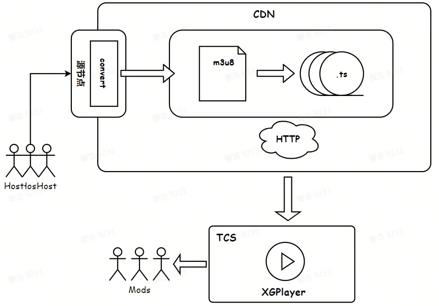

针对人审业务，除了基础的播放能力，为提高审核体验，陆续推出包括不限于以下音视频辅助能力：

  * **发言者标识**，RTC 在推流时会往视频帧内添加 SEI 补充增强信息（位于 NAL 层），能够获取直播连麦的嘉宾位置、麦克风状态、摄像头状态等媒体信息。通过在审核侧还原客户端交互行为，提高处罚准确性以及预防组合违规风险。
  * **主备流切换**，当前容灾技术较为成熟，直播推流普遍也有多个 CDN 厂商。审核侧直播回放流采用 HLS 的方式存储，而不同 CDN 厂商对于 TS 切片大小的规范不完全相同。所以在实现主备流切换的同时，还需要对流切片，以保持主备流内容和时长的一致性。
  * **音量均衡**，审核员需要长时间面对音视频进行审核，在过劳疲惫的状态下，声音的陡变会影响审核员的工作体验和身心健康。通过对单帧音频（Comperssor）或音频响度（Online Norm）进行调整，以期达到音量均衡的效果。考虑到直播回放流无法在进审时拿到原始音频数据，因此只能采取 Comperssor 算法去动态设置`DynamicsCompressorNode`的参数。

### 直播业务

>   * 斗鱼 H5 直播原理解析
>
>   * 深入分析各行业直播方案与原理
>
>   * A simple RTCDataChannel sample

以下技术调研截止至 2024 年 8 月29 日，且仅限于各大平台的网页版。

国内的部分直播平台如斗鱼、虎牙、B 站等，其实时直播技术主要分为 HLS（M3U8/TS）和 RTMP（FLV）两种。斗鱼采用的是在 HTTP-FLV技术基础上的优化方案，在网络请求中能够搜索到`.xs`文件。虎牙的网络请求里仅存在一份 M3U8 文件以及后续的若干 TS 切片，属于较为成熟的 HLS成套解决方案。而 B 站则是多份 M3U8 文件以及后续的若干 M4S 切片，这是经过格式转换的 HLS 技术优化方案。

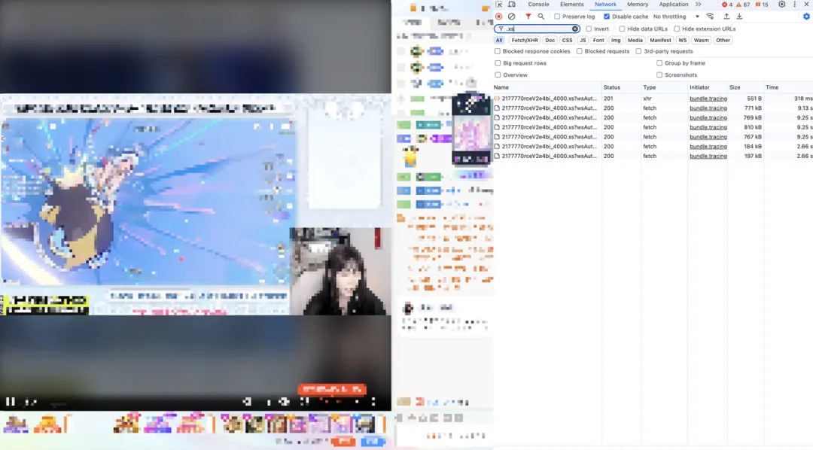

**斗鱼直播**

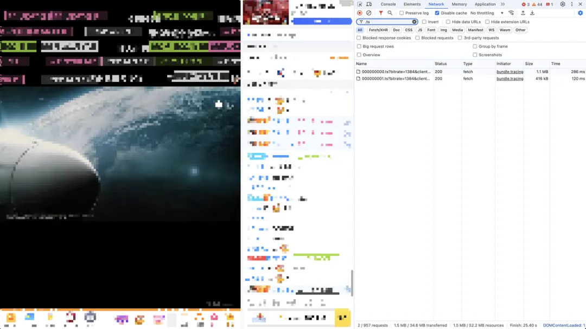

**虎牙直播**

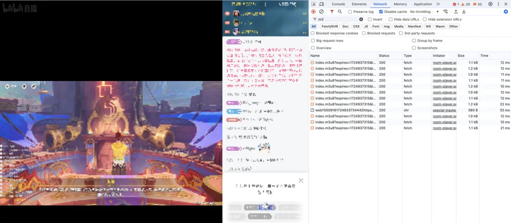

**B 站直播**

斗鱼直播间其实并没有找到`.flv`的网络请求（首页推荐直播流能搜到），而是找到`.xs`的网络请求。这是因为斗鱼默认不完全使用 HTTP 去拉流，而是采用CDN 和 P2P 两种方式同时去拉流，`.xs`并不是一个完整的 FLV 流，而是一个子 FLV 流。

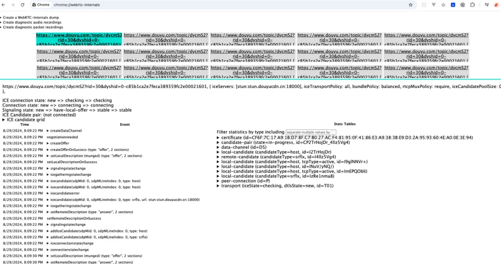

**斗鱼直播间 WebRTC 链接**

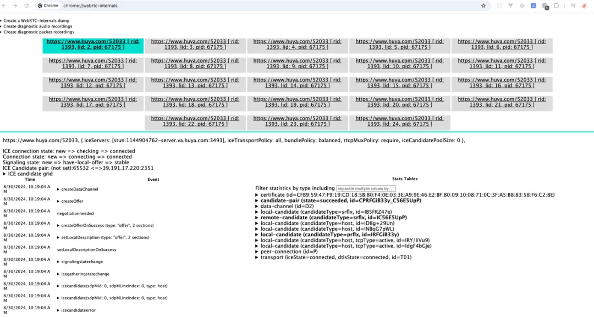

**虎牙直播间 WebRTC 链接**

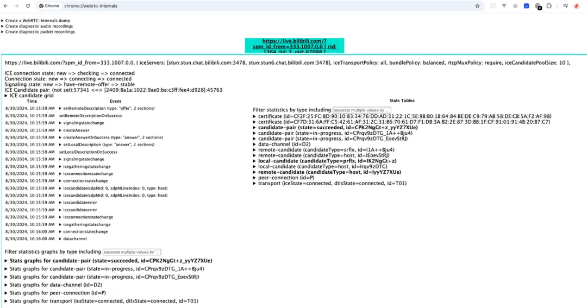

**B 站首页 WebRTC 链接**

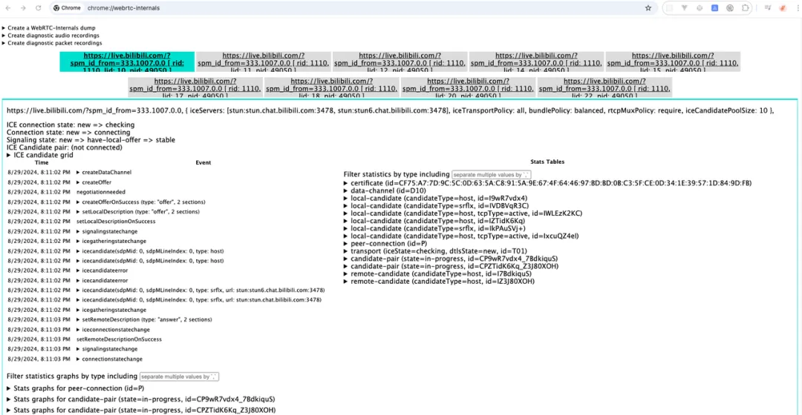

**B 站直播间 WebRTC 链接**

斗鱼的 P2P 是基于 WebRTC 的 DataChannel，在打开首页或直播页面时，能够看到众多的 WebRTC 连接。B站的聊天文字甚至会比直播画面更早出现，并且可以看到触发 createDataChannel的事件，然而首页（仅有直播流，没有弹幕和聊天室）则不存在该事件。虎牙的聊天文字出现有所延迟，建立 WebRTC 链接也存在一定的时延，其首页情况与 B 站大致相同。

综合上述调研结论，能够推断斗鱼直播的 WebRTC 确实运用在拉流；B 站直播和虎牙直播则主要运用在聊天和弹幕。

### 实时会议

>   * 腾讯会议如何构建实时视频传输算法架构
>
>   * TRTC 实践，音视频互动 Demo、即时通信 IM 服务搭建
>
>   * RTC 技术的试金石：火山引擎视频会议场景技术实践

2011 年，Google 先后收购 GIPS 和 On2，组成 GIPS 音视频引擎 + VPx 系列视频编解码器，并将其代码开源，WebRTC 项目应运而生。次年 Google 将 WebRTC 集成到 Chrome 浏览器中，从而为浏览器实现音视频通信提供了可能。

国内主流 toB 办公软件：字节、阿里、腾讯的视频会议都是基于 WebRTC 及其扩展，主要在点对点通信（语音通话、视频通话）、电话会议（飞书会议、钉钉会议、腾讯会议）、屏幕共享（实时共享屏幕）运用到该技术。

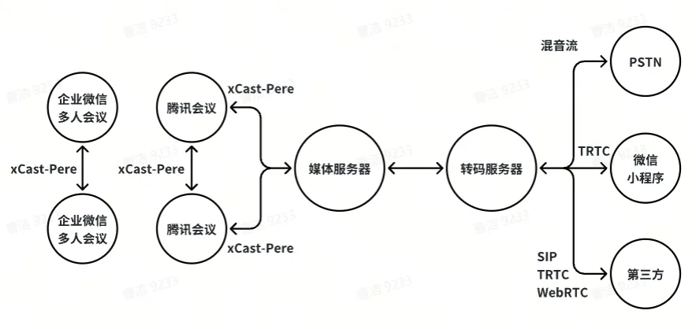

在附文“腾讯会议如何构建实时视频传输算法架构”腾讯强调自 QQ 时代起，在音视频实时传输系统的搭建与优化方面已有多年积累，并重新编写了一个跨平台而且高效的引擎-xCast，引擎之间以 Pere 作为网络层传输协议。结合附文“TRTC 实践，音视频互动 Demo、即时通信 IM 服务搭建”。xCast-Pere的架构目前仅在腾讯会议生态间支持传输与解析，当数据到达媒体服务器后会在转码服务器里转换为 SIP、TencentRTC 或 WebRTC 进行传输。

伴随着疫情居家办公的历史背景推动下，目前主流会议软件的功能都已经非常成熟，诸如自由开麦、自由布局、屏幕共享、Web 入会等交互能力层出不穷，而针对弱网、弱设备、噪声、弱光线等极端环境的解决方案也日益完善。未来，分组会议、3D 空间音效、千方会议、智能会议也会逐渐成为我们的日常。

环境创造需求，需求推动技术。音视频技术已完成筑基，让我们无限期待创造力的诞生！
