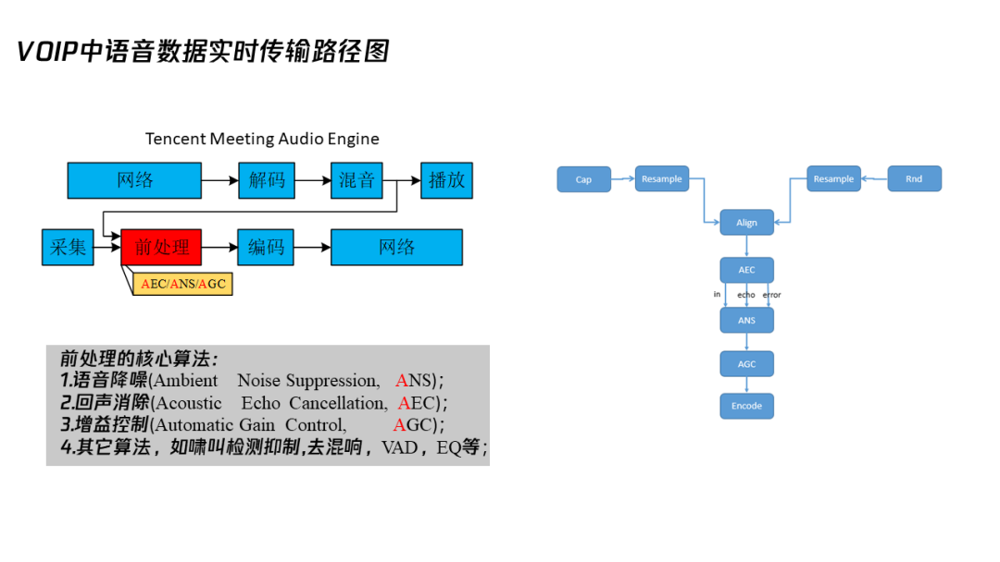
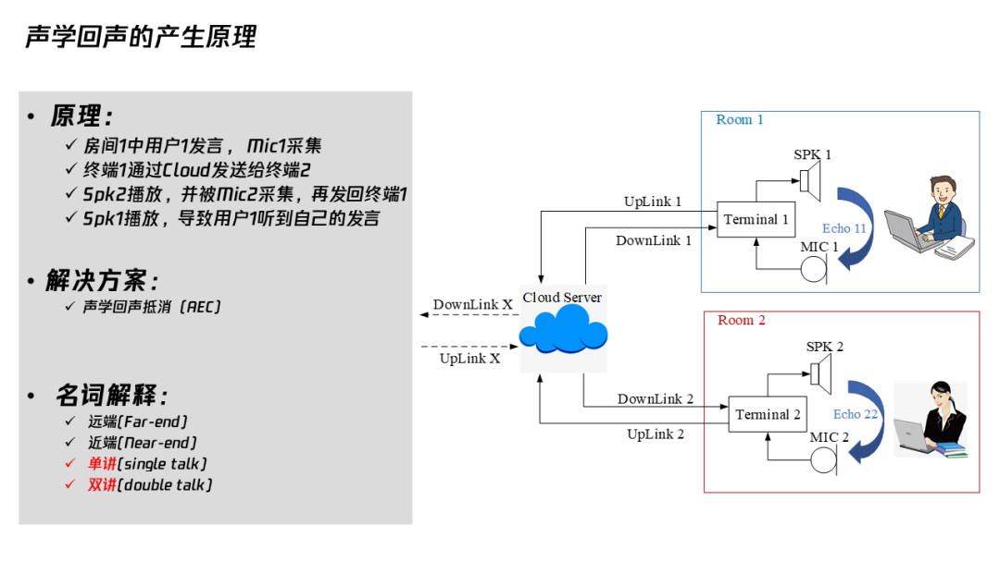
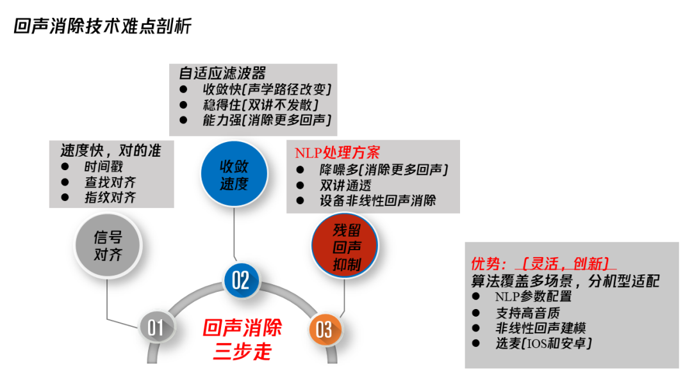
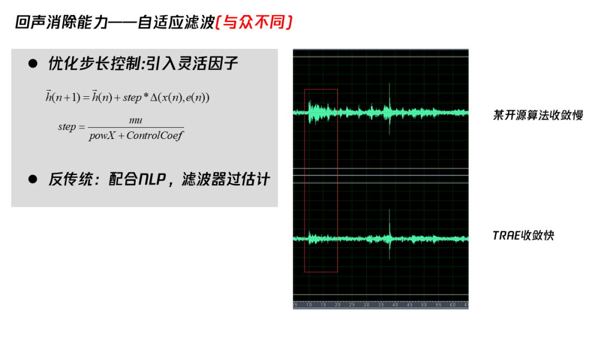
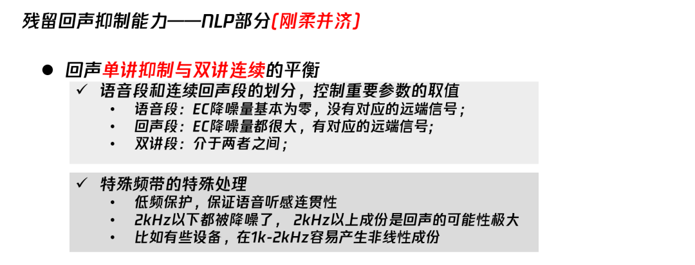
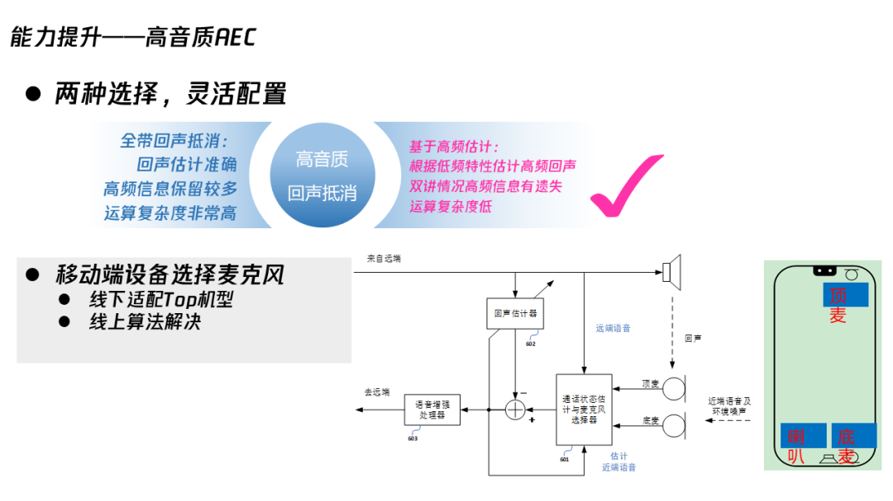
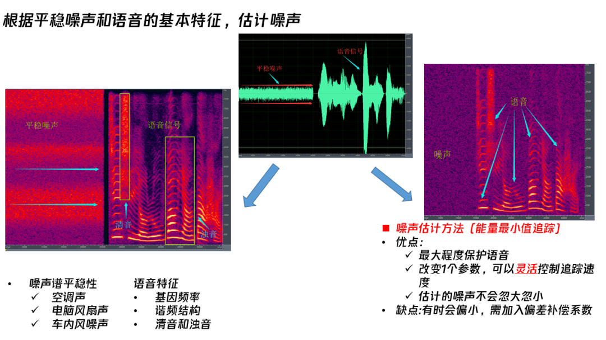
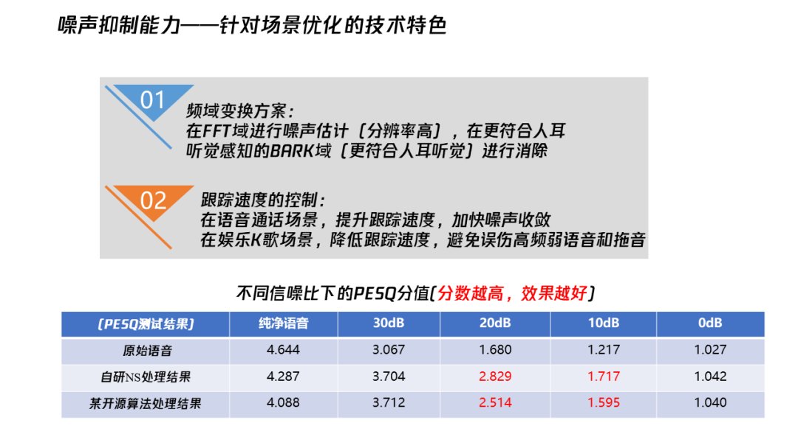
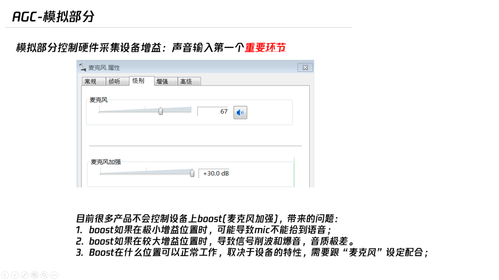
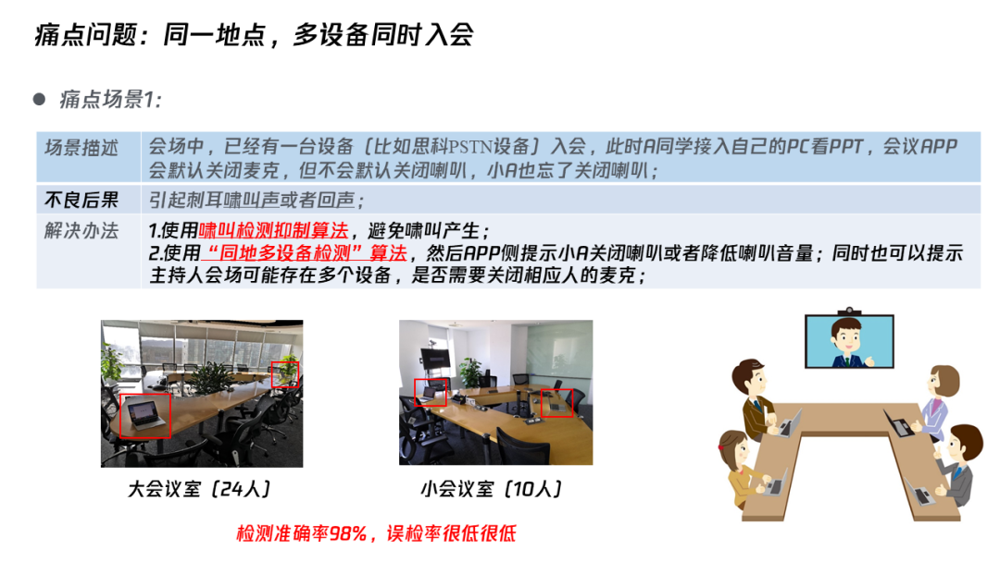

<!--BEGIN_DATA
{
    "create_date": "2020-04-28 10:30", 
    "modify_date": "2020-04-28 10:30", 
    "is_top": "0", 
    "summary": "音频信号处理中有这些秘籍！", 
    "tags": "音视频、C/C++", 
    "file_name": "音频信号处理中有这些秘籍！.md"
}
END_DATA-->

#### 
原文出处：<a href='https://cloud.tencent.com/developer/article/1608002' target='blank'>音频信号处理中有这些秘籍！</a>

**导读** | 腾讯会议在去年年底推出，集结腾讯在AI、云计算、安全等方面的能力，全方位满足不同场景下的会议需求，在短短两个月内就突破千万日活大关。面对多样且复杂的场景，比如开会环境嘈杂、同一地点多设备接入、房间声学参数不理想等，腾讯会议如何通过对音频信号的处理持续保障高品质通话，提升沟通效率？本文是腾讯多媒体实验室音频技术专家李岳鹏在「腾讯技术开放日·云视频会议专场」的分享整理。

**一、TRAE技术降噪增益揭秘**

先简单讲一下VOIP中语音数据实时传输路径图，我们可以看到远端的数据通过网络传过来，我们进行解码、混音、播放给本地听。同时，本地也会讲话，那么我们进行采集，之后做一些常见的前处理，比如语音降噪回声消除，再通过网络传给B端。两端通话就是这样实现的，多端通话其实原理也一样。

**二、前处理的核心算法**

**1. 回声消除（AEC）三步走：信号对齐、自适应滤波器、残留回声控制**

回声是如何发生的？比如说两个人站在两个房间里通话，房间1的人讲话，他的声音被他自己的麦克风采集，通过网络传给了房间2，房间2的人通过扬声器播出来，听到了。但是，房间2 的人也用麦克风，麦克风又采集了播放的房间1声音，又传给房间1的人来听，房间1的人就这样听到了自己的回声。 

消除回声的办法应该很多人都听过，就是传统声学的回声消除。这里涉及到一些名词，远端是指对端的人，近端是指自己这边；单讲指一个人讲话，双讲就是两个人同时在讲话。如果我跟远端的人同时讲话我们都能彼此听到对方，这个叫全双工。如果有的AEC做得不好的话，那可能就双讲变成单工，只有一个人能听到，这端讲话可能对端就听不到。**传统声学的回声消除分三步：**

**（1）信号对齐。**播放信号跟采集信号对齐，因为它们两个可能延时很大，我们都知道滤波器的阶数是有限，所以要先对齐，再滤波。信号对齐的方法一般是先用时间戳做一个粗对齐，然后再根据能量谱查找对齐，比如寻找相似性，这个其实像在开源的WebRTC里面也有。

**    但是，WebRTC的查找对齐其实不是特别准，而且有时候会有波动。我们在TRAE中又做了一些更深入的研究，会用更精细的谱去做一些类似于指纹的对齐，这种方式更稳定**。

**（2）自适应滤波器。**信号对齐之后再滤波，**我们使用自适应滤波器来达到更好的效果，它的优点是收敛快、稳得住、能力强。**收敛快是说，声学路径改变了之后，是花500毫秒还是1秒甚至3秒去收敛。

稳得住，是说以前大家根据课本来讲收敛发散，会说自适应滤波器要去做一个双讲判断，否则更新滤波器时就会分散，但是现在已经不会这样了，因为现在很多都是通过改变波长来控制自适应滤波器的更新因子，并不存在双讲会导致发散的问题。

能力强，字面意义上就是能消除更多的回声，但是实际用的时候，其实它是跟硬件的线性程度相关的，播放采集的线性程度。有的同学可能做完了算法之后，会困惑原来能消超过20 dB甚至30 dB的回声，为什么换一个场景我只能消10 dB了。发生这种情况，其实不是因为算法的问题，而是因为整个声学系统的非线性程度加强了，导致信号相关性减弱了，所以你的自适应滤波器获得的收益就减少了。

**    除了通过输出的能量、控制进行改善，我们还有一个反传统的办法。**一般来讲，自适应滤波器是要把信号减弱，不应该把信号变强，但是**实际上我们在应用过程中发现，有的设备非线性非常强，传统办法得到的效果很弱，会影响到后端的NLP处理。所以我们的方法是，做一些滤波器的过估计**，回声能量反而变强，之后再配合NLP，把非线性的一些回声去掉。

**（3）残留回声抑制。**对于[语音识别](https://cloud.tencent.com/product/asr?from=10680)前端，常见的都是需要做一些降噪能力稍微弱的非线性处理，不需要把回声处理的很干净。**但是对于我们VOIP通话来讲要求就高很多，因为我们并不希望听到对端的回声。所以，我们会尽力把回声抑制得更多，在自适应滤波器后面要有一个给力的NLP处理方案。**其实**我们在做的，就是尽量保证把回声消的更加的彻底，同时要保证双讲的时候能听到对端的声音，就是所谓的双讲通透性。**

另外一个刚才也讲到了其实回声跟设备相关，有的设备非线性程度很差，原来播放信号里面没有的成分，可能经过喇叭播放之后采集就出现了一些莫名其妙、无中生有的成分。在一些特殊情况下我们就需要把这些非线性声音消除掉，要不然也会听到回声。

其实我们会议可能要覆盖很多场景，比如各种各样的终端、PC、麦克风包括苹果、安卓，尤其安卓手机真的非常多，有的很差、有的很好，**所以我们需要有一些NLP参数去做一些配置**。**当然我们尽量不做大量的机型的去适配，我们希望有一个比较统一的方案去解决。**另外我们可能会在一些场景下支持高音质，包括手机上会选用一些有用的麦克风。

**2. 语音降噪（ANS）- 能量最小值跟踪法**

噪声跟语音信号不同，降噪过程中其实是通过在频域做一些处理。对于一些平稳的噪声，比如常见的空调声、电脑风扇声、车内的一些风噪声，它的时间变化比较慢，但是语音是一个多变的信号，正是通过它们两个的不同，我们来判断哪些信号是语音，哪些是降噪，然后把它给去掉。

**   在所有常见的噪声估计方法中，我倾向使用现在最简单的一种，能量最小值跟踪。**它其实就相当于追踪一个本底，我们能大概知道噪声是什么量级，然后把它从语音信号中减掉就可以了。**这个方法的优点是能最大程度保护语音，改变一个参数就能灵活控制追踪速度，而且估计的噪音不会忽大忽小。**但是，这样有时候会偏小，需要加入偏差补偿系数。

在通常处理过程中，我们都是把信号变化到FFT域，之后直接处理。我们也尝试把它变化到其他的域来处理，比如变化到BARK域，发现这样更符合人耳听觉来进行消除。变化BARK域的一种好处就是听到最后音乐的噪声残留会比较小。FFT域做，如果控制得不好，平稳降噪之后会出现很多的music noise，就是唧唧喳喳这种声音。 

**3. 控制硬件采集设备，实现自动增益控制（AGC）**

自动增益控制，其实就是把处理完的信号放大。**常见的AGC是模拟的，大家都知道电脑里面可以调节，目前很多产品不会控制设备上boost(麦克风加强)**。 

**我们做了调节控制这方面的工作，以保证最终这两个合在一起工作的，采集信号在合理的范围内而且不会爆音。**

另外，AGC还包括数字增益部分，前面的回声消除这些的控制处理完了之后，就变成数字信号去把它放大。常见的注意事项大家都知道，比如小声音不能放大，大声音不能放爆音，底噪不能被放大过多。其实可能里面还牵扯到一些具体的技术，比如说噪声估计到底有多少，加入一些语音检测，另外还排除一些回声的影响，把这个信号从左边这么小的放大成这么大，左边这个很大，然后再进一步放大，不会产生更多的爆音。

**三、真实场景中的痛点和难点**

下面跟大家分享我们开发腾讯会议过程中遇到的一些特殊的场景。

* **同一地点多个设备同时入会**

常见的比如说**在一个房间内用一个电脑、一个手机同时入会，就会产生一种啸叫，产生回环，我们可以做啸叫抑制算法，尽量让它不再产生啸叫。**也有可能没有满足啸叫的条件，不会产生啸叫，但是会产生回声，对端传过来的声音，A播放，B采集了，同时B播放，A也采集了一遍，同时又把它发给对端，对端好像听到两个声音，**这时我们就会做一些比如“同地多设备检测”，去提醒用户有多个设备检测，是不是应该关麦**，这就是一些产品的策略，但是算法主要是同地设备检测的算法。

** 同地检测设备其实我们在一些大中小的会议室内都做了一些实验，检测率还是很准的，误检率比较低。**

* **开会比较嘈杂的情景**

比如大家都在工位上讲话，离得都比较近，周围人讲话的嘈杂声音，其实不需要被采集传输，这样会让对端的人听着很难受，**那么我们就会开发一种强力的Vad，提供一个主讲人模式，过滤周围人的声音**，只保留这个主讲人的声音。

* **第三方会议设备，嵌入的语音处理效果差**

一些会议产品并不支持PSTN入会，而我们的会议产品不光是VOIP，还支持传统的固定电话或者手机电话入会。一些公司的一些会议室里面PSTN固话可能会存在前处理的比如降噪能力有限，会把采集到的噪声传给对端，这时候**我们就可以在服务器的链路上，他声音上行完了之后，我们在服务器上去把这个声音再做一些处理。**

* **房间声学参数不理想**

有的房间声音设计不好，混响很重，传过去的声音就不好听，一开始听还好，时间长了之后就会容易产生一种疲劳，**我们现在比如用传统的方法，还有机器学习的方法做一些融合，去实现比较好的效果。**

**四、Q&A**

**    Q：为什么在智能音箱上不需要再做一些信号对齐？**

**    A：**智能音箱，还有一些手机上，他们其实播放和采集都是从最底层，最接近硬件的地方拿取信号，这样两路信号本身就对得很齐，但是对于VOIP来讲，我们要从上层去拿信号，所以就会存在信号对齐的过程。

**    Q：能否深入介绍指纹对齐机制？**

**    A：**其实指纹机制借鉴了音乐检索里面计算一些谱的方式，可以简单理解为它是把谱计算得更细。另外，它选取更长的时间段，比如相比之前查找对齐，它可以做到一个更清晰的对齐。当然，在应用的时候有人可能会觉得，这样用的信号时间太长了，对齐时间会变慢，其实我们在策略上可以做一些改进，比如你可以先用指纹对齐，或者你可以先来一个简单的快速对齐，最后再来一个长的稳定对齐，这些策略都是可以调整的。

**    Q：能否深入介绍一下风噪以及语音虽然存在差异，但是如何能准确估计出噪声？**

**    A：**其实有的噪声的确是跟轻音很像，这种情况下会把轻音误消。那么我们可以在检测到一些风噪或者键盘噪声很多的时候，就做一个比较强的抑制，我个人觉得在这种情况下，把噪声抑制得干净一些，相比来损失点轻音更容易接受。如果在噪声比较少的时候，可能我的策略会稍微保守一点，尽量保留让这个音质非常好，使它有一个平衡的切换。对于传统的降噪来讲，因为一定会存在一些噪声的误判，可能会造成声音的丢失，这个是很难避免的。

**    Q：当APP接入自带算法的第三方终端的时候，腾讯会议的音频是否能检测到这种情况，是一如既往的进行处理，还是如何避免过多的处理导致语音的失真？**

**    A：**这个问题很好。的确一些硬件设备它是自带3A的，我们通常称之为硬件3A，它自己有一些处理。我们实际使用的时候一般会先看，看一些常见的设备到底怎么样，比如说在MAC上，硬件3A处理一些情况下处理的不够好，这时我们就关闭硬件3A，只用自己的自研软件3A。

在手机端因为还牵扯到一些应用的场景，我们不可能把硬件3A直接关掉，此时可以开或者不开EC，但大概率会去开机器学习降噪，去帮助降低更多的环境噪声，这些都是可能的。
