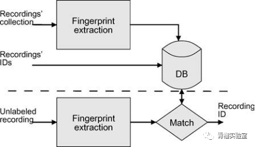
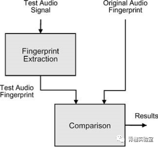
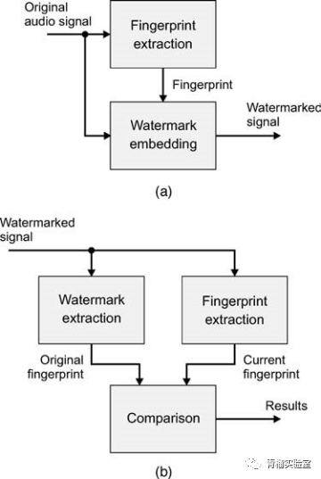

<!--BEGIN_DATA
{
    "create_date": "2021-02-01 15:20", 
    "modify_date": "2021-02-01 15:20", 
    "is_top": "0", 
    "summary": "音频指纹技术概述", 
    "tags": "音视频", 
    "file_name": "音频指纹技术概述.md"
}
END_DATA-->

#### 
原文出处：<a href='https://mp.weixin.qq.com/s/Q7xQoM1H5FZpQ6YpOTgiYQ' target='blank'>音频指纹技术概述</a>

## 摘要

音频指纹是基于内容的压缩签名，它总结了音频记录。它们允许独立于音频的格式而识别音频，而不需要元数据或水印嵌入。指纹识别的其他用途包括：完整性验证、水印支持和基于内容的音频检索。使用不同的原理和术语描述了不同的指纹识别方法：模式匹配、多媒体（音乐）信息检索或加密。在本文中，我们回顾了将其功能块描述为通用统一框架的不同技术。

## 1.音频指纹的定义

音频指纹是基于内容的压缩签名，它总结了音频记录。音频指纹识别由于其音频识别能力而引起了广泛的关注。音频指纹或基于内容的识别（CBID）技术提取音频内容的声学相关特性并将其存储在数据库中。当出现未识别的音频内容时，计算该内容的特性并与存储在数据库中的特性进行匹配。使用指纹和匹配算法，可以将单个录音的失真版本识别为相同的音乐标题。该方法不同于现有的另一种识别音频内容的解决方案：音频水印。在音频水印中，对心理声学进行了研究，以便在不改变声音感知的情况下将任意消息（水印）嵌入到录音中。通过提取嵌入在音频中的消息，可以识别歌曲标题。在音频指纹识别中，信息自动从感知上最相关的声音分量中导出。与水印相比，它更容易受到攻击和扭曲，因为它试图修改这个消息，指纹，意味着改变声音的质量。它也适合处理遗留的内容，即在没有水印的情况下释放音频材料。此外，它不需要修改音频内容。缺点是，指纹识别的计算复杂性通常高于水印，并且需要连接到指纹存储库。此外，与水印相反，消息不独立于内容。因此，例如，不可能区分记录的感知上相同的副本。就像水印技术一样，指纹识别有更多的用途。具体来说，它还可以用于验证内容完整性；类似于脆弱水印。

在这一点上，我们应该澄清，“指纹识别”一词已被设计用于跟踪音频剪辑使用历史的水印的特殊案例多年。水印指纹包括对记录的每个合法副本进行唯一的水印。这允许追溯到获得它的个人。然而，同样的术语被用于命名将音频信号与更短的数字序列（“指纹”）相关联的技术，并使用该序列，例如识别音频信号。后者是本文中“指纹识别”一词的含义。音频指纹识别的其他术语包括稳健匹配、稳健或感知哈希、被动水印、自动音乐识别、基于内容的数字签名和基于内容的音频识别。与音频指纹相关的领域包括信息检索、模式匹配、信号处理、数据库、密码学和音乐认知等。

## 2.音频指纹特性

这些需求在很大程度上取决于应用程序，但对于评估和比较不同的音频指纹技术是有用的。IFPI（国际唱片业联合会）和RIAA（美国唱片业协会）在其《音频指纹技术信息请求》中试图评估若干识别系统。这些系统必须具有计算效率和鲁棒性。更详细的要求列举有助于区分不同的方法：

  * 准确性：正确标识、遗漏标识、错误标识（误报）的数量。
  * 可靠性：评估查询是否存在于要识别的项目存储库中的方法对于版权强制组织的播放列表生成具有重要意义。在这种情况下，如果一首歌未被广播，则不应将其标识为匹配，甚至以丢失实际匹配为代价。在其他应用中，如MP3文件的自动标记（参见第6节），避免误报并不是强制性要求。
  * 稳健性：能够准确识别一个项目，无论压缩和失真水平或干扰在传输信道。其他退化源包括俯仰、均衡、背景噪声、D/A-A/D转换、音频编码器（例如GSM和MP3）等。
  * 粒度：能够从几秒钟的摘录中识别整个标题。它需要处理移位问题，即提取的指纹与存储在数据库中的指纹之间缺乏同步，这增加了搜索的复杂性（它需要在所有可能的对齐方式中比较音频）。
  * 安全性：解决方案易被破解或篡改。针对指纹识别算法的鲁棒性要求，设计了相应的处理方法。
  * 通用性：无论音频格式如何，都能识别音频。能够对不同的应用程序使用相同的数据库。
  * 可扩展性：具有非常大的标题数据库或大量并发标识的性能。这会影响系统的准确性和复杂性。
  * 复杂性：指指纹提取的计算成本、指纹的大小、搜索的复杂性、指纹比较的复杂性、向数据库添加新项的成本等。
  * 脆弱性：某些应用程序，如内容完整性验证系统，可能需要检测内容的变化。这与稳健性要求相反，因为指纹应该对保留内容的转换具有稳健性，而不是对其他失真具有稳健性。

提高某一要求，使某些其他方面的性能降低。指纹一般应为：

  * 对录音的感知消化：指纹必须保留最大的声学相关信息。该摘要应允许对大量指纹进行区分。这可能与其他要求相冲突，例如复杂性和鲁棒性。
  * 不变分类。这源于职业要求。但是，内容完整性应用程序放宽了对内容保留失真的限制，以便检测有意的操作。
  * 紧凑：小型表示对于复杂性来说很有趣，因为需要存储和比较大量（可能是数百万）指纹。然而，过于简短的表述可能不足以区分记录，从而影响准确性、可靠性和稳健性。
  * 易于计算：由于复杂性的原因，指纹的提取不应过于耗时。

## 3. 使用模式

### 3.1. 标识

独立于提取基于内容的压缩签名的具体方法，可以设计一个通用架构来描述指纹识别用于识别时的功能。

整体功能模仿人类执行任务的方式。如图1，创建要识别的记录的存储器（图中虚线以上）；在识别模式（图中虚线以下）中，向系统呈现未标记的音频以查找匹配。

数据库创建：将要识别的记录集合提交给指纹提取系统以提取其指纹。指纹存储在数据库中，并且可以链接到与每个记录相关的标记或其他元数据。

识别：处理未标记的记录以提取指纹。随后将指纹与数据库中的指纹进行比较。如果找到匹配项，则将从数据库获取与之关联的标记。可选的，可以提供匹配的可靠性度量。

图1-基于内容的音频识别框架

### 3.2.完整性验证

完整性验证旨在检测数据的更改。总体功能（见图2）与标识类似。首先，从原始音频中提取指纹。在验证阶段，将从测试信号中提取的指纹与原始指纹进行比较。结果，指示信号是否已被操纵的报告输出。或者，系统可以指示操作的类型以及发生在音频中的位置。验证数据应显著小于音频数据，可与原始音频数据一起发送或存储在数据库中。一种称为自嵌入的技术通过使用水印将基于内容的签名嵌入到音频数据中，从而避免了数据库或专用头的需要（参见图3）中描述了这种系统的示例。

图2-完整性验证框架

图3自嵌入完整性验证框架：（a）指纹嵌入和（b）指纹比较

### 3.3. 水印支持

音频指纹可以帮助水印。音频指纹可用于从实际内容派生密钥。对于多个不同的音频项目使用相同的密钥可能会危害安全性，因为每个项目可能会泄漏有关密钥的部分信息。音频指纹（感知哈希）可以帮助为每一段音频生成依赖输入的密钥。建议进行音频指纹识别，以增强复制攻击背景下水印的安全性。复制攻击从带水印的内容估计水印，并将其移植到未标记的内容。将水印绑定到内容可以帮助抵御这种类型的攻击。此外，指纹识别对于导致水印检测的去同步的插入/删除攻击是有用的：通过使用指纹，检测器能够在音频流中找到锚点，从而在这些位置重新同步。

### 3.4.基于内容的音频检索与处理

从复杂的多媒体对象中提取压缩签名是多媒体信息检索的一个重要步骤。指纹识别可以从不同抽象级别的音频信号中提取信息，从低级描述符到高级描述符。特别是，用于音频建模的高级抽象具有将指纹使用模式扩展到基于内容的导航、相似性搜索、基于内容的处理以及音乐信息检索的其他应用的可能性。在一个示例查询方案中，歌曲的指纹不仅可以用于检索原始版本，还可以用于检索“类似”的版本。

### 4. 使用方案

本节介绍的大多数应用程序都是上述标识使用模式的特殊情况。因此，它们基于音频指纹将未标记的音频链接到相应元数据的能力，而不考虑音频格式。

#### 4.1.音频内容监控和跟踪

  * 在分发服务器端监控。内容发行商可能需要知道他们是否有权向消费者广播某些内容。指纹帮助识别电视和广播频道存储库中的未标记音频。它还可以应用在反盗版调查中。
  * 在传输通道进行监控。在许多国家，广播电台必须为播放的音乐支付使用费。权利持有人渴望监视无线电传输，以核实特许权使用费是否得到适当支付。即使在电台可以自由播放音乐的国家，权利持有人也有兴趣为统计目的监测无线电传输。广告商也愿意监视广播和电视的传输，以核实广告是否按照约定进行广播。网络广播也是如此。其他用途包括图表汇编，用于对方案材料进行统计分析或执行“文化法”（例如在法国，一定比例的广播录音需要用法语）。基于指纹的监测系统可以而且实际上正在用于这一目的。系统“收听”收音机并持续更新每个电台广播的歌曲或广告的播放列表。当然，包含要识别的所有歌曲和广告的指纹的数据库必须对系统可用，并且在新歌曲出现时必须更新此数据库。这类服务的商业提供者包括：广播数据系统（www.bdsonline.com）、音乐记者（www.musicreporter.net）、Audible Magic（www.audiblemagic.com）、Yacast（www.yacast.fr）、Napster和基于网络的社区，用户共享音乐文件，都被证明是优秀的音乐盗版渠道。在与唱片业的法庭斗争之后，Napster被禁止为版权音乐的转让提供便利。按照司法裁决采取的第一项措施是，根据唱片公司提供的版权音乐录音清单，采用了基于文件名分析的过滤系统。这个简单的系统并没有解决这个问题，因为用户在选择欺骗过滤系统的文件名时被证明极具创造性，同时仍然允许其他用户轻松识别特定的录音。大量同名歌曲是降低这种过滤器效率的一个额外因素。基于指纹的监测系统是解决这一问题的最佳方法。Napster实际上采用了指纹技术（见www.relatable.com）和一个新的文件过滤系统。此外，音频内容可以在普通网页中找到。结合网络爬虫的音频指纹识别可以识别该内容并将其报告给相应的权利所有者（例如，www.baytsp.com）。
  * 消费者端监控。在usage策略监控应用程序中，目标是避免消费者滥用音频信号。我们可以设想一个系统，通过指纹识别一段音乐，并联系数据库以检索有关权利的信息。此信息指示兼容设备的行为（例如CD和DVD播放器和录音机，MP3播放器，甚至电脑）符合使用政策。为了访问数据库，需要将兼容设备连接到网络。

#### 4.2.增值服务

内容信息定义为与用户相关或预期应用程序所需的有关音频摘录的信息。根据应用程序和用户配置文件，可以定义多个级别的内容信息。下面是一些我们可以想象的情况：

  * 描述音频摘录的内容信息，如韵律、音色、旋律或谐音描述。
  * 描述音乐作品的元数据，它是如何构成的，以及它是如何被记录的。例如：作曲家、作曲年份、表演者、表演日期、录音室录音/现场表演。
  * 有关音乐作品的其他信息，如唱片封面图像、唱片价格、艺术家传记、下一场音乐会的信息等。

一些系统将内容信息存储在可通过Internet访问的数据库中。指纹识别然后可用于识别记录并检索相应的内容信息，而不管支持类型、文件格式或音频数据的任何其他特殊性。例如，Music Brainz、Id3man或Moodlogic（www.musicbrainz。org、www.id3man.com、www.moodlogic.com）自动标记音频文件集合；用户可以下载可提取指纹的兼容播放器，并将其提交到中央服务器，从中下载与录制相关联的元数据。Gracenote（www.gracenote.com）一直提供基于CD目录的音乐元数据链接，最近提供了音频指纹技术，将CD目录的链接扩展到歌曲级别。其音频识别方法与基于文本的分类器相结合，提高了识别精度。

另一个示例是通过移动设备（例如，当音频信号经过无线电失真、D/AA/D转换、背景噪声和GSM编码，并且只有几秒钟的音频可用时。

#### 4.3.完整性验证系统

在某些应用中，必须在实际使用信号之前建立录音的完整性，即必须确保记录没有被修改或没有太失真。如果信号在传输信道中经历有损压缩、D/A-A/D转换或其他保持内容的转换，则不能通过标准散列函数来检查完整性，因为单个比特翻转足以改变散列函数的输出。基于脆弱水印的方法也可以在这种情况下提供虚假警报。为了解决这一问题，正在研究基于音频指纹的系统，有时还结合了水印技术。在一些可能的申请中，我们可以命名为：检查广告的广播长度和质量是否符合要求，核实涉嫌侵权的录音实际上与已知所有权的录音相同，等等。
