<!--BEGIN_DATA
{
    "create_date": "2022-03-10 21:00", 
    "modify_date": "2022-03-10 21:00", 
    "is_top": "0", 
    "summary": "音频特征于音频信号提取总结", 
    "tags": "音视频", 
    "file_name": "音频特征于音频信号提取总结.md"
}
END_DATA-->

#### <p>原文出处：<a href='https://blog.csdn.net/keeppractice/article/details/109493052' target='blank'>音频特征于音频信号提取总结</a></p>

## 1 语音的产生简介

### 1.1 发音器官

人体的语音是由人体的发音器官在大脑的控制下做生理运动产生的。人体发音器官由三部分组成：肺和气管、喉、声道。 肺是语音产生的能源所在。气管连接着肺和喉，是肺与声道的联系通道。喉是由一个软骨和肌肉组成的复杂系统，其中包含着重要的发音器官——声带。声带为产生语音提供主要的激励源。声道是指声门（喉）至嘴唇的所有发音器官，包括咽喉、口腔和鼻腔。

### 1.2 语音的产生  

语音是声音的一种，是由人的发声器官发出，具有一定语法和意义的声音。大脑对发音器官发出运动神经指令，控制发音器官各种肌肉运动从而振动空气从而形成。  

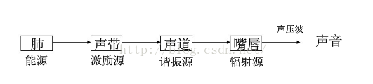  

空气由肺进入喉部，经过声带激励，进入声道，最后通过嘴唇辐射形成语音。

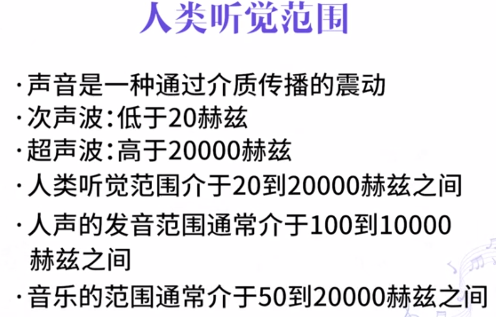

## 2 声音特性

声音（sound)是由物体振动产生的声波。是通过介质传播并能被人或动物听觉器官所感知的波动现象。最初发出振动的物体叫声源。声音以波的形式振动传播。声音是声波通过任何介质传播形成的运动。

频率：是每秒经过一给定点的声波数量，它的测量单位为赫兹，1千赫或1000赫表示每秒经过一给定点的声波有1000个周期，1兆赫就是每秒钟有1,000,000个周期，等等。

音节：就是听觉能够自然察觉到的最小语音单位，音节有声母、韵母、声调三部分组成。一个汉字的读音就是一个音节，一个英文单词可能有一个或多个音节构成，并且按照音节的不同，可以分为不同的种类。

音素：它是从音节中分析出来的最小语音单位，语音分析到音素就不能再分了。比如，“她穿红衣服”是5个音节，而“红”又可进一步分为3个音素–h,o,ng。音素的分析需要一定的语音知识，但是，如果我们读的慢一点是还可以体会到的。

音位：是指能够区分意义的音素，比如bian,pian,bu,pu就是靠b，p两个音素来区分的，所以b，p就是两个音位。

**人耳能听到的音频范围：20HZ–20KHZ。人说话的声音频率：300HZ–3.4KHZ。乐器的音频范围：20HZ–20KHZ**。

## 3. 声音的种类

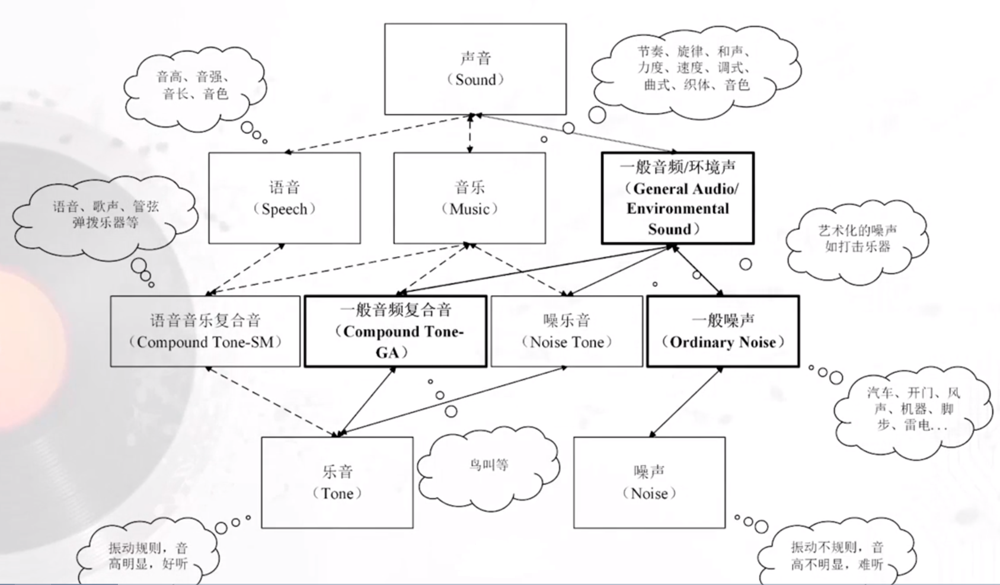

听觉信息处理各学科之间的关系  

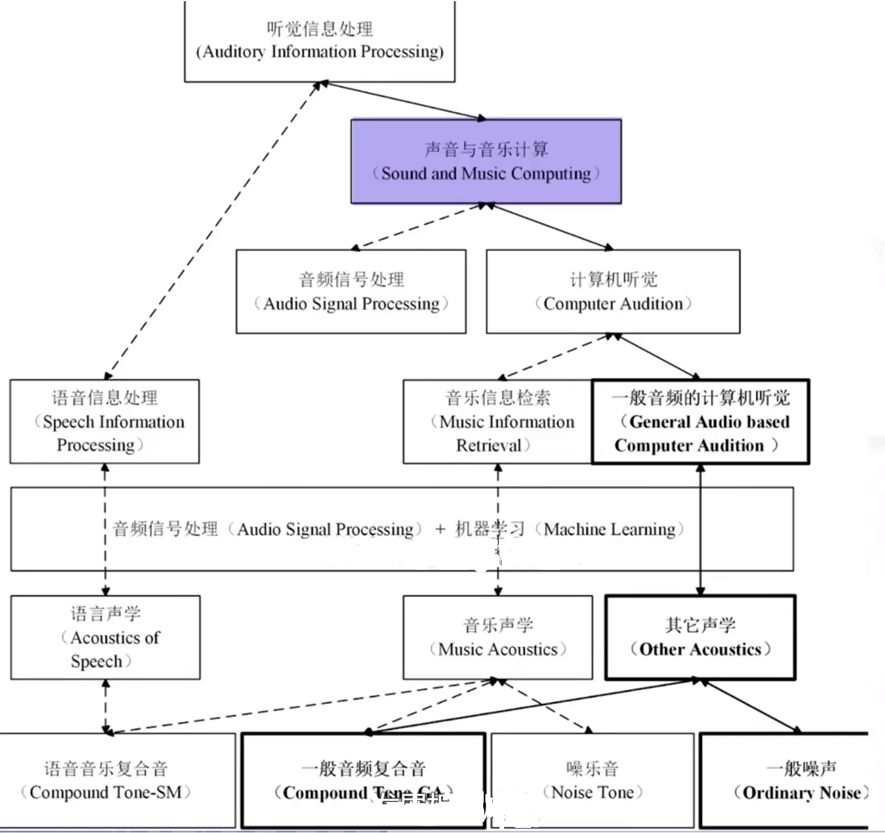

### 计算机听觉的应用

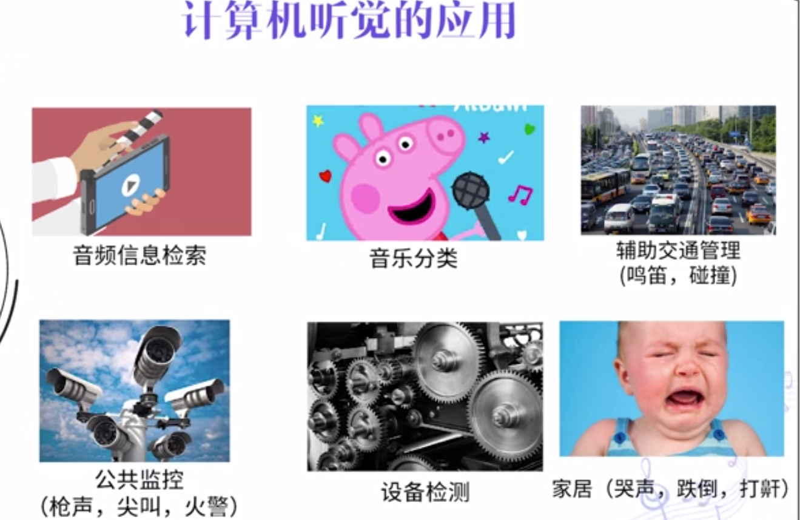  

**其它**  

* 音乐搜索  
* 音乐情感计算  
* 音乐推荐  
* 音乐版权保护  
* AI作曲  
* 音乐治疗

**两种音乐内容的分类的技术框架**

  * 特征提取+分类
  * 端到端机器学习方法

**四种具体分类任务**

  * 曲风分类
  * 乐器分类
  * 作曲家识别
  * 钢琴乐谱难度等级分类

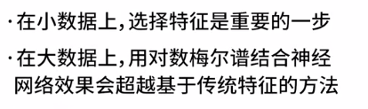

## 4. 什么是音频特征

绝大部分音频特征最初起源于语音识别中。它们可以精简原始的波形采样信号，从而被利用其它模型中。使算法更容易理解音频中蕴含的语义信息。从20世纪90年代末开始，这些音频特征也被用在音乐信息检索的任务中(比如乐器识别，音符起始点的检测等等)， 更多针对于音乐的特征也应用而生

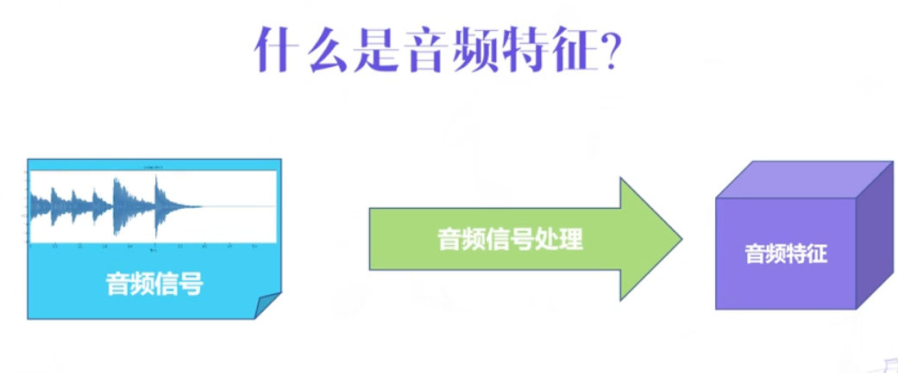

## 5 音频特征的类别

### 5.1 可以从以下几个角度区分

  * 直接输出vs统计值  
特征是提取模型从信号中直接输出的数值，还是基于提取模型的输出得到的描述统计值（如均值，标准差等等）

  * 瞬态vs全局  
瞬态特征通常以**帧**为单位（若干采样点对应的特征），而全局特征则覆盖了**更长的时间段**（如一个**单音信号的有效时长**等等）

  * 抽象程度的高低  
**底层特征**从原始的波形信号中直接被提取，抽象程度最低；可被进一步处理为**中层特征**，代表的语义程度大致等同于**乐谱中常见的元素**（**比如音高或音高的起始时间等等**）；**高层特征**最为抽象，大多被识别**音乐流派**或**情绪**等任务所采用

  * 提取过程中的差异  
直接在音频波形信号中提取的特征（比如**过零率**）；将音频信号从时域变换到频域后提取的特征（比如**频谱质心**）；需通过特定模型得到的特征（**把音频分
离为乐音和噪音之后，再基于任何一个部分得到的特征**）；受人耳听觉认知的启发，改变量化尺度后得到得特征（比如梅尔倒谱系数MFCC）；

乐音于噪音的模型-MPSS的算法

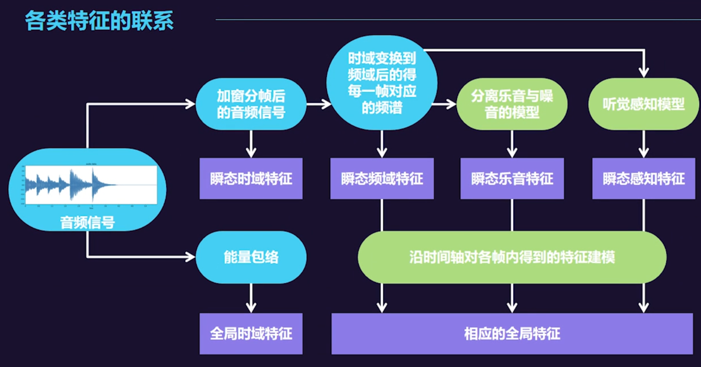

### 5.2. 常见音频特征举例

**能量特征**：均方根能量（Root-Mean-Square Energy）  

**时域特征**：  

* 起音时间（Attack Time）：音符的能量包络在上上升阶段的时长。  
* 过零率（Zero-Crossing Rate）：信号在一段时间通过零点的次数。  
* 自相关（Autocorrelation）：信号与其沿时间轴位移后的版本之间的相似度。这个可以计算单音的基频。  

**频域特征**：  

* 频谱质心（Spectral Centroid）：信号在频谱中能量的集中点，可描述信号音色的明朗度。越亮的声音能量集中在高频部分。频谱质心的值就越大。  
* 频谱平坦度（Spectral Flatness）：量化信号与噪声之间相似度的参数。信号的平坦度越大，那么信号是噪声的可能性越大。  
* 频谱通量（Spectral Flux）：信号相邻帧之间的变化程度。可以计算音符起始点的特征。  

**乐音特征**：  

* 基音频率（Fundamental Frequency）：通常等于单音信号的音高对应的频率。  
* 失谐度（inharmonicity）：表示信号的泛音频率与其基音的整数倍之间的偏移程度。  

**感知特征**：  

* 响度（Loudness）：信号强弱被人耳感觉到的主观感觉量，可以被理解为音量。  
* 尖锐度（Sharpness）：信号的高频部分被人耳感觉到的能量。高频部分的能量越大则尖锐度越大。

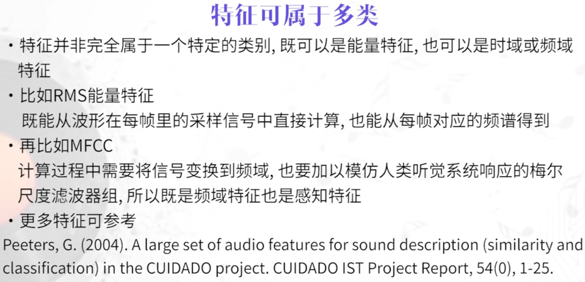

## 6. 音频信号处理

  * **模拟信号处理**

通过某些模拟装置对连续模拟信号进行的处理，示例包括扬声器中的交叉滤波器，立体声中的音量控制等。常用方法**包括卷积，傅里叶变换，拉普拉斯变换**等等。

  * **数字信号处理**

将音频用一系列的数字表示（采样与量化），再在数字表示的信号上执行各种各样的信号处理操作。

我们提取音频特征，做音频信息的检索基本上就是数字信号处理的范畴。

### 采样与量化

**采样**： 连续时间的离散化过程。  
**均匀采样**：每隔相等时间的采样一次，每秒钟需要采样的样本的个数对应**采样频率**

采样频率 44kHZ: 每一秒就有44000个采样点。  

采样频率越高越贴近原始的波形。

根据**奈奎斯特理论**，只有采样频率高于原始信号最高频率的两倍时，才能把数字信号表示的信号还原成为原来信号

量化： 连续的幅度转化为离散的数字。这里先将整个幅度划分成有**限个量化间距**的集合。把落入某个间距里的幅度值赋予相同的量化值。

采样率与量化越大，音质就更好。音频文件占用的存储空间也就越大。

所谓量化，就是声音信号在幅值方面的数字化。方法是把模拟信号的每次采样值进行“整数化”。

量化的主要工作就是将幅度上连续取值的每一个样本转换为离散值表示。其量化过后的样本是用二进制表示的，此时可以理解为已经完成了模拟信号到二进制的转换。量化中又个概念叫精度，指的是每个样本占的二进制位数，反过来，二进制的位数反映了度量声音波形幅度的精度。精度越大，声音的质量就越好。通常的精度有8bit，16bit，32bit等，当然质量越好，需要的储存空间就越大。

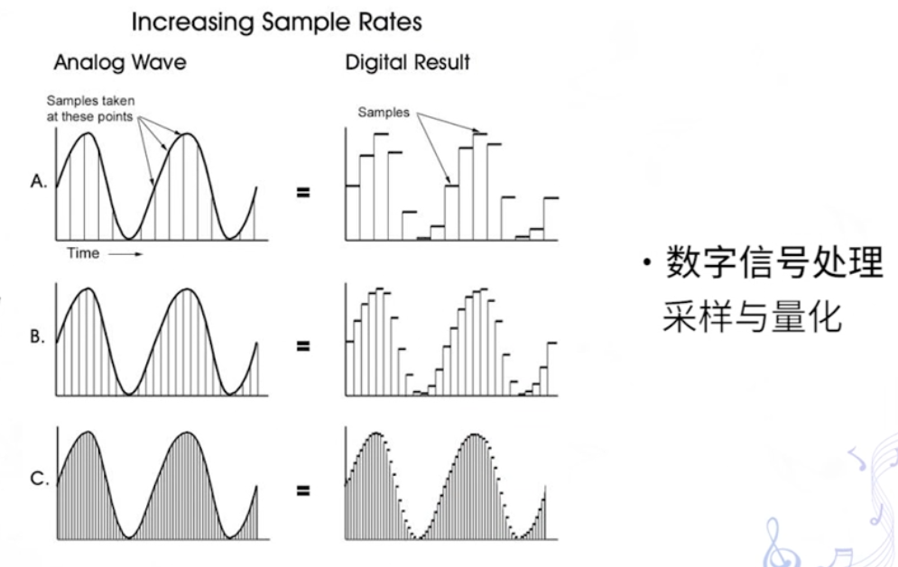

> 采样后，我们还需要对采样信号进行量化。为什么量化呢？你想想，就算是经过采样，**采样点的值依旧是模拟信号本身的值**，该多少是多少，没有变化，那么多的值，而且还有可能各不相同，**那处理起来同样是很困难啊**。**为了把无限多个值，变成有限个值，我们就需要用量化这个技术了**。  
> 通信工作者们把**信号幅度值（也就是纵轴）进行256（二的八次方）次均匀分割**，你的采样点落入哪个区间，就取这个区间所对应的二进制值（八位），这么做就实现了无限个值变成有限个值的目的了。

数字信号–》傅里叶变换变为时频谱（spectrogram）  

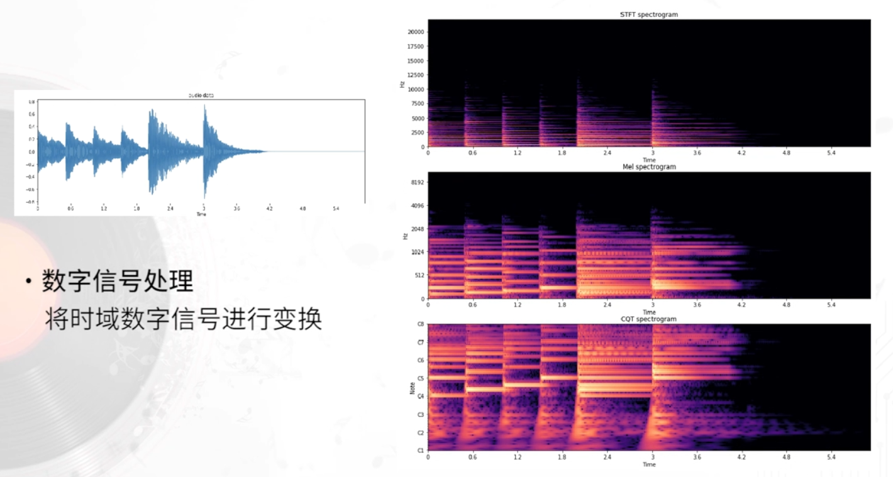

## 7. 特征提取工具

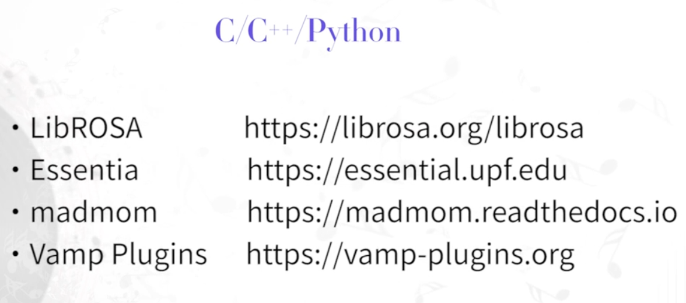

## 8 计算倒谱的流程图

### 8.1 预加重

预加重处理其实是将语音信号通过一个高通滤波器：  

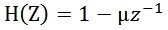  

式中μ的值介于0.9-1.0之间，我们通常取0.96。预加重的目的是提升高频部分，使信号的频谱变得平坦，移除频谱倾斜，来补偿语音信号受到发音系统所抑制的高频部分。同时，也是为了消除发生过程中声带和嘴唇的效应。（因为口唇辐射可以等效为一个一阶零点模型）

### 8.2.分帧、加窗，快速傅里叶变换

因为语音信号为短时平稳信号，所以需要进行分帧处理，以便把每一帧当成平稳信号处理。同时为了减少帧与帧之间的变化，相邻帧之间取重叠。一般帧长取25ms，帧移取帧长的一半。

### 8.3.Mel滤波器组

在语音的频谱范围内设置若干带通滤波器 ，M为滤波器的个数。每个滤波器具有三角形滤波器的特性，其中心频率为，在Mel频谱范围内，这些滤波器是等带宽的。每个带通滤波器的传递函数为：

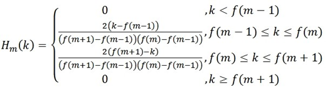  

其中：  

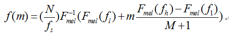  

三角带通滤波器有两个主要目的：

  * 对频谱进行平滑化，并消除谐波的作用。此外还可以减少运算量。
  * 在MATLAB的voicebox工具箱中有melbankm函数可用于计算Mel滤波器组。

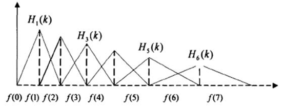  

三角形滤波器的示意图

### 8.4．计算每个滤波器组输出的对数能量为：

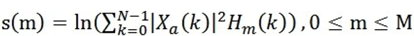

### 8.5 经离散余弦变换（DCT）得到MFCC系数：

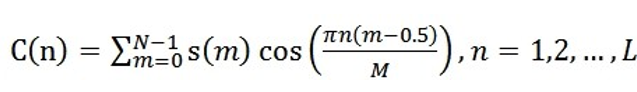  

将上述的对数能量带入离散余弦变换，求出L阶的Mel-scale Cepstrum参数。L阶指MFCC系数阶数，通常取12-16。这里M是三角滤波器个数。

## 9. 其它名词解释

### 9.1 基频（基音，fundamental tone）

基本频率（或简称**基频**，fundamental frequency）声音分解为很多正玄波 傅立叶从数学上证明了，任何的一种非正弦的振动，都可以分解为若干个不同频率的正弦波的叠加。），频率最低的波就是基音，其他频率高的为泛音。频率越高分配到的能量越少。

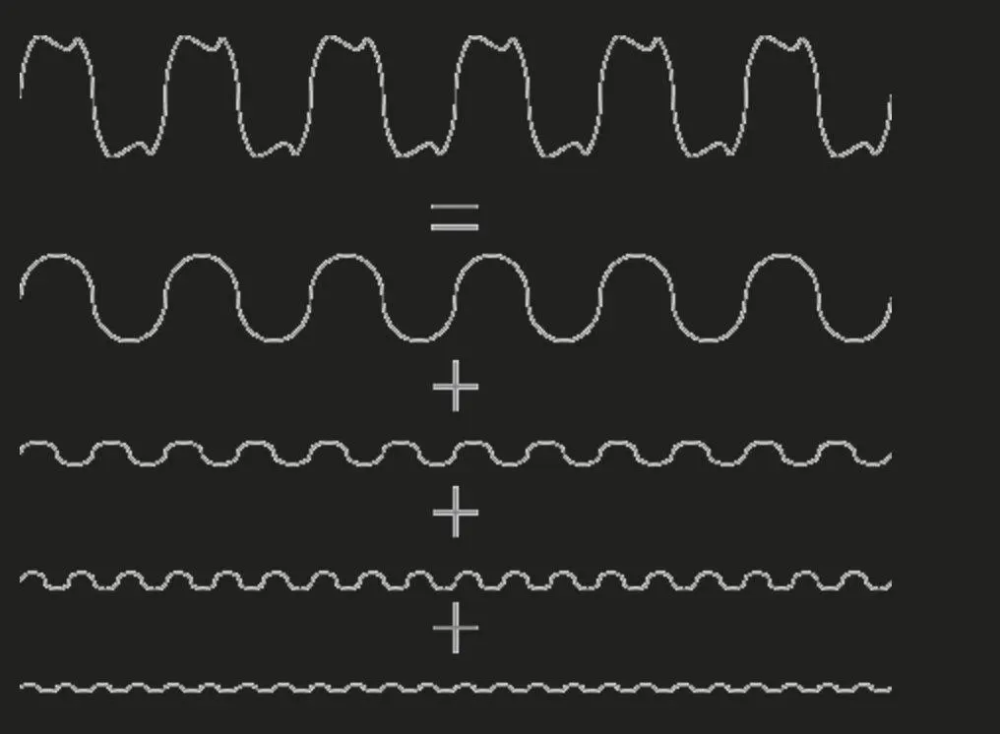

### 9.2. MFCC

梅尔倒谱系数（Mel-scale Frequency Cepstral Coefficients，简称MFCC）  

MFCC特征是一种在自动语音识别和说话人识别中广泛使用的特征。关于MFCC特征的详细信息，有兴趣的可以参考[博客](http://blog.csdn.net/zzc15806/article/details/79246716)。在librosa中，提取MFCC特征只需要一个函数

参数：

  * y：音频数据
  * sr：采样率
  * S：np.ndarray，对数功能梅尔谱图
  * `n_mfcc`：int>0，要返回的MFCC数量
  * `dct_type`：None, or {1, 2, 3} 离散余弦变换（DCT）类型。默认情况下，使用DCT类型2。
  * norm： None or ‘ortho’ 规范。如果dct_type为2或3，则设置norm =’ortho’使用正交DCT基础。  

  标准化不支持`dct_type = 1`。

返回：

  * M： MFCC序列

```python
import librosa

y, sr = librosa.load('./train_nb.wav', sr=16000)
# 提取 MFCC feature
mfccs = librosa.feature.mfcc(y=y, sr=sr, n_mfcc=40)

print(mfccs.shape)        # (40, 65)
```

### 9.3 帧

先将N个采样点集合成一个观测单位，通常情况下N的值为256或512，涵盖的时间约为20~30ms左右。

### 9.4 重叠区域

为了避免相邻两帧的变化过大，因此会让两相邻帧之间有一段重叠区域，此重叠区域包含了M个取样点，通常M的值约为N的1/2或1/3。通常语音识别所采用语音信号的采样频率为8KHz或16KHz，以8KHz来说，若帧长度为256个采样点，则对应的时间长度是256/8000 1000=32ms。

### 9.5 幅值(Amplitude)

每一个声道的语音序列都是以关于0对称的，分布在[-1,1]之间的浮点数。通常会关注一段语音幅值的最大、最小值的绝对值，平均值等等。

### 9.6 过零率(ZCR-Zero-crossing Rate)&过均值率(MCR)

ZCR和MCR与语音信号的高频内容关系比较密切。  

ZCR，就是过零率(zero crossing rate)。它表示在单位时间内(通常是1s)语音幅值的符号变化次数。计算方式如下（伪代码）：

```
for i=1:1:fs-1
    if sign(x(i-1)*x(i))==1 & x(i)!=0
        c=c+1;
    else if x(i)==0 & sign(x(i-1)*x(i+1)==1
        c=c+1;
end
ZCR=c;
1
```

> 其中，x(n)是语音序列，fs是采样率，sign()是符号函数。c是单位时间内的富含变化次数，ZCR单位时间是过零率。  
> 单位时间内的过平均值率(MCR)的计算方法和ZCR类似。只需要对原始序列x做一个处理，`x=x−x¯`。

事实上，语音序列的平均值已经很接近0了。ZCR或者MCR越大，则语音中的高频内容越多。

### 9.7. 能量(Energy)

时域的能量计算是以幅值为基础的，给一段语音的幅值求去均方根，就可以简单的作为它的能量了。

<span class="LaTex" alt="LaTex">$$
energy=\frac{1}{N}⋅∑x(n)^2
$$</span>

而更加严格的能量计算需要进行傅里叶变换，然后对复平面中的幅值求均方根，这里不详述。

### 9.8. 线性预测编码系数(LPCC)

待续

### 9.9.均方根能量（Root-mean-Square Energy）

https://librosa.org/doc/0.6.3/generated/librosa.feature.rms.html

```python
y, sr = librosa.load('58bpm.wav')
print(librosa.feature.rms(y=y))
```

## 10. 代码实现

安装Librosa

```python
pip install librosa
or
conda install -c conda-forge librosa
```

**波形图**  

用Librosa加载音频，用matplotlib显示出来

```python
import librosa
import matplotlib.pyplot as plt
x, sr = librosa.load('58bpm.wav')
print(x.shape)
print(sr)
librosa.display.waveplot(x, sr=11025)
plt.show()
```

```python
(182464,)
22050
```

182464/11025 =16.5500。  
默认采用率是22050。  
根据一共有182464点。取值范围（-1，1）。这些点其实纵轴的坐标。

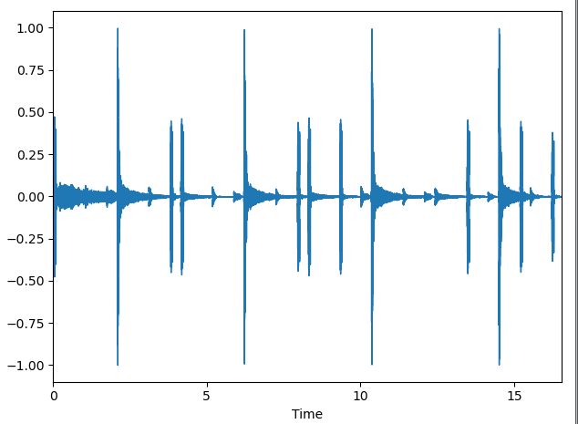  

**过零率**

计算音频时间序列的过零率。

```python
import librosa
x, sr = librosa.load('58bpm.wav')
b = librosa.feature.zero_crossing_rate(x, frame_length=2048, hop_length=512)
print(b)
print(b.shape)
```

```python
(1, 357)
```

**求RMS- 均方根能量（Root-Mean-Square Energy）**

```python
import librosa
import matplotlib.pyplot as plt

y, sr = librosa.load('58bpm.wav')
rms = librosa.feature.rms(y=y,frame_length=2048, hop_length=512)
print(rms.shape)
plt.figure()
plt.semilogy(rms.T, label='RMS Energy')
plt.xticks([])
plt.xlim([0, rms.shape[-1]])
plt.legend(loc='best')
plt.show()
```

```python
(1, 357)
```

`hop_length`：步幅;帧移对应卷积中的stride;连续帧分割长度  
`frame_length`：一帧的长度  
182464 / 512 = 356.375  

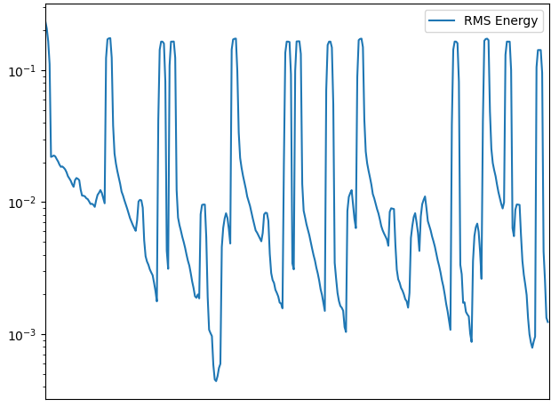

**短时傅立叶变换（STFT）**，返回一个复数矩阵使得D(f,t)  

复数的实部：np.abs(D(f,t))频率的振幅  
复数的虚部：np.angle(D(f,t))频率的相位

```python
y, sr = librosa.load('58bpm.wav')
S = librosa.stft(y, n_fft=2048, hop_length=512)
S = np.abs(S)
print(y.shape)
print(S.shape)
```

STFT矩阵，shape = 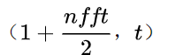

```python
(182464,)
(1025, 357)
```

**幅度转dB**  

将幅度频谱转换为dB标度频谱。也就是对S取对数。

```python
librosa.amplitude_to_db(S, ref=1.0)
```

```python
import librosa
import librosa.display
import matplotlib.pyplot as plt

x, sr = librosa.load('58bpm.wav')
X = librosa.stft(x)
Xdb = librosa.amplitude_to_db(abs(X))
print(x.shape)
print(X.shape)
print(Xdb.shape)

plt.figure(figsize=(14, 5))
librosa.display.specshow(Xdb, sr=sr, x_axis='time', y_axis='hz')
plt.colorbar()
plt.show()
```

```python
(182464,)
(1025, 357)
(1025, 357)
```

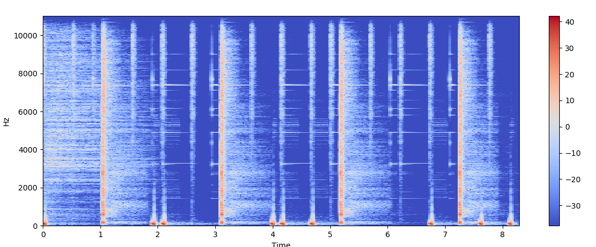

```python
import librosa
import matplotlib.pyplot as plt

y, sr = librosa.load('58bpm.wav')
#y, sr = librosa.load(librosa.util.example_audio_file())
rms = librosa.feature.rms(y=y,frame_length=2048, hop_length=512)
print(rms.shape)

S, phase = librosa.magphase(librosa.stft(y))
rms = librosa.feature.rms(S=S)

plt.figure()
plt.subplot(2, 1, 1)
plt.semilogy(rms.T, label='RMS Energy')
plt.xticks([])
plt.xlim([0, rms.shape[-1]])
plt.legend(loc='best')
plt.subplot(2, 1, 2)
librosa.display.specshow(librosa.amplitude_to_db(S, ref=np.max),
                         y_axis='log', x_axis='time')
plt.title('log Power spectrogram')
plt.tight_layout()
plt.show()
```

`hop_length`：步幅;帧移对应卷积中的stride;连续帧分割长度  
`frame_length`：一帧的长度  
182464 / 512 = 356.375

```python
(1, 357)
```

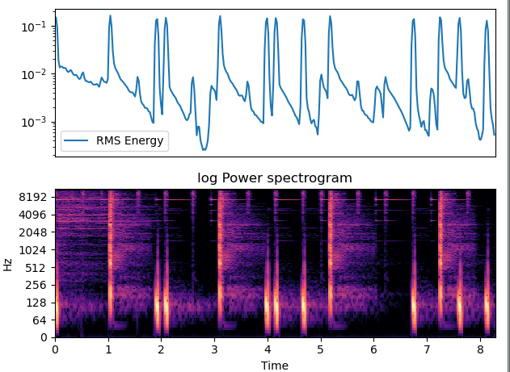

**频谱图**

```python
import librosa
import matplotlib.pyplot as plt
import numpy as np

y, sr = librosa.load('58bpm.wav')
plt.figure()

D = librosa.amplitude_to_db(np.abs(librosa.stft(y)), ref=np.max)
plt.subplot(2, 1, 1)
librosa.display.specshow(D, y_axis='linear')
plt.colorbar(format='%+2.0f dB')
plt.title('Liner-frequency power spectrogram')

plt.subplot(2, 1, 2)
librosa.display.specshow(D, y_axis='log')
plt.colorbar(format='%+2.0f dB')
plt.title('log-frequency power spectrogram')
plt.show()
```

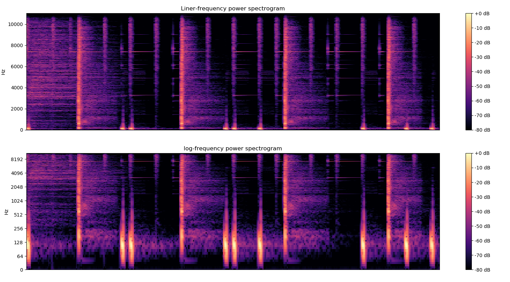

梅尔倒谱系数-MFCC

```python
import librosa
import matplotlib.pyplot as plt

y, sr = librosa.load('58bpm.wav')
mfccs = librosa.feature.mfcc(y=y, sr=sr)
print(mfccs)
print(mfccs.shape)

img = librosa.display.specshow(mfccs, x_axis='time')
plt.colorbar(img)
plt.title('MFCC')
plt.show()
```

```python
(20, 357)
```

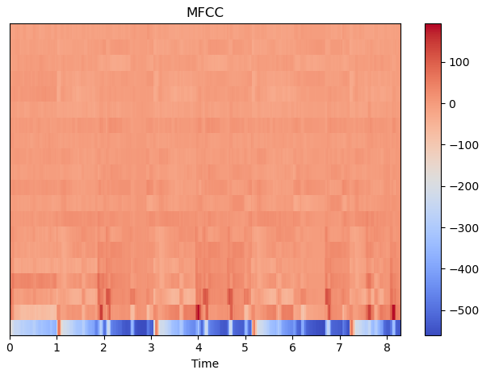

**基频-Fundamental frequency**

```python
y, sr = librosa.load('58bpm.wav')
f0, voiced_flag, voiced_probs = librosa.pyin(y, fmin=librosa.note_to_hz('C2'), fmax=librosa.note_to_hz('C7'))
print(f0.shape)
times = librosa.times_like(f0)
print(times.shape)

D = librosa.amplitude_to_db(np.abs(librosa.stft(y)), ref=np.max)
fig, ax = plt.subplots()
img = librosa.display.specshow(D, x_axis='time', y_axis='log', ax=ax)
ax.set(title='pYIN fundamental frequency estimation')
fig.colorbar(img, ax=ax, format="%+2.f dB")
ax.plot(times, f0, label='f0', color='cyan', linewidth=3)
ax.legend(loc='upper right')
plt.show()
```

```python
(357,)
(357,)
```

浅蓝色的是基频

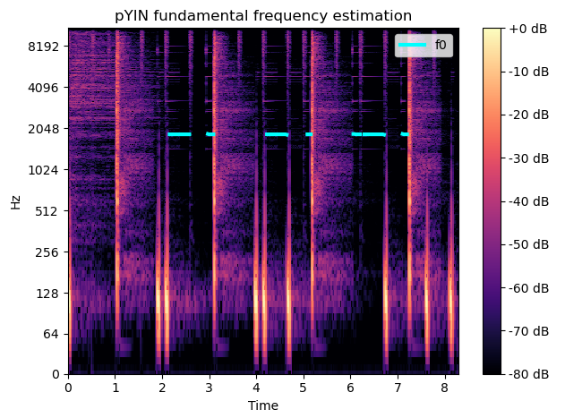

## 11. 其它

### 11.1 短时傅立叶变换

通过傅立叶变换可以得到信号的频谱。信号的频谱的应用非常广泛，信号的压缩、降噪都可以基于频谱。

然而**傅立叶变换有一个假设，那就是信号是平稳的，即信号的统计特性不随时间变化**。声音信号就不是平稳信号，在很长的一段时间内，有很多信号会出现，然后立即消失。如果将这信号全部进行傅立叶变换，就不能反映声音随时间的变化。

**短时傅立叶变换(short-time fourier transform)就能解决这个问题**。声音信号虽然不是平稳信号，但在较短的一段时间内，可以看作是平稳的。符合直觉的解决方案是取一小段进行傅立叶变换，这也正是短时傅立叶变换的核心思想。  

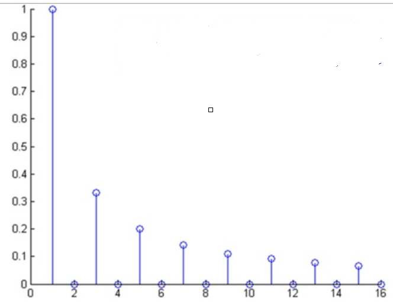

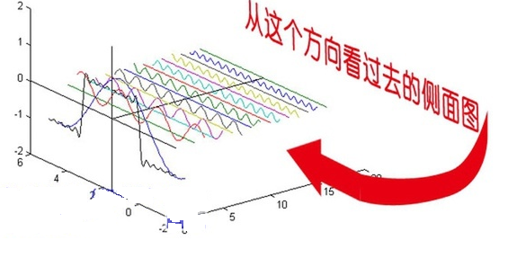

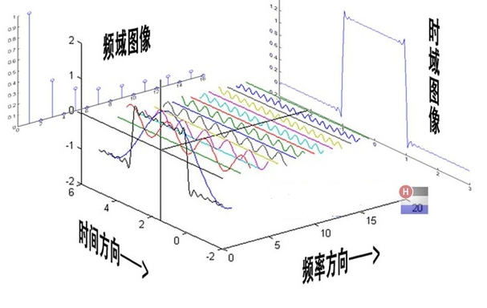  

在一段很短的时间内， 利用用傅里叶变换，将时域转换为频域。  

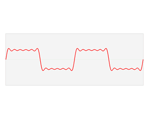

### 7.2频谱图

快速傅立叶变换是一种功能强大的工具，可让我们分析信号的频率成分，但是如果信号的频率成分随时间变化，该怎么办？ 大多数音频信号（例如音乐和语音）就是这种情况。这些信号称为非周期性信号。 我们需要一种表示这些信号随时间变化的频谱的方法。您可能会想，“嘿，我们不能通过对信号的多个窗口部分执行FFT来计算多个频谱吗？” 是! 这正是完成的工作，称为短时傅立叶变换。FFT是在信号的重叠窗口部分上计算的，我们得到了所谓的频谱图。 哇！ 需要接受很多东西。这里有很多事情要做。 良好的视觉效果是必须的。

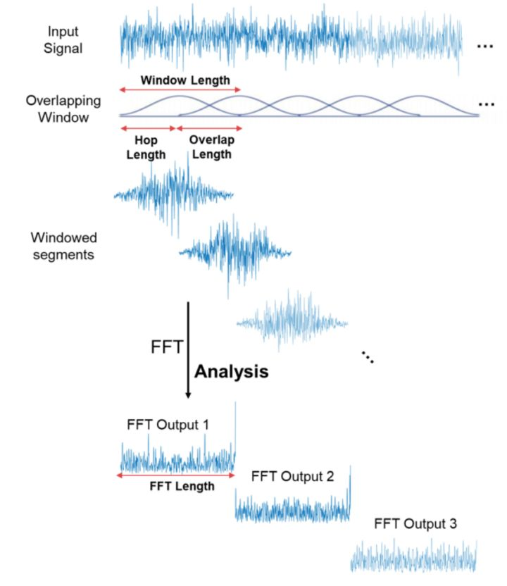

您可以将频谱图视为一堆相互堆叠的FFT。 当信号在不同频率下随时间变化时，这是一种直观地表示信号响度或幅度的方法。 计算频谱图时，还有一些其他细节。y轴转换为对数刻度，颜色尺寸转换为分贝（您可以将其视为振幅的对数刻度）。 这是因为人类只能感知到非常小的集中频率和幅度范围。

```python
spec = np.abs(librosa.stft(y, hop_length=512))
spec = librosa.amplitude_to_db(spec, ref=np.max)librosa.display.specshow(spec, sr=sr, x_axis='time', y_axis='log');
plt.colorbar(format='%+2.0f dB');
plt.title('Spectrogram');
```

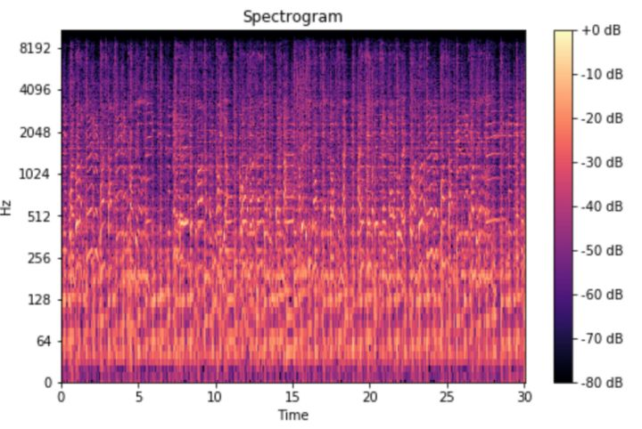  

仅用几行代码，我们就创建了一个频谱图。 好。 我们对“频谱图”部分有扎实的了解，但对“MEL”则如何。 他是谁？

### 7.3 梅尔（Mel）量表

研究表明，**人类不会感知线性范围的频率。 我们在检测低频差异方面要胜于高频。** 例如，我们可以轻松分辨出500 Hz和1000Hz之间的差异，但是即使之间的距离相同，我们也很难分辨出10,000 Hz和10,500 Hz之间的差异。

1937年，Stevens，Volkmann和Newmann提出了一个音高单位，以使相等的音高距离听起来与听众相等。 这称为梅尔音阶。我们对频率执行数学运算，以将其转换为mel标度。

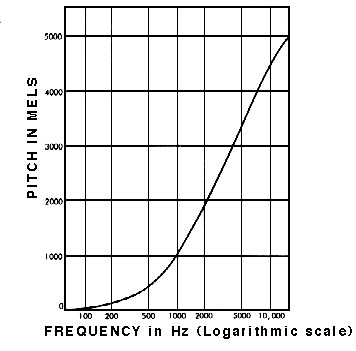  

https://blog.csdn.net/qq_28006327/article/details/59129110

则人耳对频率的感知度就成了线性关系。也就是说，在梅尔标度下，如果两段语音的梅尔频率相差两倍，则人耳可以感知到的音调大概也相差两倍。  
让我们观察一下从Hz到mel的映射图，由于它们是log的关系，当频率较小时，mel随Hz变化较快；当频率很大时，mel的上升很缓慢，曲线的斜率很小。**这说明了人耳对低频音调的感知较灵敏，在高频时人耳是很迟钝的，**梅尔标度滤波器组启发于此。  

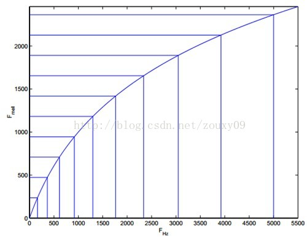

```python
mel_spect = librosa.feature.melspectrogram(y=y, sr=sr, n_fft=2048, hop_length=1024)
mel_spect = librosa.power_to_db(spect, ref=np.max)librosa.display.specshow(mel_spect, y_axis='mel', fmax=8000, x_axis='time');
plt.title('Mel Spectrogram');
plt.colorbar(format='%+2.0f dB');
```

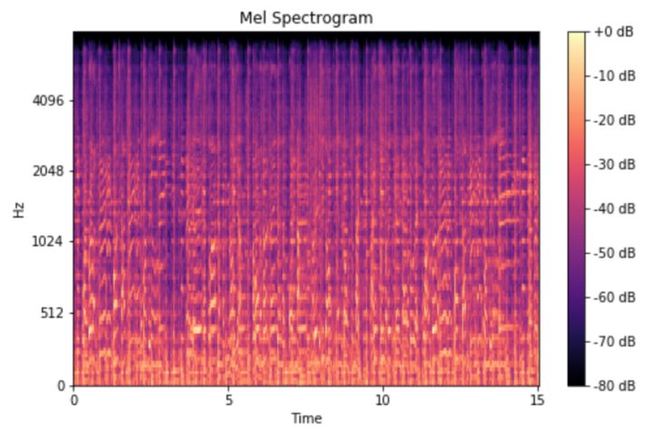

### 共振峰

**共振峰是指在声音的频谱中能量相对集中的一些区域，共振峰不但是音质的决定因素，而且反映了声道（共振腔）的物理特征。**声音在经过共振腔时，受到腔体的滤波作用，使得频域中不同频率的能量重新分配，一部分因为共振腔的共振作用得到强化，另一部分则受到衰减。由于能量分布不均匀，强的部分犹如山峰一般，故而称之为共振峰。**在语音声学中，共振峰决定着元音的音质。**

**提取方法：**

**共振峰的提取方法较多**，比较常见的有**谱包络法**、倒谱法、LPC内插法、LPC求根法、希尔伯特变换法等，但以上方法都或多或少受，虚假峰值，共振峰合并，高音调语音（尤其是女性）的影响，针对单个元音以上方法可以较好的找到共振峰，但对于连续语音准确度较差。在噪声背景下不具有很好的鲁棒性。下面简单介绍一种针对连续变化语音的鲁棒性较好的共振峰追踪算法。

### DCT 离散余弦变换

求倒谱时这一步仍然用的是傅里叶变换。计算MFCC时使用的离散余弦变换（discrete cosine transform，DCT）是傅里叶变换的一个变种，好处是结果是实数，没有虚部。DCT还有一个特点是，对于一般的语音信号，这一步的结果的前几个系数特别大，后面的系数比较小，可以忽略。上面说了一般取40个三角形，所以DCT的结果也是40个点；实际中，一般仅保留前13~20个，这就进一步压缩了数据。得到梅尔倒谱。  

DCT 有好多实现方法（占坑）

这样我们会得到一个随着时间变化的频谱图，这个就是描述语音信号的spectrogram声谱图。  

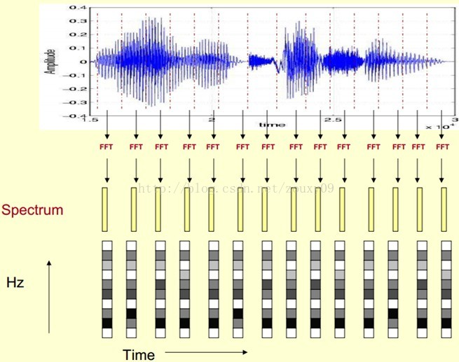

### 倒谱分析（Cepstrum Analysis）

下面是一个语音的频谱图。**峰值就表示语音的主要频率成分**，我们把这些峰值称为**共振峰**（**formants**），而共振峰就是携带了声音的辨识属性（就是个人身份证一样）。所以它特别重要。用它就可以识别不同的声音。  

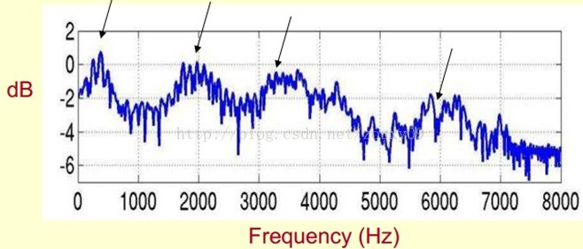  

既然它那么重要，那我们就是需要把它提取出来！我们要提取的不仅仅是共振峰的位置，还得提取它们转变的过程。所以我们提取的是频谱的包络（Spectral Envelope）。这包络就是一条连接这些共振峰点的平滑曲线。  

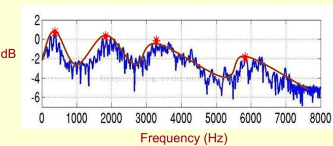  

我们可以这么理解，将原始的频谱由两部分组成：包络和频谱的细节。这里用到的是对数频谱，所以单位是dB。那现在我们需要把这两部分分离开，这样我们就可以得到包络了。

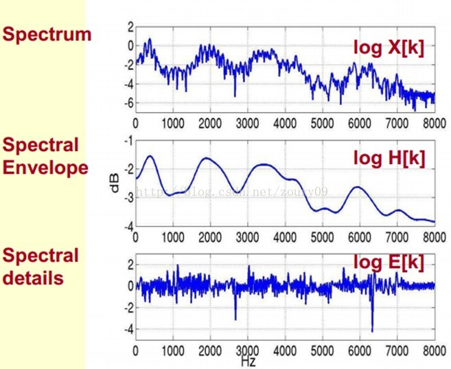

[参考资料](https://blog.csdn.net/suan2014/article/details/82021324)

### Mel频率倒谱系数获取步骤（Mel-Frequency Cepstral Coefficients）

我们将频谱通过一组Mel滤波器就得到Mel频谱。公式表述就是：log X[k] = log (Mel-Spectrum)。这时候我们在logX[k]上进行倒谱分析：

1）取对数：log X[k] = log H[k] + log E[k]。

2）进行逆变换：x[k] = h[k] + e[k]。

在Mel频谱上面获得的倒谱系数h[k]就称为Mel频率倒谱系数，简称MFCC。  

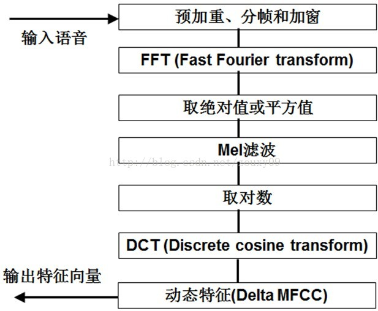

1）先对语音进行预加重、分帧和加窗：

11)分帧：为了方便对语音分析，可以将语音分成一个个小段，称之为：帧。先将N个采样点集合成一个观测单位，称为帧。通常情况下N的值为256或512，涵盖的时间约为20~30ms左右。为了避免相邻两帧的变化过大，因此会让两相邻帧之间有一段重叠区域，此重叠区域包含了M个取样点，通常M的值约为N的1/2或1/3。通常语音识别所采用语音信号的采样频率为8KHz或16KHz，以8KHz来说，若帧长度为256个采样点，则对应的时间长度是256/8000×1000=32ms。

12)加窗：

语音在长范围内是不停变动的，没有固定的特性无法做处理，所以将每一帧代入窗函数，窗外的值设定为0，其目的是消除各个帧两端可能会造成的信号不连续性。常用的窗函数有方窗、汉明窗和汉宁窗等，根据窗函数的频域特性，常采用汉明窗。

2）对每一个短时分析窗，通过FFT得到对应的频谱；（获得分布在时间轴上不同时间窗内的频谱）

3）将上面的频谱通过**Mel滤波器组得到Mel频谱**；（通过Mel频谱，将线形的自然频谱转换为体现人类听觉特性的Mel频谱）

4）在Mel频谱上面进行倒谱分析（取对数，做逆变换，实际逆变换一般是通过DCT离散余弦变换来实现，取DCT后的第2个到第13个系数作为MFCC系数），获得Mel频率倒谱系数MFCC，这个MFCC就是这帧语音的特征；（倒谱分析，获得MFCC作为语音特征）

这时候，语音就可以通过一系列的倒谱向量来描述了，每个向量就是每帧的MFCC特征向量。

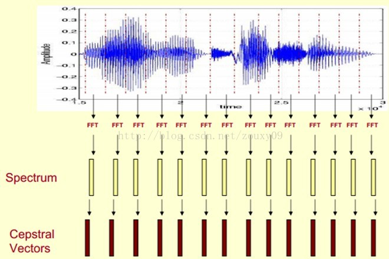  

这样就可以通过这些倒谱向量对语音分类器进行训练和识别了。

**总而言之**  

如果你像我一样是信号处理新手的话，这里有很多概念需要了解。然而，如果你继续回顾这篇文章中提出的概念（花足够的时间盯着墙角思考它们），它就会开始有意义了！让我们简要回顾一下我们所做的工作。

我们随时间采集了气压样本，以数字方式表示音频信号

我们使用快速傅里叶变换将音频信号从时域映射到频域，并在音频信号的重叠窗口部分执行此操作。  
我们将y轴（频率）转换为对数刻度，将颜色尺寸（幅度）转换为分贝，以形成频谱图。  
我们将y轴（频率）映射到mel刻度上以形成mel频谱图。

## 参考资料

* [理解傅里叶变换](https://blog.csdn.net/l494926429/article/details/51818012/)
* https://www.jianshu.com/p/ac1444495f75  
* https://pypi.org/project/SpeechRecognition/  
* https://interactiveuandmetutorials.weebly.com/  
* https://medium.com/@mikesmales/sound-classification-using-deep-learning-8bc2aa1990b7  
* https://www.bilibili.com/video/BV1pE411B7Ja/?spm_id_from=333.788.b_7265636f5f6c697374.2
