<!--BEGIN_DATA
{
    "create_date": "2021-12-03 16:20", 
    "modify_date": "2021-12-03 16:20", 
    "is_top": "0", 
    "summary": "音频编码", 
    "tags": "音视频", 
    "file_name": "音频编码.md"
}
END_DATA-->

#### 
原文出处：<a href='https://mp.weixin.qq.com/s/tVUgH17HZe6PWj09hYzkbg' target='blank'>音频编码</a>

>（本文基本逻辑：音频编码的理论基础 → PCM 编码 → AAC 编码工具集、编码流程、编码规格和数据格式）

对音频或视频进行编码最重要目的就是**为了进行数据压缩，以此来降低数据传输和存储的成本**。

拿音频来举例，一路采样率为 44100 Hz，量化位深为 16 bit，声道数为 2 的声音，如果不进行编码压缩，对应的码率是：`441000 Hz * 16 bit * 2 = 1411200 bps = 1.346 Mbps`。一分钟的时间所需要的数据量是：`1.346 Mbps * 60 s = 80.75 Mb = 10.09 MB`。

对于单单一路音频来说，这个数据量还是比较大的，在存储或传输时如果能进行压缩编码，可以一定程度上提高效率。

通常，对信息进行压缩，可以从这几个方面着手：

  * 1）**信源包含的符号出现概率的非均匀性，使得信源是可以被压缩的。**熵编码就利用信源的统计特性进行码率压缩的编码方式。比如著名的哈夫曼编码（也是熵编码的一种），就是当信源中各符号的出现概率都一样时编码效率最低。

  * 2）**信源的相关性，使得信源是可以被压缩的。**比如信息 A 和信息 B 的相关性，使得我们可以由信息 A 加残差 D（D = A - B） 来推导信息 B，这样只编码 A 和 D 来实现压缩，这就是所谓的差分编码技术。

  * 3）**人的感知对不同信源的敏感度不一样，使得信源是可以被压缩的。**对人感知不敏感的信息进行部分或全部忽略来实现压缩。

要对音频数据进行编码压缩，主要是寻找音频数据中的冗余信息对其进行压缩：

## 1）时域冗余

音频信号时域上的冗余主要表现为下面几个方面：

  * **幅度分布的非均匀性**：统计表明，在大多数类型的音频信号中，小幅度样值出现的概率比大幅度样值出现的概率要高。人的语音中，间歇、停顿等出现了大量的低电平样值；实际讲话的功率电平也趋向于出现在编码范围的较低电平端。

  * **样值之间的相关性**：对语音波形的分析表明，相邻样值之间存在很强的相关性。当采样频率为 8k Hz 时，相邻样值之间的相关系数大于 0.85。如果进一步提高采样频率，则相邻样值之间的相关性将更强。因此，根据较强的维相关性，可以利用差分编码技术进行有效的数据压缩。

  * **信号周期之间的相关性**：虽然音频信号分布于 20-20k Hz 的频带范围，但在特定的瞬间，某一声音却往往只是该频带内的少数频率成分在起作用。当声音中只存在少数几个频率时，就会像某些振荡波形一样，在周期与周期之间存在着一定的相关性。利用音频信号周期之间的相关性进行压缩的编码器，比仅仅利用邻近样值间的相关性的编码器效果好，但要复杂得多。

  * **静止系数**：两个人之间打电话，平均每人讲话时间为通话时间的一半，并且在这一半的通话过程中也会出现间歇停顿。分析表明，话音间隙使全双工话路的典型效率约为 40% (或称静止系数为 0.6)。显然，话音间隔本身就是一种冗余，若能正确检测出这些静止段，可以进行压缩。

  * **长时自相关性**：统计样值、周期间的一些相关性时，在 20 ms 时间间隔内进行统计的称为短时自相关函数。如果在较长的时间间隔（如几十秒）内进行统计时，则称为长时自相关函数。长时统计表明，当采样频率为 8k Hz 时，相邻的样值之间的平均相关系数可高达 0.9。这样的相关性也可以进行压缩。

## 2）频域冗余

音频信号频域上的冗余主要表现为下面几个方面：

  * **长时功率谱密度的非均匀性**：在相当长的时间间隔内进行统计平均，可以得到长时功率谱密度函数，其功率谱呈现明显的非平坦性。从统计的观点看，这意味着没有充分利用给定的频段，或者说存在固有的冗余度。功率谱的高频成分能量较低。

  * **语音特有的短时功率谱密度**：语音信号的短时功率谱，在某些频率上出现峰值，而在另一些频率上出现谷值。这些峰值频率，也就是能量较大的频率，通常称其为共振峰频率。共振峰频率不止一个，最主要的是前三个，由它们决定不同的语音特征。另外，整个功率谱也是随频率的增加而递减的。更重要的是整个功率谱的细节以基音频率为基础，形成了高次谐波结构。

## 3）听觉冗余

人是音频信号的最终用户，因此，要充分利用人类听觉的生理和心理特性对音频信号感知的影响。利用人耳的频率特性灵敏度以及掩蔽效应，可以压缩数字音频的数据量：

  * 可以**将会被掩蔽的信号分量在传输之前就去除**，因为这部分信号即使传输了也不会被听见。

  * 可以**不理会可能被掩蔽的量化噪声**。

  * 可以**将人耳不敏感的频率信号在数字化之前滤除**，如语音信号只保留 300-3400 Hz 的信号。

> 人耳的掩蔽效应包括下面几种：
>
>   * **最小可闻阈值**：一个频率的声音能量小于某个阈值之后，人耳就会听不到。
>
>   * **频率掩蔽效应**：当有能量较大的声音出现的时候，该声音频率附近的其它频率的人耳可听阈值会提高很多，这样就会导致人耳听不到这些频率低于阈值的信号，即这些信号被掩蔽。
>
>   * **时域掩蔽效应**：当强音信号和弱音信号同时出现时，可能会发生前掩蔽、同时掩蔽、后掩蔽。前掩蔽是指人耳在听到强信号之前的短暂时间内，已经存在的弱信号会被掩蔽而听不到。同时掩蔽是指当强信号与弱信号同时存在时，弱信号会被强信号所掩蔽而听不到。后掩蔽是指当强信号消失后，需经过较长的一段时间才能重新听见弱信号。这些被掩蔽的弱信号即可视为冗余信号。

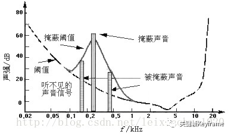

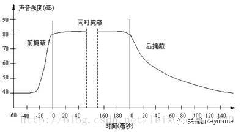

对音频进行编码常见的格式有：  

  * PCM，无压缩。一种将模拟信号的数字化方法，无损编码。

  * WAV，无压缩。有多种实现方式，但是都不会进行压缩操作。其中一种实现就是在 PCM 数据格式的前面加上 44 字节，分别用来描述 PCM 的采样率、声道数、数据格式等信息。音质非常好，大量软件都支持。

  * MP3，有损压缩。音质在 128 Kbps 以上表现还不错，压缩比比较高，大量软件和硬件都支持，兼容性好。

  * AAC，有损压缩。在小于 128 Kbps 的码率下表现优异，并且多用于视频中的音频编码。

  * OPUS，有损压缩。可以用比 MP3 更小的码率实现比 MP3 更好的音质，高中低码率下均有良好的表现，兼容性不够好，流媒体特性不支持。适用于语音聊天的音频消息场景。

PCM 是音频原始数据的基础格式；AAC 则在短视频和直播场景广泛使用。这里，我们只详细介绍一下 PCM 和 AAC。

## 1、PCM 编码

PCM 是指脉冲编码调制（Pulse Code Modulation），是数字通信的编码方式之一，是一种将模拟信号数字化的方法。主要过程是将话音等模拟信号每隔一定时间进行取样，使其离散化，同时将抽样值按分层单位四舍五入取整量化，同时将抽样值按一组二进制码来表示抽样脉冲的幅值。

从声音的模拟信号得到 PCM 编码数据的过程包括 3 个步骤：

  * **采样**：以一定采样率在时域内获取离散信号。

  * **量化**：每个采样点幅度的数字化表示。

  * **编码**：以一定格式存储数据。

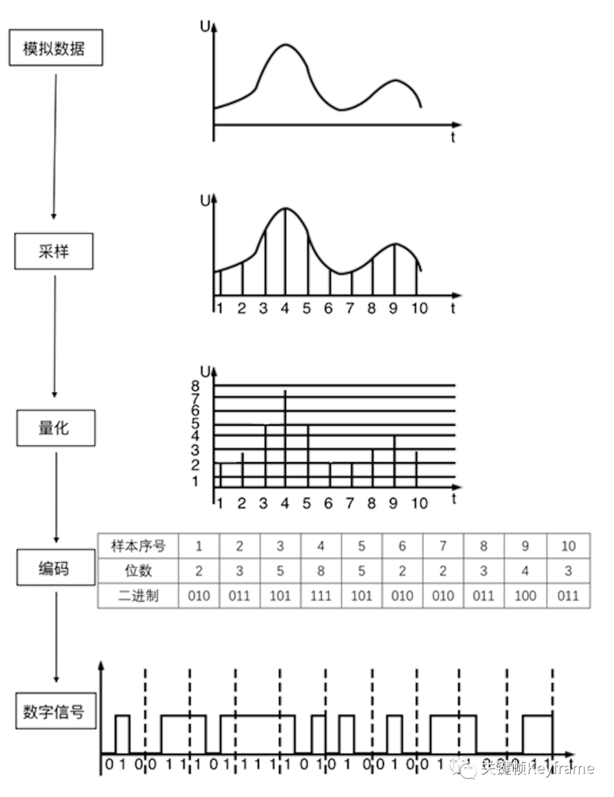

在计算机应用中，PCM 是能达到音频最高保真水平的格式，它被广泛用于素材保存及音乐欣赏，PCM 也因此被称为无损编码格式。但这并不意味着 PCM 就能够确保信号绝对保真，它只能做到最大程度的无限接近原始声音。要计算一个 PCM 音频流的码率需要数字音频的三要素信息即可：`码率 = 采样率 × 量化位深 × 声道数`。

在处理 PCM 数据时，对于音频不同声道的数据，有两种不同的存储格式：

  * 交错格式：不同声道的数据交错排列。

  * 平坦格式：相同声道的数据聚集排列。

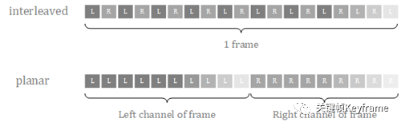

下面是一个示例：

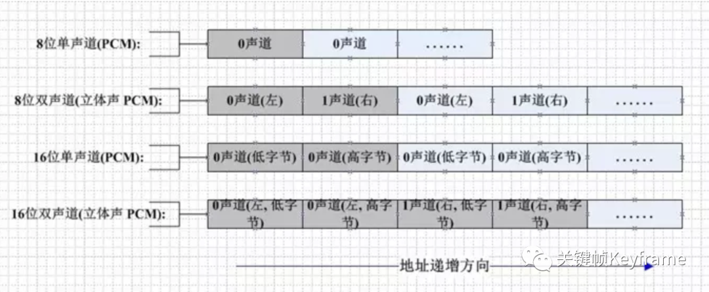  

此外，在处理 PCM 数据时，还需要注意大小端字节序类型。

由于 PCM 编码是无损编码，且广泛应用，所以我们通常可以认为音频的裸数据格式就是 PCM 的。但为了节省存储空间以及传输成本，通常我们会对音频 PCM 数据进行压缩，这也就是音频编码，比如 MP3、AAC、OPUS 都是我们常见的音频编码格式。

## 2、AAC 编码

### 2.1、背景介绍

AAC，英文全称 Advanced Audio Coding，是由 Fraunhofer IIS、杜比实验室、AT&T、Sony 等公司共同开发，在 1997 年推出的基于 MPEG-2 的有损数字音频压缩的专利音频编码标准。2000 年，MPEG-4 标准在原 AAC 的基础上加上了 LTP（Long Term Prediction）、PNS（Perceptual Noise Substitution）、SBR（Spectral Band Replication）、PS（Parametric Stereo）等技术，并提供了多种扩展工具。

AAC 作为 MP3 的后继者而被设计出来，综合了许多新的技术，有很多新的特性，它支持从 8k 到 96k 的各种采样率，支持多种声道配置方案。在相同的比特率之下，AAC 相较于 MP3 通常可以达到更好的声音质量。

### 2.2、编码工具及流程

AAC属于感知音频编码。与所有感知音频编码类似，其原理是利用人耳听觉的掩蔽效应，对变换域中的谱线进行编码，去除将被掩蔽的信息，并控制编码时的量化噪声不被分辨。

在编码过程中，时域信号先通过滤波器组（进行加窗 MDCT 变换）分解成频域谱线，同时时域信号经过心理声学模型获得信掩比，掩蔽阈值，M/S 立体声编码以及强度立体声编码需要的控制信息，还有滤波器组中应使用长短窗选择信息。瞬时噪声整形（TNS）模块将噪声整形为与能量谱包络形状类似，控制噪声的分布。强度立体声编码和预测以及 M/S 立体声编码都能有效降低编码所需比特数，随后的量化模块用两个嵌套循环进行了比特分配并控制量化噪声小于掩蔽阈值，之后就是改进了码本的哈夫曼编码。这样，与前面各模块得到的边带信息一起，就能构成 AAC 码流了。

AAC 系统包含了增益控制、滤波器组、心理声学模型、量化与编码、预测、TNS、立体声处理等多种高效的编码工具。这些模块或过程的有机组合形成了 AAC 系统的基本编解码流程。

在实际应用中，并不是所有的功能模块都是必需的，下表列出了 MPEG-2 AAC 各模块的可选性：

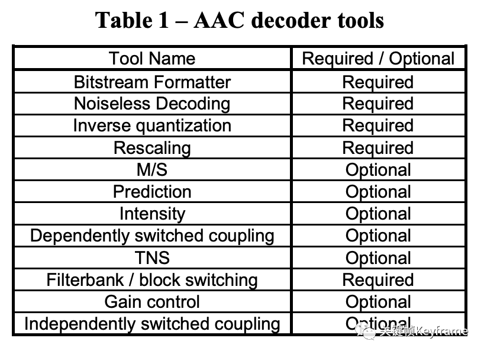

#### 1）**Bitstream Formatter，码流解析模块。**在解码时，该模块将 AAC 数据流分解为各个工具模块对应的数据模块，并为每个工具模块提供与该工具相关的比特流数据信息。这个模块的输出包括：

  * 无噪声编码频谱的分段信息

  * 无噪声编码频谱

  * Mid/Side 决策信息

  * 预测器状态信息

  * 强度立体声控制信息和耦合通道控制信息

  * 时域噪声修整（TNS）信息

  * 滤波器组控制信息

  * 增益控制信息

#### 2）**Noiseless Decoding，无噪编解码模块。**无噪编码就是哈夫曼编码，它的作用在于进一步减少尺度因子和量化后频谱的冗余，即将尺度因子和量化后的频谱信息进行哈夫曼编码。在解码时，该模块从码流解析模块获得输入的数据流，从中解码霍夫曼编码数据，并重建量化频谱、霍夫曼编码和 DPCM 编码的比例因子。

这个模块的输入包括：

  * 无噪声编码频谱的分段信息

  * 无噪声编码频谱

输出包括：

  * 比例因子的解码整数表示

  * 频谱的量化值

#### 3）**Inverse Quantization，量化和反量化模块。**在 AAC 编码中，逆量化频谱系数是由一个非均匀量化器来实现的，在解码中需进行其逆运算。在解码时，该模块将频谱的量化值转换为整数值来表示未缩放的重建频谱。此量化器是非均匀的量化器。通过对量化分析的良好控制，比特率能够被更高效地利用。在频域调整量化噪声的基本方法就是用尺度因子来进行噪声整形，尺度因子就是一个用来改变在一个尺度因子带的所有的频谱系数的振幅增益值，使用尺度因子这种机制是为了使用非均匀量化器在频域中改变量化噪声的比特分配。

这个模块的输入包括：

  * 频谱的量化值

输出包括：

  * 未缩放的，逆量化的频谱

4）**Rescaling，缩放因子处理模块。**解码时，该模块将比例因子的整数表示转换为实际值，然后将未缩放的逆量化频谱乘以相关比例因子。

这个模块的输入包括：

  * 比例因子的解码整数表示

  * 未缩放的，逆量化的频谱

输出包括：

  * 缩放后的逆量化的频谱

#### 5）**M/S，Mid/Side 立体声编解码模块。**是联合立体声编码（Joint Stereo）的一种方案，编码时兼顾了这两个声道的共同信息量。该模块基于 Mid/Side 决策信息将频谱对从 Mid/Side 模式转换为 Left/Right 模式，以提高编码效率。一般在左右声道信息相似度较高时使用，处理方式是将左右声道信息合并（L+R）得到新的一轨，再将左右声道信息相减（L-R）得到另外一轨，然后再将这两轨信息用心理声学模型和滤波器处理。

这个模块的输入包括：

  * Mid/Side 决策信息

  * 和声道关联的缩放后的逆量化的频谱

输出包括：

  * 在 M/S 解码之后，与声道对相关的缩放后的逆量化频谱

#### 6）**Prediction，预测模块。**解码时，该模块会在预测状态信息的控制下重新插入在编码时提取出的冗余信息。该模块实现为二阶后向自适应预测器。对音频信号进行预测可以减少重复冗余信号的处理，提高效率。

这个模块的输入包括：

  * 预测器状态信息

  * 缩放后的逆量化的频谱

输出包括：

  * 应用了预测的缩放后的逆量化的频谱

#### 7）**Intensity，强度立体声编解码模块。**是联合立体声编码（Joint Stereo）的一种方案，编码时兼顾了这两个声道的共同信息量。一般在低流量时使用，利用了人耳对于低频信号指向性分辨能力的不足，将音频信息中的低频分解出来合成单声道数据，剩余的高频信息则合成另一个单声道数据，并记录高频信息的位置数据来重建立体声效果。解码时，该模块对频谱对执行强度立体声解码。Mid/Side Stereo 和 Intensity Stereo 都有利用部分相位信息的损失来换得较高的音色数据信息。

这个模块的输入包括：

  * 逆量化的频谱

  * 强度立体声控制信息

输出包括：

  * 强度立体声道解码后的逆量化频谱

#### 8）**Dependently Switched Coupling，非独立交换耦合模块。**解码时，该模块基于耦合控制信息的指导，将非独立交换耦合声道中的相关数据添加到频谱中。

这个模块的输入包括：

  * 逆量化的频谱

  * 耦合控制信息

输出包括：

  * 和非独立交换耦合声道耦合的逆量化频谱

#### 9）**TNS，瞬时噪音整形模块。**该模块实现了对编码噪声的精细时间结构的控制。在编码时，TNS 处理过程会修整声音信号的时域包络。在解码时，该模块会基于TNS 信息的控制，在对应的逆处理过程中会还原实际的时域包络。这是通过对部分频谱数据进行滤波处理来实现的。这项神奇的技术可以通过在频率域上的预测，来修整时域上的量化噪音的分布。在一些特殊的语音和剧烈变化信号的量化上，TNS 技术对音质的提高贡献巨大。

这个模块的输入包括：

  * 逆量化的频谱

  * TNS 信息

输出包括：

  * 逆量化的频谱

#### 10）**Filterbank/Block Switching，滤波器组/块切换模块。**解码时，该模块应用了在编码器中执行的频率映射的逆函数。滤波器组工具使用了一个逆修正离散余弦变换（IMDCT），这个 IMDCT 可以配置为支持一组 128 或 1024，或四组 32 或 256 频谱系数。

这个模块的输入包括：

  * 逆量化的频谱

  * 滤波器组控制信息

输出包括：

  * 时域重建的音频信号

#### 11）**Gain Control，增益控制模块。**当输出时，该模块将单独的时域增益控制应用于已由编码器中的增益控制 PQF 滤波器组创建的 4 个频带中的每个频带。然后，它会组合 4 个频带，并通过增益控制工具的滤波器组来重建时间波形。该模块仅可用于 SSR(Scalable SampleRate) Profile。

这个模块的输入包括：

  * 时域重建的音频信号

  * 增益控制信息

输出包括：

  * 时域重建的音频信号

#### 12）**Independently Switched Coupling，独立交换耦合模块。**解码时，该模块基于耦合控制信息的指导，将独立交换耦合声道中的相关数据添加到时间信号中。

这个模块的输入包括：

  * 滤波器组输出的时间信号

  * 耦合控制信息

输出包括：

  * 和独立交换耦合声道耦合的时间信号

以上是 MPEG-2 AAC 各模块的介绍，在 MPEG－4 AAC 还新增了其他功能模块，比如：

1. **LTP（Long Term Prediction），长时预测模块。**它用来减少连续两个编码音框之间的信号冗余，对于处理低码率的语音非常有效。

2. **PNS（Perceptual Noise Substitution），知觉噪声替换模块。**当编码器发现类似噪音的信号时，并不对其进行量化，而是作个 标记就忽略过去，当解码时再还原出来，这样就提高了效率。在具体操作上，PNS 模块对每个尺度因子带侦测频率 4k Hz 以下的信号成分。如果这个信号既不是音调，在时间上也无强烈的能量变动，就被认为是噪声信号。其信号的音调及能量变化都在心理声学模型中算出。

3. **SBR（Spectral Band Replication），频段复制技术。**音乐的主要频谱集中在低频段，高频段幅度很小，但很重要，决定了音质。对整个频段编码时，若为保护高频就会造成低频段编码过细导致编码效率较低；若只保存低频的主要成分而丢掉高频成分又会损失音质。SBR把频谱切开，低频单独编码只保存主要成分，提高编码效率；高频单独放大编码，兼顾音质。

4. **PS（Parametric Stereo），参数立体声技术。**原本立体声双声道的编码输出是一个声道的两倍，但是两个声道的声音存在某种相似性。PS 存储一个声道的全部信息，然后花较少的字节用参数描述另一个声道的差异部分来提升编码效率。

ISO/IEC 13818-7 标准中 MPEG-2 AAC 的编码流程如图：

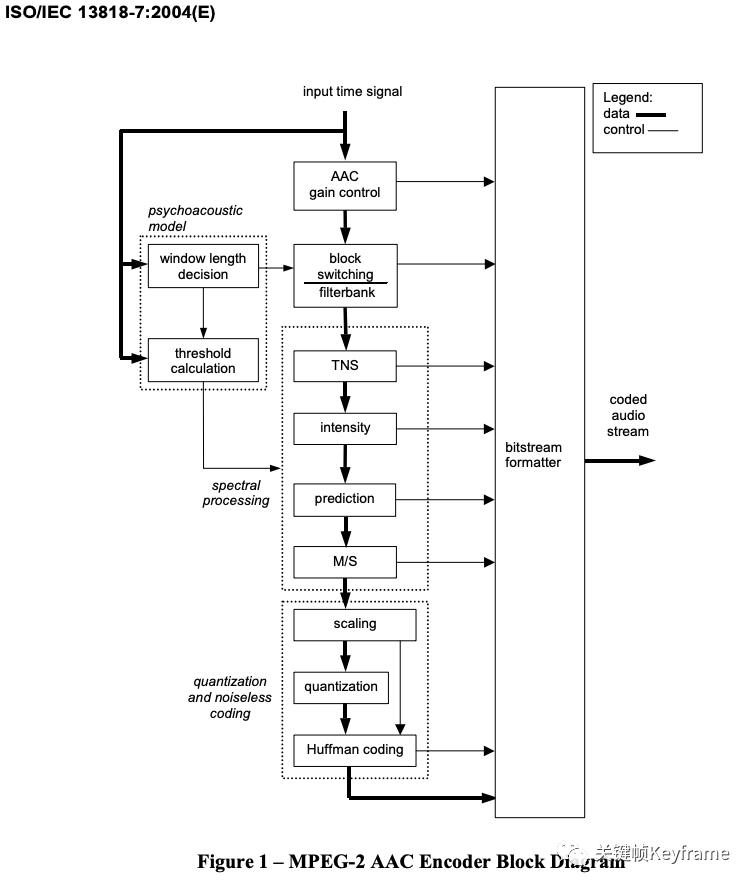

对应的 MPEG-2 AAC 的解码流程如图：

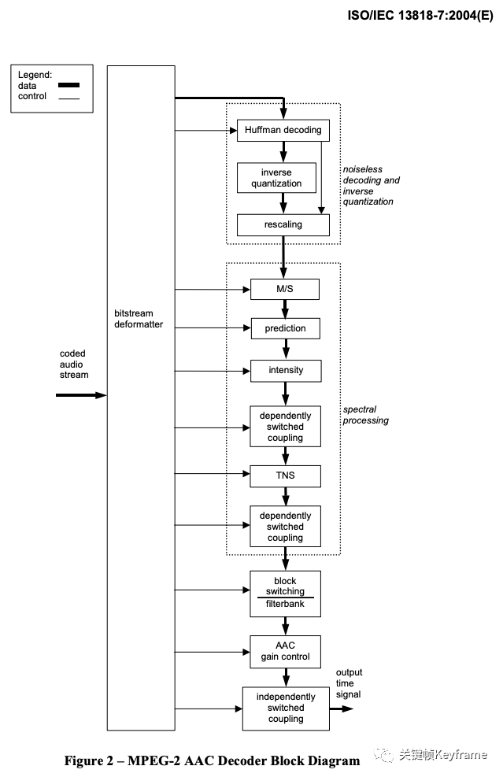

### 2.3、编码规格

为了能够适应于不同的应用场合，在 MPEG-2 AAC 标准中定义了三种不同编码规格：

1. **MPEG-2 AAC LC（Low Complexity），低复杂度规格。**用于要求在有限的存储空间和计算能力的条件下进行压缩场合。在这种框架中，没有预测和增益控制这两种工具，TNS 的阶数比较低。编码码率在 96kbps-192kbps 之间的可以用该规格。MP4 的音频部分常用该规格。

2. **MPEG-2 AAC Main，主规格。**具有最高的复杂度，可以用于存储量和计算能力都很充足的场合。在这种框架中，利用了除增益控制以外的所有编码工具来提高压缩效率。

3. **MPEG-2 AAC SSR（Scalable Sample Rate），可变采样率规格。**在这种框架中，使用了增益控制工具，但是预测和耦合工具是不被允许的，具有较低的带宽和 TNS 阶数。对于最低的一个 PQF 子带不使用增益控制工具。当带宽降低时，SSR 框架的复杂度也可降低，特别适应于网络带宽变化的场合。

Main 和 LC 框架是变化编码算法，采用 MDCT 作为其时/频分析模块，SSR 框架则采用混合滤波器组，先将信号等带宽地分成 4 个子带，再作 MDCT 变换。在三种方案里，通过选用不同模块在编码质量和编码算法复杂度之间进行折衷。

在 MPEG-4 AAC 标准中除了继承上面的三种规格进行改进外，还新增了三种编码规格：

1. **MPEG-4 AAC LC（Low Complexity），低复杂度规格。**

2. **MPEG-4 AAC Main，主规格。**

3. **MPEG-4 AAC SSR（Scalable Sample Rate），可变采样率规格。**

4. **MPEG-4 AAC LD（Low Delay），低延迟规格。**AAC是感知型音频编解码器，可以在较低的比特率下提供很高质量的主观音质。但是这样的编解码器在低比特率下的算法延时往往超过100ms，所以并不适合实时的双向通信。结合了感知音频编码和双向通信必须的低延时要求。可以保证最大 20ms 的算法延时和包括语音和音乐的信号的很好的音质。

5. **MPEG-4 AAC LTP（Long Term Predicition），长时预测规格。**在 Main Profile 的基础上增加了前向预测。

6. **MPEG-4 AAC HE（High Efficiency），高效率规格。**混合了 AAC 与 SBR（Spectral Band Replication，频段复制）技术。而新版本的 HE，即 HE v2 是 AAC 加上 SBR 和 PS（Parametric Stereo，参数立体声）技术。这样能在同样的效果上使用更低的码率。在编码码率为 32-96 Kbps 之间的音频文件时，建议首选这种规格。

### 2.4、AAC 格式

#### 2.4.1、Audio Object Types

MPEG-4 标准包含了多种 AAC 的版本，像上面提到的 AAC-LC、HE-AAC、AAC-LD 等等，在标准中定义了编解码工具模块、音频对象类型（Audio Object Types）、编码规格（Profiles）来指定编码器。其中**音频对象类型（Audio Object Types）是最主要的标记编码器的方式**。下图是常用的 MPEG-4 音频对象类型：

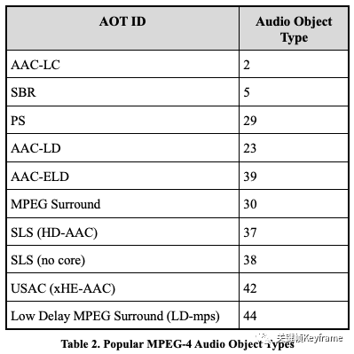

#### 2.4.2、Audio Specific Config

在传输和存储 MPEG-4 音频时，音频对象类型（Audio Object Types）和音频的基础信息（比如采样率、位深、声道）必须被编码，这些信息通常在AudioSpecificConfig 数据结构中来指定。**AudioSpecificConfig 的信息使得我们可以不用传输 AAC比特流就能让解码器理解音频的相关信息，这对于编解码器协商期间的设置很有用**，例如对于 SIP（Session Initiation Protocol，会话初始协议）或 SDP（Session Description Protocol，会话描述协议）的初始化设置。MPEG-2 不会指定 AudioSpecificConfig，所以它的 ADIF 和 ADTS 采用固定的 1024 个采样的长度。

AudioSpecificConfig 的结构如下：

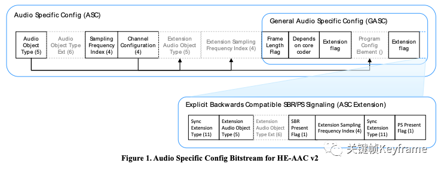

它包含了两部分内容：

  * 常规区域，包含了大部分 MPEG-4 音频规格的通用字段；

  * 特定区域，包含了不同音频对象类型（Audio Object Types）的特性字段。

比如，对于 AAC-LC、HE-AAC、AAC-LD 特定区域就会包含 GASpecificConfig 特性内容；对于 AAC-ELD 则包含 ELDSpecificConfig 特性内容；对于 xHE-AAC(USAC) 则包含 UsacConfig 特性内容。

#### 2.4.3、数据格式

MPEG-4 的传输或存储格式一般都包含 Raw Data Blocks 或 Access Units，其中装载的是实际的音频编码数据的比特流。这些比特流又通过灵活的方式被分为代表不同声道的部分。取到这些数据后，我们就要进一步解析它们的数据格式了。

MPEG-2 AAC 的音频编码数据格式有以下两种：

1. **ADIF（Audio Data Interchange Format），音频数据交换格式。**这种格式的特征是可以确定的找到这个音频数据的开始，不需进行在音频数据流中间开始的解码，即它的解码必须在明确定义的开始处进行。这种格式常用在文件存储中。

2. **ADTS（Audio Data Transport Stream），音频数据传输流。**这种格式的特征是它是一个有同步字的比特流，解码可以在这个流中任何位置开始。这种格式适用于传输流。

MPEG-4 AAC 又增加了两种音频编码数据格式，新增的格式不仅针对传统的 AAC，还针对新的变体：AAC-LD、AAC-ELD。

1. **LATM（Low-overhead MPEG-4 Audio Transport Multiplex）。**这种格式有独立的比特流，允许使用 MPEG-4 中的错误恢复语法。

2. **LOAS（Low Overhead Audio Stream）。**这种格式是带有同步信息的 LATM，可以支持随机访问或跳过。

下图展示了各种 AAC 传输格式的重要特性对比：

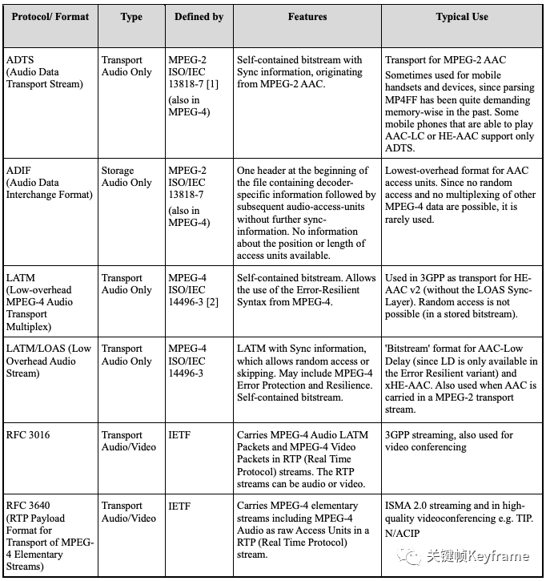

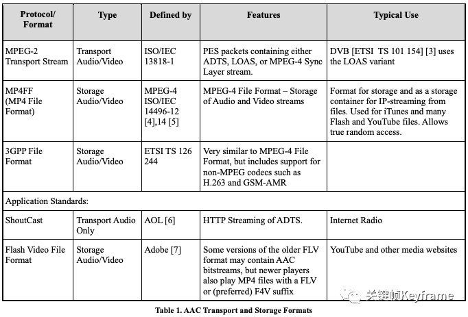

ADIF 格式的结构大体如下：

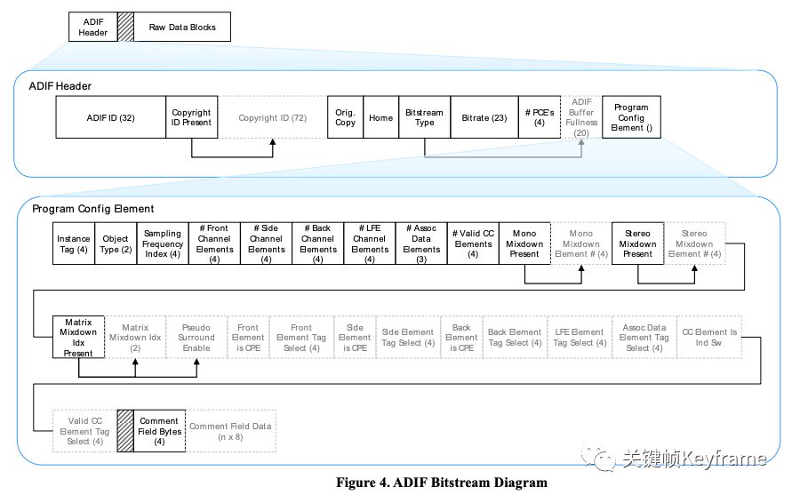

ADTS 格式的组成单元是 ADTS Frame。它的结构大体如下：

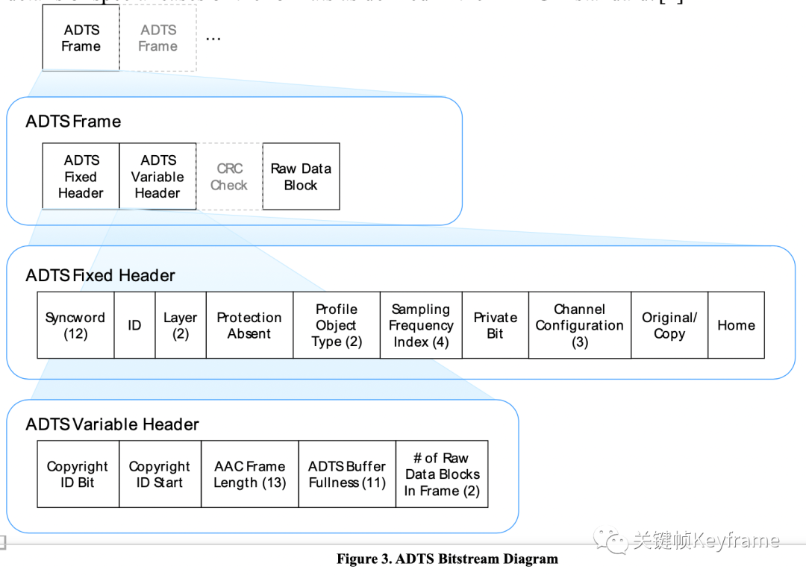  

LOAS 格式的结构大体如下：

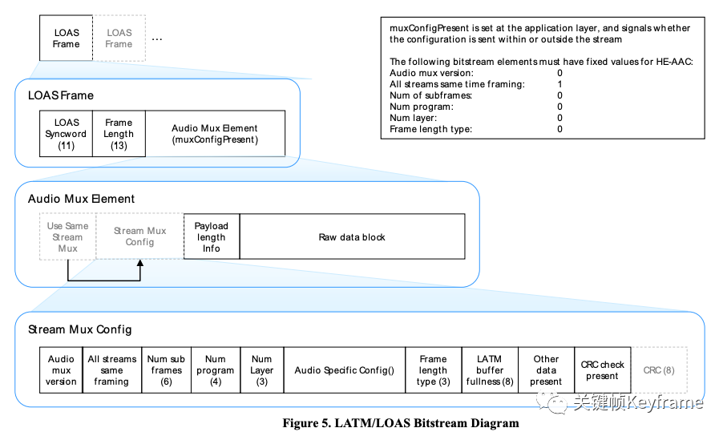

## 本文参考  

1. [AAC 音频解析](https://charleswyt.github.io/2018/09/04/AAC%E9%9F%B3%E9%A2%91%E8%A7%A3%E6%9E%90/)
2. [AAC 编解码原理概述](https://blog.csdn.net/qinglongzhan/article/details/80972174)
3. [什么是 Mid/Side 音频处理？](https://exound.com/articles/8c48188c-9975-4259-ab73-1b910effa748)
4. [视频压缩编码和音频压缩编码的基本原理](https://blog.csdn.net/leixiaohua1020/article/details/28114081)
5. [音频冗余的主要表现形式](https://www.xunwei.tm/service/technical415.html)

